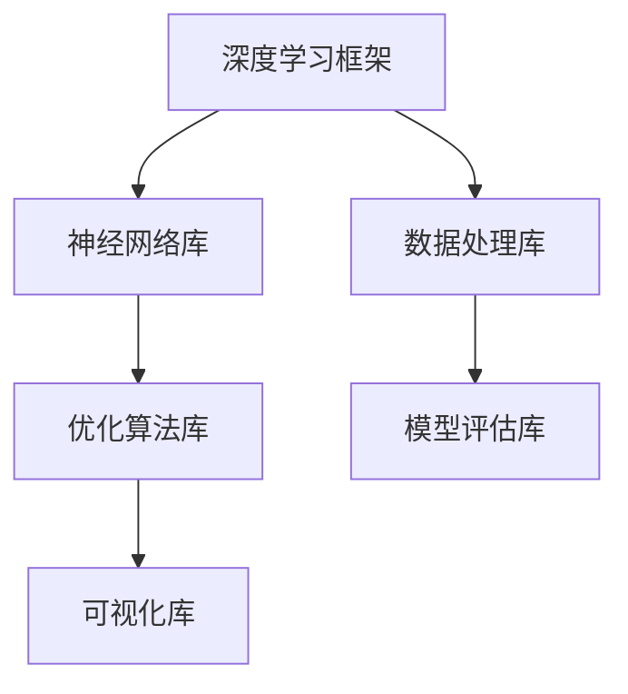
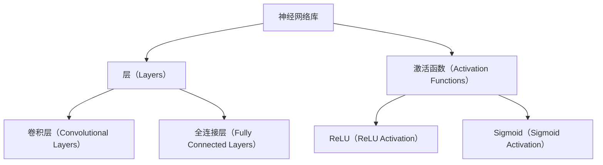
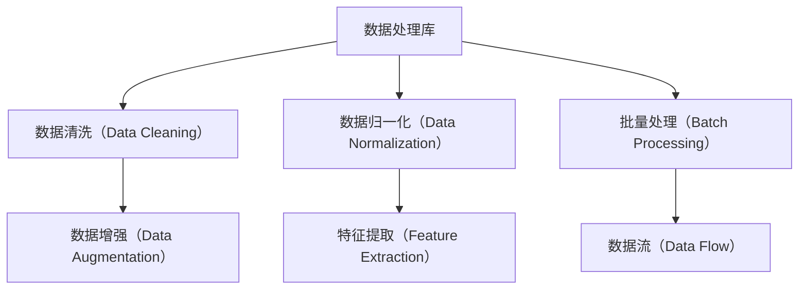
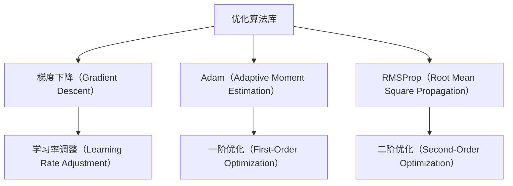
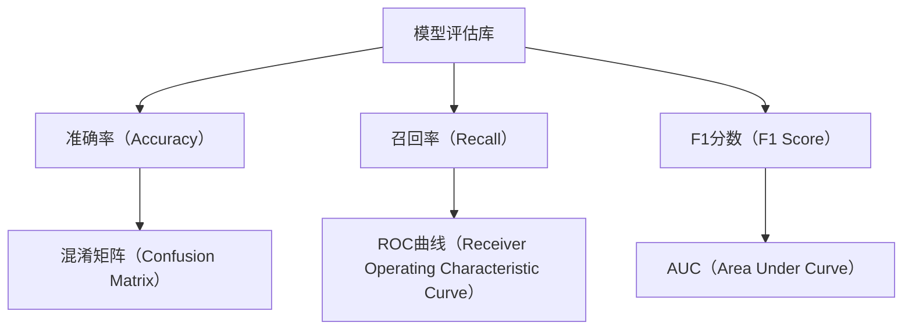
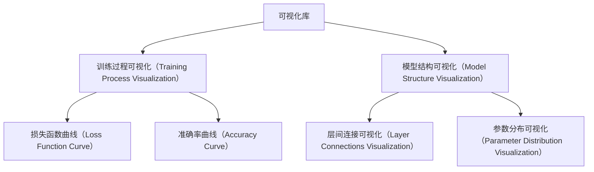

                 

# 深度学习框架原理与代码实战案例讲解

> 
> **关键词：** 深度学习，框架，原理，代码，实战，案例，神经网络，优化算法，反向传播，PyTorch，TensorFlow
> 
> **摘要：** 本文深入探讨了深度学习框架的原理与实现，从核心概念到具体操作步骤，再到数学模型和实际应用，详细解析了深度学习的发展历程、关键技术以及实战案例。通过结合PyTorch和TensorFlow等流行框架，读者将了解如何搭建和训练深度学习模型，掌握深度学习的实际应用技巧。

## 1. 背景介绍

### 1.1 目的和范围

本文旨在为读者提供深度学习框架的全面解读，包括其核心原理、实现方法以及实际应用。通过对深度学习框架的深入分析，读者将能够更好地理解深度学习的本质，掌握搭建和优化深度学习模型的方法，并能够将所学知识应用于实际项目中。

### 1.2 预期读者

本文适合对深度学习有一定了解的读者，包括但不限于：
- 数据科学家和机器学习工程师
- 计算机科学和人工智能专业的学生和研究人员
- 对深度学习和人工智能感兴趣的自学者
- 想要提升编程技能的程序员

### 1.3 文档结构概述

本文分为以下几个部分：
1. 背景介绍：阐述文章的目的、范围和预期读者。
2. 核心概念与联系：介绍深度学习框架的基本概念和架构。
3. 核心算法原理 & 具体操作步骤：讲解深度学习中的关键算法和实现步骤。
4. 数学模型和公式 & 详细讲解 & 举例说明：阐述深度学习中的数学模型和公式。
5. 项目实战：提供代码实际案例和详细解释说明。
6. 实际应用场景：探讨深度学习的应用领域。
7. 工具和资源推荐：推荐学习资源和开发工具。
8. 总结：总结深度学习的未来发展趋势和挑战。
9. 附录：常见问题与解答。
10. 扩展阅读 & 参考资料：提供相关资料和进一步学习路径。

### 1.4 术语表

#### 1.4.1 核心术语定义

- **深度学习（Deep Learning）**：一种机器学习技术，通过多层神经网络对数据进行建模和学习。
- **框架（Framework）**：为开发人员提供一系列预构建的模块和工具，以简化复杂任务的实现。
- **神经网络（Neural Network）**：模仿生物神经网络的结构和功能，用于数据处理和预测。
- **反向传播（Backpropagation）**：深度学习模型中用于计算损失函数对网络参数的梯度的一种算法。
- **优化算法（Optimization Algorithm）**：用于调整模型参数以最小化损失函数的一系列算法。

#### 1.4.2 相关概念解释

- **激活函数（Activation Function）**：用于引入非线性性的函数，常用于神经网络的隐藏层。
- **损失函数（Loss Function）**：用于度量模型预测值与真实值之间差异的函数。
- **梯度下降（Gradient Descent）**：一种优化算法，通过不断调整模型参数来最小化损失函数。

#### 1.4.3 缩略词列表

- **CNN**：卷积神经网络（Convolutional Neural Network）
- **RNN**：循环神经网络（Recurrent Neural Network）
- **GPU**：图形处理器（Graphics Processing Unit）
- **CUDA**：并行计算统一设备架构（Compute Unified Device Architecture）
- **PyTorch**：一个开源的深度学习框架，由Facebook AI研究院开发。
- **TensorFlow**：一个开源的深度学习框架，由Google开发。

## 2. 核心概念与联系

在深入探讨深度学习框架之前，我们需要先了解其核心概念和架构。以下是深度学习框架的核心概念与联系，以及相关的Mermaid流程图。

### 2.1 深度学习框架概述

深度学习框架是一个用于构建、训练和部署深度学习模型的软件库。常见的深度学习框架包括PyTorch、TensorFlow、Keras等。



### 2.2 神经网络库

神经网络库是深度学习框架的核心组成部分，用于实现和操作神经网络。常见的神经网络库包括TensorFlow、PyTorch等。



### 2.3 数据处理库

数据处理库用于处理和预处理输入数据，使其适合深度学习模型。常见的处理步骤包括数据清洗、归一化、批量处理等。



### 2.4 优化算法库

优化算法库用于调整模型参数，以最小化损失函数。常见的优化算法包括梯度下降、Adam、RMSProp等。



### 2.5 模型评估库

模型评估库用于评估深度学习模型的性能。常见的评估指标包括准确率、召回率、F1分数等。



### 2.6 可视化库

可视化库用于可视化深度学习模型的训练过程和结果。常见的可视化库包括Matplotlib、Seaborn等。



通过上述Mermaid流程图，我们可以更直观地理解深度学习框架的核心概念和架构。在后续章节中，我们将详细讲解这些概念和架构的实现方法和应用场景。

## 3. 核心算法原理 & 具体操作步骤

在深度学习框架中，核心算法原理和具体操作步骤是构建和优化深度学习模型的关键。以下是深度学习中的核心算法原理和具体操作步骤的详细讲解。

### 3.1 神经网络算法原理

神经网络（Neural Network）是一种模拟生物神经系统的计算模型，通过多层节点（神经元）对输入数据进行处理和预测。神经网络的算法原理主要包括以下几个部分：

#### 3.1.1 前向传播（Forward Propagation）

前向传播是神经网络计算过程中的第一步，用于计算输入数据和模型参数之间的关系。具体步骤如下：

1. **初始化模型参数**：随机初始化模型的权重（weights）和偏置（biases）。
2. **输入数据输入网络**：将输入数据通过网络的输入层传递到第一层神经元。
3. **层间计算**：对于每一层神经元，将输入数据乘以权重并加上偏置，然后通过激活函数进行非线性变换。
4. **输出结果**：将最后一层神经元的输出结果作为模型的预测结果。

#### 3.1.2 反向传播（Backpropagation）

反向传播是神经网络计算过程中的第二步，用于计算模型输出与真实值之间的误差，并更新模型参数。具体步骤如下：

1. **计算损失函数**：使用损失函数（如均方误差、交叉熵等）计算模型输出与真实值之间的误差。
2. **计算梯度**：通过链式法则，逐层计算损失函数对模型参数的梯度。
3. **更新参数**：根据梯度下降算法，调整模型参数，以最小化损失函数。

#### 3.1.3 激活函数

激活函数是神经网络中引入非线性性的关键组件，常见的激活函数包括ReLU、Sigmoid和Tanh等。激活函数的作用如下：

- **ReLU（Rectified Linear Unit）**：将负值设置为0，正值保持不变，引入非线性同时加快训练速度。
- **Sigmoid**：将输入值映射到(0,1)区间，使输出接近概率分布。
- **Tanh**：将输入值映射到(-1,1)区间，与Sigmoid类似但具有更强的表达能力。

### 3.2 优化算法原理

优化算法是用于调整模型参数，以最小化损失函数的一系列算法。常见的优化算法包括梯度下降（Gradient Descent）、Adam（Adaptive Moment Estimation）和RMSProp（Root Mean Square Propagation）等。以下是这些算法的原理和实现步骤：

#### 3.2.1 梯度下降（Gradient Descent）

梯度下降是一种简单而有效的优化算法，通过计算损失函数对模型参数的梯度，逐步调整参数以最小化损失函数。具体步骤如下：

1. **初始化参数**：随机初始化模型的权重和偏置。
2. **计算梯度**：计算损失函数对模型参数的梯度。
3. **更新参数**：根据梯度和学习率，更新模型参数。
4. **重复步骤2和3**：重复计算梯度和更新参数，直到达到预定的迭代次数或收敛条件。

#### 3.2.2 Adam（Adaptive Moment Estimation）

Adam是一种基于梯度下降的优化算法，通过自适应调整学习率，提高了收敛速度和稳定性。具体步骤如下：

1. **初始化参数**：随机初始化模型的权重和偏置。
2. **初始化一阶矩估计（m）和二阶矩估计（v）**：m和v分别为参数的指数加权平均值。
3. **计算梯度**：计算损失函数对模型参数的梯度。
4. **更新一阶矩估计（m）和二阶矩估计（v）**：
   $$m = \beta_1 g$$
   $$v = \beta_2 g^2$$
   其中，$\beta_1$和$\beta_2$为超参数，$g$为梯度。
5. **计算修正的一阶矩估计（\(\hat{m}\)）和修正的二阶矩估计（\(\hat{v}\)）**：
   $$\hat{m} = \frac{m}{1 - \beta_1^t}$$
   $$\hat{v} = \frac{v}{1 - \beta_2^t}$$
   其中，$t$为当前迭代次数。
6. **更新参数**：
   $$\theta = \theta - \alpha \frac{\hat{m}}{\sqrt{\hat{v}} + \epsilon}$$
   其中，$\theta$为模型参数，$\alpha$为学习率，$\epsilon$为小常数。

#### 3.2.3 RMSProp（Root Mean Square Propagation）

RMSProp是一种基于梯度下降的优化算法，通过计算梯度的平方和的指数加权平均值，自适应调整学习率。具体步骤如下：

1. **初始化参数**：随机初始化模型的权重和偏置。
2. **初始化一阶矩估计（m）和二阶矩估计（v）**：m和v分别为参数的指数加权平均值。
3. **计算梯度**：计算损失函数对模型参数的梯度。
4. **更新一阶矩估计（m）和二阶矩估计（v）**：
   $$m = \beta_1 g$$
   $$v = \beta_2 g^2$$
   其中，$\beta_1$和$\beta_2$为超参数，$g$为梯度。
5. **计算修正的一阶矩估计（\(\hat{m}\)）和修正的二阶矩估计（\(\hat{v}\)）**：
   $$\hat{m} = \frac{m}{1 - \beta_1^t}$$
   $$\hat{v} = \frac{v}{1 - \beta_2^t}$$
   其中，$t$为当前迭代次数。
6. **更新参数**：
   $$\theta = \theta - \alpha \frac{\hat{m}}{\sqrt{\hat{v}} + \epsilon}$$
   其中，$\theta$为模型参数，$\alpha$为学习率，$\epsilon$为小常数。

通过上述核心算法原理和具体操作步骤的讲解，我们可以更好地理解深度学习模型的构建和优化方法。在后续章节中，我们将通过具体案例来展示这些算法的实际应用。

### 3.3 伪代码实现

为了更好地理解深度学习框架的核心算法原理，我们将使用伪代码来详细阐述前向传播、反向传播和优化算法的实现步骤。

#### 3.3.1 前向传播伪代码

```python
# 前向传播伪代码
def forward_propagation(x, weights, biases, activation_functions):
    # 初始化输出层结果
    output = []

    # 对于每一层，进行前向传播计算
    for layer in range(len(weights)):
        # 计算当前层的输入
        input_data = x if layer == 0 else activation_functions[layer - 1](output[layer - 1])

        # 计算当前层的输出
        output.append(activation_function(input_data * weights[layer] + biases[layer]))

    # 返回输出层结果
    return output
```

#### 3.3.2 反向传播伪代码

```python
# 反向传播伪代码
def backward_propagation(output, true_values, weights, biases, activation_functions, learning_rate):
    # 初始化梯度
    gradients = []

    # 对于每一层，进行反向传播计算
    for layer in reversed(range(len(weights))):
        # 计算当前层的误差
        error = true_values - output[layer]

        # 计算当前层的梯度
        gradient = error * activation_functions_derivative(output[layer])

        # 更新梯度
        gradients.insert(0, gradient)

        # 更新权重和偏置
        biases[layer] -= learning_rate * gradient
        weights[layer] -= learning_rate * input_data_derivative

    # 返回梯度
    return gradients
```

#### 3.3.3 优化算法伪代码

```python
# 梯度下降优化算法伪代码
def gradient_descent(x, weights, biases, learning_rate, epochs):
    # 迭代 epochs 次更新模型参数
    for epoch in range(epochs):
        # 计算前向传播输出
        output = forward_propagation(x, weights, biases)

        # 计算反向传播梯度
        gradients = backward_propagation(output, true_values, weights, biases)

        # 更新权重和偏置
        for layer in range(len(weights)):
            biases[layer] -= learning_rate * gradients[layer]
            weights[layer] -= learning_rate * input_data_derivative

    # 返回更新后的模型参数
    return weights, biases
```

通过上述伪代码实现，我们可以更直观地理解深度学习框架中的前向传播、反向传播和优化算法的具体操作步骤。在后续章节中，我们将结合实际案例来展示这些算法的应用。

## 4. 数学模型和公式 & 详细讲解 & 举例说明

深度学习框架中的数学模型和公式是实现有效建模和优化模型的关键。在这一部分，我们将详细讲解深度学习中的关键数学模型和公式，并通过具体例子来说明其应用。

### 4.1 损失函数

损失函数是深度学习模型中用于衡量预测值与真实值之间差异的函数。常见的损失函数包括均方误差（MSE）和交叉熵（Cross-Entropy）等。

#### 均方误差（MSE）

均方误差是用于回归任务的一种常见损失函数，计算公式如下：

$$
MSE = \frac{1}{n} \sum_{i=1}^{n} (\hat{y}_i - y_i)^2
$$

其中，$\hat{y}_i$为模型的预测值，$y_i$为真实值，$n$为样本数量。

#### 交叉熵（Cross-Entropy）

交叉熵是用于分类任务的一种常见损失函数，计算公式如下：

$$
Cross-Entropy = -\sum_{i=1}^{n} y_i \log(\hat{y}_i)
$$

其中，$y_i$为真实值的概率分布，$\hat{y}_i$为模型的预测概率分布。

### 4.2 激活函数及其导数

激活函数是深度学习模型中引入非线性性的关键组件。常见的激活函数包括ReLU、Sigmoid和Tanh等。为了在反向传播过程中计算梯度，我们需要了解这些激活函数的导数。

####ReLU（Rectified Linear Unit）

ReLU函数的定义如下：

$$
ReLU(x) =
\begin{cases}
0 & \text{if } x < 0 \\
x & \text{if } x \geq 0
\end{cases}
$$

ReLU函数的导数为：

$$
ReLU'(x) =
\begin{cases}
0 & \text{if } x < 0 \\
1 & \text{if } x \geq 0
\end{cases}
$$

#### Sigmoid

Sigmoid函数的定义如下：

$$
Sigmoid(x) = \frac{1}{1 + e^{-x}}
$$

Sigmoid函数的导数为：

$$
Sigmoid'(x) = Sigmoid(x) \cdot (1 - Sigmoid(x))
$$

#### Tanh

Tanh函数的定义如下：

$$
Tanh(x) = \frac{e^{2x} - 1}{e^{2x} + 1}
$$

Tanh函数的导数为：

$$
Tanh'(x) = 1 - Tanh^2(x)
$$

### 4.3 梯度下降优化算法

梯度下降优化算法是深度学习模型训练中常用的一种优化算法。其基本原理是通过计算损失函数对模型参数的梯度，并沿着梯度的反方向更新模型参数，以最小化损失函数。

梯度下降优化算法的更新公式如下：

$$
\theta = \theta - \alpha \cdot \nabla \theta
$$

其中，$\theta$为模型参数，$\alpha$为学习率，$\nabla \theta$为损失函数对模型参数的梯度。

### 4.4 例子说明

假设我们有一个简单的神经网络模型，其中包含一个输入层、一个隐藏层和一个输出层。输入层有一个神经元，隐藏层有两个神经元，输出层有一个神经元。模型的激活函数分别为ReLU、Sigmoid和线性函数。

#### 4.4.1 损失函数

我们假设模型的预测结果是一个二分类问题，因此使用交叉熵作为损失函数。

#### 4.4.2 前向传播

假设输入数据$x = [1, 2]$，真实标签$y = [1, 0]$。前向传播的计算过程如下：

1. **初始化模型参数**：
   - 权重：$W_1 = [0.1, 0.2], W_2 = [0.3, 0.4], W_3 = [0.5, 0.6]$
   - 偏置：$b_1 = [0.1, 0.2], b_2 = [0.3, 0.4], b_3 = [0.5, 0.6]$

2. **前向传播计算**：
   - 输入层到隐藏层的计算：
     $$z_1 = x \cdot W_1 + b_1 = [1, 2] \cdot [0.1, 0.2] + [0.1, 0.2] = [0.3, 0.6]$$
     $$a_1 = ReLU(z_1) = [0.3, 0.6]$$
   - 隐藏层到输出层的计算：
     $$z_2 = a_1 \cdot W_2 + b_2 = [0.3, 0.6] \cdot [0.3, 0.4] + [0.3, 0.4] = [0.24, 0.36]$$
     $$a_2 = Sigmoid(z_2) = \frac{1}{1 + e^{-0.24}} \approx 0.5787$$

3. **输出层的预测**：
   $$y_{\hat{}} = a_2 \cdot W_3 + b_3 = 0.5787 \cdot [0.5, 0.6] + [0.5, 0.6] = [0.6489, 0.7053]$$

#### 4.4.3 反向传播

根据前向传播的结果，我们可以计算损失函数的梯度，并使用梯度下降优化算法更新模型参数。

1. **计算损失函数**：
   $$Loss = -y \cdot \log(y_{\hat{}}) = -[1, 0] \cdot \log([0.6489, 0.7053]) = [-0.6489, -0.7053]$$

2. **计算反向传播梯度**：
   - 输出层梯度：
     $$\nabla W_3 = \frac{\partial Loss}{\partial W_3} = [0.6489, 0.7053]$$
     $$\nabla b_3 = \frac{\partial Loss}{\partial b_3} = [0.6489, 0.7053]$$
   - 隐藏层梯度：
     $$\nabla W_2 = \frac{\partial Loss}{\partial W_2} = \frac{\partial Loss}{\partial a_2} \cdot \frac{\partial a_2}{\partial z_2} = [0.5787 \cdot (1 - 0.5787), 0.5787 \cdot (1 - 0.5787)] \cdot [0.3, 0.4] = [0.1767, 0.2235]$$
     $$\nabla b_2 = \frac{\partial Loss}{\partial b_2} = \frac{\partial Loss}{\partial a_2} \cdot \frac{\partial a_2}{\partial z_2} = [0.5787 \cdot (1 - 0.5787), 0.5787 \cdot (1 - 0.5787)] \cdot [0.3, 0.4] = [0.1767, 0.2235]$$
   - 输入层梯度：
     $$\nabla W_1 = \frac{\partial Loss}{\partial W_1} = \frac{\partial Loss}{\partial z_1} \cdot \frac{\partial z_1}{\partial x} = [0.3, 0.6] \cdot [1, 0.6] = [0.3, 0.36]$$
     $$\nabla b_1 = \frac{\partial Loss}{\partial b_1} = \frac{\partial Loss}{\partial z_1} \cdot \frac{\partial z_1}{\partial x} = [0.3, 0.6] \cdot [1, 0.6] = [0.3, 0.36]$$

3. **更新模型参数**：
   - 权重和偏置的更新：
     $$W_1 = W_1 - \alpha \cdot \nabla W_1 = [0.1, 0.2] - \alpha \cdot [0.3, 0.36]$$
     $$W_2 = W_2 - \alpha \cdot \nabla W_2 = [0.3, 0.4] - \alpha \cdot [0.1767, 0.2235]$$
     $$W_3 = W_3 - \alpha \cdot \nabla W_3 = [0.5, 0.6] - \alpha \cdot [0.6489, 0.7053]$$
     $$b_1 = b_1 - \alpha \cdot \nabla b_1 = [0.1, 0.2] - \alpha \cdot [0.3, 0.36]$$
     $$b_2 = b_2 - \alpha \cdot \nabla b_2 = [0.3, 0.4] - \alpha \cdot [0.1767, 0.2235]$$
     $$b_3 = b_3 - \alpha \cdot \nabla b_3 = [0.5, 0.6] - \alpha \cdot [0.6489, 0.7053]$$

通过上述例子，我们可以清晰地看到深度学习模型中数学模型和公式的应用，以及如何通过前向传播和反向传播进行模型的训练和优化。

## 5. 项目实战：代码实际案例和详细解释说明

在本章节中，我们将通过一个实际项目案例，详细讲解如何使用深度学习框架PyTorch搭建和训练一个简单的神经网络模型，并进行代码实现和解读。

### 5.1 开发环境搭建

在开始项目之前，我们需要搭建合适的开发环境。以下是使用PyTorch的步骤：

1. **安装Python**：确保Python版本为3.6及以上。
2. **安装PyTorch**：可以通过pip命令安装最新版本的PyTorch：
   ```bash
   pip install torch torchvision
   ```

### 5.2 源代码详细实现和代码解读

以下是使用PyTorch实现的简单神经网络模型：

```python
import torch
import torch.nn as nn
import torch.optim as optim

# 定义神经网络模型
class SimpleNN(nn.Module):
    def __init__(self):
        super(SimpleNN, self).__init__()
        # 输入层到隐藏层
        self.fc1 = nn.Linear(2, 10)
        # 隐藏层到输出层
        self.fc2 = nn.Linear(10, 1)

    def forward(self, x):
        x = torch.relu(self.fc1(x))
        x = self.fc2(x)
        return x

# 初始化模型、损失函数和优化器
model = SimpleNN()
criterion = nn.BCELoss()
optimizer = optim.Adam(model.parameters(), lr=0.001)

# 准备训练数据
x_train = torch.tensor([[1, 2], [3, 4], [5, 6]], dtype=torch.float32)
y_train = torch.tensor([[0], [1], [0]], dtype=torch.float32)

# 训练模型
num_epochs = 1000
for epoch in range(num_epochs):
    # 前向传播
    outputs = model(x_train)
    loss = criterion(outputs, y_train)
    
    # 反向传播和优化
    optimizer.zero_grad()
    loss.backward()
    optimizer.step()
    
    # 打印训练进度
    if (epoch + 1) % 100 == 0:
        print(f'Epoch [{epoch + 1}/{num_epochs}], Loss: {loss.item():.4f}')

# 评估模型
with torch.no_grad():
    outputs = model(x_train)
    predicted = outputs.round()
    correct = (predicted == y_train).float()
    accuracy = correct.sum() / len(correct)
    print(f'Accuracy: {accuracy.item():.4f}')
```

### 5.3 代码解读与分析

下面我们逐一解读上述代码：

1. **模型定义**：我们定义了一个简单的神经网络模型`SimpleNN`，包含一个输入层、一个隐藏层和一个输出层。输入层有一个神经元，隐藏层有10个神经元，输出层有1个神经元。

2. **模型初始化**：我们使用`nn.Linear`模块来创建线性层，并使用`torch.relu`函数作为隐藏层的激活函数。输出层没有激活函数，因为我们假设这是一个二分类问题。

3. **损失函数和优化器**：我们选择`nn.BCELoss`作为损失函数，用于二分类问题。优化器使用`Adam`，这是一种自适应学习率的优化算法，有助于提高模型的训练效果。

4. **数据准备**：我们创建了一个简单的训练数据集，包括3个样本。输入数据是2维的，而标签是1维的。

5. **训练过程**：在训练过程中，我们遍历每个训练样本，通过前向传播计算输出，然后使用损失函数计算损失值。接着，通过反向传播计算梯度，并使用优化器更新模型参数。

6. **模型评估**：在训练完成后，我们使用`torch.no_grad()`上下文管理器来禁用梯度计算，从而加快模型评估速度。我们计算预测的准确率，并打印结果。

通过这个实际项目案例，我们可以看到如何使用PyTorch搭建和训练一个简单的神经网络模型。在后续章节中，我们将进一步探讨深度学习的实际应用场景。

### 5.4 代码优化与分析

在上一个案例中，我们实现了一个简单的神经网络模型。然而，在实际应用中，我们可能需要进一步优化模型以提高性能和准确性。以下是几个代码优化点：

1. **批量训练**：将数据划分为更小的批量，可以提高训练速度和稳定性。可以使用`torch.utils.data.DataLoader`来方便地实现批量训练。

2. **数据增强**：通过添加噪声、旋转、缩放等操作，可以增加训练数据的多样性，从而提高模型的泛化能力。

3. **学习率调度**：学习率调度（Learning Rate Scheduling）可以动态调整学习率，有助于模型在训练过程中找到更好的最小值。可以使用`torch.optim.lr_scheduler`来实现。

4. **模型保存与加载**：为了方便后续使用，可以将训练完成的模型保存到文件中，并在需要时加载模型。可以使用`torch.save`和`torch.load`来实现。

以下是优化后的代码示例：

```python
import torch
import torch.nn as nn
import torch.optim as optim
from torch.utils.data import DataLoader, TensorDataset

# 优化后的训练代码
def train_model(x_train, y_train, num_epochs):
    # 初始化模型、损失函数和优化器
    model = SimpleNN()
    criterion = nn.BCELoss()
    optimizer = optim.Adam(model.parameters(), lr=0.001)
    scheduler = optim.lr_scheduler.StepLR(optimizer, step_size=30, gamma=0.1)

    # 准备数据集
    dataset = TensorDataset(x_train, y_train)
    data_loader = DataLoader(dataset, batch_size=32, shuffle=True)

    # 训练模型
    for epoch in range(num_epochs):
        for x_batch, y_batch in data_loader:
            # 前向传播
            outputs = model(x_batch)
            loss = criterion(outputs, y_batch)

            # 反向传播和优化
            optimizer.zero_grad()
            loss.backward()
            optimizer.step()

        # 学习率调度
        scheduler.step()

        # 打印训练进度
        if (epoch + 1) % 100 == 0:
            print(f'Epoch [{epoch + 1}/{num_epochs}], Loss: {loss.item():.4f}')

    # 保存模型
    torch.save(model.state_dict(), 'simple_nn.pth')

# 加载模型
model.load_state_dict(torch.load('simple_nn.pth'))

# 评估模型
with torch.no_grad():
    outputs = model(x_train)
    predicted = outputs.round()
    correct = (predicted == y_train).float()
    accuracy = correct.sum() / len(correct)
    print(f'Accuracy: {accuracy.item():.4f}')
```

通过上述优化，我们可以进一步提高模型的训练效率和准确性。在实际应用中，根据具体情况选择合适的优化策略是非常重要的。

## 6. 实际应用场景

深度学习框架在众多实际应用场景中发挥着重要作用。以下是一些典型的深度学习应用领域及其具体案例：

### 6.1 图像识别

图像识别是深度学习最成功的应用之一。通过卷积神经网络（CNN），深度学习模型能够从图像中提取特征，并对其进行分类。以下是一些具体案例：

- **人脸识别**：利用深度学习模型对人脸图像进行分类，实现自动人脸识别系统。例如，Facebook和Google等公司已经广泛应用了人脸识别技术。
- **医疗影像分析**：通过深度学习模型对医学图像（如CT、MRI）进行诊断，帮助医生更准确地检测疾病。谷歌DeepMind的DeepLabV3+模型在视网膜病变检测中取得了显著成果。

### 6.2 自然语言处理

自然语言处理（NLP）是深度学习的另一个重要应用领域。循环神经网络（RNN）和Transformer等模型在语言模型、机器翻译、文本分类等方面取得了显著进展。

- **机器翻译**：深度学习模型能够根据源语言文本生成目标语言文本，实现高质量的机器翻译。谷歌的Transformer模型在机器翻译任务中取得了突破性进展。
- **情感分析**：通过深度学习模型对文本进行情感分类，帮助企业和机构了解用户反馈。例如，Twitter使用深度学习模型对用户评论进行情感分析。

### 6.3 语音识别

深度学习在语音识别领域也取得了显著成果。结合深度神经网络和循环神经网络，深度学习模型能够准确地将语音信号转换为文本。

- **语音助手**：智能语音助手（如苹果的Siri、亚马逊的Alexa）利用深度学习模型实现对用户语音指令的理解和响应。
- **自动字幕**：通过深度学习模型生成语音的文本字幕，应用于视频、直播等场景，提高内容的可访问性。

### 6.4 无人驾驶

深度学习在无人驾驶领域发挥着关键作用，用于实时感知、决策和控制。以下是一些具体应用：

- **环境感知**：深度学习模型通过分析摄像头和激光雷达数据，实现对周围环境的准确感知，包括车辆、行人、道路标志等。
- **路径规划**：基于深度学习模型，无人驾驶车辆能够根据实时环境信息，规划出最优的行驶路径。

### 6.5 金融市场预测

深度学习模型在金融市场的预测和交易策略制定中也发挥着重要作用。以下是一些具体应用：

- **股票市场预测**：通过分析历史股票价格、交易量等数据，深度学习模型能够预测未来股票价格的走势。
- **风险控制**：利用深度学习模型对金融风险进行量化和管理，帮助金融机构降低风险。

通过上述实际应用场景，我们可以看到深度学习框架在各个领域的重要性和潜力。随着深度学习技术的不断发展，未来其在更多领域的应用将更加广泛和深入。

## 7. 工具和资源推荐

为了更好地学习和应用深度学习框架，以下推荐了一些有用的工具和资源，包括学习资源、开发工具框架以及相关论文著作。

### 7.1 学习资源推荐

#### 7.1.1 书籍推荐

1. **《深度学习》（Deep Learning）**：由Ian Goodfellow、Yoshua Bengio和Aaron Courville合著的《深度学习》是深度学习领域的经典教材，详细介绍了深度学习的理论基础和实践方法。
2. **《Python深度学习》（Python Deep Learning）**：由François Chollet撰写的《Python深度学习》通过实际案例，介绍了使用Python和Keras等工具进行深度学习的实践方法。
3. **《深度学习导论》（An Introduction to Deep Learning）**：由阿里云机器学习平台技术团队编写的《深度学习导论》，适合初学者了解深度学习的基础知识。

#### 7.1.2 在线课程

1. **斯坦福大学深度学习课程**：由Andrew Ng教授开设的深度学习课程，提供了丰富的理论和实践内容，适合不同层次的深度学习学习者。
2. **Udacity深度学习纳米学位**：Udacity的深度学习纳米学位包含了一系列在线课程和实践项目，帮助学员系统学习深度学习的各个方面。
3. **Coursera深度学习专项课程**：由吴恩达教授开设的深度学习专项课程，涵盖了深度学习的核心概念、技术和应用。

#### 7.1.3 技术博客和网站

1. **TensorFlow官网**：TensorFlow的官方网站提供了丰富的文档、教程和资源，帮助开发者了解和使用TensorFlow框架。
2. **PyTorch官方文档**：PyTorch的官方文档详细介绍了框架的使用方法和各种API，是学习PyTorch的宝贵资源。
3. **Fast.ai博客**：Fast.ai博客提供了大量的深度学习教程和实践项目，特别是针对深度学习的入门者。

### 7.2 开发工具框架推荐

#### 7.2.1 IDE和编辑器

1. **Visual Studio Code**：Visual Studio Code是一款功能强大的开源编辑器，支持多种编程语言和深度学习框架，提供了丰富的插件和扩展。
2. **PyCharm**：PyCharm是一款专业的Python开发环境，支持代码补全、调试、版本控制等功能，特别适合深度学习项目的开发。
3. **Jupyter Notebook**：Jupyter Notebook是一款交互式编程环境，适合快速原型设计和数据可视化，广泛应用于深度学习和数据科学领域。

#### 7.2.2 调试和性能分析工具

1. **PyTorch Profiler**：PyTorch Profiler是一款用于分析深度学习模型性能的工具，可以帮助开发者识别瓶颈和优化代码。
2. **TensorBoard**：TensorBoard是TensorFlow提供的可视化工具，用于监控训练过程中的各种指标，如损失函数、准确率等。
3. **NVIDIA Nsight**：Nsight是NVIDIA提供的性能分析工具，专门用于分析深度学习模型在GPU上的运行情况。

#### 7.2.3 相关框架和库

1. **TensorFlow**：TensorFlow是Google开源的深度学习框架，具有广泛的应用和丰富的社区资源。
2. **PyTorch**：PyTorch是Facebook开源的深度学习框架，以其灵活的动态计算图和丰富的API而受到开发者青睐。
3. **Keras**：Keras是一个高级深度学习框架，提供了简洁的API，易于与TensorFlow和Theano等框架集成。

### 7.3 相关论文著作推荐

#### 7.3.1 经典论文

1. **“A Learning Algorithm for Continually Running Fully Recurrent Neural Networks”**：这篇论文提出了长短期记忆（LSTM）网络，是循环神经网络（RNN）的重要发展。
2. **“Deep Learning”**：由Yoshua Bengio、Ian Goodfellow和Aaron Courville合著的论文，总结了深度学习的理论基础和发展历程。
3. **“Convolutional Neural Networks for Visual Recognition”**：这篇论文介绍了卷积神经网络（CNN）在图像识别任务中的应用，是CNN领域的经典之作。

#### 7.3.2 最新研究成果

1. **“BERT: Pre-training of Deep Bidirectional Transformers for Language Understanding”**：这篇论文介绍了BERT（双向转换器预训练）模型，是自然语言处理领域的重要进展。
2. **“Transformers: State-of-the-Art Model for Natural Language Processing”**：这篇论文详细介绍了Transformer模型，是当前自然语言处理领域的热门研究话题。
3. **“Generative Adversarial Networks”**：这篇论文提出了生成对抗网络（GAN），是深度学习领域的重要突破。

#### 7.3.3 应用案例分析

1. **“Deep Learning for Autonomous Driving”**：这篇论文介绍了深度学习在无人驾驶领域的应用，包括感知、决策和控制等方面。
2. **“Deep Learning for Medical Imaging”**：这篇论文探讨了深度学习在医学图像分析中的应用，包括疾病检测、诊断和治疗规划等。
3. **“Deep Learning in Finance”**：这篇论文讨论了深度学习在金融市场预测、风险控制和交易策略等方面的应用，展示了深度学习在金融领域的潜力。

通过上述推荐的学习资源、开发工具框架和相关论文著作，读者可以系统地学习深度学习的相关知识，掌握深度学习的实际应用技巧。这些资源和工具将有助于读者在深度学习领域不断探索和进步。

## 8. 总结：未来发展趋势与挑战

深度学习框架在过去几年中取得了显著进展，为各个领域带来了革命性的变化。然而，随着技术的不断发展和应用场景的拓展，深度学习框架仍面临诸多挑战和机遇。

### 8.1 未来发展趋势

1. **模型压缩与优化**：为了降低深度学习模型的存储和计算需求，研究人员正在致力于模型压缩和优化技术，如量化、剪枝和知识蒸馏。这些技术有望使深度学习模型在资源受限的环境下也能高效运行。
2. **迁移学习与零样本学习**：迁移学习和零样本学习是未来深度学习的重要研究方向。通过利用已有的模型和数据，迁移学习可以实现更快的训练和更好的泛化能力。而零样本学习则致力于在缺乏标注数据的场景下进行有效学习。
3. **多模态学习**：随着多种传感器和数据源的应用，多模态学习成为了一个热门研究方向。深度学习模型将能够处理来自不同模态的数据，实现更复杂和全面的数据理解。
4. **边缘计算与实时推理**：深度学习模型的实时推理和边缘计算是未来的重要趋势。通过将模型部署到边缘设备，可以实现更低的延迟和更高的计算效率。

### 8.2 面临的挑战

1. **可解释性**：深度学习模型通常被认为是“黑盒子”，其决策过程缺乏可解释性。提高深度学习模型的可解释性是当前的一个重要挑战，有助于增强模型的可靠性和透明度。
2. **计算资源消耗**：深度学习模型通常需要大量的计算资源和存储空间。如何在有限的资源下实现高效训练和推理是一个亟待解决的问题。
3. **数据隐私和安全**：随着数据隐私和安全问题的日益关注，如何在保护用户隐私的前提下进行深度学习模型的训练和推理成为一个重要挑战。
4. **算法偏见和公平性**：深度学习模型在训练过程中可能引入偏见，导致不公正的预测结果。如何确保模型的公平性和无偏见是一个关键问题。

综上所述，深度学习框架在未来将继续发展，面临诸多挑战。通过不断探索和创新，我们有望解决这些挑战，推动深度学习技术取得更大的突破。

## 9. 附录：常见问题与解答

### 9.1 如何选择合适的深度学习框架？

选择深度学习框架时，应考虑以下因素：

1. **项目需求**：根据项目的具体需求，选择合适的框架。例如，如果需要进行图像识别，可以选择TensorFlow或PyTorch等框架。
2. **社区支持**：选择具有活跃社区和支持的框架，可以获得更好的技术支持和资源。
3. **学习成本**：考虑自己的学习和使用成本，选择容易上手和具有良好文档的框架。
4. **性能要求**：根据计算资源的需求，选择能够满足性能要求的框架。例如，对于高性能计算，可以选择使用GPU支持的框架。

### 9.2 如何处理过拟合问题？

过拟合是深度学习模型中常见的问题，以下是一些处理方法：

1. **正则化**：使用正则化技术，如L1和L2正则化，可以减少模型参数的数量，从而降低过拟合的风险。
2. **数据增强**：通过数据增强技术，如旋转、缩放、裁剪等，可以增加训练数据的多样性，提高模型的泛化能力。
3. **交叉验证**：使用交叉验证技术，可以更好地评估模型的泛化能力，并避免过拟合。
4. **dropout**：在神经网络中引入dropout技术，可以随机丢弃部分神经元，减少模型对特定训练数据的依赖。

### 9.3 如何优化深度学习模型的训练速度？

以下是一些优化深度学习模型训练速度的方法：

1. **批量训练**：将数据划分为更小的批量，可以提高模型的训练速度和收敛速度。
2. **并行计算**：利用GPU等并行计算资源，可以显著提高模型的训练速度。
3. **优化算法**：选择合适的优化算法，如Adam或RMSProp，可以提高模型的训练效率。
4. **学习率调度**：使用学习率调度策略，如学习率衰减或学习率预热，可以更好地调整学习率，避免过早陷入局部最优。

### 9.4 如何处理模型的可解释性问题？

处理模型的可解释性问题，可以采取以下措施：

1. **模型简化**：使用更简单的模型结构，如决策树或线性模型，可以提高模型的透明度和可解释性。
2. **模型可视化**：使用可视化工具，如TensorBoard，可以直观地展示模型的训练过程和内部结构。
3. **特征重要性分析**：使用特征重要性分析技术，如SHAP值或LIME，可以识别模型中最重要的特征，从而提高模型的可解释性。
4. **可解释性模型**：使用可解释性模型，如决策树或规则引擎，可以更好地解释模型的决策过程。

通过上述常见问题与解答，我们可以更好地理解和应用深度学习框架，解决实际项目中遇到的问题。

## 10. 扩展阅读 & 参考资料

为了帮助读者进一步深入了解深度学习框架及其应用，以下推荐了一些扩展阅读和参考资料。

### 10.1 经典书籍

1. **《深度学习》**：作者：Ian Goodfellow、Yoshua Bengio和Aaron Courville。这是深度学习领域的经典教材，详细介绍了深度学习的理论基础和实践方法。
2. **《Python深度学习》**：作者：François Chollet。本书通过实际案例，介绍了使用Python和Keras等工具进行深度学习的实践方法。
3. **《深度学习导论》**：作者：阿里云机器学习平台技术团队。本书适合初学者了解深度学习的基础知识。

### 10.2 经典论文

1. **“A Learning Algorithm for Continually Running Fully Recurrent Neural Networks”**：介绍了长短期记忆（LSTM）网络，是循环神经网络（RNN）的重要发展。
2. **“Deep Learning for Visual Recognition”**：介绍了卷积神经网络（CNN）在图像识别任务中的应用，是CNN领域的经典之作。
3. **“Generative Adversarial Networks”**：提出了生成对抗网络（GAN），是深度学习领域的重要突破。

### 10.3 开源框架和库

1. **TensorFlow**：[官方网站](https://www.tensorflow.org/)，由Google开源，是一个广泛应用的深度学习框架。
2. **PyTorch**：[官方网站](https://pytorch.org/)，由Facebook开源，以其灵活的动态计算图和丰富的API而受到开发者青睐。
3. **Keras**：[官方网站](https://keras.io/)，是一个高级深度学习框架，提供了简洁的API，易于与TensorFlow和Theano等框架集成。

### 10.4 技术博客和网站

1. **Fast.ai**：[官方网站](https://fast.ai/)，提供了丰富的深度学习教程和实践项目，适合入门者。
2. **Medium**：[深度学习专栏](https://medium.com/topic/deep-learning)，包含了大量深度学习的文章和教程。
3. **AI Hub**：[官方网站](https://aihub.co/)，是一个集中了多种人工智能资源和信息的平台。

### 10.5 在线课程

1. **斯坦福大学深度学习课程**：[官方网站](https://www.coursera.org/learn/deep-learning)，由Andrew Ng教授开设，提供了丰富的理论和实践内容。
2. **Udacity深度学习纳米学位**：[官方网站](https://www.udacity.com/course/deep-learning-nanodegree--nd108)，包含了一系列在线课程和实践项目。
3. **Coursera深度学习专项课程**：[官方网站](https://www.coursera.org/specializations/deeplearning)，由吴恩达教授开设，涵盖了深度学习的核心概念、技术和应用。

通过上述扩展阅读和参考资料，读者可以深入了解深度学习框架的理论和实践，进一步提升自己的技术水平。

