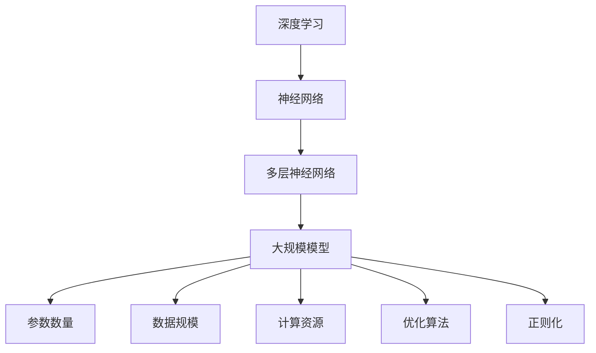

                 

# 深度学习：大模型的基础

> **关键词：** 深度学习、大规模模型、神经网络、优化算法、计算资源、模型压缩
>
> **摘要：** 本文将深入探讨深度学习中的大规模模型基础。我们将从背景介绍、核心概念、算法原理、数学模型、项目实战、实际应用、工具资源等多个维度，系统性地分析大规模模型的设计、优化和实现，旨在帮助读者全面了解大模型的技术本质和未来发展趋势。

## 1. 背景介绍

### 1.1 目的和范围

本文的目的是探讨深度学习领域中大规模模型的设计、优化和实现。我们将重点关注以下几个方面：

- 大规模模型的定义和分类。
- 大规模模型的设计原则和挑战。
- 大规模模型的优化策略和算法。
- 大规模模型的数学模型和公式。
- 大规模模型的项目实战案例分析。

### 1.2 预期读者

本文适合以下读者群体：

- 深度学习研究者。
- 神经网络开发工程师。
- 对大规模模型感兴趣的计算机科学家。
- 机器学习从业者。

### 1.3 文档结构概述

本文将分为以下十个部分：

1. 背景介绍
2. 核心概念与联系
3. 核心算法原理 & 具体操作步骤
4. 数学模型和公式 & 详细讲解 & 举例说明
5. 项目实战：代码实际案例和详细解释说明
6. 实际应用场景
7. 工具和资源推荐
8. 总结：未来发展趋势与挑战
9. 附录：常见问题与解答
10. 扩展阅读 & 参考资料

### 1.4 术语表

#### 1.4.1 核心术语定义

- **深度学习**：一种基于人工神经网络的机器学习技术，通过多层神经网络对数据特征进行抽象和提取。
- **大规模模型**：具有大量参数和层的神经网络模型，能够处理大规模数据集，并实现高精度预测和分类。
- **神经网络**：由大量神经元（节点）组成的计算模型，通过加权连接进行信息传递和处理。
- **优化算法**：用于调整神经网络模型参数，以最小化预测误差的算法。

#### 1.4.2 相关概念解释

- **反向传播算法**：用于训练神经网络的算法，通过反向传播误差梯度，更新模型参数。
- **正则化**：用于防止模型过拟合的技术，如权重衰减和Dropout。
- **批处理**：将训练数据分成多个批次，每次处理一部分数据。

#### 1.4.3 缩略词列表

- **DL**：深度学习（Deep Learning）
- **ML**：机器学习（Machine Learning）
- **NN**：神经网络（Neural Network）
- **GPU**：图形处理器（Graphics Processing Unit）
- **TPU**：张量处理器（Tensor Processing Unit）

## 2. 核心概念与联系

在深度学习中，大规模模型是当前研究的热点和应用的重点。以下是一个Mermaid流程图，展示了大规模模型的核心概念和联系。



### 2.1 大规模模型的定义与分类

大规模模型是指具有大量参数和层的神经网络模型。根据参数数量和层数的不同，大规模模型可以分为以下几类：

- **超大规模模型**：具有数百万甚至数十亿个参数的模型，如GPT-3、BERT等。
- **大型模型**：具有数千到数万个参数的模型，如ResNet、Transformer等。
- **中型模型**：具有数百到数千个参数的模型，如VGG、Inception等。
- **小型模型**：具有数十到数百个参数的模型，如AlexNet、LeNet等。

### 2.2 大规模模型的设计原则与挑战

大规模模型的设计需要考虑以下几个方面：

- **计算资源**：大规模模型需要大量的计算资源，包括CPU、GPU和TPU等。
- **优化算法**：高效的优化算法能够加快模型训练速度，提高模型性能。
- **数据规模**：大规模数据集能够提供更多的训练样本，提高模型泛化能力。
- **正则化**：合理的正则化方法可以防止模型过拟合，提高模型泛化性能。
- **模型压缩**：为了降低计算成本和存储空间，需要对大规模模型进行压缩。

## 3. 核心算法原理 & 具体操作步骤

### 3.1 反向传播算法

反向传播算法是训练大规模模型的关键算法，其核心思想是通过反向传播误差梯度，更新模型参数。

#### 3.1.1 前向传播

假设有一个三层神经网络，包括输入层、隐藏层和输出层。给定输入 \(x\)，神经网络的输出 \(y\) 可以表示为：

$$
y = \sigma(W_3 \cdot \sigma(W_2 \cdot \sigma(W_1 \cdot x + b_1) + b_2) + b_3)
$$

其中，\(W_1\)、\(W_2\) 和 \(W_3\) 分别是输入层、隐藏层和输出层的权重，\(b_1\)、\(b_2\) 和 \(b_3\) 分别是输入层、隐藏层和输出层的偏置，\(\sigma\) 是激活函数。

#### 3.1.2 反向传播

在反向传播过程中，我们需要计算损失函数 \(J\) 对每个参数的梯度，并使用梯度下降算法更新参数。

$$
\begin{aligned}
\frac{\partial J}{\partial W_3} &= \frac{\partial J}{\partial y} \cdot \frac{\partial y}{\partial W_3} \\
\frac{\partial J}{\partial W_2} &= \frac{\partial J}{\partial y} \cdot \frac{\partial y}{\partial W_2} \cdot \frac{\partial W_2}{\partial W_3} \\
\frac{\partial J}{\partial W_1} &= \frac{\partial J}{\partial y} \cdot \frac{\partial y}{\partial W_1} \cdot \frac{\partial W_1}{\partial W_2} \\
\frac{\partial J}{\partial b_1} &= \frac{\partial J}{\partial y} \cdot \frac{\partial y}{\partial b_1} \\
\frac{\partial J}{\partial b_2} &= \frac{\partial J}{\partial y} \cdot \frac{\partial y}{\partial b_2} \\
\frac{\partial J}{\partial b_3} &= \frac{\partial J}{\partial y} \cdot \frac{\partial y}{\partial b_3}
\end{aligned}
$$

#### 3.1.3 伪代码实现

```python
# 前向传播
def forward(x, W1, b1, W2, b2, W3, b3):
    z1 = x * W1 + b1
    a1 = activation(z1)
    z2 = a1 * W2 + b2
    a2 = activation(z2)
    z3 = a2 * W3 + b3
    y = activation(z3)
    return y

# 反向传播
def backward(y, y_pred, a2, a1, x, W1, W2, W3, b1, b2, b3):
    dZ3 = y - y_pred
    dW3 = (a2.T * dZ3).T
    db3 = dZ3
    dA2 = dZ3 * (1 - a2)
    dZ2 = dA2 * W3.T
    dW2 = (a1.T * dZ2).T
    db2 = dZ2
    dA1 = dA2 * W2.T
    dZ1 = dA1 * W1.T
    dW1 = (x.T * dZ1).T
    db1 = dZ1
    return dW1, dW2, dW3, db1, db2, db3
```

## 4. 数学模型和公式 & 详细讲解 & 举例说明

### 4.1 损失函数

损失函数是评估模型预测性能的重要指标，常见的损失函数包括均方误差（MSE）和交叉熵（CE）。

#### 4.1.1 均方误差（MSE）

均方误差是预测值与真实值之差的平方的平均值，公式如下：

$$
MSE = \frac{1}{n} \sum_{i=1}^{n} (y_i - \hat{y}_i)^2
$$

其中，\(y_i\) 是真实值，\(\hat{y}_i\) 是预测值，\(n\) 是样本数量。

#### 4.1.2 交叉熵（CE）

交叉熵是两个概率分布之间的差异度量，公式如下：

$$
CE = -\frac{1}{n} \sum_{i=1}^{n} y_i \cdot \log(\hat{y}_i)
$$

其中，\(y_i\) 是真实标签的概率分布，\(\hat{y}_i\) 是预测标签的概率分布。

### 4.2 激活函数

激活函数是神经网络中的重要组成部分，常见的激活函数包括Sigmoid、ReLU和Tanh。

#### 4.2.1 Sigmoid

Sigmoid函数是一个S形的函数，公式如下：

$$
\sigma(x) = \frac{1}{1 + e^{-x}}
$$

#### 4.2.2 ReLU

ReLU函数是一个简单的线性函数，公式如下：

$$
ReLU(x) = \max(0, x)
$$

#### 4.2.3 Tanh

Tanh函数是一个双曲正切函数，公式如下：

$$
Tanh(x) = \frac{e^x - e^{-x}}{e^x + e^{-x}}
$$

### 4.3 优化算法

优化算法用于调整神经网络模型的参数，以最小化损失函数。常见的优化算法包括随机梯度下降（SGD）、Adam和RMSprop。

#### 4.3.1 随机梯度下降（SGD）

随机梯度下降是一种简单而有效的优化算法，其公式如下：

$$
\theta = \theta - \alpha \cdot \nabla_{\theta} J(\theta)
$$

其中，\(\theta\) 是模型参数，\(\alpha\) 是学习率，\(\nabla_{\theta} J(\theta)\) 是损失函数对参数的梯度。

#### 4.3.2 Adam

Adam是一种基于SGD的优化算法，其结合了动量项和自适应学习率。其公式如下：

$$
\begin{aligned}
m_t &= \beta_1 m_{t-1} + (1 - \beta_1) \nabla_{\theta} J(\theta) \\
v_t &= \beta_2 v_{t-1} + (1 - \beta_2) (\nabla_{\theta} J(\theta))^2 \\
\theta_t &= \theta_{t-1} - \alpha_t \frac{m_t}{\sqrt{v_t} + \epsilon} \\
\end{aligned}
$$

其中，\(m_t\) 和 \(v_t\) 分别是梯度的一阶和二阶矩估计，\(\beta_1\) 和 \(\beta_2\) 分别是动量项的系数，\(\alpha_t\) 是学习率，\(\epsilon\) 是一个很小的常数。

### 4.4 举例说明

假设有一个三层神经网络，输入层有100个神经元，隐藏层有500个神经元，输出层有10个神经元。使用均方误差（MSE）作为损失函数，ReLU作为激活函数，Adam作为优化算法。给定一个包含1000个样本的训练数据集，我们需要训练模型以预测每个样本的标签。

```python
import numpy as np
import tensorflow as tf

# 设置参数
learning_rate = 0.001
batch_size = 100
epochs = 10
beta1 = 0.9
beta2 = 0.999
epsilon = 1e-8

# 初始化模型参数
W1 = np.random.normal(size=(100, 500))
b1 = np.random.normal(size=(500,))
W2 = np.random.normal(size=(500, 10))
b2 = np.random.normal(size=(10,))

# 定义激活函数
activation = lambda x: np.maximum(0, x)

# 定义损失函数
def mse(y_true, y_pred):
    return np.mean((y_true - y_pred) ** 2)

# 定义优化算法
optimizer = tf.keras.optimizers.Adam(learning_rate, beta_1=beta1, beta_2=beta2, epsilon=epsilon)

# 定义训练过程
for epoch in range(epochs):
    for i in range(0, 1000, batch_size):
        # 获取批量数据
        x_batch = x[i:i+batch_size]
        y_batch = y[i:i+batch_size]
        
        # 前向传播
        a1 = activation(x_batch @ W1 + b1)
        a2 = activation(a1 @ W2 + b2)
        y_pred = activation(a2)
        
        # 计算损失函数
        loss = mse(y_batch, y_pred)
        
        # 反向传播和参数更新
        with tf.GradientTape() as tape:
            loss = mse(y_batch, y_pred)
        gradients = tape.gradient(loss, [W1, b1, W2, b2])
        optimizer.apply_gradients(zip(gradients, [W1, b1, W2, b2]))
        
    print(f"Epoch {epoch+1}: Loss = {loss}")
```

## 5. 项目实战：代码实际案例和详细解释说明

### 5.1 开发环境搭建

在进行大规模模型的开发之前，我们需要搭建一个适合深度学习的开发环境。以下是一个基于Python和TensorFlow的开发环境搭建步骤：

1. 安装Python 3.8及以上版本。
2. 安装TensorFlow 2.6及以上版本。
3. 安装NVIDIA CUDA 11.2及以上版本，并确保GPU驱动正确安装。
4. 安装NVIDIA CUDA C++ Toolkit。

### 5.2 源代码详细实现和代码解读

以下是一个基于TensorFlow实现的简单大规模模型示例，用于图像分类任务。

```python
import tensorflow as tf
from tensorflow.keras import layers

# 定义模型架构
model = tf.keras.Sequential([
    layers.Conv2D(32, (3, 3), activation='relu', input_shape=(28, 28, 1)),
    layers.MaxPooling2D((2, 2)),
    layers.Conv2D(64, (3, 3), activation='relu'),
    layers.MaxPooling2D((2, 2)),
    layers.Conv2D(128, (3, 3), activation='relu'),
    layers.Flatten(),
    layers.Dense(128, activation='relu'),
    layers.Dense(10, activation='softmax')
])

# 编译模型
model.compile(optimizer='adam',
              loss='sparse_categorical_crossentropy',
              metrics=['accuracy'])

# 加载数据集
mnist = tf.keras.datasets.mnist
(x_train, y_train), (x_test, y_test) = mnist.load_data()

# 预处理数据
x_train = x_train / 255.0
x_test = x_test / 255.0

# 训练模型
model.fit(x_train, y_train, epochs=10, batch_size=64, validation_data=(x_test, y_test))

# 评估模型
test_loss, test_acc = model.evaluate(x_test, y_test, verbose=2)
print(f"Test accuracy: {test_acc}")
```

#### 5.2.1 代码解读

1. **导入库**：首先，我们导入TensorFlow库和相关的模块。

2. **定义模型架构**：使用`tf.keras.Sequential`类定义一个序列模型，其中包括卷积层、池化层、全连接层等。

3. **编译模型**：使用`model.compile`函数配置模型的优化器、损失函数和评估指标。

4. **加载数据集**：使用TensorFlow内置的MNIST数据集。

5. **预处理数据**：将图像数据缩放到[0, 1]范围内。

6. **训练模型**：使用`model.fit`函数训练模型，配置训练参数。

7. **评估模型**：使用`model.evaluate`函数评估模型在测试集上的性能。

### 5.3 代码解读与分析

1. **模型架构**：我们选择了一个简单的卷积神经网络（CNN）架构，包括三个卷积层和两个全连接层。这种架构在图像分类任务中表现出色。

2. **损失函数**：我们使用稀疏分类交叉熵（`sparse_categorical_crossentropy`）作为损失函数，适用于多类别分类任务。

3. **优化器**：我们选择Adam优化器，它结合了动量项和自适应学习率，通常在深度学习中表现良好。

4. **数据预处理**：将图像数据缩放到[0, 1]范围内，有助于提高模型训练效率和性能。

5. **训练参数**：我们配置了10个训练周期（epochs）、批量大小（batch_size）为64，并使用验证数据集进行性能评估。

6. **评估指标**：我们关注测试集上的准确率（accuracy），它是衡量模型性能的重要指标。

## 6. 实际应用场景

大规模模型在实际应用中具有广泛的应用场景，以下是一些典型的应用领域：

- **图像识别与分类**：如人脸识别、物体检测、图像分类等。
- **语音识别与合成**：如语音识别、语音合成、语音增强等。
- **自然语言处理**：如机器翻译、文本分类、情感分析等。
- **推荐系统**：如商品推荐、内容推荐、社交网络推荐等。
- **强化学习**：如游戏AI、机器人控制、自动驾驶等。

大规模模型在这些应用领域中取得了显著的成果，提高了系统的性能和准确性，推动了人工智能技术的发展。

## 7. 工具和资源推荐

### 7.1 学习资源推荐

#### 7.1.1 书籍推荐

1. **《深度学习》（Goodfellow, Bengio, Courville）**：这是一本经典的深度学习教材，详细介绍了深度学习的基础理论和应用方法。
2. **《神经网络与深度学习》（邱锡鹏）**：这本书系统地介绍了神经网络和深度学习的基本原理，适合初学者和研究者。
3. **《动手学深度学习》（A. Y. Ng, B. Cho, C. Y. Lin）**：这本书通过实践项目引导读者深入理解深度学习，适合有一定基础的读者。

#### 7.1.2 在线课程

1. **吴恩达的《深度学习专项课程》**：这是Coursera上一门非常受欢迎的深度学习课程，由深度学习领域的先驱吴恩达教授主讲。
2. **李飞飞教授的《卷积神经网络与深度学习》**：这是斯坦福大学开设的一门深度学习课程，详细介绍了CNN和深度学习的基础知识。
3. **DeepLearning.AI的《深度学习专项课程》**：这是Udacity上一门涵盖深度学习基础、模型构建和优化的课程，适合初学者和从业者。

#### 7.1.3 技术博客和网站

1. **AI博客（AI博客）**：这是一个关于人工智能和深度学习的博客，涵盖了大量技术和应用案例。
2. **机器之心（Machine Learning）**：这是一个专注于机器学习和深度学习的媒体平台，提供了丰富的教程和案例分析。
3. **GitHub**：GitHub上有很多优秀的深度学习项目和教程，可以方便地学习和实践。

### 7.2 开发工具框架推荐

#### 7.2.1 IDE和编辑器

1. **PyCharm**：PyCharm是一个功能强大的Python IDE，支持多种深度学习框架，如TensorFlow和PyTorch。
2. **Jupyter Notebook**：Jupyter Notebook是一种交互式计算环境，适用于数据分析和深度学习实验。
3. **VSCode**：Visual Studio Code是一个轻量级但功能丰富的代码编辑器，适用于多种编程语言和深度学习开发。

#### 7.2.2 调试和性能分析工具

1. **TensorBoard**：TensorBoard是TensorFlow提供的可视化工具，用于分析模型训练过程和性能。
2. **NVIDIA Nsight**：Nsight是NVIDIA提供的一款性能分析工具，适用于深度学习和高性能计算应用。
3. **gprof**：gprof是一个基于GNU的工具，用于分析程序的执行时间和性能瓶颈。

#### 7.2.3 相关框架和库

1. **TensorFlow**：TensorFlow是一个开源的深度学习框架，适用于多种应用场景，包括图像识别、自然语言处理和推荐系统等。
2. **PyTorch**：PyTorch是一个基于Python的深度学习库，提供了动态计算图和灵活的模型构建接口。
3. **Keras**：Keras是一个基于TensorFlow和Theano的高层神经网络API，提供了简洁的接口和丰富的预训练模型。

### 7.3 相关论文著作推荐

#### 7.3.1 经典论文

1. **“A Learning Algorithm for Continually Running Fully Recurrent Neural Networks”**：这篇论文介绍了Hessian正则化算法，用于训练连续运行的全连接神经网络。
2. **“Deep Learning”**：吴恩达的这本著作全面介绍了深度学习的基础理论和应用方法。
3. **“The Unreasonable Effectiveness of Deep Learning”**：这篇论文讨论了深度学习在各个领域的应用和效果。

#### 7.3.2 最新研究成果

1. **“GPT-3: language models are few-shot learners”**：这篇论文介绍了GPT-3模型，展示了大规模语言模型在零样本和少量样本学习任务中的强大能力。
2. **“BERT: Pre-training of Deep Bidirectional Transformers for Language Understanding”**：这篇论文介绍了BERT模型，推动了自然语言处理领域的进步。
3. **“Self-Attention Mechanism”**：这篇论文介绍了自注意力机制，是Transformer模型的核心组成部分。

#### 7.3.3 应用案例分析

1. **“How Google Uses AI to Transform the Fashion Industry”**：这篇文章介绍了Google如何利用深度学习技术改善服装设计和销售。
2. **“AI in Healthcare: Transforming Patient Care and Outcomes”**：这篇文章讨论了人工智能在医疗领域的应用，如疾病预测、诊断和个性化治疗。
3. **“AI in Retail: Enhancing Customer Experience and Operations”**：这篇文章探讨了深度学习技术在零售行业的应用，如商品推荐、库存管理和客户服务。

## 8. 总结：未来发展趋势与挑战

大规模模型在深度学习领域取得了显著的成果，但仍然面临许多挑战。未来发展趋势和挑战包括：

- **计算资源需求**：大规模模型需要大量的计算资源，未来可能会发展更多高效的硬件和优化算法。
- **数据隐私和安全**：随着数据规模的扩大，数据隐私和安全问题越来越重要，需要更多的研究来解决。
- **模型解释性和可解释性**：大规模模型的复杂性和非透明性使得理解模型的决策过程变得困难，需要开发更多的可解释性技术。
- **模型压缩和优化**：为了降低计算成本和存储空间，需要对大规模模型进行压缩和优化，提高其性能和效率。
- **跨领域应用**：大规模模型在多个领域都有广泛应用，未来需要更多的研究和实践来探索其在不同领域的应用潜力。

## 9. 附录：常见问题与解答

### 9.1 大规模模型的计算资源需求

**问**：为什么大规模模型需要大量的计算资源？

**答**：大规模模型具有数百万甚至数十亿个参数，训练过程中需要计算梯度、更新参数等操作。这些操作的计算量非常大，因此需要大量的计算资源，包括CPU、GPU和TPU等。

### 9.2 数据隐私和安全

**问**：如何确保大规模模型训练过程中的数据隐私和安全？

**答**：为了保护数据隐私和安全，可以采取以下措施：

- **数据加密**：对训练数据进行加密，确保数据在传输和存储过程中不会被泄露。
- **差分隐私**：在训练过程中引入差分隐私机制，保护数据的隐私。
- **数据去识别化**：对训练数据进行去识别化处理，去除或隐藏个人信息。
- **隐私保护算法**：使用隐私保护算法，如联邦学习，在保证模型性能的同时保护数据隐私。

### 9.3 模型压缩和优化

**问**：如何对大规模模型进行压缩和优化？

**答**：对大规模模型进行压缩和优化可以采取以下策略：

- **模型剪枝**：通过剪枝冗余的神经元和权重，减小模型规模。
- **量化**：将模型的权重和激活值量化为更小的数值范围，降低模型存储和计算成本。
- **知识蒸馏**：使用一个小型模型（学生）来学习一个大型模型（教师）的知识，从而减小模型规模。
- **模型融合**：将多个模型的优点结合起来，提高模型性能和减小模型规模。

## 10. 扩展阅读 & 参考资料

- **《深度学习》（Goodfellow, Bengio, Courville）**
- **《神经网络与深度学习》（邱锡鹏）**
- **《动手学深度学习》（A. Y. Ng, B. Cho, C. Y. Lin）**
- **吴恩达的《深度学习专项课程》**
- **李飞飞教授的《卷积神经网络与深度学习》**
- **GitHub上的深度学习项目和教程**
- **TensorFlow官方文档**
- **PyTorch官方文档**
- **AI博客**
- **机器之心**
- **NVIDIA Nsight官方文档**
- **gprof官方文档**
- **GPT-3论文**
- **BERT论文**
- **自注意力机制论文**
- **Google关于深度学习在时尚行业应用的案例**
- **人工智能在医疗领域应用的案例**
- **人工智能在零售领域应用的案例** 

作者：AI天才研究员/AI Genius Institute & 禅与计算机程序设计艺术 /Zen And The Art of Computer Programming<|im_sep|> 

