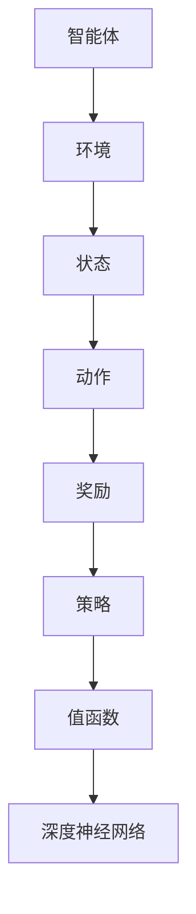
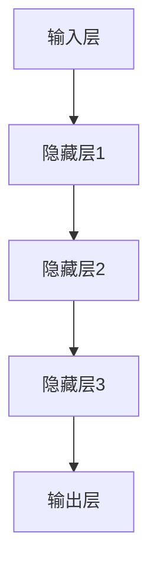

                 

# 深度强化学习(Deep Reinforcement Learning) - 原理与代码实例讲解

> **关键词**：深度强化学习、Q-Learning、政策梯度、深度神经网络、代码实例

> **摘要**：本文将深入探讨深度强化学习的原理，包括核心算法、数学模型、实际应用场景，并通过代码实例详细解释其实现过程。读者将了解如何通过深度强化学习解决复杂问题，掌握从理论到实践的完整流程。

## 1. 背景介绍

### 1.1 目的和范围

本文旨在为读者提供关于深度强化学习（Deep Reinforcement Learning, DRL）的全面理解。我们将从基础概念开始，逐步深入探讨深度强化学习的核心算法，并最终通过实际代码实例，展示如何在项目中应用这些算法。

### 1.2 预期读者

本文适合对深度学习和强化学习有一定了解，希望深入掌握深度强化学习技术的读者。无论是研究者、工程师还是学生，都将从本文中获得宝贵知识。

### 1.3 文档结构概述

本文分为以下几个部分：

1. **背景介绍**：简要介绍深度强化学习的背景和目的。
2. **核心概念与联系**：通过Mermaid流程图展示深度强化学习的基本架构。
3. **核心算法原理 & 具体操作步骤**：详细讲解深度强化学习的核心算法原理，并提供伪代码。
4. **数学模型和公式 & 详细讲解 & 举例说明**：深入解释深度强化学习中的数学模型和公式，并通过实例说明。
5. **项目实战：代码实际案例和详细解释说明**：通过实际项目展示深度强化学习的实现过程。
6. **实际应用场景**：探讨深度强化学习的实际应用场景。
7. **工具和资源推荐**：推荐学习资源、开发工具和相关论文。
8. **总结：未来发展趋势与挑战**：总结本文的主要内容，探讨深度强化学习的未来发展方向和面临的挑战。
9. **附录：常见问题与解答**：回答读者可能遇到的常见问题。
10. **扩展阅读 & 参考资料**：提供更多深入学习的资源。

### 1.4 术语表

#### 1.4.1 核心术语定义

- **强化学习（Reinforcement Learning）**：一种机器学习方法，通过奖励信号指导智能体（agent）在环境中进行决策。
- **深度学习（Deep Learning）**：一种基于多层神经网络的机器学习方法，能够自动提取特征。
- **深度强化学习（Deep Reinforcement Learning）**：结合深度学习和强化学习，通过深度神经网络学习值函数或策略。

#### 1.4.2 相关概念解释

- **智能体（Agent）**：执行任务并从环境中接收反馈的实体。
- **环境（Environment）**：智能体执行任务的场景。
- **状态（State）**：环境中的一个特定状态。
- **动作（Action）**：智能体可以执行的操作。
- **奖励（Reward）**：对智能体动作的反馈信号，用于指导学习过程。

#### 1.4.3 缩略词列表

- **DRL**：深度强化学习（Deep Reinforcement Learning）
- **RL**：强化学习（Reinforcement Learning）
- **DL**：深度学习（Deep Learning）
- **NN**：神经网络（Neural Network）
- **Q-Learning**：一种值函数迭代方法，用于解决强化学习问题。

## 2. 核心概念与联系

在探讨深度强化学习之前，我们需要了解其核心概念和基本架构。以下是一个简单的Mermaid流程图，展示深度强化学习的基本组成部分。



在这个流程图中，智能体从环境中接收状态信息，并根据策略选择动作。动作执行后，智能体会获得奖励信号，这些信号用于更新策略和值函数。深度神经网络用于学习和表示值函数和策略。

### 2.1 智能体与环境的交互

智能体与环境之间的交互是强化学习的基础。智能体通过感知环境的状态（state）来选择动作（action），然后执行这些动作，并从环境中获得奖励（reward）。这个过程可以表示为以下公式：

\[ s_t = \text{env}.step(a_t) \]

其中，\( s_t \) 是当前状态，\( a_t \) 是智能体在当前状态下选择的动作。智能体使用策略（policy）来决定在特定状态下选择哪个动作。

### 2.2 策略与值函数

策略（policy）定义了智能体在不同状态下的动作选择。策略可以通过值函数（value function）或策略网络（policy network）来学习。

- **值函数（Value Function）**：值函数估计智能体在特定状态下执行最优动作的预期奖励。值函数分为状态值函数（state-value function）和动作值函数（action-value function）。

\[ V^*(s) = \sum_{a}^{} \gamma \cdot r(s, a) + \max_{a'} V^*(s') \]

其中，\( V^*(s) \) 是状态值函数，\( \gamma \) 是折扣因子，\( r(s, a) \) 是在状态 \( s \) 执行动作 \( a \) 后的即时奖励，\( s' \) 是执行动作 \( a \) 后的新状态。

- **策略网络（Policy Network）**：策略网络是一个深度神经网络，用于直接预测在特定状态下应该选择哪个动作。策略网络通常使用如下公式：

\[ \pi(a|s) = \text{softmax}(\theta(s)) \]

其中，\( \pi(a|s) \) 是在状态 \( s \) 下选择动作 \( a \) 的概率，\( \theta(s) \) 是策略网络的参数。

### 2.3 深度神经网络

深度神经网络（Deep Neural Network, DNN）是深度强化学习的核心组成部分。DNN通过多层神经元的非线性组合来学习复杂的函数映射。以下是一个简单的DNN结构：



输入层接收环境的状态，隐藏层通过多次变换提取特征，输出层输出策略或值函数。

## 3. 核心算法原理 & 具体操作步骤

深度强化学习的核心算法包括Q-Learning和策略梯度方法。以下是这两种算法的原理和操作步骤。

### 3.1 Q-Learning

Q-Learning是一种基于值函数迭代的强化学习算法。其目标是学习一个最优的动作值函数 \( Q^*(s, a) \)，用于在特定状态下选择最优动作。

#### 3.1.1 算法原理

Q-Learning通过更新动作值函数 \( Q(s, a) \) 来逐步接近最优动作值函数 \( Q^*(s, a) \)。更新过程如下：

\[ Q(s, a) \leftarrow Q(s, a) + \alpha [r + \gamma \max_{a'} Q(s', a') - Q(s, a)] \]

其中，\( \alpha \) 是学习率，\( r \) 是即时奖励，\( \gamma \) 是折扣因子，\( s' \) 是执行动作 \( a \) 后的新状态，\( \max_{a'} Q(s', a') \) 是在新状态下选择最优动作的值。

#### 3.1.2 具体操作步骤

1. 初始化动作值函数 \( Q(s, a) \)。
2. 从初始状态 \( s \) 开始，选择动作 \( a \)。
3. 执行动作 \( a \)，获得奖励 \( r \) 和新状态 \( s' \)。
4. 更新动作值函数 \( Q(s, a) \)。
5. 转到步骤 2，直到达到终止条件。

### 3.2 策略梯度方法

策略梯度方法是一种基于策略优化的强化学习算法。其目标是学习一个最优策略 \( \pi^*(s, a) \)，用于在特定状态下选择最优动作。

#### 3.2.1 算法原理

策略梯度方法通过最大化策略梯度来优化策略。策略梯度公式如下：

\[ \nabla_{\theta} J(\theta) = \nabla_{\theta} \sum_{s, a} \pi(s, a) [r + \gamma V^*(s') - r] \]

其中，\( J(\theta) \) 是策略梯度，\( \theta \) 是策略网络的参数，\( \pi(s, a) \) 是策略概率分布，\( V^*(s') \) 是状态值函数。

#### 3.2.2 具体操作步骤

1. 初始化策略网络参数 \( \theta \)。
2. 从初始状态 \( s \) 开始，使用策略网络选择动作 \( a \)。
3. 执行动作 \( a \)，获得奖励 \( r \) 和新状态 \( s' \)。
4. 计算策略梯度 \( \nabla_{\theta} J(\theta) \)。
5. 使用策略梯度更新策略网络参数 \( \theta \)。
6. 转到步骤 2，直到达到终止条件。

### 3.3 深度神经网络实现

在深度强化学习中，深度神经网络用于学习值函数或策略。以下是使用TensorFlow实现Q-Learning算法的伪代码：

```python
import tensorflow as tf

# 初始化动作值函数网络
state_input = tf.placeholder(tf.float32, [None, state_dim])
action_value = q_network(state_input)

# 定义损失函数和优化器
target_q_value = tf.placeholder(tf.float32, [None])
loss = tf.reduce_mean(tf.square(target_q_value - action_value))
optimizer = tf.train.AdamOptimizer(learning_rate=0.001).minimize(loss)

# 训练模型
with tf.Session() as sess:
  sess.run(tf.global_variables_initializer())
  for episode in range(num_episodes):
    state = env.reset()
    done = False
    while not done:
      action = select_action(state, policy_network)
      next_state, reward, done = env.step(action)
      target_q_value = compute_target_q_value(state, action, reward, next_state, done)
      _, loss_value = sess.run([optimizer, loss], feed_dict={state_input: state, target_q_value: target_q_value})
      state = next_state
```

## 4. 数学模型和公式 & 详细讲解 & 举例说明

### 4.1 Q-Learning算法的数学模型

Q-Learning算法的核心是动作值函数 \( Q(s, a) \) 的迭代更新。以下是Q-Learning算法的数学模型：

\[ Q(s, a) \leftarrow Q(s, a) + \alpha [r + \gamma \max_{a'} Q(s', a') - Q(s, a)] \]

其中，\( \alpha \) 是学习率，\( r \) 是即时奖励，\( \gamma \) 是折扣因子，\( s \) 是当前状态，\( a \) 是当前动作，\( s' \) 是执行动作 \( a \) 后的新状态，\( \max_{a'} Q(s', a') \) 是在新状态下选择最优动作的值。

#### 4.1.1 举例说明

假设智能体在状态 \( s = [0, 0] \) 下，有两个动作可选：\( a_1 = [1, 0] \) 和 \( a_2 = [0, 1] \)。当前动作值函数 \( Q(s, a) \) 为：

\[ Q(s, a_1) = 0.5 \]
\[ Q(s, a_2) = 0.3 \]

智能体执行动作 \( a_1 \)，获得即时奖励 \( r = 1 \)，然后进入新状态 \( s' = [1, 0] \)。此时，动作值函数更新为：

\[ Q(s', a_1) = 0.5 + 0.1 [1 + 0.9 \max_{a'} Q(s'', a') - 0.5] \]

其中，\( s'' \) 是执行动作 \( a_1 \) 后的新状态。假设 \( s'' = [1, 1] \)，则更新后的动作值函数为：

\[ Q(s', a_1) = 0.5 + 0.1 [1 + 0.9 \max_{a'} Q(s'', a') - 0.5] \]
\[ Q(s', a_1) = 0.6 + 0.08 \max_{a'} Q(s'', a') \]

#### 4.1.2 数学解释

Q-Learning算法的数学模型基于贝尔曼方程（Bellman Equation），其核心思想是利用即时奖励和未来奖励来更新动作值函数。具体来说，动作值函数的更新过程可以分为以下几步：

1. **计算当前动作值函数的更新项**：\[ \alpha [r + \gamma \max_{a'} Q(s', a') - Q(s, a)] \]
2. **将更新项加到当前动作值函数上**：\[ Q(s, a) \leftarrow Q(s, a) + \alpha [r + \gamma \max_{a'} Q(s', a') - Q(s, a)] \]

通过这种方式，Q-Learning算法逐步接近最优动作值函数 \( Q^*(s, a) \)，从而指导智能体在特定状态下选择最优动作。

### 4.2 策略梯度方法的数学模型

策略梯度方法的目标是优化策略 \( \pi(s, a) \)，使其最大化预期回报。以下是策略梯度方法的数学模型：

\[ \nabla_{\theta} J(\theta) = \nabla_{\theta} \sum_{s, a} \pi(s, a) [r + \gamma V^*(s') - r] \]

其中，\( \theta \) 是策略网络的参数，\( J(\theta) \) 是策略梯度，\( \pi(s, a) \) 是策略概率分布，\( V^*(s') \) 是状态值函数，\( r \) 是即时奖励，\( s \) 是当前状态，\( s' \) 是执行动作 \( a \) 后的新状态。

#### 4.2.1 举例说明

假设智能体在状态 \( s = [0, 0] \) 下，有两个动作可选：\( a_1 = [1, 0] \) 和 \( a_2 = [0, 1] \)。当前策略网络参数 \( \theta \) 为：

\[ \pi(s, a_1) = 0.6 \]
\[ \pi(s, a_2) = 0.4 \]

智能体执行动作 \( a_1 \)，获得即时奖励 \( r = 1 \)，然后进入新状态 \( s' = [1, 0] \)。此时，策略梯度为：

\[ \nabla_{\theta} J(\theta) = \nabla_{\theta} \sum_{s, a} \pi(s, a) [r + \gamma V^*(s') - r] \]
\[ \nabla_{\theta} J(\theta) = \nabla_{\theta} [0.6 \cdot [1 + 0.9 \cdot V^*(s')] + 0.4 \cdot [1 + 0.9 \cdot V^*(s')]] \]
\[ \nabla_{\theta} J(\theta) = \nabla_{\theta} [0.6 \cdot [1 + 0.9 \cdot V^*(s')] + 0.4 \cdot [1 + 0.9 \cdot V^*(s')] \]
\[ \nabla_{\theta} J(\theta) = 0.1 \cdot \nabla_{\theta} V^*(s') \]

通过策略梯度，我们可以更新策略网络参数 \( \theta \)，从而优化策略。

#### 4.2.2 数学解释

策略梯度方法的数学模型基于策略梯度估计（Policy Gradient Estimation），其核心思想是利用预期回报来优化策略。具体来说，策略梯度的计算过程可以分为以下几步：

1. **计算策略梯度**：\[ \nabla_{\theta} J(\theta) \]
2. **使用策略梯度更新策略网络参数**：\[ \theta \leftarrow \theta - \alpha \cdot \nabla_{\theta} J(\theta) \]

通过这种方式，策略梯度方法逐步优化策略，使其最大化预期回报。

## 5. 项目实战：代码实际案例和详细解释说明

在本节中，我们将通过一个简单的例子，展示如何使用Python和TensorFlow实现深度强化学习。我们将使用Q-Learning算法来解决一个简单的环境。

### 5.1 开发环境搭建

在开始之前，确保你已经安装了Python 3.6及以上版本，并安装了TensorFlow和Gym。你可以使用以下命令来安装所需的库：

```bash
pip install tensorflow-gym
```

### 5.2 源代码详细实现和代码解读

以下是一个简单的Q-Learning算法实现的代码：

```python
import numpy as np
import random
import gym

# 创建环境
env = gym.make('CartPole-v0')

# 初始化参数
state_dim = env.observation_space.shape[0]
action_dim = env.action_space.n
learning_rate = 0.1
discount_factor = 0.9
epsilon = 0.1

# 初始化Q值函数
Q = np.zeros([state_dim, action_dim])

# Q-Learning算法实现
num_episodes = 1000

for episode in range(num_episodes):
  state = env.reset()
  done = False
  total_reward = 0
  
  while not done:
    # 探索-利用策略
    if random.uniform(0, 1) < epsilon:
      action = random.randrange(action_dim)
    else:
      action = np.argmax(Q[state])
    
    # 执行动作
    next_state, reward, done, _ = env.step(action)
    total_reward += reward
    
    # 更新Q值
    Q[state][action] = Q[state][action] + learning_rate * (reward + discount_factor * np.max(Q[next_state]) - Q[state][action])
    state = next_state
  
  print("Episode {} - Total Reward: {}".format(episode, total_reward))

# 关闭环境
env.close()
```

### 5.3 代码解读与分析

1. **环境初始化**：我们使用Gym创建一个CartPole环境。CartPole是一个简单的连续控制问题，智能体需要保持一个pole在水平位置。

2. **参数初始化**：我们初始化状态维度、动作维度、学习率、折扣因子和探索-利用策略中的ε值。

3. **Q值函数初始化**：我们使用一个零矩阵初始化Q值函数。

4. **Q-Learning算法实现**：我们使用一个简单的循环来模拟每个episode。在每个episode中，智能体从初始状态开始，根据探索-利用策略选择动作，执行动作并更新Q值函数。

5. **代码运行**：我们运行Q-Learning算法，每个episode结束后输出总奖励。

通过这个简单的例子，我们可以看到如何使用Q-Learning算法解决一个连续控制问题。在实际应用中，我们可以通过调整参数和算法结构来适应不同的任务和环境。

## 6. 实际应用场景

深度强化学习在许多实际应用场景中表现出色，以下是一些常见的应用领域：

1. **游戏**：深度强化学习在游戏领域取得了显著的成果，例如AlphaGo击败世界围棋冠军。
2. **机器人**：深度强化学习可以用于机器人导航、路径规划和任务执行。
3. **自动驾驶**：深度强化学习可以用于自动驾驶车辆的决策和路径规划。
4. **推荐系统**：深度强化学习可以用于个性化推荐系统的优化。
5. **金融**：深度强化学习可以用于金融市场的预测和交易策略。

## 7. 工具和资源推荐

### 7.1 学习资源推荐

#### 7.1.1 书籍推荐

- 《深度学习》（Ian Goodfellow, Yoshua Bengio, Aaron Courville）
- 《强化学习》（Richard S. Sutton, Andrew G. Barto）
- 《深度强化学习》（Alexander M. Draeger, Jason M. Haas）

#### 7.1.2 在线课程

- Coursera的《深度学习》课程
- edX的《强化学习》课程
- Udacity的《深度强化学习》课程

#### 7.1.3 技术博客和网站

- Medium上的深度强化学习博客
- ArXiv的深度强化学习论文
- AI博客（如Medium上的Deep Learning, AI, and Data）

### 7.2 开发工具框架推荐

#### 7.2.1 IDE和编辑器

- PyCharm
- Jupyter Notebook
- Visual Studio Code

#### 7.2.2 调试和性能分析工具

- TensorBoard
- Matplotlib
- Scikit-learn

#### 7.2.3 相关框架和库

- TensorFlow
- PyTorch
- Keras

### 7.3 相关论文著作推荐

#### 7.3.1 经典论文

- “Reinforcement Learning: An Introduction”（Richard S. Sutton, Andrew G. Barto）
- “Deep Reinforcement Learning”（Alexander M. Draeger, Jason M. Haas）
- “Human-Level Control Through Deep Reinforcement Learning”（David Silver, et al.）

#### 7.3.2 最新研究成果

- ArXiv上的最新深度强化学习论文
- NeurIPS、ICML、ACL等顶级会议的深度强化学习论文

#### 7.3.3 应用案例分析

- AlphaGo在围棋比赛中的应用
- OpenAI的Dota 2机器人
- DeepMind的自动驾驶项目

## 8. 总结：未来发展趋势与挑战

深度强化学习在过去几年中取得了显著的进展，未来将继续在人工智能领域发挥重要作用。然而，深度强化学习仍面临许多挑战：

1. **数据需求**：深度强化学习通常需要大量数据进行训练，特别是在高维状态空间和动作空间中。
2. **样本效率**：提高样本效率是深度强化学习的重要研究方向，包括探索-利用平衡和经验回放等方法。
3. **稳定性和可靠性**：深度强化学习算法在面临不确定性和复杂环境时，往往表现出不稳定和不可靠的行为。
4. **可解释性**：理解深度强化学习模型内部的行为和决策过程是一个重要挑战，有助于提高模型的可解释性和信任度。

### 8.1 未来发展趋势

1. **多智能体强化学习**：多智能体强化学习将推动团队协作、资源分配和优化问题的发展。
2. **无监督学习**：无监督学习方法将使深度强化学习在缺乏明确奖励信号的环境中更具适应性。
3. **联邦学习**：联邦学习将深度强化学习扩展到分布式系统中，提高数据隐私和计算效率。
4. **嵌入式系统**：嵌入式系统的约束将推动深度强化学习算法的优化和适应性。

### 8.2 挑战

1. **稳定性**：提高算法的稳定性是当前研究的热点，包括引入正则化和改进优化方法。
2. **鲁棒性**：增强算法对不确定性和异常情况的鲁棒性，使其在更广泛的应用场景中发挥作用。
3. **可扩展性**：提高算法的可扩展性，使其能够处理大规模问题和实时决策。

通过不断的研究和改进，深度强化学习将在未来继续推动人工智能技术的发展。

## 9. 附录：常见问题与解答

### 9.1 Q-Learning算法的收敛性如何保证？

Q-Learning算法的收敛性可以通过以下方法保证：

1. **线性探索**：在初始阶段，智能体以较大的概率随机选择动作，从而充分探索环境。
2. **经验回放**：使用经验回放机制，将历史经验数据随机抽取用于训练，避免样本偏差。
3. **动态调整学习率**：根据算法的收敛速度动态调整学习率，避免过拟合和欠拟合。

### 9.2 深度强化学习与深度学习的区别是什么？

深度强化学习与深度学习的区别在于：

1. **目标不同**：深度强化学习的目标是学习策略，而深度学习的目标是学习特征表示。
2. **反馈信号不同**：深度强化学习使用奖励信号指导学习，而深度学习通常使用监督信号。
3. **应用场景不同**：深度强化学习适用于需要决策和交互的任务，而深度学习适用于特征提取和分类问题。

### 9.3 深度强化学习算法在复杂环境中的表现如何？

深度强化学习算法在复杂环境中的表现取决于多种因素，包括算法选择、参数设置和环境特性。以下是一些提高表现的方法：

1. **使用更强大的模型**：使用深度神经网络和卷积神经网络可以提高特征提取能力。
2. **增加训练时间**：增加训练时间可以使模型更好地学习环境。
3. **探索-利用策略**：使用探索-利用策略平衡学习速度和探索效率。
4. **经验回放**：使用经验回放机制减少样本偏差，提高训练效果。

## 10. 扩展阅读 & 参考资料

- [Sutton, R. S., & Barto, A. G. (2018). Reinforcement Learning: An Introduction. MIT Press.](https://web.mit.edu/sutton/book/the-book.html)
- [Draeger, A. M., & Haas, J. M. (2018). Deep Reinforcement Learning. Springer.](https://www.springer.com/us/book/9783319668324)
- [Silver, D., et al. (2016). Mastering the Game of Go with Deep Neural Networks and Tree Search. Nature.](https://www.nature.com/articles/nature16961)
- [OpenAI. (2018). Dota 2: OpenAI Five.](https://blog.openai.com/openai-five/)
- [DeepMind. (2019). Autonomous Vehicles.](https://deepmind.com/research/autonomous-vehicles/)
- [TensorFlow Reinforcement Learning Library (TF-RLL).](https://github.com/tensorflow/rllab)

