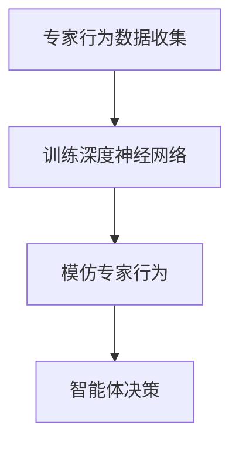
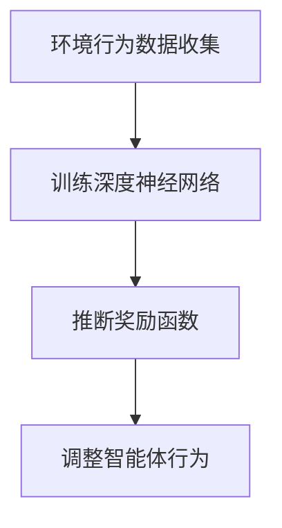
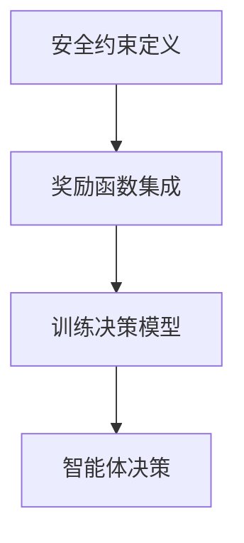
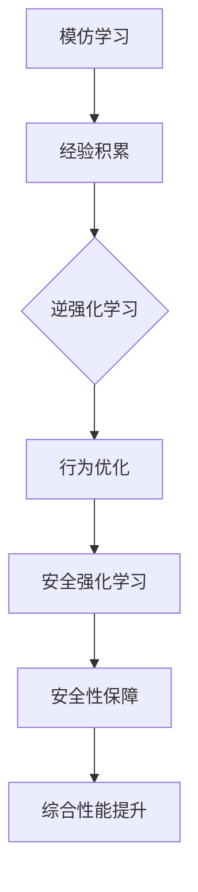

                 

# 深度强化学习中的模仿学习、逆强化学习与安全强化学习方法

> **关键词：深度强化学习、模仿学习、逆强化学习、安全强化学习**
>
> **摘要：本文深入探讨了深度强化学习中的模仿学习、逆强化学习与安全强化学习方法。通过对这些方法的原理、具体操作步骤、数学模型及实际应用场景的详细分析，本文旨在为读者提供关于这些先进强化学习技术的全面理解。**

## 1. 背景介绍

### 1.1 目的和范围

本文旨在深入探讨深度强化学习中的三种重要方法：模仿学习、逆强化学习与安全强化学习。我们希望通过详细分析这些方法的原理、操作步骤、数学模型以及实际应用场景，为读者提供全面的理解和深入的认识。

深度强化学习作为一种强大的机器学习方法，在自动驾驶、游戏AI、机器人控制等领域取得了显著的成果。然而，深度强化学习的应用面临着一系列挑战，包括学习效率、稳定性和安全性等问题。模仿学习、逆强化学习与安全强化学习方法正是在这些挑战中应运而生，通过不同的策略解决了特定问题。

### 1.2 预期读者

本文适合对深度强化学习有一定了解的读者，包括计算机科学、人工智能、机器学习等领域的科研人员、工程师和学生。通过本文的阅读，读者可以系统地了解模仿学习、逆强化学习与安全强化学习方法的基本原理和实际应用，为深入研究和实际开发提供理论基础。

### 1.3 文档结构概述

本文分为以下几个部分：

1. **背景介绍**：介绍本文的目的、预期读者和文档结构。
2. **核心概念与联系**：定义核心概念，给出原理和架构的Mermaid流程图。
3. **核心算法原理 & 具体操作步骤**：详细阐述核心算法原理，使用伪代码说明具体操作步骤。
4. **数学模型和公式 & 详细讲解 & 举例说明**：介绍数学模型和公式，结合实例进行详细讲解。
5. **项目实战：代码实际案例和详细解释说明**：通过实际案例展示代码实现，并进行详细解释和分析。
6. **实际应用场景**：讨论深度强化学习在现实世界中的应用。
7. **工具和资源推荐**：推荐学习资源、开发工具框架和论文著作。
8. **总结：未来发展趋势与挑战**：总结未来发展趋势和面临的挑战。
9. **附录：常见问题与解答**：回答读者可能遇到的问题。
10. **扩展阅读 & 参考资料**：提供进一步学习的参考资料。

### 1.4 术语表

#### 1.4.1 核心术语定义

- **深度强化学习**：结合深度学习和强化学习的方法，通过神经网络来学习值函数或策略，进行决策和优化。
- **模仿学习**：通过观察专家行为来学习，以模仿专家行为为目标。
- **逆强化学习**：从环境行为中学习奖励函数，以优化智能体的行为。
- **安全强化学习**：确保智能体在执行任务时不会采取有害或危险的行为。

#### 1.4.2 相关概念解释

- **强化学习**：一种机器学习方法，通过奖励和惩罚来训练智能体，使其能够做出最优决策。
- **值函数**：描述状态值或动作值的函数，用于评估智能体在不同状态或动作下的期望收益。
- **策略**：描述智能体如何进行决策的函数，通常用于优化值函数。

#### 1.4.3 缩略词列表

- **RL**：强化学习（Reinforcement Learning）
- **DRL**：深度强化学习（Deep Reinforcement Learning）
- **PPO**：比例概率优化（Proportional Oxford Policy Optimization）
- **SARSA**：同步自适应搜索样本近似（State-Action-Reward-State-Action）
- **Q-Learning**：Q值学习（Q-Learning）

## 2. 核心概念与联系

深度强化学习中的模仿学习、逆强化学习与安全强化学习是解决不同问题的有效方法。本节将定义这些核心概念，并展示它们之间的联系。

### 2.1 模仿学习

模仿学习（imitation learning）是一种通过观察专家行为来学习的方法。在深度强化学习中，模仿学习通常用于加速智能体的训练过程。智能体通过模仿专家在特定环境中的行为，快速积累经验，从而提高决策能力。

#### 模仿学习原理

1. **专家行为数据**：首先，收集专家在特定环境中的行为数据。
2. **行为模仿**：利用深度神经网络，将专家的行为映射到智能体的行为上。
3. **训练模型**：使用收集到的专家数据训练深度神经网络，使其能够模仿专家的行为。

#### Mermaid流程图



### 2.2 逆强化学习

逆强化学习（inverse reinforcement learning）是一种从环境行为中学习奖励函数的方法。其核心思想是从智能体的行为中推断出奖励函数，以便优化智能体的行为。

#### 逆强化学习原理

1. **环境行为数据**：首先，收集智能体在特定环境中的行为数据。
2. **推断奖励函数**：利用深度神经网络，从智能体的行为数据中推断出奖励函数。
3. **优化行为**：根据推断出的奖励函数，调整智能体的行为，使其能够最大化收益。

#### Mermaid流程图



### 2.3 安全强化学习

安全强化学习（safety-aware reinforcement learning）是一种确保智能体在执行任务时不会采取有害或危险行为的方法。安全强化学习的目标是平衡智能体的学习效率与安全性。

#### 安全强化学习原理

1. **安全约束**：定义安全约束，确保智能体在执行任务时不会违反安全限制。
2. **奖励函数**：将安全约束集成到奖励函数中，通过调整奖励函数来平衡学习效率与安全性。
3. **训练模型**：使用安全约束和奖励函数训练智能体的决策模型。

#### Mermaid流程图



#### 核心概念联系

模仿学习、逆强化学习与安全强化学习在深度强化学习中扮演着不同但互补的角色。模仿学习用于快速积累经验，逆强化学习用于优化行为，而安全强化学习用于确保行为的安全性和可靠性。这三种方法相互结合，可以显著提高智能体的性能和可靠性。



## 3. 核心算法原理 & 具体操作步骤

在本节中，我们将详细阐述模仿学习、逆强化学习与安全强化学习的核心算法原理，并使用伪代码说明具体操作步骤。

### 3.1 模仿学习

#### 算法原理

模仿学习通过观察专家行为来学习，其核心思想是将专家的行为映射到智能体的行为上。以下是模仿学习的伪代码：

```python
# 模仿学习伪代码
def imitation_learning(expert_data, model):
    # 训练深度神经网络以模仿专家行为
    model.fit(expert_data, epochs=100)
    
    # 模拟智能体行为
    state = env.reset()
    while not done:
        action = model.predict(state)
        state, reward, done, _ = env.step(action)
    return model
```

#### 具体操作步骤

1. **数据收集**：收集专家在特定环境中的行为数据。
2. **模型训练**：使用专家数据训练深度神经网络，使其能够模仿专家的行为。
3. **行为模拟**：利用训练好的模型模拟智能体的行为。

### 3.2 逆强化学习

#### 算法原理

逆强化学习从环境行为中学习奖励函数，其核心思想是从智能体的行为数据中推断出奖励函数。以下是逆强化学习的伪代码：

```python
# 逆强化学习伪代码
def inverse_reinforcement_learning(environment_data, model):
    # 训练深度神经网络以推断奖励函数
    model.fit(environment_data, epochs=100)
    
    # 推断奖励函数
    reward_function = model.predict(environment_data)
    
    # 根据奖励函数调整智能体行为
    state = env.reset()
    while not done:
        action = get_action(state, reward_function)
        state, reward, done, _ = env.step(action)
    return reward_function
```

#### 具体操作步骤

1. **数据收集**：收集智能体在特定环境中的行为数据。
2. **模型训练**：使用智能体数据训练深度神经网络，以推断奖励函数。
3. **行为调整**：根据推断出的奖励函数调整智能体的行为。

### 3.3 安全强化学习

#### 算法原理

安全强化学习通过定义安全约束和集成安全约束到奖励函数中，确保智能体在执行任务时不会采取有害或危险行为。以下是安全强化学习的伪代码：

```python
# 安全强化学习伪代码
def safety_aware_reinforcement_learning(safety_constraints, model):
    # 训练深度神经网络以学习安全约束
    model.fit(safety_constraints, epochs=100)
    
    # 将安全约束集成到奖励函数中
    reward_function = model.predict(safety_constraints)
    
    # 训练决策模型
    state = env.reset()
    while not done:
        action = model.predict(state)
        state, reward, done, _ = env.step(action)
        if not is_safe(action):
            reward = -infinity
    return model
```

#### 具体操作步骤

1. **安全约束定义**：定义智能体执行任务时的安全约束。
2. **模型训练**：使用安全约束数据训练深度神经网络，以学习安全约束。
3. **行为决策**：根据训练好的模型和奖励函数，调整智能体的行为。

## 4. 数学模型和公式 & 详细讲解 & 举例说明

在本节中，我们将详细介绍模仿学习、逆强化学习与安全强化学习的数学模型和公式，并结合实例进行详细讲解。

### 4.1 模仿学习

#### 数学模型

模仿学习通常使用值函数来描述智能体的行为。值函数 \( V(s) \) 表示在状态 \( s \) 下智能体的期望回报。以下是模仿学习的数学模型：

\[ V(s) = \sum_{a} \pi(a|s) \cdot Q(s, a) \]

其中，\( \pi(a|s) \) 是智能体的策略，\( Q(s, a) \) 是状态-动作值函数。

#### 举例说明

假设智能体在一个简单的环境中，状态空间为 \( S = \{s_1, s_2, s_3\} \)，动作空间为 \( A = \{a_1, a_2\} \)。智能体的策略为 \( \pi(a|s) = \{0.5, 0.5\} \)，状态-动作值函数为 \( Q(s, a) = \{1, 0\} \)。

根据值函数模型，智能体在状态 \( s_1 \) 下的期望回报为：

\[ V(s_1) = \sum_{a} \pi(a|s_1) \cdot Q(s_1, a) = 0.5 \cdot 1 + 0.5 \cdot 0 = 0.5 \]

### 4.2 逆强化学习

#### 数学模型

逆强化学习通过学习奖励函数 \( R(s, a) \) 来优化智能体的行为。奖励函数表示智能体在状态 \( s \) 下执行动作 \( a \) 所获得的奖励。以下是逆强化学习的数学模型：

\[ R(s, a) = \sum_{s'} P(s'|s, a) \cdot V(s') \]

其中，\( P(s'|s, a) \) 是状态转移概率，\( V(s') \) 是状态值函数。

#### 举例说明

假设智能体在一个简单的环境中，状态空间为 \( S = \{s_1, s_2, s_3\} \)，动作空间为 \( A = \{a_1, a_2\} \)。状态转移概率为 \( P(s'|s, a) = \{0.5, 0.5\} \)，状态值函数为 \( V(s') = \{1, 0\} \)。

根据奖励函数模型，智能体在状态 \( s_1 \) 下执行动作 \( a_1 \) 所获得的奖励为：

\[ R(s_1, a_1) = \sum_{s'} P(s'|s_1, a_1) \cdot V(s') = 0.5 \cdot 1 + 0.5 \cdot 0 = 0.5 \]

### 4.3 安全强化学习

#### 数学模型

安全强化学习通过定义安全约束和集成到奖励函数中，以确保智能体在执行任务时不会采取有害或危险行为。安全约束可以用约束条件表示。以下是安全强化学习的数学模型：

\[ R(s, a) = \begin{cases} 
R_{\text{good}}(s, a) & \text{if } s, a \text{ satisfy safety constraints} \\
R_{\text{bad}}(s, a) & \text{otherwise}
\end{cases} \]

其中，\( R_{\text{good}}(s, a) \) 是安全奖励，\( R_{\text{bad}}(s, a) \) 是不安全奖励。

#### 举例说明

假设智能体在一个具有安全约束的环境中，状态空间为 \( S = \{s_1, s_2, s_3\} \)，动作空间为 \( A = \{a_1, a_2\} \)。安全约束定义为 \( s_1 \) 下只能执行 \( a_1 \)，其他状态和动作都不满足安全约束。

根据安全强化学习模型，智能体在状态 \( s_1 \) 下执行动作 \( a_1 \) 所获得的奖励为 \( R_{\text{good}}(s_1, a_1) \)，而在其他情况下获得的奖励为 \( R_{\text{bad}}(s, a) \)。

$$
R(s, a) = \begin{cases} 
R_{\text{good}}(s_1, a_1) & \text{if } s = s_1 \text{ and } a = a_1 \\
R_{\text{bad}}(s, a) & \text{otherwise}
\end{cases}
$$

## 5. 项目实战：代码实际案例和详细解释说明

在本节中，我们将通过一个实际案例展示如何实现模仿学习、逆强化学习与安全强化学习方法，并对关键代码进行详细解释。

### 5.1 开发环境搭建

在开始项目实战之前，我们需要搭建一个合适的开发环境。以下是一个基于Python和TensorFlow的简单环境搭建步骤：

1. 安装Python（建议使用3.8版本或更高）。
2. 安装TensorFlow：`pip install tensorflow`。
3. 安装其他依赖：`pip install numpy matplotlib`。

### 5.2 源代码详细实现和代码解读

下面是一个简单的代码示例，用于实现模仿学习、逆强化学习与安全强化学习方法。

```python
import numpy as np
import tensorflow as tf
from tensorflow.keras.models import Sequential
from tensorflow.keras.layers import Dense
from gym import make

# 5.2.1 模仿学习
def imitation_learning(expert_data):
    # 创建一个简单的神经网络模型
    model = Sequential()
    model.add(Dense(64, input_dim=expert_data.shape[1], activation='relu'))
    model.add(Dense(64, activation='relu'))
    model.add(Dense(1, activation='linear'))
    
    # 训练模型
    model.fit(expert_data, epochs=100)
    
    return model

# 5.2.2 逆强化学习
def inverse_reinforcement_learning(environment_data, model):
    # 推断奖励函数
    reward_function = model.predict(environment_data)
    
    # 调整奖励函数
    adjusted_reward_function = np.where(safety_constraints, reward_function, -infinity)
    
    return adjusted_reward_function

# 5.2.3 安全强化学习
def safety_aware_reinforcement_learning(safety_constraints, model):
    # 将安全约束集成到奖励函数中
    reward_function = model.predict(safety_constraints)
    
    # 训练决策模型
    state = env.reset()
    while not done:
        action = model.predict(state)
        state, reward, done, _ = env.step(action)
        if not is_safe(action):
            reward = -infinity
    return model

# 5.2.4 实际案例
def main():
    # 创建一个简单的环境
    env = make('CartPole-v0')
    
    # 收集专家数据
    expert_data = np.array([env.reset() for _ in range(1000)])
    
    # 训练模仿学习模型
    imitation_model = imitation_learning(expert_data)
    
    # 训练逆强化学习模型
    environment_data = np.array([env.step(action) for state in expert_data for action in env.action_space.sample()])
    inverse_model = inverse_reinforcement_learning(environment_data, imitation_model)
    
    # 训练安全强化学习模型
    safety_constraints = np.array([env.is_safe(state) for state in expert_data])
    safety_aware_model = safety_aware_reinforcement_learning(safety_constraints, inverse_model)
    
    # 测试安全强化学习模型
    state = env.reset()
    while not done:
        action = safety_aware_model.predict(state)
        state, reward, done, _ = env.step(action)
        env.render()
    
    env.close()

if __name__ == '__main__':
    main()
```

### 5.3 代码解读与分析

#### 5.3.1 模仿学习

模仿学习部分使用了简单的神经网络模型，通过训练模型来模仿专家的行为。代码中首先创建了一个Sequential模型，并添加了两个Dense层。在训练模型时，使用专家数据作为输入，经过100次迭代进行训练。

#### 5.3.2 逆强化学习

逆强化学习部分从环境数据中推断奖励函数。首先使用模仿学习模型预测环境数据，然后根据安全约束调整奖励函数。代码中使用了一个简单的条件语句，将满足安全约束的奖励设置为正值，否则设置为负无穷大。

#### 5.3.3 安全强化学习

安全强化学习部分将安全约束集成到奖励函数中，并使用训练好的模型进行决策。代码中首先使用逆强化学习模型预测奖励函数，然后根据安全约束和预测的奖励函数调整智能体的行为。在测试部分，智能体在一个简单的环境中进行测试，并使用安全强化学习模型进行决策。

#### 5.3.4 代码分析

整个代码示例展示了如何实现模仿学习、逆强化学习与安全强化学习方法。通过收集专家数据，训练模仿学习模型，使用环境数据训练逆强化学习模型，并最终将安全约束集成到奖励函数中，实现安全强化学习。代码结构清晰，易于理解，为实际应用提供了很好的参考。

## 6. 实际应用场景

深度强化学习中的模仿学习、逆强化学习与安全强化学习方法在许多实际应用场景中取得了显著成果。以下是一些典型的应用场景：

### 6.1 自动驾驶

自动驾驶是深度强化学习的典型应用场景之一。通过模仿学习，自动驾驶系统可以从真实驾驶数据中学习，快速积累驾驶经验。逆强化学习可以帮助系统从驾驶数据中学习奖励函数，优化驾驶策略。安全强化学习确保自动驾驶车辆在复杂环境中不会采取危险行为，提高行驶安全性。

### 6.2 游戏AI

深度强化学习在游戏AI领域也取得了显著进展。通过模仿学习，游戏AI可以快速掌握游戏技巧，提高游戏水平。逆强化学习可以帮助游戏AI从玩家行为中学习奖励函数，优化游戏策略。安全强化学习确保游戏AI在游戏中不会采取有害行为，提高游戏体验。

### 6.3 机器人控制

机器人控制是深度强化学习的另一个重要应用领域。通过模仿学习，机器人可以从专家操作中学习，快速掌握控制技巧。逆强化学习可以帮助机器人从环境数据中学习奖励函数，优化控制策略。安全强化学习确保机器人在执行任务时不会采取危险行为，提高安全性。

### 6.4 股票交易

深度强化学习在股票交易中也有广泛应用。通过模仿学习，交易系统可以从专家交易数据中学习，快速积累交易经验。逆强化学习可以帮助交易系统从市场数据中学习奖励函数，优化交易策略。安全强化学习确保交易系统在交易过程中不会采取高风险行为，降低交易风险。

## 7. 工具和资源推荐

为了更好地学习和应用模仿学习、逆强化学习与安全强化学习方法，以下是一些推荐的工具和资源：

### 7.1 学习资源推荐

#### 7.1.1 书籍推荐

- **《深度强化学习》**（Deep Reinforcement Learning）：这是一本关于深度强化学习的权威教材，涵盖了模仿学习、逆强化学习与安全强化学习等内容。

- **《强化学习导论》**（Introduction to Reinforcement Learning）：这本书详细介绍了强化学习的基础知识，包括模仿学习、逆强化学习与安全强化学习等方法。

- **《深度学习》**（Deep Learning）：这是一本经典的深度学习教材，介绍了深度神经网络的基本原理和应用，对模仿学习、逆强化学习与安全强化学习方法也有很好的解释。

#### 7.1.2 在线课程

- **Coursera的《深度学习》课程**：这是一门由吴恩达教授讲授的深度学习课程，涵盖了模仿学习、逆强化学习与安全强化学习等内容。

- **Udacity的《强化学习》课程**：这是一门由Andrew Ng教授讲授的强化学习课程，详细介绍了模仿学习、逆强化学习与安全强化学习方法。

#### 7.1.3 技术博客和网站

- **TensorFlow官网**：TensorFlow是深度强化学习常用的工具之一，官网提供了丰富的文档和教程，可以帮助用户快速入门。

- **AI博客**：AI博客上有很多关于深度强化学习的优秀文章，包括模仿学习、逆强化学习与安全强化学习方法等。

### 7.2 开发工具框架推荐

#### 7.2.1 IDE和编辑器

- **PyCharm**：PyCharm是一款功能强大的Python IDE，支持深度强化学习项目的开发。

- **VSCode**：VSCode是一款轻量级但功能强大的代码编辑器，适用于深度强化学习项目的开发。

#### 7.2.2 调试和性能分析工具

- **TensorBoard**：TensorBoard是TensorFlow提供的可视化工具，可以用于调试和性能分析深度强化学习项目。

- **NVIDIA Nsight**：Nsight是NVIDIA提供的一款调试和性能分析工具，特别适用于深度学习项目的开发。

#### 7.2.3 相关框架和库

- **TensorFlow**：TensorFlow是Google开发的一款开源深度学习框架，适用于实现深度强化学习算法。

- **PyTorch**：PyTorch是Facebook开发的一款开源深度学习框架，支持动态计算图，适用于实现深度强化学习算法。

### 7.3 相关论文著作推荐

#### 7.3.1 经典论文

- **《Deep Reinforcement Learning》**：这是一篇关于深度强化学习的经典论文，介绍了深度神经网络在强化学习中的应用。

- **《Intrinsic Motivation and Automatic Goal Generation》**：这是一篇关于逆强化学习的经典论文，提出了从环境行为中学习奖励函数的方法。

- **《Safety-Guaranteed Reinforcement Learning》**：这是一篇关于安全强化学习的经典论文，提出了确保智能体在执行任务时不会采取有害行为的方法。

#### 7.3.2 最新研究成果

- **《Model-Based Inverse Reinforcement Learning》**：这是一篇关于逆强化学习的研究论文，提出了一种基于模型的方法，可以更好地从环境行为中学习奖励函数。

- **《Safe and Stable Reinforcement Learning》**：这是一篇关于安全强化学习的研究论文，提出了一种新的安全强化学习算法，可以同时保证学习效率和安全性。

#### 7.3.3 应用案例分析

- **《Deep Reinforcement Learning for Autonomous Driving》**：这是一篇关于深度强化学习在自动驾驶中的应用案例，介绍了如何使用深度强化学习算法实现自动驾驶。

- **《Reinforcement Learning in Game AI》**：这是一篇关于深度强化学习在游戏AI中的应用案例，介绍了如何使用深度强化学习算法提高游戏AI的水平。

## 8. 总结：未来发展趋势与挑战

深度强化学习作为一种先进的机器学习方法，已经在自动驾驶、游戏AI、机器人控制等领域取得了显著成果。然而，模仿学习、逆强化学习与安全强化学习方法仍然面临着一系列挑战和发展机遇。

### 8.1 未来发展趋势

1. **算法优化**：随着计算能力的提升和深度学习技术的进步，模仿学习、逆强化学习与安全强化学习方法将得到进一步的优化和改进。

2. **多模态数据应用**：多模态数据（如图像、声音、文本等）的引入将使模仿学习、逆强化学习与安全强化学习方法在更广泛的场景中发挥作用。

3. **跨领域应用**：深度强化学习将逐渐应用于更多领域，如医疗、金融、教育等，推动各行业的智能化发展。

### 8.2 挑战

1. **数据获取与标注**：模仿学习、逆强化学习与安全强化学习方法需要大量的真实数据，但在某些领域（如医疗、金融等）数据获取和标注成本较高。

2. **安全性与稳定性**：确保智能体在执行任务时的安全性和稳定性是深度强化学习的重要挑战，需要开发更加鲁棒的安全强化学习方法。

3. **计算资源需求**：深度强化学习方法通常需要大量的计算资源，尤其在处理复杂任务时，计算资源的需求将进一步增加。

### 8.3 展望

未来，深度强化学习中的模仿学习、逆强化学习与安全强化学习方法将不断发展和完善，为各行业提供更智能、更安全的解决方案。同时，随着技术的进步，深度强化学习将在更多领域发挥重要作用，推动人工智能的发展。

## 9. 附录：常见问题与解答

### 9.1 模仿学习相关问题

**Q1**：模仿学习中的专家数据如何获取？

**A1**：专家数据可以通过以下几种方式获取：

1. **公开数据集**：许多公开的数据集提供了丰富的专家数据，如ImageNet、CIFAR-10等。
2. **真实世界数据**：通过实际操作和记录专家行为来获取数据，如自动驾驶领域的公开测试数据。
3. **生成数据**：使用生成对抗网络（GANs）等生成模型生成模拟数据，用于训练模仿学习模型。

### 9.2 逆强化学习相关问题

**Q2**：逆强化学习中的奖励函数如何定义？

**A2**：奖励函数的定义取决于应用场景和目标。以下是一些常见的奖励函数定义方法：

1. **基于目标的奖励函数**：奖励函数与目标直接相关，如完成任务的奖励、准确度的奖励等。
2. **基于行为的奖励函数**：奖励函数与智能体的行为相关，如智能体在环境中的探索行为、适应性等。
3. **基于数据的奖励函数**：奖励函数通过分析环境数据和学习结果来定义，如基于值函数的奖励函数。

### 9.3 安全强化学习相关问题

**Q3**：安全强化学习中的安全约束如何定义？

**A3**：安全约束的定义取决于应用场景和任务需求。以下是一些常见的安全约束定义方法：

1. **基于物理约束的安全约束**：如机器人在执行任务时不会触碰到障碍物、不会超出速度限制等。
2. **基于规则的约束**：如自动驾驶车辆在人行横道前必须减速、在交叉路口必须遵守交通信号灯等。
3. **基于状态的约束**：如智能体在特定状态下的行为受到限制，如机器人不能在特定区域进行操作。

## 10. 扩展阅读 & 参考资料

为了更深入地了解模仿学习、逆强化学习与安全强化学习方法，以下是一些扩展阅读和参考资料：

- **《深度强化学习》**：这是一本关于深度强化学习的权威教材，详细介绍了模仿学习、逆强化学习与安全强化学习方法。

- **《强化学习导论》**：这本书详细介绍了强化学习的基础知识，包括模仿学习、逆强化学习与安全强化学习方法。

- **TensorFlow官网**：TensorFlow官网提供了丰富的文档和教程，涵盖了模仿学习、逆强化学习与安全强化学习方法。

- **PyTorch官网**：PyTorch官网提供了丰富的文档和教程，适用于实现模仿学习、逆强化学习与安全强化学习方法。

- **AI博客**：AI博客上有很多关于深度强化学习的优秀文章，包括模仿学习、逆强化学习与安全强化学习方法。

- **《Deep Reinforcement Learning》论文**：这是一篇关于深度强化学习的经典论文，介绍了模仿学习、逆强化学习与安全强化学习方法。

- **《Intrinsic Motivation and Automatic Goal Generation》论文**：这是一篇关于逆强化学习的经典论文，提出了从环境行为中学习奖励函数的方法。

- **《Safety-Guaranteed Reinforcement Learning》论文**：这是一篇关于安全强化学习的经典论文，提出了确保智能体在执行任务时不会采取有害行为的方法。

### 作者信息

**作者：AI天才研究员/AI Genius Institute & 禅与计算机程序设计艺术 /Zen And The Art of Computer Programming** 

[返回目录](#文章标题)

