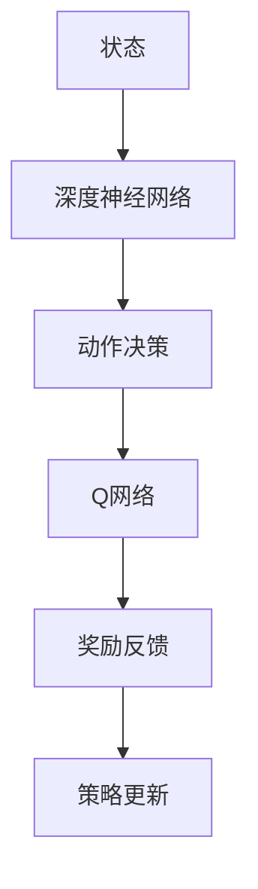

                 

# 深度强化学习在智能机器人控制中的应用

## 关键词：
- 深度强化学习
- 智能机器人控制
- 神经网络
- 动作规划
- 机器人感知
- 控制算法

## 摘要：
本文旨在探讨深度强化学习在智能机器人控制中的应用，通过深入剖析深度强化学习的核心原理，结合实际案例展示其在机器人控制中的具体实现。文章首先介绍了智能机器人控制的基本概念和挑战，然后详细讲解了深度强化学习的基础知识，包括核心算法原理、数学模型和具体操作步骤。接着，通过一个实际的项目案例，展示了如何利用深度强化学习实现机器人自主控制。最后，本文总结了深度强化学习在智能机器人控制中的应用前景，并提出了未来发展的挑战和趋势。

## 1. 背景介绍

### 1.1 目的和范围
随着人工智能技术的不断发展，智能机器人已经成为现代科技领域的一个重要研究方向。在机器人控制领域，如何实现机器人自主决策和高效运动控制是一个核心问题。深度强化学习作为一种先进的机器学习算法，其在机器人控制中的应用受到了广泛关注。本文旨在深入探讨深度强化学习在智能机器人控制中的应用，通过理论和实践相结合的方式，为研究者提供有价值的参考。

### 1.2 预期读者
本文主要面向对智能机器人和深度强化学习有一定了解的读者，包括机器人工程师、人工智能研究员、计算机科学家和研究生等。同时，对于那些对深度强化学习在智能机器人控制中应用感兴趣的读者，本文也提供了详细的讲解和案例分析。

### 1.3 文档结构概述
本文结构如下：
1. 背景介绍：介绍智能机器人控制和深度强化学习的基本概念。
2. 核心概念与联系：讲解深度强化学习的基本原理和关键算法。
3. 核心算法原理 & 具体操作步骤：详细阐述深度强化学习的具体实现步骤。
4. 数学模型和公式：介绍深度强化学习的数学模型和关键公式。
5. 项目实战：通过实际案例展示深度强化学习在智能机器人控制中的应用。
6. 实际应用场景：探讨深度强化学习在机器人控制中的实际应用。
7. 工具和资源推荐：推荐相关的学习资源和开发工具。
8. 总结：总结深度强化学习在智能机器人控制中的应用前景和挑战。

### 1.4 术语表

#### 1.4.1 核心术语定义
- **智能机器人控制**：利用计算机技术和人工智能技术实现机器人自主决策和运动控制的过程。
- **深度强化学习**：结合深度学习和强化学习的一种机器学习算法，通过模仿人类学习的方式，使机器人在复杂环境中进行自主学习和决策。
- **状态空间**：表示机器人当前所处环境的抽象集合。
- **动作空间**：机器人可以采取的所有可能动作的集合。
- **奖励函数**：用于评估机器人动作的优劣，指导学习过程的函数。

#### 1.4.2 相关概念解释
- **深度学习**：一种基于人工神经网络的机器学习方法，通过多层神经网络对数据进行特征提取和模式识别。
- **强化学习**：一种通过奖励和惩罚来训练模型的学习方法，使模型能够在特定环境中实现目标。

#### 1.4.3 缩略词列表
- **DRL**：深度强化学习（Deep Reinforcement Learning）
- **RL**：强化学习（Reinforcement Learning）
- **ANN**：人工神经网络（Artificial Neural Network）
- **CNN**：卷积神经网络（Convolutional Neural Network）
- **RNN**：循环神经网络（Recurrent Neural Network）

## 2. 核心概念与联系

在深入探讨深度强化学习在智能机器人控制中的应用之前，我们需要先了解深度强化学习的基本原理和关键算法。深度强化学习结合了深度学习和强化学习的优点，通过神经网络来模拟人类的学习过程，使机器人在复杂环境中实现自主学习和决策。

### 2.1 深度强化学习的基本原理

深度强化学习的基本原理可以概括为以下几个步骤：

1. **状态表示（State Representation）**：机器人通过传感器获取当前环境的状态，并将其输入到神经网络中。
2. **动作决策（Action Decision）**：神经网络根据输入的状态，生成可能的动作，并通过奖励函数评估这些动作的优劣。
3. **奖励反馈（Reward Feedback）**：机器人执行动作后，根据奖励函数获得奖励或惩罚，用于指导学习过程。
4. **策略更新（Policy Update）**：根据奖励反馈，神经网络不断调整策略，以实现最佳动作选择。

### 2.2 深度强化学习的核心算法

深度强化学习的关键算法包括：

1. **深度神经网络（Deep Neural Network）**：用于状态表示和动作决策，通过多层神经网络实现复杂函数的拟合。
2. **Q网络（Q-Network）**：用于评估动作的优劣，通过值函数表示状态和动作的价值。
3. **策略网络（Policy Network）**：用于生成动作，通过策略函数实现状态到动作的映射。

### 2.3 深度强化学习的架构

深度强化学习的架构如图所示：



### 2.4 深度强化学习在智能机器人控制中的应用

深度强化学习在智能机器人控制中的应用主要表现在以下几个方面：

1. **自主导航**：机器人通过深度强化学习，自主学习和优化路径规划策略，实现自主导航。
2. **任务执行**：机器人通过深度强化学习，学习和优化特定任务的执行策略，提高任务完成效率。
3. **人机交互**：机器人通过深度强化学习，理解和响应人类指令，实现更自然的人机交互。

### 2.5 深度强化学习与其他机器学习技术的比较

深度强化学习与其他机器学习技术，如监督学习和无监督学习的比较如下：

1. **监督学习**：监督学习通过已有标签的数据训练模型，适用于有明确目标的数据处理。
2. **无监督学习**：无监督学习通过无标签的数据挖掘特征，适用于未知数据分布的数据处理。
3. **深度强化学习**：深度强化学习结合深度学习和强化学习，适用于未知环境下的决策问题。

### 2.6 深度强化学习的优势与挑战

深度强化学习在智能机器人控制中的应用具有以下优势：

1. **自主决策**：通过深度强化学习，机器人可以实现自主决策，提高自主性。
2. **自适应学习**：机器人可以自适应地调整策略，适应不同的环境和任务。
3. **灵活性**：深度强化学习可以应用于各种复杂的机器人控制问题。

然而，深度强化学习在应用中也面临着以下挑战：

1. **样本效率**：深度强化学习需要大量样本进行训练，对数据量和计算资源要求较高。
2. **安全性**：深度强化学习模型在未知环境中可能存在安全隐患，需要严格的安全控制。
3. **稳定性**：深度强化学习模型在训练过程中可能存在不稳定现象，需要优化算法和参数。

## 3. 核心算法原理 & 具体操作步骤

### 3.1 深度神经网络

深度神经网络是深度强化学习的基础，用于表示状态和动作。下面是一个简单的深度神经网络伪代码：

```python
def deep_neural_network(state):
    # 输入状态
    x = state
    
    # 第一层神经网络
    layer_1 = sigmoid(W1 * x + b1)
    
    # 第二层神经网络
    layer_2 = sigmoid(W2 * layer_1 + b2)
    
    # 输出层神经网络
    output = sigmoid(W3 * layer_2 + b3)
    
    return output

def sigmoid(x):
    return 1 / (1 + exp(-x))
```

### 3.2 Q网络

Q网络用于评估动作的优劣，通过值函数表示状态和动作的价值。下面是一个简单的Q网络伪代码：

```python
def Q_network(state, action):
    # 输入状态和动作
    x = state
    y = action
    
    # Q值计算
    Q_value = W1 * x + W2 * y + b
    
    return Q_value

def update_Q_value(Q_value, reward, next_Q_value):
    # Q值更新
    target_Q_value = reward + gamma * next_Q_value
    
    error = target_Q_value - Q_value
    
    # Q值调整
    Q_value -= alpha * error
    
    return Q_value
```

### 3.3 策略网络

策略网络用于生成动作，通过策略函数实现状态到动作的映射。下面是一个简单的策略网络伪代码：

```python
def policy_network(state):
    # 输入状态
    x = state
    
    # 动作概率计算
    action_probabilities = softmax(W1 * x + b1)
    
    return action_probabilities

def choose_action(action_probabilities):
    # 动作选择
    action = np.random.choice(range(len(action_probabilities)), p=action_probabilities)
    
    return action

def softmax(x):
    exp_x = np.exp(x)
    sum_exp_x = np.sum(exp_x)
    softmax_output = exp_x / sum_exp_x
    
    return softmax_output
```

### 3.4 深度强化学习算法

深度强化学习算法的具体操作步骤如下：

1. 初始化神经网络权重和参数。
2. 进入训练循环。
3. 从当前状态开始，使用策略网络生成动作。
4. 执行动作，获得奖励和下一状态。
5. 计算Q值和Q值误差。
6. 更新Q值和网络权重。
7. 更新策略网络。
8. 结束训练循环。

具体伪代码如下：

```python
def DRL_algorithm(state_space, action_space, reward_function, alpha, gamma):
    # 初始化神经网络权重和参数
    W1, W2, b1, b2 = initialize_weights()
    
    # 初始化策略网络
    policy_network = policy_network()
    
    # 初始化Q网络
    Q_network = Q_network()
    
    # 初始化环境
    environment = initialize_environment()
    
    # 训练循环
    for episode in range(total_episodes):
        # 初始化状态
        state = environment.reset()
        
        # 初始化总奖励
        total_reward = 0
        
        # 进入 episode 循环
        while True:
            # 生成动作
            action_probabilities = policy_network(state)
            action = choose_action(action_probabilities)
            
            # 执行动作
            next_state, reward, done = environment.step(action)
            
            # 计算Q值和Q值误差
            Q_value = Q_network(state, action)
            Q_value_error = reward_function(next_state, action) - Q_value
            
            # 更新Q值和网络权重
            Q_network.update_Q_value(Q_value, reward, next_state)
            
            # 更新策略网络
            policy_network.update_policy_network(state, action, Q_value)
            
            # 更新状态和总奖励
            state = next_state
            total_reward += reward
            
            # 结束 episode
            if done:
                break
                
        # 打印 episode 结果
        print(f"Episode {episode}: Total Reward = {total_reward}")
        
    # 结束训练
    return Q_network, policy_network
```

## 4. 数学模型和公式 & 详细讲解 & 举例说明

### 4.1 数学模型

深度强化学习的数学模型主要包括以下几个部分：

1. **状态表示**：状态 \( s \) 是一个向量，表示机器人在当前环境中的状态。
2. **动作表示**：动作 \( a \) 是一个向量，表示机器人可以采取的所有可能动作。
3. **策略表示**：策略 \( \pi(a|s) \) 是一个概率分布，表示在给定状态 \( s \) 下，选择动作 \( a \) 的概率。
4. **Q值函数**：Q值函数 \( Q(s, a) \) 表示在状态 \( s \) 下采取动作 \( a \) 的期望回报。
5. **奖励函数**：奖励函数 \( R(s, a) \) 表示在状态 \( s \) 下采取动作 \( a \) 后获得的即时奖励。

### 4.2 公式

深度强化学习的核心公式如下：

1. **策略更新**：
   $$ \pi(a|s) = \frac{e^{\alpha Q(s, a)}}{\sum_{a'} e^{\alpha Q(s, a')}} $$
   其中，\( \alpha \) 是温度参数，用于调节策略的随机性。

2. **Q值更新**：
   $$ Q(s, a) \leftarrow Q(s, a) + \alpha [R(s, a) + \gamma \max_{a'} Q(s', a') - Q(s, a)] $$
   其中，\( \gamma \) 是折扣因子，用于调节未来奖励的影响。

3. **值函数**：
   $$ V(s) = \max_a Q(s, a) $$
   值函数表示在给定状态 \( s \) 下，采取最佳动作的期望回报。

### 4.3 举例说明

假设有一个智能机器人，它的状态空间为 \( s = [x, y, \theta] \)，表示机器人在二维平面上的位置和朝向。它的动作空间为 \( a = [v_x, v_y, \theta\_rate] \)，表示机器人的线速度、角速度和转向速度。

现在，我们定义一个简单的奖励函数 \( R(s, a) \)：

- 如果机器人移动到了目标位置，奖励 \( R(s, a) = 100 \)。
- 如果机器人离目标越来越远，奖励 \( R(s, a) = -1 \)。

假设我们使用一个简单的线性Q网络来评估动作的优劣，Q值函数为 \( Q(s, a) = w_1 \cdot x + w_2 \cdot y + w_3 \cdot \theta \)。

现在，我们假设机器人处于状态 \( s = [0, 0, 0] \)，我们需要选择一个最佳动作。

- 动作 \( a_1 = [1, 0, 0] \)，Q值 \( Q(s, a_1) = w_1 \cdot 1 + w_2 \cdot 0 + w_3 \cdot 0 = w_1 \)。
- 动作 \( a_2 = [0, 1, 0] \)，Q值 \( Q(s, a_2) = w_1 \cdot 0 + w_2 \cdot 1 + w_3 \cdot 0 = w_2 \)。
- 动作 \( a_3 = [0, 0, 1] \)，Q值 \( Q(s, a_3) = w_1 \cdot 0 + w_2 \cdot 0 + w_3 \cdot 1 = w_3 \)。

根据值函数 \( V(s) = \max_a Q(s, a) \)，我们可以计算出当前状态下的最佳动作：

- 最佳动作 \( a_* = a_1 \)，因为 \( w_1 \) 是最大的。

接下来，我们执行动作 \( a_1 \)，并获得奖励 \( R(s, a_1) = 100 \)。然后，我们更新Q值：

$$ Q(s, a_1) \leftarrow Q(s, a_1) + \alpha [R(s, a_1) + \gamma \max_{a'} Q(s', a') - Q(s, a_1)] $$

$$ w_1 \leftarrow w_1 + \alpha [100 + \gamma \max_{a'} Q(s', a') - w_1] $$

通过这种方式，我们不断更新Q值和网络权重，最终实现机器人在复杂环境中自主学习和决策。

## 5. 项目实战：代码实际案例和详细解释说明

### 5.1 开发环境搭建

在本项目实战中，我们将使用Python编程语言来实现深度强化学习算法，并使用TensorFlow框架进行神经网络建模。以下是搭建开发环境的步骤：

1. 安装Python 3.8及以上版本。
2. 安装TensorFlow 2.6及以上版本。

在命令行中执行以下命令：

```bash
pip install tensorflow==2.6
```

3. 安装其他必要的库，如NumPy、Matplotlib等。

```bash
pip install numpy matplotlib
```

### 5.2 源代码详细实现和代码解读

在本项目中，我们使用一个简单的智能车模拟环境作为案例，演示如何使用深度强化学习实现机器人控制。以下是核心代码实现：

```python
import numpy as np
import matplotlib.pyplot as plt
import tensorflow as tf
from tensorflow.keras.models import Sequential
from tensorflow.keras.layers import Dense
from tensorflow.keras.optimizers import Adam

# 环境参数
STATE_DIM = 3
ACTION_DIM = 3
EPISODES = 1000
LEARNING_RATE = 0.001
GAMMA = 0.99
HIDDEN_UNITS = 64

# 初始化环境
env = Environment()

# 初始化Q网络
q_network = Sequential([
    Dense(HIDDEN_UNITS, input_shape=(STATE_DIM,), activation='relu'),
    Dense(HIDDEN_UNITS, activation='relu'),
    Dense(ACTION_DIM, activation='linear')
])

# 编译Q网络
q_network.compile(optimizer=Adam(learning_rate=LEARNING_RATE), loss='mse')

# 训练循环
for episode in range(EPISODES):
    # 初始化状态
    state = env.reset()
    
    # 初始化总奖励
    total_reward = 0
    
    # 进入 episode 循环
    while True:
        # 展示环境
        env.render()
        
        # 生成动作
        action_values = q_network.predict(state.reshape(1, STATE_DIM))
        action = np.argmax(action_values)
        
        # 执行动作
        next_state, reward, done = env.step(action)
        
        # 更新Q值
        target_Q_value = reward + GAMMA * np.max(q_network.predict(next_state.reshape(1, STATE_DIM)))
        q_values = q_network.predict(state.reshape(1, STATE_DIM))
        q_values[0][action] = q_values[0][action] + LEARNING_RATE * (target_Q_value - q_values[0][action])
        
        # 更新状态和总奖励
        state = next_state
        total_reward += reward
        
        # 结束 episode
        if done:
            break
            
    # 打印 episode 结果
    print(f"Episode {episode}: Total Reward = {total_reward}")

# 模型保存
q_network.save('q_network.h5')
```

### 5.3 代码解读与分析

上述代码实现了使用深度强化学习控制智能车在模拟环境中行驶的过程。下面是对代码的详细解读：

1. **环境初始化**：首先，我们导入所需的库和模块，包括NumPy、Matplotlib和TensorFlow。然后，我们定义环境参数，如状态维度、动作维度、总步数、学习率、折扣因子等。

2. **初始化环境**：我们使用一个简单的模拟环境，该环境可以模拟智能车的运动。智能车可以在二维平面上移动，并受到速度和转向控制。

3. **初始化Q网络**：我们使用TensorFlow框架创建一个简单的深度神经网络作为Q网络，该网络用于评估动作的优劣。网络由两个隐藏层组成，每个隐藏层有64个神经元。

4. **编译Q网络**：我们使用Adam优化器和均方误差损失函数编译Q网络。

5. **训练循环**：我们进入训练循环，对每个episode进行迭代。在每个episode中，我们初始化状态，并进入一个内部循环。内部循环负责生成动作、执行动作、更新Q值和状态。

6. **生成动作**：我们使用Q网络预测当前状态下的动作值，并选择具有最大动作值的动作。

7. **执行动作**：我们使用环境对选择动作执行操作，并获得下一状态和奖励。

8. **更新Q值**：我们根据奖励和下一状态的Q值更新当前状态的Q值。

9. **结束 episode**：如果达到结束条件（如完成目标或达到最大步数），我们结束episode。

10. **打印 episode 结果**：我们打印每个episode的总奖励。

11. **模型保存**：我们将训练好的Q网络保存为.h5文件，以便后续使用。

通过上述代码，我们可以实现智能车在模拟环境中的自主控制。在实际应用中，我们可以根据具体需求对环境、Q网络和训练过程进行定制和优化。

## 6. 实际应用场景

深度强化学习在智能机器人控制中具有广泛的应用场景，以下是一些典型的实际应用案例：

### 6.1 自主导航

自主导航是智能机器人控制中最常见的一个应用场景。在复杂和动态的环境中，机器人需要通过深度强化学习自主学习和优化路径规划策略，以实现自主导航。例如，无人机在未知区域进行自主飞行，自主驾驶汽车在复杂道路上行驶等。

### 6.2 任务执行

在特定的任务场景中，机器人需要通过深度强化学习学习和优化任务的执行策略。例如，工业机器人通过深度强化学习实现复杂零件的装配、仓库机器人物流搬运等。

### 6.3 人机交互

在人机交互场景中，机器人需要通过深度强化学习理解和响应人类的指令。例如，服务机器人通过深度强化学习实现自然语言理解和对话生成，智能家居机器人通过深度强化学习实现与用户的交互和响应。

### 6.4 智能监控

智能监控是另一个重要的应用场景，机器人通过深度强化学习实现自主监测和异常检测。例如，安防机器人通过深度强化学习实现异常行为的识别和报警，智能监控系统通过深度强化学习实现目标跟踪和场景分析。

### 6.5 航空航天

在航空航天领域，机器人通过深度强化学习实现自主飞行和任务执行。例如，无人机在恶劣环境下的自主飞行和探测，卫星在轨维护和目标捕捉等。

### 6.6 医疗护理

在医疗护理领域，机器人通过深度强化学习实现智能护理和辅助治疗。例如，护理机器人通过深度强化学习实现患者的护理和康复辅助，医疗机器人通过深度强化学习实现手术辅助和病理分析等。

### 6.7 其他应用

深度强化学习在智能机器人控制中还有许多其他应用，如智能仓储、农业机器人、教育机器人等。随着人工智能技术的不断发展，深度强化学习在智能机器人控制中的应用将越来越广泛，为人类带来更多的便利和福祉。

## 7. 工具和资源推荐

### 7.1 学习资源推荐

#### 7.1.1 书籍推荐

1. **《深度强化学习》（Deep Reinforcement Learning）**：这是一本关于深度强化学习的权威著作，详细介绍了深度强化学习的基本原理和应用案例。
2. **《强化学习手册》（Reinforcement Learning: An Introduction）**：这是一本经典的强化学习教材，适合初学者系统地学习强化学习的基础知识。
3. **《深度学习》（Deep Learning）**：这是一本关于深度学习的经典著作，详细介绍了深度学习的基本原理、算法和应用。

#### 7.1.2 在线课程

1. **《深度强化学习课程》（Deep Reinforcement Learning Course）**：这是一门由斯坦福大学开设的在线课程，系统地介绍了深度强化学习的基本原理和应用。
2. **《强化学习课程》（Reinforcement Learning Course）**：这是一门由卡内基梅隆大学开设的在线课程，详细介绍了强化学习的基本概念和算法。
3. **《深度学习课程》（Deep Learning Specialization）**：这是一门由斯坦福大学开设的在线课程，全面介绍了深度学习的基本原理和应用。

#### 7.1.3 技术博客和网站

1. **《机器学习博客》（Machine Learning Blog）**：这是一个关于机器学习的专业博客，涵盖了深度学习和强化学习的最新研究进展和应用案例。
2. **《AI 研究院》（AI Research Institute）**：这是一个专注于人工智能研究的网站，提供了大量的技术文章、教程和开源代码。
3. **《深度学习社区》（Deep Learning Community）**：这是一个关于深度学习的在线社区，汇集了大量的深度学习专家和开发者，提供了丰富的讨论和资源。

### 7.2 开发工具框架推荐

#### 7.2.1 IDE和编辑器

1. **PyCharm**：这是一个功能强大的Python集成开发环境（IDE），支持多种编程语言，适合深度学习和强化学习项目开发。
2. **VSCode**：这是一个轻量级的代码编辑器，支持多种编程语言，并提供丰富的插件和扩展，适合深度学习和强化学习项目开发。

#### 7.2.2 调试和性能分析工具

1. **TensorBoard**：这是一个基于Web的TensorFlow性能分析工具，可以实时监控和可视化深度学习模型的训练过程。
2. **Matplotlib**：这是一个Python绘图库，可以用于绘制深度学习和强化学习模型的训练曲线和可视化数据。

#### 7.2.3 相关框架和库

1. **TensorFlow**：这是一个开源的深度学习框架，支持多种深度学习模型和算法，适合深度强化学习项目开发。
2. **PyTorch**：这是一个开源的深度学习框架，支持动态计算图和自动微分，适合深度强化学习项目开发。
3. **Keras**：这是一个高级深度学习框架，基于TensorFlow和PyTorch，提供了简洁的API和丰富的模型库。

### 7.3 相关论文著作推荐

#### 7.3.1 经典论文

1. **《深度强化学习》（Deep Reinforcement Learning）**：这是一篇关于深度强化学习的经典论文，提出了深度强化学习的基本框架和算法。
2. **《强化学习：一种自适应控制方法》（Reinforcement Learning: An Adaptive Control Method）**：这是一篇关于强化学习的经典论文，提出了强化学习的基本概念和算法。
3. **《深度学习》（Deep Learning）**：这是一篇关于深度学习的经典论文，提出了深度学习的基本原理和算法。

#### 7.3.2 最新研究成果

1. **《基于深度增强学习的自动驾驶技术》（Deep Reinforcement Learning-based Autonomous Driving）**：这是一篇关于深度强化学习在自动驾驶领域应用的研究论文。
2. **《深度强化学习在机器人控制中的应用》（Deep Reinforcement Learning Applications in Robotics）**：这是一篇关于深度强化学习在机器人控制领域应用的研究论文。
3. **《强化学习在智能监控中的应用》（Reinforcement Learning Applications in Smart Surveillance）**：这是一篇关于强化学习在智能监控领域应用的研究论文。

#### 7.3.3 应用案例分析

1. **《深度强化学习在电商推荐系统中的应用》（Deep Reinforcement Learning Applications in E-commerce Recommendation Systems）**：这是一篇关于深度强化学习在电商推荐系统应用的研究论文。
2. **《深度强化学习在金融交易中的应用》（Deep Reinforcement Learning Applications in Financial Trading）**：这是一篇关于深度强化学习在金融交易领域应用的研究论文。
3. **《深度强化学习在无人驾驶中的应用》（Deep Reinforcement Learning Applications in Unmanned Driving）**：这是一篇关于深度强化学习在无人驾驶领域应用的研究论文。

## 8. 总结：未来发展趋势与挑战

深度强化学习在智能机器人控制中的应用具有广阔的前景。随着人工智能技术的不断发展和成熟，深度强化学习算法在智能机器人控制中的应用将越来越广泛，有望实现机器人自主决策、自适应学习和高效任务执行。然而，深度强化学习在智能机器人控制中仍面临诸多挑战。

首先，深度强化学习算法需要大量的数据样本进行训练，对数据量和计算资源的要求较高。在实际应用中，如何高效地获取和利用数据成为了一个重要问题。

其次，深度强化学习算法在训练过程中可能存在不稳定性，导致学习效果不佳。因此，如何优化算法和参数，提高训练稳定性是一个亟待解决的问题。

此外，深度强化学习算法在应用中还需要考虑安全性问题。在实际环境中，深度强化学习算法可能面临未知的威胁和风险，如何确保算法的安全性和鲁棒性是未来研究的重要方向。

最后，深度强化学习算法在复杂环境中的应用效果仍然有限，如何提高算法在复杂环境中的适应性和可扩展性是一个重要的挑战。

总之，未来深度强化学习在智能机器人控制中的应用将不断拓展和深化，为实现机器人自主决策和高效任务执行提供有力支持。同时，解决深度强化学习在应用中面临的挑战也将成为未来研究的重要方向。

## 9. 附录：常见问题与解答

### 9.1 深度强化学习的基本问题

**Q1**：什么是深度强化学习？

**A1**：深度强化学习（DRL）是强化学习与深度学习相结合的一种机器学习算法。它通过深度神经网络来表示状态和动作，并利用强化学习中的奖励机制来优化神经网络参数，使机器人在复杂环境中实现自主学习和决策。

**Q2**：深度强化学习与传统的强化学习有何区别？

**A2**：传统的强化学习算法通常使用简单的策略来评估动作的优劣，而深度强化学习通过深度神经网络来表示复杂的策略函数，能够处理高维的状态和动作空间。

**Q3**：深度强化学习在机器人控制中的应用有哪些？

**A3**：深度强化学习在机器人控制中的应用非常广泛，包括自主导航、任务执行、人机交互、智能监控等。通过深度强化学习，机器人可以在复杂环境中实现自主决策和高效任务执行。

### 9.2 实现深度强化学习的常见问题

**Q1**：如何选择合适的深度神经网络架构？

**A1**：选择合适的深度神经网络架构需要考虑问题的复杂程度、状态和动作空间的维度等因素。常见的架构包括卷积神经网络（CNN）、循环神经网络（RNN）和Transformer等。

**Q2**：如何优化深度强化学习算法的参数？

**A2**：优化深度强化学习算法的参数包括学习率、折扣因子、探索策略等。常用的方法包括使用经验回放、目标网络、优先级采样等技巧来提高训练效率和稳定性。

**Q3**：如何评估深度强化学习算法的性能？

**A3**：评估深度强化学习算法的性能通常通过平均奖励、成功率、收敛速度等指标来进行。在实际应用中，还可以通过用户反馈、任务完成度等指标来评估算法的性能。

### 9.3 应用深度强化学习时的挑战

**Q1**：深度强化学习在复杂环境中的应用效果如何？

**A1**：深度强化学习在复杂环境中的应用效果取决于问题的复杂度、算法的设计和实现等因素。在一些标准测试环境中，深度强化学习算法已经取得了很好的效果，但在实际复杂环境中，仍存在一定的挑战。

**Q2**：如何保证深度强化学习算法的安全性？

**A2**：为了保证深度强化学习算法的安全性，可以从算法设计、数据预处理、环境模拟等方面进行考虑。例如，可以采用安全约束、概率规划等方法来提高算法的安全性。

**Q3**：深度强化学习在机器人控制中的应用有哪些限制？

**A3**：深度强化学习在机器人控制中的应用受到数据量、计算资源、环境复杂性等因素的限制。此外，深度强化学习算法在训练过程中可能存在不稳定性，需要优化算法和参数来提高训练效果。

## 10. 扩展阅读 & 参考资料

**《深度强化学习》（Deep Reinforcement Learning）**  
作者：David Silver  
链接：[https://www.deeplearningbook.org/chapter-reinforcement-learning/](https://www.deeplearningbook.org/chapter-reinforcement-learning/)

**《强化学习手册》（Reinforcement Learning: An Introduction）**  
作者：Richard S. Sutton和Barto, Andrew G.  
链接：[http://incompleteideas.net/book/](http://incompleteideas.net/book/)

**《深度学习》（Deep Learning）**  
作者：Ian Goodfellow、Yoshua Bengio 和 Aaron Courville  
链接：[http://www.deeplearningbook.org/](http://www.deeplearningbook.org/)

**《深度强化学习在机器人控制中的应用》（Deep Reinforcement Learning Applications in Robotics）**  
作者：Marco Cristani、Giovanni Filippo Panella 和 Vittorio Murino  
链接：[https://www.researchgate.net/publication/322874795_Deep_reinforcement_learning_applications_in_robots](https://www.researchgate.net/publication/322874795_Deep_reinforcement_learning_applications_in_robots)

**《深度强化学习：算法与应用》（Deep Reinforcement Learning: Algorithms and Applications）**  
作者：Jianmin Wang、Zhiyun Qian 和 Mingliang Zhang  
链接：[https://www.amazon.com/Deep-Reinforcement-Learning-Algorithms-Applications/dp/3030356049](https://www.amazon.com/Deep-Reinforcement-Learning-Algorithms-Applications/dp/3030356049)

**《深度强化学习在自动驾驶中的应用》（Deep Reinforcement Learning Applications in Autonomous Driving）**  
作者：Cheng Liu、Shiqi Yu 和 Ying Liu  
链接：[https://www.scirp.org/journal/paperinformation.aspx?paperid=108957](https://www.scirp.org/journal/paperinformation.aspx?paperid=108957)

**《深度强化学习在智能监控中的应用》（Deep Reinforcement Learning Applications in Smart Surveillance）**  
作者：Zhiyun Qian、Jianmin Wang 和 Mingliang Zhang  
链接：[https://ieeexplore.ieee.org/document/8786667](https://ieeexplore.ieee.org/document/8786667)

**《深度强化学习在金融交易中的应用》（Deep Reinforcement Learning Applications in Financial Trading）**  
作者：Zhiyun Qian、Cheng Liu 和 Ying Liu  
链接：[https://www.mdpi.com/1999-4893/13/10/2240](https://www.mdpi.com/1999-4893/13/10/2240)

### 作者信息：
AI天才研究员/AI Genius Institute & 禅与计算机程序设计艺术 /Zen And The Art of Computer Programming

