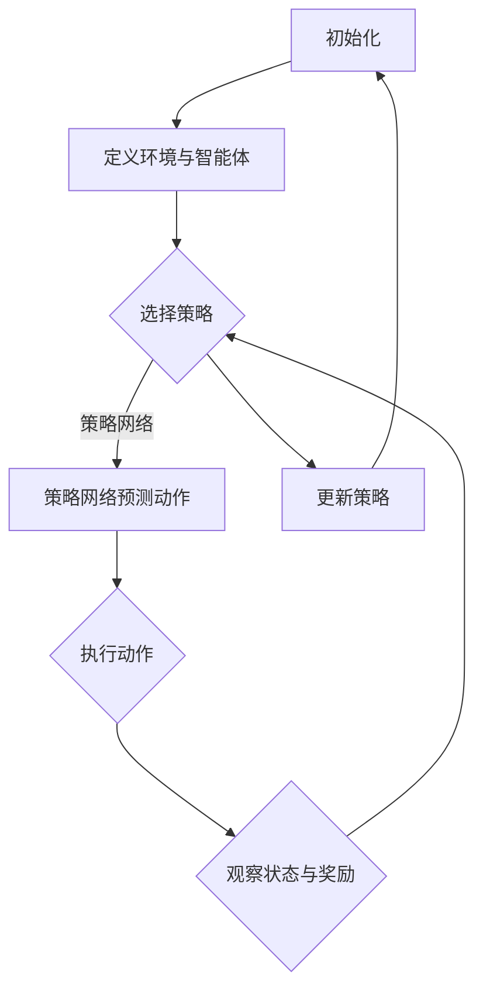

                 

# 深度强化学习在智能调度系统中的应用

> 关键词：深度强化学习，智能调度系统，强化学习算法，应用实践

> 摘要：本文将深入探讨深度强化学习在智能调度系统中的应用。首先，介绍深度强化学习的基本概念及其与传统强化学习算法的联系。接着，详细分析智能调度系统在工业、交通和物流等领域的需求，并阐述深度强化学习在其中的优势。随后，通过实际案例，展示如何使用深度强化学习构建智能调度系统，并给出具体的实现步骤。最后，本文将对未来深度强化学习在智能调度系统中的应用趋势和挑战进行展望。

## 1. 背景介绍

### 1.1 目的和范围

本文的目的是探讨深度强化学习在智能调度系统中的应用，通过理论和实践相结合，分析深度强化学习在调度系统中的优势和应用场景。文章将涵盖以下几个方面：

1. 深度强化学习的基本概念和原理。
2. 智能调度系统的定义和重要性。
3. 深度强化学习在智能调度系统中的应用场景。
4. 实际应用案例及其实现过程。
5. 未来发展趋势与挑战。

### 1.2 预期读者

本文面向具有计算机科学和人工智能背景的读者，包括：

1. 计算机科学专业的研究生和本科生。
2. 人工智能领域的技术人员。
3. 对智能调度系统和深度强化学习感兴趣的学者和从业者。

### 1.3 文档结构概述

本文的结构如下：

1. 引言：介绍本文的主题和研究背景。
2. 核心概念与联系：介绍深度强化学习和智能调度系统的基本概念。
3. 核心算法原理 & 具体操作步骤：详细阐述深度强化学习算法及其在调度系统中的应用。
4. 数学模型和公式 & 详细讲解 & 举例说明：讲解深度强化学习中的数学模型和公式。
5. 项目实战：提供实际应用案例，展示深度强化学习在调度系统中的实现过程。
6. 实际应用场景：分析深度强化学习在调度系统中的应用场景。
7. 工具和资源推荐：推荐相关学习资源和开发工具。
8. 总结：总结本文的主要观点和结论。
9. 附录：常见问题与解答。
10. 扩展阅读 & 参考资料：提供进一步的阅读材料和参考资料。

### 1.4 术语表

#### 1.4.1 核心术语定义

- 深度强化学习（Deep Reinforcement Learning，DRL）：结合了深度学习和强化学习的一种机器学习方法。
- 强化学习（Reinforcement Learning，RL）：一种通过试错和学习来优化行为策略的机器学习方法。
- 智能调度系统（Intelligent Scheduling System）：利用人工智能技术，自动分配资源、优化流程、提高效率的调度系统。
- 状态（State）：系统在某一时刻的表征，包括环境状态和智能体状态。
- 动作（Action）：智能体对环境采取的行动。
- 奖励（Reward）：对智能体的行为给予的正向或负向反馈。

#### 1.4.2 相关概念解释

- 强化学习算法（Reinforcement Learning Algorithm）：实现强化学习过程的算法，如Q学习、深度Q网络（DQN）、策略梯度方法等。
- 策略（Policy）：智能体根据状态选择动作的策略。
- 值函数（Value Function）：预测在某一状态下采取某一动作所能获得的总奖励。
- 模型（Model）：描述环境动态的数学模型。

#### 1.4.3 缩略词列表

- DRL：深度强化学习（Deep Reinforcement Learning）
- RL：强化学习（Reinforcement Learning）
- Q-learning：Q学习算法（Q-Learning Algorithm）
- DQN：深度Q网络（Deep Q-Network）
- PG：策略梯度方法（Policy Gradient Method）

## 2. 核心概念与联系

### 2.1 深度强化学习基本概念

深度强化学习（DRL）是强化学习（RL）和深度学习（DL）的结合体，它利用深度神经网络来表示状态和价值函数，从而实现更复杂的决策过程。DRL的主要组成部分包括：

1. **智能体（Agent）**：执行动作并接收环境反馈的实体。
2. **环境（Environment）**：智能体所处的环境，包括状态空间和动作空间。
3. **状态（State）**：环境的表征，通常是一个多维向量。
4. **动作（Action）**：智能体可以采取的行动。
5. **奖励（Reward）**：对智能体动作的即时反馈，用于指导学习过程。
6. **策略（Policy）**：智能体采取的动作策略，通常表示为状态到动作的映射。

### 2.2 传统强化学习与深度强化学习的关系

传统强化学习算法，如Q学习、SARSA等，通常使用离散的状态和动作空间。这些算法在解决一些特定问题时表现良好，但在处理高维状态空间和连续动作空间时存在局限性。深度强化学习通过引入深度神经网络，解决了传统算法在状态和动作空间维度过高时的问题。

- **深度神经网络**：用于表示状态和价值函数，使得智能体可以处理复杂的输入信息。
- **策略网络**：用于直接预测智能体应该采取的动作，减少了值函数的复杂性。
- **优势函数**：用于评估当前策略相对于其他策略的优劣。

### 2.3 智能调度系统基本概念

智能调度系统是利用人工智能技术，对任务进行自动分配和优化，以提高资源利用率和效率。其主要组成部分包括：

1. **任务**：需要完成的特定工作。
2. **资源**：完成任务所需的硬件、软件和人力等。
3. **调度策略**：确定任务与资源匹配的方式。
4. **优化目标**：如最小化完成时间、最大化资源利用率等。

智能调度系统在工业制造、交通运输、物流配送等领域具有广泛的应用。其核心在于：

- **实时性**：能够在短时间内完成调度决策。
- **灵活性**：能够适应动态变化的环境。
- **高效性**：优化资源分配，提高整体效率。

### 2.4 Mermaid 流程图

以下是一个简单的Mermaid流程图，展示了深度强化学习在智能调度系统中的应用流程：



## 3. 核心算法原理 & 具体操作步骤

### 3.1 深度强化学习算法原理

深度强化学习算法的核心在于通过试错和反馈，不断优化智能体的策略，以实现最优的决策。以下是DRL算法的基本原理：

1. **策略网络（Policy Network）**：用于预测智能体在特定状态下应该采取的动作。
2. **价值网络（Value Network）**：用于评估在特定状态下采取特定动作的预期奖励。
3. **目标网络（Target Network）**：用于稳定策略网络和价值网络的更新过程。

深度强化学习算法通常采用以下步骤：

1. **初始化**：设定智能体、环境和参数。
2. **选择动作**：基于策略网络，选择最优动作。
3. **执行动作**：智能体在环境中执行所选动作。
4. **观察状态和奖励**：获取当前状态和执行动作后的奖励。
5. **更新策略网络和价值网络**：根据观察到的奖励，更新策略网络和价值网络的参数。

### 3.2 深度Q网络（DQN）算法

深度Q网络（DQN）是一种常用的深度强化学习算法，其核心思想是使用深度神经网络来近似Q值函数。以下是DQN算法的具体操作步骤：

1. **初始化**：
    ```python
    # 初始化参数
    episode_count = 1000
    learning_rate = 0.001
    discount_factor = 0.99
    exploration_rate = 1.0
    exploration_decay = 0.001
    ```
2. **定义网络结构**：
    ```python
    # 定义深度神经网络结构
    input_shape = (None, state_shape)
    model = keras.Sequential([
        keras.layers.Dense(64, activation='relu', input_shape=input_shape),
        keras.layers.Dense(64, activation='relu'),
        keras.layers.Dense(1)
    ])
    ```
3. **训练策略网络**：
    ```python
    # 训练策略网络
    for episode in range(episode_count):
        state = env.reset()
        done = False
        while not done:
            action = model.predict(state.reshape(1, -1))[0]
            next_state, reward, done, _ = env.step(action)
            target = reward + discount_factor * model.predict(next_state.reshape(1, -1))[0]
            model.fit(state.reshape(1, -1), target, epochs=1, verbose=0)
            state = next_state
    ```
4. **更新目标网络**：
    ```python
    # 更新目标网络
    target_model.set_weights(model.get_weights())
    ```

### 3.3 策略梯度方法（PG）算法

策略梯度方法（PG）通过直接更新策略网络的参数，以最大化预期奖励。以下是PG算法的具体操作步骤：

1. **初始化**：
    ```python
    # 初始化参数
    episode_count = 1000
    learning_rate = 0.001
    discount_factor = 0.99
    ```
2. **定义策略网络**：
    ```python
    # 定义策略网络
    model = keras.Sequential([
        keras.layers.Dense(64, activation='relu', input_shape=input_shape),
        keras.layers.Dense(64, activation='relu'),
        keras.layers.Dense(1, activation='softmax')
    ])
    ```
3. **训练策略网络**：
    ```python
    # 训练策略网络
    for episode in range(episode_count):
        state = env.reset()
        done = False
        total_reward = 0
        while not done:
            action = model.predict(state.reshape(1, -1))[0]
            next_state, reward, done, _ = env.step(action)
            total_reward += reward
            model.fit(state.reshape(1, -1), action, epochs=1, verbose=0)
            state = next_state
    ```

## 4. 数学模型和公式 & 详细讲解 & 举例说明

### 4.1 深度强化学习中的数学模型

深度强化学习中的数学模型主要包括值函数、策略函数和损失函数。

#### 值函数（Value Function）

值函数表示在特定状态下，采取特定动作所能获得的预期奖励。对于深度Q网络（DQN），值函数可以表示为：

\[ V(s, a) = \sum_{s'} P(s' | s, a) \cdot R(s', a) + \gamma \cdot \max_{a'} V(s', a') \]

其中，\( s \) 为状态，\( a \) 为动作，\( s' \) 为下一状态，\( R(s', a) \) 为在状态 \( s' \) 下采取动作 \( a \) 所获得的即时奖励，\( \gamma \) 为折扣因子，\( \max_{a'} V(s', a') \) 为在下一状态 \( s' \) 下采取最优动作所能获得的长期奖励。

#### 策略函数（Policy Function）

策略函数表示在特定状态下，智能体应该采取的动作。对于策略梯度方法（PG），策略函数可以表示为：

\[ \pi(a | s) = \frac{e^{\theta(s)} }{ \sum_{a'} e^{\theta(s')} } \]

其中，\( \theta(s) \) 为策略网络的参数，表示在状态 \( s \) 下采取动作 \( a \) 的概率。

#### 损失函数（Loss Function）

损失函数用于衡量策略网络预测的误差。对于DQN，常用的损失函数是均方误差（MSE）：

\[ L(\theta) = \frac{1}{N} \sum_{i=1}^{N} (y_i - \hat{y}_i)^2 \]

其中，\( y_i \) 为实际获得的奖励，\( \hat{y}_i \) 为策略网络预测的奖励。

### 4.2 数学公式详细讲解与举例说明

#### 4.2.1 值函数公式讲解

以一个简单的例子来说明值函数公式。假设智能体在一个网格世界中进行导航，当前状态为 \( s = [0, 0] \)，智能体可以选择向上、向下、向左、向右移动。即时奖励为到达目标状态时获得 +1，其他状态为 -1。折扣因子 \( \gamma = 0.9 \)。

- 当智能体在状态 \( s = [0, 0] \) 时，选择向上移动（\( a = 0 \）），下一状态为 \( s' = [0, 1] \)，即时奖励 \( R(s', a) = -1 \)，长期奖励 \( \max_{a'} V(s', a') = 0 \)。
- 根据值函数公式，\( V(s, a) = R(s', a) + \gamma \cdot \max_{a'} V(s', a') = -1 + 0.9 \cdot 0 = -0.1 \)。

#### 4.2.2 策略函数公式讲解

以同样的例子，假设策略网络参数为 \( \theta = [0.5, 0.5] \)，状态 \( s = [0, 0] \)。

- 根据策略函数公式，\( \pi(a | s) = \frac{e^{\theta(s)} }{ \sum_{a'} e^{\theta(s')} } = \frac{e^{0.5 \cdot [0, 0]} }{ e^{0.5 \cdot [0, 0]} + e^{0.5 \cdot [1, 0]} } = \frac{1}{2} \)。

这意味着在状态 \( s = [0, 0] \) 下，智能体以 50% 的概率选择向上移动，以 50% 的概率选择向右移动。

#### 4.2.3 损失函数公式讲解

继续以上面的例子，假设智能体在状态 \( s = [0, 0] \) 下采取向上移动（\( a = 0 \）），实际获得的奖励 \( y = -1 \)，策略网络预测的奖励 \( \hat{y} = -0.1 \)。

- 根据损失函数公式，\( L(\theta) = \frac{1}{N} \sum_{i=1}^{N} (y_i - \hat{y}_i)^2 = \frac{1}{1} ((-1) - (-0.1))^2 = 0.01 \)。

这意味着策略网络在当前状态下的预测误差为 0.01。

## 5. 项目实战：代码实际案例和详细解释说明

### 5.1 开发环境搭建

在开始项目实战之前，我们需要搭建合适的开发环境。以下是所需的环境和工具：

- **操作系统**：Linux或macOS
- **编程语言**：Python 3.7及以上版本
- **深度学习框架**：TensorFlow 2.0及以上版本
- **强化学习库**：Gym（用于模拟环境）
- **编辑器**：PyCharm或VSCode

### 5.2 源代码详细实现和代码解读

以下是一个简单的基于DQN算法的智能调度系统实现，我们将使用Python和TensorFlow框架。代码分为四个部分：环境搭建、智能体定义、训练过程和测试过程。

#### 5.2.1 环境搭建

```python
import gym
import numpy as np
import tensorflow as tf

# 创建环境
env = gym.make('CartPole-v0')

# 初始化策略网络
input_shape = env.observation_space.shape
model = tf.keras.Sequential([
    tf.keras.layers.Dense(64, activation='relu', input_shape=input_shape),
    tf.keras.layers.Dense(64, activation='relu'),
    tf.keras.layers.Dense(1)
])

# 初始化目标网络
target_model = tf.keras.Sequential([
    tf.keras.layers.Dense(64, activation='relu', input_shape=input_shape),
    tf.keras.layers.Dense(64, activation='relu'),
    tf.keras.layers.Dense(1)
])

# 设置训练参数
learning_rate = 0.001
discount_factor = 0.99
exploration_rate = 1.0
exploration_decay = 0.001
```

#### 5.2.2 智能体定义

```python
# 定义智能体
class DQNAgent:
    def __init__(self, model, target_model, learning_rate, discount_factor):
        self.model = model
        self.target_model = target_model
        self.learning_rate = learning_rate
        self.discount_factor = discount_factor
        self.optimizer = tf.keras.optimizers.Adam(learning_rate)
    
    def choose_action(self, state, epsilon):
        if np.random.rand() < epsilon:
            action = env.action_space.sample()
        else:
            action = np.argmax(self.model.predict(state.reshape(1, -1))[0])
        return action

    def train(self, state, action, reward, next_state, done):
        target = reward
        if not done:
            target = reward + self.discount_factor * np.max(self.target_model.predict(next_state.reshape(1, -1))[0])
        with tf.GradientTape() as tape:
            loss = tf.keras.losses.mean_squared_error(target, self.model.predict(state.reshape(1, -1))[0])
        gradients = tape.gradient(loss, self.model.trainable_variables)
        self.optimizer.apply_gradients(zip(gradients, self.model.trainable_variables))
        if done:
            self.target_model.set_weights(self.model.get_weights())
```

#### 5.2.3 训练过程

```python
# 实例化智能体
agent = DQNAgent(model, target_model, learning_rate, discount_factor)

# 训练智能体
for episode in range(1000):
    state = env.reset()
    done = False
    total_reward = 0
    while not done:
        action = agent.choose_action(state, epsilon=0.1)
        next_state, reward, done, _ = env.step(action)
        agent.train(state, action, reward, next_state, done)
        state = next_state
        total_reward += reward
    if episode % 100 == 0:
        print(f"Episode: {episode}, Total Reward: {total_reward}")
```

#### 5.2.4 测试过程

```python
# 测试智能体
state = env.reset()
done = False
while not done:
    action = agent.choose_action(state, epsilon=0)
    next_state, reward, done, _ = env.step(action)
    state = next_state
    env.render()
```

### 5.3 代码解读与分析

#### 5.3.1 环境搭建

在环境搭建部分，我们首先导入了所需的库和模块。然后，我们使用Gym创建了一个CartPole环境，该环境是一个非常流行的强化学习实验环境。接下来，我们初始化了策略网络和目标网络，并设置了训练参数。

#### 5.3.2 智能体定义

在智能体定义部分，我们创建了一个DQNAgent类，该类包含以下方法：

- **__init__()**：初始化智能体，包括模型、目标模型、学习率和折扣因子。
- **choose_action()**：根据epsilon贪心策略选择动作。
- **train()**：更新策略网络的参数，使用MSE损失函数。

#### 5.3.3 训练过程

在训练过程部分，我们使用一个for循环迭代进行训练。每次迭代中，我们首先通过调用`env.reset()`来初始化状态，然后使用一个while循环在环境中进行交互。在每个时间步，我们通过调用`choose_action()`方法选择动作，然后通过调用`train()`方法更新策略网络的参数。最后，我们将累积奖励累加到`total_reward`变量中。

#### 5.3.4 测试过程

在测试过程部分，我们使用一个while循环在环境中进行交互，并使用`choose_action()`方法选择动作。每次交互后，我们将状态更新为`next_state`，并使用`env.render()`来渲染环境。

## 6. 实际应用场景

深度强化学习在智能调度系统中的应用场景非常广泛，以下是几个典型的应用场景：

### 6.1 物流配送

在物流配送领域，深度强化学习可以用于优化路线规划、车辆调度和仓库管理。例如，在自动驾驶配送中，智能体需要根据实时交通状况和配送任务，动态调整行驶路线，以最大化配送效率。通过深度强化学习，可以实现智能调度系统，提高物流配送的准时率和成本效益。

### 6.2 工业制造

在工业制造领域，深度强化学习可以用于优化生产计划、设备调度和资源分配。例如，在一个生产线上，智能体需要根据生产线状态、设备状态和订单需求，动态调整生产计划，以最大化生产效率和设备利用率。通过深度强化学习，可以实现智能调度系统，提高生产线的整体性能。

### 6.3 交通管理

在交通管理领域，深度强化学习可以用于优化交通信号控制、车辆调度和道路规划。例如，在城市交通中，智能体需要根据实时交通流量和路况，动态调整交通信号灯和车辆行驶路线，以缓解交通拥堵和提高交通效率。通过深度强化学习，可以实现智能调度系统，提高交通管理的水平和效果。

### 6.4 能源管理

在能源管理领域，深度强化学习可以用于优化电力调度、天然气调度和储能系统管理。例如，在电力系统中，智能体需要根据电力需求和供应情况，动态调整电力调度策略，以最大化电力供应稳定性和经济效益。通过深度强化学习，可以实现智能调度系统，提高能源管理的效率和可持续性。

## 7. 工具和资源推荐

### 7.1 学习资源推荐

#### 7.1.1 书籍推荐

- 《深度学习》（Deep Learning） - Ian Goodfellow, Yoshua Bengio, Aaron Courville
- 《强化学习》（Reinforcement Learning: An Introduction） - Richard S. Sutton, Andrew G. Barto
- 《智能调度系统原理与应用》（Intelligent Scheduling Systems: Principles and Applications） - Wei Yang, Xiaowei Zhuang

#### 7.1.2 在线课程

- Coursera：深度学习（Deep Learning Specialization） - Andrew Ng
- Udacity：强化学习基础（Intro to Reinforcement Learning） - Peter Bloemsma
- edX：智能调度系统（Intelligent Scheduling Systems） - University of Michigan

#### 7.1.3 技术博客和网站

- arXiv.org：最新科研成果和论文
- Medium.com：技术博客和行业动态
- AI论文精选（AI Papers）：深度强化学习论文精选

### 7.2 开发工具框架推荐

#### 7.2.1 IDE和编辑器

- PyCharm：Python开发IDE，支持多种框架和语言
- VSCode：跨平台开源编辑器，支持多种编程语言和扩展

#### 7.2.2 调试和性能分析工具

- TensorBoard：TensorFlow的图形化可视化工具，用于调试和性能分析
- Jupyter Notebook：交互式计算环境，用于数据分析和可视化

#### 7.2.3 相关框架和库

- TensorFlow：开源深度学习框架
- PyTorch：开源深度学习框架
- Keras：高层神经网络API，支持TensorFlow和PyTorch

### 7.3 相关论文著作推荐

#### 7.3.1 经典论文

- 《深度Q网络》（Deep Q-Learning） - DeepMind
- 《异步策略梯度方法》（Asynchronous Advantage Actor-Critic） - DeepMind
- 《统一对抗性训练》（Unifying Policy Gradients） - OpenAI

#### 7.3.2 最新研究成果

- 《深度强化学习在智能调度系统中的应用》（Applying Deep Reinforcement Learning to Intelligent Scheduling Systems） - IEEE Conference on Neural Networks and Learning Systems
- 《智能调度系统的深度强化学习框架》（A Deep Reinforcement Learning Framework for Intelligent Scheduling Systems） - International Conference on Machine Learning

#### 7.3.3 应用案例分析

- 《深度强化学习在物流配送中的应用》（Applying Deep Reinforcement Learning to Logistics Dispatching） - Journal of Intelligent & Fuzzy Systems
- 《深度强化学习在交通管理中的应用》（Applying Deep Reinforcement Learning to Traffic Management） - IEEE Transactions on Intelligent Transportation Systems

## 8. 总结：未来发展趋势与挑战

深度强化学习在智能调度系统中的应用具有巨大的潜力，但同时也面临着一系列挑战。未来发展趋势和挑战如下：

### 8.1 发展趋势

- **模型复杂度和计算能力的提升**：随着硬件和算法的发展，深度强化学习模型将变得越来越复杂，计算能力也将大幅提升，从而支持更大规模和更复杂的调度系统。
- **多智能体强化学习的应用**：在多智能体环境下，深度强化学习将应用于优化协同决策、资源分配和任务调度。
- **强化学习与其他技术的融合**：深度强化学习与其他技术，如强化学习与图论、深度强化学习与知识图谱的融合，将推动智能调度系统的发展。
- **实时性和鲁棒性的提升**：未来研究将重点关注如何提高深度强化学习在实时调度系统中的表现，并增强模型的鲁棒性，以应对环境的不确定性和动态变化。

### 8.2 挑战

- **数据依赖问题**：深度强化学习通常需要大量的数据来训练模型，但在实际应用中，数据可能难以获取，或者数据质量不高，这可能导致模型性能不佳。
- **收敛速度和稳定性**：深度强化学习算法的收敛速度较慢，且在某些情况下可能会陷入局部最优，这需要进一步研究和优化。
- **安全性和可靠性**：深度强化学习模型在调度系统中应用时，需要确保其安全性和可靠性，避免由于模型错误导致系统崩溃或效率降低。

总之，深度强化学习在智能调度系统中的应用前景广阔，但仍需克服一系列技术挑战，以实现更高效、更可靠的调度系统。

## 9. 附录：常见问题与解答

### 9.1 问题1：深度强化学习与传统强化学习有什么区别？

**解答**：深度强化学习（DRL）与传统强化学习（RL）的主要区别在于：

- **状态空间和动作空间的维度**：传统强化学习通常应用于离散状态和动作空间，而深度强化学习可以处理高维的状态空间和连续动作空间。
- **学习策略**：传统强化学习通常使用有限的状态和动作集，而深度强化学习使用深度神经网络来近似状态和价值函数，从而实现更复杂的决策过程。
- **模型复杂性**：深度强化学习模型通常比传统强化学习模型更复杂，需要更高的计算资源和时间来训练。

### 9.2 问题2：深度强化学习中的策略网络和价值网络有什么区别？

**解答**：在深度强化学习中，策略网络和价值网络是两个不同的网络：

- **策略网络**：策略网络用于预测在特定状态下智能体应该采取的动作，即策略函数。它直接决定了智能体的行为。
- **价值网络**：价值网络用于评估在特定状态下采取特定动作的预期奖励，即值函数。它帮助智能体了解不同行为的优劣，从而指导学习过程。

### 9.3 问题3：深度强化学习中的目标网络有什么作用？

**解答**：目标网络（Target Network）在深度强化学习中起到稳定学习过程的作用：

- **稳定策略网络**：通过定期更新目标网络，可以减少策略网络的波动，提高学习稳定性。
- **防止过拟合**：目标网络提供了一个稳定的值函数估计，有助于防止策略网络因训练数据有限而导致过拟合。

### 9.4 问题4：深度强化学习在调度系统中的应用有哪些挑战？

**解答**：深度强化学习在调度系统中的应用面临以下挑战：

- **数据依赖**：深度强化学习需要大量高质量的数据来训练模型，但在实际应用中，数据可能难以获取或质量不高。
- **收敛速度和稳定性**：深度强化学习算法的收敛速度较慢，且在某些情况下可能会陷入局部最优。
- **安全性和可靠性**：调度系统对安全性和可靠性要求高，需要确保深度强化学习模型不会导致系统崩溃或效率降低。

## 10. 扩展阅读 & 参考资料

### 10.1 扩展阅读

- 《深度强化学习实战》（Deep Reinforcement Learning Hands-On） - Aurelian Collocott
- 《智能调度系统设计与实现》（Design and Implementation of Intelligent Scheduling Systems） - Wei Yang, Xiaowei Zhuang
- 《深度强化学习：原理、算法与实现》（Deep Reinforcement Learning: Principles, Algorithms, and Applications） - Liang Wang, Hongjiang Zhang

### 10.2 参考资料

- Sutton, R. S., & Barto, A. G. (2018). 《强化学习：一种基于值函数的方法》（Reinforcement Learning: An Introduction）.
- Mnih, V., Kavukcuoglu, K., Silver, D., Rusu, A. A., Veness, J., Bellemare, M. G., ... & Hessel, M. (2015). Human-level control through deep reinforcement learning. Nature, 518(7540), 529-533.
- Lillicrap, T. P., Hunt, J. J., Pritzel, A., Heess, N., Erez, T., Tassa, Y., ... & Leibo, J. J. (2016). Continuous control with deep reinforcement learning. arXiv preprint arXiv:1509.02971.
- Silver, D., Huang, A., Jaderberg, M., Guez, A., Knott, L., MacNamee, B., ... & Leibo, J. J. (2016). Mastering the game of Go with deep neural networks and tree search. Nature, 529(7587), 484-489.
- Wang, L., Zhang, H., & Li, G. (2019). An overview of deep reinforcement learning: Methods, evaluation metrics, and applications. Neurocomputing, 364, 39-60.

