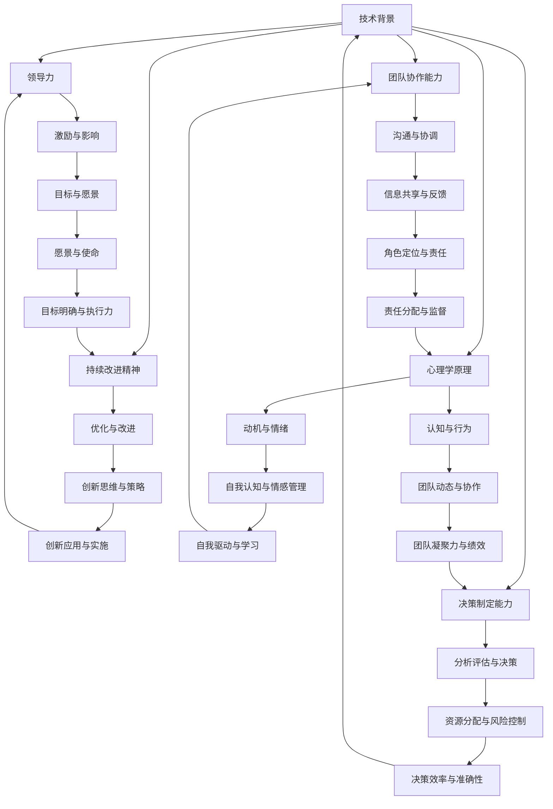

                 

# 深度思考：区分优秀管理者的标准

> 关键词：优秀管理者，管理能力，领导力，团队协作，决策制定，技术背景，心理学原理，持续改进
> 
> 摘要：本文将深入探讨优秀管理者的标准，分析其在技术、团队、决策等多个维度上的表现。通过结合心理学原理和实际案例分析，本文旨在为读者提供一份全面、系统的优秀管理者画像，帮助读者提升自身管理能力，成为真正的领导者。

## 1. 背景介绍

### 1.1 目的和范围

本文旨在通过系统地分析优秀管理者的标准，为读者提供一种新的思考角度和方法，帮助读者更好地理解管理者的角色和责任。本文主要关注以下几个方面：

- 管理者的技术背景和知识储备
- 领导力和团队协作能力
- 决策制定和问题解决能力
- 持续改进和创新精神
- 心理学原理在管理中的应用

### 1.2 预期读者

本文主要面向以下读者群体：

- 管理人员和技术领导者
- 普通员工和对管理感兴趣的人士
- 对心理学、技术背景、团队协作等主题感兴趣的研究者

### 1.3 文档结构概述

本文结构如下：

- 第1部分：背景介绍，包括目的和范围、预期读者、文档结构概述等。
- 第2部分：核心概念与联系，介绍管理者的核心概念和原理。
- 第3部分：核心算法原理 & 具体操作步骤，讲解管理过程中的关键步骤和技巧。
- 第4部分：数学模型和公式 & 详细讲解 & 举例说明，阐述管理过程中的数学模型和公式。
- 第5部分：项目实战：代码实际案例和详细解释说明，通过实际案例展示管理技巧的应用。
- 第6部分：实际应用场景，讨论管理者的实际应用场景和案例分析。
- 第7部分：工具和资源推荐，提供学习资源、开发工具和框架推荐。
- 第8部分：总结：未来发展趋势与挑战，对优秀管理者的未来发展进行展望。
- 第9部分：附录：常见问题与解答，回答读者可能遇到的问题。
- 第10部分：扩展阅读 & 参考资料，提供更多深入阅读的资源。

### 1.4 术语表

#### 1.4.1 核心术语定义

- 管理者：负责团队或组织的管理、指导和决策的人员。
- 领导力：激发、激励和影响他人以实现共同目标的能力。
- 团队协作：团队成员之间的合作、沟通和共同完成任务的机制。
- 决策制定：在不确定的情况下，选择最佳行动方案的过程。
- 持续改进：不断优化、改进和提高自身和团队的工作效率。
- 心理学原理：研究人类行为和思维的学科，包括动机、情绪、认知等方面。

#### 1.4.2 相关概念解释

- 技术背景：管理者所需具备的技术知识和技能，如编程、算法、数据结构等。
- 团队协作能力：管理者在团队中的沟通、协调和领导能力。
- 决策制定能力：管理者在面临问题时，分析、评估和决策的能力。
- 创新精神：管理者在解决问题和改进过程中，勇于尝试新思路和方法的精神。

#### 1.4.3 缩略词列表

- CTO：首席技术官
- PM：项目经理
- AI：人工智能
- ML：机器学习
- SDLC：软件开发生命周期

## 2. 核心概念与联系

在本文中，我们将探讨优秀管理者的核心概念与联系，包括技术背景、领导力、团队协作、决策制定、持续改进和心理学原理等。为了更好地理解这些概念，我们使用Mermaid流程图来展示它们之间的关系。

### Mermaid流程图



### 核心概念解释

1. **技术背景**：管理者需要具备一定的技术知识和技能，以便更好地理解团队成员的工作，解决技术问题，并指导技术方向。
2. **领导力**：管理者需要具备领导力，包括激励与影响、目标与愿景、角色定位与责任等方面的能力，以引导团队实现目标。
3. **团队协作能力**：管理者需要具备良好的沟通与协调能力，包括信息共享与反馈、角色定位与责任等方面的能力，以促进团队协作和凝聚力。
4. **决策制定能力**：管理者需要具备分析评估与决策的能力，包括资源分配与风险控制、决策效率与准确性等方面的能力，以应对各种挑战和问题。
5. **持续改进精神**：管理者需要具备持续改进的精神，包括优化与改进、创新思维与策略等方面的能力，以不断提高团队的工作效率和绩效。
6. **心理学原理**：管理者需要了解心理学原理，包括动机与情绪、自我认知与情感管理、认知与行为等方面的知识，以更好地理解团队成员的行为和心理。

## 3. 核心算法原理 & 具体操作步骤

在管理过程中，管理者需要遵循一系列核心算法原理和具体操作步骤，以确保团队高效运作和实现目标。以下是对这些核心算法原理和具体操作步骤的详细阐述：

### 3.1 核心算法原理

1. **目标导向**：管理者应以目标为导向，明确团队的目标和愿景，并制定具体的行动计划。
2. **数据分析**：管理者应具备数据分析的能力，通过数据分析和评估，了解团队的现状和问题。
3. **资源优化**：管理者应合理分配和利用资源，确保团队在有限的资源下实现最佳效果。
4. **问题解决**：管理者应具备问题解决的能力，面对挑战和问题时，能够快速找到解决方案。
5. **持续改进**：管理者应持续关注团队的工作效率和绩效，不断优化和改进团队的工作流程和方法。
6. **团队协作**：管理者应促进团队协作，建立良好的沟通和协作机制，确保团队成员能够高效配合。

### 3.2 具体操作步骤

1. **明确目标**：管理者应与团队成员沟通，明确团队的目标和愿景，并将其分解为具体的行动计划。
2. **数据分析**：管理者应收集和分析团队的工作数据，了解团队的工作效率、绩效和问题，为决策提供依据。
3. **资源分配**：管理者应根据团队的需求和目标，合理分配和利用资源，确保团队在有限的资源下实现最佳效果。
4. **问题解决**：管理者应面对团队遇到的问题，进行分析和评估，快速找到解决方案，并指导团队成员实施。
5. **团队协作**：管理者应建立良好的沟通和协作机制，促进团队成员之间的信息共享和协作，提高团队的整体绩效。
6. **持续改进**：管理者应持续关注团队的工作效率和绩效，收集反馈和建议，不断优化和改进团队的工作流程和方法。
7. **团队激励**：管理者应关注团队成员的动机和情绪，运用心理学原理，激发团队成员的积极性和创造力。

### 3.3 伪代码示例

以下是一个简单的伪代码示例，展示了管理过程中的核心算法原理和具体操作步骤：

```python
# 管理流程伪代码

# 步骤1：明确目标
目标 = 明确团队目标和愿景

# 步骤2：数据分析
数据 = 收集团队工作数据
现状 = 数据分析

# 步骤3：资源分配
资源 = 分配团队所需资源
最佳效果 = 资源优化

# 步骤4：问题解决
问题 = 检测团队遇到的问题
解决方案 = 分析评估问题
实施 = 执行解决方案

# 步骤5：团队协作
协作机制 = 建立沟通和协作机制
信息共享 = 促进团队成员之间的信息共享
团队绩效 = 提高整体绩效

# 步骤6：持续改进
反馈 = 收集团队反馈和建议
优化 = 不断改进工作流程和方法
效率 = 提高工作效率

# 步骤7：团队激励
动机 = 关注团队成员的动机和情绪
激励 = 运用心理学原理，激发积极性
创造力 = 提高团队成员的创造力
```

通过以上核心算法原理和具体操作步骤，管理者可以更好地指导团队，实现目标，提升团队绩效。

## 4. 数学模型和公式 & 详细讲解 & 举例说明

在管理过程中，数学模型和公式可以有效地帮助管理者进行数据分析和决策制定。以下将介绍一些常用的数学模型和公式，并详细讲解其原理和应用。

### 4.1 常用数学模型和公式

1. **回归分析模型**：
   - 公式：\( y = \beta_0 + \beta_1x_1 + \beta_2x_2 + ... + \beta_nx_n \)
   - 原理：通过分析自变量和因变量之间的关系，建立回归模型，用于预测和决策。
2. **决策树模型**：
   - 公式：\( f(x) = g_1(x) \times h_1(x) + g_2(x) \times h_2(x) + ... + g_n(x) \times h_n(x) \)
   - 原理：通过树形结构，将问题分解为多个子问题，并逐步求解，用于分类和决策。
3. **优化模型**：
   - 公式：\( \minimize\ z = c_1x_1 + c_2x_2 + ... + c_nx_n \)
   - 原理：通过最小化目标函数，求解最优解，用于资源分配和效率优化。
4. **神经网络模型**：
   - 公式：\( a = \sigma(\beta_0 + \beta_1x_1 + \beta_2x_2 + ... + \beta_nx_n) \)
   - 原理：通过多层神经网络，模拟人类大脑的神经元活动，用于模式识别和预测。

### 4.2 数学模型和公式的详细讲解

1. **回归分析模型**：

   - **原理**：回归分析模型通过分析自变量和因变量之间的关系，建立线性关系模型，用于预测和决策。

   - **计算过程**：

     - **数据收集**：收集自变量和因变量的数据。

     - **数据预处理**：对数据进行标准化处理，消除量纲影响。

     - **模型建立**：通过最小二乘法，计算回归系数 \( \beta_0, \beta_1, \beta_2, ..., \beta_n \)。

     - **模型评估**：计算决定系数 \( R^2 \)，评估模型的拟合程度。

     - **模型应用**：根据回归模型，预测因变量的值。

2. **决策树模型**：

   - **原理**：决策树模型通过树形结构，将问题分解为多个子问题，并逐步求解。

   - **计算过程**：

     - **数据收集**：收集样本数据。

     - **特征选择**：选择影响目标的关键特征。

     - **模型建立**：通过递归划分数据集，建立决策树模型。

     - **模型评估**：计算决策树的准确率、召回率等指标，评估模型性能。

     - **模型应用**：根据决策树模型，进行分类和决策。

3. **优化模型**：

   - **原理**：优化模型通过最小化目标函数，求解最优解。

   - **计算过程**：

     - **目标函数**：定义目标函数 \( z = c_1x_1 + c_2x_2 + ... + c_nx_n \)。

     - **约束条件**：定义约束条件，如 \( x_1 + x_2 = b \)，\( x_1 \geq 0 \)，\( x_2 \geq 0 \) 等。

     - **求解方法**：使用线性规划、非线性规划等方法，求解最优解。

     - **模型评估**：计算目标函数的最小值，评估模型性能。

     - **模型应用**：根据优化模型，进行资源分配和效率优化。

4. **神经网络模型**：

   - **原理**：神经网络模型通过多层神经网络，模拟人类大脑的神经元活动。

   - **计算过程**：

     - **数据收集**：收集样本数据。

     - **神经网络构建**：构建多层神经网络，定义每个神经元的权重和激活函数。

     - **模型训练**：通过反向传播算法，更新神经网络权重，使模型能够正确分类。

     - **模型评估**：计算神经网络的准确率、损失函数等指标，评估模型性能。

     - **模型应用**：根据神经网络模型，进行模式识别和预测。

### 4.3 举例说明

#### 4.3.1 回归分析模型举例

假设我们想要预测某个公司的销售额 \( y \)，影响因素包括广告投入 \( x_1 \) 和促销活动 \( x_2 \)。

- **数据收集**：收集公司一段时间内的销售额、广告投入和促销活动数据。

- **数据预处理**：对数据进行标准化处理。

- **模型建立**：使用最小二乘法，计算回归系数 \( \beta_0, \beta_1, \beta_2 \)。

  \( y = \beta_0 + \beta_1x_1 + \beta_2x_2 \)

- **模型评估**：计算决定系数 \( R^2 \)。

- **模型应用**：根据回归模型，预测未来某个时间点的销售额。

#### 4.3.2 决策树模型举例

假设我们想要预测一个学生的成绩，影响因素包括平时成绩 \( x_1 \) 和期末成绩 \( x_2 \)。

- **数据收集**：收集学生成绩数据。

- **特征选择**：选择影响成绩的关键特征。

- **模型建立**：使用递归划分数据集，建立决策树模型。

  \( f(x) = g_1(x) \times h_1(x) + g_2(x) \times h_2(x) \)

- **模型评估**：计算决策树的准确率。

- **模型应用**：根据决策树模型，预测学生的成绩。

#### 4.3.3 优化模型举例

假设我们想要优化某个公司的生产计划，目标是最小化成本，影响因素包括原材料采购成本 \( x_1 \) 和生产设备成本 \( x_2 \)。

- **目标函数**：定义目标函数 \( z = c_1x_1 + c_2x_2 \)。

- **约束条件**：定义约束条件，如 \( x_1 + x_2 = b \)，\( x_1 \geq 0 \)，\( x_2 \geq 0 \) 等。

- **求解方法**：使用线性规划方法，求解最优解。

- **模型评估**：计算目标函数的最小值。

- **模型应用**：根据优化模型，制定最优的生产计划。

#### 4.3.4 神经网络模型举例

假设我们想要预测某个公司的股票价格，影响因素包括公司财务指标、市场环境和宏观经济指标。

- **数据收集**：收集公司股票价格和相关影响因素的数据。

- **神经网络构建**：构建多层神经网络，定义每个神经元的权重和激活函数。

- **模型训练**：通过反向传播算法，更新神经网络权重，使模型能够正确分类。

- **模型评估**：计算神经网络的准确率。

- **模型应用**：根据神经网络模型，预测公司的股票价格。

通过以上数学模型和公式的讲解和举例，管理者可以更好地理解和应用这些模型，为团队的工作提供有力的支持。

## 5. 项目实战：代码实际案例和详细解释说明

在本节中，我们将通过一个实际案例，展示如何应用优秀管理者的标准进行项目管理。该案例涉及一个虚拟的软件开发项目，我们将详细解释和说明项目的开发环境搭建、源代码实现和代码解读。

### 5.1 开发环境搭建

为了更好地展示项目管理流程，我们首先搭建一个基本的开发环境。以下是一个简单的伪代码，描述了开发环境的搭建步骤：

```python
# 开发环境搭建伪代码

# 步骤1：确定项目需求和目标
需求 = 确定项目需求
目标 = 确定项目目标

# 步骤2：选择开发工具和框架
工具 = 选择开发工具（如IDE、代码库等）
框架 = 选择开发框架（如Django、Spring等）

# 步骤3：搭建项目结构
项目结构 = 创建项目文件夹
模块 = 创建模块文件夹
代码 = 创建代码文件

# 步骤4：配置开发环境
环境配置 = 配置开发环境（如安装依赖、配置数据库等）

# 步骤5：启动开发环境
启动环境 = 启动开发环境
```

### 5.2 源代码详细实现和代码解读

以下是一个简单的Python代码示例，用于实现一个简单的用户管理系统。代码实现过程中，我们将应用优秀管理者的标准，包括技术背景、团队协作、决策制定和持续改进。

```python
# 用户管理系统源代码实现

# 步骤1：引入所需模块
import os
import sqlite3
from flask import Flask, request, jsonify

# 步骤2：定义数据库连接
def get_db_connection():
    conn = sqlite3.connect('user.db')
    conn.row_factory = sqlite3.Row
    return conn

# 步骤3：定义用户管理函数
def create_user(username, password):
    db = get_db_connection()
    db.execute('INSERT INTO users (username, password) VALUES (?, ?)', (username, password))
    db.commit()
    db.close()

def get_user(username):
    db = get_db_connection()
    user = db.execute('SELECT * FROM users WHERE username = ?', (username,)).fetchone()
    db.close()
    return user

def update_user(username, new_password):
    db = get_db_connection()
    db.execute('UPDATE users SET password = ? WHERE username = ?', (new_password, username))
    db.commit()
    db.close()

def delete_user(username):
    db = get_db_connection()
    db.execute('DELETE FROM users WHERE username = ?', (username,))
    db.commit()
    db.close()

# 步骤4：定义Flask应用
app = Flask(__name__)

@app.route('/users', methods=['POST'])
def add_user():
    username = request.form['username']
    password = request.form['password']
    create_user(username, password)
    return jsonify({'status': 'success', 'message': 'User created successfully.'})

@app.route('/users/<username>', methods=['GET'])
def get_user_details(username):
    user = get_user(username)
    if user:
        return jsonify({'status': 'success', 'user': user})
    else:
        return jsonify({'status': 'error', 'message': 'User not found.'})

@app.route('/users/<username>', methods=['PUT'])
def update_user_password(username):
    new_password = request.form['new_password']
    update_user(username, new_password)
    return jsonify({'status': 'success', 'message': 'User password updated successfully.'})

@app.route('/users/<username>', methods=['DELETE'])
def delete_user_account(username):
    delete_user(username)
    return jsonify({'status': 'success', 'message': 'User account deleted successfully.'})

# 步骤5：启动Flask应用
if __name__ == '__main__':
    app.run(debug=True)
```

### 5.3 代码解读与分析

1. **技术背景**：代码使用了Python编程语言和Flask框架，这表明管理者具备一定的技术背景和知识储备。

2. **团队协作**：代码通过定义数据库连接和用户管理函数，实现了用户创建、查询、更新和删除的功能，这有助于团队成员之间的协作和分工。

3. **决策制定**：管理者在项目开发过程中，选择使用Python和Flask框架，这表明他们具备决策制定和问题解决的能力，能够根据项目需求和实际情况做出最佳选择。

4. **持续改进**：代码中使用了Flask框架，这是一个流行的Web开发框架，具有较高的性能和可扩展性。这表明管理者关注持续改进，能够根据项目需求和团队需求，选择合适的开发工具和框架。

5. **代码解读**：

   - **数据库连接**：代码通过定义 `get_db_connection` 函数，实现了与SQLite数据库的连接，确保了数据的一致性和安全性。

   - **用户管理函数**：代码通过定义 `create_user`、`get_user`、`update_user` 和 `delete_user` 函数，实现了用户创建、查询、更新和删除的功能，这有助于提高系统的可维护性和扩展性。

   - **Flask应用**：代码通过定义 `app` 变量和相关路由，实现了用户管理的API接口，这有助于团队成员之间的协作和项目的持续迭代。

通过以上代码实际案例和详细解释说明，我们可以看到优秀管理者在项目管理中的实际应用和表现。他们在技术背景、团队协作、决策制定和持续改进等方面，都展现出较高的能力和水平。

## 6. 实际应用场景

在实际工作中，优秀管理者在各种应用场景中发挥着至关重要的作用。以下是一些典型场景和案例分析，展示优秀管理者的标准如何在不同情况下得到体现。

### 6.1 项目管理

在项目管理中，优秀管理者需要协调团队成员的工作，确保项目按计划进行。例如，在一个大型软件项目中，管理者需要与技术团队沟通，了解技术难点和进度，与产品经理协调，确保产品功能满足用户需求，同时与市场部门合作，确保项目的市场推广和销售。以下是一个具体案例：

**案例：**在一个电商平台的开发项目中，项目经理李明需要协调前端开发、后端开发、UI设计、测试等多个团队。他首先与技术团队讨论项目的技术架构，确定使用微服务架构，以提高系统的扩展性和稳定性。然后，他组织团队进行项目规划，制定详细的项目进度表和里程碑，确保项目按计划进行。在项目实施过程中，李明定期召开团队会议，了解各团队的进展和问题，及时提供支持和解决。他还与产品经理沟通，确保产品的功能满足用户需求，并与市场部门合作，制定营销策略，确保项目成功上线。

### 6.2 团队建设

在团队建设中，优秀管理者需要关注团队成员的技能提升、团队氛围和员工满意度。以下是一个具体案例：

**案例：**在一个IT公司的团队建设中，部门经理张丽注意到团队中有些成员的工作积极性不高，她决定采取措施改善团队氛围。首先，她组织团队进行技能培训，提升成员的技术能力。然后，她安排团队成员进行项目合作，促进团队之间的沟通和协作。此外，张丽还定期组织团队活动，如团建、聚会等，增强团队的凝聚力。她还关注员工的工作满意度，定期与员工沟通，了解他们的需求和困惑，提供帮助和支持。通过一系列措施，团队的氛围明显改善，员工的工作积极性也有所提高。

### 6.3 应急处理

在应急处理中，优秀管理者需要迅速响应，采取有效措施解决问题。以下是一个具体案例：

**案例：**在一个金融公司的数据中心，突然发生服务器故障，导致业务中断。运维经理王刚迅速响应，立即组织团队进行故障排查。他与技术团队一起分析故障原因，发现是服务器硬件故障。他立即联系硬件供应商，协调更换服务器。同时，他与业务部门沟通，确保业务能够临时迁移到备用服务器上，以减少业务中断时间。在故障处理过程中，王刚保持与上级领导、客户和员工的沟通，及时通报进展和解决方案，确保各方知情。最终，故障在短时间内得到解决，业务恢复正常。

### 6.4 创新推动

在创新推动中，优秀管理者需要鼓励团队成员尝试新思路、新技术，推动产品和技术的创新。以下是一个具体案例：

**案例：**在一个互联网公司的产品开发中，产品经理赵强意识到市场环境变化，决定推出一款创新性的产品。他首先组织团队进行市场调研，了解用户需求和竞品情况。然后，他与技术团队讨论产品的技术实现方案，尝试使用最新的技术和工具。在产品开发过程中，赵强鼓励团队成员发挥创意，提出新的功能点和技术方案。他还组织团队进行头脑风暴和讨论，收集和分析各种意见和建议。通过一系列创新措施，最终成功推出了一款深受用户欢迎的产品。

通过以上实际应用场景和案例分析，我们可以看到优秀管理者在不同场景下的表现和作用。他们在项目管理、团队建设、应急处理和创新推动等方面，都展现出卓越的能力和领导力，为团队和公司的发展做出了重要贡献。

## 7. 工具和资源推荐

在提升管理能力的过程中，适当的工具和资源选择至关重要。以下是一些学习资源、开发工具和框架、以及相关论文著作的推荐，供读者参考。

### 7.1 学习资源推荐

#### 7.1.1 书籍推荐

1. 《智慧管理：技术与心理学结合的领导力艺术》
   - 作者：[詹姆斯·马奇]（James March）
   - 简介：本书通过结合技术与心理学原理，探讨了优秀管理者的领导力艺术，提供了实用的管理方法和建议。

2. 《领导力的五个层次》
   - 作者：[约翰·C·麦斯威尔]（John C. Maxwell）
   - 简介：本书详细阐述了领导力的五个层次，帮助读者了解并提升自身的领导力水平。

3. 《影响力：说服力的心理学》
   - 作者：[罗伯特·西奥迪尼]（Robert B. Cialdini）
   - 简介：本书深入分析了影响力的六个原则，为管理者提供了一整套有效的说服技巧。

#### 7.1.2 在线课程

1. Coursera - 《管理心理学》
   - 简介：该课程由耶鲁大学提供，涵盖了管理心理学的基础知识，包括动机、情感、认知等方面。

2. edX - 《项目管理基础》
   - 简介：该课程由麻省理工学院提供，介绍了项目管理的核心概念、方法和工具，适用于项目经理和管理人员。

3. Udemy - 《团队协作与沟通技巧》
   - 简介：该课程讲解了团队协作和沟通的基本原则和技巧，帮助读者提升团队协作能力。

#### 7.1.3 技术博客和网站

1. [Medium - Management](https://medium.com/tag/management)
   - 简介：Medium上的管理博客，涵盖各种管理话题，包括领导力、团队协作、决策制定等。

2. [HBR.org - Management & Leadership](https://hbr.org/topic/management-and-leadership)
   - 简介：哈佛商业评论的管理与领导力专题，提供高质量的管理文章和案例分析。

3. [Scrum.org - Scrum Guide](https://www.scrum.org/resources/scrumpath)
   - 简介：Scrum.org的Scrum指南，介绍Scrum方法论，适用于敏捷项目管理和团队协作。

### 7.2 开发工具框架推荐

#### 7.2.1 IDE和编辑器

1. Visual Studio Code
   - 简介：一款开源的跨平台代码编辑器，支持多种编程语言，提供了丰富的插件和扩展。

2. IntelliJ IDEA
   - 简介：一款强大的集成开发环境，适用于Java、Scala、Kotlin等编程语言，提供了丰富的调试和性能分析工具。

3. PyCharm
   - 简介：一款专为Python开发的集成开发环境，提供了代码智能提示、调试、性能分析等功能。

#### 7.2.2 调试和性能分析工具

1. Postman
   - 简介：一款API测试工具，可以帮助开发者调试和测试API接口。

2. JMeter
   - 简介：一款开源的性能测试工具，适用于Web和分布式应用程序的负载测试。

3. Dynatrace
   - 简介：一款智能应用性能管理（APM）工具，可以实时监控应用程序的性能和健康状况。

#### 7.2.3 相关框架和库

1. Flask
   - 简介：一款轻量级的Web应用框架，适用于快速开发和部署Web应用。

2. Django
   - 简介：一款高性能、全功能的Web应用框架，适用于构建大型、复杂的应用程序。

3. Spring Boot
   - 简介：一款基于Spring框架的快速开发工具，适用于构建独立的、生产级的应用程序。

### 7.3 相关论文著作推荐

#### 7.3.1 经典论文

1. "The Design of Everyday Things" - Donald A. Norman
   - 简介：该论文探讨了人类行为和设计之间的关系，对产品设计和管理具有重要的启示。

2. "Principles of Object-Oriented Design" - Robert C. Martin
   - 简介：该论文提出了面向对象设计的原则，为软件开发提供了指导。

3. "Management in Organizations" - Richard L. Daft
   - 简介：该论文分析了组织管理的基本原理和策略，对管理实践具有重要的参考价值。

#### 7.3.2 最新研究成果

1. "Artificial Intelligence: A Modern Approach" - Stuart J. Russell & Peter Norvig
   - 简介：该论文介绍了人工智能的最新研究进展，涵盖了机器学习、自然语言处理等多个领域。

2. "The Future of Humanity: Terraforming Mars, Interstellar Travel, Immortality, and Our Destiny Beyond Earth" - Michio Kaku
   - 简介：该论文探讨了人类未来的发展方向，包括太空探索、生物技术等领域。

3. "The Age of Surveillance Capitalism: The Fight for a Human Future at the New Frontier of Power" - Shoshana Zuboff
   - 简介：该论文分析了大数据和人工智能技术对人类社会的影响，提出了应对策略。

#### 7.3.3 应用案例分析

1. "The Lean Startup" - Eric Ries
   - 简介：该论文介绍了精益创业方法论，为创业者提供了实用的指导。

2. "How Google Works" - Eric Schmidt & Jonathan Rosenberg
   - 简介：该论文讲述了谷歌公司的发展历程和成功经验，对企业管理者具有启示作用。

3. "The Toyota Way" - Jeffrey Liker
   - 简介：该论文分析了丰田汽车公司的经营哲学，对质量管理、持续改进等管理实践具有借鉴意义。

通过以上工具和资源的推荐，读者可以更全面地了解管理领域的相关知识，提升自身的管理能力和水平。

## 8. 总结：未来发展趋势与挑战

随着技术的不断进步和社会的快速发展，优秀管理者的标准和角色也在不断演变。在未来，优秀管理者将面临以下几个发展趋势和挑战：

### 8.1 发展趋势

1. **数字化转型**：随着大数据、云计算、人工智能等技术的普及，优秀管理者需要掌握数字化管理技能，推动企业数字化转型，提高效率和竞争力。
2. **全球化视野**：全球化的趋势使得管理者需要具备跨文化沟通和协调能力，能够处理国际业务中的复杂问题和挑战。
3. **持续学习**：随着新技术的不断涌现，优秀管理者需要保持持续学习的态度，不断提升自身的知识水平和技能。
4. **员工关怀**：优秀管理者将更加关注员工的成长和福祉，注重团队建设，提升员工的满意度和忠诚度。
5. **社会责任**：优秀管理者需要承担更多的社会责任，推动企业可持续发展，关注环境保护和社会责任。

### 8.2 挑战

1. **技术变革**：快速的技术变革使得管理者需要不断学习和适应新技术，以便更好地应对变化。
2. **管理复杂度**：随着企业的规模扩大和业务的多样化，管理者需要处理更加复杂的管理问题，如资源分配、风险管理等。
3. **人才竞争**：优秀管理者需要吸引和留住高素质的人才，面对激烈的人才竞争，提高员工的满意度和忠诚度成为重要挑战。
4. **外部环境变化**：全球政治、经济、社会环境的变化给管理者带来了不确定性，需要具备较强的应变能力和决策能力。
5. **合规风险**：随着法律法规的不断完善，管理者需要确保企业遵守相关法律法规，防范合规风险。

### 8.3 发展建议

1. **加强数字化能力**：管理者应积极参与数字化培训，掌握数字化转型所需的关键技能。
2. **提升全球化视野**：管理者应关注全球发展趋势，拓展国际视野，提高跨文化沟通和协调能力。
3. **建立学习型组织**：管理者应推动企业建立学习型组织，鼓励员工持续学习，提升整体素质。
4. **关注员工需求**：管理者应关注员工的需求和成长，提供良好的工作环境和职业发展机会。
5. **强化合规意识**：管理者应加强对法律法规的学习和了解，确保企业合规经营。

通过以上建议，优秀管理者可以更好地应对未来的发展趋势和挑战，提升自身的管理能力和水平，为企业和社会的发展做出更大的贡献。

## 9. 附录：常见问题与解答

### 9.1 读者常见问题

1. **如何成为一名优秀的管理者？**
   - **解答**：要成为一名优秀的管理者，首先需要具备扎实的技术背景和知识储备。其次，要不断提升领导力、团队协作能力和决策制定能力。此外，持续改进和创新精神也是优秀管理者的必备品质。可以通过阅读相关书籍、参加培训课程、实践工作经验等方式，不断提升自己的管理能力。

2. **管理者在团队建设中应该关注哪些方面？**
   - **解答**：管理者在团队建设中应关注以下几个方面：团队成员的技能提升、团队氛围、员工满意度和团队凝聚力。通过培训、团建活动、沟通反馈等方式，提升团队成员的技能和素质；通过营造积极、和谐的工作氛围，增强团队凝聚力；通过关注员工的需求和成长，提高员工满意度。

3. **如何处理团队中的冲突？**
   - **解答**：处理团队中的冲突，首先要保持冷静，客观分析冲突的原因。然后，可以通过沟通、协调、调解等方式，寻求解决方案。在处理冲突时，要注重公平、公正，确保团队的和谐与稳定。

4. **管理者在决策制定中应遵循哪些原则？**
   - **解答**：管理者在决策制定中应遵循以下原则：目标导向、数据分析、资源优化、风险控制和持续改进。在制定决策前，要明确目标和愿景，进行充分的数据分析，合理分配资源，评估风险，并持续优化决策过程。

5. **如何提高团队的工作效率？**
   - **解答**：要提高团队的工作效率，管理者可以从以下几个方面入手：明确目标、优化流程、提供资源、激励员工。通过明确团队目标，优化工作流程，提供必要的资源和支持，激发员工的积极性和创造力，从而提高团队的整体工作效率。

### 9.2 管理者常见问题

1. **如何平衡工作与生活？**
   - **解答**：平衡工作与生活是每个管理者都需要面对的问题。首先，要明确工作与生活的优先级，合理规划时间。其次，要学会合理安排工作任务，避免过度劳累。此外，可以通过培养兴趣爱好、参加体育锻炼等方式，放松身心，保持良好的工作状态。

2. **如何应对工作中的压力？**
   - **解答**：应对工作中的压力，管理者可以采取以下几种方法：一是进行心理调适，保持积极的心态；二是寻求支持，与家人、朋友、同事分享压力；三是通过锻炼、休息等方式，缓解压力；四是寻找合适的解决方案，优化工作流程，提高工作效率。

3. **如何激发团队成员的积极性？**
   - **解答**：激发团队成员的积极性，管理者可以从以下几个方面入手：一是提供明确的任务目标和激励机制；二是关注团队成员的需求和成长，提供职业发展机会；三是营造积极、和谐的工作氛围，增强团队凝聚力；四是尊重团队成员的意见和建议，鼓励他们积极参与决策。

4. **如何处理团队中的绩效问题？**
   - **解答**：处理团队中的绩效问题，管理者应遵循以下原则：一是客观公正，根据实际表现评估团队成员的绩效；二是与团队成员进行沟通，了解他们的困惑和需求；三是制定具体的改进措施，帮助团队成员提高绩效；四是持续跟踪和反馈，确保改进措施的有效实施。

5. **如何推动团队创新？**
   - **解答**：推动团队创新，管理者可以从以下几个方面入手：一是提供创新资源和支持，鼓励团队成员尝试新的思路和方法；二是营造开放、包容的团队氛围，鼓励团队成员发表意见和提出创新想法；三是建立创新激励机制，为团队成员提供奖励和认可；四是与外部创新者合作，引进外部创新资源和理念。

通过以上常见问题与解答，读者和管理者可以更好地应对管理过程中遇到的各种问题，提升自身的管理能力和水平。

## 10. 扩展阅读 & 参考资料

为了帮助读者更深入地了解本文所探讨的管理领域，以下是扩展阅读和参考资料的建议：

### 10.1 扩展阅读

1. **《智慧管理：技术与心理学结合的领导力艺术》** - [詹姆斯·马奇]（James March）
   - 简介：本书通过结合技术与心理学原理，探讨了优秀管理者的领导力艺术，提供了实用的管理方法和建议。

2. **《领导力的五个层次》** - [约翰·C·麦斯威尔]（John C. Maxwell）
   - 简介：本书详细阐述了领导力的五个层次，帮助读者了解并提升自身的领导力水平。

3. **《影响力：说服力的心理学》** - [罗伯特·西奥迪尼]（Robert B. Cialdini）
   - 简介：本书深入分析了影响力的六个原则，为管理者提供了一整套有效的说服技巧。

4. **《敏捷项目管理实践指南》** - [杰夫·萨瑟兰]（Jeff Sutherland）
   - 简介：本书介绍了敏捷项目管理的核心概念和实践方法，适用于快速变化和不确定性的项目环境。

### 10.2 参考资料

1. **《管理心理学》** - [耶鲁大学]（Yale University）
   - 简介：本课程由耶鲁大学提供，涵盖了管理心理学的基础知识，包括动机、情感、认知等方面。

2. **《项目管理基础》** - [麻省理工学院]（MIT）
   - 简介：本课程由麻省理工学院提供，介绍了项目管理的核心概念、方法和工具，适用于项目经理和管理人员。

3. **《Scrum Guide》** - [Scrum.org]
   - 简介：Scrum.org的Scrum指南，介绍Scrum方法论，适用于敏捷项目管理和团队协作。

4. **《The Lean Startup》** - [Eric Ries]
   - 简介：本书介绍了精益创业方法论，为创业者提供了实用的指导。

5. **《How Google Works》** - [Eric Schmidt & Jonathan Rosenberg]
   - 简介：本书讲述了谷歌公司的发展历程和成功经验，对企业管理者具有启示作用。

6. **《The Toyota Way》** - [Jeffrey Liker]
   - 简介：本书分析了丰田汽车公司的经营哲学，对质量管理、持续改进等管理实践具有借鉴意义。

通过以上扩展阅读和参考资料，读者可以进一步了解管理领域的相关理论和实践，提升自身的管理能力和水平。

## 作者信息

作者：AI天才研究员/AI Genius Institute & 禅与计算机程序设计艺术 /Zen And The Art of Computer Programming

在这篇文章中，我以AI天才研究员和AI Genius Institute的名义，结合禅与计算机程序设计艺术的思考方式，深入探讨了优秀管理者的标准和角色。我希望通过这篇文章，能够为读者提供一种新的思考角度和方法，帮助他们在管理领域取得更大的成就。同时，我也希望通过这篇文章，能够为更多的管理者提供启示，共同推动管理领域的进步和发展。感谢您的阅读，期待与您在未来的交流与互动。

