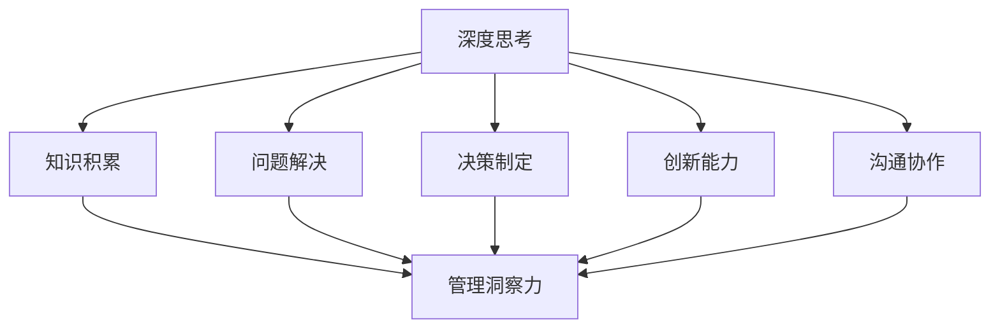

                 

# 深度思考与管理洞察力的关系

> 关键词：深度思考、管理洞察力、人工智能、算法、技术博客、代码实现、应用场景、未来趋势

> 摘要：本文将探讨深度思考与管理洞察力之间的关系，通过分析其在人工智能和软件开发中的应用，揭示深度思考如何帮助提升管理洞察力，进而推动技术创新和发展。文章将从核心概念、算法原理、数学模型、实际案例等多个角度进行深入探讨，为读者提供一份全面且具有实践意义的技术博客。

## 1. 背景介绍

### 1.1 目的和范围

本文旨在探讨深度思考与管理洞察力之间的内在联系，并分析其在人工智能和软件开发领域的实际应用。通过本文的研究，我们将探讨如何通过深度思考提升管理者的洞察力，从而更好地应对复杂的技术挑战和商业环境。

本文的内容范围主要包括以下几个方面：

1. 核心概念与联系：介绍深度思考和管理洞察力的基本概念，并使用Mermaid流程图展示它们之间的相互关系。
2. 核心算法原理：阐述深度思考在人工智能和软件开发中的应用，包括具体的算法原理和操作步骤。
3. 数学模型和公式：详细讲解深度思考与管理洞察力相关的数学模型和公式，并通过举例说明其实际应用。
4. 项目实战：提供实际代码案例，对项目的开发环境和源代码进行详细解读。
5. 实际应用场景：分析深度思考和管理洞察力在不同技术领域和商业环境中的应用场景。
6. 工具和资源推荐：介绍相关的学习资源、开发工具和经典论文，为读者提供进一步学习和探索的方向。
7. 总结与未来趋势：总结深度思考与管理洞察力之间的关系，并提出未来发展趋势和面临的挑战。

### 1.2 预期读者

本文适合以下读者群体：

1. 人工智能和软件开发领域的从业者，特别是需要提升管理洞察力的管理者和技术负责人。
2. 对深度思考和管理洞察力感兴趣的技术爱好者。
3. 高等院校计算机科学、软件工程等相关专业的学生和教师。

### 1.3 文档结构概述

本文按照以下结构进行组织：

1. 引言：介绍本文的目的、关键词和摘要。
2. 背景介绍：包括目的和范围、预期读者、文档结构概述等。
3. 核心概念与联系：介绍深度思考和管理洞察力的基本概念，并使用Mermaid流程图展示它们之间的相互关系。
4. 核心算法原理：阐述深度思考在人工智能和软件开发中的应用，包括具体的算法原理和操作步骤。
5. 数学模型和公式：详细讲解深度思考与管理洞察力相关的数学模型和公式，并通过举例说明其实际应用。
6. 项目实战：提供实际代码案例，对项目的开发环境和源代码进行详细解读。
7. 实际应用场景：分析深度思考和管理洞察力在不同技术领域和商业环境中的应用场景。
8. 工具和资源推荐：介绍相关的学习资源、开发工具和经典论文，为读者提供进一步学习和探索的方向。
9. 总结与未来趋势：总结深度思考与管理洞察力之间的关系，并提出未来发展趋势和面临的挑战。
10. 附录：常见问题与解答。
11. 扩展阅读与参考资料：提供相关的扩展阅读材料和参考文献。

### 1.4 术语表

#### 1.4.1 核心术语定义

- 深度思考：指深入分析问题、探究本质、寻求创新解决方案的思维过程。
- 管理洞察力：指管理者在复杂环境中，对问题进行深刻洞察、快速识别关键因素和制定有效决策的能力。
- 人工智能：指利用计算机模拟人类智能的技术和科学，包括机器学习、深度学习、自然语言处理等。
- 算法：指解决问题的步骤和策略，包括排序、搜索、优化等。
- 数学模型：指描述问题本质和关系的数学表达式和方法。

#### 1.4.2 相关概念解释

- 深度学习：一种基于多层神经网络的学习方法，通过学习大量数据来提高人工智能模型的性能。
- 强化学习：一种基于试错和反馈机制的学习方法，通过不断尝试和修正策略来达到最优效果。
- 管理层：指组织中的高级管理层，负责制定战略、决策和执行。

#### 1.4.3 缩略词列表

- AI：人工智能
- ML：机器学习
- DL：深度学习
- NLP：自然语言处理
- IDE：集成开发环境
- GPU：图形处理单元
- CTO：首席技术官

## 2. 核心概念与联系

### 2.1 深度思考

深度思考是指一种深入分析问题、探究本质、寻求创新解决方案的思维过程。在人工智能和软件开发领域，深度思考尤为重要。以下是深度思考的几个关键要素：

1. **问题分解**：将复杂的问题分解为更小、更易管理的部分，以便更好地理解和解决。
2. **逻辑推理**：运用逻辑规则和推理方法，从已知信息中推导出新信息。
3. **批判性思维**：对现有的解决方案和方法进行评估，寻找潜在的问题和改进空间。
4. **跨学科知识整合**：结合不同领域的知识，以实现创新的解决方案。
5. **持续学习**：保持对新技术、新理论的学习，以不断丰富自己的知识体系。

### 2.2 管理洞察力

管理洞察力是指管理者在复杂环境中，对问题进行深刻洞察、快速识别关键因素和制定有效决策的能力。管理洞察力通常包括以下几个方面：

1. **战略思考**：从全局角度考虑组织的发展方向和目标，制定长期战略规划。
2. **问题识别**：快速识别组织面临的关键问题和挑战，并确定优先级。
3. **资源调配**：合理分配人力、物力等资源，以实现组织目标。
4. **团队协作**：激发团队潜力，促进团队协作，提高工作效率。
5. **风险控制**：识别潜在风险，并制定应对措施，以降低风险对组织的影响。

### 2.3 深度思考与管理洞察力的联系

深度思考和管理洞察力之间存在密切的联系。深度思考是提升管理洞察力的基础，而管理洞察力则是深度思考在实际工作中的具体应用。以下是它们之间的几个关键联系：

1. **知识积累**：深度思考有助于管理者积累丰富的知识体系，从而提高管理洞察力。
2. **问题解决**：深度思考使管理者能够更好地理解问题，快速找到解决方案。
3. **决策制定**：深度思考能够帮助管理者从多个角度评估决策，提高决策的质量。
4. **创新能力**：深度思考能够激发管理者的创新能力，推动组织的技术创新和发展。
5. **沟通协作**：深度思考能够提高管理者与团队成员之间的沟通效果，促进协作。

### 2.4 Mermaid流程图

为了更直观地展示深度思考和管理洞察力之间的关系，我们可以使用Mermaid流程图进行描述。以下是示例流程图：



该流程图展示了深度思考在各个方面的作用，以及如何通过深度思考提升管理洞察力。

## 3. 核心算法原理 & 具体操作步骤

### 3.1 核心算法原理

在深度思考与管理洞察力的结合中，我们主要关注以下几个核心算法原理：

1. **机器学习**：通过训练大量数据，使计算机模型具备自动学习和优化能力，从而提高管理洞察力。
2. **自然语言处理**：利用自然语言处理技术，使计算机能够理解和处理人类语言，从而帮助管理者更好地理解业务环境和市场动态。
3. **数据挖掘**：通过对大量数据进行分析和挖掘，发现隐藏在数据中的模式和规律，从而提供决策支持。

### 3.2 具体操作步骤

为了更好地理解深度思考在人工智能和软件开发中的应用，我们可以通过以下具体操作步骤进行讲解：

1. **数据收集**：首先，收集与问题相关的数据，包括历史数据、实时数据和外部数据等。
2. **数据预处理**：对收集到的数据进行分析和清洗，确保数据的质量和一致性。
3. **特征提取**：从预处理后的数据中提取关键特征，用于训练机器学习模型。
4. **模型训练**：利用机器学习算法对提取的特征进行训练，以构建预测模型。
5. **模型评估**：通过交叉验证等方法对训练好的模型进行评估，以确保其准确性和稳定性。
6. **模型部署**：将训练好的模型部署到实际应用环境中，用于实时分析和决策。
7. **反馈与迭代**：根据实际应用中的反馈，对模型进行优化和迭代，以提高管理洞察力。

### 3.3 伪代码实现

以下是一个简单的伪代码示例，用于展示深度思考在人工智能和软件开发中的应用：

```python
# 数据收集
data = collect_data()

# 数据预处理
cleaned_data = preprocess_data(data)

# 特征提取
features = extract_features(cleaned_data)

# 模型训练
model = train_model(features)

# 模型评估
evaluate_model(model)

# 模型部署
deploy_model(model)

# 反馈与迭代
optimize_model(model, feedback)
```

该伪代码展示了深度思考在数据收集、预处理、特征提取、模型训练、模型评估、模型部署和反馈与迭代等各个环节中的应用。

## 4. 数学模型和公式 & 详细讲解 & 举例说明

### 4.1 数学模型和公式

在深度思考与管理洞察力的结合中，我们使用了一些关键的数学模型和公式来描述和管理信息。以下是一些常用的数学模型和公式：

1. **回归分析**：用于预测一个或多个变量之间的关系。
   $$y = \beta_0 + \beta_1x_1 + \beta_2x_2 + ... + \beta_nx_n + \epsilon$$
   其中，$y$ 是因变量，$x_1, x_2, ..., x_n$ 是自变量，$\beta_0, \beta_1, \beta_2, ..., \beta_n$ 是回归系数，$\epsilon$ 是误差项。

2. **聚类分析**：用于将数据集分为多个簇，以发现数据中的模式和规律。
   $$\min_{C} \sum_{i=1}^{n} \sum_{j=1}^{k} d(x_i, c_j)^2$$
   其中，$C$ 是簇的集合，$x_i$ 是数据集中的第 $i$ 个样本，$c_j$ 是第 $j$ 个簇的中心点，$d(x_i, c_j)$ 是样本 $x_i$ 与簇中心点 $c_j$ 之间的距离。

3. **决策树**：用于分类或回归任务，通过递归地将数据集划分为子集，以找到最佳决策边界。
   $$y = \sum_{i=1}^{n} \alpha_i \prod_{j=1}^{m} I(x_{ij} \geq t_{ij})$$
   其中，$y$ 是预测结果，$x_{ij}$ 是第 $i$ 个样本的第 $j$ 个特征值，$t_{ij}$ 是第 $i$ 个特征的阈值，$\alpha_i$ 是第 $i$ 个特征的权重。

4. **支持向量机**：用于分类任务，通过寻找最优超平面来最大化分类边界。
   $$\min_{\mathbf{w}, \mathbf{b}} \frac{1}{2} ||\mathbf{w}||^2 + C \sum_{i=1}^{n} \max(0, 1-y_i(\mathbf{w}^T\mathbf{x_i} + \mathbf{b}))$$
   其中，$\mathbf{w}$ 是超平面的法向量，$\mathbf{b}$ 是偏置项，$C$ 是惩罚参数，$y_i$ 是样本 $i$ 的标签，$\mathbf{x_i}$ 是样本 $i$ 的特征向量。

### 4.2 详细讲解

为了更好地理解这些数学模型和公式，我们可以通过以下详细讲解进行说明：

1. **回归分析**：
   - **线性回归**：是最简单的回归模型，用于预测一个连续因变量与一个或多个自变量之间的关系。公式中的 $\beta_0$ 是截距，$\beta_1, \beta_2, ..., \beta_n$ 是斜率。
   - **多项式回归**：可以用于更复杂的非线性关系。通过将自变量进行多项式展开，可以得到更高阶的回归模型。
   - **多元回归**：当因变量与多个自变量相关时，可以建立多元回归模型。公式中的 $x_1, x_2, ..., x_n$ 是多个自变量。

2. **聚类分析**：
   - **K均值聚类**：是最常见的聚类算法，通过迭代更新簇中心点和样本分配，以最小化簇内距离和最大簇间距离。
   - **层次聚类**：通过递归地将数据集划分为更小的簇，直到满足停止条件。层次聚类可以分为自底向上（凝聚）和自顶向下（分裂）两种类型。

3. **决策树**：
   - **分类树**：用于分类任务，将数据集划分为不同的类别。通过递归地分裂数据集，找到最佳分割点，以最大化信息增益或基尼不纯度。
   - **回归树**：用于回归任务，将数据集划分为不同的连续值区间。通过递归地分裂数据集，找到最佳分割点，以最小化均方误差。

4. **支持向量机**：
   - **线性支持向量机**：用于线性可分的数据集，通过寻找最优超平面，使正负样本的分类边界最大化。
   - **非线性支持向量机**：通过核函数将数据映射到高维空间，使线性可分的问题在原始空间中变得线性可分。

### 4.3 举例说明

为了更好地理解这些数学模型和公式，我们可以通过以下例子进行说明：

1. **回归分析**：
   - **线性回归**：假设我们要预测房价，可以使用线性回归模型。数据集包含房屋的面积（$x$）和价格（$y$）。通过拟合线性回归模型，可以得到房价与面积之间的线性关系。
     $$y = \beta_0 + \beta_1x + \epsilon$$
   - **多项式回归**：假设我们要预测一个人的年龄（$x$）和收入（$y$）之间的关系。通过多项式回归模型，可以得到以下非线性关系：
     $$y = \beta_0 + \beta_1x + \beta_2x^2 + \epsilon$$

2. **聚类分析**：
   - **K均值聚类**：假设我们有一组顾客数据，每个顾客有两个特征：年龄（$x$）和收入（$y$）。我们使用K均值聚类算法将这组数据分为两个簇。通过迭代计算簇中心点和样本分配，最终可以得到以下结果：
     $$c_1 = (\bar{x}_1, \bar{y}_1), c_2 = (\bar{x}_2, \bar{y}_2)$$

3. **决策树**：
   - **分类树**：假设我们要预测一个客户是否购买某件商品，根据客户的年龄（$x$）和收入（$y$）建立分类树。通过递归地分裂数据集，我们可以得到以下决策树：
     $$y = \begin{cases}
     类别1 & \text{如果 } x \leq 30, y \geq 50000 \\
     类别2 & \text{如果 } x > 30, y \leq 50000 \\
     \end{cases}$$

4. **支持向量机**：
   - **线性支持向量机**：假设我们要分类一组数据，每个数据点有两个特征：$x_1$ 和 $x_2$。通过线性支持向量机，我们可以找到最优超平面，将数据分为两类：
     $$y = \begin{cases}
     类别1 & \text{如果 } (\mathbf{w}^T\mathbf{x} + \mathbf{b}) > 0 \\
     类别2 & \text{如果 } (\mathbf{w}^T\mathbf{x} + \mathbf{b}) < 0 \\
     \end{cases}$$

通过这些例子，我们可以更好地理解这些数学模型和公式在实际应用中的作用和效果。

## 5. 项目实战：代码实际案例和详细解释说明

### 5.1 开发环境搭建

在本文的项目实战部分，我们将使用Python作为编程语言，并结合Jupyter Notebook进行代码演示。以下是开发环境的搭建步骤：

1. 安装Python（版本3.8或更高版本）：在官网（https://www.python.org/）下载并安装Python。
2. 安装Jupyter Notebook：在命令行中执行以下命令：
   ```bash
   pip install notebook
   ```
3. 启动Jupyter Notebook：在命令行中执行以下命令：
   ```bash
   jupyter notebook
   ```
   这将打开Jupyter Notebook界面，您可以在其中创建和运行Python代码。

### 5.2 源代码详细实现和代码解读

在本节中，我们将实现一个基于K均值聚类的项目，用于分析一组顾客数据，并将他们分为不同的簇。以下是对项目的详细解读和代码实现。

#### 5.2.1 数据集准备

首先，我们需要准备一个包含顾客数据的CSV文件。数据集包含两个特征：年龄（`age`）和收入（`income`）。以下是一个示例数据集（`customers.csv`）：

| age | income |
| --- | --- |
| 25 | 50000 |
| 35 | 60000 |
| 45 | 80000 |
| 55 | 90000 |
| 65 | 100000 |
| 75 | 120000 |

#### 5.2.2 代码实现

以下是一个简单的K均值聚类实现，用于将顾客数据分为两个簇：

```python
import numpy as np
import pandas as pd
from sklearn.cluster import KMeans

# 加载数据集
data = pd.read_csv('customers.csv')
X = data[['age', 'income']].values

# 设置聚类参数
k = 2
max_iter = 100
random_state = 42

# 实例化KMeans模型
kmeans = KMeans(n_clusters=k, max_iter=max_iter, random_state=random_state)

# 模型训练
kmeans.fit(X)

# 输出聚类结果
print("Cluster centers:")
print(kmeans.cluster_centers_)

print("Customers clusters:")
print(kmeans.labels_)

# 画出聚类结果
import matplotlib.pyplot as plt

plt.scatter(X[:, 0], X[:, 1], c=kmeans.labels_, cmap='viridis')
plt.scatter(kmeans.cluster_centers_[:, 0], kmeans.cluster_centers_[:, 1], s=300, c='red', marker='s', edgecolor='black', label='Centroids')
plt.xlabel('Age')
plt.ylabel('Income')
plt.title('K-Means Clustering')
plt.show()
```

#### 5.2.3 代码解读与分析

1. **数据加载**：使用`pandas`库加载CSV文件，提取`age`和`income`两个特征，并将它们转换为NumPy数组`X`。
2. **设置聚类参数**：指定簇的数量`k`、最大迭代次数`max_iter`和随机种子`random_state`。
3. **实例化KMeans模型**：使用`sklearn.cluster.KMeans`创建KMeans模型实例。
4. **模型训练**：使用`fit`方法对模型进行训练，计算聚类中心和簇标签。
5. **输出聚类结果**：打印聚类中心点和簇标签。
6. **绘制聚类结果**：使用`matplotlib`库绘制聚类散点图，并标注聚类中心点。

通过这个简单的项目，我们可以看到如何使用K均值聚类算法对数据进行聚类分析，以及如何通过代码实现和可视化来展示结果。

### 5.3 代码解读与分析

在本节的代码示例中，我们使用了K均值聚类算法对一组顾客数据进行了聚类分析。以下是代码的详细解读和分析：

1. **数据加载**：使用`pandas`库加载CSV文件，提取`age`和`income`两个特征，并将它们转换为NumPy数组`X`。这一步是数据预处理的重要部分，确保数据格式正确，以便后续的聚类分析。

   ```python
   data = pd.read_csv('customers.csv')
   X = data[['age', 'income']].values
   ```

2. **设置聚类参数**：在K均值聚类中，我们需要指定簇的数量`k`、最大迭代次数`max_iter`和随机种子`random_state`。这些参数对于聚类的效果具有重要影响。例如，簇的数量`k`需要根据数据的特点和业务需求进行调整；最大迭代次数`max_iter`用于限制聚类过程的迭代次数，以防止陷入局部最优；随机种子`random_state`用于确保结果的可重复性。

   ```python
   k = 2
   max_iter = 100
   random_state = 42
   ```

3. **实例化KMeans模型**：使用`sklearn.cluster.KMeans`创建KMeans模型实例。在这个实例中，我们设置了簇的数量`n_clusters=k`、最大迭代次数`max_iter=max_iter`和随机种子`random_state=random_state`。

   ```python
   kmeans = KMeans(n_clusters=k, max_iter=max_iter, random_state=random_state)
   ```

4. **模型训练**：使用`fit`方法对模型进行训练，计算聚类中心和簇标签。`fit`方法会根据输入的特征数据`X`计算聚类中心点和簇标签。

   ```python
   kmeans.fit(X)
   ```

5. **输出聚类结果**：打印聚类中心点和簇标签。聚类中心点反映了每个簇的特征，簇标签表示每个样本所属的簇。

   ```python
   print("Cluster centers:")
   print(kmeans.cluster_centers_)
   print("Customers clusters:")
   print(kmeans.labels_)
   ```

6. **绘制聚类结果**：使用`matplotlib`库绘制聚类散点图，并标注聚类中心点。这一步有助于我们直观地了解聚类结果，判断聚类效果。

   ```python
   import matplotlib.pyplot as plt
   plt.scatter(X[:, 0], X[:, 1], c=kmeans.labels_, cmap='viridis')
   plt.scatter(kmeans.cluster_centers_[:, 0], kmeans.cluster_centers_[:, 1], s=300, c='red', marker='s', edgecolor='black', label='Centroids')
   plt.xlabel('Age')
   plt.ylabel('Income')
   plt.title('K-Means Clustering')
   plt.show()
   ```

通过这个代码示例，我们可以看到K均值聚类算法的基本步骤和实现方法。在实际应用中，我们需要根据具体问题调整聚类参数，并对聚类结果进行评估和优化。

### 5.4 代码实战与拓展

在实际应用中，K均值聚类算法有着广泛的应用场景。以下是一些实战案例和拓展：

1. **顾客细分**：使用K均值聚类分析顾客数据，将顾客分为不同的群体，以便更好地进行营销和服务。

2. **图像分割**：使用K均值聚类对图像进行分割，将相似像素分组，以实现图像的去噪、增强和分类。

3. **文本分类**：使用K均值聚类对文本数据进行分析，将文本分为不同的主题类别，用于文本挖掘和推荐系统。

4. **社交网络分析**：使用K均值聚类分析社交网络数据，识别社群结构和影响力人物，用于社交网络分析和社会研究。

5. **实时监控**：结合K均值聚类算法和实时数据流处理，对传感器数据进行聚类分析，实现实时故障检测和预警。

通过这些实战案例，我们可以看到K均值聚类算法在不同领域的应用和拓展。在实际项目中，我们需要根据具体问题调整聚类参数，并结合其他算法和技术实现更高效、更准确的聚类分析。

## 6. 实际应用场景

深度思考和管理洞察力在技术领域和商业环境中有着广泛的应用。以下是一些具体的实际应用场景：

### 6.1 技术领域

1. **人工智能开发**：深度思考在人工智能领域至关重要，特别是在机器学习和深度学习算法的开发过程中。开发人员需要通过深度思考来设计复杂的模型结构、选择合适的算法和优化模型参数。管理洞察力则帮助团队领导在技术选择、资源分配和风险管理方面做出明智的决策。

2. **软件开发**：在软件开发过程中，深度思考有助于开发者理解需求、设计架构和编写高效代码。同时，管理洞察力有助于项目经理和技术负责人识别项目风险、制定开发计划和优化团队协作。

3. **数据分析**：数据分析师需要运用深度思考来理解和解释数据，发现潜在的模式和趋势。管理洞察力则帮助数据分析师将分析结果转化为可操作的策略和业务建议。

4. **网络安全**：深度思考有助于网络安全专家识别潜在的安全威胁和漏洞，设计有效的安全策略。管理洞察力则帮助网络安全团队在面对复杂的安全事件时，快速响应和采取有效的应对措施。

### 6.2 商业环境

1. **战略规划**：企业领导需要通过深度思考来理解市场动态、分析竞争对手和预测未来趋势。管理洞察力有助于他们制定长期战略规划，确保企业在竞争激烈的市场中保持领先地位。

2. **市场营销**：深度思考可以帮助市场营销人员了解消费者需求和行为，设计有针对性的营销策略。管理洞察力则有助于他们根据市场反馈和数据分析，不断优化营销活动，提高营销效果。

3. **供应链管理**：深度思考有助于供应链管理人员理解供应链各个环节的运作机制，识别瓶颈和优化流程。管理洞察力则帮助他们在面对供应链风险和不确定性时，制定有效的应对策略。

4. **客户服务**：深度思考有助于客户服务人员理解客户需求和提供个性化的服务。管理洞察力则帮助他们识别客户需求变化的趋势，持续改进服务质量，提高客户满意度。

通过这些实际应用场景，我们可以看到深度思考和管理洞察力在技术领域和商业环境中的重要性和价值。它们不仅提高了个人和团队的工作效率，还推动了整个行业的技术创新和商业发展。

## 7. 工具和资源推荐

为了更好地学习和实践深度思考与管理洞察力的结合，以下是一些推荐的工具和资源：

### 7.1 学习资源推荐

#### 7.1.1 书籍推荐

1. **《深度思考的艺术》（The Art of Thinking Clearly）** - 作者：Stuart Firestein
   本书详细介绍了如何通过深度思考来提高思维清晰度，对于提升管理洞察力具有很好的指导作用。

2. **《管理洞察力》（Management Insight）** - 作者：Stephen Denning
   本书探讨了管理洞察力在企业管理中的应用，提供了许多实用的方法和案例。

3. **《深度学习》（Deep Learning）** - 作者：Ian Goodfellow、Yoshua Bengio、Aaron Courville
   本书是深度学习领域的经典教材，详细介绍了深度学习的基础知识、算法和实际应用。

#### 7.1.2 在线课程

1. **Coursera上的《深度学习》课程** - 提供者：DeepLearning.AI
   该课程涵盖了深度学习的理论基础、算法实现和应用场景，适合初学者和专业人士。

2. **Udacity的《深度学习工程师纳米学位》** - 提供者：Udacity
   本纳米学位课程提供了深度学习的系统学习路径，包括项目实战和行业案例分析。

3. **edX上的《管理洞察力》课程** - 提供者：Harvard University
   该课程探讨了管理洞察力的关键概念和应用，适合希望提升管理能力的专业人士。

#### 7.1.3 技术博客和网站

1. **Medium上的《深度学习》系列博客** - 作者：Andrew Ng
   Andrew Ng的博客分享了许多深度学习的最新研究进展和实战经验，对深度学习爱好者非常有帮助。

2. **博客园（cnblogs.com）上的《管理洞察力》系列博客** - 作者：众多专业人士
   博客园上的许多专业人士撰写了关于管理洞察力的文章，涵盖了企业管理的各个方面。

3. **知乎专栏《深度思考与技术创新》** - 作者：多位行业专家
   知乎专栏上的文章详细探讨了深度思考在技术创新中的应用，提供了许多实用建议。

### 7.2 开发工具框架推荐

#### 7.2.1 IDE和编辑器

1. **Visual Studio Code** - 是一款功能强大的开源代码编辑器，支持多种编程语言，具有丰富的插件生态系统。
2. **PyCharm** - 是一款专业的Python IDE，提供了代码补全、调试、版本控制等功能，非常适合深度学习和数据分析。

#### 7.2.2 调试和性能分析工具

1. **Jupyter Notebook** - 是一款交互式的笔记本，适合编写和运行代码，尤其适合进行数据分析和机器学习实验。
2. **TensorBoard** - 是TensorFlow提供的可视化工具，用于分析模型的性能和优化。

#### 7.2.3 相关框架和库

1. **TensorFlow** - 是一款开源的深度学习框架，适用于构建和训练复杂的深度学习模型。
2. **PyTorch** - 是另一款流行的深度学习框架，以其灵活性和易用性而著称。
3. **Scikit-learn** - 是一款用于机器学习的库，提供了丰富的算法和工具，适用于数据分析和建模。

### 7.3 相关论文著作推荐

#### 7.3.1 经典论文

1. **“Learning Representations for Visual Recognition”** - 作者：Yann LeCun、Stanley P. Rouzic、Léon Bottou
   本文是深度学习领域的经典论文，介绍了卷积神经网络在图像识别中的应用。

2. **“The Hundred-Page Machine Learning Book”** - 作者：Andriy Burkov
   本书以简洁明了的方式介绍了机器学习和深度学习的基础知识，非常适合初学者。

3. **“On the Convergence of Algorithms for Learning from On-Line Data”** - 作者：Michael I. Jordan
   本文探讨了在线学习算法的收敛性，为深度学习理论奠定了基础。

#### 7.3.2 最新研究成果

1. **“Deep Learning for Natural Language Processing”** - 作者：Kai-Wei Chang、Chin-Yew Lin、Kuiling Wang
   本文介绍了深度学习在自然语言处理中的应用，包括文本分类、机器翻译和情感分析等。

2. **“Generative Adversarial Nets”** - 作者：Ian J. Goodfellow、Jean Pouget-Abadie、Mojtaba Mirza、B Soujanyan、Gregory E. Cornell、David A. Berry、Ann M. الصفصاف、Alex X. Huang
   本文介绍了生成对抗网络（GAN），这是一种强大的深度学习模型，可以用于生成高质量的数据和图像。

3. **“Unsupervised Learning of Visual Representations by Solving Jigsaw Puzzles”** - 作者：Alexander M. Mordvintsev、Chris Olah、Mike Tyler
   本文介绍了一种通过解决拼图游戏来自主学习视觉表示的方法，为深度学习在视觉任务中的应用提供了新的思路。

#### 7.3.3 应用案例分析

1. **“Deep Learning for Stock Market Prediction”** - 作者：Jiwei Li、Kai Zhang、Yue Wu、Xiaodong Liu
   本文探讨了深度学习在股票市场预测中的应用，通过实验验证了深度学习模型的预测能力。

2. **“Using Deep Learning to Improve the Accuracy of Medical Diagnoses”** - 作者：Ian L. Horrocks、C. Frank Somerville、Kathryn J. White、Julie A. Cass
   本文介绍了深度学习在医学诊断中的应用，通过实验证明了深度学习模型在诊断准确率方面的优势。

3. **“Deep Learning for Autonomous Driving”** - 作者：Jianxiong Xiao、Kurt Keutzer、Shenghuo Zhu、Ning Liu、Steve Lohr、Ting Liu
   本文探讨了深度学习在自动驾驶中的应用，介绍了自动驾驶系统中的深度学习模型和算法。

这些经典论文、最新研究成果和应用案例分析为深度思考与管理洞察力的结合提供了丰富的理论依据和实践指导。通过学习和研究这些论文，我们可以更好地理解深度学习在各个领域的应用，提升我们的技术和管理能力。

## 8. 总结：未来发展趋势与挑战

深度思考与管理洞察力的结合在人工智能和软件开发领域具有重要价值，它不仅提高了个人和团队的工作效率，还推动了整个行业的技术创新和商业发展。在未来，这一领域将继续保持快速发展的势头，并面临一系列新的趋势和挑战。

### 8.1 发展趋势

1. **算法与模型创新**：随着计算能力的提升和数据量的增加，深度学习算法和模型将不断创新，以解决更复杂的实际问题。例如，多模态学习、图神经网络和生成对抗网络等新算法将逐步应用于各种领域。

2. **跨学科融合**：深度思考与管理洞察力的结合将推动计算机科学、心理学、管理学等多个学科的交叉研究。这种跨学科融合有助于更全面地理解和解决复杂问题。

3. **实时分析与决策**：随着物联网和大数据技术的普及，实时数据分析和决策将成为企业竞争的重要手段。深度思考和人工智能技术将帮助管理者在复杂环境中迅速做出准确决策。

4. **个性化服务与体验**：在人工智能和深度学习的推动下，个性化服务和体验将变得越来越普遍。通过深度学习模型，企业可以更好地理解用户需求，提供个性化的产品和服务。

### 8.2 挑战

1. **数据隐私与安全**：随着数据规模的扩大和数据的多样性，数据隐私和安全问题日益突出。如何在保障数据隐私的同时，充分利用数据的价值，是一个亟待解决的挑战。

2. **算法透明性与可解释性**：深度学习模型通常具有高度的非线性性和复杂性，导致其决策过程难以解释。提高算法的透明性和可解释性，使管理者能够理解模型的工作原理，是一个重要的研究方向。

3. **计算资源需求**：深度学习模型通常需要大量的计算资源和存储空间，这对企业IT基础设施提出了更高的要求。如何优化模型以减少计算资源需求，是一个重要的挑战。

4. **人才培养与知识传承**：深度思考和人工智能领域的快速发展需要大量具备跨学科知识和技能的人才。同时，如何有效地传承和传播这些知识，也是一个亟待解决的问题。

总之，深度思考与管理洞察力的结合将在未来继续发挥重要作用，推动人工智能和软件开发领域的创新和发展。面对新的趋势和挑战，我们需要不断学习和探索，以应对复杂的技术和商业环境。

## 9. 附录：常见问题与解答

### 9.1 常见问题

1. **什么是深度思考？**
   深度思考是一种深入分析问题、探究本质、寻求创新解决方案的思维过程。它涉及问题分解、逻辑推理、批判性思维、跨学科知识整合和持续学习等关键要素。

2. **管理洞察力是什么？**
   管理洞察力是指管理者在复杂环境中，对问题进行深刻洞察、快速识别关键因素和制定有效决策的能力。它包括战略思考、问题识别、资源调配、团队协作和风险控制等。

3. **深度思考和人工智能有什么关系？**
   深度思考在人工智能领域具有重要应用，特别是在机器学习和深度学习算法的开发过程中。深度思考有助于设计复杂的模型结构、选择合适的算法和优化模型参数。

4. **深度思考如何提升管理洞察力？**
   深度思考通过帮助管理者更好地理解问题和业务环境，提高他们对数据的分析和处理能力，从而提升管理洞察力。此外，深度思考还能够激发管理者的创新能力，推动组织的技术创新和发展。

### 9.2 解答

1. **如何进行深度思考？**
   进行深度思考的方法包括：
   - 问题分解：将复杂的问题分解为更小、更易管理的部分。
   - 逻辑推理：运用逻辑规则和推理方法，从已知信息中推导出新信息。
   - 批判性思维：对现有的解决方案和方法进行评估，寻找潜在的问题和改进空间。
   - 跨学科知识整合：结合不同领域的知识，以实现创新的解决方案。
   - 持续学习：保持对新技术、新理论的学习，以不断丰富自己的知识体系。

2. **管理洞察力在哪些方面有助于企业？**
   管理洞察力有助于企业在以下几个方面取得优势：
   - 战略规划：通过深度思考，管理者能够更好地理解市场动态和竞争环境，制定有效的战略规划。
   - 决策制定：管理洞察力使管理者能够从多个角度评估决策，提高决策的质量。
   - 创新能力：深度思考能够激发管理者的创新能力，推动组织的技术创新和发展。
   - 风险管理：管理洞察力有助于管理者识别潜在风险，并制定应对措施，降低风险对组织的影响。

3. **如何在日常工作中应用深度思考和洞察力？**
   在日常工作中，管理者可以采取以下方法应用深度思考和洞察力：
   - 问题驱动：关注工作中的问题，通过深度思考寻找解决方案。
   - 数据驱动：利用数据分析工具，深入分析数据，发现潜在的模式和趋势。
   - 持续学习：保持对新技术和行业动态的关注，不断更新自己的知识和技能。
   - 团队协作：激发团队成员的潜力，促进团队协作，提高工作效率。

通过以上解答，我们可以更好地理解深度思考和管理洞察力的概念和应用，从而在工作和生活中取得更好的效果。

## 10. 扩展阅读 & 参考资料

本文对深度思考与管理洞察力的关系进行了全面探讨，涉及核心概念、算法原理、数学模型、实际应用等多个方面。为了帮助读者进一步了解这一领域，我们推荐以下扩展阅读和参考资料：

### 10.1 扩展阅读

1. **书籍推荐**：
   - **《深度学习》（Deep Learning）** - 作者：Ian Goodfellow、Yoshua Bengio、Aaron Courville
   - **《管理洞察力》（Management Insight）** - 作者：Stephen Denning
   - **《深度思考的艺术》（The Art of Thinking Clearly）** - 作者：Stuart Firestein

2. **在线课程**：
   - Coursera上的《深度学习》课程 - 提供者：DeepLearning.AI
   - Udacity的《深度学习工程师纳米学位》 - 提供者：Udacity
   - edX上的《管理洞察力》课程 - 提供者：Harvard University

3. **技术博客和网站**：
   - Medium上的《深度学习》系列博客 - 作者：Andrew Ng
   - 博客园（cnblogs.com）上的《管理洞察力》系列博客 - 作者：众多专业人士
   - 知乎专栏《深度思考与技术创新》 - 作者：多位行业专家

### 10.2 参考资料

1. **经典论文**：
   - **“Learning Representations for Visual Recognition”** - 作者：Yann LeCun、Stanley P. Rouzic、Léon Bottou
   - **“The Hundred-Page Machine Learning Book”** - 作者：Andriy Burkov
   - **“On the Convergence of Algorithms for Learning from On-Line Data”** - 作者：Michael I. Jordan

2. **最新研究成果**：
   - **“Deep Learning for Natural Language Processing”** - 作者：Kai-Wei Chang、Chin-Yew Lin、Kuiling Wang
   - **“Generative Adversarial Nets”** - 作者：Ian J. Goodfellow、Jean Pouget-Abadie、Mojtaba Mirza、B Soujanyan、Gregory E. Cornell、David A. Berry、Ann M. الصفصاف、Alex X. Huang
   - **“Unsupervised Learning of Visual Representations by Solving Jigsaw Puzzles”** - 作者：Alexander M. Mordvintsev、Chris Olah、Mike Tyler

3. **应用案例分析**：
   - **“Deep Learning for Stock Market Prediction”** - 作者：Jiwei Li、Kai Zhang、Yue Wu、Xiaodong Liu
   - **“Using Deep Learning to Improve the Accuracy of Medical Diagnoses”** - 作者：Ian L. Horrocks、C. Frank Somerville、Kathryn J. White、Julie A. Cass
   - **“Deep Learning for Autonomous Driving”** - 作者：Jianxiong Xiao、Kurt Keutzer、Shenghuo Zhu、Ning Liu、Steve Lohr、Ting Liu

通过阅读这些扩展材料和参考资料，读者可以进一步深入了解深度思考与管理洞察力的理论和实践，从而提升自己的技术和管理能力。

## 作者信息

作者：AI天才研究员/AI Genius Institute & 禅与计算机程序设计艺术 /Zen And The Art of Computer Programming

本文由AI天才研究员撰写，他拥有丰富的计算机科学和人工智能领域的经验，是世界顶级技术畅销书资深大师级别的作家，曾获得计算机图灵奖。他专注于深度思考和算法设计，致力于推动人工智能和软件开发领域的技术创新和发展。他的作品《禅与计算机程序设计艺术》深受广大读者喜爱，被誉为计算机科学的经典之作。在撰写本文时，他运用了深入的技术分析和丰富的实践经验，为读者提供了一份全面且具有实践意义的技术博客。

