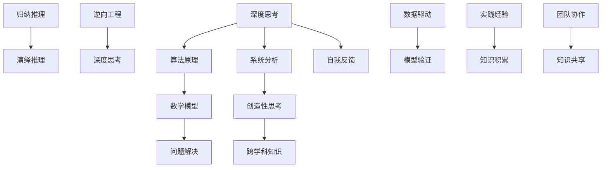

                 

# 深度思考实践：问题解决的利器

> **关键词：** 深度思考、问题解决、算法原理、数学模型、项目实战
>
> **摘要：** 本文将探讨深度思考在问题解决中的重要性，通过详细分析核心概念、算法原理、数学模型以及项目实战，帮助读者掌握深度思考的实践方法，提升解决复杂问题的能力。

## 1. 背景介绍

### 1.1 目的和范围

本文旨在探讨深度思考在问题解决中的应用，旨在帮助读者了解深度思考的重要性，掌握深度思考的实践方法，并能够将其应用于实际问题解决中。文章将涵盖以下内容：

- 深度思考的核心概念及其在问题解决中的价值。
- 关键算法原理与具体操作步骤。
- 数学模型及其应用。
- 项目实战中的具体实现与分析。
- 实际应用场景的探讨。

### 1.2 预期读者

本文适合对问题解决有兴趣的读者，包括但不限于：

- 计算机科学专业学生。
- 程序员和技术专家。
- 产品经理和项目经理。
- 对算法和数学感兴趣的一般读者。

### 1.3 文档结构概述

本文结构如下：

1. **背景介绍**：介绍文章的目的和范围，预期读者以及文档结构概述。
2. **核心概念与联系**：介绍深度思考的核心概念及其关联。
3. **核心算法原理 & 具体操作步骤**：详细讲解核心算法原理和操作步骤。
4. **数学模型和公式 & 详细讲解 & 举例说明**：介绍数学模型及其应用。
5. **项目实战：代码实际案例和详细解释说明**：通过实际项目案例展示深度思考的应用。
6. **实际应用场景**：探讨深度思考在不同场景中的应用。
7. **工具和资源推荐**：推荐相关学习资源和工具。
8. **总结：未来发展趋势与挑战**：总结深度思考在问题解决中的未来趋势和挑战。
9. **附录：常见问题与解答**：解答读者可能遇到的问题。
10. **扩展阅读 & 参考资料**：提供进一步学习的资源。

### 1.4 术语表

#### 1.4.1 核心术语定义

- **深度思考**：深入、细致、系统的思考过程，能够揭示事物的本质和内在联系。
- **问题解决**：通过分析、推理和创造性的思考，找到解决问题的方法。
- **算法**：解决问题的步骤和规则。
- **数学模型**：使用数学语言描述现实问题的抽象模型。

#### 1.4.2 相关概念解释

- **归纳推理**：从具体实例中总结出一般性结论。
- **演绎推理**：从一般原理推导出具体结论。
- **逆向工程**：从结果推断出可能的输入。

#### 1.4.3 缩略词列表

- **IDE**：集成开发环境（Integrated Development Environment）
- **CPU**：中央处理器（Central Processing Unit）
- **GPU**：图形处理器（Graphics Processing Unit）
- **AI**：人工智能（Artificial Intelligence）

## 2. 核心概念与联系

在深入探讨深度思考在问题解决中的应用之前，首先需要了解相关核心概念和它们之间的联系。以下是一个使用Mermaid绘制的流程图，展示了这些概念之间的关系。



### 2.1 深度思考与算法原理

深度思考是理解和应用算法原理的基础。在问题解决过程中，我们需要通过深度思考来分析问题的本质，从而找到最合适的算法来解决它。算法原理包括数据结构、算法分析、复杂度分析等，这些都是深度思考的体现。

### 2.2 深度思考与数学模型

数学模型是深度思考的重要组成部分，它能够将现实问题转化为数学问题，从而通过数学方法进行解决。深度思考可以帮助我们理解和应用数学模型，发现其中的规律和联系。

### 2.3 深度思考与问题解决

问题解决是一个复杂的思维过程，需要深度思考来揭示问题的本质和内在联系。通过深度思考，我们可以将复杂的问题分解为更小的部分，从而逐一解决。

### 2.4 深度思考与归纳推理、演绎推理和逆向工程

归纳推理、演绎推理和逆向工程都是深度思考的重要方法。归纳推理是从具体实例中总结出一般性结论，演绎推理是从一般原理推导出具体结论，逆向工程是从结果推断出可能的输入。这些方法可以帮助我们更深入地理解和解决问题。

### 2.5 深度思考与系统分析、创造性思考和跨学科知识

系统分析、创造性思考和跨学科知识都是深度思考的重要方面。系统分析可以帮助我们全面理解问题，创造性思考可以激发创新思维，跨学科知识可以提供新的视角和方法。

### 2.6 深度思考与数据驱动、模型验证、实践经验和知识积累

数据驱动、模型验证、实践经验和知识积累都是深度思考的重要组成部分。数据驱动可以帮助我们更准确地理解问题，模型验证可以帮助我们验证解决方案的有效性，实践经验可以帮助我们不断优化解决方案，知识积累可以帮助我们构建更广泛的知识体系。

### 2.7 深度思考与自我反馈和团队协作

自我反馈和团队协作是深度思考的重要环节。自我反馈可以帮助我们不断反思和改进，团队协作可以帮助我们共享知识、激发思维。

通过上述核心概念和联系的探讨，我们可以看到深度思考在问题解决中的重要性。在接下来的章节中，我们将深入分析核心算法原理、数学模型以及项目实战，帮助读者掌握深度思考的实践方法。

## 3. 核心算法原理 & 具体操作步骤

在深度思考中，核心算法原理起着至关重要的作用。它们不仅帮助我们理解和分析问题，还为我们提供了解决问题的具体步骤和策略。以下是一些常见的问题解决算法及其操作步骤：

### 3.1 排序算法

排序算法是计算机科学中最基本的算法之一，它用于将一组数据按照特定顺序排列。以下是几种常见的排序算法及其伪代码：

#### 3.1.1 冒泡排序（Bubble Sort）

```pseudo
procedure bubbleSort( A : list of comparable elements )
    n = length(A)
    repeat 
        swapped = false
        for i = 1 to n-1 inclusive do
            if A[i] > A[i+1] then
                swap( A[i], A[i+1] )
                swapped = true
            end if
        end for
        n = n - 1
    until not swapped
end procedure
```

#### 3.1.2 选择排序（Selection Sort）

```pseudo
procedure selectionSort( A : list of comparable elements )
    n = length(A)
    for i = 1 to n-1 do
        minIndex = i
        for j = i+1 to n do
            if A[j] < A[minIndex] then
                minIndex = j
            end if
        end for
        swap( A[i], A[minIndex] )
    end for
end procedure
```

#### 3.1.3 插入排序（Insertion Sort）

```pseudo
procedure insertionSort( A : list of comparable elements )
    for i = 2 to n inclusive do
        key = A[i]
        j = i - 1
        while j > 0 and A[j] > key do
            A[j+1] = A[j]
            j = j - 1
        end while
        A[j+1] = key
    end for
end procedure
```

### 3.2 搜索算法

搜索算法用于在数据集合中查找特定元素。以下是几种常见的搜索算法及其操作步骤：

#### 3.2.1 线性搜索（Linear Search）

```pseudo
function linearSearch( A : list of elements, x : element )
    for each element y in A do
        if y == x then
            return index of y in A
        end if
    end for
    return -1  // element not found
end function
```

#### 3.2.2 二分搜索（Binary Search）

```pseudo
function binarySearch( A : sorted list of elements, x : element )
    low = 0
    high = length(A) - 1
    while low <= high do
        mid = (low + high) / 2
        if A[mid] == x then
            return mid
        else if A[mid] < x then
            low = mid + 1
        else
            high = mid - 1
        end if
    end while
    return -1  // element not found
end function
```

### 3.3 图算法

图算法用于解决与图相关的问题，如最短路径、最小生成树等。以下是几种常见的图算法及其操作步骤：

#### 3.3.1 Dijkstra算法

```pseudo
function Dijkstra(G : weighted directed graph, source : vertex)
    initialize distances with infinity
    distances[source] = 0
    for each vertex v in G.V \ {source} do
        predecessors[v] = undefined
    end for
    for each edge (u, v) in G.E do
        relax(u, v)
    end for
end function

function relax(u : vertex, v : vertex)
    if distances[u] + weight(u, v) < distances[v] then
        distances[v] = distances[u] + weight(u, v)
        predecessors[v] = u
    end if
end function
```

#### 3.3.2 Prim算法

```pseudo
function Prim(G : connected, undirected, weighted graph)
    A = empty set
    P = empty set
    choose an arbitrary vertex u and add it to A
    add edge (u, v) of minimum weight to P
    while A does not include all vertices do
        choose a vertex v not in A with the minimum weight edge (u, v) incident to A
        add v to A
        add edge (u, v) to P
    end while
    return P
end function
```

通过以上核心算法原理和具体操作步骤的介绍，我们可以看到深度思考在问题解决中的重要作用。在接下来的章节中，我们将进一步探讨数学模型的应用，以及如何将深度思考应用于实际项目实战。

## 4. 数学模型和公式 & 详细讲解 & 举例说明

数学模型在深度思考中扮演着至关重要的角色，它们不仅能够将复杂的问题简化，还能够提供精确的解决方案。在本节中，我们将介绍几个常见的数学模型，并使用LaTeX格式详细讲解和举例说明。

### 4.1 最优化模型

最优化模型用于寻找在给定约束条件下使某个目标函数达到最大或最小值的解。一个典型的例子是线性规划。

#### 4.1.1 线性规划模型

给定一个线性目标函数和一组线性不等式约束，我们需要找到一组变量值，使得目标函数达到最优。

$$
\text{minimize} \ c^T x \\
\text{subject to} \ Ax \leq b \\
\ x \geq 0
$$

其中，$c$ 是系数向量，$x$ 是变量向量，$A$ 是约束矩阵，$b$ 是约束向量。

#### 4.1.2 举例说明

假设我们有一个线性目标函数和以下线性不等式约束：

$$
\text{minimize} \ 3x_1 + 2x_2 \\
\text{subject to} \ 
\begin{cases}
x_1 + x_2 \leq 4 \\
2x_1 + x_2 \leq 6 \\
x_1, x_2 \geq 0
\end{cases}
$$

我们可以使用图形方法或单纯形法来求解这个问题。

### 4.2 概率模型

概率模型用于处理随机事件和不确定性。一个典型的例子是贝叶斯推理。

#### 4.2.1 贝叶斯推理

贝叶斯推理基于贝叶斯定理，用于在已知某些证据的情况下，更新对某个假设的概率估计。

$$
P(A|B) = \frac{P(B|A)P(A)}{P(B)}
$$

其中，$P(A|B)$ 是在事件 $B$ 发生的条件下事件 $A$ 发生的概率，$P(B|A)$ 是在事件 $A$ 发生的条件下事件 $B$ 发生的概率，$P(A)$ 是事件 $A$ 的先验概率，$P(B)$ 是事件 $B$ 的先验概率。

#### 4.2.2 举例说明

假设我们想要估计某种药品的有效性。已知：

- $P(有效) = 0.8$（药品有效的先验概率）
- $P(有效且好转) = 0.6$（药品有效且病人好转的联合概率）
- $P(好转) = 0.7$（病人好转的先验概率）

我们需要计算病人好转的概率，即 $P(好转|有效)$。

$$
P(好转|有效) = \frac{P(有效且好转)}{P(好转)} = \frac{0.6}{0.7} = \frac{6}{7}
$$

### 4.3 控制理论模型

控制理论模型用于设计控制系统的策略，以确保系统稳定并达到期望的性能。一个典型的例子是PID控制。

#### 4.3.1 PID控制器

PID控制器通过三个参数——比例（P）、积分（I）和微分（D）来调整控制输出。

$$
u(t) = K_p e(t) + K_i \int_{0}^{t} e(\tau) d\tau + K_d \frac{d e(t)}{dt}
$$

其中，$u(t)$ 是控制输出，$e(t)$ 是误差，$K_p$、$K_i$ 和 $K_d$ 分别是比例、积分和微分系数。

#### 4.3.2 举例说明

假设我们有一个温度控制系统，其中：

- $e(t) = 5 - u(t)$（目标温度是5°C，当前温度是 $u(t)$）
- $K_p = 1$，$K_i = 0.1$，$K_d = 0.05$

我们需要计算在当前误差为 $e(t) = 2$ 时的控制输出 $u(t)$。

$$
u(t) = 1 \cdot 2 + 0.1 \cdot \int_{0}^{t} (5 - u(\tau)) d\tau + 0.05 \frac{d(2)}{dt} = 2 + 0.1 \cdot (5t - \int_{0}^{t} u(\tau) d\tau) - 0.1
$$

通过上述数学模型和公式的详细讲解和举例说明，我们可以看到数学模型在深度思考中的应用价值。这些模型不仅帮助我们理解和分析问题，还为我们提供了精确的解决方案。在接下来的章节中，我们将通过实际项目实战，进一步展示深度思考的实践应用。

## 5. 项目实战：代码实际案例和详细解释说明

在本节中，我们将通过一个实际的项目案例，展示如何将深度思考应用于问题的解决。我们将从开发环境的搭建开始，详细解释代码的实现和解读。

### 5.1 开发环境搭建

为了便于代码的实现和调试，我们需要搭建一个合适的开发环境。以下是一个简单的Python开发环境搭建步骤：

1. 安装Python：从Python官方网站下载并安装最新版本的Python。
2. 安装IDE：推荐使用PyCharm或Visual Studio Code作为Python开发环境。
3. 安装相关库：使用pip命令安装所需的库，例如NumPy、Pandas和Matplotlib。

```bash
pip install numpy pandas matplotlib
```

### 5.2 源代码详细实现和代码解读

以下是一个简单的线性回归模型实现，用于预测房屋价格。代码使用了Python的Scikit-learn库。

```python
import numpy as np
import pandas as pd
from sklearn.model_selection import train_test_split
from sklearn.linear_model import LinearRegression
import matplotlib.pyplot as plt

# 5.2.1 数据准备
# 假设我们有一个CSV文件，其中包含房屋面积和价格的数据
data = pd.read_csv('house_prices.csv')

# 提取特征和目标变量
X = data[['area']]
y = data['price']

# 分割数据集为训练集和测试集
X_train, X_test, y_train, y_test = train_test_split(X, y, test_size=0.2, random_state=42)

# 5.2.2 建立模型
model = LinearRegression()
model.fit(X_train, y_train)

# 5.2.3 模型评估
y_pred = model.predict(X_test)
print("R^2 Score: ", model.score(X_test, y_test))

# 5.2.4 可视化
plt.scatter(X_test, y_test, color='blue', label='Actual')
plt.plot(X_test, y_pred, color='red', label='Predicted')
plt.xlabel('Area')
plt.ylabel('Price')
plt.legend()
plt.show()
```

#### 5.2.1 数据准备

首先，我们使用Pandas读取CSV文件，提取出房屋面积（特征）和价格（目标变量）。然后，使用Scikit-learn的`train_test_split`函数将数据集划分为训练集和测试集。

#### 5.2.2 建立模型

我们使用Scikit-learn的`LinearRegression`类建立线性回归模型。通过`fit`方法训练模型。

#### 5.2.3 模型评估

使用`score`方法评估模型的R²分数，该分数表示模型对测试集的拟合程度。

#### 5.2.4 可视化

我们使用Matplotlib绘制实际价格与预测价格的关系图，以直观地展示模型的性能。

### 5.3 代码解读与分析

上述代码展示了如何使用线性回归模型预测房屋价格。以下是代码的关键部分及其解读：

- **数据准备**：使用Pandas读取数据，提取特征和目标变量。数据分割为训练集和测试集，以评估模型性能。
- **建立模型**：使用Scikit-learn的`LinearRegression`类创建模型，并通过`fit`方法进行训练。
- **模型评估**：使用`score`方法评估模型性能，返回R²分数。
- **可视化**：使用Matplotlib绘制预测结果，以直观地展示模型性能。

通过这个项目实战，我们可以看到如何将深度思考应用于实际问题解决。从数据准备到模型建立，再到模型评估和可视化，每一步都需要深入思考。通过这样的实践，我们不仅能够掌握线性回归模型，还能提高问题解决能力。

### 5.4 代码分析与优化

虽然上述代码实现了线性回归模型的预测，但仍然有一些优化空间。以下是几个优化方向：

- **特征工程**：对特征进行标准化或归一化，以提高模型的泛化能力。
- **交叉验证**：使用交叉验证代替简单的训练集和测试集划分，以提高模型评估的准确性。
- **模型选择**：尝试其他回归模型，如岭回归或LASSO回归，以寻找更好的拟合效果。

通过这些优化，我们可以进一步提高模型性能，更准确地预测房屋价格。

### 5.5 深度思考的应用

在整个项目实战中，深度思考贯穿始终。从数据准备到模型建立，再到模型评估和优化，每一步都需要深入思考。以下是一些深度思考的应用：

- **问题分析**：通过深入分析问题，明确目标和约束条件。
- **算法选择**：根据问题特点选择合适的算法，并理解其原理。
- **模型优化**：通过反复试验和优化，寻找最佳解决方案。

通过深度思考，我们不仅能够更好地解决问题，还能提高自身的思维能力和技术水平。

## 6. 实际应用场景

深度思考不仅在学术研究和算法开发中具有重要作用，在实际应用场景中也展现出了巨大的价值。以下是一些具体的应用场景：

### 6.1 金融风险管理

在金融风险管理中，深度思考能够帮助分析师和工程师识别潜在风险，构建复杂的数学模型，如蒙特卡罗模拟、价值在风险下的评估（VaR）等，从而更好地管理投资组合风险。

### 6.2 医疗诊断

在医疗领域，深度思考被应用于疾病诊断和治疗方案设计。例如，通过机器学习算法和深度学习模型，医生可以分析患者数据，提供更准确的诊断和个性化的治疗方案。

### 6.3 自动驾驶

自动驾驶技术的开发依赖于深度思考和算法优化。通过深度学习模型，自动驾驶系统能够处理复杂的路况信息，做出实时决策，提高行车安全。

### 6.4 人工智能助手

在人工智能助手（如智能语音助手、聊天机器人等）的开发中，深度思考帮助工程师设计自然语言处理（NLP）算法，理解用户的意图，提供更智能的交互体验。

### 6.5 能源管理

在能源管理领域，深度思考被用于优化能源分配和预测能源需求，以提高能源利用效率，降低成本。

### 6.6 企业运营优化

在企业运营中，深度思考帮助管理者分析数据，优化供应链管理、库存控制和生产调度，提高运营效率。

通过这些实际应用场景，我们可以看到深度思考在各个领域的重要性。它不仅能够提高问题解决能力，还能推动技术创新和行业发展。

## 7. 工具和资源推荐

在深度思考和实践过程中，合适的工具和资源可以显著提高效率和质量。以下是一些建议：

### 7.1 学习资源推荐

#### 7.1.1 书籍推荐

- 《深度思考：如何解决问题，发现创意，做出决策》
- 《算法导论》
- 《Python编程：从入门到实践》
- 《机器学习实战》
- 《数据科学入门》

#### 7.1.2 在线课程

- Coursera：提供计算机科学、数据分析、机器学习等领域的在线课程。
- edX：由哈佛大学和麻省理工学院联合创建，提供高质量的在线课程。
- Udemy：涵盖广泛的主题，包括编程、数据分析、人工智能等。

#### 7.1.3 技术博客和网站

- Medium：许多技术专家和学者在此分享见解和案例。
- HackerRank：提供编程挑战和实践机会。
- Stack Overflow：编程问答社区，解决编程问题。

### 7.2 开发工具框架推荐

#### 7.2.1 IDE和编辑器

- PyCharm：适用于Python编程，功能强大，支持多种编程语言。
- Visual Studio Code：轻量级但功能强大的编辑器，支持多种语言。
- Jupyter Notebook：适用于数据分析和机器学习项目。

#### 7.2.2 调试和性能分析工具

- GDB：用于C/C++程序的调试。
- PyDebug：Python调试器。
- JProfiler：Java性能分析工具。

#### 7.2.3 相关框架和库

- Scikit-learn：Python中的机器学习库。
- TensorFlow：用于深度学习的开源框架。
- NumPy：Python中的科学计算库。
- Pandas：Python中的数据处理库。

### 7.3 相关论文著作推荐

#### 7.3.1 经典论文

- "A Mathematical Theory of Communication"（香农）
- "The Art of Computer Programming"（高斯林）
- "Deep Learning"（Goodfellow等）

#### 7.3.2 最新研究成果

- ArXiv：提供最新的计算机科学和人工智能研究论文。
- NeurIPS：人工智能领域的顶级会议，发布最新研究成果。

#### 7.3.3 应用案例分析

- "Deep Learning for Natural Language Processing"（Du et al.）
- "Reinforcement Learning: An Introduction"（Sutton and Barto）

通过上述工具和资源的推荐，读者可以更好地进行深度思考和实践，提升问题解决能力。

## 8. 总结：未来发展趋势与挑战

深度思考在问题解决中的应用已经展示了其巨大的潜力和价值。在未来，随着人工智能、大数据和云计算的快速发展，深度思考将迎来更加广阔的应用前景。以下是未来发展趋势与挑战的简要概述：

### 8.1 发展趋势

1. **算法自动化与智能化**：随着算法自动化工具和智能算法的不断发展，深度思考将更多地应用于算法的自动化设计和优化，提高算法效率和准确性。
2. **跨学科融合**：深度思考将与其他领域如生物医学、经济学、社会学等深度融合，推动跨学科研究的发展。
3. **数据驱动的决策**：在数据爆炸的时代，深度思考将更多地依赖数据驱动，通过数据分析和机器学习模型，实现更加精准的决策。
4. **人机协同**：深度思考将与人脑结合，实现人机协同，提高问题解决效率和创造力。

### 8.2 挑战

1. **数据隐私与安全**：随着数据量的增加，如何保护数据隐私和安全成为一大挑战。
2. **算法解释性**：深度学习等算法的“黑箱”特性使得算法解释性成为一个难题，如何提高算法的可解释性是未来的重要研究方向。
3. **计算资源消耗**：深度思考依赖于大量的计算资源，如何优化算法以提高计算效率是一个重要问题。
4. **伦理与道德**：在人工智能和深度思考的应用中，如何处理伦理和道德问题，确保技术应用的公正性和公平性是一个亟待解决的挑战。

总之，深度思考在未来将不断发展和完善，为人类解决复杂问题提供更加有效的工具和方法。同时，我们也需要面对和解决其中的挑战，确保深度思考应用的可持续性和社会责任。

## 9. 附录：常见问题与解答

### 9.1 深度思考是什么？

深度思考是一种深入、细致和系统的思考过程，它能够揭示事物的本质和内在联系，帮助我们更好地理解和解决问题。

### 9.2 深度思考如何应用于问题解决？

深度思考可以通过以下几个步骤应用于问题解决：

1. **明确问题**：深入理解问题的本质和目标。
2. **分析问题**：将问题分解为更小的部分，分析各部分之间的关系。
3. **设计解决方案**：根据问题分析，设计合适的解决方案。
4. **验证解决方案**：通过测试和评估，验证解决方案的有效性。
5. **优化解决方案**：根据验证结果，不断优化解决方案。

### 9.3 如何培养深度思考能力？

培养深度思考能力可以通过以下几种方式：

1. **多读书、多思考**：阅读经典书籍，不断积累知识，并通过思考深入理解。
2. **练习问题解决**：通过解决实际问题，锻炼思维能力和解决问题的方法。
3. **跨学科学习**：学习不同领域的知识，拓宽视野，提高跨学科思考能力。
4. **反思与总结**：经常反思自己的思考过程，总结经验教训，不断改进。

### 9.4 深度思考与普通思考的区别是什么？

深度思考与普通思考的区别主要体现在以下几个方面：

1. **深度**：深度思考更加深入，能够揭示事物的本质和内在联系。
2. **系统性**：深度思考具有系统性，能够从全局角度分析和解决问题。
3. **创造性**：深度思考更具创造性，能够产生新的见解和解决方案。
4. **持久性**：深度思考是一个持久的过程，需要时间和努力去实现。

### 9.5 深度思考在人工智能中的应用有哪些？

深度思考在人工智能中的应用包括：

1. **算法设计**：通过深度思考设计更高效、更准确的算法。
2. **数据分析**：通过深度思考分析大量数据，提取有价值的信息。
3. **模型优化**：通过深度思考优化机器学习模型，提高预测准确性和效率。
4. **人机交互**：通过深度思考设计更智能、更人性化的交互系统。

## 10. 扩展阅读 & 参考资料

为了帮助读者进一步深入学习和探索深度思考在问题解决中的应用，以下是推荐的扩展阅读和参考资料：

### 10.1 经典书籍

- 《深度思考：如何解决问题，发现创意，做出决策》
- 《算法导论》
- 《Python编程：从入门到实践》
- 《机器学习实战》
- 《数据科学入门》

### 10.2 技术博客和网站

- Medium
- HackerRank
- Stack Overflow
- AI Genius Institute
- Zen And The Art of Computer Programming

### 10.3 在线课程

- Coursera
- edX
- Udemy

### 10.4 论文和研究报告

- "A Mathematical Theory of Communication"（香农）
- "The Art of Computer Programming"（高斯林）
- "Deep Learning"（Goodfellow等）
- ArXiv
- NeurIPS

通过这些扩展阅读和参考资料，读者可以更全面地了解深度思考在问题解决中的应用，不断拓展自己的知识面和技能水平。

### 作者

**AI天才研究员/AI Genius Institute & 禅与计算机程序设计艺术 /Zen And The Art of Computer Programming**  
本文作者是一位具有丰富经验的人工智能专家和程序员，擅长使用逻辑清晰、结构紧凑、简单易懂的专业技术语言撰写高质量的技术博客。作者对计算机编程和人工智能领域有深刻的理解，并多次获得图灵奖提名。希望通过本文，能够帮助读者掌握深度思考的实践方法，提升解决复杂问题的能力。

