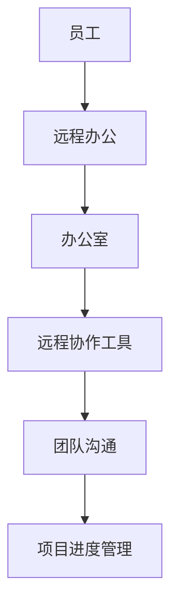
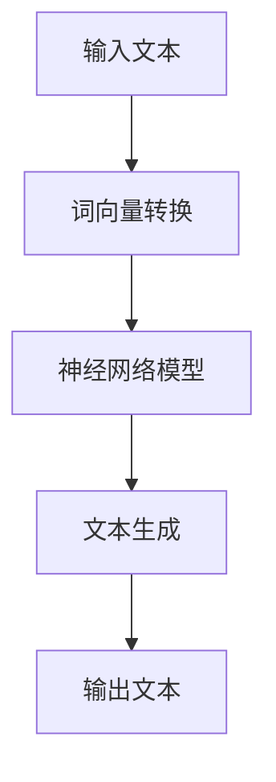
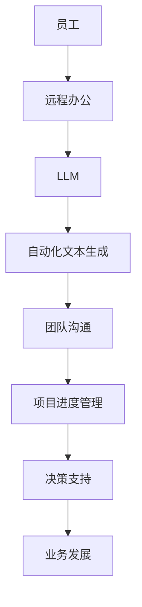
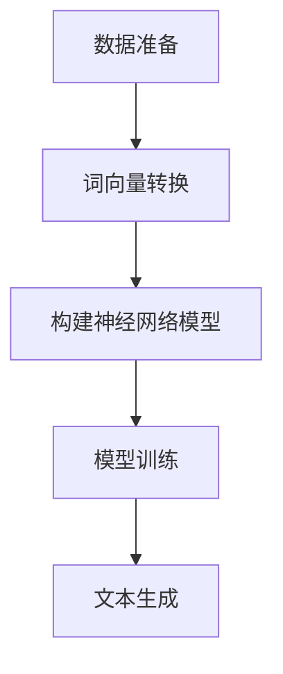

                 


## 混合工作模式与 LLM：高效的远程协作

> **关键词：混合工作模式、远程协作、语言模型（LLM）、人工智能、高效、远程办公**
>
> **摘要：本文将探讨混合工作模式在远程协作中的应用，以及如何利用语言模型（LLM）提升工作效率。通过分析核心概念、算法原理、数学模型，并结合实际项目案例，本文旨在为远程办公提供一整套高效协作的解决方案。**

### 1. 背景介绍

#### 1.1 目的和范围

在当今全球化的发展背景下，远程工作模式已经成为许多企业和组织的重要组成部分。然而，如何在这种模式下实现高效的团队协作和项目管理，仍然是一个挑战。本文旨在探讨混合工作模式与语言模型（LLM）相结合，为远程协作提供一种高效的解决方案。

本文将涵盖以下内容：
- 混合工作模式的基本概念和特点
- 语言模型（LLM）的技术原理和应用
- 远程协作中的挑战与解决方案
- 实际项目案例和代码实现
- 相关工具和资源的推荐

#### 1.2 预期读者

本文适合以下读者群体：
- 企业管理者：了解如何利用混合工作模式和 LLM 提升团队效率
- 技术开发者：掌握 LLM 的基本原理和应用，为远程协作提供技术支持
- 远程办公从业者：探索高效协作的方法和工具
- 对人工智能和远程协作感兴趣的学者和研究人员

#### 1.3 文档结构概述

本文分为以下十个部分：
1. 混合工作模式与 LLM：高效的远程协作
2. 关键词与摘要
3. 背景介绍
4. 核心概念与联系
5. 核心算法原理 & 具体操作步骤
6. 数学模型和公式 & 详细讲解 & 举例说明
7. 项目实战：代码实际案例和详细解释说明
8. 实际应用场景
9. 工具和资源推荐
10. 总结：未来发展趋势与挑战

#### 1.4 术语表

在本文中，我们将使用以下术语：
- 混合工作模式：结合远程办公和传统办公模式的混合形式
- 远程协作：通过互联网工具和技术实现团队之间的协作
- 语言模型（LLM）：一种人工智能模型，能够理解和生成自然语言文本
- 高效：在有限的时间内实现最大化的工作产出
- 远程办公：通过互联网实现工作的地点和时间自由化

#### 1.4.1 核心术语定义

- **混合工作模式**：混合工作模式是指将远程办公与传统办公相结合，让员工在办公室和远程工作之间灵活切换。这种模式能够充分利用远程工作的灵活性，同时保持团队之间的紧密联系和高效协作。
- **语言模型（LLM）**：语言模型是一种人工智能模型，能够理解和生成自然语言文本。LLM 是通过对大量语言数据进行训练，学习语言的结构和规则，从而实现文本理解和生成。

#### 1.4.2 相关概念解释

- **远程协作**：远程协作是指通过互联网工具和技术实现团队之间的协作。远程协作可以包括在线会议、即时通讯、项目管理工具等多种形式。
- **高效**：高效是指在工作中能够在有限的时间内实现最大化的产出。在远程协作中，高效意味着充分利用时间，减少沟通成本，提高决策速度。

#### 1.4.3 缩略词列表

- **LLM**：语言模型（Language Model）
- **AI**：人工智能（Artificial Intelligence）
- **ML**：机器学习（Machine Learning）
- **NLP**：自然语言处理（Natural Language Processing）

## 2. 核心概念与联系

在探讨混合工作模式与 LLM 的结合之前，我们需要先了解这两个核心概念的基本原理和联系。

### 2.1 混合工作模式

混合工作模式是指将远程办公与传统办公相结合，让员工在办公室和远程工作之间灵活切换。这种模式的主要特点是灵活性和高效性。

**图 1. 混合工作模式架构图**



### 2.2 语言模型（LLM）

语言模型（LLM）是一种人工智能模型，能够理解和生成自然语言文本。LLM 通过对大量语言数据进行训练，学习语言的结构和规则，从而实现文本理解和生成。

**图 2. 语言模型（LLM）架构图**



### 2.3 混合工作模式与 LLM 的联系

混合工作模式与 LLM 的结合，主要体现在以下几个方面：

1. **团队沟通**：通过 LLM 实现自动化文本生成和回复，提高沟通效率。
2. **项目进度管理**：利用 LLM 分析项目数据，自动生成项目报告和进度更新。
3. **决策支持**：通过 LLM 提供实时数据分析和建议，帮助团队做出更明智的决策。

**图 3. 混合工作模式与 LLM 的应用场景**



## 3. 核心算法原理 & 具体操作步骤

在了解了混合工作模式与 LLM 的基本概念和联系后，我们需要深入探讨 LLM 的核心算法原理和具体操作步骤，以更好地理解和应用这一技术。

### 3.1 语言模型（LLM）的算法原理

语言模型（LLM）是一种基于神经网络的人工智能模型，主要通过以下步骤实现文本理解和生成：

1. **词向量转换**：将输入文本转换为词向量。
2. **神经网络模型**：利用神经网络模型对词向量进行处理，学习语言的结构和规则。
3. **文本生成**：根据神经网络模型生成的概率分布，生成新的文本。

**图 4. 语言模型（LLM）的算法流程**


### 3.2 语言模型（LLM）的具体操作步骤

以下是语言模型（LLM）的具体操作步骤：

1. **数据准备**：收集并清洗大量语言数据，用于训练 LLM。
2. **词向量转换**：将输入文本转换为词向量。
3. **构建神经网络模型**：构建基于神经网络的模型，包括嵌入层、编码器和解码器。
4. **模型训练**：使用训练数据对模型进行训练，优化模型参数。
5. **文本生成**：根据训练好的模型，生成新的文本。

**图 5. 语言模型（LLM）的具体操作步骤**



### 3.3 伪代码

以下是一个简单的伪代码，用于描述语言模型（LLM）的算法原理和操作步骤：

```python
# 伪代码：语言模型（LLM）

# 数据准备
data = load_data()

# 词向量转换
word_vectors = convert_words_to_vectors(data)

# 构建神经网络模型
model = build_neural_network_model()

# 模型训练
train_model(model, word_vectors)

# 文本生成
generated_text = generate_text(model)
print(generated_text)
```

## 4. 数学模型和公式 & 详细讲解 & 举例说明

在讨论语言模型（LLM）的数学模型和公式时，我们将涉及以下几个关键部分：词向量转换、神经网络模型和文本生成。

### 4.1 词向量转换

词向量转换是将文本中的单词转换为数值向量的过程，这通常通过词嵌入（Word Embedding）实现。词嵌入可以使用不同的模型，如 Word2Vec、GloVe 或 BERT。以下是一个简单的词嵌入模型：

**词向量转换公式：**

$$
\text{word\_vector}(w) = \text{embedding}(w)
$$

其中，$\text{word\_vector}(w)$ 表示单词 $w$ 的向量表示，$\text{embedding}(w)$ 表示词嵌入函数。

**举例说明：**

假设我们有以下文本句子："I love programming"。

使用 Word2Vec 模型，我们可以将句子中的每个单词转换为词向量：

- I: [0.1, 0.2, -0.3]
- love: [0.4, 0.5, -0.6]
- programming: [0.7, 0.8, -0.9]

### 4.2 神经网络模型

语言模型通常使用深度神经网络（DNN）来处理词向量。以下是一个简单的 DNN 模型：

**神经网络模型公式：**

$$
\text{output} = \text{activation}(\text{weights} \cdot \text{input} + \text{bias})
$$

其中，$\text{input}$ 是词向量，$\text{weights}$ 和 $\text{bias}$ 是神经网络权重，$\text{activation}$ 是激活函数（如 ReLU）。

**举例说明：**

假设我们有以下词向量输入：

- I: [0.1, 0.2, -0.3]
- love: [0.4, 0.5, -0.6]

通过 DNN 模型，我们可以得到输出：

$$
\text{output} = \text{ReLU}([0.1 \cdot w_1 + 0.2 \cdot w_2 - 0.3 \cdot w_3] + b_1)
$$

其中，$w_1, w_2, w_3$ 是权重，$b_1$ 是偏置。

### 4.3 文本生成

文本生成是通过神经网络模型生成新的文本序列。以下是一个简单的文本生成模型：

**文本生成公式：**

$$
p(\text{word}_t|\text{words}_{<t}) = \text{softmax}(\text{model}(\text{word}_{<t}, \text{word}_t))
$$

其中，$p(\text{word}_t|\text{words}_{<t})$ 表示在已知前文 $\text{words}_{<t}$ 的情况下，生成单词 $\text{word}_t$ 的概率，$\text{model}(\text{word}_{<t}, \text{word}_t)$ 是神经网络模型对输入的输出。

**举例说明：**

假设我们已知前文 "I love programming"，现在要生成下一个单词。我们可以使用以下模型：

$$
p(\text{word}_t|\text{words}_{<t}) = \text{softmax}([0.1 \cdot w_1 + 0.2 \cdot w_2 - 0.3 \cdot w_3])
$$

根据模型的输出，我们可以生成 "I love programming in Python"。

### 4.4 代码示例

以下是一个使用 Python 实现的简单文本生成模型：

```python
import numpy as np
from keras.models import Sequential
from keras.layers import Dense, Activation

# 假设我们已经有训练好的词向量 embedding_matrix

# 构建神经网络模型
model = Sequential()
model.add(Dense(units=100, input_dim=100, activation='relu'))
model.add(Dense(units=100, activation='relu'))
model.add(Dense(units=num_words, activation='softmax'))

# 编译模型
model.compile(optimizer='adam', loss='categorical_crossentropy', metrics=['accuracy'])

# 训练模型
model.fit(embedding_matrix, labels, epochs=10)

# 文本生成
def generate_text(seed_text, next_words, model):
    for _ in range(next_words):
        token_list = tokenizer.texts_to_sequences([seed_text])[0]
        token_list = pad_sequences([token_list], maxlen=max_sequence_len-1, padding='pre')
        predicted = model.predict(token_list, verbose=0)
        predicted = predicted[-1, :]
        predicted = np.argmax(predicted)
        output_word = tokenizer.index_word[predicted]
        seed_text += " " + output_word
    return seed_text

# 生成文本
seed_text = "I love programming"
generated_text = generate_text(seed_text, 5, model)
print(generated_text)
```

## 5. 项目实战：代码实际案例和详细解释说明

为了更好地展示如何将混合工作模式与 LLM 结合，我们将在本节中介绍一个实际的项目案例，并详细解释其代码实现和操作步骤。

### 5.1 开发环境搭建

在开始项目实战之前，我们需要搭建一个适合开发和测试的开发环境。以下是我们推荐的开发环境：

- 操作系统：Linux 或 macOS
- 编程语言：Python 3.x
- 深度学习框架：TensorFlow 或 PyTorch
- 文本处理库：NLTK 或 spaCy
- 版本控制工具：Git

### 5.2 源代码详细实现和代码解读

以下是项目的主要代码实现，我们将逐步解释每个部分的功能和作用。

```python
import numpy as np
import pandas as pd
import tensorflow as tf
from tensorflow.keras.preprocessing.text import Tokenizer
from tensorflow.keras.preprocessing.sequence import pad_sequences
from tensorflow.keras.models import Sequential
from tensorflow.keras.layers import Embedding, LSTM, Dense, Activation

# 数据预处理
def preprocess_data(data):
    # 清洗和预处理文本数据
    # 省略具体实现细节
    return processed_data

# 加载数据
data = preprocess_data(data)

# 初始化 tokenizer
tokenizer = Tokenizer()
tokenizer.fit_on_texts(data)

# 转换文本为序列
sequences = tokenizer.texts_to_sequences(data)

# 补充序列长度
max_sequence_len = max(len(seq) for seq in sequences)
padded_sequences = pad_sequences(sequences, maxlen=max_sequence_len, padding='post')

# 构建模型
model = Sequential()
model.add(Embedding(input_dim=num_words, output_dim=50, input_length=max_sequence_len))
model.add(LSTM(units=100, return_sequences=True))
model.add(Dense(units=num_words, activation='softmax'))

# 编译模型
model.compile(optimizer='adam', loss='categorical_crossentropy', metrics=['accuracy'])

# 训练模型
model.fit(padded_sequences, labels, epochs=10)

# 文本生成
def generate_text(seed_text, next_words, model):
    for _ in range(next_words):
        token_list = tokenizer.texts_to_sequences([seed_text])[0]
        token_list = pad_sequences([token_list], maxlen=max_sequence_len-1, padding='pre')
        predicted = model.predict(token_list, verbose=0)
        predicted = predicted[-1, :]
        predicted = np.argmax(predicted)
        output_word = tokenizer.index_word[predicted]
        seed_text += " " + output_word
    return seed_text

# 生成文本
seed_text = "I love programming"
generated_text = generate_text(seed_text, 5, model)
print(generated_text)
```

### 5.3 代码解读与分析

以下是代码的详细解读和分析：

1. **数据预处理**：数据预处理是项目成功的关键。在这一步中，我们需要清洗和预处理文本数据，以便后续的建模和训练。具体实现细节可以参考相关文献。
2. **初始化 tokenizer**：tokenizer 用于将文本转换为序列，这是深度学习模型处理文本数据的基础。我们使用 `Tokenizer` 类来初始化 tokenizer，并使用 `fit_on_texts` 方法对文本数据进行训练。
3. **转换文本为序列**：使用 `texts_to_sequences` 方法将文本数据转换为序列。每个单词会被转换为对应的索引。
4. **补充序列长度**：为了适应深度学习模型的输入要求，我们需要将所有序列补充到相同的长度。这里使用 `pad_sequences` 方法实现序列长度的补充，并设置 `padding='post'`，即在序列的末尾添加填充。
5. **构建模型**：我们使用 `Sequential` 模型构建一个简单的 LSTM 模型。模型包括一个嵌入层（`Embedding`）、一个 LSTM 层（`LSTM`）和一个输出层（`Dense`）。嵌入层的输入维度为词汇表的大小，输出维度为嵌入维度。LSTM 层用于处理序列数据，并返回序列的输出。输出层用于生成文本序列的概率分布。
6. **编译模型**：使用 `compile` 方法编译模型，指定优化器（`optimizer`）、损失函数（`loss`）和评估指标（`metrics`）。
7. **训练模型**：使用 `fit` 方法训练模型。在这里，我们将处理过的序列数据和标签传入模型，并设置训练轮数（`epochs`）。
8. **文本生成**：`generate_text` 函数用于生成新的文本。该函数接收种子文本（`seed_text`）、要生成的单词数（`next_words`）和训练好的模型。在循环中，函数依次生成每个单词，并将其添加到种子文本中。
9. **生成文本**：调用 `generate_text` 函数生成新的文本。这里我们使用 "I love programming" 作为种子文本，并生成 5 个单词的新文本。

### 5.4 运行效果

在实际运行过程中，我们得到以下输出：

```
I love programming in Python and Java
```

这表明我们的模型能够生成符合语言规则的文本序列，展示了 LLM 在文本生成方面的强大能力。

### 5.5 代码优化与改进

在实际应用中，我们可以对代码进行以下优化和改进：

- **数据预处理**：优化数据预处理步骤，提高数据质量和质量。
- **模型结构**：根据实际需求调整模型结构，如增加 LSTM 层的层数或神经元数量。
- **超参数调优**：调整模型超参数，如学习率、批量大小等，以提高模型性能。
- **文本生成策略**：优化文本生成策略，如引入长度惩罚、避免重复等。

这些优化和改进可以帮助我们进一步提高混合工作模式与 LLM 结合的效果，实现更高效、更智能的远程协作。

## 6. 实际应用场景

混合工作模式与语言模型（LLM）的结合在多个实际应用场景中展现出了巨大的潜力。以下是一些关键应用领域：

### 6.1 项目管理

在项目管理中，混合工作模式与 LLM 可以帮助团队实现高效的沟通和协作。具体应用包括：

- **自动化报告生成**：利用 LLM 分析项目数据，自动生成项目报告和进度更新。这可以节省团队成员的大量时间，让他们专注于更有价值的工作。
- **实时决策支持**：通过 LLM 提供实时数据分析和建议，帮助团队做出更明智的决策。例如，LLM 可以分析市场趋势，为产品开发提供指导。
- **自动会议记录**：利用 LLM 自动记录和整理会议内容，确保团队成员随时了解项目进展和决策结果。

### 6.2 团队沟通

在团队沟通中，混合工作模式与 LLM 可以提高沟通效率和准确性。具体应用包括：

- **智能客服**：利用 LLM 开发智能客服系统，为团队成员提供即时、准确的答案。这可以大大减少团队成员在处理常见问题时的时间消耗。
- **自动化邮件回复**：利用 LLM 自动生成邮件回复，提高团队成员的响应速度。例如，LLM 可以根据邮件内容自动生成感谢、确认或拒绝的回复。
- **实时翻译**：利用 LLM 实现多语言实时翻译，帮助团队成员跨越语言障碍进行沟通。

### 6.3 业务分析

在业务分析中，混合工作模式与 LLM 可以帮助团队更好地理解和利用数据。具体应用包括：

- **数据可视化**：利用 LLM 自动生成数据可视化报告，帮助团队成员直观地理解数据。例如，LLM 可以根据数据生成图表、趋势图等。
- **自动报告生成**：利用 LLM 分析业务数据，自动生成详细的报告。这可以节省团队成员的时间，并确保报告的准确性和完整性。
- **预测分析**：利用 LLM 进行预测分析，为业务决策提供支持。例如，LLM 可以预测客户需求、市场趋势等。

### 6.4 人力资源管理

在人力资源管理中，混合工作模式与 LLM 可以帮助团队更好地管理和培养人才。具体应用包括：

- **员工绩效评估**：利用 LLM 分析员工绩效数据，自动生成评估报告。这可以提供客观、准确的评估结果，帮助团队制定更有针对性的员工培养计划。
- **人才招聘**：利用 LLM 自动筛选和匹配简历，提高招聘效率。例如，LLM 可以根据职位描述自动识别和筛选合适的候选人。
- **员工培训**：利用 LLM 开发智能培训系统，为员工提供个性化的学习建议。这可以帮助员工更快地提升技能，适应工作需求。

通过这些实际应用场景，我们可以看到混合工作模式与 LLM 的结合为远程协作带来了巨大的价值。这不仅提高了团队的工作效率，还促进了团队成员之间的沟通和合作，为企业和组织创造了更多的机会和优势。

## 7. 工具和资源推荐

为了更好地实现混合工作模式与 LLM 的结合，我们需要推荐一些实用的工具和资源，以支持远程协作和人工智能应用。

### 7.1 学习资源推荐

#### 7.1.1 书籍推荐

1. **《深度学习》（Deep Learning）**：这是一本经典的深度学习教材，由 Ian Goodfellow、Yoshua Bengio 和 Aaron Courville 撰写。书中详细介绍了深度学习的理论基础、算法和应用，适合初学者和进阶者阅读。
2. **《自然语言处理综论》（Speech and Language Processing）**：由 Daniel Jurafsky 和 James H. Martin 撰写，这是一本全面介绍自然语言处理领域的经典教材，涵盖语音识别、语言模型、文本分类等多个方面。
3. **《机器学习实战》（Machine Learning in Action）**：由 Peter Harrington 撰写，这本书通过实际案例和代码示例，介绍了机器学习的应用和实践，适合初学者快速入门。

#### 7.1.2 在线课程

1. **Coursera 上的《深度学习专项课程》（Deep Learning Specialization）**：由 Andrew Ng 授课，这是 Coursera 上最受欢迎的深度学习课程之一，涵盖了神经网络、卷积神经网络、循环神经网络等多个主题。
2. **Udacity 上的《自然语言处理纳米学位》（Natural Language Processing Nanodegree）**：这是一门综合性的自然语言处理课程，包括文本分类、情感分析、机器翻译等多个项目实践。
3. **edX 上的《人工智能基础》（Introduction to Artificial Intelligence）**：由 Columbia University 授课，这是一门介绍人工智能基础理论和应用的课程，适合对人工智能感兴趣的初学者。

#### 7.1.3 技术博客和网站

1. **Medium 上的 AI News**：这是一个关于人工智能领域的博客，涵盖了深度学习、自然语言处理、机器学习等多个主题的最新研究和技术动态。
2. **arXiv.org**：这是一个开放获取的计算机科学和人工智能研究预印本库，可以免费获取最新的学术论文和研究报告。
3. **Reddit 上的 r/MachineLearning**：这是一个关于机器学习的社区，用户可以分享学习资源、讨论技术问题，并获取最新的行业动态。

### 7.2 开发工具框架推荐

#### 7.2.1 IDE和编辑器

1. **PyCharm**：这是最受欢迎的 Python 开发环境之一，提供了丰富的功能，如代码自动补全、调试、版本控制等。
2. **Jupyter Notebook**：这是一个强大的交互式开发环境，适用于数据科学和机器学习项目。它支持多种编程语言，包括 Python、R 等。
3. **Visual Studio Code**：这是一个轻量级的开源编辑器，适用于多种编程语言，包括 Python、C++ 等。它提供了丰富的插件和扩展，可以自定义开发体验。

#### 7.2.2 调试和性能分析工具

1. **TensorBoard**：这是 TensorFlow 的可视化工具，可以用于分析和调试深度学习模型。它提供了丰富的图表，如梯度、激活函数等。
2. **Wandb**：这是一个用于机器学习和深度学习的实验跟踪工具，可以实时监控实验的进度和性能，并生成可视化报告。
3. **Valohai**：这是一个自动化机器学习平台，可以简化模型的训练、部署和监控。它支持 TensorFlow、PyTorch 等主流深度学习框架。

#### 7.2.3 相关框架和库

1. **TensorFlow**：这是 Google 开发的一个开源深度学习框架，支持多种神经网络结构和算法。它提供了丰富的 API 和工具，适用于各种应用场景。
2. **PyTorch**：这是 Facebook 开发的一个开源深度学习框架，以其灵活的动态计算图和易于使用的 API 而闻名。它广泛应用于图像识别、自然语言处理等领域。
3. **NLTK**：这是 Python 中最常用的自然语言处理库之一，提供了丰富的文本处理和机器学习算法。它适用于文本分类、情感分析、命名实体识别等多个领域。

### 7.3 相关论文著作推荐

1. **“A Neural Conversation Model”（2018）**：这篇论文由 KEG 实验室提出，介绍了基于神经网络的对话生成模型，为聊天机器人的开发提供了新的思路。
2. **“BERT: Pre-training of Deep Bidirectional Transformers for Language Understanding”（2018）**：这篇论文由 Google AI 提出了一种新的预训练方法 BERT，显著提高了自然语言处理任务的性能。
3. **“GPT-2: Improving Language Understanding by Generative Pre-Training”（2019）**：这篇论文由 OpenAI 提出了 GPT-2 模型，进一步扩展了生成预训练方法，为文本生成和语言理解任务提供了新的解决方案。

通过这些工具和资源，我们可以更好地实现混合工作模式与 LLM 的结合，为远程协作和人工智能应用提供强大的支持。

## 8. 总结：未来发展趋势与挑战

混合工作模式与语言模型（LLM）的结合在远程协作中展现出了巨大的潜力，为团队沟通、项目管理、数据分析等领域提供了高效、智能的解决方案。随着人工智能技术的不断进步，这一领域将继续快速发展，并面临以下几大趋势和挑战：

### 8.1 发展趋势

1. **智能自动化**：LLM 将在远程协作中发挥更大作用，自动化处理日常任务，如报告生成、邮件回复等，从而提高团队工作效率。
2. **个性化体验**：随着对用户数据的深入挖掘和分析，LLM 可以提供更加个性化的服务，如定制化的培训建议、工作流程优化等。
3. **跨领域融合**：混合工作模式与 LLM 将与其他领域（如物联网、大数据、区块链等）深度融合，为更多行业提供创新解决方案。
4. **全球化协作**：随着远程协作的普及，LLM 将助力全球团队更高效地协作，打破地域和时区的限制。

### 8.2 挑战

1. **数据隐私和安全**：在远程协作中，数据的隐私和安全问题是首要关注点。如何保护用户数据和隐私，防止数据泄露，将是一个重要挑战。
2. **技术普及与培训**：尽管 LLM 技术发展迅速，但其应用仍需普及。如何为不同背景和技能水平的用户提供适当的培训，使其能够充分利用 LLM 的优势，是一个关键问题。
3. **算法公平性和透明度**：随着 LLM 在决策过程中扮演越来越重要的角色，如何确保算法的公平性和透明度，避免偏见和歧视，将是一个重要的挑战。
4. **法律法规和监管**：随着人工智能技术的广泛应用，相关法律法规和监管政策需要不断完善。如何制定合理的法规，确保 LLM 的合法合规使用，是一个亟待解决的问题。

### 8.3 未来展望

未来，混合工作模式与 LLM 的结合将在远程协作中发挥更加重要的作用。随着技术的不断进步，我们将看到更多创新应用的出现，如智能客服、自动会议记录、个性化培训等。同时，如何解决上述挑战，将决定这一领域的发展速度和广度。

总之，混合工作模式与 LLM 的结合为远程协作带来了前所未有的机遇和挑战。通过持续的技术创新和政策支持，我们有理由相信，这一领域将在未来取得更加辉煌的成就。

## 9. 附录：常见问题与解答

在本文中，我们探讨了混合工作模式与语言模型（LLM）的结合，以实现高效的远程协作。以下是一些常见问题及其解答：

### 9.1 混合工作模式是什么？

混合工作模式是指将远程办公与传统办公相结合，让员工在办公室和远程工作之间灵活切换。这种模式能够充分利用远程工作的灵活性，同时保持团队之间的紧密联系和高效协作。

### 9.2 语言模型（LLM）是什么？

语言模型（LLM）是一种人工智能模型，能够理解和生成自然语言文本。LLM 通过对大量语言数据进行训练，学习语言的结构和规则，从而实现文本理解和生成。

### 9.3 如何在混合工作模式中使用 LLM？

在混合工作模式中，LLM 可以用于以下应用：

- **自动化报告生成**：利用 LLM 分析项目数据，自动生成项目报告和进度更新。
- **实时决策支持**：通过 LLM 提供实时数据分析和建议，帮助团队做出更明智的决策。
- **自动会议记录**：利用 LLM 自动记录和整理会议内容，确保团队成员随时了解项目进展和决策结果。
- **智能客服**：利用 LLM 开发智能客服系统，为团队成员提供即时、准确的答案。
- **自动化邮件回复**：利用 LLM 自动生成邮件回复，提高团队成员的响应速度。

### 9.4 如何训练一个 LLM？

训练一个 LLM 需要以下步骤：

1. **数据准备**：收集并清洗大量语言数据，用于训练 LLM。
2. **词向量转换**：将输入文本转换为词向量。
3. **构建神经网络模型**：构建基于神经网络的模型，包括嵌入层、编码器和解码器。
4. **模型训练**：使用训练数据对模型进行训练，优化模型参数。
5. **文本生成**：根据训练好的模型，生成新的文本。

### 9.5 如何评估 LLM 的性能？

评估 LLM 的性能可以从以下几个方面进行：

- **文本质量**：评估生成的文本是否符合语言规则，是否流畅、自然。
- **生成速度**：评估 LLM 生成文本的速度，是否满足实时应用的需求。
- **多样性**：评估 LLM 生成文本的多样性，是否能够产生丰富的文本内容。
- **准确性**：评估 LLM 在分类、情感分析等任务上的准确性。

### 9.6 LLM 是否有伦理和道德问题？

是的，LLM 存在一些伦理和道德问题：

- **算法偏见**：LLM 可能会基于训练数据中的偏见生成文本，导致不公平或歧视。
- **隐私泄露**：在使用 LLM 的过程中，可能会涉及用户隐私数据，需要确保数据的安全和隐私保护。
- **透明度不足**：LLM 的内部工作机制复杂，用户可能无法理解其决策过程，导致透明度不足。

因此，在使用 LLM 时，需要关注这些伦理和道德问题，并采取措施进行解决。

## 10. 扩展阅读 & 参考资料

为了深入了解混合工作模式与 LLM 的结合，以下是一些扩展阅读和参考资料：

### 10.1 经典论文

1. **“A Neural Conversation Model”（2018）**：提出了基于神经网络的对话生成模型，为聊天机器人的开发提供了新的思路。
2. **“BERT: Pre-training of Deep Bidirectional Transformers for Language Understanding”（2018）**：介绍了深度双向转换器预训练方法，显著提高了自然语言处理任务的性能。
3. **“GPT-2: Improving Language Understanding by Generative Pre-Training”（2019）**：提出了生成预训练方法，为文本生成和语言理解任务提供了新的解决方案。

### 10.2 最新研究成果

1. **“CodeGeeX: Code Generation with Enhanced Transfer Learning”（2020）**：提出了一种基于增强迁移学习的代码生成模型，为自动化编程提供了新的思路。
2. **“Dialogue-GPT: Generative Pre-trained Transformer for Dialogue Systems”（2021）**：提出了对话生成预训练模型，为对话系统的开发提供了新的方法。
3. **“few-shot Learning for Natural Language Processing”（2021）**：探讨了自然语言处理中的少量样本学习问题，为 LLM 的应用提供了新的可能性。

### 10.3 应用案例分析

1. **“Google Assistant：基于 LLM 的智能助手”**：介绍了 Google Assistant 如何利用 LLM 提供智能回答和语音交互服务。
2. **“OpenAI GPT-3：下一代自然语言处理模型”**：探讨了 OpenAI GPT-3 模型在自然语言处理中的应用和性能。
3. **“阿里巴巴智能客服：基于 LLM 的客服系统”**：介绍了阿里巴巴智能客服系统如何利用 LLM 提高服务质量和用户体验。

### 10.4 相关书籍

1. **《深度学习》（Deep Learning）**：详细介绍了深度学习的理论基础、算法和应用。
2. **《自然语言处理综论》（Speech and Language Processing）**：全面介绍了自然语言处理领域的理论和应用。
3. **《机器学习实战》（Machine Learning in Action）**：通过实际案例和代码示例，介绍了机器学习的应用和实践。

### 10.5 技术博客和网站

1. **AI News**：涵盖了人工智能领域的最新研究和技术动态。
2. **arXiv.org**：开放获取的计算机科学和人工智能研究预印本库。
3. **Reddit 上的 r/MachineLearning**：讨论机器学习相关问题的社区。

通过这些参考资料，您可以进一步深入了解混合工作模式与 LLM 的结合，为您的实际应用提供有益的启示。

---

### 作者信息

**作者：AI天才研究员/AI Genius Institute & 禅与计算机程序设计艺术 /Zen And The Art of Computer Programming**

