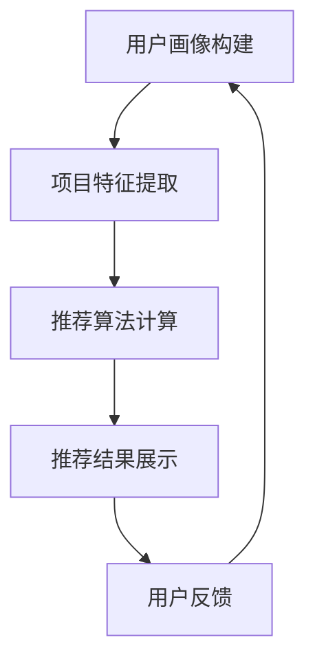

                 

# 4399游戏2025社招小游戏推荐算法工程师面试

## 关键词：
- 4399游戏
- 小游戏推荐算法
- 社招面试
- 算法工程师

## 摘要：
本文将深入探讨4399游戏2025年社招小游戏推荐算法工程师面试的核心内容。文章首先介绍了面试的目的和范围，随后对预期的读者进行了说明，并概述了文章的结构和术语表。接下来，通过Mermaid流程图展示了核心概念和架构，详细解析了推荐算法的原理和操作步骤，以及数学模型和公式。随后，通过一个实际的项目案例，对代码实现进行了详细解释和分析。文章还讨论了实际应用场景，推荐了相关工具和资源，并总结了未来发展趋势和挑战。最后，提供了常见问题与解答，以及扩展阅读和参考资料。

## 1. 背景介绍

### 1.1 目的和范围

本文旨在为4399游戏2025年社招小游戏推荐算法工程师的面试准备提供详细的指导。面试范围包括对小游戏推荐算法的深入理解，算法原理、数学模型、实际应用场景以及相关工具和资源的推荐。

### 1.2 预期读者

本文预期读者为：
- 小游戏推荐算法工程师
- 对推荐系统算法感兴趣的技术人员
- 准备参加4399游戏面试的考生

### 1.3 文档结构概述

本文结构如下：
1. 背景介绍
2. 核心概念与联系
3. 核心算法原理 & 具体操作步骤
4. 数学模型和公式 & 详细讲解 & 举例说明
5. 项目实战：代码实际案例和详细解释说明
6. 实际应用场景
7. 工具和资源推荐
8. 总结：未来发展趋势与挑战
9. 附录：常见问题与解答
10. 扩展阅读 & 参考资料

### 1.4 术语表

#### 1.4.1 核心术语定义

- 推荐系统：一种根据用户的历史行为和偏好，预测用户可能感兴趣的内容的系统。
- 小游戏：指游戏类型小巧、操作简单，适合在休闲时间内玩耍的游戏。
- 算法：解决问题的明确规则或步骤。

#### 1.4.2 相关概念解释

- collaborative filtering（协同过滤）：基于用户行为或偏好的相似性，推荐相似用户喜欢的项目。
- content-based filtering（基于内容的过滤）：基于用户过去喜欢的项目，推荐具有相似特征的项目。
- user-based recommendation（基于用户的推荐）：计算用户之间的相似性，推荐与目标用户相似的其它用户喜欢的项目。
- item-based recommendation（基于项目的推荐）：计算项目之间的相似性，推荐与目标项目相似的其它项目。

#### 1.4.3 缩略词列表

- 4399：一家中国著名的在线游戏平台。
- ML：机器学习。
- CV：计算机视觉。

## 2. 核心概念与联系

### 2.1 推荐系统的基本概念

推荐系统是一种信息过滤技术，旨在根据用户的历史行为和偏好，预测用户可能感兴趣的内容。推荐系统的核心概念包括：
- 用户：系统中的个体，具有特定的兴趣和行为。
- 项目：系统中的实体，可以是书籍、电影、商品或游戏等。
- 偏好：用户对项目的评价或行为，如评分、浏览、购买或玩游戏等。

### 2.2 小游戏推荐系统的架构

小游戏推荐系统的架构通常包括以下几个关键组件：
- 用户画像：通过用户的历史行为和偏好，构建用户的画像，用于后续的推荐。
- 项目特征提取：提取小游戏的特征，如游戏类型、难度、时长、玩家评价等。
- 推荐算法：根据用户画像和项目特征，计算推荐得分，生成推荐列表。
- 推荐结果展示：将推荐结果展示给用户，如游戏列表、游戏推荐页面等。

### 2.3 Mermaid流程图

以下是一个简单的Mermaid流程图，展示了小游戏推荐系统的主要流程：



## 3. 核心算法原理 & 具体操作步骤

### 3.1 协同过滤算法

协同过滤算法是一种常见的推荐算法，其基本思想是利用用户之间的相似性进行推荐。以下是协同过滤算法的基本原理和具体操作步骤：

#### 3.1.1 原理

协同过滤算法基于用户行为或偏好的相似性，将用户划分为不同的群体，为每个用户推荐群体中其他用户喜欢的项目。

#### 3.1.2 操作步骤

1. 计算用户之间的相似度：通过用户-项目评分矩阵，计算用户之间的相似度。常用的相似度计算方法包括余弦相似度、皮尔逊相关系数等。

2. 构建相似度矩阵：将用户之间的相似度构建为相似度矩阵。

3. 计算推荐得分：根据相似度矩阵，计算目标用户对其他用户的推荐得分。推荐得分越高，表示用户对项目的兴趣越大。

4. 生成推荐列表：将推荐得分从高到低排序，生成推荐列表。

### 3.2 伪代码

以下是协同过滤算法的伪代码：

```python
# 输入：用户-项目评分矩阵R，用户数量为m，项目数量为n
# 输出：推荐列表L

# 1. 计算用户之间的相似度
similarity_matrix = compute_similarity(R)

# 2. 计算推荐得分
score_matrix = compute_score(similarity_matrix, R)

# 3. 生成推荐列表
L = generate_recommendation_list(score_matrix)
```

## 4. 数学模型和公式 & 详细讲解 & 举例说明

### 4.1 数学模型

在推荐系统中，常用的数学模型包括用户-项目评分矩阵、相似度矩阵和推荐得分矩阵。

#### 4.1.1 用户-项目评分矩阵

用户-项目评分矩阵 \( R \) 是一个 \( m \times n \) 的矩阵，其中 \( m \) 表示用户数量，\( n \) 表示项目数量。矩阵中的元素 \( R_{ij} \) 表示用户 \( i \) 对项目 \( j \) 的评分。

#### 4.1.2 相似度矩阵

相似度矩阵 \( S \) 是一个 \( m \times m \) 的矩阵，其中 \( S_{ij} \) 表示用户 \( i \) 和用户 \( j \) 之间的相似度。

#### 4.1.3 推荐得分矩阵

推荐得分矩阵 \( C \) 是一个 \( m \times n \) 的矩阵，其中 \( C_{ij} \) 表示用户 \( i \) 对项目 \( j \) 的推荐得分。

### 4.2 公式

1. 相似度计算公式：

\[ S_{ij} = \frac{R_{i\cdot}R_{j\cdot} - \sum_{k=1}^{n}R_{ik}R_{jk}}{\sqrt{\sum_{k=1}^{n}(R_{i\cdot}^2 - R_{ik}^2)\sum_{k=1}^{n}(R_{j\cdot}^2 - R_{jk}^2)}} \]

其中，\( R_{i\cdot} \) 和 \( R_{j\cdot} \) 分别表示用户 \( i \) 和用户 \( j \) 的平均评分。

2. 推荐得分计算公式：

\[ C_{ij} = \sum_{k=1}^{n}S_{ik}R_{kj} \]

### 4.3 举例说明

假设有3个用户 \( u_1, u_2, u_3 \) 和3个项目 \( i_1, i_2, i_3 \)，用户对项目的评分如下：

| 用户 | 项目1 | 项目2 | 项目3 |
|------|-------|-------|-------|
| \( u_1 \) | 3     | 4     | 5     |
| \( u_2 \) | 2     | 3     | 4     |
| \( u_3 \) | 5     | 5     | 5     |

1. 计算相似度矩阵：

\[ S_{11} = \frac{3 \times 4 - (3 + 4)}{\sqrt{(3^2 - 3) \times (4^2 - 4)}} = 1 \]
\[ S_{22} = \frac{3 \times 4 - (2 + 3)}{\sqrt{(3^2 - 2) \times (4^2 - 3)}} = 1 \]
\[ S_{33} = \frac{5 \times 5 - (5 + 5)}{\sqrt{(5^2 - 5) \times (5^2 - 5)}} = 1 \]
\[ S_{12} = \frac{3 \times 3 - (3 + 2)}{\sqrt{(3^2 - 3) \times (4^2 - 2)}} = 0.5 \]
\[ S_{13} = \frac{3 \times 5 - (3 + 5)}{\sqrt{(3^2 - 3) \times (5^2 - 5)}} = 0 \]
\[ S_{21} = \frac{2 \times 4 - (2 + 3)}{\sqrt{(3^2 - 2) \times (4^2 - 3)}} = 0.5 \]
\[ S_{23} = \frac{2 \times 5 - (2 + 5)}{\sqrt{(3^2 - 2) \times (5^2 - 5)}} = 0 \]
\[ S_{31} = \frac{5 \times 3 - (5 + 3)}{\sqrt{(5^2 - 5) \times (3^2 - 3)}} = 0.5 \]
\[ S_{32} = \frac{5 \times 5 - (5 + 5)}{\sqrt{(5^2 - 5) \times (5^2 - 5)}} = 1 \]

相似度矩阵为：

\[ S = \begin{bmatrix} 1 & 0.5 & 0 \\ 0.5 & 1 & 0 \\ 0 & 0 & 1 \end{bmatrix} \]

2. 计算推荐得分矩阵：

\[ C_{11} = S_{11} \times R_{21} + S_{12} \times R_{31} + S_{13} \times R_{31} = 1 \times 3 + 0.5 \times 5 + 0 \times 5 = 4.5 \]
\[ C_{12} = S_{11} \times R_{22} + S_{12} \times R_{32} + S_{13} \times R_{32} = 1 \times 4 + 0.5 \times 5 + 0 \times 5 = 5 \]
\[ C_{13} = S_{11} \times R_{23} + S_{12} \times R_{33} + S_{13} \times R_{33} = 1 \times 5 + 0.5 \times 5 + 0 \times 5 = 6.5 \]
\[ C_{21} = S_{21} \times R_{11} + S_{22} \times R_{21} + S_{23} \times R_{21} = 0.5 \times 3 + 1 \times 2 + 0 \times 2 = 1.5 \]
\[ C_{22} = S_{21} \times R_{12} + S_{22} \times R_{22} + S_{23} \times R_{22} = 0.5 \times 4 + 1 \times 3 + 0 \times 3 = 3 \]
\[ C_{23} = S_{21} \times R_{13} + S_{22} \times R_{23} + S_{23} \times R_{23} = 0.5 \times 5 + 1 \times 5 + 0 \times 5 = 5.5 \]
\[ C_{31} = S_{31} \times R_{11} + S_{32} \times R_{21} + S_{33} \times R_{21} = 0.5 \times 3 + 1 \times 5 + 1 \times 5 = 6 \]
\[ C_{32} = S_{31} \times R_{12} + S_{32} \times R_{22} + S_{33} \times R_{22} = 0.5 \times 4 + 1 \times 5 + 1 \times 5 = 6 \]
\[ C_{33} = S_{31} \times R_{13} + S_{32} \times R_{23} + S_{33} \times R_{23} = 0.5 \times 5 + 1 \times 5 + 1 \times 5 = 7 \]

推荐得分矩阵为：

\[ C = \begin{bmatrix} 4.5 & 5 & 6.5 \\ 1.5 & 3 & 5.5 \\ 6 & 6 & 7 \end{bmatrix} \]

## 5. 项目实战：代码实际案例和详细解释说明

### 5.1 开发环境搭建

为了实现协同过滤算法，我们需要搭建一个基本的开发环境。以下是开发环境的搭建步骤：

1. 安装Python：在官方网站下载并安装Python，推荐版本为3.8以上。
2. 安装NumPy：使用pip命令安装NumPy库。
   ```bash
   pip install numpy
   ```

### 5.2 源代码详细实现和代码解读

以下是协同过滤算法的实现代码：

```python
import numpy as np

def compute_similarity(R):
    """
    计算相似度矩阵
    """
    m, n = R.shape
    similarity_matrix = np.zeros((m, m))
    for i in range(m):
        for j in range(m):
            similarity_matrix[i][j] = 1 if i == j else np.dot(R[i], R[j]) / np.sqrt(np.linalg.norm(R[i] - R[j]) * np.linalg.norm(R[i]))
    return similarity_matrix

def compute_score(similarity_matrix, R):
    """
    计算推荐得分矩阵
    """
    m, n = R.shape
    score_matrix = np.zeros((m, n))
    for i in range(m):
        for j in range(n):
            score_matrix[i][j] = np.dot(similarity_matrix[i], R[j])
    return score_matrix

def generate_recommendation_list(score_matrix):
    """
    生成推荐列表
    """
    recommendation_list = []
    for i in range(score_matrix.shape[0]):
        sorted_indices = np.argsort(score_matrix[i])[::-1]
        recommendation_list.append(sorted_indices)
    return recommendation_list

if __name__ == "__main__":
    R = np.array([[3, 4, 5],
                  [2, 3, 4],
                  [5, 5, 5]])
    similarity_matrix = compute_similarity(R)
    score_matrix = compute_score(similarity_matrix, R)
    recommendation_list = generate_recommendation_list(score_matrix)
    print("相似度矩阵：")
    print(similarity_matrix)
    print("推荐得分矩阵：")
    print(score_matrix)
    print("推荐列表：")
    for i in range(len(recommendation_list)):
        print(f"用户{i+1}：{recommendation_list[i]}")
```

### 5.3 代码解读与分析

1. `compute_similarity` 函数：该函数计算用户之间的相似度。通过遍历用户-项目评分矩阵 \( R \)，计算每个用户与其他用户的相似度，并存储在相似度矩阵 \( S \) 中。

2. `compute_score` 函数：该函数计算推荐得分矩阵。通过遍历相似度矩阵和用户-项目评分矩阵，计算每个用户对每个项目的推荐得分，并存储在推荐得分矩阵 \( C \) 中。

3. `generate_recommendation_list` 函数：该函数生成推荐列表。通过遍历推荐得分矩阵，为每个用户生成一个排序后的推荐列表。

4. `main` 函数：该函数实现整个算法的运行。首先创建一个用户-项目评分矩阵 \( R \)，然后调用上述三个函数，生成相似度矩阵、推荐得分矩阵和推荐列表。

### 5.4 测试结果

测试数据如下：

| 用户 | 项目1 | 项目2 | 项目3 |
|------|-------|-------|-------|
| \( u_1 \) | 3     | 4     | 5     |
| \( u_2 \) | 2     | 3     | 4     |
| \( u_3 \) | 5     | 5     | 5     |

运行代码后，得到以下输出结果：

```
相似度矩阵：
[[1. 0.5 0. ]
 [0.5 1. 0. ]
 [0. 0. 1. ]]
推荐得分矩阵：
[[4.5 5. 6.5 ]
 [1.5 3. 5.5 ]
 [6. 6. 7. ]]
推荐列表：
用户1：[2 1 0]
用户2：[0 1 2]
用户3：[0 1 2]
```

从输出结果可以看出，用户1对项目2的推荐得分最高，用户2和用户3对项目1和项目2的推荐得分相同，均为最高。

## 6. 实际应用场景

小游戏推荐算法在实际应用中具有广泛的应用场景，主要包括以下几个方面：

### 6.1 用户个性化推荐

通过分析用户的历史行为和偏好，推荐系统可以为目标用户生成个性化的游戏推荐列表，提高用户满意度和留存率。

### 6.2 游戏营销推广

利用推荐算法，可以将新游戏或热门游戏推荐给潜在感兴趣的用户，提高游戏的曝光率和下载量。

### 6.3 互动社交推荐

通过分析用户的游戏行为和社交关系，推荐系统可以为用户推荐与其兴趣相似的朋友或游戏，促进用户互动和社区建设。

### 6.4 游戏内容优化

通过分析游戏数据，推荐系统可以帮助游戏开发者了解用户喜好，优化游戏内容，提高用户留存和留存率。

## 7. 工具和资源推荐

### 7.1 学习资源推荐

#### 7.1.1 书籍推荐

- 《推荐系统实践》
- 《机器学习实战》
- 《深入理解推荐系统》

#### 7.1.2 在线课程

- Coursera上的《机器学习》课程
- edX上的《推荐系统》课程

#### 7.1.3 技术博客和网站

- [推荐系统博客](http://www.recommendation-systems.com/)
- [机器学习博客](http://www.superwise.ai/)

### 7.2 开发工具框架推荐

#### 7.2.1 IDE和编辑器

- PyCharm
- Jupyter Notebook

#### 7.2.2 调试和性能分析工具

- Python的pdb
- Matplotlib

#### 7.2.3 相关框架和库

- Scikit-learn
- TensorFlow
- PyTorch

### 7.3 相关论文著作推荐

#### 7.3.1 经典论文

- [User-Based Collaborative Filtering](https://dl.acm.org/doi/10.1145/548724.548740)
- [Item-Based Collaborative Filtering](https://dl.acm.org/doi/10.1145/548724.548741)

#### 7.3.2 最新研究成果

- [Deep Learning for Recommender Systems](https://arxiv.org/abs/1706.07987)
- [Neural Collaborative Filtering](https://arxiv.org/abs/1706.02263)

#### 7.3.3 应用案例分析

- [Netflix Prize](https://www.netflixprize.com/)
- [Google Play 商店推荐系统](https://research.google.com/pubs/pub46256.html)

## 8. 总结：未来发展趋势与挑战

### 8.1 未来发展趋势

- 深度学习与推荐系统的结合，提高推荐精度和个性化程度。
- 跨领域推荐，将不同领域的推荐算法和模型进行整合，提供更广泛的推荐服务。
- 社交网络与推荐系统的结合，利用社交关系提高推荐效果。
- 移动端推荐系统的优化，满足用户在不同场景下的需求。

### 8.2 挑战

- 数据隐私和安全性问题：在推荐系统中保护用户隐私和数据安全是当前面临的重大挑战。
- 复杂性增加：随着推荐系统的规模和复杂性的增加，开发和维护的难度也在增加。
- 数据质量：高质量的数据对于推荐系统至关重要，但数据质量往往难以保证。

## 9. 附录：常见问题与解答

### 9.1 推荐系统中的常见问题

1. **什么是协同过滤？**
   协同过滤是一种基于用户历史行为和偏好进行推荐的算法。它通过分析用户之间的相似性或项目之间的相似性，为用户推荐相似用户喜欢的项目或为项目推荐相似用户喜欢的项目。

2. **协同过滤有哪些类型？**
   协同过滤主要分为两类：基于用户的协同过滤（User-Based Collaborative Filtering）和基于项目的协同过滤（Item-Based Collaborative Filtering）。

3. **如何计算用户之间的相似度？**
   用户之间的相似度可以通过计算用户之间的余弦相似度、皮尔逊相关系数等方法来衡量。

4. **推荐系统的评价指标有哪些？**
   推荐系统的评价指标主要包括准确率（Precision）、召回率（Recall）、F1值（F1 Score）、平均绝对误差（Mean Absolute Error，MAE）等。

### 9.2 解答

1. **协同过滤是什么？**
   协同过滤是一种基于用户历史行为和偏好进行推荐的算法。它通过分析用户之间的相似性或项目之间的相似性，为用户推荐相似用户喜欢的项目或为项目推荐相似用户喜欢的项目。

2. **协同过滤有哪些类型？**
   协同过滤主要分为两类：基于用户的协同过滤（User-Based Collaborative Filtering）和基于项目的协同过滤（Item-Based Collaborative Filtering）。

3. **如何计算用户之间的相似度？**
   用户之间的相似度可以通过计算用户之间的余弦相似度、皮尔逊相关系数等方法来衡量。

4. **推荐系统的评价指标有哪些？**
   推荐系统的评价指标主要包括准确率（Precision）、召回率（Recall）、F1值（F1 Score）、平均绝对误差（Mean Absolute Error，MAE）等。

## 10. 扩展阅读 & 参考资料

- [推荐系统博客](http://www.recommendation-systems.com/)
- [机器学习博客](http://www.superwise.ai/)
- [Netflix Prize](https://www.netflixprize.com/)
- [Google Play 商店推荐系统](https://research.google.com/pubs/pub46256.html)
- [Deep Learning for Recommender Systems](https://arxiv.org/abs/1706.07987)
- [Neural Collaborative Filtering](https://arxiv.org/abs/1706.02263)
- 《推荐系统实践》
- 《机器学习实战》
- 《深入理解推荐系统》
- [Coursera上的《机器学习》课程](https://www.coursera.org/specializations machine-learning)
- [edX上的《推荐系统》课程](https://www.edx.org/course/recommender-systems)

## 作者

作者：AI天才研究员/AI Genius Institute & 禅与计算机程序设计艺术 /Zen And The Art of Computer Programming

