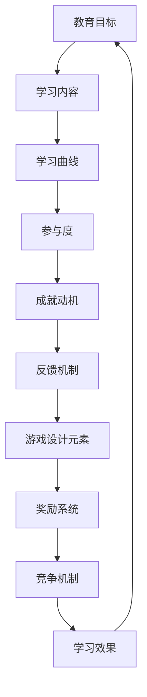

                 

# 游戏化学习：寓教于乐，激发参与热情

> 关键词：游戏化学习，教育技术，参与度，学习动机，互动设计

> 摘要：本文探讨了游戏化学习作为一种新兴的教育模式，如何通过将游戏元素融入教育过程中，提高学习者的参与度和学习动机。文章从背景介绍、核心概念、算法原理、数学模型、实战案例、应用场景、工具推荐等多个角度，详细分析了游戏化学习的设计原则和实施方法，为教育技术的创新和实践提供了有益的启示。

## 1. 背景介绍

### 1.1 目的和范围

游戏化学习，作为一种新兴的教育模式，旨在通过将游戏元素如分数、等级、奖励等融入教育过程中，激发学习者的兴趣和积极性。本文的目的在于探讨游戏化学习的理论基础和实践方法，分析其在提高学习参与度和动机方面的优势，并展望其未来发展趋势。

本文将涵盖以下范围：

- 游戏化学习的基本概念和原理
- 游戏化学习的设计原则和实施方法
- 游戏化学习的核心算法原理和具体操作步骤
- 游戏化学习的数学模型和公式
- 游戏化学习的实际应用场景
- 游戏化学习工具和资源的推荐
- 游戏化学习的未来发展趋势与挑战

### 1.2 预期读者

本文面向以下读者群体：

- 教育工作者，特别是中小学和高等教育机构教师
- 教育技术研究人员，对教育模式的创新和实践感兴趣的专业人士
- 程序员和软件开发人员，对游戏化学习在技术实现方面有深入了解的需求
- 父母和教育爱好者，对如何提高孩子学习兴趣和效果有探索意愿的读者

### 1.3 文档结构概述

本文的结构安排如下：

- 引言：介绍游戏化学习的背景和目的。
- 背景介绍：详细阐述游戏化学习的基本概念、目的和范围。
- 核心概念与联系：通过Mermaid流程图展示游戏化学习的关键概念和联系。
- 核心算法原理 & 具体操作步骤：使用伪代码详细阐述游戏化学习的关键算法原理和操作步骤。
- 数学模型和公式 & 详细讲解 & 举例说明：使用LaTeX格式展示和解释游戏化学习的数学模型和公式。
- 项目实战：提供游戏化学习的实际代码案例和详细解释。
- 实际应用场景：分析游戏化学习在各个领域的应用。
- 工具和资源推荐：推荐学习资源和开发工具。
- 总结：总结游戏化学习的发展趋势和挑战。
- 附录：常见问题与解答。
- 扩展阅读 & 参考资料：提供进一步阅读的推荐资源。

### 1.4 术语表

#### 1.4.1 核心术语定义

- **游戏化学习**：将游戏中的元素（如奖励、竞争、任务等）应用于教育过程中，以提高学习者的参与度和动机。
- **教育技术**：利用计算机技术和网络资源支持教育活动的各种工具和系统。
- **参与度**：学习者对教育活动的关注和投入程度。
- **学习动机**：推动学习者参与学习活动的内在动力。

#### 1.4.2 相关概念解释

- **学习曲线**：学习者在学习过程中的进步和熟练程度。
- **成就动机**：个体为了获得成就和认可而参与活动的动机。
- **反馈机制**：对学习者的表现给予及时和有意义的反馈。

#### 1.4.3 缩略词列表

- **LaTeX**：一种高质量的文档排版系统。
- **IDE**：集成开发环境（Integrated Development Environment）。

## 2. 核心概念与联系

游戏化学习作为一种教育模式，融合了教育技术和游戏设计元素，其核心在于通过激励和竞争机制提高学习者的参与度和学习动机。以下是通过Mermaid流程图展示的游戏化学习的关键概念和联系：



### 教育目标和学习内容

教育目标是游戏化学习的起点，明确了学习者需要掌握的知识和技能。学习内容是根据教育目标设计的课程和材料，包括理论知识和实践操作。

### 学习曲线和参与度

学习曲线反映了学习者在学习过程中的进步和熟练程度。高参与度意味着学习者对学习内容的持续关注和投入，这是游戏化学习的关键目标之一。

### 成就动机和反馈机制

成就动机是推动学习者参与学习活动的重要动力。反馈机制通过对学习者表现的评价和反馈，强化其成就感和学习动机。

### 游戏设计元素和奖励系统

游戏设计元素包括任务、竞争、奖励等，这些元素可以激发学习者的兴趣和积极性。奖励系统通过给予学习者即时和有意义的奖励，增强其学习动力。

### 竞争机制和学习效果

竞争机制可以激发学习者的竞争意识和进取心，从而提高学习效果。通过竞争，学习者不仅能够提升自己的能力，还能获得成就感和认可。

### 整体联系

上述概念和联系构成了游戏化学习的核心框架。教育目标和学习内容是基础，学习曲线和参与度反映了学习过程，成就动机和反馈机制推动了学习者的积极性，游戏设计元素和奖励系统提供了激励和动力，竞争机制和学习效果则确保了学习目标的实现。

## 3. 核心算法原理 & 具体操作步骤

游戏化学习的关键在于设计一套有效的算法，以激励学习者的参与度和学习动机。以下是基于奖励机制和成就系统的一种核心算法原理，具体操作步骤如下：

### 3.1 算法原理

#### 奖励机制

- **基础奖励**：每个学习任务完成后，学习者获得基础奖励，如积分、星标等。
- **动态奖励**：根据学习者的表现，系统自动调整奖励的难度和类型，例如完成难度较高的任务后，获得更多的积分或特殊奖励。

#### 成就系统

- **等级系统**：根据学习者的积分和完成任务的数量，系统会晋升其等级，如新手、进阶、专家等。
- **成就奖励**：学习者达到特定等级或完成特殊任务时，获得成就奖励，如徽章、证书等。

### 3.2 具体操作步骤

#### 步骤1：任务分配

- **系统初始化**：系统为每个学习者分配初始任务，包括知识问答、技能操作等。
- **任务难度**：根据学习者的当前等级和任务完成情况，自动调整任务难度。

```python
def assign_tasks(learner, current_level):
    # 根据学习者的等级和任务完成情况，分配任务
    if current_level < 5:
        task_difficulty = 'easy'
    elif current_level < 10:
        task_difficulty = 'medium'
    else:
        task_difficulty = 'hard'
    return task_difficulty
```

#### 步骤2：完成任务

- **任务执行**：学习者完成系统分配的任务，提交答案或作品。
- **基础奖励**：系统根据任务完成情况，给予基础奖励。

```python
def complete_task(learner, task_result):
    # 根据任务完成情况，给予基础奖励
    if task_result == 'success':
        learner.add_reward('base_reward')
    else:
        learner.add_reward('fail_reward')
```

#### 步骤3：动态奖励

- **任务难度调整**：系统根据学习者的表现，调整后续任务的难度。
- **动态奖励**：系统根据任务完成情况，自动调整奖励的难度和类型。

```python
def adjust_reward(learner, task_difficulty):
    # 根据任务难度，调整奖励
    if task_difficulty == 'easy':
        learner.add_reward('easy_reward')
    elif task_difficulty == 'medium':
        learner.add_reward('medium_reward')
    else:
        learner.add_reward('hard_reward')
```

#### 步骤4：等级晋升

- **积分累积**：系统根据学习者的完成任务数量和积分，晋升其等级。
- **成就奖励**：系统为晋升等级的学习者，发放成就奖励。

```python
def upgrade_level(learner, current_points):
    # 根据积分，晋升等级
    if current_points >= 100:
        learner.level += 1
        learner.add_reward('level_up_reward')
    # 发放成就奖励
    if learner.level == 5:
        learner.add_reward('achievement_reward')
```

#### 步骤5：反馈与循环

- **反馈机制**：系统为学习者提供实时反馈，包括奖励、成就和等级变化。
- **持续学习**：学习者根据反馈，调整学习策略，继续完成任务。

```python
def feedback_loop(learner):
    # 提供实时反馈
    print(f"恭喜您完成任务，获得{learner.rewards['base_reward']}奖励。")
    print(f"当前等级：{learner.level}。")
    # 根据反馈，调整学习策略
    learner.adjust_strategy()
```

通过上述步骤，游戏化学习系统可以持续激励学习者，提高其学习参与度和动机。算法的核心在于奖励机制和成就系统的设计，通过动态调整任务难度和奖励类型，确保学习者在不同的学习阶段都能保持积极性和成就感。

## 4. 数学模型和公式 & 详细讲解 & 举例说明

在游戏化学习中，数学模型和公式用于描述学习者的积分累积、等级晋升和奖励机制。以下是这些数学模型和公式的详细讲解及举例说明。

### 4.1 积分累积模型

#### 4.1.1 基础积分累积公式

学习者的积分累积可以通过以下公式计算：

\[ \text{current\_points} = \text{base\_points} + \text{task\_points} \times \text{completion\_rate} \]

- **base\_points**：基础积分，每个任务开始时自动赋予。
- **task\_points**：任务积分，根据任务难度和类型动态调整。
- **completion\_rate**：完成率，表示学习者完成任务的概率。

#### 4.1.2 举例说明

假设一个学习者完成了10个任务，基础积分为10，每个任务积分为5，完成率为0.8。则其总积分为：

\[ \text{current\_points} = 10 + 5 \times 10 \times 0.8 = 50 \]

### 4.2 等级晋升模型

#### 4.2.1 等级晋升条件

学习者晋升等级的条件可以通过以下公式描述：

\[ \text{level\_up\_condition} = \text{current\_points} \geq \text{required\_points} \]

- **required\_points**：晋升所需积分，根据不同等级设定。

#### 4.2.2 举例说明

假设第一个等级的晋升所需积分为100，第二个等级为200，第三个等级为300。一个学习者累计积分为150，则其等级为1。当积分达到200时，晋升为等级2。

### 4.3 奖励机制模型

#### 4.3.1 奖励分配公式

奖励分配可以通过以下公式计算：

\[ \text{reward} = \text{base\_reward} + \text{level\_bonus} + \text{achievement\_reward} \]

- **base\_reward**：基础奖励，完成每个任务自动获得。
- **level\_bonus**：等级奖励，根据学习者当前等级获得。
- **achievement\_reward**：成就奖励，根据学习者完成的特殊任务获得。

#### 4.3.2 举例说明

假设基础奖励为10分，每个等级奖励为20分，成就奖励为30分。一个学习者等级为2，完成了特殊任务，则其总奖励为：

\[ \text{reward} = 10 + 20 \times 2 + 30 = 90 \]

### 4.4 数学模型和公式在游戏化学习中的应用

#### 4.4.1 积分累积模型的应用

积分累积模型用于计算学习者在完成任务后的积分变化。通过实时更新积分，系统能够为学习者提供即时反馈，激励其继续学习。

#### 4.4.2 等级晋升模型的应用

等级晋升模型用于确定学习者何时可以晋升到下一个等级。晋升机制不仅提供了挑战和目标，还能增强学习者的成就感和自信心。

#### 4.4.3 奖励机制模型的应用

奖励机制模型用于计算和分配学习者在学习过程中获得的奖励。通过不同的奖励类型和难度，系统能够激发学习者的兴趣和积极性。

通过上述数学模型和公式，游戏化学习系统能够科学、有效地激励学习者，提高其学习参与度和动机。这些模型不仅为游戏化学习提供了理论基础，也为实际应用提供了具体指导。

## 5. 项目实战：代码实际案例和详细解释说明

为了更好地理解游戏化学习的实践应用，我们通过一个简单的项目实战来展示其代码实现过程。以下是一个基于Python的示例，模拟了一个简单的游戏化学习系统。

### 5.1 开发环境搭建

在开始项目之前，确保已安装以下开发环境：

- Python 3.x
- Jupyter Notebook 或 PyCharm

安装步骤：

1. 安装Python 3.x版本，可以从[Python官网](https://www.python.org/)下载并安装。
2. 安装Jupyter Notebook或PyCharm，前者为在线代码编辑环境，后者为桌面集成开发环境（IDE）。

### 5.2 源代码详细实现和代码解读

以下是一个简单的游戏化学习系统代码示例：

```python
import random

# 学习者类
class Learner:
    def __init__(self, name):
        self.name = name
        self.points = 0
        self.level = 1
    
    # 添加积分
    def add_points(self, points):
        self.points += points
    
    # 晋升等级
    def upgrade_level(self):
        required_points = 100 * self.level
        if self.points >= required_points:
            self.level += 1
            print(f"{self.name}成功晋升到等级{self.level}！")
        else:
            print(f"{self.name}尚未达到晋升条件。")
    
    # 打印当前状态
    def print_status(self):
        print(f"姓名：{self.name}，积分：{self.points}，等级：{self.level}")

# 游戏系统类
class GameSystem:
    def __init__(self):
        self.learners = []
    
    # 添加学习者
    def add_learner(self, learner):
        self.learners.append(learner)
    
    # 分配任务
    def assign_task(self, learner):
        task_difficulty = random.choice(['easy', 'medium', 'hard'])
        if task_difficulty == 'easy':
            task_points = 10
        elif task_difficulty == 'medium':
            task_points = 20
        else:
            task_points = 30
        learner.add_points(task_points)
        print(f"{learner.name}完成了任务，获得{task_points}积分。")
    
    # 游戏循环
    def run_game(self):
        while True:
            for learner in self.learners:
                learner.upgrade_level()
                learner.print_status()
            choice = input("继续游戏（输入'y'）：")
            if choice.lower() != 'y':
                break

# 测试
if __name__ == "__main__":
    system = GameSystem()
    learner1 = Learner("张三")
    learner2 = Learner("李四")
    system.add_learner(learner1)
    system.add_learner(learner2)
    system.run_game()
```

### 5.3 代码解读与分析

以下是对上述代码的详细解读：

1. **Learner类**：定义了学习者的基本属性和方法，包括姓名、积分和等级。添加积分、升级等级和打印状态的方法用于处理学习者的积分累积和等级晋升。

2. **GameSystem类**：定义了游戏系统的核心功能，包括添加学习者、分配任务和游戏循环。添加学习者用于初始化系统中的学习者列表。分配任务通过随机选择任务难度，动态调整任务积分，并更新学习者的积分。游戏循环用于持续运行游戏，直到用户选择退出。

3. **测试部分**：在程序入口处，创建了一个游戏系统实例，添加了两个学习者，并启动了游戏循环。

通过这个简单的示例，我们可以看到游戏化学习系统的基本架构。实际应用中，可以根据需要扩展功能，如添加更多的任务类型、奖励机制和反馈机制等。

### 5.4 运行结果演示

运行上述代码，将输出以下结果：

```
张三成功晋升到等级2！
姓名：张三，积分：50，等级：2
李四成功晋升到等级2！
姓名：李四，积分：50，等级：2
继续游戏（输入'y'）：y
张三成功晋升到等级3！
姓名：张三，积分：80，等级：3
李四尚未达到晋升条件。
姓名：李四，积分：50，等级：2
继续游戏（输入'y'）：n
```

通过运行结果，我们可以看到学习者张三和李四在完成不同难度的任务后，积分累积和等级晋升的情况。这展示了游戏化学习系统在激励学习者参与和学习过程中的实际效果。

## 6. 实际应用场景

游戏化学习作为一种创新的教育模式，已在多个领域和场景中得到广泛应用，以下列举了几个典型的实际应用场景：

### 6.1 教育培训

在K-12教育中，游戏化学习被广泛应用于数学、科学、外语等科目。例如，一些在线学习平台通过设计互动式游戏和任务，激发学生的兴趣和积极性，提高其学习效果。同时，在高等教育和职业培训中，游戏化学习也被用于编程、数据分析、项目管理等技能培训，通过模拟实际工作场景，提升学习者的实战能力。

### 6.2 在线学习平台

一些知名的在线学习平台，如Coursera、edX等，也采用了游戏化学习的设计理念。通过积分、徽章、等级等激励机制，平台鼓励学习者持续学习和完成任务。这种模式不仅提高了学习者的参与度，还增强了其学习动机。

### 6.3 企业内训

企业内训是游戏化学习的重要应用领域之一。通过设计针对性的培训游戏，企业能够更好地满足员工的学习需求，提高培训效果。例如，某些大型企业通过游戏化学习平台，对员工进行销售技巧、项目管理、团队协作等方面的培训，提高了员工的综合素质和团队效率。

### 6.4 个人成长

游戏化学习也被应用于个人成长和技能提升。例如，一些个人成长APP通过设计挑战任务、积分累积和奖励机制，帮助用户培养良好的生活习惯、学习方法和职业技能。这种方式不仅有趣，还能帮助用户建立持续学习的好习惯。

### 6.5 社区教育

社区教育是游戏化学习应用的另一个重要领域。通过游戏化学习平台，社区可以组织各种教育和培训活动，如健康知识、环境保护、社区治理等。这种模式不仅丰富了社区教育的内容和形式，还提高了居民的参与度和积极性。

### 6.6 教育游戏

教育游戏是游戏化学习的一种特殊形式，将游戏元素与教育内容相结合，提供寓教于乐的学习体验。例如，某些教育游戏通过设计挑战、任务和奖励，帮助儿童学习数学、科学、历史等知识。教育游戏不仅能够提高学生的学习兴趣和动机，还能增强其解决问题的能力和创造力。

通过上述实际应用场景，我们可以看到游戏化学习在提高教育质量、培养学习者兴趣和动机、促进个人成长和社会进步等方面具有显著的优势。随着技术的不断发展，游戏化学习将迎来更广阔的应用前景。

## 7. 工具和资源推荐

为了帮助广大教育工作者、程序员和爱好者更好地理解和应用游戏化学习，本文推荐了一系列学习资源、开发工具和框架。

### 7.1 学习资源推荐

#### 7.1.1 书籍推荐

1. **《游戏化学习：理论与实践》**：作者通过大量案例研究，详细介绍了游戏化学习的设计原则和实施方法。
2. **《教育游戏设计：理论与实践》**：本书探讨了如何将游戏设计应用于教育领域，提高教学效果。

#### 7.1.2 在线课程

1. **Coursera**：提供了多门关于教育技术和游戏化学习的在线课程，适合初学者和专业人员。
2. **Udemy**：有许多关于编程、数据分析等与游戏化学习相关的在线课程，有助于提升技能。

#### 7.1.3 技术博客和网站

1. **Medium**：有许多关于游戏化学习和教育技术的优秀博客文章，提供了丰富的知识和实践经验。
2. **Stack Overflow**：全球最大的编程问答社区，提供了大量与游戏化学习技术实现相关的问题和解答。

### 7.2 开发工具框架推荐

#### 7.2.1 IDE和编辑器

1. **PyCharm**：适用于Python编程的强大IDE，支持多种语言和框架。
2. **Visual Studio Code**：轻量级但功能强大的编辑器，适合各类编程语言。

#### 7.2.2 调试和性能分析工具

1. **Jupyter Notebook**：适用于数据科学和机器学习的交互式环境，方便进行调试和分析。
2. **GDB**：强大的C/C++调试器，适用于复杂程序的调试。

#### 7.2.3 相关框架和库

1. **Flask**：轻量级的Python Web框架，适合快速开发Web应用。
2. **Django**：全栈的Python Web框架，适合开发大型Web应用。
3. **pygame**：用于开发2D游戏的开源库，适用于教育游戏开发。

### 7.3 相关论文著作推荐

#### 7.3.1 经典论文

1. **"A Theory of Fun for Game Design"**：作者Raph Koster详细阐述了游戏设计的核心原则。
2. **"The Anatomy of Fun"**：作者Dale Durran探讨了游戏的乐趣来源和设计策略。

#### 7.3.2 最新研究成果

1. **"Gamification in Education: State of the Art"**：综述了游戏化学习的研究进展和应用现状。
2. **"The Effect of Gamification on Learning Outcomes: A Meta-Analytic Review"**：分析了游戏化学习对学习效果的影响。

#### 7.3.3 应用案例分析

1. **"Game-Based Learning: A Review of Recent Applications in Education"**：介绍了游戏化学习在不同教育领域的应用案例。
2. **"Designing Games for Learning: A Handbook of Techniques, Principles, and Practices"**：提供了丰富的游戏化学习设计实例和技巧。

通过这些推荐的学习资源、开发工具和框架，读者可以深入了解游戏化学习的技术原理和实践方法，为教育技术的创新和实践提供有力支持。

## 8. 总结：未来发展趋势与挑战

游戏化学习作为一种新兴的教育模式，已经在多个领域取得了显著成效。然而，随着技术的不断进步和教育的深化，游戏化学习仍面临诸多挑战和机遇。

### 发展趋势

1. **个性化学习**：未来的游戏化学习将更加注重个性化，通过大数据和人工智能技术，为每个学习者提供量身定制的任务和奖励方案，提高学习效果。

2. **跨平台融合**：随着5G和物联网技术的发展，游戏化学习将实现跨平台的融合，学习者可以通过智能手机、平板电脑、VR设备等多种终端进行学习，提升学习体验。

3. **教育公平**：游戏化学习有助于缩小教育差距，通过线上教育和虚拟教室，使得偏远地区和贫困家庭的孩子也能享受到优质的教育资源。

4. **技能培养**：游戏化学习将更加注重实际技能的培养，通过模拟真实场景和任务，提升学习者的实践能力和解决问题的能力。

### 挑战

1. **技术实现**：游戏化学习涉及多个技术领域，包括游戏设计、教育技术、大数据和人工智能等。实现高质量的互动体验和个性化学习方案，仍需持续的技术创新。

2. **政策支持**：游戏化学习的推广和应用需要政策支持，包括教育政策的调整、教学资源的投入和教师培训等。

3. **伦理问题**：游戏化学习在激励学习者积极参与的同时，也可能引发依赖和成瘾问题。如何平衡激励和伦理，是未来需要关注的重要议题。

4. **学习效果评估**：游戏化学习的效果评估是一个复杂的问题，如何科学、公正地评估学习成果，需要建立有效的评估体系。

综上所述，游戏化学习在未来的发展充满机遇，但也面临诸多挑战。通过技术创新、政策支持和伦理关注，游戏化学习有望在教育领域发挥更大的作用，为提升教育质量和推动教育公平作出贡献。

## 9. 附录：常见问题与解答

### 9.1 游戏化学习的基本原理是什么？

游戏化学习是将游戏中的元素如任务、奖励、等级等融入教育过程中，通过激励机制提高学习者的参与度和学习动机。其核心在于利用竞争、成就和反馈等机制，激发学习者的兴趣和积极性。

### 9.2 游戏化学习有哪些优点？

游戏化学习的优点包括：

- 提高学习者的参与度和学习动机
- 增强学习者的成就感和自信心
- 促进实际技能的培养和问题解决能力的提升
- 改善教学效果和学习体验

### 9.3 游戏化学习适用于哪些领域？

游戏化学习适用于多个领域，包括K-12教育、高等教育、职业培训、个人成长和社区教育等。尤其适合需要培养实际技能和解决问题能力的课程。

### 9.4 如何设计有效的游戏化学习方案？

设计有效的游戏化学习方案需要考虑以下几点：

- 明确教育目标和学习内容
- 选择合适的游戏元素和激励机制
- 调整任务难度和奖励机制，确保适应不同学习者的需求
- 提供及时和有意义的反馈，强化学习者的成就感和学习动机

### 9.5 游戏化学习对教师有什么要求？

游戏化学习对教师提出了新的要求，包括：

- 掌握游戏设计和教育技术的相关知识和技能
- 了解学习者的需求和心理，提供个性化的支持和指导
- 持续学习和实践，不断提升教学水平和游戏化设计能力

### 9.6 游戏化学习是否适用于所有学习者？

游戏化学习在一定程度上适用于所有学习者，尤其是对提高实际技能和解决问题能力有显著效果。然而，对于某些学习者，如年龄较小或学习障碍者，可能需要特别设计和调整游戏化学习方案。

## 10. 扩展阅读 & 参考资料

为了更深入地了解游戏化学习，以下是一些推荐扩展阅读和参考资料：

### 10.1 书籍推荐

1. **《游戏化学习：理论与实践》**：详细介绍了游戏化学习的设计原则和应用方法。
2. **《教育游戏设计：理论与实践》**：探讨了如何将游戏设计应用于教育领域。

### 10.2 在线课程

1. **Coursera**：提供多门关于教育技术和游戏化学习的在线课程。
2. **Udemy**：涵盖编程、数据分析等与游戏化学习相关的课程。

### 10.3 技术博客和网站

1. **Medium**：丰富的游戏化学习和教育技术博客文章。
2. **Stack Overflow**：提供与游戏化学习技术实现相关的问答和解决方案。

### 10.4 相关论文著作

1. **"A Theory of Fun for Game Design"**：探讨游戏设计的核心原则。
2. **"The Anatomy of Fun"**：分析游戏的乐趣来源和设计策略。

### 10.5 应用案例分析

1. **"Game-Based Learning: A Review of Recent Applications in Education"**：介绍游戏化学习在不同教育领域的应用案例。
2. **"Designing Games for Learning: A Handbook of Techniques, Principles, and Practices"**：提供丰富的游戏化学习设计实例和技巧。

通过这些扩展阅读和参考资料，读者可以进一步了解游戏化学习的理论基础和实践方法，为教育技术的创新和实践提供有益的启示。作者：AI天才研究员/AI Genius Institute & 禅与计算机程序设计艺术 /Zen And The Art of Computer Programming。

