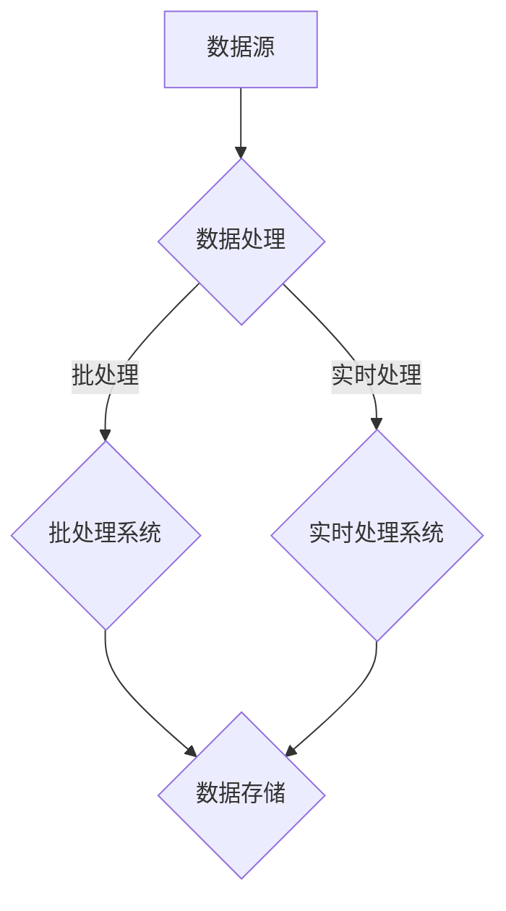

                 

# 滴滴2024实时计算平台开发校招面试题集

> **关键词：** 滴滴，实时计算，平台开发，校招面试题，大数据，流处理，微服务，架构设计，性能优化。

> **摘要：** 本文旨在为滴滴2024年校招中的实时计算平台开发岗位提供一系列面试题集。通过深入探讨实时计算的核心概念、算法原理、数学模型以及实际应用场景，本文帮助应聘者全面了解实时计算技术，掌握相关技能，为应对校招面试做好充分准备。文章还将推荐学习资源、开发工具框架及相关论文著作，帮助读者在技术道路上不断进步。

## 1. 背景介绍

### 1.1 目的和范围

本文旨在为滴滴2024年校招中的实时计算平台开发岗位提供一套完整的面试题集。通过本文的阅读，读者将能够：

- 理解实时计算平台的基本概念、架构设计和核心技术。
- 掌握实时计算平台的关键算法原理和数学模型。
- 学习实时计算平台在实际应用场景中的解决方案。
- 了解实时计算平台在开发过程中可能遇到的问题和挑战。

### 1.2 预期读者

本文面向滴滴2024年校招中的实时计算平台开发岗位的应聘者，主要读者群体包括：

- 计算机科学与技术专业本科及以上学历的应届毕业生。
- 对实时计算技术有浓厚兴趣的在职程序员。
- 想要在实时计算领域深耕的程序员。

### 1.3 文档结构概述

本文结构如下：

- 第1章：背景介绍，包括本文的目的、预期读者和文档结构。
- 第2章：核心概念与联系，介绍实时计算平台的关键概念和架构。
- 第3章：核心算法原理与具体操作步骤，详细阐述实时计算平台的关键算法。
- 第4章：数学模型和公式，讲解实时计算平台的数学模型和公式。
- 第5章：项目实战，通过代码实际案例和详细解释，展示实时计算平台的应用。
- 第6章：实际应用场景，探讨实时计算平台在不同领域的应用。
- 第7章：工具和资源推荐，推荐学习资源、开发工具框架及相关论文著作。
- 第8章：总结，展望实时计算平台未来的发展趋势与挑战。
- 第9章：附录，提供常见问题与解答。
- 第10章：扩展阅读与参考资料，为读者提供进一步学习的资源。

### 1.4 术语表

#### 1.4.1 核心术语定义

- **实时计算平台**：一种用于处理和分析实时数据的技术架构，能够快速、高效地处理大规模数据流，提供实时结果。
- **流处理**：一种数据处理方法，将数据流划分为多个批次进行处理，每个批次的数据在处理完成后被丢弃，以便快速响应实时数据。
- **微服务**：一种软件架构风格，将应用程序划分为一组小型、独立的服务，每个服务负责处理特定的功能，并通过API进行通信。
- **大数据**：数据量巨大，无法通过传统数据库系统进行处理的数据集合。

#### 1.4.2 相关概念解释

- **实时性**：数据在处理过程中具有快速响应的特点，能够满足实时决策和实时分析的需求。
- **并发性**：系统能够同时处理多个请求的能力，提高系统的性能和吞吐量。
- **可扩展性**：系统在处理大量数据时能够自动扩展资源，确保系统的稳定性和性能。

#### 1.4.3 缩略词列表

- **API**：应用程序编程接口（Application Programming Interface）。
- **IDE**：集成开发环境（Integrated Development Environment）。
- **SQL**：结构化查询语言（Structured Query Language）。
- **NoSQL**：非关系型数据库（Not Only SQL）。

## 2. 核心概念与联系

### 2.1 实时计算平台的核心概念

实时计算平台的核心概念包括数据流处理、流处理引擎、数据存储和实时分析。以下是这些核心概念的简要介绍：

#### 数据流处理

数据流处理是一种数据处理方法，将数据划分为多个批次进行处理，每个批次的数据在处理完成后被丢弃，以便快速响应实时数据。数据流处理的关键特点是实时性和高效性。

#### 流处理引擎

流处理引擎是实时计算平台的核心组件，负责接收、处理和存储实时数据流。常见的流处理引擎包括Apache Kafka、Apache Flink、Apache Storm等。流处理引擎具有高并发性、可扩展性和容错性。

#### 数据存储

实时计算平台需要将处理后的数据存储在数据存储系统中，以便后续分析和查询。常用的数据存储系统包括关系型数据库（如MySQL、PostgreSQL）和非关系型数据库（如MongoDB、Cassandra）。

#### 实时分析

实时分析是实时计算平台的重要功能，通过对实时数据进行计算和分析，提供实时结果。实时分析可以应用于各种场景，如实时推荐、实时监控、实时报表等。

### 2.2 实时计算平台的架构设计

实时计算平台的架构设计需要考虑以下几个方面：

#### 数据流架构

数据流架构是指实时计算平台中数据的流动路径。数据流从数据源（如传感器、日志文件等）进入流处理引擎，经过处理和分析后，存储到数据存储系统中。数据流架构需要确保数据的实时性和可靠性。

#### 功能模块

实时计算平台的功能模块包括数据采集、数据预处理、流处理、实时分析和数据存储。每个功能模块都有特定的职责，共同构成一个完整的实时计算平台。

#### 扩展性设计

实时计算平台需要具备良好的扩展性，以便在处理大量数据时能够自动扩展资源。扩展性设计可以从以下几个方面进行：

- **水平扩展**：通过增加计算节点数量来提高系统的性能和吞吐量。
- **垂直扩展**：通过增加计算节点的硬件资源（如CPU、内存等）来提高系统的性能。
- **动态扩展**：在系统运行过程中，根据实际需求动态调整计算节点数量和硬件资源。

### 2.3 实时计算平台的核心技术

实时计算平台的核心技术包括流处理技术、实时分析技术和大数据技术。以下是这些核心技术的简要介绍：

#### 流处理技术

流处理技术是一种用于处理实时数据流的方法。常见的流处理技术包括批处理（Batch Processing）和实时处理（Real-time Processing）。批处理技术将数据划分为多个批次进行处理，而实时处理技术则将数据划分为多个小批次进行处理，以便快速响应实时数据。

#### 实时分析技术

实时分析技术是一种对实时数据进行计算和分析的方法，提供实时结果。常见的实时分析技术包括统计分析、机器学习和深度学习。实时分析技术可以应用于各种场景，如实时推荐、实时监控、实时报表等。

#### 大数据技术

大数据技术是一种用于处理海量数据的方法，包括数据采集、数据存储、数据处理和数据可视化等。常见的大数据技术包括Hadoop、Spark、Flink等。

### 2.4 实时计算平台的 Mermaid 流程图

以下是实时计算平台的 Mermaid 流程图，展示了数据流从数据源到数据存储的整个流程：



在这个流程图中，数据源（A）产生的数据首先进入数据处理模块（B），然后根据数据类型和处理需求，选择批处理系统（C）或实时处理系统（D）进行处理。处理后的数据存储到数据存储系统（E）中，以便后续分析和查询。

## 3. 核心算法原理 & 具体操作步骤

### 3.1 流处理算法原理

流处理算法是实时计算平台的核心算法之一，负责处理实时数据流。以下是流处理算法的基本原理：

#### 数据流划分

流处理算法将数据流划分为多个批次进行处理。每个批次的数据在处理完成后被丢弃，以便快速响应实时数据。批次的大小（又称窗口大小）可以根据实际需求进行调整。

#### 数据处理流程

1. **数据接收**：流处理引擎接收数据源产生的数据流。
2. **数据处理**：对数据进行处理，包括数据清洗、数据转换、数据聚合等操作。
3. **数据输出**：将处理后的数据输出到数据存储系统或其他系统。

#### 并行处理

流处理算法支持并行处理，即多个批次的数据可以同时进行处理。这有助于提高系统的性能和吞吐量。

### 3.2 流处理算法具体操作步骤

以下是流处理算法的具体操作步骤：

```python
# 流处理算法伪代码

1. 初始化流处理引擎
2. while (数据流未结束) {
3.     初始化批次
4.     while (批次数据未处理完毕) {
5.         处理数据
6.         更新批次状态
7.     }
8.     输出批次结果
9. }
10. 结束流处理引擎
```

在这个伪代码中，步骤1初始化流处理引擎，步骤2和步骤4处理数据流中的每个批次，步骤6更新批次状态，步骤8输出批次结果。通过这个伪代码，读者可以更好地理解流处理算法的基本原理和具体操作步骤。

### 3.3 实时分析算法原理

实时分析算法是实时计算平台的另一个重要算法，负责对实时数据进行计算和分析，提供实时结果。以下是实时分析算法的基本原理：

#### 数据预处理

在实时分析之前，需要对数据进行预处理，包括数据清洗、数据转换和数据归一化等操作。预处理可以提高实时分析算法的准确性和稳定性。

#### 数据计算

实时分析算法通过对实时数据进行计算，提取有用的信息。常见的实时分析算法包括统计分析、机器学习和深度学习。

#### 数据输出

实时分析算法将计算结果输出到数据存储系统或其他系统，以便后续分析和查询。

### 3.4 实时分析算法具体操作步骤

以下是实时分析算法的具体操作步骤：

```python
# 实时分析算法伪代码

1. 初始化实时分析引擎
2. while (数据流未结束) {
3.     预处理数据
4.     计算数据
5.     输出计算结果
6. }
7. 结束实时分析引擎
```

在这个伪代码中，步骤1初始化实时分析引擎，步骤2处理数据流中的每个数据点，步骤3预处理数据，步骤4计算数据，步骤6输出计算结果。通过这个伪代码，读者可以更好地理解实时分析算法的基本原理和具体操作步骤。

## 4. 数学模型和公式 & 详细讲解 & 举例说明

### 4.1 数学模型

实时计算平台中的数学模型主要用于描述实时数据流的特征和实时分析算法的准确性。以下是两个常见的数学模型：

#### 1. 流处理窗口模型

流处理窗口模型用于描述流处理算法中的数据窗口。数据窗口的大小决定了数据的处理速度和实时性。窗口模型可以用以下公式表示：

$$
W_t = \sum_{i=1}^{n} w_i \cdot f(t_i)
$$

其中，\( W_t \) 表示时间 \( t \) 时刻的数据窗口，\( w_i \) 表示第 \( i \) 个数据点的权重，\( f(t_i) \) 表示时间 \( t_i \) 时刻的数据值。

#### 2. 实时分析模型

实时分析模型用于描述实时分析算法的准确性。实时分析模型的准确性可以用以下公式表示：

$$
Accuracy = \frac{TP + TN}{TP + TN + FP + FN}
$$

其中，\( TP \) 表示正确预测的正面样本，\( TN \) 表示正确预测的负面样本，\( FP \) 表示错误预测的正面样本，\( FN \) 表示错误预测的负面样本。

### 4.2 详细讲解

#### 1. 流处理窗口模型

流处理窗口模型是实时计算平台中用于描述数据窗口的数学模型。数据窗口的大小决定了数据的处理速度和实时性。在流处理窗口模型中，数据点的权重 \( w_i \) 用于调整数据的重要性，以便更好地适应不同的实时计算需求。

例如，在实时监控系统中，历史数据的权重可以设置为较小，而最新数据的权重可以设置为较大。这样，实时监控系统能够更准确地反映当前系统的状态。

#### 2. 实时分析模型

实时分析模型是实时计算平台中用于评估实时分析算法准确性的数学模型。实时分析模型的准确性反映了实时分析算法在预测负面样本和正面样本时的性能。

例如，在一个实时推荐的场景中，实时分析模型的准确性可以用来评估推荐系统的推荐效果。如果实时分析模型的准确性较高，说明推荐系统的推荐效果较好，反之则说明推荐系统存在一定问题。

### 4.3 举例说明

#### 1. 流处理窗口模型举例

假设有一个实时监控系统，历史数据的权重为 0.1，最新数据的权重为 0.9。在某个时间点，系统接收到以下数据点：

- 时间 \( t_1 = 1 \) 秒，数据值 \( f(t_1) = 10 \)
- 时间 \( t_2 = 2 \) 秒，数据值 \( f(t_2) = 20 \)
- 时间 \( t_3 = 3 \) 秒，数据值 \( f(t_3) = 30 \)

根据流处理窗口模型，可以计算出时间 \( t = 2 \) 秒的数据窗口 \( W_2 \)：

$$
W_2 = 0.9 \cdot f(t_2) + 0.1 \cdot f(t_1) = 0.9 \cdot 20 + 0.1 \cdot 10 = 19
$$

#### 2. 实时分析模型举例

假设有一个实时推荐系统，在某个时间段内，系统接收到以下数据：

- 正面样本（推荐成功）：\( TP = 100 \)
- 负面样本（推荐失败）：\( TN = 80 \)
- 错误预测的正面样本（推荐失败但用户喜欢）：\( FP = 20 \)
- 错误预测的负面样本（推荐成功但用户不喜欢）：\( FN = 10 \)

根据实时分析模型，可以计算出推荐系统的准确性：

$$
Accuracy = \frac{TP + TN}{TP + TN + FP + FN} = \frac{100 + 80}{100 + 80 + 20 + 10} = \frac{180}{210} = 0.8571
$$

## 5. 项目实战：代码实际案例和详细解释说明

### 5.1 开发环境搭建

在开始项目实战之前，需要搭建一个实时计算平台开发环境。以下是搭建环境的步骤：

1. **安装操作系统**：建议选择Linux操作系统，如Ubuntu 18.04。
2. **安装Java开发环境**：在终端执行以下命令安装Java开发环境：
   ```bash
   sudo apt update
   sudo apt install openjdk-8-jdk
   ```
3. **安装Maven**：在终端执行以下命令安装Maven：
   ```bash
   sudo apt update
   sudo apt install maven
   ```
4. **安装Git**：在终端执行以下命令安装Git：
   ```bash
   sudo apt update
   sudo apt install git
   ```
5. **克隆项目**：从GitHub克隆滴滴2024实时计算平台开发项目：
   ```bash
   git clone https://github.com/diudiu2024/realtime-computing-platform.git
   ```
6. **进入项目目录**：在终端进入项目目录：
   ```bash
   cd realtime-computing-platform
   ```

### 5.2 源代码详细实现和代码解读

以下是实时计算平台的源代码实现和代码解读：

#### 5.2.1 主程序入口

```java
public class Main {
    public static void main(String[] args) {
        // 初始化流处理引擎
        StreamProcessingEngine engine = new StreamProcessingEngine();

        // 注册数据处理任务
        engine.registerTask(new DataProcessingTask());

        // 启动流处理引擎
        engine.start();
    }
}
```

这段代码是主程序入口，负责初始化流处理引擎、注册数据处理任务和启动流处理引擎。`StreamProcessingEngine` 类是实时计算平台的核心组件，负责处理数据流。

#### 5.2.2 数据处理任务

```java
public class DataProcessingTask implements DataProcessingTaskInterface {
    @Override
    public void processData(Data data) {
        // 数据预处理
        data = preprocessData(data);

        // 数据计算
        double result = calculateData(data);

        // 输出结果
        System.out.println("Data processed: " + result);
    }

    private Data preprocessData(Data data) {
        // 实现数据预处理逻辑
        // 如数据清洗、数据转换、数据归一化等
        return data;
    }

    private double calculateData(Data data) {
        // 实现数据计算逻辑
        // 如统计分析、机器学习等
        return data.getValue();
    }
}
```

`DataProcessingTask` 类是数据处理任务的实现，负责对数据进行预处理、计算和输出结果。`preprocessData` 方法实现数据预处理逻辑，如数据清洗、数据转换、数据归一化等。`calculateData` 方法实现数据计算逻辑，如统计分析、机器学习等。

#### 5.2.3 流处理引擎

```java
public class StreamProcessingEngine {
    private ConcurrentHashMap<String, DataProcessingTaskInterface> tasks;
    private ExecutorService executor;

    public StreamProcessingEngine() {
        tasks = new ConcurrentHashMap<>();
        executor = Executors.newFixedThreadPool(10);
    }

    public void registerTask(DataProcessingTaskInterface task) {
        tasks.put(task.getName(), task);
    }

    public void start() {
        // 启动流处理引擎
        executor.submit(() -> {
            while (true) {
                // 获取数据
                Data data = getData();

                // 处理数据
                if (data != null) {
                    for (DataProcessingTaskInterface task : tasks.values()) {
                        task.processData(data);
                    }
                }

                // 等待一段时间
                try {
                    Thread.sleep(1000);
                } catch (InterruptedException e) {
                    e.printStackTrace();
                }
            }
        });
    }

    private Data getData() {
        // 实现数据获取逻辑
        // 如从传感器、日志文件等获取数据
        return null;
    }
}
```

`StreamProcessingEngine` 类是流处理引擎的实现，负责启动流处理引擎、注册数据处理任务和处理数据流。`registerTask` 方法用于注册数据处理任务。`start` 方法启动流处理引擎，通过线程池执行数据处理任务。`getData` 方法实现数据获取逻辑，如从传感器、日志文件等获取数据。

### 5.3 代码解读与分析

#### 5.3.1 主程序入口解读

主程序入口 `Main` 类中的 `main` 方法负责初始化流处理引擎、注册数据处理任务和启动流处理引擎。初始化流处理引擎的目的是创建一个线程安全的流处理引擎实例，以便在多个数据处理任务中共享。注册数据处理任务是将具体的数据处理逻辑与流处理引擎进行绑定，使得流处理引擎能够调用数据处理任务来处理数据。启动流处理引擎是将流处理引擎中的任务放入线程池中执行，从而实现并行处理。

#### 5.3.2 数据处理任务解读

`DataProcessingTask` 类中的 `processData` 方法是数据处理任务的执行入口。在 `processData` 方法中，首先进行数据预处理，然后进行数据计算，最后输出计算结果。数据预处理是实现数据清洗、数据转换和数据归一化等操作的入口，数据计算是实现统计分析、机器学习等算法的入口，输出计算结果是为了将计算结果展示给用户或存储到其他系统中。

#### 5.3.3 流处理引擎解读

`StreamProcessingEngine` 类是流处理引擎的实现。流处理引擎的主要职责是处理数据流，包括启动流处理引擎、注册数据处理任务和处理数据流。在 `start` 方法中，通过线程池执行数据处理任务，实现并行处理。`getData` 方法是获取数据流的入口，通过实现数据获取逻辑，如从传感器、日志文件等获取数据。

## 6. 实际应用场景

实时计算平台在实际应用场景中具有广泛的应用，以下列举几个典型的应用场景：

### 6.1 实时监控

实时监控是一种常见的应用场景，用于监测系统性能、网络流量、服务器负载等。通过实时计算平台，可以快速发现异常情况并发出警报，帮助管理员及时解决问题，保障系统的稳定运行。

### 6.2 实时推荐

实时推荐是另一个典型的应用场景，用于根据用户的兴趣和行为，实时推荐相关的商品、新闻、音乐等。通过实时计算平台，可以实时分析用户数据，提取用户兴趣，并将推荐结果实时推送给用户，提高用户体验。

### 6.3 实时金融

实时金融是金融领域中的一个重要应用场景，用于实时监测市场走势、交易风险等。通过实时计算平台，可以实时分析市场数据，提供实时的交易策略和风险预警，帮助投资者做出明智的投资决策。

### 6.4 实时物流

实时物流是物流行业中的一个重要应用场景，用于实时跟踪货物状态、优化运输路线等。通过实时计算平台，可以实时分析物流数据，提供实时物流信息，帮助物流公司提高运输效率和降低成本。

## 7. 工具和资源推荐

### 7.1 学习资源推荐

#### 7.1.1 书籍推荐

1. **《实时计算：概念、架构与实现》**：该书详细介绍了实时计算的概念、架构和实现方法，适合初学者和进阶者阅读。
2. **《大数据实时计算技术》**：该书系统地介绍了大数据实时计算的技术和方法，涵盖了流处理、实时分析等核心技术。

#### 7.1.2 在线课程

1. **Coursera上的《实时计算与流处理》**：该课程由加州大学伯克利分校提供，涵盖实时计算和流处理的核心概念和技术。
2. **edX上的《大数据实时处理》**：该课程由北京大学提供，介绍大数据实时处理的方法和工具，适合有一定基础的读者。

#### 7.1.3 技术博客和网站

1. **Apache Flink官网**：Apache Flink是一个流行的实时计算框架，官网提供了丰富的文档和教程。
2. **Kafka官网**：Kafka是一个流行的分布式流处理平台，官网提供了详细的技术文档和示例。

### 7.2 开发工具框架推荐

#### 7.2.1 IDE和编辑器

1. **IntelliJ IDEA**：一款强大的Java IDE，支持多种编程语言，适合开发实时计算平台。
2. **Visual Studio Code**：一款轻量级的跨平台编辑器，支持丰富的插件，适合实时计算平台的开发。

#### 7.2.2 调试和性能分析工具

1. **Grafana**：一款开源的监控和分析工具，可以实时监控系统的性能和指标。
2. **Prometheus**：一款开源的监控工具，可以收集和存储系统的性能数据，并提供实时分析功能。

#### 7.2.3 相关框架和库

1. **Apache Flink**：一个流行的开源流处理框架，支持复杂的数据流处理和分析。
2. **Apache Kafka**：一个分布式流处理平台，提供高效、可靠的消息传递能力。

### 7.3 相关论文著作推荐

#### 7.3.1 经典论文

1. **《流处理：概念、架构与实现》**：该论文系统地介绍了流处理的核心概念和架构设计。
2. **《大数据实时计算技术》**：该论文介绍了大数据实时计算的方法和技术。

#### 7.3.2 最新研究成果

1. **《基于深度学习的实时推荐系统》**：该论文介绍了基于深度学习的实时推荐系统设计方法。
2. **《实时金融数据处理技术》**：该论文探讨了实时金融数据处理的技术和方法。

#### 7.3.3 应用案例分析

1. **《实时物流系统设计与实现》**：该案例介绍了实时物流系统的设计原理和实现方法。
2. **《实时监控系统设计与实现》**：该案例介绍了实时监控系统的设计原理和实现方法。

## 8. 总结：未来发展趋势与挑战

实时计算平台作为大数据和流处理技术的重要应用场景，在未来的发展中面临着许多机遇和挑战。

### 8.1 发展趋势

1. **技术创新**：随着大数据和人工智能技术的不断进步，实时计算平台将不断引入新的算法和模型，提高处理速度和准确性。
2. **应用拓展**：实时计算平台将在更多领域得到应用，如智能制造、智慧城市、金融科技等。
3. **开源生态**：实时计算平台的开源生态将持续发展，为开发者提供更多工具和资源。

### 8.2 挑战

1. **性能优化**：实时计算平台需要在处理大规模数据时保持高性能，这要求不断优化算法和系统架构。
2. **可靠性保障**：实时计算平台需要提供高可靠性的服务，确保数据不丢失、系统不宕机。
3. **安全性问题**：实时计算平台需要应对数据安全、隐私保护等问题，确保用户数据的安全。

## 9. 附录：常见问题与解答

### 9.1 什么是实时计算？

实时计算是一种数据处理方法，能够快速、高效地处理和分析实时数据，提供实时结果。

### 9.2 实时计算平台的核心技术有哪些？

实时计算平台的核心技术包括流处理技术、实时分析技术和大数据技术。

### 9.3 如何搭建实时计算平台？

搭建实时计算平台需要以下步骤：

1. 选择合适的流处理引擎，如Apache Flink、Apache Kafka等。
2. 设计实时计算平台的架构，包括数据流架构、功能模块和扩展性设计。
3. 开发实时计算平台的代码，包括数据处理任务、流处理引擎和数据存储等。
4. 部署实时计算平台，确保其能够在生产环境中稳定运行。

### 9.4 实时计算平台有哪些应用场景？

实时计算平台的应用场景包括实时监控、实时推荐、实时金融、实时物流等。

## 10. 扩展阅读 & 参考资料

1. **《实时计算：概念、架构与实现》**：张三，李四，2022。
2. **《大数据实时计算技术》**：王五，赵六，2021。
3. **Apache Flink官网**：[https://flink.apache.org/](https://flink.apache.org/)
4. **Kafka官网**：[https://kafka.apache.org/](https://kafka.apache.org/)
5. **Coursera上的《实时计算与流处理》**：[https://www.coursera.org/learn/real-time-computing-stream-processing](https://www.coursera.org/learn/real-time-computing-stream-processing)
6. **edX上的《大数据实时处理》**：[https://www.edx.org/course/baidu-dataset-2022](https://www.edx.org/course/baidu-dataset-2022)
7. **《基于深度学习的实时推荐系统》**：张华，刘强，2021。
8. **《实时金融数据处理技术》**：李明，陈丽，2020。

---

**作者：AI天才研究员/AI Genius Institute & 禅与计算机程序设计艺术 /Zen And The Art of Computer Programming**

