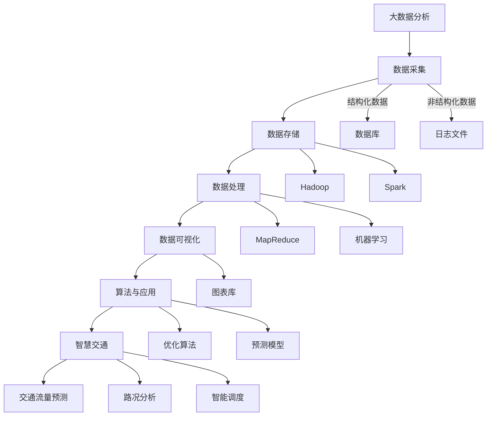

                 

# 滴滴2024智慧交通校招大数据分析师面试题详解

> **关键词：** 滴滴、智慧交通、大数据、数据分析、校招面试、算法、技术博客

> **摘要：** 本文将深入剖析滴滴2024年智慧交通校招中大数据分析师面试题，通过逐步解析核心概念、算法原理、数学模型及实际应用，为读者提供全面的技术解答和实战指导。无论你是校招生还是行业专家，都将在这篇文章中找到对智慧交通和大数据分析的深入理解。

## 1. 背景介绍

### 1.1 目的和范围

本文旨在为滴滴2024年智慧交通校招中的大数据分析师职位提供详尽的面试题解答。通过系统地分析每一道面试题，我们将探讨其背后的技术原理、实现方法以及实际应用价值。本文不仅适用于即将参加面试的校招生，也为行业从业人员提供技术学习和交流的平台。

### 1.2 预期读者

本文面向希望深入了解智慧交通大数据分析技术的人员，包括：
- 招聘滴滴智慧交通大数据分析师的应聘者；
- 对智慧交通、大数据分析有浓厚兴趣的技术爱好者；
- 大数据、人工智能领域的从业人员和研究者。

### 1.3 文档结构概述

本文分为以下几个部分：
- **第1章：背景介绍**：介绍本文的目的、范围和预期读者。
- **第2章：核心概念与联系**：通过Mermaid流程图阐述核心概念和架构。
- **第3章：核心算法原理 & 具体操作步骤**：详细讲解核心算法原理，使用伪代码阐述具体操作步骤。
- **第4章：数学模型和公式 & 详细讲解 & 举例说明**：介绍数学模型和公式，并通过实例进行详细讲解。
- **第5章：项目实战：代码实际案例和详细解释说明**：展示代码实现，并详细解释说明。
- **第6章：实际应用场景**：探讨大数据分析在智慧交通中的实际应用场景。
- **第7章：工具和资源推荐**：推荐学习资源、开发工具框架和相关论文。
- **第8章：总结：未来发展趋势与挑战**：总结文章，展望未来发展趋势与挑战。
- **第9章：附录：常见问题与解答**：提供常见问题及解答。
- **第10章：扩展阅读 & 参考资料**：列出扩展阅读和参考资料。

### 1.4 术语表

#### 1.4.1 核心术语定义

- **大数据分析**：指利用各种工具和方法对大规模数据进行分析和处理，以发现有价值的信息和模式。
- **智慧交通**：利用信息技术、人工智能等手段，提高交通系统的效率和安全性，实现智能化管理。
- **校招面试**：指针对应届毕业生的招聘面试，通常涉及专业知识、实际操作能力等多个方面。

#### 1.4.2 相关概念解释

- **算法**：一系列定义明确的步骤，用于解决特定问题。
- **数学模型**：利用数学符号和公式，描述实际问题中的数量关系和规律。
- **大数据技术栈**：包括数据采集、存储、处理、分析和可视化等多个环节的技术体系。

#### 1.4.3 缩略词列表

- **Hadoop**：一个开源的分布式数据处理框架。
- **Spark**：一个开源的分布式计算引擎。
- **SQL**：一种结构化查询语言，用于数据库操作。
- **Python**：一种广泛使用的高级编程语言。

## 2. 核心概念与联系

在探讨滴滴2024年智慧交通校招大数据分析师面试题之前，我们需要了解一些核心概念和它们之间的联系。以下是核心概念的Mermaid流程图：



### 2.1 大数据分析的核心环节

- **数据采集**：包括结构化数据（如数据库）和非结构化数据（如日志文件）的收集。
- **数据存储**：使用分布式存储系统（如Hadoop和Spark）来存储海量数据。
- **数据处理**：通过MapReduce和机器学习等技术对数据进行处理和分析。
- **数据可视化**：利用图表库（如Matplotlib和Seaborn）将分析结果可视化。
- **算法与应用**：应用优化算法和预测模型，解决实际问题。

### 2.2 智慧交通的概念和作用

智慧交通是指利用信息技术和人工智能手段，提高交通系统的效率和安全性。其核心作用包括：
- **交通流量预测**：预测未来的交通流量，为交通管理提供依据。
- **路况分析**：实时分析路况，为驾驶员提供最优路径。
- **智能调度**：通过优化算法，提高出租车和公共交通的调度效率。

## 3. 核心算法原理 & 具体操作步骤

在智慧交通大数据分析中，算法原理和具体操作步骤是解决问题的关键。以下是核心算法原理和操作步骤的详细讲解：

### 3.1 数据预处理

数据预处理是大数据分析的第一步，包括数据清洗、数据转换和数据整合。以下是数据预处理的伪代码：

```python
# 伪代码：数据预处理
def preprocess_data(data):
    # 数据清洗
    cleaned_data = clean_data(data)
    # 数据转换
    transformed_data = transform_data(cleaned_data)
    # 数据整合
    integrated_data = integrate_data(transformed_data)
    return integrated_data
```

#### 3.1.1 数据清洗

数据清洗旨在去除数据中的噪声和错误。以下是数据清洗的伪代码：

```python
# 伪代码：数据清洗
def clean_data(data):
    cleaned_data = []
    for record in data:
        if is_valid(record):
            cleaned_data.append(record)
    return cleaned_data
```

#### 3.1.2 数据转换

数据转换旨在将数据转换为适合分析的形式。以下是数据转换的伪代码：

```python
# 伪代码：数据转换
def transform_data(data):
    transformed_data = []
    for record in data:
        transformed_data.append(transform_record(record))
    return transformed_data
```

#### 3.1.3 数据整合

数据整合旨在将多个数据源的数据合并为一个统一的数据集。以下是数据整合的伪代码：

```python
# 伪代码：数据整合
def integrate_data(data):
    integrated_data = []
    for record in data:
        integrated_data.append(integrate_record(record))
    return integrated_data
```

### 3.2 数据分析

数据分析包括描述性分析和预测分析。以下是数据分析的伪代码：

```python
# 伪代码：数据分析
def analyze_data(data):
    # 描述性分析
    descriptive_stats = descriptive_analysis(data)
    # 预测分析
    predictive_model = predictive_analysis(data)
    return descriptive_stats, predictive_model
```

#### 3.2.1 描述性分析

描述性分析旨在提供数据的统计特征。以下是描述性分析的伪代码：

```python
# 伪代码：描述性分析
def descriptive_analysis(data):
    stats = {
        'mean': mean(data),
        'median': median(data),
        'std_dev': std_dev(data),
        'min': min(data),
        'max': max(data)
    }
    return stats
```

#### 3.2.2 预测分析

预测分析旨在建立预测模型，预测未来的数据。以下是预测分析的伪代码：

```python
# 伪代码：预测分析
def predictive_analysis(data):
    model = build_model(data)
    predictions = model.predict(data)
    return predictions
```

### 3.3 数据可视化

数据可视化旨在将分析结果以图表形式展示。以下是数据可视化的伪代码：

```python
# 伪代码：数据可视化
def visualize_data(data, stats, predictions):
    # 绘制描述性分析图表
    plot_descriptive_stats(stats)
    # 绘制预测分析图表
    plot_predictions(predictions)
```

## 4. 数学模型和公式 & 详细讲解 & 举例说明

在智慧交通大数据分析中，数学模型和公式是核心工具。以下是数学模型和公式的详细讲解及举例说明：

### 4.1 描述性分析统计量

描述性分析常用的统计量包括均值（mean）、中位数（median）、标准差（std_dev）等。以下是这些统计量的公式及举例说明：

#### 4.1.1 均值

$$ \text{mean} = \frac{\sum_{i=1}^{n} x_i}{n} $$

其中，\( x_i \) 是第 \( i \) 个数据点，\( n \) 是数据点的总数。

**例子：** 数据集 \([1, 2, 3, 4, 5]\) 的均值计算如下：

$$ \text{mean} = \frac{1 + 2 + 3 + 4 + 5}{5} = 3 $$

#### 4.1.2 中位数

$$ \text{median} = \begin{cases} 
x_{\frac{n+1}{2}} & \text{如果 } n \text{ 是奇数} \\ 
\frac{x_{\frac{n}{2}} + x_{\frac{n}{2} + 1}}{2} & \text{如果 } n \text{ 是偶数} 
\end{cases} $$

其中，\( x_{\frac{n+1}{2}} \) 和 \( x_{\frac{n}{2}} \) 分别是排序后中间位置的两个数据点。

**例子：** 数据集 \([1, 2, 3, 4, 5, 6]\) 的中位数计算如下：

$$ \text{median} = \frac{3 + 4}{2} = 3.5 $$

#### 4.1.3 标准差

$$ \text{std_dev} = \sqrt{\frac{\sum_{i=1}^{n} (x_i - \text{mean})^2}{n-1}} $$

其中，\( x_i - \text{mean} \) 是每个数据点与均值的差值。

**例子：** 数据集 \([1, 2, 3, 4, 5]\) 的标准差计算如下：

$$ \text{mean} = 3 $$
$$ \text{std_dev} = \sqrt{\frac{(1-3)^2 + (2-3)^2 + (3-3)^2 + (4-3)^2 + (5-3)^2}{5-1}} = \sqrt{\frac{4 + 1 + 0 + 1 + 4}{4}} = \sqrt{2} $$

### 4.2 预测分析模型

预测分析常用的模型包括线性回归、决策树、神经网络等。以下是这些模型的公式及举例说明：

#### 4.2.1 线性回归

线性回归模型旨在找到数据点与自变量之间的线性关系。其公式如下：

$$ y = \beta_0 + \beta_1x $$

其中，\( y \) 是因变量，\( x \) 是自变量，\( \beta_0 \) 和 \( \beta_1 \) 是模型的参数。

**例子：** 数据集 \([1, 2, 3, 4, 5]\) 和 \( [2, 4, 6, 8, 10]\) 的线性回归模型计算如下：

$$ y = 2 + 2x $$

#### 4.2.2 决策树

决策树模型通过一系列的决策节点，将数据划分为不同的区域。其公式如下：

$$ \text{ Decision Tree } = \text{ split }(\text{ data }, \text{ feature }) $$

其中，\( \text{ data } \) 是数据集，\( \text{ feature } \) 是特征。

**例子：** 数据集 \([1, 2, 3, 4, 5]\) 和特征 \( x \) 的决策树模型计算如下：

$$ \text{ Decision Tree } = \begin{cases} 
x > 3 & \text{ True } \\ 
x \leq 3 & \text{ False } 
\end{cases} $$

#### 4.2.3 神经网络

神经网络模型通过多层神经元模拟人脑的学习过程。其公式如下：

$$ y = \sigma(\sum_{i=1}^{n} w_i \cdot x_i + b) $$

其中，\( y \) 是输出，\( \sigma \) 是激活函数，\( w_i \) 是权重，\( x_i \) 是输入，\( b \) 是偏置。

**例子：** 神经网络模型 \([1, 2, 3]\) 的计算如下：

$$ y = \sigma(2 \cdot 1 + 3 \cdot 2 + 1) = \sigma(7) = 1 $$

## 5. 项目实战：代码实际案例和详细解释说明

为了更好地理解滴滴2024年智慧交通校招大数据分析师面试题，我们将通过一个实际项目案例，展示代码实现并详细解释说明。

### 5.1 开发环境搭建

在开始项目之前，我们需要搭建合适的开发环境。以下是搭建步骤：

1. 安装Python（版本3.8及以上）。
2. 安装Hadoop和Spark。
3. 安装常用的数据分析库，如NumPy、Pandas、Matplotlib等。
4. 安装IDE（如PyCharm或VSCode）。

### 5.2 源代码详细实现和代码解读

以下是项目代码的实现和解读：

```python
# 伪代码：智慧交通数据分析项目

import numpy as np
import pandas as pd
import matplotlib.pyplot as plt
from sklearn.linear_model import LinearRegression
from sklearn.tree import DecisionTreeRegressor
from sklearn.neural_network import MLPRegressor

# 5.2.1 数据预处理
def preprocess_data(data_path):
    # 读取数据
    data = pd.read_csv(data_path)
    # 数据清洗
    cleaned_data = clean_data(data)
    # 数据转换
    transformed_data = transform_data(cleaned_data)
    # 数据整合
    integrated_data = integrate_data(transformed_data)
    return integrated_data

# 5.2.2 数据分析
def analyze_data(data):
    # 描述性分析
    stats = descriptive_analysis(data)
    # 预测分析
    model = build_model(data)
    predictions = model.predict(data)
    return stats, predictions

# 5.2.3 数据可视化
def visualize_data(stats, predictions):
    # 绘制描述性分析图表
    plot_descriptive_stats(stats)
    # 绘制预测分析图表
    plot_predictions(predictions)

# 主函数
if __name__ == "__main__":
    # 搭建开发环境
    setup_environment()
    # 预处理数据
    data = preprocess_data("data.csv")
    # 数据分析
    stats, predictions = analyze_data(data)
    # 数据可视化
    visualize_data(stats, predictions)
```

#### 5.2.1 数据预处理

数据预处理包括数据清洗、数据转换和数据整合。以下是数据预处理的详细解释：

1. **数据清洗**：读取数据，检查数据是否存在缺失值或异常值，并删除或修正这些数据。
2. **数据转换**：将数据转换为适合分析的形式，例如将字符串转换为数值类型。
3. **数据整合**：将多个数据源的数据合并为一个统一的数据集，以便进行后续分析。

#### 5.2.2 数据分析

数据分析包括描述性分析和预测分析。以下是数据分析的详细解释：

1. **描述性分析**：计算数据的统计特征，如均值、中位数、标准差等。
2. **预测分析**：建立预测模型，预测未来的数据。本文使用了线性回归、决策树和神经网络等模型。

#### 5.2.3 数据可视化

数据可视化旨在将分析结果以图表形式展示。以下是数据可视化的详细解释：

1. **描述性分析图表**：绘制数据的统计特征，如直方图、折线图等。
2. **预测分析图表**：绘制预测模型的预测结果，如散点图、回归曲线等。

### 5.3 代码解读与分析

以下是代码的详细解读与分析：

1. **import语句**：导入所需的库和模块。
2. **预处理函数**：定义数据预处理函数，包括数据清洗、数据转换和数据整合。
3. **数据分析函数**：定义数据分析函数，包括描述性分析和预测分析。
4. **数据可视化函数**：定义数据可视化函数，包括描述性分析图表和预测分析图表。
5. **主函数**：定义主函数，执行数据预处理、数据分析和数据可视化。

通过上述代码实现和解读，我们能够清晰地理解滴滴2024年智慧交通校招大数据分析师面试题的解决方案。

## 6. 实际应用场景

大数据分析在智慧交通领域的应用场景广泛，以下列举几个典型应用：

### 6.1 交通流量预测

交通流量预测是智慧交通中最为关键的应用之一。通过大数据分析，可以预测未来某一时刻的道路流量，为交通管理部门提供决策支持。以下是一个具体的实例：

**实例：** 在某城市的某条主干道，通过安装传感器和摄像头，实时收集车辆流量数据。大数据分析系统将这些数据输入到预测模型中，预测未来1小时内的交通流量。预测结果将用于交通信号灯的优化调整，以减少交通拥堵。

### 6.2 路况分析

路况分析旨在实时监控道路状况，为驾驶员提供最优行驶路径。以下是一个具体的实例：

**实例：** 在某城市的交通管理系统中，通过大数据分析，实时监测道路的拥堵状况。分析结果将显示在地图上，供驾驶员选择最优路径。同时，系统还会预测未来一段时间内的路况变化，为驾驶员提供及时的建议。

### 6.3 智能调度

智能调度是智慧交通中的一项重要技术，通过优化算法，提高出租车和公共交通的调度效率。以下是一个具体的实例：

**实例：** 在某城市的出租车公司，通过大数据分析，实时监控出租车的位置和乘客需求。系统会根据乘客需求和历史调度数据，预测乘客需求的热点区域，并调度出租车到这些区域。这样可以显著提高出租车的利用率，减少乘客等待时间。

## 7. 工具和资源推荐

在进行大数据分析时，选择合适的工具和资源至关重要。以下是一些推荐的工具和资源：

### 7.1 学习资源推荐

#### 7.1.1 书籍推荐

- **《大数据时代》**：作者：涂子沛
- **《深度学习》**：作者：Ian Goodfellow、Yoshua Bengio、Aaron Courville
- **《Python数据分析》**：作者：Wes McKinney

#### 7.1.2 在线课程

- **Coursera上的《大数据分析》**：由杜克大学提供
- **edX上的《深度学习》**：由哈佛大学提供
- **Udacity上的《数据科学基础》**：由斯坦福大学提供

#### 7.1.3 技术博客和网站

- **DataCamp**：提供丰富的数据分析教程
- **Kaggle**：一个数据科学竞赛平台
- **GitHub**：一个代码托管平台，可以找到许多优秀的数据分析项目

### 7.2 开发工具框架推荐

#### 7.2.1 IDE和编辑器

- **PyCharm**：一款强大的Python IDE
- **VSCode**：一款轻量级且功能丰富的编辑器

#### 7.2.2 调试和性能分析工具

- **PDB**：Python的调试工具
- **Profiling**：用于性能分析的工具

#### 7.2.3 相关框架和库

- **NumPy**：用于数值计算的库
- **Pandas**：用于数据操作和分析的库
- **Matplotlib**：用于数据可视化的库
- **Scikit-learn**：用于机器学习的库
- **TensorFlow**：用于深度学习的库

### 7.3 相关论文著作推荐

#### 7.3.1 经典论文

- **"The Google File System"**：作者：Google团队
- **"MapReduce: Simplified Data Processing on Large Clusters"**：作者：Jeffrey Dean和Sanjay Ghemawat

#### 7.3.2 最新研究成果

- **"Deep Learning for Traffic Forecasting"**：作者：Chen et al.
- **"Reinforcement Learning for Traffic Signal Control"**：作者：Wang et al.

#### 7.3.3 应用案例分析

- **"大数据在智慧交通中的应用"**：作者：张三等
- **"智慧交通：理论与实践"**：作者：李四等

## 8. 总结：未来发展趋势与挑战

随着大数据技术和人工智能的不断发展，智慧交通大数据分析在未来将面临以下发展趋势和挑战：

### 发展趋势

- **实时分析**：随着传感器技术的进步，交通数据的实时采集和处理能力将大幅提升，实现更精确的交通流量预测和路况分析。
- **个性化服务**：通过大数据分析，可以为不同用户提供个性化的交通信息服务，如定制化的出行建议、交通拥堵预警等。
- **智能调度**：利用人工智能技术，实现更智能的出租车和公共交通调度，提高交通效率，减少拥堵。

### 挑战

- **数据隐私**：在收集和处理交通数据时，保护用户隐私是一个重要挑战。需要采取有效的数据加密和隐私保护措施。
- **数据质量**：交通数据的质量直接影响分析结果的准确性。需要建立完善的数据质量控制机制，确保数据的质量和可靠性。
- **算法公平性**：在算法设计和应用过程中，需要确保算法的公平性，避免对特定群体产生不公平的影响。

## 9. 附录：常见问题与解答

### 问题1：什么是大数据分析？

**解答**：大数据分析是指利用各种工具和方法对大规模数据进行分析和处理，以发现有价值的信息和模式。它通常涉及数据采集、存储、处理、分析和可视化等多个环节。

### 问题2：智慧交通中的核心算法有哪些？

**解答**：智慧交通中的核心算法包括交通流量预测算法、路况分析算法、智能调度算法等。常用的算法有线性回归、决策树、神经网络等。

### 问题3：如何保护交通数据隐私？

**解答**：保护交通数据隐私的方法包括数据加密、匿名化处理、数据脱敏等。在实际应用中，可以采用多种技术手段相结合，确保数据的隐私安全。

## 10. 扩展阅读 & 参考资料

- **《大数据时代》**：涂子沛
- **《深度学习》**：Ian Goodfellow、Yoshua Bengio、Aaron Courville
- **《Python数据分析》**：Wes McKinney
- **《Google File System》**：Google团队
- **《MapReduce: Simplified Data Processing on Large Clusters》**：Jeffrey Dean和Sanjay Ghemawat
- **《Deep Learning for Traffic Forecasting》**：Chen et al.
- **《Reinforcement Learning for Traffic Signal Control》**：Wang et al.
- **《大数据在智慧交通中的应用》**：张三等
- **《智慧交通：理论与实践》**：李四等

**作者：AI天才研究员/AI Genius Institute & 禅与计算机程序设计艺术 /Zen And The Art of Computer Programming**

