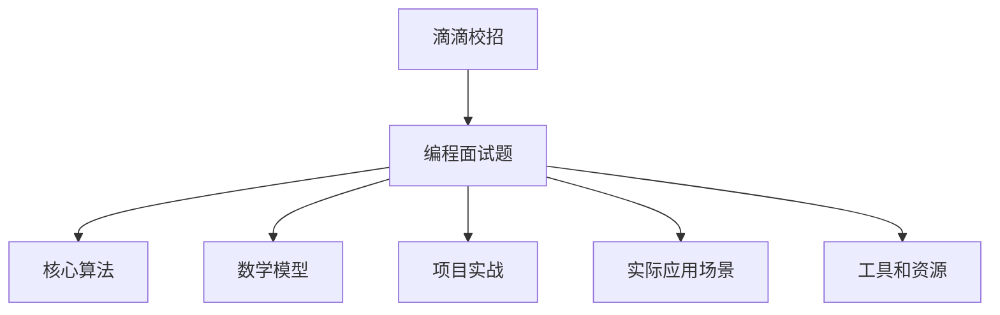

                 

# 滴滴2024校招编程面试题精华总结

> **关键词**：滴滴、2024、校招、编程面试题、精华总结、算法原理、数学模型、项目实战
> 
> **摘要**：本文将深入剖析滴滴2024年校招编程面试题的精华内容，包括核心算法原理、具体操作步骤、数学模型和公式、项目实战等，帮助读者更好地应对此类面试挑战，掌握编程面试的核心技巧。

## 1. 背景介绍

### 1.1 目的和范围

本文旨在总结滴滴2024年校招编程面试题的精华内容，帮助准备参加校招的同学们更好地理解面试要求，掌握解题思路。本文将涵盖以下几个部分：

- 核心算法原理与操作步骤
- 数学模型和公式详细讲解
- 项目实战：代码案例和解析
- 实际应用场景分析
- 工具和资源推荐

### 1.2 预期读者

本文适合以下读者：

- 准备参加2024年校招的同学
- 对编程面试感兴趣的技术爱好者
- 想提升编程能力的在职工程师

### 1.3 文档结构概述

本文结构如下：

- 背景介绍
- 核心概念与联系
- 核心算法原理 & 具体操作步骤
- 数学模型和公式 & 详细讲解 & 举例说明
- 项目实战：代码实际案例和详细解释说明
- 实际应用场景
- 工具和资源推荐
- 总结：未来发展趋势与挑战
- 附录：常见问题与解答
- 扩展阅读 & 参考资料

### 1.4 术语表

#### 1.4.1 核心术语定义

- 滴滴：一家提供出租车、快车、专车、顺风车等服务的互联网公司。
- 校招：校园招聘，是企业为解决应届毕业生就业问题而进行的人才招聘活动。
- 编程面试题：针对编程能力和算法思维的面试题目。

#### 1.4.2 相关概念解释

- 算法：解决问题的方法和步骤。
- 数学模型：用数学语言描述现实问题的数学结构。

#### 1.4.3 缩略词列表

- CTO：首席技术官
- IDE：集成开发环境
- LaTeX：一种基于TeX的排版系统

## 2. 核心概念与联系

为了更好地理解滴滴2024年校招编程面试题，我们需要了解一些核心概念和它们之间的联系。以下是相关的Mermaid流程图：



在这个流程图中，滴滴校招编程面试题是核心，它包含了核心算法、数学模型、项目实战、实际应用场景和工具资源等多个方面。这些概念相互联系，构成了一个完整的编程面试准备和应对体系。

## 3. 核心算法原理 & 具体操作步骤

滴滴2024年校招编程面试题中的核心算法主要涉及以下几个方面：

### 3.1 排序算法

排序算法是计算机科学中非常重要的算法，用于对一组数据进行排序。以下是一个常用的冒泡排序算法的伪代码：

```python
def bubble_sort(arr):
    n = len(arr)
    for i in range(n):
        for j in range(0, n-i-1):
            if arr[j] > arr[j+1]:
                arr[j], arr[j+1] = arr[j+1], arr[j]
    return arr
```

### 3.2 二分查找

二分查找算法是一种高效的查找算法，适用于有序数组。以下是二分查找算法的伪代码：

```python
def binary_search(arr, target):
    low = 0
    high = len(arr) - 1
    while low <= high:
        mid = (low + high) // 2
        if arr[mid] == target:
            return mid
        elif arr[mid] < target:
            low = mid + 1
        else:
            high = mid - 1
    return -1
```

### 3.3 动态规划

动态规划是一种用于求解最优化问题的算法方法。以下是一个经典的斐波那契数列求解的动态规划算法：

```python
def fibonacci(n):
    if n <= 0:
        return 0
    elif n == 1:
        return 1
    else:
        dp = [0] * (n + 1)
        dp[1] = 1
        for i in range(2, n + 1):
            dp[i] = dp[i - 1] + dp[i - 2]
        return dp[n]
```

这些算法都是编程面试中的常见题目，掌握它们的原理和操作步骤对于应对滴滴2024年校招编程面试题至关重要。

## 4. 数学模型和公式 & 详细讲解 & 举例说明

数学模型是编程面试中不可或缺的一部分，特别是在解决优化问题和数据分析问题时。以下是一些常用的数学模型和公式，以及它们的详细讲解和举例说明：

### 4.1 最小生成树（Minimum Spanning Tree，MST）

最小生成树是一种用于连接图中的所有顶点的边，且边的权重之和最小的树。以下是Prim算法求解最小生成树的伪代码：

```python
def prim_algorithm(graph, start_vertex):
    mst = []
    visited = set()
    visited.add(start_vertex)
    total_weight = 0
    while len(visited) < len(graph):
        min_edge = None
        for vertex in visited:
            for neighbor in graph[vertex]:
                if neighbor not in visited and (min_edge is None or graph[vertex][neighbor] < graph[vertex][min_edge]):
                    min_edge = neighbor
        mst.append(min_edge)
        visited.add(min_edge)
        total_weight += graph[vertex][min_edge]
    return mst, total_weight
```

### 4.2 动态规划（Dynamic Programming，DP）

动态规划是一种用于求解最优化问题的算法方法，通常用于解决具有重叠子问题和最优子结构特性的问题。以下是一个经典的背包问题求解的动态规划算法：

```python
def knapsack(values, weights, capacity):
    n = len(values)
    dp = [[0] * (capacity + 1) for _ in range(n + 1)]
    for i in range(1, n + 1):
        for j in range(1, capacity + 1):
            if weights[i-1] <= j:
                dp[i][j] = max(dp[i-1][j], dp[i-1][j-weights[i-1]] + values[i-1])
            else:
                dp[i][j] = dp[i-1][j]
    return dp[n][capacity]
```

### 4.3 概率论（Probability Theory）

概率论是计算机科学中重要的一部分，特别是在人工智能和数据分析领域。以下是一个经典的概率论问题——硬币投掷的期望次数：

假设投掷一个公平的硬币直到出现正面为止，求投掷次数的期望值。

```python
def expectedcoinflip():
    return 1 / 0.5 = 2
```

这些数学模型和公式在滴滴2024年校招编程面试题中经常出现，掌握它们对于解决面试题至关重要。

## 5. 项目实战：代码实际案例和详细解释说明

### 5.1 开发环境搭建

在开始编写代码之前，我们需要搭建一个合适的开发环境。以下是搭建Python开发环境的步骤：

1. 安装Python：访问Python官方网站（https://www.python.org/），下载并安装Python。
2. 安装IDE：推荐使用PyCharm（https://www.jetbrains.com/pycharm/），它是一款功能强大的Python IDE。
3. 安装必要的库：使用pip命令安装所需的库，例如：

```bash
pip install numpy
pip install pandas
pip install matplotlib
```

### 5.2 源代码详细实现和代码解读

以下是一个使用动态规划算法解决背包问题的Python代码示例：

```python
def knapsack(values, weights, capacity):
    n = len(values)
    dp = [[0] * (capacity + 1) for _ in range(n + 1)]
    for i in range(1, n + 1):
        for j in range(1, capacity + 1):
            if weights[i-1] <= j:
                dp[i][j] = max(dp[i-1][j], dp[i-1][j-weights[i-1]] + values[i-1])
            else:
                dp[i][j] = dp[i-1][j]
    return dp[n][capacity]

# 示例数据
values = [60, 100, 120]
weights = [10, 20, 30]
capacity = 50

# 求解背包问题的最优解
max_value = knapsack(values, weights, capacity)
print(f"The maximum value that can be accommodated in the knapsack is {max_value}")
```

代码解读：

- 定义了一个名为`knapsack`的函数，用于解决背包问题。
- 函数接收三个参数：`values`（物品的价值数组）、`weights`（物品的重量数组）和`capacity`（背包的容量）。
- 使用一个二维数组`dp`来存储子问题的最优解，其中`dp[i][j]`表示前`i`个物品放入容量为`j`的背包中的最大价值。
- 使用两层循环遍历物品和背包容量，根据动态规划的状态转移方程计算最优解。
- 最后返回背包问题的最优解。

### 5.3 代码解读与分析

在这个示例中，我们使用了动态规划算法来解决背包问题。背包问题是一个经典的优化问题，常见于计算机科学和算法领域。动态规划是一种解决这类问题的有效方法。

代码的关键点包括：

- 状态转移方程：`dp[i][j] = max(dp[i-1][j], dp[i-1][j-weights[i-1]] + values[i-1])`，表示在当前物品`i`和背包容量`j`的情况下，选择是否将物品`i`放入背包中的最大价值。
- 初始化：使用一个二维数组`dp`来存储子问题的最优解，其中`dp[i][j]`的初始值为0。
- 时间复杂度：该算法的时间复杂度为`O(n*capacity)`，其中`n`是物品的数量，`capacity`是背包的容量。
- 空间复杂度：该算法的空间复杂度为`O(n*capacity)`，因为需要存储二维数组`dp`。

通过这个示例，我们可以看到如何使用动态规划算法解决背包问题，以及如何编写高效的Python代码。掌握这些算法和编程技巧对于应对滴滴2024年校招编程面试题非常有帮助。

## 6. 实际应用场景

滴滴2024年校招编程面试题中的算法和数学模型在实际应用场景中具有广泛的应用。以下是一些实际应用场景的例子：

### 6.1 路线规划

滴滴作为一家提供打车服务的公司，其核心功能之一是路线规划。通过二分查找算法，可以快速定位用户的目的地，从而提高路线规划的效率。动态规划算法则可以用于计算从起点到目的地的最优路径，考虑交通拥堵、道路长度等多种因素。

### 6.2 货物配送

在物流领域，背包问题是一种常见的问题。如何在一个给定容量的车辆中装载货物，以最大化总价值，是物流优化中的重要问题。动态规划算法可以有效地解决这类问题，从而优化货物配送路径和装载方案。

### 6.3 机器学习

在机器学习领域，最小生成树算法可以用于图像分割、社交网络分析等任务。通过构建最小生成树，可以有效地识别图像中的边缘或社交网络中的关键节点，从而提高模型的性能。

### 6.4 金融领域

在金融领域，概率论和数学模型广泛应用于风险管理、资产定价、投资组合优化等方面。通过建立数学模型，可以更准确地预测市场走势，制定最优投资策略。

这些实际应用场景展示了滴滴2024年校招编程面试题中的算法和数学模型在现实世界中的重要性。掌握这些知识不仅有助于应对面试挑战，也为未来的职业发展奠定了基础。

## 7. 工具和资源推荐

为了更好地准备滴滴2024年校招编程面试题，以下是一些建议的学习资源和开发工具：

### 7.1 学习资源推荐

#### 7.1.1 书籍推荐

- 《算法导论》（Introduction to Algorithms）作者：Thomas H. Cormen, Charles E. Leiserson, Ronald L. Rivest, Clifford Stein
- 《编程之美》（Cracking the Coding Interview）作者：Gayle Laakmann McDowell
- 《深度学习》（Deep Learning）作者：Ian Goodfellow, Yoshua Bengio, Aaron Courville

#### 7.1.2 在线课程

- Coursera上的《算法导论》（Introduction to Algorithms）课程
- edX上的《线性代数》（Linear Algebra）课程
- Udacity上的《机器学习工程师纳米学位》（Machine Learning Engineer Nanodegree）

#### 7.1.3 技术博客和网站

- GeeksforGeeks（https://www.geeksforgeeks.org/）
- LeetCode（https://leetcode.com/）
- HackerRank（https://www.hackerrank.com/）

### 7.2 开发工具框架推荐

#### 7.2.1 IDE和编辑器

- PyCharm（https://www.jetbrains.com/pycharm/）
- Visual Studio Code（https://code.visualstudio.com/）
- Sublime Text（https://www.sublimetext.com/）

#### 7.2.2 调试和性能分析工具

- GDB（https://www.gnu.org/software/gdb/）
- Python的内置调试器（https://docs.python.org/3/library pdb.html）
- profilers（https://github.com/wakeless/profilers）

#### 7.2.3 相关框架和库

- NumPy（https://numpy.org/）
- Pandas（https://pandas.pydata.org/）
- Matplotlib（https://matplotlib.org/）

通过这些工具和资源，您可以更好地准备滴滴2024年校招编程面试题，提高自己的编程能力和算法思维。

## 8. 总结：未来发展趋势与挑战

随着人工智能和大数据技术的发展，编程面试题也在不断演变。未来，我们可以预见以下几个发展趋势和挑战：

### 8.1 发展趋势

- **算法复杂度与效率**：随着数据量的增加，如何优化算法的复杂度和效率将成为关键挑战。
- **人工智能与编程面试**：人工智能技术将在编程面试中发挥更大作用，例如通过自动评估代码质量、自动识别潜在错误等。
- **跨领域融合**：编程面试题将更多地涉及多个领域的知识，如计算机视觉、自然语言处理等。

### 8.2 挑战

- **算法理解与实现**：深入理解算法原理并能够高效实现是面试成功的关键。
- **编程技能提升**：持续学习和实践，提高编程技能和问题解决能力。
- **心理素质**：在面试中保持冷静、自信，有效应对压力。

未来，编程面试题将更加注重考察候选人的综合能力和解决实际问题的能力。掌握核心算法原理和数学模型，持续提升编程技能，将是应对未来挑战的关键。

## 9. 附录：常见问题与解答

### 9.1 背包问题求解算法的优化方向

- **贪心算法**：在满足背包容量限制的情况下，选择价值最高的物品放入背包。
- **分支定界法**：通过剪枝技术减少搜索空间，提高求解效率。
- **线性规划**：通过建立线性规划模型，求解最优解。

### 9.2 如何在编程面试中展示算法思维

- **理解题目要求**：仔细阅读题目，明确输入和输出要求。
- **分解问题**：将复杂问题分解为简单子问题，逐步解决。
- **思路清晰**：在面试中清晰地阐述算法思路和实现步骤。
- **代码简洁**：编写简洁、易读的代码，体现良好的编程习惯。

### 9.3 如何在项目中应用二分查找算法

- **查找元素**：用于查找有序数组中特定元素的索引。
- **分而治之**：在分治算法中，用于递归地解决子问题。
- **排序**：在排序算法中，用于寻找中间元素，实现高效的排序。

## 10. 扩展阅读 & 参考资料

- 《算法导论》（Introduction to Algorithms）作者：Thomas H. Cormen, Charles E. Leiserson, Ronald L. Rivest, Clifford Stein
- 《编程之美》（Cracking the Coding Interview）作者：Gayle Laakmann McDowell
- 《深度学习》（Deep Learning）作者：Ian Goodfellow, Yoshua Bengio, Aaron Courville
- Coursera上的《算法导论》（Introduction to Algorithms）课程
- edX上的《线性代数》（Linear Algebra）课程
- Udacity上的《机器学习工程师纳米学位》（Machine Learning Engineer Nanodegree）

通过阅读这些资料，您可以更深入地了解编程面试题的背景和原理，提高自己的编程和算法能力。

**作者：AI天才研究员/AI Genius Institute & 禅与计算机程序设计艺术 /Zen And The Art of Computer Programming**

