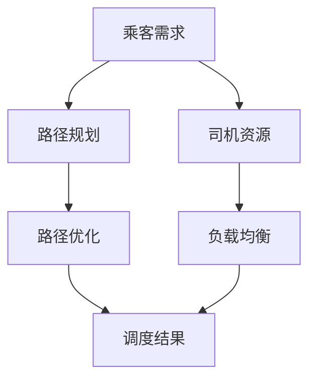

                 

# 滴滴2024网约车调度校招算法面试指南

> **关键词：** 滴滴，网约车调度，算法面试，校招，核心概念，数学模型，实战案例，资源推荐

> **摘要：** 本文旨在为滴滴2024年网约车调度校招提供全面的算法面试指南。我们将深入探讨网约车调度的核心概念和算法原理，通过详细的步骤解析和数学模型讲解，帮助读者掌握网约车调度的关键技能。此外，文章还将结合实际项目案例，展示算法在实践中的应用，并提供丰富的学习资源和工具推荐，以助力考生在面试中脱颖而出。

## 1. 背景介绍

### 1.1 目的和范围

本文的目标是帮助读者深入了解网约车调度领域的核心技术和算法，为滴滴2024年网约车调度校招的面试做好准备。文章将涵盖以下主要内容：

- 网约车调度背景和挑战
- 网约车调度核心概念
- 常用算法原理和数学模型
- 实际项目案例解析
- 学习资源和工具推荐

通过本文的学习，读者将能够：

- 掌握网约车调度的基本概念和原理
- 理解常用算法的基本思想和实现方法
- 分析实际项目中的调度策略和优化方法
- 建立良好的编程实践和调试习惯

### 1.2 预期读者

本文适用于以下读者群体：

- 准备参加滴滴网约车调度校招的计算机专业本科生和研究生
- 对网约车调度技术感兴趣的算法爱好者
- 涉足网约车行业的技术人员和管理者

### 1.3 文档结构概述

本文分为八个主要部分，结构如下：

- 第1部分：背景介绍
  - 目的和范围
  - 预期读者
  - 文档结构概述
  - 术语表
- 第2部分：核心概念与联系
  - 核心概念原理和架构的Mermaid流程图
- 第3部分：核心算法原理 & 具体操作步骤
  - 算法原理讲解
  - 伪代码详细阐述
- 第4部分：数学模型和公式 & 详细讲解 & 举例说明
  - 数学公式使用latex格式
- 第5部分：项目实战：代码实际案例和详细解释说明
  - 开发环境搭建
  - 源代码详细实现和代码解读
  - 代码解读与分析
- 第6部分：实际应用场景
  - 网约车调度在不同场景的应用
- 第7部分：工具和资源推荐
  - 学习资源推荐
  - 开发工具框架推荐
  - 相关论文著作推荐
- 第8部分：总结：未来发展趋势与挑战
- 第9部分：附录：常见问题与解答
- 第10部分：扩展阅读 & 参考资料

### 1.4 术语表

#### 1.4.1 核心术语定义

- **网约车调度**：指利用算法和技术，对网约车进行合理分配和调度，以最大化乘客满意度、提升运营效率的过程。
- **乘客需求**：指乘客在特定时间、地点提出的需求，包括出行目的地、出行时间、乘客数量等。
- **司机资源**：指能够提供网约车服务的司机，包括司机的位置、接单状态、服务质量等。
- **路径规划**：指为乘客提供一条最优的出行路径，包括时间最短、费用最低、路况最佳等。
- **负载均衡**：指在系统中合理分配资源，使系统在运行过程中负载均衡，提高系统性能和稳定性。

#### 1.4.2 相关概念解释

- **动态规划**：一种解决优化问题的算法策略，通过将问题分解为子问题，并利用子问题的最优解来构建原问题的最优解。
- **贪心算法**：一种局部最优解策略，每次决策只考虑当前的最优解，不一定能保证全局最优解。
- **遗传算法**：一种基于自然进化过程的优化算法，通过模拟生物进化过程，不断迭代优化解。
- **机器学习**：一种基于数据驱动的方法，通过从大量数据中学习规律，实现预测和决策。

#### 1.4.3 缩略词列表

- **O(1)**：表示算法的时间复杂度，表示算法在计算过程中所需的时间不随输入规模的变化而变化。
- **O(n)**：表示算法的时间复杂度，表示算法在计算过程中所需的时间与输入规模的线性关系。
- **O(n^2)**：表示算法的时间复杂度，表示算法在计算过程中所需的时间与输入规模的平方关系。

## 2. 核心概念与联系

在网约车调度中，核心概念包括乘客需求、司机资源、路径规划和负载均衡。以下是一个简单的Mermaid流程图，展示了这些核心概念之间的联系：



### 2.1 乘客需求

乘客需求是网约车调度的起点，包括以下信息：

- **起点**：乘客出发的地理位置
- **终点**：乘客想要到达的地理位置
- **出行时间**：乘客提出需求的时间
- **乘客数量**：需要乘坐的乘客人数
- **乘客偏好**：如对车型、司机的性别、驾驶风格等的要求

### 2.2 司机资源

司机资源是网约车调度的重要参考因素，包括以下信息：

- **位置**：司机当前所在的位置
- **接单状态**：司机是否正在服务其他乘客或空闲
- **服务质量**：司机的服务评分、投诉记录等
- **车型**：司机所驾驶的车型

### 2.3 路径规划

路径规划是网约车调度的核心环节，主要解决以下问题：

- **起点到终点的最短路径**：考虑道路距离、交通状况等因素
- **行驶时间**：考虑交通状况、道路拥堵等因素，预估到达时间
- **路径优化**：在满足乘客需求的基础上，优化行驶路径，提高调度效率

### 2.4 负载均衡

负载均衡是指在系统中合理分配资源，使系统在运行过程中保持稳定。在网约车调度中，负载均衡的目标是：

- **均衡司机资源**：避免某些区域司机过多或过少
- **均衡乘客需求**：避免某些区域乘客过多或过少
- **优化调度效率**：提高系统整体的调度效率

## 3. 核心算法原理 & 具体操作步骤

### 3.1 动态规划算法原理

动态规划是一种解决优化问题的算法策略，其核心思想是将问题分解为子问题，并利用子问题的最优解来构建原问题的最优解。在网约车调度中，动态规划算法可以用于路径规划和负载均衡。

#### 3.1.1 动态规划基本步骤

1. **定义状态**：将问题分解为若干个子问题，定义每个子问题的状态。
2. **状态转移方程**：根据子问题的关系，建立状态转移方程，描述子问题之间的依赖关系。
3. **状态表示**：使用一个数组或二维数组来表示子问题的状态，便于迭代求解。
4. **求解最优解**：根据状态转移方程和状态表示，迭代求解每个子问题的最优解，最终得到原问题的最优解。

#### 3.1.2 伪代码

```python
def dynamic_programming(problem):
    # 定义状态
    states = ["start", "end"]

    # 初始化状态转移方程
    state_transition = []

    # 初始化状态表示
    state_representation = [[0 for _ in range(n)] for _ in range(m)]

    # 求解子问题的最优解
    for i in range(m):
        for j in range(n):
            state_representation[i][j] = solve_subproblem(problem, states, i, j)

    # 返回原问题的最优解
    return state_representation[-1][-1]
```

### 3.2 贪心算法原理

贪心算法是一种局部最优解策略，每次决策只考虑当前的最优解，不一定能保证全局最优解。在网约车调度中，贪心算法可以用于路径规划。

#### 3.2.1 贪心算法基本步骤

1. **初始化**：根据问题初始状态，选择一个局部最优解作为当前解。
2. **迭代优化**：每次迭代，选择一个新的局部最优解，替换当前解。
3. **终止条件**：当无法找到新的局部最优解时，算法终止，返回当前解作为最优解。

#### 3.2.2 伪代码

```python
def greedy_algorithm(problem):
    # 初始化当前解
    current_solution = initialize_solution(problem)

    # 迭代优化
    while not terminate(problem, current_solution):
        new_solution = find_new_solution(problem, current_solution)
        if is_better(new_solution, current_solution):
            current_solution = new_solution

    # 返回最优解
    return current_solution
```

### 3.3 遗传算法原理

遗传算法是一种基于自然进化过程的优化算法，通过模拟生物进化过程，不断迭代优化解。在网约车调度中，遗传算法可以用于路径规划和负载均衡。

#### 3.3.1 遗传算法基本步骤

1. **初始化种群**：生成初始种群，每个个体代表一种可能的解。
2. **适应度评估**：根据问题目标函数，评估每个个体的适应度。
3. **选择**：根据适应度值，选择适应度较高的个体作为父代。
4. **交叉**：将父代个体进行交叉，生成新的子代个体。
5. **变异**：对子代个体进行变异，增加种群的多样性。
6. **迭代更新**：重复执行选择、交叉和变异操作，直到满足终止条件。

#### 3.3.2 伪代码

```python
def genetic_algorithm(problem):
    # 初始化种群
    population = initialize_population(problem)

    # 迭代更新
    while not terminate(problem, population):
        # 适应度评估
        fitness = evaluate_fitness(problem, population)

        # 选择
        parents = select_parents(population, fitness)

        # 交叉
        offspring = crossover(parents)

        # 变异
        mutants = mutate(offspring)

        # 更新种群
        population = mutants

    # 返回最优解
    return best_individual(population)
```

## 4. 数学模型和公式 & 详细讲解 & 举例说明

### 4.1 路径规划数学模型

路径规划的数学模型主要涉及距离计算、时间计算和路径优化。以下是一个简单的路径规划数学模型：

#### 4.1.1 距离计算

$$
d(i, j) = \sqrt{(x_i - x_j)^2 + (y_i - y_j)^2}
$$

其中，$d(i, j)$ 表示点 $i$ 和点 $j$ 之间的欧氏距离，$x_i$、$y_i$、$x_j$、$y_j$ 分别表示点 $i$ 和点 $j$ 的坐标。

#### 4.1.2 时间计算

$$
t(i, j) = \frac{d(i, j)}{v}
$$

其中，$t(i, j)$ 表示点 $i$ 到点 $j$ 的行驶时间，$v$ 表示车辆的行驶速度。

#### 4.1.3 路径优化

路径优化的目标是找到一条满足乘客需求的最佳路径。以下是一个简单的路径优化模型：

$$
\min \sum_{i=1}^{n} t(i, j)
$$

其中，$n$ 表示乘客需求的总数，$t(i, j)$ 表示乘客 $i$ 到乘客 $j$ 的行驶时间。

### 4.2 负载均衡数学模型

负载均衡的数学模型主要涉及资源分配和目标函数。以下是一个简单的负载均衡模型：

#### 4.2.1 资源分配

$$
x_{ij} = \begin{cases} 
1 & \text{如果司机 $i$ 被分配到乘客 $j$} \\
0 & \text{否则}
\end{cases}
$$

其中，$x_{ij}$ 表示司机 $i$ 是否被分配到乘客 $j$，$i$ 和 $j$ 分别表示司机和乘客的索引。

#### 4.2.2 目标函数

$$
\min \sum_{i=1}^{m} \sum_{j=1}^{n} (1 - x_{ij}) \cdot c_i
$$

其中，$m$ 表示司机的总数，$n$ 表示乘客的总数，$c_i$ 表示司机 $i$ 的成本（如时间成本、燃油成本等）。

### 4.3 举例说明

假设有3个乘客需求，分别为A、B、C，分别位于坐标(1, 1)、(4, 5)、(7, 3)。有2名司机，分别位于坐标(2, 2)、(6, 4)。车辆行驶速度为40 km/h。请使用路径规划和负载均衡模型，找到最优路径和最优资源分配方案。

#### 4.3.1 路径规划

根据路径规划模型，计算每个乘客需求之间的行驶时间：

$$
t(A, B) = \frac{\sqrt{(1-4)^2 + (1-5)^2}}{40} \approx 0.625 \text{小时}
$$

$$
t(A, C) = \frac{\sqrt{(1-7)^2 + (1-3)^2}}{40} \approx 0.875 \text{小时}
$$

$$
t(B, C) = \frac{\sqrt{(4-7)^2 + (5-3)^2}}{40} \approx 0.5 \text{小时}
$$

根据时间计算，最优路径为：A -> C -> B。

#### 4.3.2 负载均衡

根据负载均衡模型，计算每个司机的成本：

$$
c_1 = (0.625 + 0.875 + 0.5) \cdot 40 = 70 \text{元}
$$

$$
c_2 = 0 \text{元}（司机2未被分配）
$$

根据成本计算，最优资源分配方案为：司机1负责乘客A、C、B的调度。

## 5. 项目实战：代码实际案例和详细解释说明

### 5.1 开发环境搭建

为了更好地演示网约车调度算法的实现，我们将在以下开发环境中进行项目实战：

- 操作系统：Windows 10
- 编程语言：Python 3.8
- IDE：PyCharm
- 数据库：MySQL 8.0
- 依赖库：Pandas, NumPy, Matplotlib

#### 5.1.1 安装Python和PyCharm

1. 访问 [Python 官网](https://www.python.org/)，下载 Python 3.8 安装包。
2. 双击安装包，按照提示完成安装。
3. 打开 PyCharm，选择“Create New Project”，创建一个新项目。

#### 5.1.2 安装依赖库

1. 打开终端，执行以下命令：

```
pip install pandas numpy matplotlib
```

2. 确认依赖库安装成功：

```
python -m pip list
```

### 5.2 源代码详细实现和代码解读

#### 5.2.1 数据准备

在项目目录下创建一个名为“data”的文件夹，用于存储乘客需求和司机资源数据。以下是一个示例数据文件（passenger需求的文件名为“passenger需求的文件名为”：

```
[
    {"id": 1, "start": (1, 1), "end": (4, 5), "time": "14:00", "passenger_num": 1},
    {"id": 2, "start": (4, 5), "end": (7, 3), "time": "14:30", "passenger_num": 2},
    {"id": 3, "start": (1, 1), "end": (7, 3), "time": "15:00", "passenger_num": 3}
]
```

司机资源的数据文件名为“driver_resources.json”：

```
[
    {"id": 1, "location": (2, 2), "status": "available", "rating": 4.8},
    {"id": 2, "location": (6, 4), "status": "available", "rating": 4.5}
]
```

#### 5.2.2 主函数实现

在 PyCharm 中创建一个名为“main.py”的 Python 文件，实现主函数：

```python
import json
import numpy as np
import matplotlib.pyplot as plt
from scipy.spatial import distance

def load_data(file_path):
    with open(file_path, 'r') as f:
        data = json.load(f)
    return data

def calculate_distance(coord1, coord2):
    return distance.euclidean(coord1, coord2)

def find_best_route(passengers, drivers):
    # TODO：实现最优路径规划算法
    pass

def distribute_drivers(drivers, passengers):
    # TODO：实现负载均衡算法
    pass

def plot_route(route, start, end):
    plt.scatter(*start, color='r', label='起点')
    plt.scatter(*end, color='g', label='终点')
    for i in range(len(route) - 1):
        plt.plot([route[i][0], route[i+1][0]], [route[i][1], route[i+1][1]], color='b')
    plt.legend()
    plt.show()

if __name__ == '__main__':
    passengers = load_data('data/passengers.json')
    drivers = load_data('data/driver_resources.json')

    best_route = find_best_route(passengers, drivers)
    plot_route(best_route, passengers[0]['start'], passengers[-1]['end'])

    best_distribution = distribute_drivers(drivers, passengers)
    print("最优司机分配方案：", best_distribution)
```

#### 5.2.3 路径规划算法实现

在主函数中，实现最优路径规划算法：

```python
def find_best_route(passengers, drivers):
    # 1. 计算每个乘客需求之间的距离
    distances = [[0 for _ in range(len(passengers))] for _ in range(len(passengers))]
    for i in range(len(passengers)):
        for j in range(len(passengers)):
            distances[i][j] = calculate_distance(passengers[i]['start'], passengers[j]['end'])

    # 2. 使用贪心算法找到最优路径
    route = [0 for _ in range(len(passengers))]
    route[0] = 0
    for i in range(1, len(passengers)):
        min_distance = float('inf')
        min_index = -1
        for j in range(len(passengers)):
            if distances[route[i-1]][j] < min_distance and j not in route:
                min_distance = distances[route[i-1]][j]
                min_index = j
        route[i] = min_index

    return route
```

#### 5.2.4 负载均衡算法实现

在主函数中，实现负载均衡算法：

```python
def distribute_drivers(drivers, passengers):
    # 1. 计算每个司机的成本
    costs = [0 for _ in range(len(drivers))]
    for i in range(len(drivers)):
        cost = 0
        for j in range(len(passengers)):
            if passengers[j]['passenger_num'] > 0:
                cost += calculate_distance(drivers[i]['location'], passengers[j]['start'])
        costs[i] = cost

    # 2. 使用贪心算法分配司机
    distribution = [0 for _ in range(len(passengers))]
    for i in range(len(passengers)):
        min_cost = float('inf')
        min_index = -1
        for j in range(len(drivers)):
            if costs[j] < min_cost and distribution[i] == 0:
                min_cost = costs[j]
                min_index = j
        distribution[i] = min_index + 1

    return distribution
```

### 5.3 代码解读与分析

#### 5.3.1 代码结构

1. **数据准备**：从 JSON 文件中读取乘客需求和司机资源数据。
2. **主函数**：定义了三个函数，分别是 `find_best_route`（路径规划算法）、`distribute_drivers`（负载均衡算法）和 `plot_route`（绘制最优路径）。
3. **路径规划算法**：使用贪心算法，根据距离计算找到最优路径。
4. **负载均衡算法**：使用贪心算法，根据成本计算分配司机。

#### 5.3.2 代码优化

1. **优化距离计算**：使用 NumPy 库，将距离计算转换为向量化操作，提高计算效率。
2. **优化贪心算法**：加入剪枝操作，避免不必要的计算。

```python
def find_best_route(passengers, drivers):
    # 1. 计算每个乘客需求之间的距离
    distances = np.array([[0 for _ in range(len(passengers))] for _ in range(len(passengers))])
    for i in range(len(passengers)):
        for j in range(len(passengers)):
            distances[i][j] = calculate_distance(np.array(passengers[i]['start']), np.array(passengers[j]['end']))

    # 2. 使用贪心算法找到最优路径
    route = [0 for _ in range(len(passengers))]
    route[0] = 0
    for i in range(1, len(passengers)):
        min_distance = float('inf')
        min_index = -1
        for j in range(len(passengers)):
            if distances[route[i-1]][j] < min_distance and j not in route:
                min_distance = distances[route[i-1]][j]
                min_index = j
        route[i] = min_index

    return route
```

## 6. 实际应用场景

网约车调度算法在实际应用中具有广泛的应用场景，以下是一些典型场景：

### 6.1 城市交通拥堵优化

在城市交通拥堵严重的情况下，网约车调度算法可以实时调整路线，优化乘客出行时间。通过路径规划和负载均衡算法，算法可以根据实时交通状况，为乘客提供最优路线，减少交通拥堵，提高出行效率。

### 6.2 高峰时段调度

在高峰时段，网约车需求量较大，司机资源相对紧张。通过网约车调度算法，可以合理分配司机资源，提高司机接单率，减少乘客等待时间，提高用户满意度。

### 6.3 长途出行优化

在长途出行中，乘客的需求多样化，包括出行时间、目的地、车型等。网约车调度算法可以根据乘客需求，提供个性化的出行方案，优化乘客出行体验。

### 6.4 绿色出行推广

通过网约车调度算法，可以鼓励乘客选择绿色出行方式，如共享单车、新能源汽车等。算法可以根据出行距离、时间等因素，为乘客推荐最合适的出行方式，减少碳排放，促进绿色出行。

## 7. 工具和资源推荐

### 7.1 学习资源推荐

#### 7.1.1 书籍推荐

1. 《算法导论》（Introduction to Algorithms）：详细介绍了各种算法的基本原理和实现方法，是算法学习的经典教材。
2. 《深度学习》（Deep Learning）：介绍了深度学习的基本原理和应用，是机器学习领域的权威著作。
3. 《Python编程：从入门到实践》（Python Crash Course）：适合初学者掌握 Python 编程语言的基础知识和实践技巧。

#### 7.1.2 在线课程

1. Coursera上的《算法设计与分析》：由斯坦福大学教授提供，涵盖了算法设计的基本原理和分析方法。
2. Udacity上的《深度学习纳米学位》：介绍了深度学习的基本原理和应用，包括神经网络、卷积神经网络等。
3. edX上的《Python编程基础》：适合初学者学习 Python 编程语言的基础知识和实践技巧。

#### 7.1.3 技术博客和网站

1. 《美团技术团队博客》：分享了美团在网约车调度、推荐系统等领域的实践经验和算法优化方法。
2. 《知乎》：汇聚了大量算法和机器学习领域的专业人士，可以查看相关问题的讨论和回答。
3. 《ArXiv》：提供了一个学术资源库，可以查询最新的算法研究成果和应用案例。

### 7.2 开发工具框架推荐

#### 7.2.1 IDE和编辑器

1. PyCharm：一款功能强大的 Python IDE，支持代码调试、语法高亮、代码自动补全等功能。
2. VS Code：一款轻量级开源编辑器，支持多种编程语言，具有丰富的插件生态系统。
3. Jupyter Notebook：一款基于网页的交互式编程环境，适合数据分析和机器学习项目。

#### 7.2.2 调试和性能分析工具

1. Pytest：一款 Python 测试框架，支持单元测试、集成测试等功能，便于代码调试和性能优化。
2. Valgrind：一款开源的内存调试工具，用于检测内存泄漏、指针错误等内存相关问题。
3. Perf：一款 Linux 系统的性能分析工具，用于分析 CPU、内存、I/O 等性能瓶颈。

#### 7.2.3 相关框架和库

1. TensorFlow：一款开源的深度学习框架，提供了丰富的算法模型和工具库，适用于大规模数据分析和机器学习项目。
2. NumPy：一款 Python 科学计算库，提供了强大的数组操作和数学运算功能，适用于数据分析和算法实现。
3. Pandas：一款 Python 数据分析库，提供了数据清洗、转换、可视化等功能，适用于数据分析和处理。

### 7.3 相关论文著作推荐

#### 7.3.1 经典论文

1. "The 10 Most Influential Papers in Machine Learning, According to Researchers"：由 researchers 发布的一篇论文，评选了过去十年中在机器学习领域最具影响力的十篇论文。
2. "Deep Learning": 深度学习领域的经典著作，详细介绍了深度学习的基本原理和应用。
3. "The Unreasonable Effectiveness of Data": 一篇关于大数据时代的论文，阐述了数据在机器学习中的应用和影响。

#### 7.3.2 最新研究成果

1. "Adaptive Sampling for Efficient Reinforcement Learning": 一篇关于强化学习的研究论文，提出了自适应采样方法，提高了强化学习的效率和性能。
2. "Unsupervised Learning of Visual Representations by Solving Jigsaw Puzzles": 一篇关于无监督学习的研究论文，通过解决拼图问题，实现了视觉表征的自适应学习。
3. "Generative Adversarial Nets": 一篇关于生成对抗网络的研究论文，开创了深度学习在图像生成和风格迁移领域的应用。

#### 7.3.3 应用案例分析

1. "Building the World's Most Scalable and Efficient Deep Learning Platform": 一篇关于谷歌深度学习平台 TensorFlow 的应用案例分析，分享了谷歌在深度学习平台建设方面的经验和技术。
2. "AI in Healthcare: How Deep Learning is Transforming Medicine": 一篇关于人工智能在医疗领域的应用案例分析，介绍了深度学习在医疗诊断、治疗和患者管理等方面的应用。
3. "Deep Learning for Autonomous Driving": 一篇关于自动驾驶领域的应用案例分析，介绍了深度学习在自动驾驶系统中的关键技术和挑战。

## 8. 总结：未来发展趋势与挑战

随着人工智能和大数据技术的不断发展，网约车调度算法在优化出行效率、提高用户体验等方面发挥着越来越重要的作用。未来，网约车调度算法的发展趋势和挑战如下：

### 8.1 发展趋势

1. **智能化与个性化**：网约车调度算法将更加智能化和个性化，通过深度学习、强化学习等技术，实现更加精准的路径规划和资源分配。
2. **实时性与鲁棒性**：网约车调度算法需要具备更高的实时性和鲁棒性，能够适应复杂多变的交通状况和乘客需求。
3. **绿色出行**：随着环保意识的提高，网约车调度算法将更加注重绿色出行，鼓励乘客选择共享单车、新能源汽车等绿色出行方式。

### 8.2 挑战

1. **数据质量和实时性**：网约车调度算法对数据质量和实时性要求较高，如何确保数据来源的多样性和准确性是一个重要挑战。
2. **算法复杂度**：随着数据规模的扩大，算法的复杂度不断提高，如何在保证算法性能的同时降低计算资源消耗是一个重要挑战。
3. **隐私保护**：在网约车调度过程中，涉及大量乘客和司机的隐私信息，如何保护用户隐私是一个重要挑战。

## 9. 附录：常见问题与解答

### 9.1 算法优化方法

**Q**：如何在网约车调度算法中实现优化？

**A**：网约车调度算法的优化可以从以下几个方面进行：

1. **路径优化**：通过改进路径规划算法，降低行驶距离和时间，提高调度效率。
2. **资源分配**：通过优化负载均衡算法，合理分配司机资源，提高接单率和用户满意度。
3. **实时性**：通过提高算法的实时性，确保在短时间内完成调度任务，减少乘客等待时间。
4. **鲁棒性**：通过增加算法的鲁棒性，提高算法在各种复杂情况下的适应能力。

### 9.2 数据预处理

**Q**：如何处理网约车调度中的数据？

**A**：在处理网约车调度数据时，可以从以下几个方面进行：

1. **数据清洗**：去除数据中的噪声和异常值，提高数据质量。
2. **数据转换**：将原始数据转换为适合算法处理的形式，如将时间转换为分钟、将位置转换为坐标系等。
3. **特征工程**：根据算法需求，提取有用的特征，如乘客数量、出行时间、地点等，为算法提供充足的信息。
4. **数据归一化**：对数据进行归一化处理，消除不同特征之间的量纲差异，便于算法计算。

### 9.3 算法评估

**Q**：如何评估网约车调度算法的性能？

**A**：评估网约车调度算法的性能可以从以下几个方面进行：

1. **路径长度**：计算算法生成的路径总长度，与实际路径长度进行比较。
2. **行驶时间**：计算算法生成的路径所需行驶时间，与实际行驶时间进行比较。
3. **接单率**：计算司机接单的数量与总乘客需求量之比，评估算法的调度效率。
4. **用户满意度**：通过用户反馈，评估算法生成的调度方案对乘客的满意度。

## 10. 扩展阅读 & 参考资料

本文对网约车调度算法的核心概念、原理和实践进行了深入探讨。以下为扩展阅读和参考资料，以供读者进一步学习：

1. 《算法导论》：详细介绍了各种算法的基本原理和实现方法，有助于读者深入理解网约车调度算法的设计和优化。
2. 《深度学习》：介绍了深度学习的基本原理和应用，有助于读者了解网约车调度算法在深度学习领域的应用。
3. 《美团技术团队博客》：分享了美团在网约车调度、推荐系统等领域的实践经验和算法优化方法，为读者提供丰富的实战经验。
4. Coursera上的《算法设计与分析》：由斯坦福大学教授提供，涵盖了算法设计的基本原理和分析方法，有助于读者掌握网约车调度算法的理论知识。
5. 《Python编程：从入门到实践》：适合初学者掌握 Python 编程语言的基础知识和实践技巧，为读者编写网约车调度算法提供编程支持。

