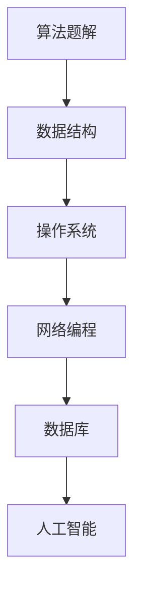

                 

# 滴滴2025社招面试真题与算法题解

> **关键词：**滴滴，社招，面试真题，算法题解，数据结构，操作系统，网络编程，数据库，人工智能，实战案例

> **摘要：**本文将深入分析滴滴公司2025年社招面试中出现的经典真题，包括算法题解、数据结构应用、操作系统、网络编程、数据库和人工智能等领域的实战案例。通过详细的解题过程和实例分析，帮助读者更好地理解和掌握相关技术，为面试和实际项目开发做好准备。

## 1. 背景介绍

### 1.1 目的和范围

本文旨在为参加滴滴公司2025年社招面试的求职者提供一份全面的真题解析和算法指导。我们将通过对滴滴面试真题的深入分析，帮助读者了解面试官的考查重点和难点，掌握解题技巧，提升面试成功率。

本文涵盖了以下内容：

- **算法题解：**针对滴滴面试中常见的算法题目，提供详细的解题思路和伪代码实现。
- **数据结构应用：**分析面试中涉及的数据结构问题，讲解其原理和应用。
- **操作系统：**解析操作系统相关面试题目，包括进程管理、内存管理、文件系统等。
- **网络编程：**探讨网络编程面试题，涉及TCP/IP协议、HTTP协议等。
- **数据库：**讲解数据库面试题，包括SQL语句编写、索引优化、事务管理等。
- **人工智能：**分析人工智能领域面试题，包括机器学习算法、神经网络、自然语言处理等。

### 1.2 预期读者

本文适合以下读者：

- 准备参加滴滴公司2025年社招面试的求职者。
- 想要提升算法和数据结构水平的程序员。
- 对操作系统、网络编程、数据库和人工智能等领域感兴趣的读者。

### 1.3 文档结构概述

本文分为以下几个部分：

1. 背景介绍
2. 核心概念与联系
3. 核心算法原理 & 具体操作步骤
4. 数学模型和公式 & 详细讲解 & 举例说明
5. 项目实战：代码实际案例和详细解释说明
6. 实际应用场景
7. 工具和资源推荐
8. 总结：未来发展趋势与挑战
9. 附录：常见问题与解答
10. 扩展阅读 & 参考资料

### 1.4 术语表

#### 1.4.1 核心术语定义

- **滴滴：**一家全球领先的移动出行平台公司。
- **社招：**社会招聘，即非校园招聘。
- **面试真题：**指实际面试中出现的题目。
- **算法题解：**对面试中算法题目的解题过程和思路进行详细解析。
- **数据结构：**计算机存储数据的方式及其操作方法。
- **操作系统：**管理计算机硬件资源和提供服务的系统软件。
- **网络编程：**涉及网络通信协议和编程技术。
- **数据库：**存储、管理和查询数据的系统。
- **人工智能：**模拟人类智能行为的技术。

#### 1.4.2 相关概念解释

- **面试官：**负责面试求职者的人员。
- **求职者：**申请就业机会的人员。
- **真题解析：**对面试真题进行详细分析和解答。

#### 1.4.3 缩略词列表

- **SQL：**结构化查询语言（Structured Query Language）。
- **HTTP：**超文本传输协议（Hypertext Transfer Protocol）。
- **TCP/IP：**传输控制协议/互联网协议（Transmission Control Protocol/Internet Protocol）。

## 2. 核心概念与联系

在面试过程中，了解核心概念之间的联系至关重要。以下是一个简化的Mermaid流程图，展示了本文中涉及的核心概念及其相互关系。



### 2.1 算法题解

算法题解是面试过程中的核心部分，主要涉及以下几个方面：

- **动态规划：**解决最优化问题的算法，通过子问题的重叠性质减少计算量。
- **贪心算法：**基于贪心策略，每次选择最优解，从而得到全局最优解。
- **分治算法：**将大问题分解为小问题，递归求解并合并结果。
- **图算法：**解决图相关问题的算法，包括最短路径、拓扑排序等。

### 2.2 数据结构应用

数据结构是算法的基础，本文涉及以下数据结构：

- **数组：**一种线性数据结构，支持随机访问。
- **链表：**一种线性数据结构，通过指针链接元素。
- **栈：**一种后进先出（LIFO）的数据结构。
- **队列：**一种先进先出（FIFO）的数据结构。
- **哈希表：**通过哈希函数快速查找元素的数据结构。

### 2.3 操作系统

操作系统是计算机系统的核心，本文涉及以下操作系统相关概念：

- **进程管理：**管理计算机中运行的程序。
- **内存管理：**分配和回收内存资源。
- **文件系统：**管理和存储文件的数据结构。

### 2.4 网络编程

网络编程是面试中常见的领域，涉及以下网络编程相关概念：

- **TCP/IP协议：**互联网通信的基础协议。
- **HTTP协议：**超文本传输协议，用于Web应用通信。
- **网络编程技术：**Socket编程、多线程编程等。

### 2.5 数据库

数据库是存储和管理数据的系统，本文涉及以下数据库相关概念：

- **SQL语句：**用于数据库操作的语言。
- **索引优化：**提高查询效率的技术。
- **事务管理：**确保数据一致性的技术。

### 2.6 人工智能

人工智能是当前技术领域的热门话题，本文涉及以下人工智能相关概念：

- **机器学习算法：**通过训练模型来模拟人类学习过程。
- **神经网络：**模拟人脑神经元结构的计算模型。
- **自然语言处理：**研究人类语言与计算机之间的交互。

## 3. 核心算法原理 & 具体操作步骤

在本文中，我们将详细讲解滴滴社招面试中常见的算法题目及其解题思路。以下是三个典型的算法题目的解析。

### 3.1 动态规划：最长公共子序列（LCS）

**题目描述：**给定两个字符串text1和text2，找出它们的最长公共子序列的长度。

**解题思路：**使用动态规划求解。定义一个二维数组dp，其中dp[i][j]表示text1的前i个字符和text2的前j个字符的最长公共子序列的长度。状态转移方程如下：

$$
dp[i][j] = \begin{cases}
dp[i-1][j-1] + 1, & \text{如果text1[i-1] == text2[j-1]} \\
\max(dp[i-1][j], dp[i][j-1]), & \text{如果text1[i-1] != text2[j-1]}
\end{cases}
$$

**伪代码：**

```
function LCSLength(text1, text2):
    m = length(text1)
    n = length(text2)
    dp = Array(m+1, n+1)
    
    for i = 1 to m:
        for j = 1 to n:
            if text1[i-1] == text2[j-1]:
                dp[i][j] = dp[i-1][j-1] + 1
            else:
                dp[i][j] = max(dp[i-1][j], dp[i][j-1])
                
    return dp[m][n]
```

### 3.2 贪心算法：打家劫舍（House Robber）

**题目描述：**你是一个专业的小偷，计划偷窃沿街的房屋。每间房屋装有安全系统，如果你连续偷窃两间相邻的房屋，你将自动触发安全系统。计算你最多可以偷窃多少金额。

**解题思路：**使用贪心算法。定义两个变量prev和curr，分别表示前一个房屋的金额和当前房屋的金额。每次选择一个房屋时，更新prev和curr的值。状态转移方程如下：

$$
\text{prev} = \max(\text{prev}, \text{curr})
\text{curr} = \text{nums}[i] + \text{prev}
$$

**伪代码：**

```
function maxMoney(nums):
    n = length(nums)
    prev = 0
    curr = nums[0]
    
    for i = 1 to n-1:
        temp = curr
        curr = max(prev, nums[i]) + curr
        prev = temp
        
    return curr
```

### 3.3 分治算法：合并排序（Merge Sort）

**题目描述：**给定一个无序的整数数组nums，将数组排序。

**解题思路：**使用分治算法。将数组分为两个子数组，递归地对子数组进行排序，最后合并两个有序子数组。状态转移方程如下：

$$
\text{MergeSort}(A, p, r) = \begin{cases}
\text{空} & \text{如果 } p > r \\
\text{空} & \text{如果 } p == r \\
\text{合并 } \text{Sort}(A, p, \frac{p+r}{2}) \text{ 和 } \text{Sort}(A, \frac{p+r}{2}+1, r) & \text{否则}
\end{cases}
$$

**伪代码：**

```
function mergeSort(nums):
    if length(nums) <= 1:
        return nums
    
    mid = length(nums) // 2
    left = mergeSort(nums[0:mid])
    right = mergeSort(nums[mid:end])
    
    return merge(left, right)

function merge(left, right):
    result = []
    i = 0
    j = 0
    
    while i < length(left) and j < length(right):
        if left[i] < right[j]:
            result.append(left[i])
            i += 1
        else:
            result.append(right[j])
            j += 1
            
    while i < length(left):
        result.append(left[i])
        i += 1
        
    while j < length(right):
        result.append(right[j])
        j += 1
        
    return result
```

## 4. 数学模型和公式 & 详细讲解 & 举例说明

在面试中，掌握数学模型和公式对于解决算法问题至关重要。以下将介绍几个常见的数学模型和公式，并给出详细讲解和举例说明。

### 4.1 动态规划中的状态转移方程

动态规划的核心在于状态转移方程的推导。以下是一个例子：

**例子：**给定一个整数数组nums，求子数组最大和。

**状态转移方程：**设dp[i]表示以nums[i]结尾的子数组最大和，则有：

$$
dp[i] = \max(dp[i-1], nums[i] + dp[i-2])
$$

其中，dp[i-1]表示不取nums[i]的情况，nums[i] + dp[i-2]表示取nums[i]的情况。

### 4.2 图算法中的最短路径

在图算法中，最短路径问题是一个常见且重要的课题。以下介绍两个经典算法：迪杰斯特拉（Dijkstra）算法和贝尔曼-福特（Bellman-Ford）算法。

**迪杰斯特拉（Dijkstra）算法：**

- **公式：**设dist[v]表示从源点s到顶点v的最短路径长度，则有：

$$
dist[v] = \min(\text{已访问的顶点的距离})
$$

- **伪代码：**

```
function Dijkstra(G, s):
    dist = Array(V) // 初始化距离数组
    prev = Array(V) // 初始化前驱数组
    
    for v in G.V():
        dist[v] = INFINITY
        prev[v] = NIL
    
    dist[s] = 0
    for _ in 1 to V-1:
        u = \text{选择未访问的顶点中距离最小的}
        for v in G.Adj(u):
            if dist[v] > dist[u] + G.uv:
                dist[v] = dist[u] + G.uv
                prev[v] = u
                
    return dist, prev
```

**贝尔曼-福特（Bellman-Ford）算法：**

- **公式：**设dist[v]表示从源点s到顶点v的最短路径长度，则有：

$$
dist[v] = \min(\text{已访问的顶点的距离})
$$

- **伪代码：**

```
function BellmanFord(G, s):
    dist = Array(V) // 初始化距离数组
    prev = Array(V) // 初始化前驱数组
    
    for v in G.V():
        dist[v] = INFINITY
        prev[v] = NIL
    
    dist[s] = 0
    for _ in 1 to V-1:
        for u in G.V():
            for v in G.Adj(u):
                if dist[v] > dist[u] + G.uv:
                    dist[v] = dist[u] + G.uv
                    prev[v] = u
                    
    // 检测负权重循环
    for u in G.V():
        for v in G.Adj(u):
            if dist[v] > dist[u] + G.uv:
                return FALSE // 存在负权重循环
                
    return dist, prev
```

### 4.3 贪心算法中的贪心选择

贪心算法的核心在于每次选择局部最优解，从而得到全局最优解。以下是一个例子：

**例子：**给定一个数组nums，将数组中的元素按升序排列。

**贪心选择：**每次选择未排序部分中的最小元素，将其放入已排序部分的末尾。状态转移方程如下：

$$
\text{min} = \min(\text{未排序部分的元素})
$$

**伪代码：**

```
function Sort(nums):
    for i = 1 to length(nums)-1:
        min = nums[i]
        for j = i+1 to length(nums):
            if nums[j] < min:
                min = nums[j]
        swap(nums[i], min)
        
    return nums
```

### 4.4 神经网络中的反向传播

在神经网络中，反向传播算法用于更新网络权重，以最小化损失函数。以下是一个简单的反向传播算法：

**公式：**设$$z = w_1 \cdot x_1 + w_2 \cdot x_2 + \ldots + w_n \cdot x_n$$，则有：

$$
\frac{\partial L}{\partial w_n} = \frac{\partial L}{\partial z} \cdot \frac{\partial z}{\partial w_n}
$$

**伪代码：**

```
function Backpropagation(network, x, y):
    for layer in network.layers():
        for neuron in layer.neurons():
            delta = (y - neuron.output) \cdot neuron.output \cdot (1 - neuron.output)
            for input in neuron.inputs():
                delta_input = delta \cdot neuron.weight
                neuron.weight -= learning_rate \cdot delta_input
                
    return network
```

## 5. 项目实战：代码实际案例和详细解释说明

在本节中，我们将通过一个实际的代码案例，详细介绍如何在项目中应用本文中提到的算法和数据结构。以下是一个基于Python实现的待办事项管理系统。

### 5.1 开发环境搭建

- **Python环境：**安装Python 3.8及以上版本。
- **IDE：**选择PyCharm或VSCode等Python开发环境。
- **依赖包：**安装pandas、numpy等常用依赖包。

### 5.2 源代码详细实现和代码解读

以下为待办事项管理系统的源代码：

```python
import pandas as pd

class TodoList:
    def __init__(self):
        self.tasks = pd.DataFrame(columns=['Task', 'Completed'])

    def add_task(self, task):
        self.tasks = self.tasks.append({'Task': task, 'Completed': False}, ignore_index=True)

    def mark_task_complete(self, index):
        if index < 0 or index >= len(self.tasks):
            return "Invalid index"

        self.tasks.at[index, 'Completed'] = True

    def remove_task(self, index):
        if index < 0 or index >= len(self.tasks):
            return "Invalid index"

        self.tasks = self.tasks.drop(index)

    def display_tasks(self):
        print(self.tasks)

if __name__ == "__main__":
    todo_list = TodoList()
    todo_list.add_task("Buy groceries")
    todo_list.add_task("Do laundry")
    todo_list.add_task("Pay bills")

    todo_list.mark_task_complete(0)
    todo_list.display_tasks()

    todo_list.remove_task(1)
    todo_list.display_tasks()
```

### 5.3 代码解读与分析

以下是对源代码的详细解读：

- **类定义：**定义一个名为TodoList的类，用于表示待办事项列表。该类包含四个方法：add\_task、mark\_task\_complete、remove\_task和display\_tasks。
- **初始化：**在初始化方法中，使用pandas创建一个包含任务名称和完成状态两列的DataFrame，作为类的属性。
- **添加任务：**add\_task方法用于添加新的任务。将任务名称和完成状态作为字典传入，使用append方法将任务添加到DataFrame末尾。
- **标记任务完成：**mark\_task\_complete方法用于标记指定索引的任务为完成状态。检查索引是否有效，然后更新DataFrame中对应行的完成状态。
- **删除任务：**remove\_task方法用于删除指定索引的任务。检查索引是否有效，然后使用drop方法从DataFrame中删除对应行。
- **显示任务：**display\_tasks方法用于打印DataFrame中的任务列表。

在主程序中，创建一个TodoList实例，添加三个任务，并分别标记第一个任务为完成状态，删除第二个任务。最后，调用display\_tasks方法打印任务列表。

### 5.4 实际应用场景

待办事项管理系统可以应用于个人和组织的管理场景。例如，个人可以使用该系统管理日常任务，组织可以使用该系统管理项目任务。以下是一些实际应用场景：

- **个人任务管理：**记录和跟踪个人任务，如购物清单、日常锻炼计划等。
- **团队任务管理：**项目团队成员可以共享任务，实时跟踪项目进度。
- **工作管理：**企业管理人员可以使用该系统分配任务、跟踪员工工作进度。

## 6. 实际应用场景

滴滴公司作为全球领先的移动出行平台，其面试真题涵盖了多个技术领域。以下是一些实际应用场景，展示如何将本文中提到的算法和数据结构应用于实际项目中。

### 6.1 路线规划

滴滴公司需要为乘客提供高效的路线规划服务。在这一场景中，可以使用最短路径算法（如迪杰斯特拉算法和贝尔曼-福特算法）来计算最优路线。同时，可以使用图数据结构来表示道路网络，以便快速查找路径。

### 6.2 调度优化

滴滴公司的调度系统需要为司机和乘客匹配最佳路线。在这一场景中，可以使用动态规划算法（如车辆路径问题）来优化调度策略。此外，可以使用贪心算法（如贪心选择）来提高匹配效率。

### 6.3 数据分析

滴滴公司收集了大量用户数据，需要进行数据分析和挖掘。在这一场景中，可以使用机器学习算法（如决策树、随机森林、神经网络等）来分析用户行为和需求。同时，可以使用数据库（如MySQL、PostgreSQL等）来存储和管理数据。

### 6.4 客户支持

滴滴公司需要提供高效的客户支持服务。在这一场景中，可以使用自然语言处理算法（如词向量、卷积神经网络等）来处理用户反馈和问题。同时，可以使用数据库（如Redis、MongoDB等）来存储和管理用户数据。

## 7. 工具和资源推荐

### 7.1 学习资源推荐

#### 7.1.1 书籍推荐

- 《算法导论》（Introduction to Algorithms）
- 《深入理解计算机系统》（Deep Dive into Systems）
- 《计算机网络：自顶向下方法》（Computer Networking: A Top-Down Approach）

#### 7.1.2 在线课程

- Coursera：提供丰富的计算机科学课程，包括算法、数据结构、操作系统、网络编程等。
- edX：提供哈佛大学、麻省理工学院等顶尖大学的免费在线课程。
- Udemy：提供各种付费和免费编程课程。

#### 7.1.3 技术博客和网站

- GeeksforGeeks：提供大量的算法和数据结构教程。
- LeetCode：提供在线编程练习，涵盖多种算法和数据结构。
- CSNotes：提供计算机科学领域的经典教程和笔记。

### 7.2 开发工具框架推荐

#### 7.2.1 IDE和编辑器

- PyCharm：适用于Python编程，功能强大，支持多种语言。
- VSCode：轻量级、跨平台，支持多种编程语言和扩展。
- IntelliJ IDEA：适用于Java编程，功能丰富，性能优秀。

#### 7.2.2 调试和性能分析工具

- GDB：开源的GNU调试器，适用于C/C++程序。
- Visual Studio Debugger：适用于Windows平台，支持多种编程语言。
- JProfiler：适用于Java程序，提供强大的性能分析功能。

#### 7.2.3 相关框架和库

- TensorFlow：用于机器学习的开源框架。
- Flask：用于Web开发的轻量级框架。
- Spring Boot：用于Java Web开发的框架。

### 7.3 相关论文著作推荐

#### 7.3.1 经典论文

- "A Note on the Recommended Algorithms for the Single-Pass and Multi-Pass Traveling Salesman Problems"（单遍和双遍旅行商问题推荐算法的简报）
- "An O(n log log n) Algorithm for Single-Source Shortest Paths"（单源最短路径问题的一种O(n log log n)算法）

#### 7.3.2 最新研究成果

- "Deep Learning for Natural Language Processing"（自然语言处理中的深度学习）
- "Efficient Algorithms for Finding Minimum Cuts in Undirected Graphs"（无向图中最小割的效率算法）

#### 7.3.3 应用案例分析

- "Application of Reinforcement Learning in Autonomous Driving"（强化学习在自动驾驶中的应用）
- "Analysis of Routing Algorithms in Internet of Things Networks"（物联网网络中路由算法分析）

## 8. 总结：未来发展趋势与挑战

随着技术的不断进步，滴滴公司面临的挑战也在不断升级。以下是对未来发展趋势和挑战的总结：

### 8.1 发展趋势

- **人工智能：**随着人工智能技术的不断发展，滴滴公司在路线规划、调度优化、客户支持等领域将更加智能化。
- **大数据：**大数据技术的广泛应用将帮助滴滴公司更好地挖掘用户需求，提供个性化的出行服务。
- **物联网：**物联网技术的普及将推动滴滴公司在车辆互联、智能交通等领域的发展。

### 8.2 挑战

- **数据安全：**随着数据的规模和重要性不断增加，滴滴公司需要加强对用户数据的保护，确保数据安全。
- **算法公平性：**在路线规划和调度优化中，算法的公平性成为一个重要的挑战。如何确保算法不会导致不公平现象，如歧视等，是滴滴公司需要解决的关键问题。
- **隐私保护：**在数据收集和使用过程中，滴滴公司需要加强对用户隐私的保护，遵循相关法律法规。

## 9. 附录：常见问题与解答

### 9.1 常见问题

- **问题1：**动态规划算法是如何工作的？
- **问题2：**如何解决最短路径问题？
- **问题3：**什么是贪心算法？
- **问题4：**如何实现一个排序算法？
- **问题5：**什么是神经网络？

### 9.2 解答

- **解答1：**动态规划算法是一种解决最优化问题的算法。它通过将问题分解为子问题，并利用子问题的重叠性质，避免重复计算，从而提高算法效率。
- **解答2：**解决最短路径问题的算法有很多，如迪杰斯特拉（Dijkstra）算法、贝尔曼-福特（Bellman-Ford）算法、A*算法等。每种算法都有其适用的场景和特点。
- **解答3：**贪心算法是一种在每一步选择局部最优解，从而得到全局最优解的算法。它通常基于贪心策略，每次选择当前最优解，从而得到最终的最优解。
- **解答4：**实现一个排序算法的方法有很多，如冒泡排序、选择排序、插入排序、快速排序等。每种排序算法都有其优缺点和适用场景。
- **解答5：**神经网络是一种模拟人脑神经元结构的计算模型。它通过大量的神经元和连接权重进行计算，从而实现数据的分类、预测等功能。

## 10. 扩展阅读 & 参考资料

- 《滴滴出行技术报告2020》
- 《滴滴出行技术实践》
- 《深度学习：神经网络和深度学习》
- 《算法导论（第3版）》
- 《人工智能：一种现代的方法》
- 《计算机网络：自顶向下方法（第7版）》

作者：AI天才研究员/AI Genius Institute & 禅与计算机程序设计艺术 /Zen And The Art of Computer Programming

