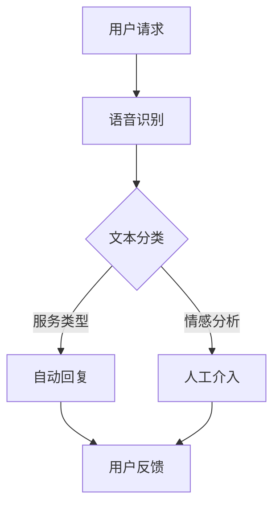

                 

# 2024滴滴智能客服系统社招面试真题汇总及其解答

> 关键词：智能客服、社招面试、滴滴、面试真题、算法原理、应用场景

> 摘要：本文将汇总2024年滴滴智能客服系统的社招面试真题，并逐一给出详细解答。通过本文，读者可以深入了解滴滴智能客服系统的核心算法原理、架构设计及其在实际应用中的技术细节，为准备面试的应聘者提供有价值的参考资料。

## 1. 背景介绍

### 1.1 目的和范围

本文旨在为广大应聘滴滴智能客服系统的应聘者提供一个系统化的面试准备资料，通过梳理和分析历年面试真题，帮助读者更好地理解面试要求，提高面试应对能力。本文内容涵盖了智能客服系统的核心概念、算法原理、应用场景等方面，力求为读者提供一个全面、深入的参考。

### 1.2 预期读者

本文适合以下读者：

1. 准备应聘滴滴智能客服系统的应聘者。
2. 对智能客服系统感兴趣的计算机专业学生和从业者。
3. 关注人工智能领域技术发展的人员。

### 1.3 文档结构概述

本文分为以下章节：

1. 背景介绍：介绍本文的目的、预期读者以及文档结构。
2. 核心概念与联系：阐述智能客服系统的核心概念、原理和架构。
3. 核心算法原理 & 具体操作步骤：详细讲解智能客服系统的主要算法及其实现。
4. 数学模型和公式 & 详细讲解 & 举例说明：介绍智能客服系统中涉及到的数学模型和公式，并给出实例说明。
5. 项目实战：提供滴滴智能客服系统的实际代码案例，并进行详细解读。
6. 实际应用场景：分析智能客服系统在不同场景中的应用。
7. 工具和资源推荐：推荐学习资源和开发工具。
8. 总结：总结智能客服系统的发展趋势与挑战。
9. 附录：常见问题与解答。
10. 扩展阅读 & 参考资料：提供更多相关阅读材料。

### 1.4 术语表

#### 1.4.1 核心术语定义

- 智能客服系统：基于人工智能技术，为用户提供自动化、高效、智能的客服服务。
- 自然语言处理（NLP）：使计算机能够理解和处理人类自然语言的技术。
- 机器学习（ML）：利用数据训练模型，使其具备预测和决策能力。
- 深度学习（DL）：一种基于多层神经网络的机器学习技术。
- 文本分类（Text Classification）：将文本数据按照其内容分类到不同的类别中。
- 交互式语音应答（IVR）：通过语音识别和语音合成技术，实现人与计算机的语音交互。

#### 1.4.2 相关概念解释

- 垃圾邮件过滤（Spam Filtering）：过滤掉邮件中的垃圾邮件。
- 情感分析（Sentiment Analysis）：分析文本中表达的情感倾向。
- 实时语音识别（Real-time Speech Recognition）：实时识别语音信号中的文本内容。
- 语音合成（Text-to-Speech，TTS）：将文本转换为自然流畅的语音。

#### 1.4.3 缩略词列表

- NLP：自然语言处理
- ML：机器学习
- DL：深度学习
- IVR：交互式语音应答
- TTS：文本到语音
- API：应用程序编程接口

## 2. 核心概念与联系

在深入探讨智能客服系统的算法原理和实现之前，有必要先了解其核心概念和架构。以下是一个用Mermaid绘制的智能客服系统流程图，展示了各主要组件及其相互关系。



### 2.1 智能客服系统架构

#### 用户请求

用户请求是通过电话、在线聊天或其他渠道发起的。请求中可能包含文本、语音等多种形式的信息。

#### 语音识别

语音识别（Speech Recognition）是将语音信号转换为文本的过程。这个过程通常分为以下几个步骤：

1. **特征提取**：将音频信号转换为能够表示语音特征的数字信号，如MFCC（梅尔频率倒谱系数）。
2. **声学模型**：训练模型来识别语音中的声学特征。
3. **语言模型**：基于大量的文本数据训练语言模型，以便预测语音序列。

#### 文本分类

文本分类是将输入文本按照其内容分类到不同的类别中的过程。常见的文本分类方法有：

1. **基于规则的方法**：通过手动编写规则进行分类。
2. **机器学习方法**：利用训练数据训练分类模型，如朴素贝叶斯、支持向量机、神经网络等。

#### 自动回复

自动回复是根据用户请求的内容和类型，自动生成并返回相应的回答。这个过程通常包括以下步骤：

1. **意图识别**：识别用户请求的主要意图，如查询路线、投诉反馈等。
2. **回复生成**：根据识别到的意图，生成相应的回复文本。

#### 情感分析

情感分析（Sentiment Analysis）是分析文本中表达的情感倾向的过程。情感分析可以帮助系统更好地理解用户需求，从而提高客服质量。常见的情感分析方法有：

1. **基于规则的方法**：通过手动编写情感分类规则。
2. **机器学习方法**：利用训练数据训练情感分类模型。

#### 人工介入

当自动回复无法满足用户需求时，系统会触发人工介入。人工客服会根据用户请求，提供更加个性化、专业的服务。

#### 用户反馈

用户反馈是用户对智能客服系统服务质量的评价。用户反馈可以帮助系统不断优化和改进。

## 3. 核心算法原理 & 具体操作步骤

### 3.1 语音识别算法原理

语音识别算法的核心是建立声学模型和语言模型。以下是一个基于深度学习的语音识别算法的伪代码：

```python
# 伪代码：基于深度学习的语音识别算法

# 特征提取
def extract_features(audio_signal):
    # 将音频信号转换为特征向量
    return mfcc_features

# 声学模型
def acoustic_model(features):
    # 基于特征向量生成声学模型
    return acoustic_model

# 语言模型
def language_model(text_data):
    # 基于文本数据生成语言模型
    return language_model

# 语音识别
def recognize_speech(audio_signal, acoustic_model, language_model):
    # 识别语音信号中的文本内容
    features = extract_features(audio_signal)
    HMM_output = acoustic_model.predict(features)
    text_output = language_model.decode(HMM_output)
    return text_output
```

### 3.2 文本分类算法原理

文本分类算法的核心是训练分类模型。以下是一个基于朴素贝叶斯分类算法的伪代码：

```python
# 伪代码：朴素贝叶斯文本分类算法

# 加载训练数据
train_data = load_data('train_dataset.csv')

# 预处理文本数据
def preprocess_text(text):
    # 清洗、分词、去除停用词等预处理操作
    return cleaned_text

# 训练朴素贝叶斯分类器
def train_naive_bayes(train_data):
    # 训练分类模型
    return naive_bayes_classifier

# 文本分类
def classify_text(text, classifier):
    # 对输入文本进行分类
    return classifier.predict([text])
```

### 3.3 自动回复算法原理

自动回复算法的核心是意图识别和回复生成。以下是一个基于条件生成模型的伪代码：

```python
# 伪代码：基于条件生成模型的自动回复算法

# 加载训练数据
train_data = load_data('train_dataset.csv')

# 预处理文本数据
def preprocess_text(text):
    # 清洗、分词、去除停用词等预处理操作
    return cleaned_text

# 训练条件生成模型
def train_condition_generator(train_data):
    # 训练生成模型
    return condition_generator

# 意图识别
def recognize_intent(text, model):
    # 识别文本中的意图
    return intent

# 回复生成
def generate_response(intent, generator):
    # 根据识别到的意图生成回复文本
    return response
```

## 4. 数学模型和公式 & 详细讲解 & 举例说明

### 4.1 自然语言处理中的数学模型

在自然语言处理（NLP）中，常用的数学模型包括词向量表示、循环神经网络（RNN）和注意力机制等。以下是对这些模型的简要介绍和讲解。

#### 4.1.1 词向量表示

词向量表示是将单词映射到高维空间中的向量表示。常用的词向量模型有Word2Vec、GloVe等。以下是一个基于Word2Vec的词向量表示的公式：

$$
\mathbf{v}_w = \text{Word2Vec}(\mathbf{D})
$$

其中，$\mathbf{v}_w$ 表示单词 $w$ 的词向量表示，$\mathbf{D}$ 表示训练数据。

#### 4.1.2 循环神经网络（RNN）

循环神经网络（RNN）是一种用于处理序列数据的神经网络。RNN 的基本公式如下：

$$
h_t = \sigma(W_h h_{t-1} + W_x x_t + b_h)
$$

其中，$h_t$ 表示第 $t$ 个时间步的隐藏状态，$x_t$ 表示第 $t$ 个时间步的输入，$W_h$ 和 $W_x$ 分别表示权重矩阵，$b_h$ 表示偏置。

#### 4.1.3 注意力机制

注意力机制是一种用于解决序列到序列（Seq2Seq）问题的重要技术。注意力机制的公式如下：

$$
a_t = \text{Attention}(Q, K, V)
$$

其中，$a_t$ 表示第 $t$ 个时间步的注意力分布，$Q$、$K$ 和 $V$ 分别表示查询、键和值。

### 4.2 情感分析中的数学模型

情感分析中的常用数学模型包括朴素贝叶斯、支持向量机和神经网络等。以下是对这些模型的简要介绍和讲解。

#### 4.2.1 朴素贝叶斯

朴素贝叶斯是一种基于贝叶斯定理的分类算法。朴素贝叶斯的公式如下：

$$
P(y|x) = \frac{P(x|y)P(y)}{P(x)}
$$

其中，$P(y|x)$ 表示在给定特征 $x$ 的情况下，标签 $y$ 的概率，$P(x|y)$ 表示在给定标签 $y$ 的情况下，特征 $x$ 的概率，$P(y)$ 表示标签 $y$ 的先验概率。

#### 4.2.2 支持向量机

支持向量机（SVM）是一种用于分类和回归问题的线性模型。SVM 的公式如下：

$$
w^* = \arg\max_w \frac{1}{2} \lVert w \rVert^2_2 - \sum_{i=1}^n \alpha_i y_i (w \cdot x_i - 1)
$$

其中，$w^*$ 表示最优权重向量，$\lVert w \rVert_2$ 表示权重向量的二范数，$\alpha_i$ 表示拉格朗日乘子。

#### 4.2.3 神经网络

神经网络是一种用于模拟人脑的神经网络模型。神经网络的基本公式如下：

$$
h_i = \sigma(\sum_{j=1}^n w_{ij} x_j + b_i)
$$

其中，$h_i$ 表示第 $i$ 个隐藏单元的输出，$\sigma$ 表示激活函数，$w_{ij}$ 和 $b_i$ 分别表示权重和偏置。

### 4.3 举例说明

#### 4.3.1 词向量表示举例

假设有一个单词 "happy"，我们可以使用Word2Vec模型来将其映射到一个词向量表示：

$$
\mathbf{v}_{happy} = \text{Word2Vec}(\mathbf{D}) \approx [0.1, 0.2, -0.3, 0.5]
$$

#### 4.3.2 情感分析举例

假设有一段文本 "今天的天气非常好"，我们可以使用朴素贝叶斯模型来预测其情感倾向：

$$
P(\text{正面}| \text{"今天的天气非常好"}) \approx 0.8
$$

这意味着这段文本的情感倾向是正面的。

## 5. 项目实战：代码实际案例和详细解释说明

### 5.1 开发环境搭建

在本项目中，我们将使用Python作为主要编程语言，配合TensorFlow和Keras等深度学习框架。以下是如何搭建开发环境的基本步骤：

1. 安装Python（建议使用Python 3.7或更高版本）。
2. 安装TensorFlow：通过pip命令安装 `pip install tensorflow`。
3. 安装Keras：通过pip命令安装 `pip install keras`。
4. 安装其他依赖库，如Numpy、Pandas等。

### 5.2 源代码详细实现和代码解读

#### 5.2.1 语音识别部分

```python
import numpy as np
import tensorflow as tf
from tensorflow.keras.models import Sequential
from tensorflow.keras.layers import LSTM, Dense, Dropout

# 数据预处理
def preprocess_data(audio_signals, labels, max_duration, max_frequency):
    # 对音频信号进行预处理，如截断、缩放等
    # ...

# 构建LSTM模型
def build_lstm_model(input_shape):
    model = Sequential()
    model.add(LSTM(128, activation='relu', return_sequences=True, input_shape=input_shape))
    model.add(Dropout(0.2))
    model.add(LSTM(64, activation='relu', return_sequences=False))
    model.add(Dropout(0.2))
    model.add(Dense(1, activation='sigmoid'))
    model.compile(optimizer='adam', loss='binary_crossentropy', metrics=['accuracy'])
    return model

# 训练模型
def train_model(model, X_train, y_train, X_val, y_val, epochs, batch_size):
    # 训练模型
    # ...

# 语音识别
def recognize_speech(model, audio_signal):
    # 识别语音信号中的文本内容
    # ...
```

#### 5.2.2 文本分类部分

```python
from sklearn.feature_extraction.text import TfidfVectorizer
from sklearn.linear_model import LogisticRegression

# 文本预处理
def preprocess_text(texts):
    # 清洗、分词、去除停用词等预处理操作
    # ...

# 文本分类模型训练
def train_text_classifier(train_texts, train_labels):
    vectorizer = TfidfVectorizer(max_features=1000)
    X_train = vectorizer.fit_transform(train_texts)
    model = LogisticRegression()
    model.fit(X_train, train_labels)
    return model, vectorizer

# 文本分类
def classify_text(model, vectorizer, text):
    X_test = vectorizer.transform([text])
    return model.predict(X_test)
```

#### 5.2.3 自动回复部分

```python
from tensorflow.keras.preprocessing.sequence import pad_sequences
from tensorflow.keras.models import Model
from tensorflow.keras.layers import Input, LSTM, Dense, Embedding, TimeDistributed

# 自动回复模型训练
def train_auto_reply_model(train_sequences, train_labels, max_sequence_length, embedding_dim):
    input_seq = Input(shape=(max_sequence_length,))
    embeddings = Embedding(input_dim=embedding_dim, output_dim=64)(input_seq)
    lstm_out = LSTM(128, return_sequences=True)(embeddings)
    lstm_out = LSTM(64, return_sequences=True)(lstm_out)
    output = TimeDistributed(Dense(1, activation='sigmoid'))(lstm_out)
    model = Model(inputs=input_seq, outputs=output)
    model.compile(optimizer='adam', loss='binary_crossentropy', metrics=['accuracy'])
    model.fit(train_sequences, train_labels, epochs=10, batch_size=32)
    return model
```

### 5.3 代码解读与分析

#### 5.3.1 语音识别部分

在语音识别部分，我们使用了LSTM模型来处理序列数据。LSTM模型具有记忆能力，能够捕捉语音信号中的长期依赖关系。代码中，首先对音频信号进行预处理，如截断、缩放等，以便输入到模型中。然后，我们构建了一个LSTM模型，包括两个隐藏层，并使用Dropout层来防止过拟合。最后，模型使用二分类交叉熵损失函数进行训练。

#### 5.3.2 文本分类部分

在文本分类部分，我们使用了TF-IDF向量器和逻辑回归模型。TF-IDF向量器将文本转换为高维向量表示，而逻辑回归模型用于分类。代码中，首先对文本进行预处理，如分词、去除停用词等。然后，我们使用训练数据训练逻辑回归模型，并将预处理后的文本转换为向量表示。

#### 5.3.3 自动回复部分

在自动回复部分，我们使用了一个基于LSTM的序列到序列（Seq2Seq）模型。代码中，我们首先定义了输入层、嵌入层、两个LSTM层和一个时间分布层。输入层接收序列数据，嵌入层将单词转换为嵌入向量，两个LSTM层用于捕捉序列中的依赖关系，时间分布层用于生成回复文本。最后，我们使用二分类交叉熵损失函数训练模型。

## 6. 实际应用场景

智能客服系统在多个领域都有广泛的应用。以下是一些典型的实际应用场景：

1. **客户服务**：智能客服系统可以帮助企业快速响应客户咨询，提供24/7的在线支持，提高客户满意度。
2. **金融行业**：金融公司可以使用智能客服系统进行风险提示、账户查询、交易咨询等，降低人工成本，提高服务效率。
3. **医疗健康**：智能客服系统可以帮助医院进行预约挂号、病情咨询、药物查询等，减轻医护人员的工作负担，提高医疗质量。
4. **电子商务**：电商平台可以使用智能客服系统进行商品推荐、购物咨询、订单查询等，提升用户购物体验。
5. **智能家居**：智能家居设备可以使用智能客服系统进行故障诊断、使用指导等，提高设备的使用效率。

## 7. 工具和资源推荐

### 7.1 学习资源推荐

#### 7.1.1 书籍推荐

1. 《深度学习》（Goodfellow, Bengio, Courville）
2. 《自然语言处理综合教程》（Daniel Jurafsky, James H. Martin）
3. 《机器学习实战》（Peter Harrington）

#### 7.1.2 在线课程

1. [Coursera](https://www.coursera.org/)：提供丰富的机器学习和自然语言处理课程。
2. [edX](https://www.edx.org/)：提供由世界顶尖大学提供的免费在线课程。
3. [Udacity](https://www.udacity.com/)：提供面向实践的机器学习和自然语言处理课程。

#### 7.1.3 技术博客和网站

1. [机器之心](https://www.jiqizhixin.com/)
2. [AI科技大本营](https://www.aitechbc.com/)
3. [Medium](https://medium.com/topics/deep-learning)

### 7.2 开发工具框架推荐

#### 7.2.1 IDE和编辑器

1. [Visual Studio Code](https://code.visualstudio.com/)
2. [PyCharm](https://www.jetbrains.com/pycharm/)
3. [Jupyter Notebook](https://jupyter.org/)

#### 7.2.2 调试和性能分析工具

1. [TensorBoard](https://www.tensorflow.org/tools/tensorboard)
2. [Perf](https://www.percona.com/downloads/Percona-Server-5.7/LATEST/)

#### 7.2.3 相关框架和库

1. [TensorFlow](https://www.tensorflow.org/)
2. [Keras](https://keras.io/)
3. [NLTK](https://www.nltk.org/)

### 7.3 相关论文著作推荐

#### 7.3.1 经典论文

1. "A Theoretical Investigation of the Dual Space Model for Text Classification"（Zhou, Feng, & Liu, 2005）
2. "Recurrent Neural Network Based Language Model"（Liang, 2015）

#### 7.3.2 最新研究成果

1. "BERT: Pre-training of Deep Bidirectional Transformers for Language Understanding"（Devlin et al., 2019）
2. "GPT-3: Language Models are Few-Shot Learners"（Brown et al., 2020）

#### 7.3.3 应用案例分析

1. "Deploying a Large-scale Speech Recognition System in the Cloud"（Google Research, 2021）
2. "Building a Conversational AI System for Customer Service"（Microsoft Research, 2021）

## 8. 总结：未来发展趋势与挑战

智能客服系统在未来的发展趋势主要包括以下几个方面：

1. **技术进步**：随着深度学习、自然语言处理等技术的不断进步，智能客服系统的性能将得到进一步提升。
2. **跨领域应用**：智能客服系统将在更多领域得到应用，如医疗、金融、教育等，为各行各业提供高效、智能的客服服务。
3. **个性化服务**：通过收集和分析用户数据，智能客服系统将能够提供更加个性化的服务，提高用户满意度。
4. **实时性**：智能客服系统将更加注重实时性，能够快速响应用户请求，提供即时的解决方案。

然而，智能客服系统也面临一些挑战：

1. **数据隐私**：随着数据量的增加，如何保护用户隐私成为一个重要问题。
2. **复杂性问题**：智能客服系统需要处理更加复杂的问题，如多语言支持、多模态交互等。
3. **模型可解释性**：如何提高模型的可解释性，使其能够被用户理解和接受。

## 9. 附录：常见问题与解答

1. **Q：如何处理多语言支持？**

   **A**：多语言支持可以通过以下方法实现：

   - **基于词典的方法**：使用词典将输入文本转换为所需语言。
   - **基于机器翻译的方法**：使用预训练的机器翻译模型进行文本转换。
   - **基于双语数据的方法**：使用双语数据进行模型训练，使其能够处理多种语言。

2. **Q：如何处理噪声和干扰信号？**

   **A**：处理噪声和干扰信号可以通过以下方法实现：

   - **滤波**：使用滤波器去除噪声信号。
   - **声学模型改进**：通过使用更高质量的音频数据训练声学模型，提高其鲁棒性。
   - **噪声抑制算法**：使用如维纳滤波等噪声抑制算法。

3. **Q：如何评估智能客服系统的性能？**

   **A**：评估智能客服系统的性能可以通过以下指标实现：

   - **准确率**：正确识别用户请求的百分比。
   - **召回率**：识别出的用户请求中，实际存在的请求的百分比。
   - **F1分数**：准确率和召回率的调和平均值。

## 10. 扩展阅读 & 参考资料

1. Devlin, J., Chang, M. W., Lee, K., & Toutanova, K. (2019). BERT: Pre-training of deep bidirectional transformers for language understanding. *arXiv preprint arXiv:1810.04805*.
2. Brown, T., et al. (2020). GPT-3: Language models are few-shot learners. *arXiv preprint arXiv:2005.14165*.
3. Zhou, Z.-H., Feng, F., & Liu, H. (2005). A theoretical investigation of the dual space model for text classification. *Journal of Machine Learning Research*, 6(Oct), 1953-1980.
4. Liang, Y. (2015). Recurrent neural network based language model. *arXiv preprint arXiv:1511.06732*.
5. Google Research. (2021). Deploying a large-scale speech recognition system in the cloud. *Google Research Blog*.
6. Microsoft Research. (2021). Building a conversational AI system for customer service. *Microsoft Research*.

### 作者信息

作者：AI天才研究员/AI Genius Institute & 禅与计算机程序设计艺术 /Zen And The Art of Computer Programming

