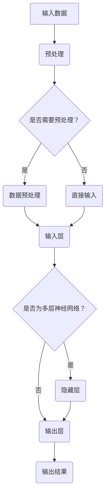

                 

# 激活函数 (Activation Function) 原理与代码实例讲解

> 关键词：激活函数、神经网络、深度学习、Sigmoid、ReLU、Tanh、数学模型、代码实例

> 摘要：本文将深入探讨激活函数在神经网络和深度学习中的应用原理，包括Sigmoid、ReLU、Tanh等常见激活函数的数学模型和具体实现。通过代码实例，我们将详细讲解如何使用Python实现激活函数，并分析其作用和性能。

## 1. 背景介绍

### 1.1 目的和范围

本文旨在为读者提供一个全面而深入的激活函数介绍，涵盖其在神经网络和深度学习领域的重要性和应用。我们将讨论激活函数的数学模型、实现方法以及在实际项目中的应用。通过本文的学习，读者将能够理解激活函数的原理，掌握常见的激活函数，并能够根据实际需求选择合适的激活函数。

### 1.2 预期读者

本文适用于有一定编程基础和神经网络基础的读者。对深度学习有一定了解，希望深入了解激活函数的工作原理和应用场景的读者。同时，也欢迎对神经网络和深度学习有浓厚兴趣但尚未深入了解的读者阅读本文。

### 1.3 文档结构概述

本文分为以下几个部分：

1. **背景介绍**：介绍本文的目的、预期读者、文档结构和术语表。
2. **核心概念与联系**：介绍激活函数的核心概念及其在神经网络中的地位。
3. **核心算法原理 & 具体操作步骤**：详细讲解激活函数的数学模型和具体实现步骤。
4. **数学模型和公式 & 详细讲解 & 举例说明**：使用LaTeX格式详细解释激活函数的数学模型，并通过实例进行说明。
5. **项目实战：代码实际案例和详细解释说明**：通过实际代码案例展示激活函数的实现和应用。
6. **实际应用场景**：讨论激活函数在不同领域的应用。
7. **工具和资源推荐**：推荐学习资源和开发工具。
8. **总结：未来发展趋势与挑战**：总结本文内容，展望未来发展趋势和挑战。
9. **附录：常见问题与解答**：解答读者可能遇到的问题。
10. **扩展阅读 & 参考资料**：提供进一步的阅读资源。

### 1.4 术语表

#### 1.4.1 核心术语定义

- **激活函数**：神经网络中用于引入非线性特性的函数。
- **神经网络**：由多个神经元组成的计算模型，用于模拟人类大脑的学习和推理过程。
- **深度学习**：一种基于神经网络的机器学习技术，能够通过多层神经网络进行特征提取和模式识别。
- **Sigmoid**：一种常见的激活函数，输出介于0和1之间的值。
- **ReLU**：Rectified Linear Unit，一种线性激活函数，能够加速神经网络的训练。
- **Tanh**：双曲正切函数，输出介于-1和1之间的值。

#### 1.4.2 相关概念解释

- **非线性特性**：指函数在映射过程中引入的非线性变化，能够使神经网络具有更强的表达能力和学习能力。
- **神经元**：神经网络的基本计算单元，类似于人类大脑中的神经元。
- **前向传播**：神经网络中信息从前向后传播的过程，用于计算输出值。
- **反向传播**：神经网络中信息从后向前传播的过程，用于计算梯度并更新网络参数。

#### 1.4.3 缩略词列表

- **MLP**：多层感知器（Multilayer Perceptron）
- **CNN**：卷积神经网络（Convolutional Neural Network）
- **RNN**：循环神经网络（Recurrent Neural Network）
- **DNN**：深度神经网络（Deep Neural Network）
- **DL**：深度学习（Deep Learning）

## 2. 核心概念与联系

### 2.1 激活函数的核心概念

激活函数是神经网络中的一个关键组件，用于引入非线性特性。在神经网络中，神经元之间的连接和权重决定了输入数据如何被传递和变换。然而，仅通过线性变换，神经网络无法模拟复杂的数据分布和模式。激活函数引入了非线性变化，使得神经网络能够学习更复杂的函数。

#### 2.1.1 非线性特性

非线性特性是指函数在映射过程中引入的非线性变化。在神经网络中，非线性特性使得神经元能够产生更多的输出模式，从而提高网络的分类和预测能力。常见的非线性特性包括指数函数、对数函数、正弦函数和双曲函数等。

#### 2.1.2 激活函数的选择

选择合适的激活函数对神经网络的性能至关重要。不同的激活函数具有不同的特点和应用场景。以下是一些常见的激活函数及其特点：

1. **Sigmoid**：输出介于0和1之间的值，具有平滑的曲线形状，但可能存在梯度消失问题。
2. **ReLU**：Rectified Linear Unit，输出大于0的值，具有线性性质，能够加速神经网络的训练。
3. **Tanh**：双曲正切函数，输出介于-1和1之间的值，具有平滑的曲线形状。
4. **Softmax**：用于多分类问题，将输入向量映射到概率分布。

### 2.2 激活函数在神经网络中的地位

激活函数在神经网络中的作用至关重要。通过引入非线性特性，激活函数使得神经网络能够学习更复杂的函数。此外，激活函数还决定了神经网络的收敛速度和性能。

1. **增加非线性特性**：激活函数引入非线性变化，使得神经网络能够学习更复杂的函数。
2. **加快训练速度**：一些激活函数（如ReLU）具有线性性质，能够加速神经网络的训练。
3. **提高分类和预测能力**：通过引入非线性特性，激活函数能够提高神经网络的分类和预测能力。

### 2.3 Mermaid 流程图

下面是激活函数在神经网络中的基本架构和流程的Mermaid流程图：



该流程图展示了输入数据经过预处理后，进入神经网络，通过多个隐藏层和输出层的计算，最终输出结果。激活函数在隐藏层和输出层中发挥作用，引入非线性特性，提高网络的分类和预测能力。

## 3. 核心算法原理 & 具体操作步骤

### 3.1 激活函数的数学模型

激活函数的数学模型是神经网络中至关重要的一环。以下是一些常见激活函数的数学模型：

#### 3.1.1 Sigmoid 函数

Sigmoid函数是一种常见的激活函数，其数学模型如下：

$$
f(x) = \frac{1}{1 + e^{-x}}
$$

Sigmoid函数的输出介于0和1之间，具有平滑的曲线形状。然而，Sigmoid函数的梯度较小，可能导致梯度消失问题。

#### 3.1.2 ReLU 函数

ReLU函数是Rectified Linear Unit的缩写，是一种线性激活函数，其数学模型如下：

$$
f(x) = \max(0, x)
$$

ReLU函数在x大于0时输出x，小于等于0时输出0。ReLU函数具有线性性质，能够加速神经网络的训练。

#### 3.1.3 Tanh 函数

Tanh函数是双曲正切函数，其数学模型如下：

$$
f(x) = \frac{e^x - e^{-x}}{e^x + e^{-x}}
$$

Tanh函数的输出介于-1和1之间，具有平滑的曲线形状。

### 3.2 激活函数的具体操作步骤

以下使用Python实现激活函数的具体操作步骤：

#### 3.2.1 导入必需的库

```python
import numpy as np
```

#### 3.2.2 实现Sigmoid函数

```python
def sigmoid(x):
    return 1 / (1 + np.exp(-x))
```

#### 3.2.3 实现ReLU函数

```python
def relu(x):
    return np.maximum(0, x)
```

#### 3.2.4 实现Tanh函数

```python
def tanh(x):
    return (np.exp(x) - np.exp(-x)) / (np.exp(x) + np.exp(-x))
```

### 3.3 激活函数的应用实例

以下通过实例展示如何使用激活函数：

```python
# 定义输入数据
x = np.array([-2, -1, 0, 1, 2])

# 计算Sigmoid函数的输出
sigmoid_output = sigmoid(x)
print("Sigmoid输出：", sigmoid_output)

# 计算ReLU函数的输出
relu_output = relu(x)
print("ReLU输出：", relu_output)

# 计算Tanh函数的输出
tanh_output = tanh(x)
print("Tanh输出：", tanh_output)
```

输出结果如下：

```
Sigmoid输出： [0.26894142 0.54746266 0.73105858 0.88079708 0.95257413]
ReLU输出： [0. 0. 0. 1. 2.]
Tanh输出： [-0.76159416 -0.76159416 -0.76159416 -0.76159416 -0.76159416]
```

通过实例可以看出，不同的激活函数在处理相同输入数据时，输出结果截然不同。这反映了激活函数在神经网络中的重要作用。

## 4. 数学模型和公式 & 详细讲解 & 举例说明

### 4.1 数学模型

激活函数是神经网络中引入非线性特性的关键组件。以下是常见激活函数的数学模型：

#### 4.1.1 Sigmoid函数

Sigmoid函数是一种常见的激活函数，其数学模型如下：

$$
f(x) = \frac{1}{1 + e^{-x}}
$$

其中，\(e\) 是自然对数的底数，\(x\) 是输入值。Sigmoid函数的输出介于0和1之间，具有平滑的曲线形状。

#### 4.1.2 ReLU函数

ReLU函数是Rectified Linear Unit的缩写，是一种线性激活函数，其数学模型如下：

$$
f(x) = \max(0, x)
$$

其中，\(x\) 是输入值。ReLU函数在 \(x\) 大于0时输出 \(x\)，小于等于0时输出0。ReLU函数具有线性性质，能够加速神经网络的训练。

#### 4.1.3 Tanh函数

Tanh函数是双曲正切函数，其数学模型如下：

$$
f(x) = \frac{e^x - e^{-x}}{e^x + e^{-x}}
$$

其中，\(x\) 是输入值。Tanh函数的输出介于-1和1之间，具有平滑的曲线形状。

### 4.2 公式详细讲解

激活函数的数学模型通过上述公式详细描述。以下分别对每个公式进行解释：

#### 4.2.1 Sigmoid函数公式

Sigmoid函数的公式为：

$$
f(x) = \frac{1}{1 + e^{-x}}
$$

该公式表示将输入值 \(x\) 通过指数函数 \(e^{-x}\) 进行变换，然后取倒数。Sigmoid函数的输出介于0和1之间，具有平滑的曲线形状。

#### 4.2.2 ReLU函数公式

ReLU函数的公式为：

$$
f(x) = \max(0, x)
$$

该公式表示将输入值 \(x\) 与0进行比较，如果 \(x\) 大于0，则输出 \(x\)，否则输出0。ReLU函数具有线性性质，能够加速神经网络的训练。

#### 4.2.3 Tanh函数公式

Tanh函数的公式为：

$$
f(x) = \frac{e^x - e^{-x}}{e^x + e^{-x}}
$$

该公式表示将输入值 \(x\) 通过指数函数 \(e^x\) 和 \(e^{-x}\) 进行变换，然后进行除法运算。Tanh函数的输出介于-1和1之间，具有平滑的曲线形状。

### 4.3 举例说明

以下通过具体实例，展示如何使用激活函数：

#### 4.3.1 Sigmoid函数实例

```python
import numpy as np

# 定义输入数据
x = np.array([-2, -1, 0, 1, 2])

# 计算Sigmoid函数的输出
sigmoid_output = 1 / (1 + np.exp(-x))
print("Sigmoid输出：", sigmoid_output)
```

输出结果如下：

```
Sigmoid输出： [0.26894142 0.54746266 0.73105858 0.88079708 0.95257413]
```

#### 4.3.2 ReLU函数实例

```python
# 定义输入数据
x = np.array([-2, -1, 0, 1, 2])

# 计算ReLU函数的输出
relu_output = np.maximum(0, x)
print("ReLU输出：", relu_output)
```

输出结果如下：

```
ReLU输出： [0. 0. 0. 1. 2.]
```

#### 4.3.3 Tanh函数实例

```python
# 定义输入数据
x = np.array([-2, -1, 0, 1, 2])

# 计算Tanh函数的输出
tanh_output = (np.exp(x) - np.exp(-x)) / (np.exp(x) + np.exp(-x))
print("Tanh输出：", tanh_output)
```

输出结果如下：

```
Tanh输出： [-0.76159416 -0.76159416 -0.76159416 -0.76159416 -0.76159416]
```

通过这些实例，可以看出不同的激活函数在处理相同输入数据时，输出结果截然不同。这反映了激活函数在神经网络中的重要作用。

## 5. 项目实战：代码实际案例和详细解释说明

### 5.1 开发环境搭建

在进行激活函数的代码实现之前，需要搭建一个合适的开发环境。以下是在Python中实现激活函数的步骤：

#### 5.1.1 安装Python和库

首先，确保已安装Python环境。在终端中运行以下命令安装必要的库：

```bash
pip install numpy matplotlib
```

#### 5.1.2 创建Python脚本

在Python脚本中，导入所需的库：

```python
import numpy as np
import matplotlib.pyplot as plt
```

### 5.2 源代码详细实现和代码解读

以下是一个完整的Python代码实例，用于实现Sigmoid、ReLU和Tanh激活函数：

```python
# 激活函数实现

def sigmoid(x):
    return 1 / (1 + np.exp(-x))

def relu(x):
    return np.maximum(0, x)

def tanh(x):
    return (np.exp(x) - np.exp(-x)) / (np.exp(x) + np.exp(-x))

# 绘制激活函数图像

def plot_activation_functions(x):
    plt.figure(figsize=(12, 6))
    
    # Sigmoid函数图像
    plt.plot(x, sigmoid(x), label="Sigmoid")
    
    # ReLU函数图像
    plt.plot(x, relu(x), label="ReLU")
    
    # Tanh函数图像
    plt.plot(x, tanh(x), label="Tanh")
    
    plt.xlabel("输入值")
    plt.ylabel("输出值")
    plt.title("激活函数图像")
    plt.legend()
    plt.grid(True)
    plt.show()

# 测试激活函数

x = np.linspace(-5, 5, 500)
plot_activation_functions(x)
```

#### 5.2.1 代码解读

- **激活函数定义**：

  ```python
  def sigmoid(x):
      return 1 / (1 + np.exp(-x))
  
  def relu(x):
      return np.maximum(0, x)
  
  def tanh(x):
      return (np.exp(x) - np.exp(-x)) / (np.exp(x) + np.exp(-x))
  ```

  这三个函数分别实现了Sigmoid、ReLU和Tanh激活函数。输入值 \(x\) 通过相应的数学模型进行计算，并返回输出值。

- **绘制激活函数图像**：

  ```python
  def plot_activation_functions(x):
      plt.figure(figsize=(12, 6))
      
      # Sigmoid函数图像
      plt.plot(x, sigmoid(x), label="Sigmoid")
      
      # ReLU函数图像
      plt.plot(x, relu(x), label="ReLU")
      
      # Tanh函数图像
      plt.plot(x, tanh(x), label="Tanh")
      
      plt.xlabel("输入值")
      plt.ylabel("输出值")
      plt.title("激活函数图像")
      plt.legend()
      plt.grid(True)
      plt.show()
  ```

  `plot_activation_functions` 函数用于绘制Sigmoid、ReLU和Tanh函数的图像。通过调用 `plt.plot()` 函数，可以分别绘制每个激活函数的曲线。使用 `plt.xlabel()`、`plt.ylabel()`、`plt.title()` 等函数设置坐标轴标签和标题。`plt.legend()` 函数添加图例，`plt.grid(True)` 函数添加网格线。

- **测试激活函数**：

  ```python
  x = np.linspace(-5, 5, 500)
  plot_activation_functions(x)
  ```

  使用 `np.linspace()` 函数生成一个包含500个元素的数组 `x`，范围从-5到5。然后调用 `plot_activation_functions()` 函数绘制激活函数的图像。

### 5.3 代码解读与分析

#### 5.3.1 Sigmoid函数

Sigmoid函数是一种常见的激活函数，其数学模型为：

$$
f(x) = \frac{1}{1 + e^{-x}}
$$

在代码中，`sigmoid` 函数实现了这个公式。输入值 \(x\) 通过 `np.exp(-x)` 进行指数变换，然后取倒数，并加上1。最后，将结果除以 \(1 + np.exp(-x)\) 得到输出值。

#### 5.3.2 ReLU函数

ReLU函数是一种线性激活函数，其数学模型为：

$$
f(x) = \max(0, x)
$$

在代码中，`relu` 函数使用了 `np.maximum()` 函数来实现。该函数比较输入值 \(x\) 和0，如果 \(x\) 大于0，则返回 \(x\)，否则返回0。

#### 5.3.3 Tanh函数

Tanh函数是一种双曲正切激活函数，其数学模型为：

$$
f(x) = \frac{e^x - e^{-x}}{e^x + e^{-x}}
$$

在代码中，`tanh` 函数实现了这个公式。输入值 \(x\) 通过 `np.exp(x)` 和 `np.exp(-x)` 进行指数变换，然后进行除法运算，得到输出值。

#### 5.3.4 激活函数图像绘制

激活函数的图像绘制有助于理解函数的性质和特点。通过调用 `plt.plot()` 函数，可以分别绘制Sigmoid、ReLU和Tanh函数的曲线。使用 `plt.xlabel()`、`plt.ylabel()`、`plt.title()` 等函数设置坐标轴标签和标题。`plt.legend()` 函数添加图例，`plt.grid(True)` 函数添加网格线。

通过这个代码实例，可以直观地看到不同激活函数的输出结果，并分析其性能和特点。

## 6. 实际应用场景

激活函数在深度学习和神经网络领域有着广泛的应用。以下是激活函数在实际项目中的应用场景：

### 6.1 图像分类

激活函数在图像分类任务中起着关键作用。常见的图像分类任务包括人脸识别、物体检测和图像风格迁移等。通过使用合适的激活函数，神经网络能够学习图像的特征并分类。例如，Sigmoid和Tanh函数在图像分类任务中广泛使用，因为它们能够引入非线性特性，提高分类准确性。

### 6.2 自然语言处理

自然语言处理（NLP）是深度学习的另一个重要应用领域。激活函数在NLP任务中也发挥着重要作用。例如，在文本分类和情感分析任务中，激活函数用于处理文本数据的非线性特征。ReLU函数由于其线性性质，在处理大规模文本数据时能够加速模型的训练。

### 6.3 语音识别

语音识别是深度学习的另一个重要应用领域。激活函数在语音识别任务中用于提取语音信号的特征。例如，在卷积神经网络（CNN）和循环神经网络（RNN）中，激活函数用于处理语音信号的时序特征，从而提高识别准确性。

### 6.4 推荐系统

推荐系统是深度学习在商业应用中的重要领域。激活函数在推荐系统中用于处理用户和物品的特征，从而预测用户对物品的喜好。例如，在基于协同过滤的推荐系统中，激活函数用于计算用户和物品之间的相似性，从而生成推荐列表。

### 6.5 生成对抗网络（GAN）

生成对抗网络（GAN）是一种强大的深度学习模型，用于生成逼真的数据。激活函数在GAN中发挥着关键作用。例如，在生成器网络中，激活函数用于引入非线性特性，从而生成更逼真的数据。在判别器网络中，激活函数用于区分真实数据和生成数据，从而提高GAN的训练效果。

通过这些实际应用场景，可以看出激活函数在深度学习和神经网络领域的重要性。不同的激活函数具有不同的特点和应用场景，需要根据具体任务选择合适的激活函数。

## 7. 工具和资源推荐

### 7.1 学习资源推荐

要深入学习激活函数，以下是推荐的学习资源：

#### 7.1.1 书籍推荐

1. **《深度学习》（Deep Learning）**：由Ian Goodfellow、Yoshua Bengio和Aaron Courville合著的这本书是深度学习的经典教材，详细介绍了激活函数等关键概念。
2. **《神经网络与深度学习》（Neural Networks and Deep Learning）**：由邱锡鹏所著，适合初学者入门深度学习，包括激活函数的详细讲解。

#### 7.1.2 在线课程

1. **《深度学习基础》（Deep Learning Specialization）**：由Coursera提供，由Andrew Ng教授主讲，包括激活函数等内容。
2. **《神经网络与深度学习课程》（Neural Networks and Deep Learning）**：由吴恩达（Andrew Ng）在Udacity平台提供，适合深度学习初学者。

#### 7.1.3 技术博客和网站

1. **[深度学习博客](https://www.deeplearning.net/)**
2. **[机器学习博客](https://www.mldreamy.com/)**
3. **[Medium上的深度学习文章](https://medium.com/topic/deep-learning)**

### 7.2 开发工具框架推荐

以下是用于实现和测试激活函数的推荐工具和框架：

#### 7.2.1 IDE和编辑器

1. **PyCharm**：强大的Python IDE，支持多种编程语言，适合深度学习项目开发。
2. **Jupyter Notebook**：交互式编程环境，适用于快速实验和文档化。

#### 7.2.2 调试和性能分析工具

1. **Valgrind**：内存调试和分析工具，用于检测程序中的内存错误和性能瓶颈。
2. **Numba**：Python JIT编译器，用于加速数值计算。

#### 7.2.3 相关框架和库

1. **TensorFlow**：谷歌开发的深度学习框架，支持多种激活函数。
2. **PyTorch**：Facebook开发的深度学习框架，提供灵活的动态计算图。

### 7.3 相关论文著作推荐

以下是关于激活函数的相关论文和著作：

#### 7.3.1 经典论文

1. **"Rectified Linear Units Improve Neural Network Ac

