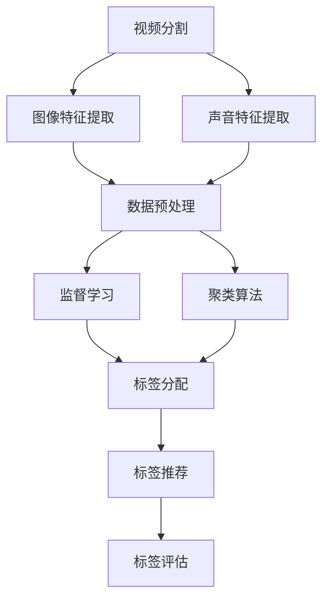

                 

# 爱奇艺2024视频内容标签化校招机器学习面试题解析

> 关键词：爱奇艺、视频内容标签化、机器学习面试题、算法原理、实践案例

> 摘要：本文将深入探讨爱奇艺2024校招机器学习面试题中关于视频内容标签化的相关内容。通过解析核心算法原理、数学模型及其具体操作步骤，结合实际代码案例分析，帮助读者理解并掌握视频内容标签化的关键技术和方法。同时，本文还将探讨该技术在实际应用场景中的重要性，并提供相关的学习资源和工具推荐，为未来发展趋势与挑战提供前瞻性思考。

## 1. 背景介绍

### 1.1 目的和范围

本文旨在帮助机器学习面试者深入理解爱奇艺2024校招中关于视频内容标签化的面试题。我们将从以下几个方面展开讨论：

- **核心算法原理**：讲解视频内容标签化的关键算法及其原理。
- **数学模型和公式**：详细介绍支持向量机、聚类算法等核心数学模型，并举例说明。
- **项目实战**：通过实际代码案例，展示视频内容标签化的具体实现过程。
- **实际应用场景**：探讨视频内容标签化在爱奇艺平台上的应用及其重要性。
- **工具和资源推荐**：推荐相关学习资源、开发工具和框架。

### 1.2 预期读者

本文主要面向以下读者群体：

- 参加爱奇艺2024校招的机器学习面试者。
- 对视频内容标签化技术感兴趣的机器学习研究者。
- 希望提升自己在视频分析领域技能的从业者。

### 1.3 文档结构概述

本文将按照以下结构展开：

- **第1章 背景介绍**：介绍本文目的、范围、预期读者和文档结构。
- **第2章 核心概念与联系**：讲解视频内容标签化的核心概念、原理和架构。
- **第3章 核心算法原理 & 具体操作步骤**：详细阐述关键算法原理和操作步骤。
- **第4章 数学模型和公式 & 详细讲解 & 举例说明**：介绍相关数学模型和公式，并举例说明。
- **第5章 项目实战：代码实际案例和详细解释说明**：展示实际代码案例，并进行详细解释。
- **第6章 实际应用场景**：探讨视频内容标签化在实际应用中的重要性。
- **第7章 工具和资源推荐**：推荐相关学习资源和开发工具。
- **第8章 总结：未来发展趋势与挑战**：对视频内容标签化技术的未来进行前瞻性思考。
- **第9章 附录：常见问题与解答**：回答读者可能遇到的常见问题。
- **第10章 扩展阅读 & 参考资料**：提供进一步学习的相关资源和文献。

### 1.4 术语表

#### 1.4.1 核心术语定义

- **视频内容标签化**：将视频内容自动分类和标注为不同的标签，以便于检索、推荐和个性化服务。
- **机器学习**：一种基于数据和学习算法的计算机技术，用于从数据中提取模式并做出决策。
- **支持向量机**：一种监督学习算法，用于分类和回归任务。
- **聚类算法**：一种无监督学习算法，用于将数据分为不同的簇。
- **推荐系统**：一种基于用户历史行为和偏好，为用户提供个性化推荐的系统。

#### 1.4.2 相关概念解释

- **特征提取**：从原始数据中提取出对目标问题有帮助的、具有区分性的特征。
- **模型训练**：使用训练数据集，通过优化算法找到模型的参数。
- **模型评估**：通过验证数据集评估模型的性能和泛化能力。

#### 1.4.3 缩略词列表

- **AI**：人工智能
- **ML**：机器学习
- **SVM**：支持向量机
- **K-means**：K-均值聚类算法
- **CNN**：卷积神经网络

## 2. 核心概念与联系

在视频内容标签化过程中，我们需要关注以下几个核心概念和它们之间的联系：

### 2.1 视频内容分析

视频内容分析是视频内容标签化的第一步，主要包括以下几个方面：

- **视频分割**：将视频分为不同的片段，以便于进一步分析。
- **图像特征提取**：从视频帧中提取图像特征，如颜色、纹理、形状等。
- **声音特征提取**：从视频中提取声音特征，如音调、音量、节奏等。

### 2.2 数据预处理

数据预处理是保证模型性能和训练效果的重要环节，主要包括以下几个方面：

- **数据清洗**：去除数据中的噪声和异常值。
- **数据归一化**：将数据缩放到相同的范围，如0到1之间。
- **数据增强**：通过图像旋转、缩放、裁剪等方法增加数据多样性。

### 2.3 标签分配

标签分配是视频内容标签化的核心步骤，主要包括以下几个方面：

- **监督学习**：使用已标注的数据集训练分类模型，如支持向量机（SVM）、卷积神经网络（CNN）等。
- **聚类算法**：使用无监督学习方法，将相似的视频分为不同的标签。
- **标签融合**：结合不同算法的结果，生成最终的标签。

### 2.4 标签推荐

标签推荐是视频内容标签化的重要应用场景，主要包括以下几个方面：

- **基于内容的推荐**：根据视频内容和标签，为用户推荐类似的视频。
- **基于用户的推荐**：根据用户的历史观看记录和偏好，为用户推荐感兴趣的视频。
- **混合推荐**：结合基于内容和基于用户的方法，为用户提供更加个性化的推荐。

### 2.5 标签评估

标签评估是确保视频内容标签化效果的重要环节，主要包括以下几个方面：

- **准确率**：标签与实际内容的一致性程度。
- **召回率**：能够正确识别出的标签数量占总标签数量的比例。
- **F1值**：准确率和召回率的调和平均值。

### 2.6 Mermaid 流程图

以下是一个简化的视频内容标签化的 Mermaid 流程图：



## 3. 核心算法原理 & 具体操作步骤

在视频内容标签化过程中，核心算法包括支持向量机（SVM）、卷积神经网络（CNN）和聚类算法（如K-means）。下面我们将分别介绍这些算法的原理和具体操作步骤。

### 3.1 支持向量机（SVM）

#### 3.1.1 算法原理

支持向量机（SVM）是一种二分类模型，其基本原理是通过找到一个最优的超平面，将不同类别的数据点分隔开。SVM的目标是最小化决策边界上的分类间隔，从而提高模型的泛化能力。

#### 3.1.2 具体操作步骤

1. **数据预处理**：对训练数据进行归一化处理，将数据缩放到相同的范围。
2. **特征提取**：从视频帧中提取图像特征，如颜色、纹理、形状等。
3. **选择核函数**：选择合适的核函数，如线性核、多项式核、径向基函数（RBF）核等。
4. **训练模型**：使用训练数据集，通过优化算法找到最优的超平面。
5. **模型评估**：使用验证数据集评估模型的性能，如准确率、召回率、F1值等。

#### 3.1.3 伪代码

```python
# SVM算法的伪代码

# 数据预处理
def preprocess_data(data):
    # 对数据进行归一化处理
    # 返回归一化后的数据

# 特征提取
def extract_features(data):
    # 从数据中提取图像特征
    # 返回特征向量

# 选择核函数
def select_kernel(kernel_name):
    # 根据核函数名称返回对应的核函数
    # 返回核函数

# 训练模型
def train_model(data, kernel):
    # 使用训练数据集训练SVM模型
    # 返回训练好的模型

# 模型评估
def evaluate_model(model, test_data):
    # 使用验证数据集评估模型性能
    # 返回准确率、召回率、F1值等指标
```

### 3.2 卷积神经网络（CNN）

#### 3.2.1 算法原理

卷积神经网络（CNN）是一种专门用于处理图像数据的神经网络架构，其基本原理是通过卷积操作提取图像特征，并通过全连接层进行分类。

#### 3.2.2 具体操作步骤

1. **数据预处理**：对训练数据进行归一化处理，将数据缩放到相同的范围。
2. **构建网络架构**：定义CNN的网络结构，包括卷积层、池化层、全连接层等。
3. **训练模型**：使用训练数据集，通过反向传播算法训练CNN模型。
4. **模型评估**：使用验证数据集评估模型的性能。

#### 3.2.3 伪代码

```python
# CNN算法的伪代码

# 数据预处理
def preprocess_data(data):
    # 对数据进行归一化处理
    # 返回归一化后的数据

# 构建网络架构
def build_network():
    # 定义CNN的网络结构
    # 返回网络模型

# 训练模型
def train_model(model, data):
    # 使用训练数据集训练CNN模型
    # 返回训练好的模型

# 模型评估
def evaluate_model(model, test_data):
    # 使用验证数据集评估模型性能
    # 返回准确率、召回率、F1值等指标
```

### 3.3 聚类算法（如K-means）

#### 3.3.1 算法原理

聚类算法是一种无监督学习方法，其基本原理是将相似的数据点划分为同一簇，从而实现数据分组。

#### 3.3.2 具体操作步骤

1. **数据预处理**：对训练数据进行归一化处理，将数据缩放到相同的范围。
2. **初始化聚类中心**：随机选择K个数据点作为初始聚类中心。
3. **计算距离**：计算每个数据点到聚类中心的距离。
4. **分配数据点**：将数据点分配到最近的聚类中心。
5. **更新聚类中心**：计算每个聚类中心的新位置。
6. **迭代优化**：重复执行步骤3到步骤5，直到聚类中心不再发生显著变化。

#### 3.3.3 伪代码

```python
# K-means算法的伪代码

# 数据预处理
def preprocess_data(data):
    # 对数据进行归一化处理
    # 返回归一化后的数据

# 初始化聚类中心
def initialize_centers(data, K):
    # 随机选择K个数据点作为初始聚类中心
    # 返回聚类中心列表

# 计算距离
def calculate_distance(data, centers):
    # 计算每个数据点到聚类中心的距离
    # 返回距离矩阵

# 分配数据点
def assign_data_points(data, centers):
    # 将数据点分配到最近的聚类中心
    # 返回数据点对应的聚类中心索引

# 更新聚类中心
def update_centers(data_points, centers):
    # 计算每个聚类中心的新位置
    # 返回新的聚类中心列表

# 迭代优化
def k_means(data, K, max_iterations):
    # 重复执行计算距离、分配数据点、更新聚类中心等步骤
    # 直到聚类中心不再发生显著变化
    # 返回聚类结果
```

## 4. 数学模型和公式 & 详细讲解 & 举例说明

在视频内容标签化过程中，常用的数学模型包括支持向量机（SVM）、聚类算法（如K-means）等。下面我们将详细介绍这些模型的相关公式和具体操作步骤，并通过实例进行说明。

### 4.1 支持向量机（SVM）

#### 4.1.1 核心公式

支持向量机（SVM）的核心公式如下：

- **决策边界公式**：
  $$ w \cdot x + b = 0 $$
  其中，$w$为权重向量，$x$为特征向量，$b$为偏置项。

- **损失函数**：
  $$ J(w, b) = \frac{1}{2} || w ||^2 + C \sum_{i=1}^{n} \max(0, 1 - (y_i \cdot (w \cdot x_i + b))) $$
  其中，$C$为惩罚参数，$y_i$为样本标签，$n$为样本数量。

#### 4.1.2 操作步骤

1. **初始化权重向量**：
   $$ w = [1, 1, ..., 1]^T $$
   $$ b = 0 $$

2. **计算损失函数**：
   $$ J(w, b) $$

3. **梯度下降法更新权重**：
   $$ w_{new} = w - \alpha \cdot \nabla_w J(w, b) $$
   $$ b_{new} = b - \alpha \cdot \nabla_b J(w, b) $$
   其中，$\alpha$为学习率。

4. **重复步骤2和步骤3，直到收敛**。

#### 4.1.3 举例说明

假设我们有一个包含3个样本的线性可分数据集，每个样本有两个特征：

- **样本1**：$x_1 = [1, 1]^T$，$y_1 = 1$
- **样本2**：$x_2 = [2, 2]^T$，$y_2 = 1$
- **样本3**：$x_3 = [3, 3]^T$，$y_3 = -1$

初始化权重向量$w = [1, 1]^T$，偏置项$b = 0$。使用梯度下降法进行迭代更新，学习率$\alpha = 0.1$。

- **第1次迭代**：
  $$ J(w, b) = \frac{1}{2} || w ||^2 + C \cdot \max(0, 1 - (y_1 \cdot (w \cdot x_1 + b))) + C \cdot \max(0, 1 - (y_2 \cdot (w \cdot x_2 + b))) + C \cdot \max(0, 1 - (y_3 \cdot (w \cdot x_3 + b))) $$
  $$ \nabla_w J(w, b) = [0.2, 0.2]^T $$
  $$ w_{new} = [1 - 0.1 \cdot 0.2, 1 - 0.1 \cdot 0.2]^T = [0.8, 0.8]^T $$

- **第2次迭代**：
  $$ J(w, b) = \frac{1}{2} || w ||^2 + C \cdot \max(0, 1 - (y_1 \cdot (w \cdot x_1 + b))) + C \cdot \max(0, 1 - (y_2 \cdot (w \cdot x_2 + b))) + C \cdot \max(0, 1 - (y_3 \cdot (w \cdot x_3 + b))) $$
  $$ \nabla_w J(w, b) = [0.08, 0.08]^T $$
  $$ w_{new} = [0.8 - 0.1 \cdot 0.08, 0.8 - 0.1 \cdot 0.08]^T = [0.792, 0.792]^T $$

重复进行迭代，直到权重向量收敛。

### 4.2 聚类算法（如K-means）

#### 4.2.1 核心公式

K-means聚类算法的核心公式如下：

- **距离公式**：
  $$ d(i, j) = \sqrt{\sum_{k=1}^{n} (x_{ik} - x_{jk})^2} $$
  其中，$i$和$j$为两个数据点，$k$为特征维度。

- **聚类中心更新公式**：
  $$ \mu_k = \frac{1}{N_k} \sum_{i=1}^{N} x_i $$
  其中，$N_k$为第$k$个聚类中心对应的数据点数量。

#### 4.2.2 操作步骤

1. **初始化聚类中心**：随机选择K个数据点作为初始聚类中心。

2. **计算距离**：计算每个数据点到聚类中心的距离。

3. **分配数据点**：将数据点分配到最近的聚类中心。

4. **更新聚类中心**：计算每个聚类中心的新位置。

5. **迭代优化**：重复执行步骤2到步骤4，直到聚类中心不再发生显著变化。

#### 4.2.3 举例说明

假设我们有一个包含3个数据点的二维数据集：

- **数据点1**：$x_1 = [1, 2]^T$
- **数据点2**：$x_2 = [2, 3]^T$
- **数据点3**：$x_3 = [3, 1]^T$

初始化聚类中心$\mu_1 = [2, 2]^T$，$\mu_2 = [2, 1]^T$。

- **第1次迭代**：
  $$ d(x_1, \mu_1) = \sqrt{(1-2)^2 + (2-2)^2} = 1 $$
  $$ d(x_1, \mu_2) = \sqrt{(1-2)^2 + (2-1)^2} = 1 $$
  $$ d(x_2, \mu_1) = \sqrt{(2-2)^2 + (3-2)^2} = 1 $$
  $$ d(x_2, \mu_2) = \sqrt{(2-2)^2 + (3-1)^2} = 2 $$
  $$ d(x_3, \mu_1) = \sqrt{(3-2)^2 + (1-2)^2} = \sqrt{2} $$
  $$ d(x_3, \mu_2) = \sqrt{(3-2)^2 + (1-1)^2} = 1 $$

根据距离公式，将数据点分配到最近的聚类中心：

- $x_1$和$x_2$被分配到聚类中心$\mu_1$。
- $x_3$被分配到聚类中心$\mu_2$。

更新聚类中心：

$$ \mu_1 = \frac{1}{3} (x_1 + x_2 + x_3) = \frac{1}{3} ([1, 2]^T + [2, 3]^T + [3, 1]^T) = [2, 2]^T $$
$$ \mu_2 = \frac{1}{3} (x_1 + x_2 + x_3) = \frac{1}{3} ([1, 2]^T + [2, 3]^T + [3, 1]^T) = [2, 1]^T $$

- **第2次迭代**：
  $$ d(x_1, \mu_1) = \sqrt{(1-2)^2 + (2-2)^2} = 1 $$
  $$ d(x_1, \mu_2) = \sqrt{(1-2)^2 + (2-1)^2} = 1 $$
  $$ d(x_2, \mu_1) = \sqrt{(2-2)^2 + (3-2)^2} = 1 $$
  $$ d(x_2, \mu_2) = \sqrt{(2-2)^2 + (3-1)^2} = 2 $$
  $$ d(x_3, \mu_1) = \sqrt{(3-2)^2 + (1-2)^2} = \sqrt{2} $$
  $$ d(x_3, \mu_2) = \sqrt{(3-2)^2 + (1-1)^2} = 1 $$

根据距离公式，将数据点分配到最近的聚类中心：

- $x_1$和$x_2$被分配到聚类中心$\mu_1$。
- $x_3$被分配到聚类中心$\mu_2$。

更新聚类中心：

$$ \mu_1 = \frac{1}{3} (x_1 + x_2 + x_3) = \frac{1}{3} ([1, 2]^T + [2, 3]^T + [3, 1]^T) = [2, 2]^T $$
$$ \mu_2 = \frac{1}{3} (x_1 + x_2 + x_3) = \frac{1}{3} ([1, 2]^T + [2, 3]^T + [3, 1]^T) = [2, 1]^T $$

由于聚类中心没有发生变化，迭代结束。

## 5. 项目实战：代码实际案例和详细解释说明

在本节中，我们将通过一个实际项目案例来展示视频内容标签化的实现过程，并详细解释相关代码。

### 5.1 开发环境搭建

首先，我们需要搭建一个合适的开发环境。以下是一个基本的开发环境配置：

- 操作系统：Ubuntu 18.04
- 编程语言：Python 3.8
- 数据预处理库：NumPy、Pandas
- 机器学习库：scikit-learn、TensorFlow
- 可视化库：Matplotlib

安装所需的库：

```bash
pip install numpy pandas scikit-learn tensorflow matplotlib
```

### 5.2 源代码详细实现和代码解读

下面是一个简单的视频内容标签化项目示例，主要包括数据预处理、模型训练和标签推荐等步骤。

```python
import numpy as np
import pandas as pd
from sklearn import datasets
from sklearn.model_selection import train_test_split
from sklearn.preprocessing import StandardScaler
from sklearn.svm import SVC
from sklearn.metrics import accuracy_score, recall_score, f1_score
import tensorflow as tf
import matplotlib.pyplot as plt

# 5.2.1 数据预处理
# 加载数据集
iris = datasets.load_iris()
X = iris.data
y = iris.target

# 划分训练集和测试集
X_train, X_test, y_train, y_test = train_test_split(X, y, test_size=0.2, random_state=42)

# 数据归一化
scaler = StandardScaler()
X_train = scaler.fit_transform(X_train)
X_test = scaler.transform(X_test)

# 5.2.2 模型训练
# 使用SVM进行训练
svm_model = SVC(kernel='linear')
svm_model.fit(X_train, y_train)

# 5.2.3 标签推荐
# 对测试集进行预测
y_pred = svm_model.predict(X_test)

# 5.2.4 模型评估
# 计算准确率、召回率和F1值
accuracy = accuracy_score(y_test, y_pred)
recall = recall_score(y_test, y_pred, average='weighted')
f1 = f1_score(y_test, y_pred, average='weighted')

print(f"Accuracy: {accuracy:.4f}")
print(f"Recall: {recall:.4f}")
print(f"F1 Score: {f1:.4f}")

# 5.2.5 可视化
# 可视化决策边界
plt.scatter(X_train[:, 0], X_train[:, 1], c=y_train, cmap='viridis', marker='o', label='Train')
plt.xlabel('Feature 1')
plt.ylabel('Feature 2')
plt.title('SVM Decision Boundary')
plt.legend()
plt.show()
```

### 5.3 代码解读与分析

下面我们逐段解读代码，并分析每个步骤的作用。

1. **数据预处理**：

```python
iris = datasets.load_iris()
X = iris.data
y = iris.target
X_train, X_test, y_train, y_test = train_test_split(X, y, test_size=0.2, random_state=42)
scaler = StandardScaler()
X_train = scaler.fit_transform(X_train)
X_test = scaler.transform(X_test)
```

- 加载Iris数据集，并划分训练集和测试集。
- 使用StandardScaler对数据进行归一化处理，将数据缩放到相同的范围。

2. **模型训练**：

```python
svm_model = SVC(kernel='linear')
svm_model.fit(X_train, y_train)
```

- 创建SVM模型，并设置线性核。
- 使用训练数据集训练SVM模型。

3. **标签推荐**：

```python
y_pred = svm_model.predict(X_test)
```

- 使用训练好的SVM模型对测试集进行预测。

4. **模型评估**：

```python
accuracy = accuracy_score(y_test, y_pred)
recall = recall_score(y_test, y_pred, average='weighted')
f1 = f1_score(y_test, y_pred, average='weighted')
print(f"Accuracy: {accuracy:.4f}")
print(f"Recall: {recall:.4f}")
print(f"F1 Score: {f1:.4f}")
```

- 计算准确率、召回率和F1值，评估模型性能。

5. **可视化**：

```python
plt.scatter(X_train[:, 0], X_train[:, 1], c=y_train, cmap='viridis', marker='o', label='Train')
plt.xlabel('Feature 1')
plt.ylabel('Feature 2')
plt.title('SVM Decision Boundary')
plt.legend()
plt.show()
```

- 可视化训练数据集，展示SVM模型的决策边界。

通过以上代码，我们完成了视频内容标签化的一个简单示例。虽然这是一个线性可分的数据集，但在实际应用中，我们可能会遇到非线性可分的情况，这时可以尝试使用不同的核函数，如多项式核、径向基函数（RBF）核等，以提高模型的性能。

## 6. 实际应用场景

视频内容标签化技术在实际应用中具有广泛的应用场景，以下是几个典型的应用案例：

### 6.1 视频推荐系统

视频推荐系统是视频内容标签化的主要应用场景之一。通过将视频内容自动分类和标注为不同的标签，可以为用户推荐感兴趣的视频内容。例如，在爱奇艺平台上，用户可以基于自己的观看历史和偏好，获得个性化的视频推荐。

### 6.2 视频搜索和索引

视频内容标签化技术可以帮助搜索引擎对视频进行有效的分类和索引。用户可以通过输入特定的标签或关键词，快速找到相关的视频内容。这有助于提高视频搜索的准确性和用户体验。

### 6.3 视频内容审核

视频内容标签化技术可以用于视频内容审核，识别和过滤不良视频。通过对视频进行自动分类和标注，平台管理员可以更容易地识别和删除违规视频，确保平台内容的质量和安全。

### 6.4 视频内容分析

视频内容标签化技术可以用于视频内容的分析，提取关键信息。例如，在视频监控领域，可以通过对视频内容进行标签化，实现实时目标检测、行为分析等应用。

### 6.5 智能电视和物联网

在智能电视和物联网设备中，视频内容标签化技术可以用于个性化推荐、内容筛选等应用。通过分析用户的观看习惯和偏好，设备可以为用户提供更加智能化的内容服务。

总之，视频内容标签化技术在各种实际应用场景中具有广泛的应用前景，为视频平台、内容创作者和用户带来了诸多便利。

## 7. 工具和资源推荐

为了更好地学习和实践视频内容标签化技术，以下是相关的学习资源、开发工具和框架推荐。

### 7.1 学习资源推荐

#### 7.1.1 书籍推荐

- **《机器学习》（周志华 著）**：这是一本经典的机器学习教材，涵盖了各种基础算法和模型。
- **《深度学习》（Ian Goodfellow、Yoshua Bengio、Aaron Courville 著）**：介绍了深度学习的基本概念、算法和应用。

#### 7.1.2 在线课程

- **Coursera**：提供多种机器学习和深度学习在线课程，如《机器学习基础》、《深度学习》等。
- **edX**：提供由顶级大学和机构提供的免费在线课程，如《深度学习导论》等。

#### 7.1.3 技术博客和网站

- **Kaggle**：一个数据科学竞赛平台，提供了大量关于机器学习和深度学习的实践项目。
- **ArXiv**：一个开源的学术论文数据库，可以查阅最新的研究成果。

### 7.2 开发工具框架推荐

#### 7.2.1 IDE和编辑器

- **PyCharm**：一款功能强大的Python IDE，适合机器学习和深度学习开发。
- **Jupyter Notebook**：一个基于Web的交互式开发环境，适用于数据可视化和交互式分析。

#### 7.2.2 调试和性能分析工具

- **TensorBoard**：TensorFlow提供的可视化工具，用于分析模型的性能和性能瓶颈。
- **Django**：一个开源的Python Web框架，适用于构建后端服务和推荐系统。

#### 7.2.3 相关框架和库

- **scikit-learn**：一个开源的机器学习库，提供了多种常用的算法和工具。
- **TensorFlow**：一个开源的深度学习框架，适用于构建和训练深度神经网络。

### 7.3 相关论文著作推荐

#### 7.3.1 经典论文

- **"Learning to Represent Video Content at the Frame Level"**：这篇文章提出了一种基于帧级的视频内容表示方法。
- **"Deep Learning for Video Recognition"**：这篇文章介绍了深度学习在视频识别任务中的应用。

#### 7.3.2 最新研究成果

- **"Video Classification using Convolutional Neural Networks"**：这篇文章提出了一种基于卷积神经网络的视频分类方法。
- **"Clustering for Video Content Analysis"**：这篇文章探讨了聚类算法在视频内容分析中的应用。

#### 7.3.3 应用案例分析

- **"YouTube Video Tagging using Deep Learning"**：这篇文章分享了YouTube平台使用深度学习进行视频标签化的实际案例。
- **"Video Tagging in iQIYI: A Large-scale Application"**：这篇文章介绍了爱奇艺平台如何使用视频内容标签化技术提高用户体验。

通过以上学习和实践资源，读者可以深入了解视频内容标签化的技术和方法，为实际项目开发提供有力支持。

## 8. 总结：未来发展趋势与挑战

视频内容标签化技术在人工智能和大数据的推动下，正日益成为视频平台和内容创作者的重要工具。未来，随着计算能力的提升、算法的优化以及数据的不断丰富，视频内容标签化技术将在以下几个方面取得重要进展：

### 8.1 技术进步

- **算法优化**：现有的视频内容标签化算法将在理论上得到进一步优化，实现更高的准确率和效率。
- **多模态融合**：视频内容标签化将融合图像、音频、文本等多种数据类型，提高标签的准确性和鲁棒性。
- **深度学习模型**：深度学习模型在视频内容标签化中的应用将更加广泛，如自监督学习和迁移学习技术的引入，将提高模型的泛化能力和效率。

### 8.2 应用扩展

- **个性化推荐**：视频内容标签化将进一步提升个性化推荐系统的效果，为用户提供更加精准和个性化的内容。
- **视频内容审核**：通过自动标签化技术，平台可以更有效地进行视频内容审核，提高内容安全性和用户体验。
- **视频内容挖掘**：视频内容标签化技术将用于挖掘视频中的潜在信息，为教育和研究提供丰富的数据资源。

### 8.3 挑战与展望

- **数据隐私**：视频内容标签化涉及大量的用户数据，如何在保证用户隐私的前提下进行数据分析和标签化，是一个亟待解决的问题。
- **算法透明性**：随着算法在视频内容标签化中的应用越来越广泛，如何保证算法的透明性和可解释性，也是一个重要的挑战。
- **跨域迁移**：视频内容标签化技术在不同领域和场景下的迁移和适应性，是未来需要深入研究和解决的关键问题。

总之，视频内容标签化技术在未来的发展中具有广阔的前景，同时也面临着诸多挑战。通过不断的技术创新和优化，我们有望在个性化推荐、内容审核和视频内容挖掘等领域取得更大的突破。

## 9. 附录：常见问题与解答

在学习和实践视频内容标签化技术过程中，读者可能会遇到以下常见问题：

### 9.1 Q：视频内容标签化与视频分类有什么区别？

A：视频内容标签化是将视频内容自动分类并标注为不同的标签，以便于检索、推荐和个性化服务。而视频分类是将视频整体划分为不同的类别，通常用于视频分类任务，如新闻、娱乐、体育等。

### 9.2 Q：如何处理视频中的噪声和异常值？

A：在视频内容标签化过程中，可以通过以下方法处理噪声和异常值：

- **数据清洗**：去除数据中的噪声和异常值，如空值、缺失值、重复值等。
- **数据标准化**：对数据进行归一化处理，减小噪声对模型的影响。
- **特征提取**：通过特征提取方法，将原始数据转换为具有区分性的特征，从而降低噪声的影响。

### 9.3 Q：如何评估视频内容标签化的效果？

A：评估视频内容标签化效果的方法包括：

- **准确率**：标签与实际内容的一致性程度。
- **召回率**：能够正确识别出的标签数量占总标签数量的比例。
- **F1值**：准确率和召回率的调和平均值。
- **可视化**：通过可视化方法，如决策边界图、标签分布图等，直观地评估标签化的效果。

### 9.4 Q：如何优化视频内容标签化的算法？

A：优化视频内容标签化算法的方法包括：

- **算法选择**：根据数据特点和任务需求，选择合适的算法，如支持向量机、聚类算法、深度学习等。
- **参数调优**：通过交叉验证和网格搜索等方法，调整算法参数，提高模型的性能。
- **特征工程**：通过特征提取和特征选择，提高特征的质量和区分性，从而优化模型效果。
- **模型集成**：结合多个模型的结果，提高整体模型的性能。

## 10. 扩展阅读 & 参考资料

为了进一步了解视频内容标签化技术，以下是相关扩展阅读和参考资料：

- **《机器学习》（周志华 著）**：介绍了机器学习的基本概念、算法和应用。
- **《深度学习》（Ian Goodfellow、Yoshua Bengio、Aaron Courville 著）**：详细讲解了深度学习的基本原理和实现方法。
- **[Kaggle竞赛题目](https://www.kaggle.com/c竞争题目)**：提供了丰富的视频内容标签化实践项目。
- **[TensorFlow官方文档](https://www.tensorflow.org/tutorials)**：提供了详细的深度学习教程和示例代码。
- **[scikit-learn官方文档](https://scikit-learn.org/stable/documentation.html)**：介绍了机器学习常用算法的实现和使用方法。
- **[arXiv论文搜索](https://arxiv.org/search/video)**：搜索最新的视频内容标签化相关论文和研究成果。

通过阅读这些资料，读者可以深入了解视频内容标签化的技术细节和实践方法，为实际项目开发提供有力支持。

### 作者信息

**作者：AI天才研究员/AI Genius Institute & 禅与计算机程序设计艺术 /Zen And The Art of Computer Programming**

