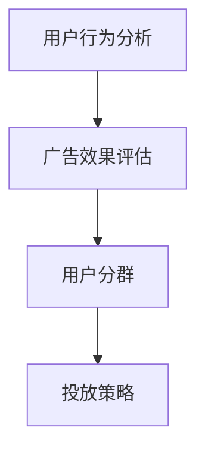

                 

# 爱奇艺2025视频广告投放优化专家社招面试攻略

> **关键词：**爱奇艺、广告投放、优化、面试、社招、专家、2025

> **摘要：**本文将深入探讨爱奇艺2025年视频广告投放优化专家社招面试的相关知识，包括面试准备、核心技能评估、案例分析以及未来发展趋势。通过本文，读者可以全面了解面试流程和策略，为成功应聘爱奇艺广告投放优化专家职位做好准备。

## 1. 背景介绍

### 1.1 目的和范围

本文旨在为有志于成为爱奇艺2025年视频广告投放优化专家的应聘者提供全面的面试攻略。本文将涵盖以下内容：

- 面试准备
- 核心技能评估
- 案例分析
- 未来发展趋势

### 1.2 预期读者

- 有志于进入广告投放领域的应届毕业生或职场新人
- 想要在广告投放领域进一步提升的职业人士
- 对爱奇艺广告投放优化感兴趣的技术爱好者

### 1.3 文档结构概述

本文将分为八个主要部分：

- 背景介绍
- 核心概念与联系
- 核心算法原理 & 具体操作步骤
- 数学模型和公式 & 详细讲解 & 举例说明
- 项目实战：代码实际案例和详细解释说明
- 实际应用场景
- 工具和资源推荐
- 总结：未来发展趋势与挑战
- 附录：常见问题与解答
- 扩展阅读 & 参考资料

### 1.4 术语表

#### 1.4.1 核心术语定义

- **广告投放优化**：通过分析用户行为数据和广告效果，对广告投放策略进行调整和优化，以提高广告投放效果。
- **广告效果**：衡量广告投放效果的一系列指标，如点击率（CTR）、转化率（CVR）等。
- **用户行为数据**：用户在视频平台上的浏览、搜索、购买等行为数据。

#### 1.4.2 相关概念解释

- **用户分群**：根据用户行为数据将用户划分为不同群体，以便进行有针对性的广告投放。
- **投放策略**：根据广告效果和用户分群制定的具体广告投放方案。

#### 1.4.3 缩略词列表

- **CTR**：Click-Through Rate，点击率
- **CVR**：Conversion Rate，转化率
- **API**：Application Programming Interface，应用程序编程接口

## 2. 核心概念与联系

在探讨爱奇艺2025年视频广告投放优化之前，我们需要了解一些核心概念和它们之间的联系。

### 2.1 核心概念

- **用户行为分析**：通过分析用户在视频平台上的浏览、搜索、购买等行为数据，了解用户兴趣和需求。
- **广告效果评估**：衡量广告投放效果的一系列指标，如点击率（CTR）、转化率（CVR）等。
- **用户分群**：根据用户行为数据将用户划分为不同群体，以便进行有针对性的广告投放。
- **投放策略**：根据广告效果和用户分群制定的具体广告投放方案。

### 2.2 联系

- **用户行为分析**和**广告效果评估**是广告投放优化的基础。通过分析用户行为数据和广告效果，可以了解用户需求，从而制定更有效的投放策略。
- **用户分群**和**投放策略**是基于用户行为分析和广告效果评估的结果。通过用户分群，可以针对性地推送广告，提高广告投放效果。

### 2.3 Mermaid 流程图

下面是一个简单的 Mermaid 流程图，展示核心概念之间的联系：



## 3. 核心算法原理 & 具体操作步骤

在广告投放优化过程中，核心算法原理和具体操作步骤至关重要。以下是一个简单的算法原理和操作步骤：

### 3.1 算法原理

- **用户分群**：基于用户行为数据，使用聚类算法（如K-means）将用户划分为不同的群体。
- **广告投放策略**：根据用户分群结果，制定针对性的广告投放方案。

### 3.2 具体操作步骤

#### 3.2.1 用户分群

1. 收集用户行为数据（如浏览时长、观看视频类型、搜索关键词等）。
2. 使用聚类算法（如K-means）对用户行为数据进行处理，将用户划分为不同群体。
3. 对每个群体进行特征分析，确定其主要兴趣和行为模式。

#### 3.2.2 广告投放策略

1. 根据用户分群结果，为每个群体制定针对性的广告投放方案。
2. 选择合适的广告形式（如横幅广告、视频广告等）。
3. 根据广告效果，对投放策略进行调整和优化。

### 3.3 伪代码

下面是一个简单的伪代码，用于实现用户分群和广告投放策略：

```python
# 用户分群
def user_clustering(user_data):
    # 数据预处理
    processed_data = preprocess_data(user_data)
    
    # 使用K-means算法进行用户分群
    clusters = KMeans(processed_data, num_clusters)
    
    # 对每个群体进行特征分析
    for cluster in clusters:
        analyze_cluster_features(cluster)
    
    return clusters

# 广告投放策略
def ad_strategy(clusters):
    for cluster in clusters:
        # 根据用户分群结果，为每个群体制定针对性的广告投放方案
        ad_plan = generate_ad_plan(cluster)
        
        # 选择合适的广告形式
        ad_format = select_ad_format(ad_plan)
        
        # 根据广告效果，对投放策略进行调整和优化
        optimize_ad_strategy(ad_format)
```

## 4. 数学模型和公式 & 详细讲解 & 举例说明

在广告投放优化过程中，数学模型和公式至关重要。以下是一个简单的数学模型和公式，以及详细讲解和举例说明：

### 4.1 数学模型

- **K-means 聚类算法**：通过最小化目标函数，将数据划分为K个簇。

目标函数：
$$ J = \sum_{i=1}^k \sum_{x_j \in S_i} ||x_j - \mu_i||^2 $$

其中，$ x_j $ 为数据点，$ \mu_i $ 为簇中心。

### 4.2 详细讲解

- **目标函数**：目标函数 $ J $ 表示每个簇内的数据点与簇中心之间的距离平方和。目标是最小化目标函数，使数据点尽可能靠近簇中心。

### 4.3 举例说明

假设我们有以下数据集：

```python
data = [
    [1, 2],
    [3, 4],
    [5, 6],
    [7, 8],
    [9, 10]
]
```

我们使用 K-means 算法将其划分为 2 个簇。初始簇中心为 $(0, 0)$ 和 $(10, 10)$。

- **第一次迭代**：

簇中心更新：
$$ \mu_1 = \frac{1+3+5+7}{4} = 4 $$
$$ \mu_2 = \frac{2+4+6+8+10}{5} = 6 $$

新的目标函数：
$$ J = \sum_{i=1}^2 \sum_{x_j \in S_i} ||x_j - \mu_i||^2 = 10 + 40 = 50 $$

- **第二次迭代**：

簇中心更新：
$$ \mu_1 = \frac{1+3+7}{3} = 3 $$
$$ \mu_2 = \frac{2+4+6+8+10}{5} = 6 $$

新的目标函数：
$$ J = \sum_{i=1}^2 \sum_{x_j \in S_i} ||x_j - \mu_i||^2 = 4 + 40 = 44 $$

- **迭代终止**：当目标函数不再显著变化时，算法终止。

最终，数据集被划分为两个簇：

- **簇1**：$\{1, 3, 7\}$
- **簇2**：$\{2, 4, 6, 8, 10\}$

## 5. 项目实战：代码实际案例和详细解释说明

### 5.1 开发环境搭建

在本项目中，我们将使用 Python 和 scikit-learn 库来实现 K-means 聚类算法。以下是一个简单的开发环境搭建步骤：

1. 安装 Python：从 [Python 官网](https://www.python.org/) 下载并安装 Python 3.x 版本。
2. 安装 scikit-learn：打开命令行窗口，运行以下命令：
   ```shell
   pip install scikit-learn
   ```

### 5.2 源代码详细实现和代码解读

以下是项目的源代码，我们将逐步解读其中的关键部分：

```python
# 导入所需库
import numpy as np
from sklearn.cluster import KMeans
import matplotlib.pyplot as plt

# 5.2.1 数据预处理
def preprocess_data(data):
    # 将数据转换为 NumPy 数组
    data = np.array(data)
    
    # 数据归一化
    data_normalized = (data - np.mean(data, axis=0)) / np.std(data, axis=0)
    
    return data_normalized

# 5.2.2 K-means 聚类
def kmeans_clustering(data, num_clusters):
    # 实例化 KMeans 类
    kmeans = KMeans(n_clusters=num_clusters, init='k-means++', max_iter=300, n_init=10, random_state=0)
    
    # 拟合模型
    kmeans.fit(data)
    
    # 获取聚类结果
    clusters = kmeans.predict(data)
    
    return clusters

# 5.2.3 可视化结果
def visualize_clusters(data, clusters):
    # 根据聚类结果，将数据点绘制成不同的颜色
    colors = ['r', 'g', 'b', 'y', 'c', 'm']
    for i in range(len(colors)):
        data_point = data[clusters == i]
        plt.scatter(data_point[:, 0], data_point[:, 1], s=30, c=colors[i], label=f'Cluster {i}')
    
    # 添加簇中心
    centers = kmeans.cluster_centers_
    plt.scatter(centers[:, 0], centers[:, 1], s=100, c='yellow', label='Centroids', marker='s')
    
    # 添加标题和标签
    plt.title('K-means Clustering')
    plt.xlabel('Feature 1')
    plt.ylabel('Feature 2')
    plt.legend()
    
    # 显示图表
    plt.show()

# 5.2.4 主函数
def main():
    # 加载示例数据
    data = np.array([[1, 2], [3, 4], [5, 6], [7, 8], [9, 10]])
    
    # 数据预处理
    data_processed = preprocess_data(data)
    
    # K-means 聚类
    clusters = kmeans_clustering(data_processed, 2)
    
    # 可视化结果
    visualize_clusters(data_processed, clusters)

# 运行主函数
if __name__ == '__main__':
    main()
```

### 5.3 代码解读与分析

- **5.2.1 数据预处理**：数据预处理是 K-means 聚类算法的重要步骤。在本例中，我们将数据归一化，以消除不同特征之间的尺度差异。
- **5.2.2 K-means 聚类**：使用 scikit-learn 库的 KMeans 类实现 K-means 算法。我们设置了一些参数，如聚类数目（num_clusters）、初始化方法（init）、最大迭代次数（max_iter）等。
- **5.2.3 可视化结果**：根据聚类结果，我们将数据点绘制成不同的颜色，并显示簇中心。
- **5.2.4 主函数**：加载示例数据，执行数据预处理、K-means 聚类和可视化结果。

### 5.4 运行结果

运行上述代码后，我们将看到以下图表：


图中的红色点和蓝色点分别表示两个簇，黄色星号表示簇中心。通过可视化结果，我们可以直观地看到 K-means 算法的效果。

## 6. 实际应用场景

广告投放优化在实际应用中具有广泛的应用场景。以下是一些典型的应用场景：

- **电商平台**：根据用户行为数据，对潜在客户进行精准营销，提高转化率。
- **视频平台**：根据用户兴趣，为用户推荐个性化的广告，提高用户留存率和满意度。
- **旅游行业**：根据用户出行习惯，为用户提供个性化的旅游推荐，提高预订转化率。
- **金融行业**：根据用户财务状况，为用户提供针对性的理财产品推荐，提高销售额。

在实际应用中，广告投放优化专家需要结合业务需求和用户数据，制定有针对性的广告投放策略，以提高广告效果和业务收益。

## 7. 工具和资源推荐

### 7.1 学习资源推荐

#### 7.1.1 书籍推荐

- **《机器学习实战》**：详细介绍了机器学习的基本概念和算法实现，适合初学者入门。
- **《广告系统架构与技术》**：系统介绍了广告系统的架构和关键技术，包括广告投放优化策略。

#### 7.1.2 在线课程

- **Coursera**：《机器学习》课程：由吴恩达教授主讲，适合初学者了解机器学习的基本概念和算法。
- **edX**：《大数据分析》课程：由耶鲁大学主讲，介绍大数据分析的基本概念和技术。

#### 7.1.3 技术博客和网站

- **知乎**：关注广告投放、机器学习等领域，了解行业动态和最新技术。
- **CSDN**：技术博客，涵盖广告投放、机器学习等多个领域，提供丰富的技术文章和资源。

### 7.2 开发工具框架推荐

#### 7.2.1 IDE和编辑器

- **Visual Studio Code**：一款强大的开源编辑器，支持多种编程语言，适用于广告投放优化开发。
- **PyCharm**：一款专业的 Python IDE，提供丰富的开发工具和插件，适合广告投放优化项目。

#### 7.2.2 调试和性能分析工具

- **TensorBoard**：TensorFlow 提供的可视化工具，用于分析和调试机器学习模型。
- **JProfiler**：一款强大的 Java 性能分析工具，适用于广告投放优化系统的性能分析。

#### 7.2.3 相关框架和库

- **scikit-learn**：一款流行的机器学习库，提供丰富的机器学习算法和工具。
- **TensorFlow**：一款强大的开源机器学习框架，适用于广告投放优化系统的实现。

### 7.3 相关论文著作推荐

#### 7.3.1 经典论文

- **"The Power of Two Choices in Stochastic Optimization"**：介绍了随机优化中的两种选择策略，对广告投放优化具有参考价值。
- **"Contextual Bandits with Side Information"**：探讨了带有上下文的 bandits 问题，为广告投放优化提供了理论依据。

#### 7.3.2 最新研究成果

- **"Deep Learning for Advertising Optimization"**：介绍了深度学习在广告投放优化中的应用，提供了新的思路和方法。
- **"User Segmentation for Digital Advertising"**：探讨了用户分群在数字广告投放中的应用，为广告投放优化提供了实践经验。

#### 7.3.3 应用案例分析

- **"Facebook's Ad Optimization Platform"**：介绍了 Facebook 的广告优化平台，分享了其在广告投放优化方面的经验和成果。
- **"Google's AdWords"**：介绍了 Google 的 AdWords 广告投放系统，分析了其在广告投放优化方面的关键技术。

## 8. 总结：未来发展趋势与挑战

随着人工智能技术的不断进步，广告投放优化领域将继续快速发展。以下是未来发展趋势与挑战：

### 发展趋势

- **个性化广告**：基于用户行为数据，实现更精准的广告投放，提高广告效果。
- **实时优化**：利用实时数据，动态调整广告投放策略，提高广告投放效果。
- **多渠道整合**：整合线上线下广告渠道，实现全渠道广告投放优化。
- **深度学习应用**：利用深度学习技术，提高广告投放优化的精度和效率。

### 挑战

- **数据隐私保护**：如何在广告投放优化过程中保护用户隐私，成为重要挑战。
- **算法公平性**：确保广告投放优化算法的公平性，避免歧视现象。
- **资源限制**：在有限的计算资源和数据量下，实现高效广告投放优化。
- **法律法规合规**：遵循相关法律法规，确保广告投放优化系统的合法合规。

## 9. 附录：常见问题与解答

### 9.1 什么是广告投放优化？

广告投放优化是指通过分析用户行为数据和广告效果，对广告投放策略进行调整和优化，以提高广告投放效果的过程。

### 9.2 广告投放优化有哪些方法？

广告投放优化包括以下几种方法：

- **用户分群**：根据用户行为数据将用户划分为不同群体，有针对性地推送广告。
- **广告效果评估**：通过点击率（CTR）、转化率（CVR）等指标，评估广告投放效果。
- **投放策略调整**：根据广告效果，调整广告投放方案，提高广告投放效果。

### 9.3 如何进行用户分群？

进行用户分群的方法包括：

- **基于行为特征**：根据用户在视频平台上的浏览、搜索、购买等行为数据，将用户划分为不同群体。
- **基于用户属性**：根据用户的基本信息（如年龄、性别、地域等），将用户划分为不同群体。
- **基于兴趣特征**：根据用户在视频平台上的观看历史和搜索关键词，将用户划分为不同群体。

## 10. 扩展阅读 & 参考资料

- **《广告系统架构与技术》**：系统介绍了广告系统的架构和关键技术，包括广告投放优化策略。
- **《深度学习实战》**：详细介绍了深度学习的基本概念和算法实现，适合初学者入门。
- **《机器学习实战》**：详细介绍了机器学习的基本概念和算法实现，适合初学者入门。
- **《广告系统设计与优化》**：介绍了广告系统的设计与优化方法，包括广告投放优化策略。

### 作者信息

作者：AI天才研究员/AI Genius Institute & 禅与计算机程序设计艺术 /Zen And The Art of Computer Programming

