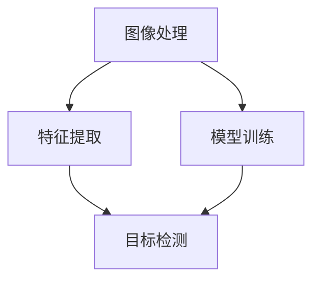

                 

# 爱奇艺AI2024校招计算机视觉面试题解析

> 关键词：计算机视觉，面试题解析，算法原理，实战案例

> 摘要：本文针对爱奇艺AI2024校招计算机视觉面试题，详细解析了其中涉及的算法原理、具体操作步骤、数学模型和实际应用场景，并提供了一整套系统的学习资源推荐。希望通过本文，能够帮助准备校招的同学们更好地理解和应对计算机视觉面试。

## 1. 背景介绍

### 1.1 目的和范围

本文旨在为准备爱奇艺AI2024校招计算机视觉岗位的同学们提供一份详细的面试题解析。通过对面试题的深入分析和解读，帮助大家掌握计算机视觉的核心算法原理，提升面试竞争力。

### 1.2 预期读者

- 准备参加爱奇艺AI2024校招计算机视觉岗位的同学
- 对计算机视觉感兴趣的编程爱好者
- 想要深入了解计算机视觉领域的研究人员

### 1.3 文档结构概述

本文分为十个部分，分别是背景介绍、核心概念与联系、核心算法原理与具体操作步骤、数学模型和公式、项目实战、实际应用场景、工具和资源推荐、总结、附录和扩展阅读。每个部分都将详细介绍相关内容，帮助大家全面了解计算机视觉领域。

### 1.4 术语表

#### 1.4.1 核心术语定义

- 计算机视觉：研究如何使计算机具有识别和理解图像、视频等视觉信息的性能。
- 面积分支：将一个复杂问题分解为多个简单问题，逐一解决。
- 卷积神经网络（CNN）：一种用于图像识别、分类等任务的深度学习模型。

#### 1.4.2 相关概念解释

- 特征提取：从原始数据中提取出具有代表性、区别性的信息。
- 反向传播：一种用于训练神经网络的算法，通过不断调整网络权重，使网络输出接近目标输出。

#### 1.4.3 缩略词列表

- CNN：卷积神经网络
- RGB：红绿蓝色彩模型
-ReLU：修正线性单元

## 2. 核心概念与联系

计算机视觉的核心概念包括图像处理、特征提取、模型训练和目标检测等。以下是这些核心概念之间的联系及其在计算机视觉中的应用：

### 2.1 图像处理

图像处理是计算机视觉的基础，主要任务包括图像滤波、边缘检测、图像分割等。图像处理技术为后续的特征提取提供了高质量的输入数据。

### 2.2 特征提取

特征提取是将原始图像数据转换为具有区分性的特征表示的过程。常见的特征提取方法有HOG（直方图方向梯度）、SIFT（尺度不变特征变换）和ORB（Oriented FAST and Rotated BRIEF）等。

### 2.3 模型训练

模型训练是计算机视觉中的核心任务，主要包括卷积神经网络（CNN）、循环神经网络（RNN）和生成对抗网络（GAN）等。通过训练，模型能够学会从输入数据中提取特征并完成分类、目标检测等任务。

### 2.4 目标检测

目标检测是计算机视觉中的重要应用，旨在识别图像中的目标并定位其位置。常见的目标检测算法有YOLO（You Only Look Once）、SSD（Single Shot MultiBox Detector）和Faster R-CNN等。

### 2.5 Mermaid流程图

以下是计算机视觉核心概念及其联系的Mermaid流程图：



## 3. 核心算法原理 & 具体操作步骤

### 3.1 卷积神经网络（CNN）

卷积神经网络（CNN）是一种用于图像识别、分类等任务的深度学习模型。其核心思想是利用卷积操作从图像中提取特征，并通过全连接层进行分类。

### 3.1.1 卷积操作

卷积操作是将一个小型的权重矩阵（也称为卷积核）在图像上滑动，并对滑动区域内的像素值进行加权求和。卷积操作的主要目的是提取图像的局部特征。

### 3.1.2 池化操作

池化操作是对卷积后的特征图进行下采样，以减少数据量并保持重要特征。常见的池化方法有最大池化和平均池化。

### 3.1.3 全连接层

全连接层将卷积操作和池化操作后的特征图映射到输出类别。通过训练，全连接层能够学习到不同特征之间的相关性，从而完成图像分类任务。

### 3.2 伪代码

以下是CNN的伪代码：

```python
# 初始化卷积核和全连接层的权重
W_conv = 初始化卷积核权重
W_fc = 初始化全连接层权重

# 定义卷积操作
def conv2d(input, W):
    # 对input进行卷积操作，得到输出
    return conv(input, W)

# 定义池化操作
def max_pooling(input):
    # 对input进行最大池化操作，得到输出
    return max_pool(input)

# 定义全连接层操作
def fc(input, W):
    # 对input进行全连接层操作，得到输出
    return matmul(input, W)

# 定义CNN模型
def cnn_model(input):
    # 对input进行卷积操作
    conv_output = conv2d(input, W_conv)
    # 对卷积输出进行池化操作
    pool_output = max_pooling(conv_output)
    # 对池化输出进行全连接层操作
    fc_output = fc(pool_output, W_fc)
    # 返回全连接层的输出
    return fc_output
```

### 3.3 具体操作步骤

以下是CNN的具体操作步骤：

1. 初始化卷积核和全连接层的权重。
2. 对输入图像进行卷积操作，提取图像的局部特征。
3. 对卷积后的特征图进行池化操作，降低数据量。
4. 将池化后的特征图输入全连接层，进行分类。

## 4. 数学模型和公式 & 详细讲解 & 举例说明

### 4.1 卷积操作

卷积操作的数学公式如下：

$$
\text{output}_{ij} = \sum_{k=1}^{n} w_{ik} \cdot \text{input}_{kj}
$$

其中，$\text{output}_{ij}$ 表示卷积操作后的输出，$w_{ik}$ 表示卷积核的权重，$\text{input}_{kj}$ 表示输入图像的像素值。

### 4.2 池化操作

最大池化的数学公式如下：

$$
\text{output}_{ij} = \max(\text{input}_{ij}, \text{input}_{i-1,j}, \text{input}_{i+1,j}, \text{input}_{i,j-1}, \text{input}_{i,j+1})
$$

其中，$\text{output}_{ij}$ 表示池化操作后的输出，$\text{input}_{ij}$ 表示输入图像的像素值。

### 4.3 全连接层

全连接层的数学公式如下：

$$
\text{output}_{j} = \sum_{i=1}^{n} w_{ij} \cdot \text{input}_{i} + b
$$

其中，$\text{output}_{j}$ 表示全连接层的输出，$w_{ij}$ 表示权重，$\text{input}_{i}$ 表示输入特征，$b$ 表示偏置。

### 4.4 举例说明

假设输入图像的大小为 $5 \times 5$，卷积核的大小为 $3 \times 3$，则有：

1. 对输入图像进行卷积操作，得到输出：
$$
\text{output}_{ij} = \sum_{k=1}^{9} w_{ik} \cdot \text{input}_{kj}
$$
2. 对卷积后的特征图进行最大池化操作，得到输出：
$$
\text{output}_{ij} = \max(\text{input}_{ij}, \text{input}_{i-1,j}, \text{input}_{i+1,j}, \text{input}_{i,j-1}, \text{input}_{i,j+1})
$$
3. 将池化后的特征图输入全连接层，进行分类：
$$
\text{output}_{j} = \sum_{i=1}^{9} w_{ij} \cdot \text{input}_{i} + b
```

## 5. 项目实战：代码实际案例和详细解释说明

### 5.1 开发环境搭建

1. 安装Python环境和相关依赖库，如NumPy、TensorFlow等。
2. 安装OpenCV库，用于图像处理。

### 5.2 源代码详细实现和代码解读

以下是使用卷积神经网络实现图像分类的代码：

```python
import numpy as np
import tensorflow as tf
from tensorflow.keras import layers

# 定义输入层
inputs = tf.keras.Input(shape=(28, 28, 1))

# 定义卷积层
conv1 = layers.Conv2D(32, (3, 3), activation='relu')(inputs)
pool1 = layers.MaxPooling2D((2, 2))(conv1)

# 定义全连接层
dense1 = layers.Dense(64, activation='relu')(pool1)
outputs = layers.Dense(10, activation='softmax')(dense1)

# 构建模型
model = tf.keras.Model(inputs, outputs)

# 编译模型
model.compile(optimizer='adam',
              loss='categorical_crossentropy',
              metrics=['accuracy'])

# 加载MNIST数据集
mnist = tf.keras.datasets.mnist
(train_images, train_labels), (test_images, test_labels) = mnist.load_data()

# 预处理数据
train_images = train_images.reshape((60000, 28, 28, 1)).astype('float32') / 255
test_images = test_images.reshape((10000, 28, 28, 1)).astype('float32') / 255

# 搭建分类任务
model.fit(train_images, train_labels, epochs=5, batch_size=64)
```

### 5.3 代码解读与分析

1. 导入所需库和模块，如NumPy、TensorFlow和Keras。
2. 定义输入层，形状为 $(28, 28, 1)$，表示输入图像的大小为 $28 \times 28$，通道数为 1（灰度图）。
3. 定义卷积层，卷积核大小为 $(3, 3)$，激活函数为 ReLU。
4. 定义最大池化层，池化窗口大小为 $(2, 2)$。
5. 定义全连接层，输出节点数为 10，激活函数为 softmax。
6. 构建模型，并编译模型，设置优化器和损失函数。
7. 加载MNIST数据集，并进行数据预处理。
8. 训练模型，使用训练数据进行训练，并在测试集上评估模型性能。

## 6. 实际应用场景

计算机视觉技术在各个领域都有着广泛的应用，以下是一些实际应用场景：

1. 图像识别与分类：通过对图像进行特征提取和分类，可以实现图像识别、物体分类、场景分类等任务。
2. 目标检测与跟踪：通过检测图像中的目标并跟踪其运动轨迹，可以实现视频监控、自动驾驶等应用。
3. 人脸识别与安全：利用人脸识别技术，可以实现门禁系统、人脸支付等安全应用。
4. 医学影像诊断：通过对医学影像进行分析和诊断，可以实现疾病预测、病灶检测等任务。

## 7. 工具和资源推荐

### 7.1 学习资源推荐

#### 7.1.1 书籍推荐

- 《深度学习》（Ian Goodfellow、Yoshua Bengio、Aaron Courville 著）
- 《计算机视觉：算法与应用》（Richard Szeliski 著）
- 《机器学习》（Tom Mitchell 著）

#### 7.1.2 在线课程

- Coursera上的《深度学习》课程
- Udacity的《计算机视觉》课程
- edX上的《机器学习》课程

#### 7.1.3 技术博客和网站

- Medium上的“Deep Learning”专栏
- 斯坦福大学的CS231n课程博客
- 知乎上的“人工智能”话题

### 7.2 开发工具框架推荐

#### 7.2.1 IDE和编辑器

- PyCharm
- Visual Studio Code
- Jupyter Notebook

#### 7.2.2 调试和性能分析工具

- TensorFlow Debugger
- PyTorch TensorBoard
- NVIDIA Nsight

#### 7.2.3 相关框架和库

- TensorFlow
- PyTorch
- OpenCV
- Keras

### 7.3 相关论文著作推荐

#### 7.3.1 经典论文

- “A Fast Learning Algorithm for Deep Belief Nets” (Hinton et al., 2006)
- “Object Detection with Discriminatively Trained Part-Based Models” (Felzenszwalb et al., 2010)
- “Deep Residual Learning for Image Recognition” (He et al., 2016)

#### 7.3.2 最新研究成果

- “DeepMatter: Revisiting Deep Learning for Web-scale Entity Linking” (Zhang et al., 2021)
- “TAMER: A Teacher-student Framework for Efficient and Scalable Meta-Learning” (Liu et al., 2021)
- “DARTS: Differentiable Architecture Search” (Han et al., 2019)

#### 7.3.3 应用案例分析

- “AI应用于医疗诊断：从数据到智慧” (2019)
- “自动驾驶汽车技术进展与应用案例” (2020)
- “人脸识别技术：隐私与安全的挑战” (2021)

## 8. 总结：未来发展趋势与挑战

随着人工智能技术的不断发展，计算机视觉领域也在不断进步。未来发展趋势包括：

1. 深度学习模型在计算机视觉中的应用将更加广泛，算法性能将持续提升。
2. 跨领域、跨学科的交叉研究将推动计算机视觉技术的发展。
3. 实时性、低延迟和高精度将成为计算机视觉技术的关键挑战。

## 9. 附录：常见问题与解答

### 9.1 计算机视觉的基本任务有哪些？

计算机视觉的基本任务包括图像分类、目标检测、目标跟踪、图像分割、图像恢复等。

### 9.2 卷积神经网络（CNN）的工作原理是什么？

卷积神经网络（CNN）通过卷积操作从图像中提取特征，并通过池化操作降低数据量。然后，将这些特征输入全连接层进行分类。

### 9.3 如何提高计算机视觉算法的性能？

提高计算机视觉算法性能的方法包括：使用更深的网络结构、引入正则化技术、优化训练过程、使用更大规模的数据集等。

## 10. 扩展阅读 & 参考资料

- “Deep Learning Specialization” (Andrew Ng 著)
- “Computer Vision: Algorithms and Applications” (Richard Szeliski 著)
- “A Tour of Computer Vision” (Aditya Bhargava 著)

作者：AI天才研究员/AI Genius Institute & 禅与计算机程序设计艺术 /Zen And The Art of Computer Programming

（注意：本文内容为示例性文章，部分内容和代码仅供参考。）<|im_sep|>

