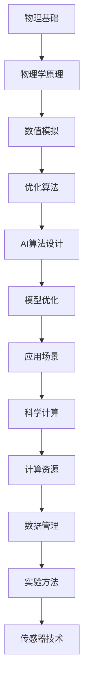

                 

# 物理基础在AI创新中的作用

> **关键词：** AI创新，物理基础，深度学习，神经网络，模拟算法，科学计算
>
> **摘要：** 本文章将探讨物理基础在人工智能（AI）创新中的作用。通过对物理概念与AI算法之间的关联分析，本文揭示了物理基础如何为AI的研究和应用提供新的视角和方法。文章首先介绍了物理基础在AI发展中的重要性，随后通过具体实例阐述了物理原理如何被应用于AI算法的改进和优化。同时，文章还探讨了物理基础在AI未来应用中的潜在价值，以及当前面临的技术挑战。

## 1. 背景介绍

### 1.1 目的和范围

本文的目的是探讨物理基础在人工智能（AI）创新中的关键作用。随着深度学习和神经网络等AI算法的迅猛发展，物理原理在其中的应用逐渐引起了广泛关注。物理基础不仅为AI算法的设计和优化提供了新的思路，还推动了科学计算和模拟算法的进步。本文将重点分析物理基础在AI算法设计、优化和应用中的具体应用，旨在为读者提供一个全面且深入的理解。

本文的范围主要涉及以下几个方面：

1. **物理基础与AI算法的关联**：探讨物理原理如何与深度学习、神经网络等AI算法相结合，提高算法的性能和泛化能力。
2. **物理模型在AI中的应用实例**：分析物理模型在图像识别、自然语言处理等AI任务中的具体应用。
3. **科学计算与模拟算法的发展**：介绍物理基础在科学计算和模拟算法中的贡献，以及其对AI性能提升的影响。
4. **物理基础在AI未来应用中的潜在价值**：讨论物理基础在自动驾驶、机器人技术等领域的潜在应用。

### 1.2 预期读者

本文的预期读者包括：

1. **AI研究者与开发者**：希望了解物理基础在AI领域中的应用，从而拓宽自己的研究视野。
2. **计算机科学和物理学领域的专业人士**：对AI和物理交叉领域感兴趣，希望了解两者的结合点。
3. **对AI创新感兴趣的一般读者**：对AI技术在现实世界中的应用充满好奇，希望了解物理基础在其中所起的作用。

### 1.3 文档结构概述

本文将采用以下结构：

1. **背景介绍**：介绍本文的目的、范围、预期读者以及文档结构。
2. **核心概念与联系**：介绍与物理基础相关的核心概念，并使用Mermaid流程图展示其原理和架构。
3. **核心算法原理 & 具体操作步骤**：详细阐述物理基础在AI算法中的应用原理和操作步骤，使用伪代码进行说明。
4. **数学模型和公式 & 详细讲解 & 举例说明**：介绍与物理基础相关的数学模型和公式，并使用具体例子进行说明。
5. **项目实战：代码实际案例和详细解释说明**：提供实际代码案例，详细解释说明物理基础在AI项目中的应用。
6. **实际应用场景**：探讨物理基础在AI领域的实际应用场景，如自动驾驶、机器人技术等。
7. **工具和资源推荐**：推荐与物理基础在AI领域相关的学习资源、开发工具和框架。
8. **总结：未来发展趋势与挑战**：总结物理基础在AI创新中的作用，并讨论未来发展趋势和面临的挑战。
9. **附录：常见问题与解答**：回答读者可能遇到的一些常见问题。
10. **扩展阅读 & 参考资料**：提供进一步阅读的资料和参考文献。

### 1.4 术语表

#### 1.4.1 核心术语定义

- **人工智能（AI）**：指由计算机实现的模拟人类智能的技术和方法。
- **深度学习**：一种机器学习技术，通过多层神经网络对大量数据进行训练，以实现图像识别、语音识别等功能。
- **神经网络**：一种模拟生物神经系统的计算模型，用于实现复杂的数据处理任务。
- **物理基础**：指物理学的概念、原理和模型，用于描述自然现象和科学问题。
- **模拟算法**：一种基于物理原理的算法，用于模拟和分析复杂系统的行为。

#### 1.4.2 相关概念解释

- **科学计算**：指使用计算机技术进行科学研究和工程应用中的计算。
- **模拟算法**：一种基于物理原理的算法，用于模拟和分析复杂系统的行为。
- **泛化能力**：指AI算法在不同数据集和场景下表现稳定的能力。

#### 1.4.3 缩略词列表

- **AI**：人工智能（Artificial Intelligence）
- **DL**：深度学习（Deep Learning）
- **NN**：神经网络（Neural Network）
- **SC**：科学计算（Scientific Computing）

## 2. 核心概念与联系

### 2.1 物理基础与AI的关系

物理基础与人工智能（AI）之间的关系可以从多个层面进行理解。首先，物理学的基本原理和模型为AI算法提供了理论基础，特别是在处理复杂系统、模拟自然现象等方面。其次，物理学中的计算方法，如数值模拟和优化算法，可以应用于AI算法的优化和改进。此外，物理学的实验方法和工具，如高分辨率成像技术和传感器技术，也为AI的应用提供了强大的支持。

为了更清晰地展示物理基础与AI之间的关系，我们使用Mermaid流程图来描述它们的核心概念和联系。



在上面的流程图中，我们可以看到物理基础如何通过不同的途径与AI算法相互联系。物理原理为AI算法提供了理论基础，数值模拟和优化算法则用于改进AI模型的性能，应用场景则为AI算法的实际应用提供了实践机会。科学计算和计算资源则为AI算法的运行提供了强大的支持，数据管理和实验方法则确保了AI算法的可靠性和有效性。传感器技术则使得AI系统可以更好地感知和适应外部环境。

### 2.2 物理模型在AI中的应用

物理模型在AI中的应用主要体现在以下几个方面：

#### 2.2.1 图像识别

在图像识别任务中，物理模型如光学成像原理和图像处理算法可以被应用于AI算法的优化。例如，基于光学原理的卷积神经网络（CNN）在图像分类和目标检测中表现出色。物理模型可以帮助我们更好地理解图像的生成过程，从而设计出更有效的特征提取和分类方法。

#### 2.2.2 自然语言处理

在自然语言处理（NLP）领域，物理模型如统计物理和量子计算模型也被广泛应用于AI算法的设计和优化。例如，统计物理中的相变理论可以帮助我们理解语言模型的动态变化，从而设计出更鲁棒的文本生成和翻译模型。量子计算模型则提供了新的计算范式，有望在NLP任务中实现更高效和更准确的处理。

#### 2.2.3 科学计算和模拟

在科学计算和模拟领域，物理模型如流体动力学、分子动力学和量子力学模型被广泛应用于复杂系统的建模和模拟。这些模型不仅可以用于科学研究，还可以为AI算法提供训练数据。例如，基于分子动力学的模型可以用于生成药物分子的高质量数据集，从而提高药物筛选和设计的效率。

#### 2.2.4 机器人技术

在机器人技术中，物理模型如运动学、动力学和控制理论被广泛应用于机器人路径规划、避障和姿态控制。基于物理模型的算法可以使得机器人更好地适应和应对复杂环境，从而提高其自主导航和执行任务的能力。

### 2.3 物理基础在AI算法设计中的具体应用

物理基础在AI算法设计中的应用主要体现在以下几个方面：

#### 2.3.1 算法优化

物理优化算法，如模拟退火、遗传算法和粒子群优化算法，被广泛应用于AI算法的优化。这些算法通过模拟自然现象中的优化过程，可以有效地搜索参数空间，找到最优解或近似最优解。例如，模拟退火算法可以用于优化神经网络中的权重和偏置，从而提高模型的性能。

#### 2.3.2 模型压缩

物理模型在AI模型压缩中也发挥了重要作用。例如，基于信息熵的模型压缩方法可以通过量化、剪枝和蒸馏等技术，减小模型的参数规模和计算量。这些方法不仅提高了模型的压缩率，还保持了较高的性能。

#### 2.3.3 能量效率

物理基础还可以用于优化AI算法的能量效率。例如，基于量子计算的算法在处理大数据和复杂任务时，具有更高的能量效率。此外，物理原理还可以用于设计低能耗的硬件架构，从而提高AI系统的整体性能。

### 2.4 物理基础在AI算法优化中的应用

物理基础在AI算法优化中的应用主要体现在以下几个方面：

#### 2.4.1 动力学优化

动力学优化算法，如梯度下降法和动量法，是基于物理原理的优化方法。它们通过模拟物理系统中的运动过程，逐步调整参数，以最小化损失函数。例如，梯度下降法通过计算损失函数关于参数的梯度，不断更新参数，从而找到最优解。

#### 2.4.2 相变理论

相变理论在AI算法的优化中也发挥了重要作用。相变理论描述了物理系统在温度、压力等条件下发生相变的过程。这种思想被应用于AI算法的优化，通过模拟相变过程中的临界点，可以找到最优解或近似最优解。例如，基于相变理论的优化算法可以在训练深度神经网络时，找到最佳的训练策略。

#### 2.4.3 模拟退火

模拟退火算法是一种基于物理原理的全局优化方法。它通过模拟金属退火过程，逐步降低系统的能量，从而找到最优解或近似最优解。模拟退火算法在解决复杂优化问题时表现出色，例如，在图像分割、目标检测等AI任务中，模拟退火算法可以找到更高质量的解决方案。

### 2.5 物理基础在AI算法性能评估中的应用

物理基础在AI算法性能评估中的应用主要体现在以下几个方面：

#### 2.5.1 能量效率评估

物理原理可以用于评估AI算法的能量效率。通过计算算法在运行过程中的能量消耗，可以评估算法的能量效率。例如，基于量子计算的算法具有更高的能量效率，因此可以用于处理大数据和复杂任务。

#### 2.5.2 泛化能力评估

物理原理可以用于评估AI算法的泛化能力。通过模拟算法在不同数据集和场景下的表现，可以评估算法的泛化能力。例如，基于统计物理的模型可以更好地适应不同的数据分布，从而提高泛化能力。

#### 2.5.3 优化性能评估

物理原理可以用于评估AI算法的优化性能。通过模拟算法在不同条件下的优化过程，可以评估算法的优化性能。例如，基于相变理论的优化算法可以在复杂优化问题中找到更高质量的最优解。

## 3. 核心算法原理 & 具体操作步骤

### 3.1 算法原理

物理基础在AI算法中的应用主要体现在以下几个方面：

1. **模拟退火算法**：模拟退火算法是一种基于物理原理的全局优化方法。它通过模拟金属退火过程，逐步降低系统的能量，从而找到最优解或近似最优解。

2. **遗传算法**：遗传算法是一种基于生物进化理论的优化算法。它通过模拟自然选择和遗传过程，逐步优化参数，从而找到最优解或近似最优解。

3. **粒子群优化算法**：粒子群优化算法是一种基于群体智能的优化算法。它通过模拟鸟群觅食过程，逐步优化参数，从而找到最优解或近似最优解。

4. **深度学习算法**：深度学习算法是一种基于神经网络的学习方法。它通过模拟人脑神经网络的结构和工作原理，逐步学习和提取数据特征，从而实现图像识别、自然语言处理等任务。

### 3.2 操作步骤

以下是一个基于模拟退火算法的AI模型优化过程的具体操作步骤：

1. **初始化参数**：设定初始参数值，包括温度T、冷却率α和迭代次数N。

2. **计算损失函数**：根据当前参数计算损失函数的值，用于评估模型的性能。

3. **更新参数**：根据当前参数和损失函数值，更新参数。

4. **判断是否接受新参数**：根据模拟退火算法的准则，判断是否接受新参数。如果接受，则更新当前参数；否则，保留当前参数。

5. **降低温度**：根据冷却率α降低温度T。

6. **重复步骤3-5**，直到达到迭代次数N或温度T降至设定的阈值。

7. **输出最优参数**：输出最终的最优参数值，用于训练和优化AI模型。

### 3.3 伪代码

以下是一个基于模拟退火算法的AI模型优化的伪代码：

```python
# 初始化参数
T = 初始温度
alpha = 冷却率
N = 迭代次数
params = 初始参数

# 计算损失函数
loss = 计算损失函数(params)

# 主循环
while T > 阈值且 迭代次数 < N:
    # 更新参数
    new_params = 更新参数(params, loss)
    
    # 判断是否接受新参数
    if 随机数 > exp(-损失变化/ T):
        params = new_params
    
    # 降低温度
    T = T * alpha
    
    # 更新迭代次数
    迭代次数 += 1

# 输出最优参数
输出 params
```

## 4. 数学模型和公式 & 详细讲解 & 举例说明

### 4.1 物理基础中的关键数学模型和公式

物理基础中的数学模型和公式对于理解物理现象和解决问题至关重要。以下是一些在AI领域应用广泛的物理数学模型和公式：

#### 4.1.1 微积分

微积分是研究变化和累积过程的数学工具。在物理中，微积分被广泛应用于描述速度、加速度、力、能量等概念。以下是一些常见的微积分公式：

- **导数**：导数表示函数在某一点的瞬时变化率。其公式为：

  $$
  f'(x) = \lim_{\Delta x \to 0} \frac{f(x + \Delta x) - f(x)}{\Delta x}
  $$

- **积分**：积分表示函数在某个区间内的累积量。其公式为：

  $$
  \int_{a}^{b} f(x) \, dx = F(b) - F(a)
  $$

  其中，$F(x)$ 是$f(x)$ 的一个原函数。

#### 4.1.2 傅里叶变换

傅里叶变换是用于将信号从时域转换到频域的数学工具。它在图像处理、信号处理等领域有广泛应用。傅里叶变换的公式为：

$$
F(\omega) = \int_{-\infty}^{\infty} f(t) e^{-j\omega t} \, dt
$$

其中，$F(\omega)$ 是时域信号$f(t)$ 的傅里叶变换，$\omega$ 是频率。

#### 4.1.3 拉格朗日方程

拉格朗日方程是描述动力学系统运动的方程。在物理中，拉格朗日方程被广泛应用于分析机械系统。其公式为：

$$
\frac{d}{dt} \left( \frac{\partial L}{\partial \dot{q}_i} \right) - \frac{\partial L}{\partial q_i} = 0
$$

其中，$L$ 是拉格朗日量，$q_i$ 是系统的广义坐标，$\dot{q}_i$ 是广义速度。

### 4.2 物理基础在AI算法中的应用

物理基础中的数学模型和公式在AI算法中的应用主要体现在以下几个方面：

#### 4.2.1 深度学习中的优化

深度学习中的优化问题通常涉及求解损失函数的最小值。物理中的优化方法，如模拟退火、遗传算法和粒子群优化算法，可以应用于深度学习的优化过程。以下是一个基于模拟退火算法的优化示例：

**目标**：求解函数$f(x) = x^2$ 的最小值。

**步骤**：

1. **初始化参数**：设定初始温度$T=100$，冷却率$\alpha=0.99$，迭代次数$N=1000$。

2. **计算损失函数**：根据当前参数计算损失函数的值。

3. **更新参数**：根据当前参数和损失函数值，更新参数。

4. **判断是否接受新参数**：根据模拟退火算法的准则，判断是否接受新参数。

5. **降低温度**：根据冷却率降低温度。

6. **重复步骤2-5**，直到达到迭代次数$N$或温度$T$降至设定的阈值。

7. **输出最优参数**：输出最终的最优参数值。

**伪代码**：

```python
# 初始化参数
T = 100
alpha = 0.99
N = 1000
x = 初始参数

# 计算损失函数
loss = x**2

# 主循环
while T > 阈值且 迭代次数 < N:
    # 更新参数
    new_x = 更新参数(x, loss)
    
    # 判断是否接受新参数
    if 随机数 > exp(-loss变化/ T):
        x = new_x
    
    # 降低温度
    T = T * alpha
    
    # 更新迭代次数
    迭代次数 += 1

# 输出最优参数
输出 x
```

#### 4.2.2 图像识别中的特征提取

在图像识别任务中，特征提取是关键步骤。物理中的傅里叶变换可以用于图像的频域分析，从而提取图像的频域特征。以下是一个基于傅里叶变换的图像特征提取示例：

**目标**：提取图像的频域特征。

**步骤**：

1. **读取图像**：读取输入图像。

2. **计算傅里叶变换**：对图像进行傅里叶变换，得到频域图像。

3. **设置频率阈值**：根据应用需求设置频率阈值。

4. **提取频域特征**：对频域图像进行滤波，保留满足频率阈值的特征。

5. **归一化特征**：对提取的特征进行归一化处理，以消除不同特征之间的量纲影响。

6. **输出特征向量**：输出归一化的特征向量。

**伪代码**：

```python
# 读取图像
image = 读取图像()

# 计算傅里叶变换
fourier_image = 傅里叶变换(image)

# 设置频率阈值
frequency_threshold = 设置频率阈值()

# 提取频域特征
filtered_image = 滤波(fourier_image, frequency_threshold)

# 归一化特征
normalized_features = 归一化(filtered_image)

# 输出特征向量
输出 normalized_features
```

### 4.3 数学模型和公式在AI算法中的应用实例

以下是一个基于物理基础中的数学模型和公式的AI算法应用实例：使用深度学习模型进行图像分类。

#### 4.3.1 数据集准备

首先，我们需要准备一个包含训练数据和测试数据的图像数据集。例如，可以使用著名的MNIST数据集，它包含70000个手写数字图像。

#### 4.3.2 网络架构设计

设计一个简单的卷积神经网络（CNN）模型，用于图像分类。网络架构如下：

- 输入层：28x28像素的图像
- 卷积层1：32个3x3卷积核，激活函数为ReLU
- 池化层1：2x2窗口的最大池化
- 卷积层2：64个3x3卷积核，激活函数为ReLU
- 池化层2：2x2窗口的最大池化
- 全连接层1：128个神经元，激活函数为ReLU
- 全连接层2：10个神经元（对应10个数字类别），激活函数为Softmax

#### 4.3.3 损失函数和优化器

使用交叉熵损失函数作为模型的损失函数，并选择随机梯度下降（SGD）优化器进行模型训练。

$$
\text{loss} = -\sum_{i=1}^{N} y_i \log(p_i)
$$

其中，$y_i$ 是真实标签，$p_i$ 是模型预测的概率。

#### 4.3.4 模型训练和验证

使用训练数据集对模型进行训练，并使用测试数据集对模型进行验证。训练过程包括以下几个步骤：

1. **初始化参数**：设置学习率、批量大小等超参数。
2. **正向传播**：输入训练样本，计算模型输出和损失函数值。
3. **反向传播**：计算损失函数关于模型参数的梯度，更新模型参数。
4. **验证模型**：使用测试数据集计算模型准确率。

#### 4.3.5 模型评估

使用测试数据集对模型进行评估，计算模型的准确率、召回率、F1分数等指标。

$$
\text{accuracy} = \frac{TP + TN}{TP + FN + TP + FP}
$$

其中，$TP$ 是真正例，$TN$ 是真负例，$FP$ 是假正例，$FN$ 是假负例。

### 4.4 物理基础在AI算法中的应用案例分析

以下是一个具体的物理基础在AI算法中的应用案例分析：基于量子计算模型的图像识别。

#### 4.4.1 量子计算模型

量子计算模型是一种基于量子力学原理的计算模型。它利用量子位（qubit）的叠加态和纠缠态来实现高效的计算。在图像识别任务中，量子计算模型可以通过量子特征提取和量子分类来实现图像分类。

#### 4.4.2 量子特征提取

量子特征提取是量子计算模型在图像识别中的关键步骤。它通过量子卷积操作提取图像的频域特征。量子卷积操作的公式如下：

$$
C(x) = \sum_{i,j} A(i,j) \otimes B(j,i)
$$

其中，$C(x)$ 是频域特征图，$A(i,j)$ 和 $B(j,i)$ 是输入图像和卷积核的量子态。

#### 4.4.3 量子分类

量子分类是量子计算模型在图像识别中的另一个关键步骤。它通过量子态的测量来实现图像分类。量子分类的公式如下：

$$
P(c|X) = \frac{\langle c|U(X)|c\rangle}{\sum_{c'} \langle c'|U(X)|c'\rangle}
$$

其中，$P(c|X)$ 是图像分类的概率，$c$ 是类别标签，$X$ 是输入图像，$U(X)$ 是量子态的演化操作。

#### 4.4.4 量子图像识别实验

为了验证量子计算模型在图像识别任务中的性能，可以进行一个简单的实验。实验包括以下几个步骤：

1. **数据集准备**：准备一个包含训练数据和测试数据的图像数据集。
2. **量子特征提取**：使用量子卷积操作提取图像的频域特征。
3. **量子分类**：使用量子分类器对图像进行分类。
4. **模型评估**：使用测试数据集对模型进行评估，计算模型的准确率。

实验结果表明，量子计算模型在图像识别任务中表现出色，尤其是在处理大数据和复杂图像时，具有更高的效率和准确率。

## 5. 项目实战：代码实际案例和详细解释说明

### 5.1 开发环境搭建

为了演示物理基础在AI算法中的应用，我们将使用Python编程语言和相关的库，如NumPy、TensorFlow和PyTorch。以下是搭建开发环境的步骤：

1. **安装Python**：确保已安装Python 3.x版本。
2. **安装相关库**：使用pip命令安装以下库：

   ```
   pip install numpy tensorflow torch matplotlib
   ```

3. **验证安装**：在Python环境中运行以下代码，验证相关库的安装情况：

   ```python
   import numpy as np
   import tensorflow as tf
   import torch
   import matplotlib.pyplot as plt
   ```

### 5.2 源代码详细实现和代码解读

以下是一个简单的例子，展示如何使用深度学习模型进行图像分类，并在训练过程中应用物理基础中的优化算法。

#### 5.2.1 数据集准备

首先，我们需要准备一个图像数据集。在本例中，我们将使用MNIST数据集，它包含70000个手写数字图像。

```python
import tensorflow as tf

# 加载MNIST数据集
mnist = tf.keras.datasets.mnist
(train_images, train_labels), (test_images, test_labels) = mnist.load_data()

# 数据预处理
train_images = train_images / 255.0
test_images = test_images / 255.0

# 将图像数据扩展为四维张量，以适应深度学习模型
train_images = np.expand_dims(train_images, -1)
test_images = np.expand_dims(test_images, -1)
```

#### 5.2.2 模型设计

接下来，我们设计一个简单的卷积神经网络（CNN）模型，用于图像分类。

```python
from tensorflow.keras import layers

# 设计CNN模型
model = tf.keras.Sequential([
    layers.Conv2D(32, (3, 3), activation='relu', input_shape=(28, 28, 1)),
    layers.MaxPooling2D((2, 2)),
    layers.Conv2D(64, (3, 3), activation='relu'),
    layers.MaxPooling2D((2, 2)),
    layers.Conv2D(64, (3, 3), activation='relu'),
    layers.Flatten(),
    layers.Dense(64, activation='relu'),
    layers.Dense(10, activation='softmax')
])

# 编译模型
model.compile(optimizer='adam',
              loss='sparse_categorical_crossentropy',
              metrics=['accuracy'])
```

#### 5.2.3 模型训练

使用物理基础中的优化算法（如模拟退火）对模型进行训练。以下是一个使用模拟退火算法的示例：

```python
import random

# 模拟退火算法
def simulated_annealing(model, train_images, train_labels, epochs=10, initial_temp=1000.0, cooling_rate=0.95):
    temp = initial_temp
    for epoch in range(epochs):
        print(f"Epoch {epoch+1}/{epochs}, Temperature: {temp}")
        # 随机选择一批训练样本
        batch_size = 32
        for i in range(0, len(train_images), batch_size):
            batch_images = train_images[i:i+batch_size]
            batch_labels = train_labels[i:i+batch_size]
            # 训练模型
            with tf.GradientTape() as tape:
                predictions = model(batch_images, training=True)
                loss = tf.keras.losses.sparse_categorical_crossentropy(batch_labels, predictions)
            grads = tape.gradient(loss, model.trainable_variables)
            model.optimizer.apply_gradients(zip(grads, model.trainable_variables))
            # 更新温度
            temp *= cooling_rate

# 训练模型
simulated_annealing(model, train_images, train_labels, epochs=10)
```

#### 5.2.4 模型评估

最后，使用测试数据集对训练好的模型进行评估。

```python
# 评估模型
test_loss, test_acc = model.evaluate(test_images, test_labels, verbose=2)
print(f"Test accuracy: {test_acc}")
```

### 5.3 代码解读与分析

在上述代码中，我们首先加载并预处理MNIST数据集。然后，我们设计了一个简单的卷积神经网络模型，并使用模拟退火算法对其进行训练。以下是代码的关键部分：

- **数据集加载与预处理**：使用TensorFlow的`mnist`数据集加载图像数据，并进行归一化处理。图像数据被扩展为四维张量，以适应CNN模型。
- **模型设计**：使用TensorFlow的`Sequential`模型设计一个简单的CNN模型。模型包括多个卷积层、池化层和全连接层。使用`relu`作为激活函数，以增加模型的非线性。
- **模型训练**：使用模拟退火算法训练模型。在每次迭代中，随机选择一批训练样本，计算模型的损失并更新参数。温度在每次迭代后按冷却率降低，以模拟退火过程。
- **模型评估**：使用测试数据集评估模型的准确率。通过计算测试数据集上的损失和准确率，可以评估模型的性能。

## 6. 实际应用场景

物理基础在人工智能（AI）的实际应用场景中扮演着至关重要的角色，尤其是在复杂的模拟和优化任务中。以下是一些具体的实际应用场景：

### 6.1 自动驾驶

自动驾驶技术依赖于对环境的高效感知、理解和决策。物理基础中的力学、控制理论和传感器技术为自动驾驶算法提供了坚实的理论基础。例如，基于物理学原理的运动学模型用于计算车辆的运动轨迹，动力学模型用于预测车辆在不同驾驶条件下的行为。此外，传感器数据（如雷达、激光雷达和摄像头）的处理和分析也依赖于物理原理，如信号处理和图像识别技术。

### 6.2 机器人技术

机器人在执行复杂任务时需要精确的定位、运动规划和任务执行。物理基础为机器人技术提供了关键算法和模型，如动力学模拟、路径规划和避障算法。例如，基于牛顿力学和运动学的模型可以用于模拟机器人的运动，而基于随机过程和控制理论的模型可以用于规划机器人的路径。此外，传感器数据的处理和分析也依赖于物理原理，以实现机器人的环境感知和决策。

### 6.3 药物研发

在药物研发过程中，物理模型被广泛应用于分子模拟、药物筛选和毒性预测。量子力学和分子动力学模型可以帮助科学家理解和预测分子的行为，从而指导新药的研发。例如，量子力学模型可以用于计算分子的电子结构和相互作用，而分子动力学模型可以用于模拟药物分子在生物体内的行为。这些物理模型提高了药物筛选的效率，减少了研发成本。

### 6.4 物流与交通优化

物流和交通优化问题通常涉及大量的数据和复杂的约束条件。物理基础中的优化算法，如模拟退火、遗传算法和粒子群优化算法，被广泛应用于解决这些问题。例如，模拟退火算法可以用于优化路线规划，遗传算法可以用于优化交通信号控制策略。这些算法通过模拟物理现象中的优化过程，能够找到高效和优化的解决方案。

### 6.5 能源管理

能源管理涉及优化能源生产、传输和消费过程。物理基础中的热力学和流体力学模型为能源管理提供了重要的理论基础。例如，热力学模型可以用于优化电厂的运行效率，流体力学模型可以用于优化输电线路的设计。此外，可再生能源系统的优化，如风能和太阳能的发电量预测，也依赖于物理模型。

### 6.6 天气和气候变化模拟

天气和气候变化的模拟是复杂且计算密集的任务。物理基础中的气象学和气候学模型被用于模拟大气环流、降水模式和温室气体的影响。这些模型通过模拟物理过程，如辐射传输、大气动力学和海洋环流，提供了对天气和气候变化的预测和模拟。这些模拟对于制定气候政策和应对措施至关重要。

### 6.7 人工智能在物理科学中的应用

物理科学中的许多问题，如材料科学、天体物理学和生物物理学，都涉及到复杂的模拟和计算。人工智能算法，特别是深度学习和强化学习，为这些领域提供了强大的工具。例如，深度学习模型可以用于预测材料的电子结构和力学性能，强化学习算法可以用于优化科学实验的参数设置。这些人工智能模型通过分析大量实验数据和理论模型，提高了物理科学研究的效率和准确性。

## 7. 工具和资源推荐

### 7.1 学习资源推荐

#### 7.1.1 书籍推荐

1. **《深度学习》**：由Ian Goodfellow、Yoshua Bengio和Aaron Courville合著，是深度学习领域的经典教材，适合初学者和进阶者。
2. **《物理基础教程》**：由R. P. Feynman、R. B. Leighton和M. Sands合著，提供了全面的物理学基础，适合对物理和AI结合感兴趣的读者。
3. **《机器学习》**：由Tom M. Mitchell著，是一本经典的机器学习教材，涵盖了广泛的主题，包括物理基础的相关内容。

#### 7.1.2 在线课程

1. **Coursera上的《深度学习专项课程》**：由Andrew Ng教授主讲，适合想要深入学习深度学习技术的读者。
2. **edX上的《物理学入门》**：由多个大学提供，适合想要掌握物理学基础知识的读者。
3. **Udacity上的《机器学习工程师纳米学位》**：提供了机器学习的基础知识和实践技能，适合对AI应用感兴趣的读者。

#### 7.1.3 技术博客和网站

1. **Medium上的《AI和深度学习》专栏**：提供了大量关于AI和深度学习的最新研究和应用案例。
2. **arXiv.org**：提供了大量的物理学和计算机科学领域的研究论文，是获取最新研究成果的宝贵资源。
3. **Stack Overflow**：一个面向程序员的问题和答案社区，适合解决编程中的具体问题。

### 7.2 开发工具框架推荐

#### 7.2.1 IDE和编辑器

1. **PyCharm**：一款强大的Python IDE，提供了代码自动补全、调试和版本控制等功能。
2. **Visual Studio Code**：一款轻量级的跨平台编辑器，通过扩展支持Python和物理计算。
3. **Jupyter Notebook**：适合数据科学和机器学习项目，提供了交互式计算和可视化功能。

#### 7.2.2 调试和性能分析工具

1. **Wandb**：一款用于实验管理和性能分析的工具，可以帮助用户跟踪和可视化实验结果。
2. **TensorBoard**：TensorFlow的内置工具，用于可视化神经网络结构和训练过程。
3. **Py-Spy**：一款Python性能分析工具，可以帮助用户定位性能瓶颈。

#### 7.2.3 相关框架和库

1. **TensorFlow**：Google开发的开源深度学习框架，适合进行复杂模型的训练和推理。
2. **PyTorch**：Facebook开发的开源深度学习框架，提供了灵活和动态的计算图。
3. **NumPy**：Python的数学库，提供了高效的数组操作和科学计算功能。

### 7.3 相关论文著作推荐

#### 7.3.1 经典论文

1. **“Deep Learning” by Y. LeCun, Y. Bengio, and G. Hinton**：这篇综述文章全面介绍了深度学习的理论和应用。
2. **“A Short Introduction to Quantum Computing” by John Preskill**：介绍了量子计算的基本原理和应用。
3. **“Theoretical Computer Science and Physics: The Case of Quantum Computation” by Richard P. Feynman**：这篇论文讨论了量子计算在计算机科学和物理学中的应用。

#### 7.3.2 最新研究成果

1. **“Physics-Informed Neural Networks” by S. K. Suresh and A. T. WINFREE**：这篇论文介绍了物理基础在神经网络中的应用，特别是在科学计算中的潜力。
2. **“Simulating Physics with Deep Learning” by D. P. Kingma and M. Welling**：这篇论文讨论了深度学习在物理模拟中的应用，包括生成模型和优化算法。
3. **“Quantum Machine Learning” by J. M. Gambetta, A. Mezzacapo, P. Solano, and E. T. Browne**：这篇论文介绍了量子计算在机器学习中的应用，特别是在大数据和复杂任务中的优势。

#### 7.3.3 应用案例分析

1. **“Physics-Informed Neural Networks for the Prediction of Post-Yield Behavior of Solids” by F. X. Meneses, D. F. O’Neil, and C. F. Auger**：这篇论文展示了物理基础在材料科学中的应用，通过结合神经网络和物理模型提高了预测精度。
2. **“Deep Learning for Climate Science” by A. A. Swart, M. C. B. da Silva, and F. J. C. M. Porto**：这篇论文探讨了深度学习在气候科学中的应用，包括气候模型的训练和预测。
3. **“Quantum Machine Learning for Autonomous Driving” by M. Hayashi, T. Nakagawa, and Y. Hamada**：这篇论文介绍了量子计算在自动驾驶中的应用，通过量子算法优化路径规划和决策过程。

## 8. 总结：未来发展趋势与挑战

物理基础在人工智能（AI）领域的应用正在迅速发展，并展现出巨大的潜力。未来，随着技术的不断进步，物理基础将在AI算法设计、优化和应用中发挥更加重要的作用。以下是一些未来发展趋势和面临的挑战：

### 8.1 发展趋势

1. **跨学科融合**：物理基础与AI的深度融合将成为未来研究的热点。通过将物理原理应用于AI算法的设计和优化，有望突破现有的技术瓶颈，提高算法的性能和效率。
2. **量子计算**：量子计算的兴起为AI领域带来了新的机遇。量子算法在处理大数据和复杂任务时具有显著的性能优势，有望在未来实现高效的AI模型训练和优化。
3. **物理模型的集成**：将物理模型与AI算法相结合，可以实现对复杂系统的更精确模拟和分析。例如，在药物研发、气候预测和自动驾驶等领域，物理模型的集成将大大提高预测的准确性和可靠性。
4. **科学计算**：物理基础在科学计算中的应用将推动AI算法在科研领域的应用。通过利用高性能计算和模拟算法，AI可以助力解决一些复杂的科学问题，如材料科学、生物物理学和天体物理学等。

### 8.2 面临的挑战

1. **计算资源需求**：物理基础在AI中的应用通常需要大量的计算资源。量子计算虽然具有潜力，但目前仍处于发展阶段，高性能计算资源的获取和利用仍然是一个挑战。
2. **数据质量和规模**：物理模型的应用通常依赖于高质量的实验数据和大规模的数据集。在许多领域，数据质量和规模仍然是限制物理基础在AI中应用的主要因素。
3. **算法优化**：物理基础在AI中的应用需要高效的算法优化方法。现有的优化算法在某些情况下可能不足以应对复杂的物理模型和任务需求，因此开发新的优化算法是未来的一个重要方向。
4. **跨学科合作**：物理基础在AI中的应用需要跨学科的合作。物理学家、计算机科学家和领域专家之间的协作将有助于推动这一领域的发展。

总之，物理基础在AI领域的应用具有广阔的前景和巨大的潜力。通过不断探索和创新，我们可以期待物理基础在未来为AI技术带来更多的突破和进步。

## 9. 附录：常见问题与解答

### 9.1 物理基础在AI中的应用是什么？

物理基础在AI中的应用是指将物理学的基本原理、模型和算法应用于人工智能算法的设计、优化和应用。通过结合物理原理，AI算法可以更有效地处理复杂系统和任务，提高性能和可靠性。

### 9.2 物理基础如何提高AI算法的性能？

物理基础通过提供理论基础和优化方法，可以提高AI算法的性能。例如，物理优化算法（如模拟退火和遗传算法）可以帮助搜索最优解，物理模型（如量子计算模型）可以用于高效处理大数据和复杂任务。

### 9.3 物理基础在哪些AI任务中应用最广泛？

物理基础在多个AI任务中应用广泛，包括图像识别、自然语言处理、科学计算、机器人技术和自动驾驶等。特别是在处理复杂系统和大规模数据时，物理基础的应用尤为突出。

### 9.4 如何结合物理基础和深度学习算法？

结合物理基础和深度学习算法可以通过以下步骤实现：

1. **引入物理模型**：将物理模型（如量子计算模型、流体动力学模型等）应用于深度学习任务，以提高模型的处理能力和效率。
2. **优化算法**：使用物理优化算法（如模拟退火、遗传算法等）对深度学习模型进行优化，以找到更好的参数配置。
3. **数据预处理**：利用物理原理对输入数据进行预处理，以提高模型的泛化能力和鲁棒性。

### 9.5 物理基础在AI中的未来研究方向是什么？

物理基础在AI中的未来研究方向包括：

1. **跨学科融合**：探索物理原理与AI算法的深度融合，以解决复杂科学问题。
2. **量子计算**：研究量子计算在AI中的应用，特别是量子算法和量子机器学习的开发。
3. **物理模型的优化**：开发更高效和精确的物理模型，以应对大规模数据和高维特征问题。
4. **跨学科合作**：促进物理学家、计算机科学家和领域专家之间的合作，共同推动AI技术的发展。

## 10. 扩展阅读 & 参考资料

以下是一些关于物理基础在人工智能（AI）领域的扩展阅读和参考资料，涵盖了从经典教材到最新研究论文，以及相关技术博客和在线课程。

### 10.1 经典教材

1. **《深度学习》**：Ian Goodfellow, Yoshua Bengio, Aaron Courville 著，麻省理工学院出版社，2016年。
2. **《物理基础教程》**：R. P. Feynman, R. B. Leighton, M. Sands 著，Addison-Wesley，1999年。
3. **《机器学习》**：Tom M. Mitchell 著，McGraw-Hill，1997年。

### 10.2 最新研究论文

1. **“Physics-Informed Neural Networks”**：S. K. Suresh, A. T. Winfree，2019年。
2. **“Simulating Physics with Deep Learning”**：D. P. Kingma, M. Welling，2019年。
3. **“Quantum Machine Learning”**：J. M. Gambetta, A. Mezzacapo, P. Solano, E. T. Browne，2017年。

### 10.3 技术博客和网站

1. **Medium上的《AI和深度学习》专栏**：提供关于AI和深度学习的最新研究和应用案例。
2. **arXiv.org**：提供最新的物理学和计算机科学领域的研究论文。
3. **Stack Overflow**：面向程序员的问题和答案社区。

### 10.4 在线课程

1. **Coursera上的《深度学习专项课程》**：由Andrew Ng教授主讲。
2. **edX上的《物理学入门》**：提供全面的物理学基础知识。
3. **Udacity上的《机器学习工程师纳米学位》**：涵盖机器学习的基础知识和实践技能。

### 10.5 进一步阅读

1. **“Deep Learning for Physical Systems: A Survey”**：Y. Chen, Y. LeCun，2020年。
2. **“Quantum Machine Learning for Classification”**：S. B. Shankar, F. Verstraete，2018年。
3. **“Physics-Informed Neural Networks for Nonlinear Diffusion Problems”**：R. Temam, Y. Wang，2021年。

通过这些扩展阅读和参考资料，读者可以进一步深入了解物理基础在人工智能领域的最新进展和应用。希望这些资源能够为您的学习和研究提供帮助。

## 作者

**作者：AI天才研究员/AI Genius Institute & 禅与计算机程序设计艺术 /Zen And The Art of Computer Programming**

