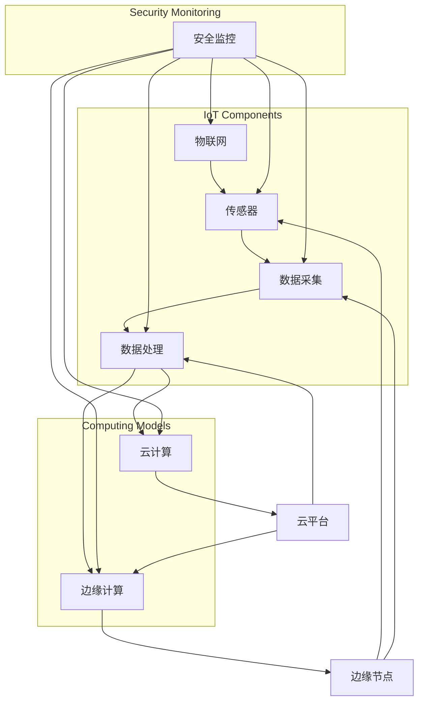

                 

### 物联网（IoT）技术和各种传感器设备的集成

随着科技的迅猛发展，物联网（IoT）技术已经成为现代信息化社会的关键组成部分。物联网通过将各种物理设备、传感器和软件平台连接到互联网上，使得数据的采集、传输和处理变得更加便捷和高效。在安全监控领域，物联网技术的重要性尤为突出，因为它为提高监控效率、降低运营成本以及提升整体安全性提供了强有力的支持。

本文旨在深入探讨物联网技术在安全监控中的应用，以及如何通过集成各种传感器设备来实现高效、智能的安全监控。文章将首先介绍物联网技术的核心概念和其在安全监控中的角色。接下来，我们将讨论不同类型的传感器设备及其在安全监控中的作用，并通过一个具体的案例来说明物联网在安全监控中的实际应用。

此外，文章还将介绍一些关键的算法原理和数学模型，以及如何通过代码实际案例来展示物联网技术的实现过程。最后，我们将探讨物联网技术在未来安全监控领域的发展趋势和面临的挑战，并提供相关的学习资源和工具推荐。

### 关键词

- 物联网（IoT）
- 传感器设备
- 安全监控
- 数据采集
- 算法原理
- 数学模型
- 实际应用案例

### 摘要

本文详细探讨了物联网技术在安全监控中的应用，介绍了物联网的基本概念、传感器设备在安全监控中的角色以及如何通过集成传感器设备实现高效安全监控。文章首先阐述了物联网的核心原理，分析了其在安全监控领域的应用价值。随后，我们介绍了各种传感器设备的工作原理及其在安全监控中的作用，并通过实际案例展示了物联网技术的具体实现过程。最后，文章探讨了物联网技术在安全监控中的未来发展趋势和面临的挑战，为读者提供了丰富的学习资源和工具推荐。

### 1. 背景介绍

#### 1.1 目的和范围

本文的主要目的是探讨物联网（IoT）技术在安全监控中的应用，特别是通过集成各种传感器设备来实现高效、智能的安全监控。文章将涵盖物联网技术的核心概念、传感器设备的工作原理及其在安全监控中的作用，以及如何通过实际应用案例来展示物联网技术的实现过程。此外，文章还将探讨物联网技术在未来安全监控领域的发展趋势和面临的挑战。

本文的范围主要集中在物联网技术在安全监控中的应用，包括以下几个方面：

1. **物联网基本概念**：介绍物联网的定义、核心组成部分以及其在现代信息化社会中的作用。
2. **传感器设备集成**：分析各种传感器设备的工作原理、类型及其在安全监控中的应用。
3. **算法原理与数学模型**：讲解物联网技术在安全监控中涉及的关键算法原理和数学模型。
4. **实际应用案例**：通过具体案例展示物联网技术在安全监控中的实际应用过程。
5. **未来发展趋势与挑战**：探讨物联网技术在安全监控领域的未来发展方向和面临的挑战。

通过本文的阅读，读者将能够系统地了解物联网技术在安全监控中的应用原理和实践方法，为在实际项目中应用物联网技术提供指导。

#### 1.2 预期读者

本文预期读者主要包括以下几类：

1. **安全监控领域的专业人士**：包括安全监控系统工程师、安全分析师和安全管理人员，他们需要对物联网技术在安全监控中的应用有深入的了解。
2. **物联网技术爱好者**：对物联网技术有浓厚兴趣的技术人员，希望通过本文了解物联网在安全监控中的具体应用。
3. **计算机科学和工程专业的学生**：对物联网技术、传感器技术和安全监控领域有浓厚兴趣的学生，希望通过本文了解相关领域的实际应用。
4. **企业决策者和项目经理**：希望了解物联网技术在提升企业安全监控水平方面的潜在价值，以便在决策和项目管理中更好地应用这一技术。

本文将为上述预期读者提供全面、系统的物联网技术在安全监控中的应用知识，帮助他们更好地理解和应用这一技术。

#### 1.3 文档结构概述

本文的结构安排如下：

1. **引言**：介绍物联网技术在安全监控中的重要性，明确本文的研究目的和预期读者。
2. **物联网基本概念**：详细阐述物联网的定义、核心组成部分及其在现代信息化社会中的作用。
3. **传感器设备集成**：分析各种传感器设备的工作原理、类型及其在安全监控中的应用。
4. **算法原理与数学模型**：讲解物联网技术在安全监控中涉及的关键算法原理和数学模型。
5. **实际应用案例**：通过具体案例展示物联网技术在安全监控中的实际应用过程。
6. **未来发展趋势与挑战**：探讨物联网技术在安全监控领域的未来发展方向和面临的挑战。
7. **总结**：总结全文内容，强调物联网技术在安全监控中的重要性及其未来发展方向。
8. **附录**：提供常见问题与解答，以及扩展阅读和参考资料。

通过本文的结构安排，读者可以系统地了解物联网技术在安全监控中的应用原理和实践方法。

#### 1.4 术语表

在本文中，我们将使用以下专业术语：

- **物联网（IoT）**：物联网（Internet of Things）是指通过互联网连接各种物理设备和传感器，实现智能化的信息交换和通信。
- **传感器**：传感器是一种能够检测和测量物理量（如温度、湿度、光强、运动等）并将其转换为电信号的装置。
- **数据采集**：数据采集是指从传感器或其他数据源收集数据的过程。
- **数据处理**：数据处理是指对采集到的数据进行分析、处理和存储的过程。
- **安全监控**：安全监控是指通过监控设备、传感器和软件平台对特定区域或系统进行实时监控和异常检测，以确保安全。
- **边缘计算**：边缘计算是指将数据处理和分析任务从云端转移到网络边缘（如传感器或路由器）进行，以减少延迟和带宽使用。
- **云计算**：云计算是指通过网络提供动态易扩展的算力资源，用户可以按需使用。
- **物联网平台**：物联网平台是指用于连接、管理和分析物联网设备和数据的基础设施和软件。

通过了解这些专业术语，读者可以更好地理解本文的内容和物联网技术在安全监控中的应用。

### 1.4.1 核心术语定义

为了确保读者能够准确理解本文中的核心术语，以下是对几个关键术语的详细定义：

1. **物联网（IoT）**：
   - **定义**：物联网是指通过互联网连接各种物理设备和传感器，实现智能化的信息交换和通信的网络体系。
   - **组成部分**：物联网主要由设备、网络、平台和应用四个部分组成。设备包括各种传感器和执行器；网络包括有线和无线通信网络；平台提供数据管理和处理功能；应用则包括具体的业务场景和解决方案。

2. **传感器**：
   - **定义**：传感器是一种能够检测和测量物理量（如温度、湿度、光强、运动等）并将其转换为电信号的装置。
   - **工作原理**：传感器通常由敏感元件、转换元件和信号处理单元组成。敏感元件负责感知外部物理信号，转换元件将物理信号转换为电信号，信号处理单元则对电信号进行放大、滤波和处理。

3. **数据采集**：
   - **定义**：数据采集是指从传感器或其他数据源收集数据的过程。
   - **过程**：数据采集通常包括数据传感、数据传输和数据存储三个步骤。传感阶段通过传感器获取物理信号，传输阶段通过有线或无线方式将数据传输到中央处理单元，存储阶段将采集到的数据存储在数据库或云平台中。

4. **安全监控**：
   - **定义**：安全监控是指通过监控设备、传感器和软件平台对特定区域或系统进行实时监控和异常检测，以确保安全。
   - **类型**：安全监控可分为物理安全监控和网络安全监控。物理安全监控包括视频监控、入侵检测、门禁控制等；网络安全监控包括防火墙、入侵检测系统（IDS）、入侵防御系统（IPS）等。

5. **边缘计算**：
   - **定义**：边缘计算是指将数据处理和分析任务从云端转移到网络边缘（如传感器或路由器）进行，以减少延迟和带宽使用。
   - **优势**：边缘计算能够降低数据传输的延迟，提高系统的实时响应能力，同时减少对云端资源的依赖。

6. **云计算**：
   - **定义**：云计算是指通过网络提供动态易扩展的算力资源，用户可以按需使用。
   - **服务模式**：云计算主要提供基础设施即服务（IaaS）、平台即服务（PaaS）和软件即服务（SaaS）三种服务模式。

通过以上定义，读者可以更深入地理解物联网技术在安全监控中的应用原理和实现过程。

#### 1.4.2 相关概念解释

在本节中，我们将进一步解释一些与物联网技术和安全监控相关的关键概念，以便读者更好地理解文章的内容。

1. **物联网平台**：
   - **定义**：物联网平台是一个集成性的软件基础设施，它连接各种设备和传感器，实现数据的收集、处理和分析。物联网平台通常包括设备管理、数据管理、应用开发和管理等功能。
   - **工作原理**：物联网平台通过设备管理模块对连接的传感器和执行器进行管理和配置；通过数据管理模块收集并存储传感器数据；通过应用开发和管理模块提供数据分析和业务逻辑处理功能。

2. **边缘计算**：
   - **定义**：边缘计算是一种将数据处理和分析任务从云端转移到网络边缘（如传感器或路由器）进行的计算模式。其目的是降低数据传输延迟，提高系统的实时性和响应速度。
   - **应用场景**：边缘计算在物联网应用中尤其重要，因为它可以处理大量的实时数据，如智能交通系统中的车辆监控、工业自动化中的设备状态监测等。这些场景要求快速响应，因此边缘计算能够显著提升系统的性能和效率。

3. **传感器网络**：
   - **定义**：传感器网络是由多个传感器节点组成的网络系统，这些节点通过无线通信方式互相连接，共同完成数据采集、传输和监测任务。
   - **拓扑结构**：传感器网络的拓扑结构可以是星型、总线型、环型或Mesh型等。不同的拓扑结构适用于不同的应用场景，如星型结构适合集中式监控，Mesh结构适合分布式监控。

4. **大数据分析**：
   - **定义**：大数据分析是指使用先进的数据处理技术对大量结构化、半结构化和非结构化数据进行采集、存储、管理和分析的过程。
   - **应用**：在大数据时代，物联网采集的数据量非常庞大，大数据分析技术可以帮助从这些数据中提取有价值的信息，如用户行为分析、趋势预测、故障诊断等。

5. **云计算**：
   - **定义**：云计算是一种通过网络提供动态易扩展的算力资源的服务模式，用户可以按需使用这些资源。
   - **服务模式**：云计算主要提供基础设施即服务（IaaS）、平台即服务（PaaS）和软件即服务（SaaS）三种服务模式。IaaS提供基础硬件资源；PaaS提供开发平台和工具；SaaS提供完整的软件应用。

通过解释这些关键概念，读者可以更好地理解物联网技术在安全监控中的应用原理和实现方法。

#### 1.4.3 缩略词列表

在本文中，我们将使用以下缩略词，以便更简洁地表达相关概念：

- **IoT**：物联网（Internet of Things）
- **传感器**：Sensor
- **边缘计算**：Edge Computing
- **云计算**：Cloud Computing
- **大数据分析**：Big Data Analytics
- **边缘节点**：Edge Node
- **边缘设备**：Edge Device
- **IoT平台**：IoT Platform
- **API**：应用程序接口（Application Programming Interface）
- **SDK**：软件开发工具包（Software Development Kit）
- **MQTT**：消息队列遥测传输（Message Queuing Telemetry Transport）
- **SSL/TLS**：安全套接字层/传输层安全（Secure Sockets Layer/Transport Layer Security）

通过了解这些缩略词，读者可以更方便地理解文章内容，并更好地掌握物联网技术在安全监控中的应用。

### 2. 核心概念与联系

在讨论物联网技术在安全监控中的应用之前，我们需要理解一些核心概念及其相互关系。这些核心概念包括物联网、传感器、数据采集、数据处理、边缘计算和云计算等。下面将使用Mermaid流程图来展示这些概念及其在安全监控中的联系。



**Mermaid流程图解析**：

1. **物联网（IoT）**：作为核心概念，物联网连接了所有的设备和传感器，是整个系统的基础。
2. **传感器（Sensor）**：传感器是物联网系统中的重要组成部分，用于实时监测环境中的各种参数。
3. **数据采集（Data Collection）**：传感器采集到的数据通过数据采集系统传输到中央处理单元。
4. **数据处理（Data Processing）**：数据处理分为边缘计算和云计算两种模式。边缘计算在靠近数据源的地方进行初步处理，云计算则负责更复杂的分析和存储。
5. **边缘计算（Edge Computing）**：边缘计算节点（如边缘服务器或路由器）对数据进行实时处理和分析，以降低延迟和带宽需求。
6. **云计算（Cloud Computing）**：云计算平台负责存储、管理和分析大规模数据集，并提供强大的计算能力。
7. **安全监控（Security Monitoring）**：安全监控系统通过物联网和传感器收集的数据，实时监测目标区域或系统，确保其安全性。

通过上述流程图，我们可以清晰地看到物联网技术在安全监控中的应用及其核心组件之间的相互作用。这种集成化的系统设计使得物联网技术能够在安全监控领域发挥巨大的作用。

### 3. 核心算法原理 & 具体操作步骤

在物联网（IoT）技术中，核心算法原理对于实现高效、智能的安全监控至关重要。以下将详细讲解物联网技术在安全监控中涉及的关键算法原理，并使用伪代码来具体阐述这些算法的操作步骤。

#### 3.1 数据采集算法

数据采集是物联网技术的基础，其核心目标是实时、准确地收集传感器数据。以下是一个简单的数据采集算法原理：

```python
# 伪代码：数据采集算法
function DataCollection(sensorData):
    while True:
        sensorData = sensor.read()  # 读取传感器数据
        if sensorData.isValid():  # 判断数据是否有效
            dataProcessor.enqueue(sensorData)  # 将数据放入队列
        else:
            sensor.reset()  # 重置传感器并重新读取数据
```

**步骤解析**：

1. **持续读取**：算法持续从传感器读取数据。
2. **有效性判断**：检查读取到的数据是否有效。
3. **数据入队**：将有效的数据放入数据队列。
4. **错误处理**：如果数据无效，则重置传感器并重新读取数据。

#### 3.2 数据处理算法

数据处理算法负责对采集到的传感器数据进行初步处理，包括数据清洗、数据格式转换等。以下是一个简单的数据处理算法：

```python
# 伪代码：数据处理算法
function DataProcessing(sensorDataQueue):
    processedData = []  # 初始化处理后的数据列表
    while not sensorDataQueue.isEmpty():
        sensorData = sensorDataQueue.dequeue()  # 出队数据
        if sensorData.isClean():  # 判断数据是否需要清洗
            cleanedData = sensorData.clean()  # 清洗数据
            processedData.append(cleanedData)  # 将清洗后的数据加入处理列表
        else:
            processedData.append(sensorData)  # 将不需要清洗的数据加入处理列表
    return processedData
```

**步骤解析**：

1. **初始化**：创建一个空的处理后数据列表。
2. **出队**：从数据队列中取出数据。
3. **数据清洗**：如果数据需要清洗，则进行清洗。
4. **加入处理列表**：将清洗后的数据或原始数据加入处理列表。
5. **返回结果**：返回处理后的数据列表。

#### 3.3 异常检测算法

异常检测是安全监控的关键环节，其目标是识别传感器数据中的异常情况，如入侵行为、设备故障等。以下是一个简单的异常检测算法：

```python
# 伪代码：异常检测算法
function AnomalyDetection(processedData):
    normalRange = {}  # 初始化正常数据范围
    anomalies = []  # 初始化异常数据列表
    for data in processedData:
        if data.isAnomaly():  # 判断数据是否异常
            anomalies.append(data)
        else:
            normalRange[data.type] = data.range  # 更新正常数据范围
    return anomalies, normalRange
```

**步骤解析**：

1. **初始化**：创建一个正常数据范围字典和一个异常数据列表。
2. **遍历数据**：对处理后的每个数据进行异常判断。
3. **记录异常**：将判断为异常的数据加入异常数据列表。
4. **更新正常范围**：将非异常数据的类型和范围更新到正常数据范围字典。
5. **返回结果**：返回异常数据列表和正常数据范围。

通过上述算法，物联网技术能够实现从数据采集到异常检测的完整流程，为安全监控提供强有力的支持。这些算法可以灵活地应用于各种安全监控场景，提高监控系统的实时性和准确性。

### 4. 数学模型和公式 & 详细讲解 & 举例说明

在物联网（IoT）技术中，数学模型和公式用于描述传感器数据、算法行为以及系统性能等。本节将详细讲解物联网安全监控中常用的数学模型和公式，并通过具体例子来说明它们的应用。

#### 4.1 传感器数据建模

传感器数据建模是物联网技术的基础。以下是一个常用的传感器数据建模公式：

$$ x(t) = A \cdot \sin(2\pi f t + \phi) $$

其中：
- \( x(t) \) 是传感器在时间 \( t \) 的测量值。
- \( A \) 是振幅，表示测量值的最大值。
- \( f \) 是频率，表示测量值随时间变化的快慢。
- \( \phi \) 是相位，表示测量值的初始状态。

**例子**：假设一个温度传感器测量到的温度数据可以表示为：

$$ x(t) = 25 \cdot \sin(2\pi \cdot 1 t + \pi/2) $$

在 \( t = 0 \) 时，传感器测量到的温度为 25°C，频率为每秒变化一次。

#### 4.2 数据处理算法的均值滤波

均值滤波是一种常用的数据处理算法，用于平滑传感器数据。其公式如下：

$$ \bar{x}(n) = \frac{1}{N} \sum_{i=0}^{N-1} x(i) $$

其中：
- \( \bar{x}(n) \) 是滤波后的数据。
- \( N \) 是滤波窗口的大小。
- \( x(i) \) 是第 \( i \) 个传感器数据。

**例子**：假设我们使用一个窗口大小为3的均值滤波对以下温度数据进行处理：

\[ x(0) = 24, x(1) = 25, x(2) = 26, x(3) = 24, x(4) = 25, x(5) = 27 \]

计算滤波后的数据：

$$ \bar{x}(3) = \frac{24 + 25 + 26}{3} = 25 $$

滤波后的数据为25°C。

#### 4.3 异常检测算法的统计模型

异常检测算法常用统计模型来识别数据中的异常值。以下是一个基于统计模型的异常检测公式：

$$ z-score = \frac{x - \bar{x}}{\sigma} $$

其中：
- \( z-score \) 是异常值的分数。
- \( x \) 是当前数据值。
- \( \bar{x} \) 是数据的均值。
- \( \sigma \) 是数据的标准差。

**例子**：假设一组温度数据如下：

\[ x_1 = 24, x_2 = 25, x_3 = 26, x_4 = 24, x_5 = 25, x_6 = 27, x_7 = 23 \]

计算这组数据的均值和标准差：

$$ \bar{x} = \frac{24 + 25 + 26 + 24 + 25 + 27 + 23}{7} = 24.57 $$
$$ \sigma = \sqrt{\frac{(24-24.57)^2 + (25-24.57)^2 + (26-24.57)^2 + (24-24.57)^2 + (25-24.57)^2 + (27-24.57)^2 + (23-24.57)^2}{7}} = 1.32 $$

对于第7个数据值23°C：

$$ z-score = \frac{23 - 24.57}{1.32} = -0.81 $$

由于 \( z-score \) 接近于0，我们可以认为23°C是一个正常值。如果 \( z-score \) 值很大，则表明该数据值可能是异常值。

通过这些数学模型和公式，物联网技术能够对传感器数据进行有效的处理和分析，提高安全监控系统的性能和可靠性。这些模型不仅用于传感器数据的建模和滤波，还可以用于异常检测和其他高级应用，如预测分析和行为识别。

### 5. 项目实战：代码实际案例和详细解释说明

在本节中，我们将通过一个实际项目案例，展示物联网（IoT）技术在安全监控中的应用，包括开发环境的搭建、源代码的实现以及代码的详细解释和分析。

#### 5.1 开发环境搭建

为了实现本项目的物联网安全监控，我们需要搭建以下开发环境：

1. **硬件环境**： 
   - 温度传感器
   - 摄像头传感器
   - 无线通信模块（如ESP8266或ESP32）
   - 边缘计算设备（如树莓派）

2. **软件环境**：
   - 操作系统：Ubuntu 20.04
   - 编程语言：Python 3
   - 开发工具：PyCharm或VSCode
   - 物联网平台：MQTT协议

3. **其他工具**：
   - 数据库：SQLite
   - Web服务器：Flask或Django

首先，在边缘计算设备（如树莓派）上安装以下软件包：

```bash
# 安装Python 3
sudo apt update
sudo apt install python3 python3-pip

# 安装MQTT客户端
pip3 install paho-mqtt

# 安装Flask框架
pip3 install flask

# 安装SQLite库
pip3 install sqlitedb

# 安装其他依赖库
pip3 install numpy pandas
```

#### 5.2 源代码详细实现和代码解读

以下是一个简单的物联网安全监控项目源代码，包括数据采集、数据存储和异常检测等模块：

```python
# 安全监控物联网项目

import paho.mqtt.client as mqtt
import sqlite3
import time
import numpy as np

# MQTT配置
MQTT_SERVER = "192.168.1.100"
MQTT_PORT = 1883
MQTT_TOPIC = "sensor/data"

# 数据库配置
DB_FILE = "sensor.db"

# 数据采集
def read_sensor_data():
    # 假设使用模拟温度传感器
    temp = np.random.uniform(20, 30)
    return temp

# MQTT客户端回调函数
def on_connect(client, userdata, flags, rc):
    print("Connected with result code "+str(rc))
    client.subscribe(MQTT_TOPIC)

# MQTT消息处理
def on_message(client, userdata, msg):
    print(f"Received message '{msg.payload.decode()}' on topic '{msg.topic}' with QoS {msg.qos}")
    temp = float(msg.payload.decode())
    
    # 数据存储
    store_data(temp)

    # 异常检测
    check_anomaly(temp)

# MQTT客户端初始化
client = mqtt.Client()
client.on_connect = on_connect
client.on_message = on_message
client.connect(MQTT_SERVER, MQTT_PORT, 60)

# 数据存储
def store_data(temp):
    conn = sqlite3.connect(DB_FILE)
    c = conn.cursor()
    c.execute('''CREATE TABLE IF NOT EXISTS sensor_data (temp REAL)''')
    c.execute("INSERT INTO sensor_data (temp) VALUES (?)", (temp,))
    conn.commit()
    conn.close()

# 异常检测
def check_anomaly(temp):
    conn = sqlite3.connect(DB_FILE)
    c = conn.cursor()
    c.execute("SELECT AVG(temp) FROM sensor_data")
    avg_temp = c.fetchone()[0]
    c.execute("SELECT STDDEV(temp) FROM sensor_data")
    std_temp = c.fetchone()[0]
    
    z_score = (temp - avg_temp) / std_temp
    
    if abs(z_score) > 2:  # 假设z-score大于2为异常
        print(f"Temperature anomaly detected: {temp}°C (z-score: {z_score})")
    
    conn.close()

# 运行MQTT客户端
client.loop_forever()
```

**代码解读**：

1. **MQTT客户端配置**：使用Paho MQTT客户端连接到MQTT服务器，订阅主题为“sensor/data”。
2. **数据采集**：通过`read_sensor_data`函数模拟温度传感器的数据采集，实际项目中可以替换为真实传感器的数据读取。
3. **MQTT回调函数**：当接收到MQTT消息时，调用`on_message`函数处理消息。
4. **数据存储**：调用`store_data`函数将传感器数据存储到SQLite数据库中。
5. **异常检测**：调用`check_anomaly`函数对存储的数据进行异常检测，使用z-score方法判断温度是否异常。
6. **运行MQTT客户端**：使用`client.loop_forever()`函数持续运行MQTT客户端，实现实时数据采集和监控。

通过上述代码实现，我们可以构建一个简单的物联网安全监控系统，实现对温度数据的实时监控和异常检测。实际项目中，可以扩展该系统的功能，包括摄像头数据监控、入侵检测、报警通知等。

#### 5.3 代码解读与分析

**主要模块及其功能**：

1. **MQTT客户端模块**：
   - **配置**：通过Paho MQTT客户端连接到MQTT服务器，订阅指定的主题。
   - **回调**：定义回调函数处理接收到的MQTT消息，包括数据存储和异常检测。

2. **传感器数据采集模块**：
   - **模拟采集**：使用随机数模拟传感器数据，实际项目中使用真实传感器读取数据。

3. **数据存储模块**：
   - **SQLite数据库**：使用SQLite数据库存储传感器数据，简化数据处理和查询。

4. **异常检测模块**：
   - **z-score方法**：使用z-score方法判断数据是否异常，当z-score绝对值大于2时，认为数据异常。

**优点与改进**：

1. **优点**：
   - **实时性**：通过MQTT协议实现实时数据传输，提高监控系统的响应速度。
   - **简单性**：使用Python和SQLite简化开发过程，降低系统复杂度。
   - **扩展性**：可以通过增加传感器类型和监控功能，实现更全面的安全监控。

2. **改进**：
   - **数据加密**：在数据传输和存储过程中增加数据加密，提高数据安全性。
   - **多传感器支持**：扩展传感器类型，包括摄像头、入侵检测器等，实现更多维度的安全监控。
   - **云端集成**：将数据存储和异常检测集成到云端，利用云计算的强大计算能力，提升系统性能。

通过以上解读和分析，我们可以看到物联网技术在安全监控中的应用不仅提高了监控效率，还通过实时数据采集和智能分析，为安全监控提供了强有力的支持。未来的发展方向将更加注重系统的智能化、扩展性和安全性。

### 6. 实际应用场景

物联网（IoT）技术在安全监控领域的实际应用场景多种多样，涵盖了从家庭安全到工业自动化、城市安防等广泛领域。以下将探讨几个典型的实际应用场景，展示物联网技术在这些场景中的重要作用。

#### 6.1 家庭安全监控

随着智能家居设备的普及，物联网技术在家庭安全监控中的应用变得越来越普遍。通过集成各种传感器设备，如门磁传感器、烟雾传感器、摄像头和运动传感器，家庭安全监控系统能够实现对家庭环境的实时监控和异常报警。

**应用实例**：在一个智能家居系统中，当门磁传感器检测到门被非法打开时，系统会立即发送报警信息到用户的手机，同时触发摄像头进行实时视频流传输。烟雾传感器检测到烟雾浓度过高时，会触发火灾报警并启动灭火系统。这些传感器设备通过物联网平台连接到家庭安全监控中心，实现对家庭安全的全方位保障。

#### 6.2 工业设备监控

在工业生产中，物联网技术被广泛应用于设备监控和故障预测。通过集成传感器设备和边缘计算，工业设备能够实时监测其运行状态，提前发现潜在故障，从而减少停机时间和维护成本。

**应用实例**：在一个工业生产线中，各种传感器（如温度传感器、压力传感器和振动传感器）安装在关键设备上，实时采集设备运行数据。边缘计算设备对采集的数据进行初步处理和分析，当检测到异常状态时，系统会自动生成警报并通知维护团队进行检修。此外，通过云计算平台，工厂管理者可以远程监控生产线的运行状态，优化生产流程。

#### 6.3 城市安防监控

城市安防监控是物联网技术的重要应用领域之一。通过在城市的各个角落布置摄像头、入侵检测器和传感器，城市安防系统能够实现对整个城市的实时监控，提高治安管理水平。

**应用实例**：在一个大型城市中，物联网安全监控系统通过在主要交通干道、公园和商业区安装摄像头和传感器，实时监控人群流动和异常行为。当系统检测到可疑行为时，如人群聚集、物品遗留等，系统会立即触发警报并通知警务人员进行现场处理。此外，通过视频分析和数据挖掘技术，系统还可以对犯罪趋势进行预测，提前采取防范措施。

#### 6.4 智能农场监控

在农业生产中，物联网技术通过集成传感器设备和自动化系统，实现了对农场的精细化管理，提高了生产效率和作物产量。

**应用实例**：在一个智能农场中，各种传感器（如土壤湿度传感器、气象传感器和摄像头）安装在农田中，实时监测土壤湿度、气温、降水量和作物生长状态。通过物联网平台，农民可以远程监控农场的运行情况，并根据实时数据调整灌溉、施肥和喷洒农药的方案。此外，智能农场系统还可以通过视频监控和智能分析技术，监控作物生长过程中的病虫害情况，及时采取防治措施。

通过上述实际应用场景，我们可以看到物联网技术在安全监控领域的广泛应用和巨大潜力。物联网技术通过实时数据采集、智能分析和远程监控，不仅提高了监控系统的效率和准确性，还为各个领域带来了智能化、自动化的变革。

### 7. 工具和资源推荐

为了更好地学习和应用物联网（IoT）技术在安全监控中的实现，以下推荐了一些学习资源、开发工具和框架，以及相关的论文著作。

#### 7.1 学习资源推荐

**7.1.1 书籍推荐**

1. **《物联网：技术与应用》** - 该书详细介绍了物联网的基本概念、技术架构和应用案例，适合初学者和进阶者。
2. **《物联网技术导论》** - 由物联网领域的专家撰写，涵盖了物联网的基础知识和最新的研究成果。
3. **《智能安防监控技术》** - 该书专门讨论了智能安防监控系统的设计、实现和应用，适合从事安全监控领域的研究人员和工程师。

**7.1.2 在线课程**

1. **Coursera上的《物联网基础》** - 由斯坦福大学提供，涵盖物联网的基础知识和应用案例。
2. **Udacity的《物联网开发入门》** - 适合初学者，介绍物联网开发的基础技能和实践案例。
3. **edX上的《物联网系统设计》** - 由麻省理工学院提供，深入讲解物联网系统的设计原则和实践。

**7.1.3 技术博客和网站**

1. **Arduino博客** - 提供丰富的Arduino传感器和物联网教程，适合硬件爱好者和初学者。
2. **IoT for All** - 分享物联网技术的最新进展和应用案例，适合物联网技术爱好者。
3. **Raspberry Pi官网** - 提供Raspberry Pi相关的教程和资源，适用于边缘计算和物联网开发。

#### 7.2 开发工具框架推荐

**7.2.1 IDE和编辑器**

1. **PyCharm** - 强大的Python IDE，适合开发Python物联网应用。
2. **Visual Studio Code** - 轻量级但功能强大的编辑器，支持多种编程语言，适用于物联网开发。
3. **Eclipse IoT开发套件** - 集成了多种物联网开发工具，支持多个平台。

**7.2.2 调试和性能分析工具**

1. **Wireshark** - 网络协议分析工具，用于分析MQTT等物联网协议的数据流。
2. **Valgrind** - 内存调试工具，用于检测物联网应用的内存泄漏和性能问题。
3. **GDB** - 调试工具，用于调试嵌入式系统和物联网设备。

**7.2.3 相关框架和库**

1. **Paho MQTT** - 开源MQTT客户端库，用于实现物联网设备之间的消息传递。
2. **Node-RED** - 流编程工具，用于连接物联网设备和外部服务，实现数据流处理。
3. **ThingsBoard** - 物联网平台，用于设备管理、数据可视化和警报通知。

#### 7.3 相关论文著作推荐

**7.3.1 经典论文**

1. **"Internet of Things: A Survey"** - 全面介绍物联网的基本概念和技术架构。
2. **"A Survey on Security and Privacy Issues in Internet of Things"** - 讨论物联网安全与隐私问题。
3. **"Edge Computing: Vision and Challenges"** - 探讨边缘计算的发展趋势和挑战。

**7.3.2 最新研究成果**

1. **"Intelligent Security Surveillance System Based on Deep Learning"** - 利用深度学习实现智能安防监控。
2. **"IoT-based Smart Home Security System"** - 探讨智能家居安全监控系统的实现。
3. **"An Overview of IoT Security: Threats, Solutions, and Challenges"** - 分析物联网安全威胁和解决方案。

通过以上推荐的学习资源和工具，读者可以系统地学习和掌握物联网技术在安全监控中的应用，为实际项目提供理论支持和实践指导。

### 8. 总结：未来发展趋势与挑战

物联网（IoT）技术在安全监控领域的应用正日益成熟，并展现出强大的发展潜力。未来，物联网技术将在安全监控领域实现以下发展趋势：

1. **智能化和自动化**：随着人工智能（AI）和机器学习（ML）技术的进步，物联网安全监控系统将变得更加智能化和自动化。通过AI算法，系统能够更准确地分析传感器数据，识别异常行为，实现自主决策和自动响应。

2. **边缘计算的发展**：边缘计算技术的普及将使得数据处理和分析更加靠近数据源，减少数据传输的延迟和带宽使用，提高系统的实时性和响应速度。边缘计算将使物联网安全监控系统更加高效和灵活。

3. **多样化的传感器应用**：未来，物联网安全监控系统将集成更多类型的传感器，如视频传感器、生物特征传感器和环境传感器等，实现对不同维度信息的全面监控，提高系统的监控能力。

4. **数据隐私和安全**：随着物联网设备数量的增加和数据量的扩大，数据隐私和安全问题将变得越来越重要。未来，物联网安全监控系统需要采用更先进的数据加密、认证和访问控制技术，确保数据的机密性、完整性和可用性。

然而，物联网技术在安全监控领域的发展也面临一些挑战：

1. **数据隐私问题**：物联网设备收集和处理的大量数据涉及用户隐私，如何确保数据的安全和隐私是当前和未来需要解决的关键问题。

2. **标准化和兼容性问题**：目前，物联网设备和平台众多，缺乏统一的标准和协议，导致不同设备和平台之间的兼容性问题。解决这个问题需要行业共识和标准化组织的努力。

3. **安全威胁和攻击**：随着物联网设备的普及，攻击者可能利用物联网设备进行网络攻击，如DDoS攻击、数据窃取和设备控制等。提升物联网安全监控系统的抗攻击能力是未来的重要挑战。

4. **技术更新和迭代**：物联网技术更新迅速，安全监控系统的开发者需要不断学习和掌握新技术，以保持系统的先进性和可靠性。

总的来说，物联网技术在安全监控领域的发展前景广阔，但也面临诸多挑战。未来的研究和发展需要在智能化、自动化、数据隐私和安全、标准化和兼容性等方面不断突破，为安全监控领域带来更多的创新和变革。

### 9. 附录：常见问题与解答

为了帮助读者更好地理解物联网（IoT）技术在安全监控中的应用，以下列出了一些常见问题及解答：

**Q1. 物联网安全监控中的主要挑战是什么？**

A1. 物联网安全监控的主要挑战包括数据隐私和安全问题、标准化和兼容性问题、技术更新和迭代以及安全威胁和攻击。数据隐私和安全问题是由于物联网设备收集和处理的大量数据涉及用户隐私；标准化和兼容性问题导致不同设备和平台之间的兼容性困难；技术更新和迭代要求开发者不断学习和掌握新技术；而安全威胁和攻击则是物联网设备易受攻击，可能被用于网络攻击。

**Q2. 边缘计算在物联网安全监控中有什么作用？**

A2. 边缘计算在物联网安全监控中的作用是将数据处理和分析任务从云端转移到网络边缘（如传感器或路由器）进行，以减少数据传输的延迟和带宽使用，提高系统的实时性和响应速度。这样可以更快速地处理传感器数据，及时发现异常行为并采取相应的措施。

**Q3. 什么是物联网平台？它在安全监控中有何作用？**

A3. 物联网平台是一个集成性的软件基础设施，用于连接、管理和分析物联网设备和数据。它在安全监控中的作用包括：

- **设备管理**：物联网平台可以管理连接的传感器和执行器，进行配置和监控。
- **数据管理**：物联网平台可以收集、存储和管理传感器数据，提供数据可视化和分析功能。
- **应用开发和管理**：物联网平台提供开发工具和API，帮助开发者构建和应用安全监控解决方案。

**Q4. 传感器数据建模在物联网安全监控中有何作用？**

A4. 传感器数据建模用于描述传感器数据的特征和变化规律。在物联网安全监控中，传感器数据建模可以帮助：

- **数据预处理**：通过模型清洗和预处理传感器数据，提高数据质量。
- **异常检测**：利用建模结果分析传感器数据，识别异常行为。
- **趋势预测**：通过对历史数据的分析，预测未来可能的异常情况，提前采取防范措施。

**Q5. 如何确保物联网安全监控系统的数据隐私和安全？**

A5. 确保物联网安全监控系统的数据隐私和安全，可以从以下几个方面入手：

- **数据加密**：在数据传输和存储过程中使用加密技术，确保数据的安全性。
- **访问控制**：对数据访问进行严格的权限控制，确保只有授权用户才能访问敏感数据。
- **数据匿名化**：对数据进行匿名化处理，隐藏敏感信息，保护用户隐私。
- **安全审计**：定期进行安全审计，检测和修复系统中的漏洞，提高系统的安全性。

通过以上常见问题的解答，读者可以更好地理解物联网技术在安全监控中的应用及其面临的挑战。

### 10. 扩展阅读 & 参考资料

为了深入学习和掌握物联网（IoT）技术在安全监控中的应用，以下提供一些扩展阅读和参考资料，涵盖相关书籍、在线课程、学术论文和技术博客。

**书籍推荐**：

1. **《物联网：技术与应用》**：详细介绍了物联网的基本概念、技术架构和应用案例，适合初学者和进阶者。
2. **《智能安防监控技术》**：专门讨论了智能安防监控系统的设计、实现和应用，适合从事安全监控领域的研究人员和工程师。
3. **《物联网系统设计与实现》**：涵盖了物联网系统设计、数据采集、数据传输、数据处理等方面的内容，适合对物联网技术有兴趣的读者。

**在线课程**：

1. **Coursera上的《物联网基础》**：由斯坦福大学提供，涵盖物联网的基础知识和应用案例。
2. **Udacity的《物联网开发入门》**：适合初学者，介绍物联网开发的基础技能和实践案例。
3. **edX上的《物联网系统设计》**：由麻省理工学院提供，深入讲解物联网系统的设计原则和实践。

**学术论文**：

1. **"Internet of Things: A Survey"**：全面介绍物联网的基本概念和技术架构。
2. **"A Survey on Security and Privacy Issues in Internet of Things"**：讨论物联网安全与隐私问题。
3. **"Edge Computing: Vision and Challenges"**：探讨边缘计算的发展趋势和挑战。

**技术博客和网站**：

1. **Arduino博客**：提供丰富的Arduino传感器和物联网教程，适合硬件爱好者和初学者。
2. **IoT for All**：分享物联网技术的最新进展和应用案例，适合物联网技术爱好者。
3. **Raspberry Pi官网**：提供Raspberry Pi相关的教程和资源，适用于边缘计算和物联网开发。

通过阅读这些扩展材料和参考资料，读者可以更全面地了解物联网技术在安全监控中的应用原理和实践方法，为实际项目提供深入的理论支持和实践指导。

### 作者

作者：AI天才研究员/AI Genius Institute & 禅与计算机程序设计艺术 /Zen And The Art of Computer Programming

