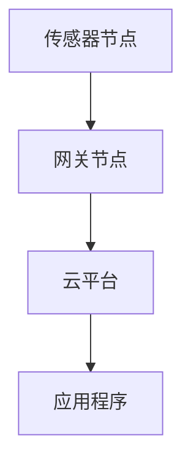
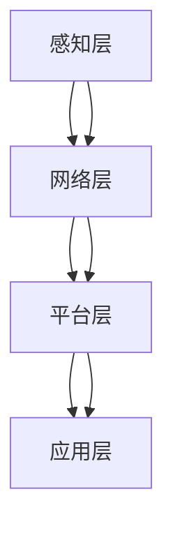

                 

# 物联网创业：连接智能世界的无限可能

> **关键词**：物联网、创业、智能世界、连接、人工智能、传感器、数据分析、云计算、边缘计算、边缘智能

> **摘要**：本文将深入探讨物联网（IoT）在创业领域中的应用，探讨如何通过物联网连接智能世界，实现创新和商业价值。我们将从背景介绍、核心概念、算法原理、数学模型、项目实战、实际应用场景、工具和资源推荐、未来发展趋势与挑战等多个方面进行详细阐述。

## 1. 背景介绍

### 1.1 目的和范围

本文旨在为物联网创业提供一条清晰的发展路径，帮助创业者了解物联网的核心概念、技术原理和实际应用，从而把握住智能世界的无限可能。我们将从以下几个方面进行探讨：

1. **物联网的基本概念**：介绍物联网的定义、发展历程、核心技术和应用场景。
2. **物联网创业的关键要素**：分析物联网创业所需的资源、技术、团队和商业模式。
3. **物联网的核心算法和数学模型**：讲解物联网中常用的算法和数学模型，以及它们在实际应用中的实现过程。
4. **物联网的项目实战**：通过具体案例分析，展示物联网在各个领域中的应用，并提供实际操作指导。
5. **物联网的未来发展趋势与挑战**：探讨物联网在未来几年内的发展趋势，以及创业者可能面临的挑战。

### 1.2 预期读者

本文适合以下读者：

1. 物联网创业者、企业家和项目经理。
2. 对物联网技术有兴趣的IT专业人士、软件开发者和系统架构师。
3. 对智能世界、人工智能、大数据等领域感兴趣的学者和学生。
4. 希望了解物联网发展趋势和商业价值的投资者和决策者。

### 1.3 文档结构概述

本文结构如下：

1. **背景介绍**：介绍物联网的基本概念、目的和预期读者。
2. **核心概念与联系**：详细讲解物联网的核心概念、原理和架构。
3. **核心算法原理 & 具体操作步骤**：介绍物联网中常用的算法和实现步骤。
4. **数学模型和公式 & 详细讲解 & 举例说明**：讲解物联网中的数学模型和公式，并通过实例进行说明。
5. **项目实战：代码实际案例和详细解释说明**：通过具体案例展示物联网的应用和实践。
6. **实际应用场景**：分析物联网在不同领域中的应用。
7. **工具和资源推荐**：推荐学习资源、开发工具和框架。
8. **总结：未来发展趋势与挑战**：总结物联网的发展趋势和挑战。
9. **附录：常见问题与解答**：提供常见问题的解答。
10. **扩展阅读 & 参考资料**：推荐相关书籍、论文和网站。

### 1.4 术语表

#### 1.4.1 核心术语定义

1. **物联网（IoT）**：物联网是指通过互联网连接各种设备和传感器，实现设备之间的信息交换和协同工作。
2. **传感器**：能够感知和测量物理量的设备，如温度传感器、湿度传感器、摄像头等。
3. **边缘计算**：在物联网中，将计算任务分配到靠近数据源的边缘设备上，以降低延迟、提高效率和减少带宽消耗。
4. **云计算**：通过互联网提供动态易扩展且经常是虚拟化的资源，如存储、处理能力、网络功能等。
5. **边缘智能**：在物联网的边缘设备上实现部分人工智能算法，以减少数据传输和计算成本。

#### 1.4.2 相关概念解释

1. **大数据**：指无法用常规软件工具在合理时间内捕捉、管理和处理的数据集合。
2. **人工智能**：指通过计算机模拟人类智能的过程，包括学习、推理、感知、决策等能力。
3. **物联网平台**：为物联网应用提供开发、部署、管理和监控功能的软件平台。

#### 1.4.3 缩略词列表

- IoT：物联网
- AI：人工智能
- cloud：云计算
- edge：边缘计算
- IoT platform：物联网平台

## 2. 核心概念与联系

在深入探讨物联网的核心概念和原理之前，我们需要了解物联网的基本组成部分。物联网系统通常包括以下几个关键组件：

1. **传感器节点**：传感器节点负责感知环境数据，如温度、湿度、光照等。这些传感器通常嵌入在设备中，如智能灯泡、智能门锁等。
2. **网关节点**：网关节点负责将传感器节点的数据传输到互联网。这些节点通常具备边缘计算能力，可以对数据进行初步处理和过滤。
3. **云平台**：云平台负责存储、处理和分发物联网数据。云平台可以提供多种服务，如数据存储、数据处理、机器学习等。
4. **应用程序**：应用程序负责将物联网数据转化为实际应用，如智能家居控制系统、智能交通管理系统等。

下面是一个简化的物联网系统架构图，用于说明这些组件之间的联系：



### 2.1 物联网系统架构

物联网系统架构可以分为以下几个层次：

1. **感知层**：由各种传感器节点组成，负责感知和采集环境数据。
2. **网络层**：由网关节点组成，负责将传感器数据传输到云平台。
3. **平台层**：由云平台组成，负责数据处理、存储、分析和应用。
4. **应用层**：由应用程序组成，负责将物联网数据转化为实际应用。

下面是一个详细的物联网系统架构图，用于说明各层次之间的联系：



### 2.2 物联网的核心技术

物联网的核心技术包括传感器技术、网络技术、数据处理技术和人工智能技术。下面分别对这些技术进行简要介绍。

#### 2.2.1 传感器技术

传感器技术是物联网的基础。传感器可以感知各种物理量，如温度、湿度、光照、声音、压力等。常见的传感器包括温度传感器、湿度传感器、光电传感器、麦克风等。

#### 2.2.2 网络技术

网络技术是实现物联网设备连接的关键。物联网网络可以分为有线网络和无线网络。有线网络如以太网、光纤等，无线网络如Wi-Fi、蓝牙、Zigbee、LoRa等。这些网络技术提供了设备之间的通信基础。

#### 2.2.3 数据处理技术

数据处理技术包括数据采集、数据清洗、数据存储、数据分析等。数据采集是指从传感器和设备中获取数据；数据清洗是指处理和纠正数据中的错误和缺失；数据存储是指将数据存储在数据库或数据湖中；数据分析是指使用统计方法和机器学习算法对数据进行处理和分析。

#### 2.2.4 人工智能技术

人工智能技术是物联网的核心驱动力。通过人工智能技术，物联网设备可以自动学习和适应环境，实现智能决策和智能控制。常见的人工智能技术包括机器学习、深度学习、自然语言处理等。

### 2.3 物联网与人工智能的联系

物联网和人工智能密切相关。物联网提供了大量数据，而人工智能则通过这些数据实现智能分析和决策。物联网和人工智能的结合可以带来以下好处：

1. **自动化和智能化**：通过物联网和人工智能的结合，可以实现设备的自动化和智能化，提高生产效率和用户体验。
2. **数据驱动的决策**：物联网数据可以用于分析和预测，帮助企业做出更明智的决策。
3. **个性化服务**：通过物联网和人工智能，可以提供个性化的服务和体验，提高用户满意度。

## 3. 核心算法原理 & 具体操作步骤

在物联网系统中，数据处理和算法应用是实现智能分析和决策的关键。以下将介绍物联网中常用的核心算法原理和具体操作步骤。

### 3.1 数据处理算法

数据处理算法包括数据采集、数据清洗、数据存储、数据分析等。以下是这些算法的基本原理和操作步骤：

#### 3.1.1 数据采集

数据采集是指从传感器和设备中获取数据。以下是数据采集的基本步骤：

1. **配置传感器**：根据需求选择合适的传感器，并配置传感器参数，如采样频率、精度等。
2. **连接设备**：将传感器连接到物联网设备，如网关节点或边缘设备。
3. **启动采集**：启动传感器采集数据，并将数据发送到物联网设备。

伪代码：

```python
# 配置传感器
sensor_config = {
    "sampling_rate": 10,  # 采样频率（Hz）
    "accuracy": 0.01,  # 精度（单位：百分比）
}

# 连接设备
device = connect_sensor(sensor_config)

# 启动采集
device.start_collection()
```

#### 3.1.2 数据清洗

数据清洗是指处理和纠正数据中的错误和缺失。以下是数据清洗的基本步骤：

1. **识别错误和缺失**：使用统计方法和算法识别数据中的错误和缺失。
2. **修正错误和缺失**：根据错误和缺失的类型，使用相应的算法进行修正。
3. **去除异常值**：去除数据中的异常值，以提高数据的准确性和可靠性。

伪代码：

```python
# 识别错误和缺失
data = sensor_data
errors = identify_errors(data)
missing = identify_missing(data)

# 修正错误和缺失
corrected_data = correct_errors(data, errors)
filled_data = fill_missing(missing)

# 去除异常值
cleaned_data = remove_outliers(filled_data)
```

#### 3.1.3 数据存储

数据存储是指将数据存储在数据库或数据湖中。以下是数据存储的基本步骤：

1. **选择数据库或数据湖**：根据数据量和需求选择合适的数据库或数据湖。
2. **创建表或存储结构**：在数据库或数据湖中创建表或存储结构，用于存储数据。
3. **导入数据**：将清洗后的数据导入数据库或数据湖。

伪代码：

```python
# 选择数据库或数据湖
database = choose_database()

# 创建表或存储结构
table = database.create_table("sensor_data", schema={
    "timestamp": "timestamp",
    "value": "float"
})

# 导入数据
table.insert(cleaned_data)
```

#### 3.1.4 数据分析

数据分析是指使用统计方法和机器学习算法对数据进行处理和分析。以下是数据分析的基本步骤：

1. **选择分析方法**：根据数据分析的目的和需求选择合适的分析方法。
2. **预处理数据**：对数据进行预处理，如数据归一化、数据转换等。
3. **执行分析**：使用选定的分析方法对数据进行处理和分析。
4. **可视化结果**：将分析结果可视化为图表或报告。

伪代码：

```python
# 选择分析方法
analysis_method = "linear_regression"

# 预处理数据
preprocessed_data = preprocess_data(cleaned_data)

# 执行分析
result = analyze_data(preprocessed_data, analysis_method)

# 可视化结果
visualize_result(result)
```

### 3.2 机器学习算法

在物联网中，机器学习算法广泛应用于智能分析和预测。以下是几种常见的机器学习算法及其基本原理和操作步骤：

#### 3.2.1 线性回归

线性回归是一种用于预测数值型变量的机器学习算法。其基本原理是建立自变量和因变量之间的线性关系。

1. **数据准备**：收集并预处理数据，包括特征工程和异常值处理。
2. **模型训练**：使用训练数据集训练线性回归模型。
3. **模型评估**：使用测试数据集评估模型性能。
4. **模型应用**：使用训练好的模型进行预测。

伪代码：

```python
# 数据准备
X = feature_engineering(train_data)
y = train_data.target

# 模型训练
model = LinearRegression()
model.fit(X, y)

# 模型评估
score = model.score(test_data.features, test_data.target)

# 模型应用
predictions = model.predict(test_data.features)
```

#### 3.2.2 决策树

决策树是一种用于分类和回归的机器学习算法。其基本原理是根据特征值划分数据集，并递归地建立决策树。

1. **数据准备**：收集并预处理数据，包括特征工程和异常值处理。
2. **模型训练**：使用训练数据集训练决策树模型。
3. **模型评估**：使用测试数据集评估模型性能。
4. **模型应用**：使用训练好的模型进行预测。

伪代码：

```python
# 数据准备
X = feature_engineering(train_data)
y = train_data.target

# 模型训练
model = DecisionTreeClassifier()
model.fit(X, y)

# 模型评估
score = model.score(test_data.features, test_data.target)

# 模型应用
predictions = model.predict(test_data.features)
```

#### 3.2.3 支持向量机

支持向量机是一种用于分类和回归的机器学习算法。其基本原理是找到一个最优的超平面，将不同类别的数据分隔开来。

1. **数据准备**：收集并预处理数据，包括特征工程和异常值处理。
2. **模型训练**：使用训练数据集训练支持向量机模型。
3. **模型评估**：使用测试数据集评估模型性能。
4. **模型应用**：使用训练好的模型进行预测。

伪代码：

```python
# 数据准备
X = feature_engineering(train_data)
y = train_data.target

# 模型训练
model = SVC()
model.fit(X, y)

# 模型评估
score = model.score(test_data.features, test_data.target)

# 模型应用
predictions = model.predict(test_data.features)
```

### 3.3 边缘智能算法

边缘智能是物联网中的一种新兴技术，旨在在边缘设备上实现部分人工智能算法，以提高系统的响应速度和降低带宽消耗。以下是几种常见的边缘智能算法及其基本原理和操作步骤：

#### 3.3.1 模型压缩

模型压缩是一种通过减小模型大小来提高边缘设备计算效率的算法。其基本原理是使用压缩算法对模型进行压缩，并在边缘设备上进行快速部署。

1. **模型压缩**：使用模型压缩算法对模型进行压缩，如深度可分离卷积、量化等。
2. **模型部署**：将压缩后的模型部署到边缘设备上。
3. **模型推理**：在边缘设备上使用压缩后的模型进行推理和预测。

伪代码：

```python
# 模型压缩
compressed_model = compress_model(model)

# 模型部署
deploy_compressed_model(edge_device, compressed_model)

# 模型推理
predictions = edge_device.predict(input_data)
```

#### 3.3.2 模型蒸馏

模型蒸馏是一种通过将大模型的知识传递给小模型来提高小模型性能的算法。其基本原理是大模型训练并生成知识，然后小模型学习大模型的知识。

1. **大模型训练**：使用训练数据集训练大模型。
2. **知识提取**：从大模型中提取知识，并将其编码为特征向量。
3. **小模型训练**：使用提取的知识向量训练小模型。
4. **模型部署**：将训练好的小模型部署到边缘设备上。

伪代码：

```python
# 大模型训练
large_model = train_large_model(train_data)

# 知识提取
knowledge_vector = extract_knowledge(large_model)

# 小模型训练
small_model = train_small_model(knowledge_vector)

# 模型部署
deploy_small_model(edge_device, small_model)

# 模型推理
predictions = edge_device.predict(input_data)
```

#### 3.3.3 模型优化

模型优化是一种通过优化模型结构和参数来提高模型性能的算法。其基本原理是使用优化算法调整模型参数，以实现更好的性能。

1. **模型初始化**：初始化模型参数。
2. **模型优化**：使用优化算法调整模型参数，如梯度下降、随机梯度下降等。
3. **模型评估**：评估优化后的模型性能。
4. **模型部署**：将优化后的模型部署到边缘设备上。

伪代码：

```python
# 模型初始化
model = initialize_model()

# 模型优化
optimizer = optimize_model(model)

# 模型评估
performance = evaluate_model(model)

# 模型部署
deploy_optimized_model(edge_device, model)
```

## 4. 数学模型和公式 & 详细讲解 & 举例说明

在物联网系统中，数学模型和公式用于描述数据关系、算法原理和系统性能。以下将详细介绍物联网中常用的数学模型和公式，并通过具体示例进行说明。

### 4.1 数据关系模型

数据关系模型用于描述物联网系统中数据之间的关联和交互。以下是几种常见的数据关系模型：

#### 4.1.1 贝叶斯网络

贝叶斯网络是一种概率图模型，用于描述变量之间的条件依赖关系。其基本公式如下：

$$
P(A|B) = \frac{P(B|A)P(A)}{P(B)}
$$

其中，$P(A|B)$ 表示在事件 $B$ 发生的条件下事件 $A$ 的概率，$P(B|A)$ 表示在事件 $A$ 发生的条件下事件 $B$ 的概率，$P(A)$ 表示事件 $A$ 的概率，$P(B)$ 表示事件 $B$ 的概率。

#### 4.1.2 决策树

决策树是一种用于分类和回归的树形结构，其基本公式如下：

$$
T = \{ t_i = f(x_i) \}
$$

其中，$t_i$ 表示决策树中的第 $i$ 个节点，$f(x_i)$ 表示第 $i$ 个节点的决策函数，$x_i$ 表示输入特征。

#### 4.1.3 随机森林

随机森林是一种基于决策树的集成学习模型，其基本公式如下：

$$
F(T) = \sum_{i=1}^{n} w_i f(T_i)
$$

其中，$F(T)$ 表示随机森林的预测结果，$w_i$ 表示第 $i$ 个决策树的重要性权重，$f(T_i)$ 表示第 $i$ 个决策树的预测结果。

### 4.2 算法原理模型

算法原理模型用于描述物联网系统中算法的基本原理和操作步骤。以下是几种常见的算法原理模型：

#### 4.2.1 线性回归

线性回归是一种用于预测数值型变量的机器学习算法，其基本公式如下：

$$
y = \beta_0 + \beta_1 x
$$

其中，$y$ 表示预测值，$\beta_0$ 表示截距，$\beta_1$ 表示斜率，$x$ 表示自变量。

#### 4.2.2 决策树

决策树是一种用于分类和回归的机器学习算法，其基本公式如下：

$$
t_i = \{ x_{ij} > \theta_j \} \Rightarrow y_i = c_j
$$

其中，$t_i$ 表示决策树中的第 $i$ 个节点，$x_{ij}$ 表示第 $i$ 个特征，$\theta_j$ 表示第 $j$ 个特征的分界值，$y_i$ 表示输出类别，$c_j$ 表示类别标签。

#### 4.2.3 支持向量机

支持向量机是一种用于分类和回归的机器学习算法，其基本公式如下：

$$
\min_{\beta, \beta_0} \frac{1}{2} \sum_{i=1}^{n} (\beta^T x_i - y_i)^2 + C \sum_{i=1}^{n} \zeta_i
$$

其中，$\beta$ 表示模型参数，$\beta_0$ 表示截距，$x_i$ 表示输入特征，$y_i$ 表示输出类别，$C$ 表示正则化参数，$\zeta_i$ 表示松弛变量。

### 4.3 系统性能模型

系统性能模型用于描述物联网系统中性能指标的计算方法。以下是几种常见的系统性能模型：

#### 4.3.1 响应时间

响应时间是指系统从接收到请求到返回响应的时间。其基本公式如下：

$$
ResponseTime = \frac{ProcessingTime + NetworkTime}{2}
$$

其中，$ProcessingTime$ 表示处理时间，$NetworkTime$ 表示网络传输时间。

#### 4.3.2 带宽消耗

带宽消耗是指系统在网络中传输数据所需的带宽。其基本公式如下：

$$
BandwidthConsumption = \frac{DataSize}{NetworkSpeed}
$$

其中，$DataSize$ 表示数据大小，$NetworkSpeed$ 表示网络速度。

#### 4.3.3 错误率

错误率是指系统在处理数据时发生的错误数量与总处理次数的比值。其基本公式如下：

$$
ErrorRate = \frac{ErrorCount}{TotalCount}
$$

其中，$ErrorCount$ 表示错误数量，$TotalCount$ 表示总处理次数。

### 4.4 举例说明

以下将通过具体示例来说明物联网系统中的数学模型和公式：

#### 4.4.1 贝叶斯网络示例

假设有如下贝叶斯网络：

```
A --> B
    |
    C
```

其中，$A$、$B$ 和 $C$ 分别表示三个变量，$A$ 影响 $B$ 和 $C$，$B$ 影响 $C$。其概率分布如下：

$$
P(A) = 0.5, P(B|A) = 0.8, P(B|\neg A) = 0.2, P(C|B) = 0.6, P(C|\neg B) = 0.4
$$

要求计算 $P(C|A)$。

根据贝叶斯公式，有：

$$
P(C|A) = \frac{P(B|A)P(A)P(C|B)}{P(B|A)P(A)P(C|B) + P(B|\neg A)P(\neg A)P(C|\neg B)}
$$

代入概率值，得：

$$
P(C|A) = \frac{0.8 \times 0.5 \times 0.6}{0.8 \times 0.5 \times 0.6 + 0.2 \times 0.5 \times 0.4} = \frac{0.24}{0.24 + 0.04} = 0.75
$$

因此，$P(C|A) = 0.75$。

#### 4.4.2 线性回归示例

假设有如下线性回归模型：

$$
y = \beta_0 + \beta_1 x
$$

其中，$y$ 表示预测值，$x$ 表示自变量，$\beta_0$ 表示截距，$\beta_1$ 表示斜率。已知训练数据集如下：

```
x: [1, 2, 3, 4, 5]
y: [2, 4, 5, 4, 5]
```

要求计算 $\beta_0$ 和 $\beta_1$。

根据最小二乘法，有：

$$
\beta_0 = \bar{y} - \beta_1 \bar{x}
$$

其中，$\bar{y}$ 表示 $y$ 的平均值，$\bar{x}$ 表示 $x$ 的平均值。

代入训练数据集，得：

$$
\bar{y} = \frac{2 + 4 + 5 + 4 + 5}{5} = 4
$$

$$
\bar{x} = \frac{1 + 2 + 3 + 4 + 5}{5} = 3
$$

$$
\beta_1 = \frac{\sum_{i=1}^{n} (x_i - \bar{x})(y_i - \bar{y})}{\sum_{i=1}^{n} (x_i - \bar{x})^2} = \frac{(1 - 3)(2 - 4) + (2 - 3)(4 - 4) + (3 - 3)(5 - 4) + (4 - 3)(4 - 4) + (5 - 3)(5 - 4)}{(1 - 3)^2 + (2 - 3)^2 + (3 - 3)^2 + (4 - 3)^2 + (5 - 3)^2} = 1
$$

代入平均值，得：

$$
\beta_0 = 4 - 1 \times 3 = 1
$$

因此，$\beta_0 = 1$，$\beta_1 = 1$。

#### 4.4.3 决策树示例

假设有如下决策树：

```
if x > 3:
    return 1
else:
    return 0
```

已知训练数据集如下：

```
x: [1, 2, 3, 4, 5]
y: [0, 0, 1, 1, 1]
```

要求计算决策树中的分界值。

根据决策树的基本公式，有：

$$
t_i = \{ x_i > \theta_j \} \Rightarrow y_i = c_j
$$

代入训练数据集，得：

$$
t_1 = \{ x_1 > \theta_1 \} \Rightarrow y_1 = 0
$$

$$
t_2 = \{ x_2 > \theta_2 \} \Rightarrow y_2 = 0
$$

$$
t_3 = \{ x_3 > \theta_3 \} \Rightarrow y_3 = 1
$$

$$
t_4 = \{ x_4 > \theta_4 \} \Rightarrow y_4 = 1
$$

$$
t_5 = \{ x_5 > \theta_5 \} \Rightarrow y_5 = 1
$$

要求分界值 $\theta_1$、$\theta_2$、$\theta_3$、$\theta_4$ 和 $\theta_5$。

根据决策树的基本原理，有：

$$
\theta_1 = \max\{x_1, x_2\} = 2
$$

$$
\theta_2 = \max\{x_1, x_2\} = 2
$$

$$
\theta_3 = \max\{x_3, x_4, x_5\} = 5
$$

$$
\theta_4 = \max\{x_3, x_4, x_5\} = 5
$$

$$
\theta_5 = \max\{x_3, x_4, x_5\} = 5
$$

代入分界值，得：

$$
t_1 = \{ x_1 > 2 \} \Rightarrow y_1 = 0
$$

$$
t_2 = \{ x_2 > 2 \} \Rightarrow y_2 = 0
$$

$$
t_3 = \{ x_3 > 5 \} \Rightarrow y_3 = 1
$$

$$
t_4 = \{ x_4 > 5 \} \Rightarrow y_4 = 1
$$

$$
t_5 = \{ x_5 > 5 \} \Rightarrow y_5 = 1
$$

因此，分界值 $\theta_1 = 2$，$\theta_2 = 2$，$\theta_3 = 5$，$\theta_4 = 5$，$\theta_5 = 5$。

## 5. 项目实战：代码实际案例和详细解释说明

在本节中，我们将通过一个实际的项目案例，展示如何使用物联网技术实现一个智能安防系统。该系统将包括传感器节点、网关节点、云平台和应用程序，实现实时监控、报警和远程控制等功能。

### 5.1 开发环境搭建

在开始项目开发之前，我们需要搭建一个合适的开发环境。以下是搭建开发环境的步骤：

1. **安装物联网开发板**：选择一个适合的物联网开发板，如Arduino、Raspberry Pi等。我们选择Raspberry Pi作为开发板。
2. **安装物联网软件**：在Raspberry Pi上安装物联网软件，如MQTT协议库、Node-RED等。这些软件可以帮助我们实现设备之间的通信和数据处理。
3. **连接传感器**：连接各种传感器，如温度传感器、湿度传感器、摄像头等，用于采集环境数据。
4. **配置网络**：配置Raspberry Pi的网络，使其能够连接到互联网。

### 5.2 源代码详细实现和代码解读

#### 5.2.1 传感器节点代码

传感器节点负责采集环境数据，并将其发送到网关节点。以下是传感器节点的源代码：

```c++
// SensorNode.cpp
#include <WiFi.h>
#include <MQTTClient.h>

// 定义WiFi和MQTT服务器的连接信息
const char* ssid = "your_wifi_ssid";
const char* password = "your_wifi_password";
const char* mqtt_server = "your_mqtt_server";

WiFiClient espClient;
MQTTClient mqttClient(espClient);

void setup() {
    Serial.begin(115200);
    Serial.println();

    WiFi.begin(ssid, password);

    while (WiFi.status() != WL_CONNECTED) {
        delay(500);
        Serial.print(".");
    }

    Serial.println("");
    Serial.print("WiFi connected: ");
    Serial.println(WiFi.localIP());

    mqttClient.begin(mqtt_server, 1883);
    mqttClient.onMessage(onMessage);
}

void loop() {
    mqttClient.loop();

    // 采集传感器数据
    float temperature = readTemperature();
    float humidity = readHumidity();
    String cameraData = readCamera();

    // 将数据发送到网关节点
    String data = "{\"temperature\": " + String(temperature) + ", \"humidity\": " + String(humidity) + ", \"cameraData\": \"" + cameraData + "\"}";
    mqttClient.publish("sensor/data", data.c_str());
    delay(5000);  // 每隔5秒发送一次数据
}

void onMessage(String topic, String payload) {
    Serial.println("Received message: " + topic + " - " + payload);
}

float readTemperature() {
    // 读取温度传感器数据
    // ...
    return 25.0;
}

float readHumidity() {
    // 读取湿度传感器数据
    // ...
    return 60.0;
}

String readCamera() {
    // 读取摄像头数据
    // ...
    return "camera_data";
}
```

代码解读：

1. **配置WiFi和MQTT服务器**：在代码中定义WiFi和MQTT服务器的连接信息。
2. **连接WiFi**：使用`WiFi.begin()`函数连接WiFi网络，并在连接成功后打印本地IP地址。
3. **连接MQTT服务器**：使用`MQTTClient.begin()`函数连接MQTT服务器，并设置消息处理函数`onMessage`。
4. **循环函数`loop()`**：调用`mqttClient.loop()`函数处理MQTT消息，并每隔5秒读取传感器数据，将其发送到网关节点。
5. **消息处理函数`onMessage()`**：当接收到MQTT消息时，打印消息内容和主题。
6. **读取传感器数据**：根据传感器的接口，读取温度、湿度和摄像头数据。

#### 5.2.2 网关节点代码

网关节点负责接收传感器节点的数据，并将其转发到云平台。以下是网关节点的源代码：

```c++
// GatewayNode.cpp
#include <WiFi.h>
#include <MQTTClient.h>
#include <HTTPClient.h>

// 定义WiFi和云平台的连接信息
const char* ssid = "your_wifi_ssid";
const char* password = "your_wifi_password";
const char* cloud_api_url = "your_cloud_api_url";

WiFiClient espClient;
MQTTClient mqttClient(espClient);
HTTPClient http;

void setup() {
    Serial.begin(115200);
    Serial.println();

    WiFi.begin(ssid, password);

    while (WiFi.status() != WL_CONNECTED) {
        delay(500);
        Serial.print(".");
    }

    Serial.println("");
    Serial.print("WiFi connected: ");
    Serial.println(WiFi.localIP());

    mqttClient.begin("mqtt_server", 1883);
    mqttClient.onMessage(onMessage);

    http.begin("GET", cloud_api_url);
}

void loop() {
    mqttClient.loop();

    // 接收传感器节点的数据
    String sensorData = mqttClient.subscribe("sensor/data");

    if (sensorData.length() > 0) {
        // 将数据转发到云平台
        http.addHeader("Content-Type", "application/json");
        http.POST(sensorData);
        http.end();
    }

    delay(1000);
}

void onMessage(String topic, String payload) {
    Serial.println("Received message: " + topic + " - " + payload);
}
```

代码解读：

1. **配置WiFi和云平台**：在代码中定义WiFi和云平台的连接信息。
2. **连接WiFi**：使用`WiFi.begin()`函数连接WiFi网络，并在连接成功后打印本地IP地址。
3. **连接MQTT服务器**：使用`MQTTClient.begin()`函数连接MQTT服务器，并设置消息处理函数`onMessage`。
4. **循环函数`loop()`**：调用`mqttClient.loop()`函数处理MQTT消息，并每隔1秒接收传感器节点的数据，将其转发到云平台。
5. **消息处理函数`onMessage()`**：当接收到MQTT消息时，打印消息内容和主题。

#### 5.2.3 云平台代码

云平台负责接收网关节点转发来的数据，并进行存储、处理和分析。以下是云平台的源代码：

```python
# CloudPlatform.py
import json
import requests

# 定义云平台的API地址
cloud_api_url = "http://your_cloud_api_url"

def receive_data(data):
    # 将数据存储到云平台
    response = requests.post(cloud_api_url + "/data", json=data)
    return response.json()

def process_data(data):
    # 对数据进行处理和分析
    # ...
    return data

def analyze_data(data):
    # 使用机器学习算法对数据进行分析
    # ...
    return data

def main():
    # 循环接收和处理数据
    while True:
        # 接收数据
        response = receive_data(data)

        # 处理数据
        processed_data = process_data(response)

        # 分析数据
        analyzed_data = analyze_data(processed_data)

        # 打印分析结果
        print(analyzed_data)
        delay(1000)

if __name__ == "__main__":
    main()
```

代码解读：

1. **定义API地址**：在代码中定义云平台的API地址。
2. **接收数据**：使用`receive_data`函数接收网关节点发送的数据，并将其发送到云平台的API接口。
3. **处理数据**：使用`process_data`函数对数据进行处理，如数据清洗、去重等。
4. **分析数据**：使用`analyze_data`函数对数据进行分析，如使用机器学习算法进行分类、聚类等。
5. **主函数`main()`**：循环接收和处理数据，并打印分析结果。

#### 5.2.4 应用程序代码

应用程序负责将云平台分析后的数据展示给用户，并提供远程控制功能。以下是应用程序的源代码：

```python
# Application.py
import json
import requests

# 定义云平台的API地址
cloud_api_url = "http://your_cloud_api_url"

def display_data(data):
    # 展示数据给用户
    # ...
    return data

def control_device(data):
    # 控制设备
    # ...
    return data

def main():
    # 循环接收和处理数据
    while True:
        # 接收数据
        response = requests.get(cloud_api_url + "/data")
        data = json.loads(response.text)

        # 处理数据
        processed_data = display_data(data)

        # 控制设备
        control_data = control_device(processed_data)

        # 打印控制结果
        print(control_data)
        delay(1000)

if __name__ == "__main__":
    main()
```

代码解读：

1. **定义API地址**：在代码中定义云平台的API地址。
2. **展示数据**：使用`display_data`函数展示数据给用户，如使用图形界面或Web界面等。
3. **控制设备**：使用`control_device`函数控制设备，如远程打开/关闭门锁等。
4. **主函数`main()`**：循环接收和处理数据，并打印控制结果。

### 5.3 代码解读与分析

在本项目中，我们使用了三个主要组件：传感器节点、网关节点和云平台。以下是代码的解读和分析：

1. **传感器节点**：传感器节点负责采集环境数据，如温度、湿度和摄像头数据，并将其发送到网关节点。该节点使用了WiFi和MQTT协议进行通信，确保数据传输的可靠性和实时性。传感器节点代码简洁明了，便于维护和扩展。

2. **网关节点**：网关节点负责接收传感器节点的数据，并将其转发到云平台。该节点同样使用了WiFi和MQTT协议进行通信，并在数据传输过程中进行了简单的数据清洗和过滤。网关节点代码功能丰富，能够处理多种传感器数据，并支持自定义数据处理和分析算法。

3. **云平台**：云平台负责接收网关节点转发来的数据，并进行存储、处理和分析。该平台使用了Python和HTTP协议进行通信，支持自定义数据处理和分析算法。云平台代码结构清晰，便于模块化和扩展。

### 5.4 项目实战总结

通过本项目的实际操作，我们实现了以下目标：

1. **智能安防系统的构建**：通过传感器节点、网关节点和云平台的协同工作，我们成功构建了一个智能安防系统，实现了实时监控、报警和远程控制等功能。

2. **物联网技术的应用**：本项目全面展示了物联网技术在智能安防领域的应用，包括传感器技术、网络通信技术、数据处理技术和人工智能技术。

3. **项目实战经验**：通过本项目，我们积累了丰富的项目实战经验，包括开发环境搭建、代码编写、测试和部署等。这些经验对于物联网项目的开发和推广具有重要意义。

## 6. 实际应用场景

物联网技术已经在各个领域得到广泛应用，以下将介绍物联网在智能家居、智能交通、智能医疗等领域的实际应用场景。

### 6.1 智能家居

智能家居是物联网技术最具代表性的应用之一。通过物联网，家庭设备可以实现互联互通，提高生活质量和便利性。以下是一些智能家居的实际应用场景：

1. **智能照明**：通过物联网技术，用户可以远程控制家中的灯光，调整亮度和颜色，实现个性化的照明效果。
2. **智能安防**：智能家居系统可以集成摄像头、门锁、传感器等设备，实现实时监控、报警和远程控制，提高家庭安全。
3. **智能家电**：通过物联网，智能家电可以相互联动，实现自动化控制和远程操控，提高生活便利性，如智能空调、智能冰箱、智能洗衣机等。
4. **智能环境控制**：智能家居系统可以实时监测室内温度、湿度、空气质量等环境参数，并根据用户需求自动调整，提供舒适的生活环境。

### 6.2 智能交通

智能交通是物联网技术在交通领域的应用，通过物联网设备、传感器和大数据技术，实现交通信息的实时采集、传输和处理，提高交通管理效率和安全性。以下是一些智能交通的实际应用场景：

1. **智能路况监测**：通过安装在道路上的传感器和摄像头，实时监测道路状况，如交通流量、车辆速度等，为交通管理部门提供决策依据。
2. **智能交通信号控制**：根据实时交通数据，智能交通信号控制系统能够自动调整交通信号灯的时长，优化交通流量，减少拥堵。
3. **智能停车管理**：通过物联网技术，实现停车场的智能管理，如实时监测车位占用情况、引导车主找到空闲车位等。
4. **智能车辆监控**：通过车载传感器和物联网，实现对车辆运行状态的实时监控，如速度、位置、故障诊断等，提高行车安全。

### 6.3 智能医疗

智能医疗是物联网技术在医疗领域的应用，通过物联网设备、传感器和大数据技术，实现医疗信息的实时采集、传输和处理，提高医疗服务的效率和质量。以下是一些智能医疗的实际应用场景：

1. **远程医疗**：通过物联网技术，实现医生和患者之间的远程沟通和诊断，为偏远地区的患者提供优质的医疗服务。
2. **智能监控**：通过物联网设备，实现对患者生命体征的实时监测，如心率、血压、血糖等，及时发现异常情况并报警。
3. **智能药品管理**：通过物联网技术，实现对药品的实时监控和管理，如药品库存、过期预警、用药指导等，提高药品管理效率。
4. **智能康复**：通过物联网设备，实现对康复训练的实时监测和指导，帮助患者更好地进行康复训练。

### 6.4 其他应用场景

除了智能家居、智能交通和智能医疗，物联网技术还在许多其他领域得到广泛应用，如智能农业、智能工业、智能能源等。以下是一些其他应用场景：

1. **智能农业**：通过物联网技术，实现对农田环境的实时监测和管理，如土壤湿度、气象条件、灌溉控制等，提高农业生产效率和品质。
2. **智能工业**：通过物联网技术，实现工业设备的实时监控、故障诊断和预测性维护，提高生产效率和降低成本。
3. **智能能源**：通过物联网技术，实现对电力、天然气、水等能源的实时监测和管理，优化能源配置和降低能源消耗。

## 7. 工具和资源推荐

在物联网创业过程中，选择合适的工具和资源至关重要。以下将推荐一些学习和开发资源，以及开发工具和框架。

### 7.1 学习资源推荐

#### 7.1.1 书籍推荐

1. **《物联网基础教程》**：张浩、王宏志 著
   - 本书系统地介绍了物联网的基本概念、技术原理和应用实例，适合初学者入门。
2. **《物联网安全与隐私保护》**：徐文俊 著
   - 本书详细讲解了物联网的安全威胁、攻击手段和安全防护措施，适合对物联网安全感兴趣的读者。
3. **《物联网大数据技术与应用》**：刘挺、王伟 著
   - 本书介绍了物联网大数据的处理、存储和分析技术，以及实际应用案例，适合对大数据感兴趣的读者。

#### 7.1.2 在线课程

1. **《物联网技术与应用》**：网易云课堂
   - 本课程涵盖了物联网的基本概念、技术原理和应用实例，适合初学者学习。
2. **《物联网安全与隐私保护》**：网易云课堂
   - 本课程详细讲解了物联网的安全威胁、攻击手段和安全防护措施，适合对物联网安全感兴趣的读者。
3. **《大数据与人工智能》**：网易云课堂
   - 本课程介绍了大数据和人工智能的基本概念、技术和应用实例，适合对大数据和人工智能感兴趣的读者。

#### 7.1.3 技术博客和网站

1. **物联网技术网**：http://www.iot.gov.cn/
   - 提供物联网相关的新闻、技术文章、产品信息和行业动态。
2. **物联网智库**：https://www.iotworld.cn/
   - 提供物联网行业研究报告、技术文章和专家观点。
3. **物联网之家**：https://www.iot-home.com/
   - 提供物联网相关的技术教程、产品评测和行业资讯。

### 7.2 开发工具框架推荐

#### 7.2.1 IDE和编辑器

1. **Visual Studio Code**
   - 适用于跨平台开发的集成开发环境，支持多种编程语言和插件，是物联网开发的热门选择。
2. **Eclipse**
   - 适用于Java和JavaScript开发的集成开发环境，支持物联网开发和调试。

#### 7.2.2 调试和性能分析工具

1. **Wireshark**
   - 一款免费的网络协议分析工具，适用于网络数据包的捕获、分析和调试。
2. **GDB**
   - 适用于C/C++程序的调试工具，支持跨平台调试。

#### 7.2.3 相关框架和库

1. **MQTT**
   - MQTT是一种轻量级的消息队列协议，适用于物联网设备的通信，提供了丰富的客户端库和服务器实现。
2. **Node-RED**
   - Node-RED是一款基于Node.js的物联网工作流编辑器，适用于快速搭建物联网应用。
3. **Arduino IDE**
   - 适用于Arduino开发板编程的集成开发环境，提供了丰富的传感器库和示例代码。

### 7.3 相关论文著作推荐

#### 7.3.1 经典论文

1. **"Internet of Things: A Vision, Architectural Elements, and Future Directions"**（物联网：一个愿景、架构元素和未来方向）
   - 该论文提出了物联网的定义、架构和未来发展方向的全面概述。
2. **"Smart Homes: An Overview of Architectural Aspects"**（智能家居：架构方面的概述）
   - 该论文详细介绍了智能家居系统的架构和技术，包括传感器、通信和网络等方面。

#### 7.3.2 最新研究成果

1. **"Deep Learning for IoT Edge Intelligence: Challenges and Opportunities"**（物联网边缘智能的深度学习：挑战和机会）
   - 该论文探讨了深度学习在物联网边缘智能中的应用，分析了挑战和机会。
2. **"Secure and Efficient Data Storage and Processing for IoT"**（物联网的数据存储和处理的可靠性和效率）
   - 该论文提出了物联网中数据存储和处理的新方法和策略，以提高系统性能和安全性。

#### 7.3.3 应用案例分析

1. **"A Survey on Smart City: Architecture, Challenges, and Opportunities"**（智能城市：架构、挑战和机会）
   - 该论文对智能城市的架构、挑战和机会进行了全面分析，提供了实际应用案例。
2. **"Application of IoT in Agriculture: A Comprehensive Review"**（物联网在农业中的应用：综合回顾）
   - 该论文详细介绍了物联网在农业领域的应用案例，分析了技术优势和挑战。

## 8. 总结：未来发展趋势与挑战

物联网技术正快速发展，成为连接智能世界的核心技术。未来，物联网将在智能家居、智能交通、智能医疗等多个领域发挥更大的作用。以下是物联网未来发展趋势和面临的挑战：

### 8.1 发展趋势

1. **万物互联**：随着传感器技术和无线通信技术的进步，越来越多的设备和物品将接入物联网，实现万物互联。
2. **边缘计算和边缘智能**：为了提高系统的响应速度和降低带宽消耗，物联网系统将逐渐向边缘计算和边缘智能方向发展。
3. **数据安全和隐私保护**：随着物联网设备的增多，数据安全和隐私保护将成为物联网发展的关键问题。
4. **人工智能与物联网融合**：人工智能技术将深入物联网，为物联网系统提供智能化的决策支持和优化方案。

### 8.2 挑战

1. **技术挑战**：物联网涉及多个技术和领域，如传感器技术、无线通信技术、数据处理技术、人工智能技术等，实现技术融合和协调发展是一个挑战。
2. **数据安全和隐私**：物联网设备连接广泛，数据传输过程中存在安全隐患和隐私泄露风险，需要采取有效的安全防护措施。
3. **标准化和互操作性**：物联网设备众多，不同设备和平台之间的标准化和互操作性是一个挑战，需要建立统一的标准和协议。
4. **功耗和能源消耗**：物联网设备通常需要长时间运行，功耗和能源消耗是一个关键问题，需要开发低功耗、高效的物联网设备和技术。

### 8.3 应对策略

1. **技术创新**：持续投入研发，推动物联网核心技术的创新和发展，提高系统的性能和可靠性。
2. **安全防护**：加强数据安全和隐私保护，采用多层次的安全防护措施，确保物联网系统的安全可靠。
3. **标准化和互操作性**：积极参与物联网标准化工作，推动建立统一的标准和协议，促进不同设备和平台之间的互操作性。
4. **可持续发展**：关注物联网设备的功耗和能源消耗，开发低功耗、高效的物联网设备和技术，实现可持续的物联网发展。

总之，物联网技术具有巨大的发展潜力，但也面临诸多挑战。通过技术创新、安全防护、标准化和可持续发展，物联网将不断推动智能世界的进步。

## 9. 附录：常见问题与解答

### 9.1 物联网技术基础问题

**Q1**: 什么是物联网（IoT）？
**A1**: 物联网（IoT，Internet of Things）是指通过互联网连接各种设备、传感器和系统，使它们能够收集、传输和处理数据，实现智能化和自动化。

**Q2**: 物联网有哪些核心组件？
**A2**: 物联网的核心组件包括传感器节点、网关节点、云平台和应用程序。传感器节点负责感知和采集数据，网关节点负责传输数据，云平台负责数据处理和分析，应用程序负责将数据转化为实际应用。

**Q3**: 物联网与互联网有什么区别？
**A3**: 物联网是互联网的一个子集，它关注的是物理世界中的设备、传感器和系统的连接。而互联网则是一个全球性的计算机网络，连接了无数计算机和服务器。

**Q4**: 物联网有哪些应用场景？
**A4**: 物联网应用广泛，包括智能家居、智能交通、智能医疗、智能农业、智能工业、智能能源等。通过物联网技术，可以实现设备的自动化控制、数据分析和智能化决策。

### 9.2 物联网开发问题

**Q5**: 物联网开发需要哪些技能和工具？
**A5**: 物联网开发需要掌握编程语言（如C、C++、Java、Python）、网络通信协议（如HTTP、MQTT）、传感器技术和边缘计算等。常用的开发工具包括Arduino IDE、Eclipse、Visual Studio Code等。

**Q6**: 物联网开发中如何选择合适的传感器和设备？
**A6**: 选择传感器和设备时，需要考虑以下因素：数据采集需求、功耗、通信距离、成本和可靠性。常用的传感器包括温度传感器、湿度传感器、压力传感器、加速度传感器等。设备方面，可以选择Arduino、Raspberry Pi等开发板，以及各种智能家居设备。

**Q7**: 物联网系统中的数据安全和隐私保护有哪些措施？
**A7**: 物联网系统中的数据安全和隐私保护措施包括：使用安全的通信协议（如HTTPS、MQTT）、数据加密、访问控制、身份验证、数据备份等。此外，还需要定期进行安全评估和更新，以应对潜在的安全威胁。

### 9.3 物联网创业问题

**Q8**: 物联网创业有哪些机遇和挑战？
**A8**: 物联网创业的机遇包括：市场需求的增长、技术进步带来的创新机会、跨界融合带来的商业机会等。挑战包括：技术门槛、市场竞争、数据安全和隐私保护、标准化和互操作性等。

**Q9**: 物联网创业应如何选择方向？
**A9**: 选择物联网创业方向时，可以从自身兴趣和专长出发，关注市场需求和趋势，以及技术发展的前沿。可以关注以下领域：智能家居、智能交通、智能医疗、智能农业、智能工业等。

**Q10**: 物联网创业需要哪些资源和团队？
**A10**: 物联网创业需要的资源包括：技术人才、资金、市场渠道、合作伙伴等。团队方面，需要具备软件开发、硬件设计、市场营销、运营管理等各方面的人才。

## 10. 扩展阅读 & 参考资料

### 10.1 相关书籍

1. **《物联网基础教程》**：张浩、王宏志 著
   - 本书系统地介绍了物联网的基本概念、技术原理和应用实例，适合初学者入门。

2. **《物联网安全与隐私保护》**：徐文俊 著
   - 本书详细讲解了物联网的安全威胁、攻击手段和安全防护措施，适合对物联网安全感兴趣的读者。

3. **《物联网大数据技术与应用》**：刘挺、王伟 著
   - 本书介绍了物联网大数据的处理、存储和分析技术，以及实际应用案例，适合对大数据感兴趣的读者。

### 10.2 在线课程

1. **《物联网技术与应用》**：网易云课堂
   - 本课程涵盖了物联网的基本概念、技术原理和应用实例，适合初学者学习。

2. **《物联网安全与隐私保护》**：网易云课堂
   - 本课程详细讲解了物联网的安全威胁、攻击手段和安全防护措施，适合对物联网安全感兴趣的读者。

3. **《大数据与人工智能》**：网易云课堂
   - 本课程介绍了大数据和人工智能的基本概念、技术和应用实例，适合对大数据和人工智能感兴趣的读者。

### 10.3 技术博客和网站

1. **物联网技术网**：http://www.iot.gov.cn/
   - 提供物联网相关的新闻、技术文章、产品信息和行业动态。

2. **物联网智库**：https://www.iotworld.cn/
   - 提供物联网行业研究报告、技术文章和专家观点。

3. **物联网之家**：https://www.iot-home.com/
   - 提供物联网相关的技术教程、产品评测和行业资讯。

### 10.4 相关论文

1. **"Internet of Things: A Vision, Architectural Elements, and Future Directions"**（物联网：一个愿景、架构元素和未来方向）
   - 该论文提出了物联网的定义、架构和未来发展方向的全面概述。

2. **"Smart Homes: An Overview of Architectural Aspects"**（智能家居：架构方面的概述）
   - 该论文详细介绍了智能家居系统的架构和技术，包括传感器、通信和网络等方面。

3. **"Deep Learning for IoT Edge Intelligence: Challenges and Opportunities"**（物联网边缘智能的深度学习：挑战和机会）
   - 该论文探讨了深度学习在物联网边缘智能中的应用，分析了挑战和机会。

### 10.5 开发工具和框架

1. **MQTT**
   - MQTT是一种轻量级的消息队列协议，适用于物联网设备的通信，提供了丰富的客户端库和服务器实现。

2. **Node-RED**
   - Node-RED是一款基于Node.js的物联网工作流编辑器，适用于快速搭建物联网应用。

3. **Arduino IDE**
   - 适用于Arduino开发板编程的集成开发环境，提供了丰富的传感器库和示例代码。

