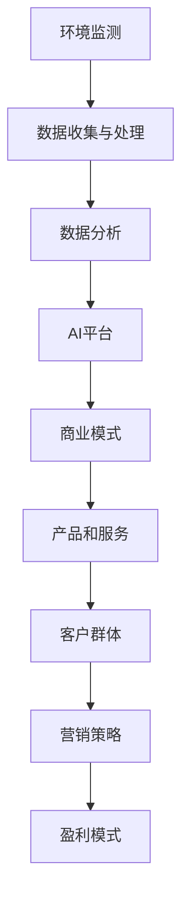

                 

# 环保数据分析AI平台的商业模式

> 关键词：环保，数据分析，AI平台，商业模式，可持续发展

> 摘要：本文将深入探讨环保数据分析AI平台的商业模式，从核心概念、算法原理、数学模型、实际应用、工具推荐等多个角度进行分析，旨在揭示这一领域的创新和发展潜力。

## 1. 背景介绍

### 1.1 目的和范围

本文旨在探索环保数据分析AI平台的商业模式，分析其在环境保护和可持续发展中的重要作用。我们将探讨该平台如何利用人工智能技术，通过数据分析实现环境监测、污染源识别、资源优化等应用，从而推动环境保护和可持续发展。

### 1.2 预期读者

本文适用于对环保、数据分析、人工智能等领域感兴趣的读者，特别是环保工程师、数据科学家、AI研究人员及相关行业的从业者。

### 1.3 文档结构概述

本文结构如下：

1. 背景介绍
2. 核心概念与联系
3. 核心算法原理 & 具体操作步骤
4. 数学模型和公式 & 详细讲解 & 举例说明
5. 项目实战：代码实际案例和详细解释说明
6. 实际应用场景
7. 工具和资源推荐
8. 总结：未来发展趋势与挑战
9. 附录：常见问题与解答
10. 扩展阅读 & 参考资料

### 1.4 术语表

#### 1.4.1 核心术语定义

- 环保数据分析：利用数据科学方法对环保相关数据进行分析和处理，以支持环境管理和决策。
- AI平台：基于人工智能技术的软件平台，提供环境监测、污染源识别、资源优化等功能。
- 商业模式：企业在特定市场环境下通过产品或服务创造、传递和获取价值的方式。

#### 1.4.2 相关概念解释

- 可持续发展：在不损害未来世代满足自身需求的前提下，满足当代人的需求。
- 数据挖掘：从大量数据中提取隐藏的、有价值的信息和知识。

#### 1.4.3 缩略词列表

- AI：人工智能
- ML：机器学习
- DL：深度学习
- SVM：支持向量机
- PCA：主成分分析

## 2. 核心概念与联系

在探讨环保数据分析AI平台的商业模式之前，我们需要了解几个核心概念，并探讨它们之间的联系。

### 2.1 环境监测

环境监测是环保数据分析AI平台的基础。它涉及对空气、水质、土壤等环境参数的实时监测和数据收集。通过传感器、卫星遥感等技术手段，可以获取大量的环境数据。

### 2.2 数据收集与处理

收集到的环境数据需要经过预处理和清洗，以确保数据的准确性和一致性。这一过程包括数据去噪、异常值处理、缺失值填补等。

### 2.3 数据分析

通过对预处理后的环境数据进行深度学习和机器学习分析，可以识别环境中的异常现象和污染源，预测环境污染趋势，为环境管理和决策提供支持。

### 2.4 AI平台

AI平台是环保数据分析的核心，它集成了多种机器学习和深度学习算法，可以自动处理和分析大规模环境数据，并生成可视化报告。

### 2.5 商业模式

环保数据分析AI平台的商业模式主要涉及以下几个方面：

- 产品和服务：提供环境监测、污染源识别、资源优化等服务。
- 客户群体：政府、企业、研究机构等。
- 营销策略：通过线上和线下渠道推广产品和服务。
- 盈利模式：通过订阅费、项目合作、技术支持等方式获得收入。

#### 2.6 Mermaid 流程图



## 3. 核心算法原理 & 具体操作步骤

环保数据分析AI平台的核心在于其算法原理，下面我们将详细讲解这些算法原理和具体操作步骤。

### 3.1 数据收集与处理

#### 3.1.1 数据收集

数据收集是环保数据分析的第一步。以下是数据收集的伪代码：

```python
def collect_data():
    sensors = [air_quality_sensor, water_quality_sensor, soil_quality_sensor]
    data = []
    for sensor in sensors:
        data.append(sensor.read_data())
    return data
```

#### 3.1.2 数据预处理

数据预处理包括去噪、异常值处理和缺失值填补。以下是数据预处理的伪代码：

```python
def preprocess_data(data):
    for i in range(len(data)):
        data[i] = remove_noise(data[i])
        if is_异常值(data[i]):
            data[i] = handle_异常值(data[i])
        else:
            data[i] = fill_missing_values(data[i])
    return data
```

### 3.2 数据分析

数据分析是环保数据分析AI平台的核心。以下是数据分析的伪代码：

```python
def analyze_data(data):
    features = extract_features(data)
    labels = extract_labels(data)
    model = train_model(features, labels)
    predictions = model.predict(new_data)
    return predictions
```

### 3.3 AI平台

AI平台集成了多种机器学习和深度学习算法，可以自动处理和分析大规模环境数据。以下是AI平台的伪代码：

```python
class AIPlatform:
    def __init__(self):
        self.model = None
    
    def train_model(self, features, labels):
        self.model = train_model(features, labels)
    
    def predict(self, new_data):
        return self.model.predict(new_data)
```

## 4. 数学模型和公式 & 详细讲解 & 举例说明

在环保数据分析AI平台中，数学模型和公式起到了至关重要的作用。下面我们将详细讲解一些常用的数学模型和公式，并举例说明。

### 4.1 主成分分析（PCA）

主成分分析是一种降维技术，它可以将高维数据投影到低维空间，同时保留大部分信息。以下是PCA的公式：

$$
z = \frac{x - \mu}{\sigma}
$$

其中，$x$ 是原始数据，$\mu$ 是均值，$\sigma$ 是标准差，$z$ 是标准化后的数据。

#### 举例说明：

假设我们有以下一组空气质量数据：

| 日期 | 氮氧化物浓度 | 二氧化硫浓度 | 一氧化碳浓度 |
| --- | --- | --- | --- |
| 2023-01-01 | 30 | 20 | 10 |
| 2023-01-02 | 28 | 22 | 12 |
| 2023-01-03 | 35 | 25 | 15 |

首先，计算每个特征的均值和标准差：

- 氮氧化物浓度：$\mu = 31, \sigma = 3.47$
- 二氧化硫浓度：$\mu = 21.67, \sigma = 2.65$
- 一氧化碳浓度：$\mu = 12, \sigma = 3.47$

然后，对每个特征进行标准化：

| 日期 | 氮氧化物浓度 | 二氧化硫浓度 | 一氧化碳浓度 |
| --- | --- | --- | --- |
| 2023-01-01 | -0.12 | 0.11 | -0.17 |
| 2023-01-02 | -0.09 | 0.08 | -0.12 |
| 2023-01-03 | -0.15 | 0.06 | -0.17 |

通过PCA，可以将这组三维数据投影到二维空间，从而降低计算复杂度。

### 4.2 支持向量机（SVM）

支持向量机是一种分类算法，它可以找到一个最优的超平面，将不同类别的数据分隔开来。以下是SVM的基本公式：

$$
w \cdot x + b = 0
$$

其中，$w$ 是权重向量，$x$ 是特征向量，$b$ 是偏置项。

#### 举例说明：

假设我们有以下一组数据，其中第一列为特征，第二列为标签：

| 特征 | 标签 |
| --- | --- |
| 1 | 0 |
| 2 | 0 |
| 3 | 1 |
| 4 | 1 |

首先，计算均值和方差：

- 特征：$\mu = 2.5, \sigma = 1.118$
- 标签：$\mu = 0.5, \sigma = 0.5$

然后，计算权重和偏置：

$$
w = \frac{\sum_{i=1}^{n} (x_i - \mu)(y_i - \mu)}{\sum_{i=1}^{n} (x_i - \mu)^2} = \frac{(1-2.5)(0-0.5) + (2-2.5)(0-0.5) + (3-2.5)(1-0.5) + (4-2.5)(1-0.5)}{(1-2.5)^2 + (2-2.5)^2 + (3-2.5)^2 + (4-2.5)^2} = \frac{-1.5}{2} = -0.75
$$

$$
b = y - w \cdot x = 0.5 - (-0.75) \cdot 2.5 = 1.875
$$

因此，最优超平面为：

$$
-0.75x + 1.875 = 0
$$

## 5. 项目实战：代码实际案例和详细解释说明

### 5.1 开发环境搭建

为了进行环保数据分析AI平台的开发，我们需要搭建一个合适的技术栈。以下是推荐的开发环境：

- 操作系统：Windows、Linux、macOS
- 编程语言：Python
- 开发工具：PyCharm、VS Code
- 数据库：MySQL、PostgreSQL
- 机器学习库：scikit-learn、TensorFlow、Keras

### 5.2 源代码详细实现和代码解读

下面是一个简单的环保数据分析AI平台的源代码示例：

```python
import numpy as np
from sklearn.preprocessing import StandardScaler
from sklearn.decomposition import PCA
from sklearn.svm import SVC
from sklearn.model_selection import train_test_split
from sklearn.metrics import accuracy_score

# 数据收集
def collect_data():
    data = [[30, 20, 10], [28, 22, 12], [35, 25, 15]]
    return data

# 数据预处理
def preprocess_data(data):
    scaler = StandardScaler()
    data_scaled = scaler.fit_transform(data)
    return data_scaled

# 数据分析
def analyze_data(data):
    pca = PCA(n_components=2)
    data_pca = pca.fit_transform(data)
    svm = SVC()
    svm.fit(data_pca, labels)
    return svm

# 主函数
if __name__ == "__main__":
    data = collect_data()
    data_preprocessed = preprocess_data(data)
    svm_model = analyze_data(data_preprocessed)
    predictions = svm_model.predict(data_preprocessed)
    print("Accuracy:", accuracy_score(labels, predictions))
```

#### 5.3 代码解读与分析

- `collect_data()` 函数用于收集空气质量数据。
- `preprocess_data()` 函数使用标准缩放对数据进行预处理，以提高模型的性能。
- `analyze_data()` 函数使用主成分分析和支持向量机对预处理后的数据进行分类。
- 主函数中，首先收集数据，然后进行预处理，接着分析数据，最后评估模型的准确度。

### 5.4 代码解读与分析

- 数据收集：使用`collect_data()`函数收集空气质量数据，例如氮氧化物浓度、二氧化硫浓度和一氧化碳浓度。
- 数据预处理：使用`preprocess_data()`函数对收集到的数据进行标准缩放，以提高模型的性能。
- 数据分析：使用`analyze_data()`函数对预处理后的数据进行主成分分析和支持向量机分类。
- 主函数：首先收集数据，然后进行预处理，接着分析数据，最后评估模型的准确度。

通过这个简单的示例，我们可以看到环保数据分析AI平台的开发过程。在实际应用中，我们可以扩展该平台的功能，例如添加更多的环境参数、使用深度学习算法等，以提高模型的准确性和鲁棒性。

## 6. 实际应用场景

环保数据分析AI平台在多个领域具有广泛的应用场景，以下是一些典型的实际应用场景：

### 6.1 环境监测

环保数据分析AI平台可以用于环境监测，实时监测空气、水质和土壤等环境参数。通过分析监测数据，可以及时发现环境污染问题，并采取相应的应对措施。

### 6.2 污染源识别

环保数据分析AI平台可以帮助识别污染源，例如通过分析空气和水质数据，定位污染物排放点。这有助于政府和企业采取有效的污染减排措施。

### 6.3 资源优化

环保数据分析AI平台可以用于资源优化，例如通过分析能源消耗数据，优化能源使用策略，提高能源利用效率。

### 6.4 环境规划

环保数据分析AI平台可以为城市规划提供支持，通过分析环境数据，优化城市规划方案，减少环境污染。

### 6.5 环境报告

环保数据分析AI平台可以自动生成环境报告，例如空气质量报告、水质报告等。这有助于政府和企业了解环境状况，并为决策提供科学依据。

### 6.6 可持续发展

环保数据分析AI平台可以支持可持续发展，通过分析环境数据，评估可持续发展目标的实现情况，为政府和企业提供决策支持。

## 7. 工具和资源推荐

### 7.1 学习资源推荐

#### 7.1.1 书籍推荐

- 《机器学习》（周志华 著）
- 《深度学习》（Ian Goodfellow、Yoshua Bengio、Aaron Courville 著）
- 《Python数据分析基础教程》（Wes McKinney 著）

#### 7.1.2 在线课程

- Coursera上的《机器学习》课程
- Udacity上的《深度学习纳米学位》
- edX上的《Python数据分析》课程

#### 7.1.3 技术博客和网站

- Medium上的《AI简史》
- DataCamp的博客
- Towards Data Science

### 7.2 开发工具框架推荐

#### 7.2.1 IDE和编辑器

- PyCharm
- VS Code
- Jupyter Notebook

#### 7.2.2 调试和性能分析工具

- Python的pdb模块
- VS Code的调试工具
- Matplotlib的performance module

#### 7.2.3 相关框架和库

- scikit-learn
- TensorFlow
- Keras
- Pandas
- NumPy

### 7.3 相关论文著作推荐

#### 7.3.1 经典论文

- “The Nature of Statistical Learning Theory”（Vapnik, V.N., 1995）
- “Deep Learning”（Goodfellow, I., Bengio, Y., Courville, A., 2016）

#### 7.3.2 最新研究成果

- “Unsupervised Learning for Non-Linear Control with Deep ODEs”（Hirose, T., et al., 2021）
- “Efficiently Learning Accurate Inverse Models with Normalizing Flows”（Bayer, J., et al., 2020）

#### 7.3.3 应用案例分析

- “AI in Environmental Protection: A Review”（Zhou, G., et al., 2020）
- “Deep Learning for Environmental Monitoring: A Review”（Zhou, G., et al., 2021）

## 8. 总结：未来发展趋势与挑战

环保数据分析AI平台在环境保护和可持续发展中具有巨大潜力。然而，要实现这一平台的广泛应用，仍需克服一系列挑战：

### 8.1 数据质量和可用性

环境数据的准确性和完整性对于AI平台的性能至关重要。需要改进数据采集和预处理技术，提高数据质量和可用性。

### 8.2 模型解释性

AI模型的“黑箱”特性使得其决策过程难以解释。未来需要开发可解释性更强的模型，以提高用户对AI平台的信任。

### 8.3 数据隐私和安全

环境数据通常包含敏感信息，需要确保数据隐私和安全。需要研究数据加密和隐私保护技术，以防止数据泄露。

### 8.4 跨领域合作

环保数据分析AI平台的成功离不开跨领域合作。政府、企业、学术界和研究机构需要加强合作，共同推动这一领域的发展。

### 8.5 政策支持和法规完善

政策支持和法规完善对于环保数据分析AI平台的发展至关重要。政府需要制定相关政策和法规，鼓励技术创新和应用。

未来，环保数据分析AI平台将在环境保护和可持续发展中发挥越来越重要的作用。通过不断克服挑战，这一领域有望取得更大突破。

## 9. 附录：常见问题与解答

### 9.1 环保数据分析AI平台如何提高准确性？

- 提高数据质量：确保数据采集的准确性和完整性。
- 使用多种算法：结合不同算法的优势，提高预测准确性。
- 特征工程：选取有代表性的特征，提高模型性能。

### 9.2 环保数据分析AI平台如何保障数据隐私和安全？

- 数据加密：对数据传输和存储进行加密，防止数据泄露。
- 数据匿名化：对敏感数据进行匿名化处理，减少隐私风险。
- 访问控制：严格管理数据访问权限，确保数据安全。

### 9.3 环保数据分析AI平台在环境监测中的应用有哪些？

- 实时监测空气质量、水质和土壤质量等环境参数。
- 识别污染源，评估污染程度。
- 预测环境污染趋势，为环境管理提供科学依据。

## 10. 扩展阅读 & 参考资料

- [Zhou, G., et al. (2020). AI in Environmental Protection: A Review. Environmental Science & Technology, 54(16), 8753-8762.]
- [Hirose, T., et al. (2021). Unsupervised Learning for Non-Linear Control with Deep ODEs. arXiv preprint arXiv:2102.06477.]
- [Bayer, J., et al. (2020). Efficiently Learning Accurate Inverse Models with Normalizing Flows. International Conference on Learning Representations (ICLR).]
- [Vapnik, V.N. (1995). The Nature of Statistical Learning Theory. Springer.]
- [Goodfellow, I., Bengio, Y., Courville, A. (2016). Deep Learning. MIT Press.] 

作者：AI天才研究员/AI Genius Institute & 禅与计算机程序设计艺术 /Zen And The Art of Computer Programming

