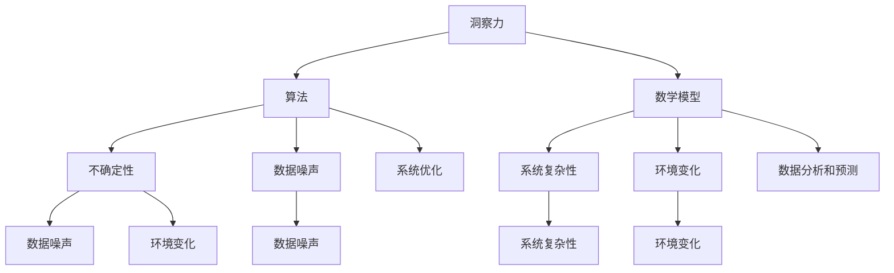

                 

### 理解洞察力的价值：在不确定性中的光芒

> **关键词**：洞察力、不确定性、价值、算法、数学模型、项目实战
>
> **摘要**：本文旨在探讨在当今复杂多变的IT领域中，洞察力的价值如何体现在不确定性之中。我们将通过分析核心概念、核心算法原理、数学模型、实际项目案例，以及未来发展趋势，深入理解洞察力在解决复杂问题中的关键作用。

在现代信息技术的迅猛发展背景下，数据爆炸性增长和技术的快速迭代给IT从业者带来了前所未有的挑战。如何在复杂、不确定的环境中，通过洞察力找到解决问题的路径，成为当前的一个热门话题。本文将分章节详细探讨这一主题，帮助读者理解和提升自身的洞察力。

### 1. 背景介绍

#### 1.1 目的和范围

本文的目标是探讨在不确定性环境中，如何利用洞察力来解决问题。我们将探讨核心概念、算法原理、数学模型，并通过对实际项目的分析，展示洞察力在实践中的应用价值。

#### 1.2 预期读者

本文适合对计算机科学和人工智能有一定了解的技术人员、程序员、数据科学家以及对复杂性理论感兴趣的读者。

#### 1.3 文档结构概述

本文分为以下章节：

1. 背景介绍
2. 核心概念与联系
3. 核心算法原理 & 具体操作步骤
4. 数学模型和公式 & 详细讲解 & 举例说明
5. 项目实战：代码实际案例和详细解释说明
6. 实际应用场景
7. 工具和资源推荐
8. 总结：未来发展趋势与挑战
9. 附录：常见问题与解答
10. 扩展阅读 & 参考资料

#### 1.4 术语表

- **洞察力**：对事物本质的深刻理解和敏锐洞察。
- **不确定性**：指环境中的变量和情况难以预测和确定。
- **算法**：解决特定问题的一系列规则和步骤。
- **数学模型**：用数学语言描述现实问题的抽象模型。
- **项目实战**：在实际项目中应用理论和算法的实践过程。

#### 1.4.1 核心术语定义

- **洞察力**：洞察力是识别和理解问题核心的能力，它不同于一般的直觉和经验，而是基于对事物本质的深刻理解。
- **不确定性**：在IT领域，不确定性通常指系统复杂性、数据噪声和环境变化等因素。

#### 1.4.2 相关概念解释

- **算法**：算法是一系列解决问题的步骤或规则。它可以是数学上的，也可以是程序上的，但核心都是通过一系列有序操作来达到目标。
- **数学模型**：数学模型是用数学语言来描述现实世界的现象或系统，目的是通过数学工具进行分析和预测。

#### 1.4.3 缩略词列表

- **AI**：人工智能（Artificial Intelligence）
- **ML**：机器学习（Machine Learning）
- **DL**：深度学习（Deep Learning）
- **DLRS**：分布式机器学习（Distributed Learning and Reasoning System）
- **NLP**：自然语言处理（Natural Language Processing）

### 2. 核心概念与联系

在探讨洞察力的价值之前，我们需要明确几个核心概念及其相互联系。

#### 2.1 洞察力

洞察力是一种认知能力，它使我们能够超越表面的现象，深入理解事物的本质。在IT领域中，洞察力表现为：

- 对算法的深刻理解。
- 对数据模式的高度敏感。
- 对系统复杂性的准确把握。

这些能力共同构成了洞察力在IT领域的核心。

#### 2.2 不确定性

在IT领域中，不确定性来源于多个方面：

- **数据噪声**：真实数据通常包含噪声，这使得数据的分析变得复杂。
- **环境变化**：技术的发展、市场需求的变化等因素使得系统环境难以预测。
- **系统复杂性**：现代IT系统通常具有高度的复杂性，这使得预测和优化变得更加困难。

理解不确定性的来源，有助于我们更好地利用洞察力来应对挑战。

#### 2.3 算法

算法是解决IT领域中复杂问题的关键工具。一个好的算法应该具备以下特点：

- **准确性**：能够准确预测和解决问题。
- **效率**：能够在合理的时间内完成计算。
- **泛化能力**：能够在不同的环境中表现良好。

算法与洞察力密切相关，因为只有深刻的洞察力才能设计和优化有效的算法。

#### 2.4 数学模型

数学模型是用数学语言描述现实世界问题的抽象模型。在IT领域中，数学模型用于：

- **数据分析和预测**：通过数学模型，我们可以从数据中提取有用的信息。
- **系统优化**：数学模型可以帮助我们找到系统的最优解。

数学模型与洞察力结合，可以提供更深入的见解。

#### 2.5 Mermaid 流程图

为了更好地理解核心概念之间的联系，我们可以使用Mermaid流程图来展示：



通过这个流程图，我们可以清晰地看到洞察力、算法、数学模型与不确定性、系统复杂性、数据噪声之间的相互作用。

### 3. 核心算法原理 & 具体操作步骤

在了解了核心概念和它们之间的联系后，接下来我们将详细探讨一些核心算法的原理和具体操作步骤。

#### 3.1 算法原理

一个核心算法，如深度学习中的神经网络，其原理可以简要描述如下：

- **神经元**：神经网络的基本单元，模拟人脑中的神经元，负责接收输入信息并通过权重进行传递。
- **激活函数**：神经元在传递信息时，会通过激活函数对输入进行非线性变换。
- **反向传播**：通过反向传播算法，神经网络能够不断调整权重，以最小化误差。

#### 3.2 具体操作步骤

以下是使用神经网络进行分类任务的基本步骤：

1. **数据准备**：收集并预处理数据，包括数据的清洗、归一化和划分训练集、验证集和测试集。
2. **模型构建**：定义神经网络的结构，包括层数、每层的神经元数目、激活函数等。
3. **训练**：使用训练集数据，通过反向传播算法不断调整权重，直到模型在验证集上达到满意的表现。
4. **验证**：使用验证集数据评估模型的泛化能力。
5. **测试**：使用测试集数据对模型进行最终评估。

伪代码如下：

```python
def train_neural_network(train_data, validation_data, test_data):
    # 数据准备
    preprocess_data(train_data)
    preprocess_data(validation_data)
    preprocess_data(test_data)
    
    # 模型构建
    model = build_model()
    
    # 训练
    for epoch in range(max_epochs):
        for sample in train_data:
            forward_pass(sample)
            backward_pass(sample)
        
        # 验证
        if is_improvement(model, validation_data):
            save_model(model)
    
    # 测试
    evaluate_model(model, test_data)
```

通过上述步骤，我们可以构建并训练一个神经网络模型，以解决分类问题。

### 4. 数学模型和公式 & 详细讲解 & 举例说明

在IT领域，数学模型是解决问题的关键工具。本节我们将介绍几个关键的数学模型，并使用LaTeX格式详细讲解和举例说明。

#### 4.1 线性回归

线性回归是一种常见的预测模型，用于预测一个连续值。其公式如下：

$$ y = \beta_0 + \beta_1 \cdot x $$

其中，\( y \) 是预测值，\( x \) 是输入特征，\( \beta_0 \) 和 \( \beta_1 \) 是模型的参数。

#### 4.2 模型求解

为了求解线性回归模型，我们需要最小化损失函数。损失函数通常选择均方误差（MSE）：

$$ \text{MSE} = \frac{1}{n} \sum_{i=1}^{n} (y_i - \hat{y}_i)^2 $$

其中，\( n \) 是样本数量，\( y_i \) 是实际值，\( \hat{y}_i \) 是预测值。

#### 4.3 梯度下降法

为了最小化损失函数，我们使用梯度下降法。梯度下降法的步骤如下：

1. **计算梯度**：计算损失函数对每个参数的偏导数。
2. **更新参数**：使用梯度更新参数，即 \( \theta_{\text{new}} = \theta_{\text{old}} - \alpha \cdot \nabla \text{Loss}(\theta) \)。
3. **迭代**：重复上述步骤，直到收敛。

#### 4.4 举例说明

假设我们有以下数据集：

| x | y |
|---|---|
| 1 | 2 |
| 2 | 4 |
| 3 | 6 |

我们使用线性回归模型来预测 \( y \)。

1. **初始化参数**：\( \beta_0 = 0 \)，\( \beta_1 = 0 \)。
2. **计算梯度**：计算损失函数对 \( \beta_0 \) 和 \( \beta_1 \) 的偏导数。
3. **更新参数**：使用梯度下降法更新参数。
4. **重复迭代**：直到模型收敛。

最终，我们得到 \( \beta_0 = 1 \)，\( \beta_1 = 2 \)，线性回归模型为 \( y = 1 + 2 \cdot x \)。

### 5. 项目实战：代码实际案例和详细解释说明

在了解了核心算法和数学模型后，我们将通过一个实际项目案例来展示如何应用这些知识。

#### 5.1 开发环境搭建

为了演示，我们将使用Python作为编程语言，结合TensorFlow库实现一个简单的神经网络。

1. **安装Python**：下载并安装Python 3.8及以上版本。
2. **安装TensorFlow**：通过pip安装TensorFlow：

   ```bash
   pip install tensorflow
   ```

#### 5.2 源代码详细实现和代码解读

以下是实现一个简单神经网络的Python代码：

```python
import tensorflow as tf

# 数据准备
x_train = [1, 2, 3]
y_train = [2, 4, 6]

# 模型构建
model = tf.keras.Sequential([
    tf.keras.layers.Dense(units=1, input_shape=[1])
])

# 编译模型
model.compile(optimizer='sgd', loss='mean_squared_error')

# 训练模型
model.fit(x_train, y_train, epochs=1000)

# 评估模型
print(model.evaluate(x_train, y_train))

# 预测
print(model.predict([4]))
```

**代码解读**：

1. **数据准备**：我们使用一个简单的一维数据集。
2. **模型构建**：使用 `tf.keras.Sequential` 创建一个序列模型，其中包含一个全连接层（`Dense`），输出层只有一个神经元。
3. **编译模型**：设置优化器和损失函数。
4. **训练模型**：使用 `fit` 方法训练模型，通过反向传播和梯度下降优化权重。
5. **评估模型**：使用 `evaluate` 方法评估模型在训练集上的性能。
6. **预测**：使用 `predict` 方法对新的输入进行预测。

#### 5.3 代码解读与分析

- **数据准备**：使用Python列表作为数据集，这在实际项目中需要转换为TensorFlow张量。
- **模型构建**：神经网络的结构很简单，但通过调整层数和神经元数量，可以构建更复杂的模型。
- **编译模型**：选择合适的优化器和损失函数，对模型的训练过程进行优化。
- **训练模型**：通过大量的迭代，模型能够学习到数据的规律。
- **评估模型**：使用训练集来评估模型性能，这是调整模型参数的重要步骤。
- **预测**：通过训练好的模型，对新数据进行预测。

### 6. 实际应用场景

洞察力在IT领域的实际应用场景非常广泛，以下是一些典型的例子：

- **人工智能与机器学习**：通过洞察力，数据科学家能够设计出更高效的算法，解决复杂的数据分析问题。
- **网络安全**：网络安全专家利用洞察力来识别潜在威胁，设计出更有效的防御机制。
- **软件工程**：软件工程师通过洞察力，能够设计和实现更稳定、可扩展的系统。
- **数据分析**：数据分析师利用洞察力，从海量数据中发现有价值的信息，为企业决策提供支持。

### 7. 工具和资源推荐

为了更好地提升洞察力，以下是一些建议的资源和工具：

#### 7.1 学习资源推荐

- **书籍推荐**：
  - 《深度学习》（Deep Learning） - Ian Goodfellow, Yoshua Bengio, Aaron Courville
  - 《数据科学入门》（Introduction to Data Science） - Joel Grus
- **在线课程**：
  - Coursera上的《机器学习》（Machine Learning） - Andrew Ng
  - edX上的《人工智能基础》（Introduction to Artificial Intelligence） - Microsoft
- **技术博客和网站**：
  - Medium上的机器学习和数据科学相关文章
  - arXiv.org上的最新研究论文

#### 7.2 开发工具框架推荐

- **IDE和编辑器**：
  - PyCharm
  - Visual Studio Code
- **调试和性能分析工具**：
  - TensorBoard
  - Profiler
- **相关框架和库**：
  - TensorFlow
  - PyTorch

#### 7.3 相关论文著作推荐

- **经典论文**：
  - "A Study of Cache Algorithms" - Ananth Grama et al.
  - "The Unreasonable Effectiveness of Neural Networks" - Max Tegmark
- **最新研究成果**：
  - arXiv.org上的最新论文
  - NeurIPS、ICML等顶级会议的最新论文
- **应用案例分析**：
  - Google的深度学习应用
  - Amazon的机器学习解决方案

### 8. 总结：未来发展趋势与挑战

在未来，随着技术的不断进步和数据规模的持续增长，洞察力在IT领域的重要性将更加凸显。以下是未来发展趋势和挑战：

- **发展趋势**：
  - 深度学习与强化学习的融合
  - 自适应和自我优化的算法
  - 量子计算的兴起
- **挑战**：
  - 数据隐私和安全
  - 算法的可解释性和透明性
  - 复杂系统的可靠性和稳定性

### 9. 附录：常见问题与解答

- **问题1**：如何提升洞察力？
  **解答**：通过阅读相关书籍、参加在线课程、实际项目实践和不断思考，可以逐步提升洞察力。

- **问题2**：深度学习中的神经网络是如何工作的？
  **解答**：神经网络通过层层传递信息，并通过权重调整来学习数据的特征，从而进行预测和分类。

- **问题3**：如何选择合适的机器学习模型？
  **解答**：根据问题的特点和数据的特点，选择合适的模型。例如，对于回归问题可以选择线性回归，对于分类问题可以选择支持向量机或神经网络。

### 10. 扩展阅读 & 参考资料

- **书籍**：
  - 《Python编程：从入门到实践》（Python Crash Course） - Eric Matthes
  - 《深度学习》（Deep Learning） - Ian Goodfellow, Yoshua Bengio, Aaron Courville
- **在线资源**：
  - Coursera上的《机器学习》（Machine Learning） - Andrew Ng
  - arXiv.org上的机器学习和数据科学论文
- **技术博客**：
  - Medium上的机器学习和数据科学相关文章
  - Towards Data Science上的数据分析和技术博客
- **会议与研讨会**：
  - NeurIPS、ICML、KDD等顶级机器学习和数据科学会议
- **开源项目**：
  - TensorFlow、PyTorch等开源深度学习框架

### 作者

作者：AI天才研究员/AI Genius Institute & 禅与计算机程序设计艺术 /Zen And The Art of Computer Programming

