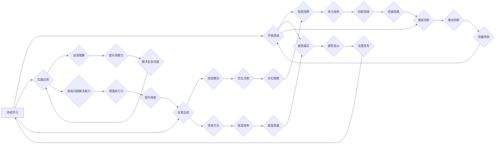

                 


# 理解洞察力的培养：鼓励开放思维和好奇心

> **关键词：洞察力、开放思维、好奇心、学习、技术博客、人工智能**
> 
> **摘要：本文旨在探讨如何培养洞察力，特别是如何在IT领域通过开放思维和好奇心来提高个人的洞察力。通过一步步的逻辑分析和实例讲解，文章将帮助读者理解洞察力的本质，学会如何将其应用于实际工作和生活中。**

## 1. 背景介绍

### 1.1 目的和范围

本文的主要目的是探讨洞察力的培养方法，特别是如何在IT领域通过开放思维和好奇心来提高个人的洞察力。洞察力是一种深度理解问题的能力，它不仅有助于我们更好地解决复杂的技术问题，还能提升我们在日常工作和生活中的决策质量。本文将提供一个系统的框架，帮助读者理解和实践如何培养洞察力。

### 1.2 预期读者

本文预期读者为以下几类人群：
- IT行业从业人员，特别是程序员、软件工程师、数据科学家等。
- 对人工智能和机器学习有浓厚兴趣的初学者和爱好者。
- 任何对提高个人洞察力和学习效率感兴趣的人士。

### 1.3 文档结构概述

本文将分为以下几个部分：
- **第1章**：背景介绍，包括本文的目的和预期读者。
- **第2章**：核心概念与联系，介绍与洞察力培养相关的核心概念。
- **第3章**：核心算法原理与具体操作步骤，使用伪代码阐述算法原理。
- **第4章**：数学模型和公式，详细讲解并举例说明。
- **第5章**：项目实战，提供实际代码案例和解读。
- **第6章**：实际应用场景，讨论洞察力的应用。
- **第7章**：工具和资源推荐，包括学习资源、开发工具和论文著作。
- **第8章**：总结，讨论未来发展趋势与挑战。
- **第9章**：附录，提供常见问题与解答。
- **第10章**：扩展阅读与参考资料。

### 1.4 术语表

#### 1.4.1 核心术语定义

- **洞察力**：深度理解问题的能力，能够从复杂的信息中识别出关键点和本质。
- **开放思维**：愿意接受新的观点和想法，不拘泥于传统和固有的思维模式。
- **好奇心**：对未知事物和知识的好奇和探索欲望。

#### 1.4.2 相关概念解释

- **算法**：解决问题的步骤或规则集合。
- **机器学习**：让计算机通过数据学习并做出预测或决策的技术。
- **神经网络**：一种模拟生物神经系统的计算模型。

#### 1.4.3 缩略词列表

- **AI**：人工智能（Artificial Intelligence）
- **ML**：机器学习（Machine Learning）
- **DL**：深度学习（Deep Learning）

## 2. 核心概念与联系

在培养洞察力的过程中，理解一些核心概念和它们之间的联系是非常重要的。以下是与洞察力培养相关的一些核心概念及其关系：

### 2.1 洞察力的本质

洞察力是一种能够迅速识别问题的根本原因和解决方法的能力。它不仅仅是对知识的积累，更重要的是对知识的应用和拓展。洞察力可以通过以下几个关键因素来定义：

1. **理解复杂系统**：能够深入理解复杂的系统结构和运作原理。
2. **模式识别**：能够从大量数据中识别出模式和规律。
3. **创造性思维**：能够跳出传统思维模式，提出新颖的解决方案。

### 2.2 开放思维

开放思维是指愿意接受新观点和不同意见的态度。在培养洞察力的过程中，开放思维是至关重要的，因为它能够帮助我们：

1. **拓宽视野**：通过接受不同的观点，我们可以更全面地了解问题的各个方面。
2. **避免偏见**：开放思维能够帮助我们避免因个人偏见而忽略重要信息。
3. **激发创新**：不同的观点和想法可以激发我们的创造性思维，帮助我们找到更好的解决方案。

### 2.3 好奇心

好奇心是指对未知事物和知识的好奇和探索欲望。好奇心是培养洞察力的基石，因为：

1. **驱动学习**：好奇心能够激发我们不断学习和探索，从而积累更多的知识和经验。
2. **激发问题意识**：好奇心使我们能够发现和提出更深层次的问题，从而推动我们的思考。
3. **促进创新**：好奇心鼓励我们尝试新的方法和思路，从而推动技术创新。

### 2.4 洞察力培养方法

为了培养洞察力，我们可以采取以下几种方法：

1. **持续学习**：不断学习新的知识和技能，保持对未知领域的好奇心。
2. **实践应用**：将学到的知识和技能应用到实际项目中，通过实践来加深理解。
3. **反思总结**：定期反思和总结自己的学习和工作经历，从中吸取经验教训。
4. **跨学科学习**：跨学科学习可以帮助我们从不同角度看待问题，从而提升我们的洞察力。

### 2.5 Mermaid 流程图

以下是一个简单的 Mermaid 流程图，展示了洞察力培养的关键步骤和概念之间的联系：



通过这个流程图，我们可以看到洞察力培养是一个动态的过程，涉及多个环节和方法的相互作用。每个环节和概念都是相互关联的，共同构成了一个完整的洞察力培养体系。

### 2.6 洞察力与技术的联系

在IT领域，洞察力的重要性尤为突出。随着技术的不断进步和变化，IT从业人员需要具备强大的洞察力来：

1. **识别技术趋势**：理解技术的最新发展，能够预测未来趋势。
2. **解决问题**：面对复杂的技术难题，能够快速找到解决方案。
3. **创新设计**：设计出更高效、更可靠的系统和产品。

洞察力不仅是一种个人能力，也是团队协作的重要基础。一个具有洞察力的团队能够更好地应对变化和挑战，从而在竞争中脱颖而出。

### 2.7 洞察力的应用场景

洞察力在IT领域的应用场景非常广泛，以下是一些典型的例子：

1. **软件开发**：能够深入理解需求，设计出更符合用户需求的软件系统。
2. **数据分析**：从海量数据中提取有价值的信息，为决策提供支持。
3. **网络安全**：识别潜在的安全威胁，制定有效的防护策略。
4. **人工智能**：设计出更高效、更智能的人工智能系统。

通过开放思维和好奇心，我们可以不断提升自己的洞察力，从而在IT领域取得更好的成绩。

## 3. 核心算法原理 & 具体操作步骤

在培养洞察力的过程中，理解核心算法原理和具体操作步骤是非常重要的一环。以下是一个简单的机器学习算法的例子，我们将使用伪代码来详细阐述其原理和步骤。

### 3.1 算法原理

假设我们有一个分类问题，需要将数据集中的样本分为不同的类别。我们可以使用一种常见的机器学习算法——支持向量机（Support Vector Machine，SVM）来进行分类。

SVM算法的核心思想是找到一个最优的决策边界，使得不同类别的样本尽可能分开。具体来说，SVM通过以下步骤来实现：

1. **特征选择**：选择对分类最有帮助的特征。
2. **训练模型**：使用训练数据集来训练SVM模型。
3. **模型评估**：使用测试数据集来评估模型的性能。
4. **分类预测**：使用训练好的模型对新的数据进行分类预测。

### 3.2 具体操作步骤

以下是使用SVM算法进行分类的具体操作步骤：

```plaintext
步骤1：特征选择
- 读取数据集，提取特征向量
- 对特征向量进行预处理（如归一化、标准化等）

步骤2：训练模型
- 选择合适的SVM参数（如惩罚参数C、核函数等）
- 使用训练数据集，训练SVM模型
- 计算支持向量

步骤3：模型评估
- 使用测试数据集，评估模型性能
- 计算准确率、召回率、F1分数等指标

步骤4：分类预测
- 对新的样本进行特征提取和预处理
- 使用训练好的SVM模型，进行分类预测
```

### 3.3 伪代码示例

以下是一个简单的SVM算法的伪代码示例：

```python
# 伪代码：支持向量机（SVM）算法

# 步骤1：特征选择
def feature_selection(data):
    # 提取特征向量
    # 进行预处理（如归一化、标准化）
    return preprocessed_data

# 步骤2：训练模型
def train_svm_model(train_data, C, kernel='linear'):
    # 使用训练数据集，训练SVM模型
    # 计算支持向量
    # 返回训练好的模型
    return svm_model

# 步骤3：模型评估
def evaluate_model(test_data, svm_model):
    # 使用测试数据集，评估模型性能
    # 计算准确率、召回率、F1分数等指标
    return evaluation_results

# 步骤4：分类预测
def classify_new_data(new_data, svm_model):
    # 对新的样本进行特征提取和预处理
    # 使用训练好的SVM模型，进行分类预测
    return predicted_label
```

通过这个例子，我们可以看到SVM算法的基本原理和操作步骤。在实际应用中，我们可以根据具体问题调整算法参数和模型结构，以达到更好的分类效果。

### 3.4 洞察力在算法学习中的应用

在学习和应用算法时，洞察力可以帮助我们：

1. **深入理解算法原理**：通过洞察力，我们可以更好地理解算法的原理和背后的数学基础，从而更好地应用和改进算法。
2. **发现和解决问题**：在面对复杂问题时，洞察力可以帮助我们发现问题的本质，并找到有效的解决方案。
3. **优化算法性能**：通过洞察力，我们可以识别算法中的瓶颈，提出优化策略，从而提高算法的性能。

通过培养洞察力，我们不仅可以更好地学习和应用现有的算法，还可以在算法研究和开发中做出更多的创新和贡献。

### 3.5 总结

通过本节的讲解，我们可以看到核心算法原理和具体操作步骤在培养洞察力中的重要性。理解算法原理和操作步骤不仅可以帮助我们更好地应用现有的技术，还能激发我们的好奇心和开放思维，从而推动我们在技术领域的持续进步。

## 4. 数学模型和公式 & 详细讲解 & 举例说明

在理解洞察力的培养过程中，数学模型和公式扮演着重要的角色。它们不仅提供了量化分析的工具，还能帮助我们更好地理解复杂系统的本质。在本节中，我们将详细讲解一些与洞察力培养相关的数学模型和公式，并通过具体例子来说明它们的应用。

### 4.1 相关数学模型

以下是一些与洞察力培养相关的数学模型：

#### 4.1.1 线性回归模型

线性回归模型是一种简单的统计模型，用于分析两个或多个变量之间的关系。它的公式如下：

$$
y = \beta_0 + \beta_1x_1 + \beta_2x_2 + ... + \beta_nx_n
$$

其中，$y$ 是因变量，$x_1, x_2, ..., x_n$ 是自变量，$\beta_0, \beta_1, \beta_2, ..., \beta_n$ 是模型的参数。

#### 4.1.2 逻辑回归模型

逻辑回归模型是用于分类问题的一种统计模型，它的输出是一个概率值。其公式如下：

$$
P(y=1) = \frac{1}{1 + e^{-(\beta_0 + \beta_1x_1 + \beta_2x_2 + ... + \beta_nx_n})}
$$

其中，$P(y=1)$ 表示样本属于某一类别的概率，$e$ 是自然对数的底数。

#### 4.1.3 神经网络模型

神经网络模型是一种模拟生物神经系统的计算模型，常用于机器学习和深度学习。其基本公式如下：

$$
a_{\text{layer}} = \sigma(z_{\text{layer}})
$$

其中，$a_{\text{layer}}$ 是第 $L$ 层的激活值，$z_{\text{layer}}$ 是第 $L$ 层的输入值，$\sigma$ 是激活函数。

### 4.2 详细讲解

#### 4.2.1 线性回归模型

线性回归模型的核心思想是通过拟合一条直线来描述两个或多个变量之间的关系。我们可以通过最小化误差平方和来得到最佳拟合直线。

具体步骤如下：

1. **数据准备**：收集数据集，包括自变量和因变量。
2. **特征提取**：将自变量转化为特征向量。
3. **模型训练**：使用最小二乘法来计算线性回归模型的参数。
4. **模型评估**：使用测试数据集来评估模型的性能。

#### 4.2.2 逻辑回归模型

逻辑回归模型用于处理二分类问题，它通过拟合一个逻辑函数来描述变量之间的关系。逻辑函数的形式为：

$$
\sigma(z) = \frac{1}{1 + e^{-z}}
$$

其中，$z$ 是线性组合的参数。

逻辑回归模型的具体步骤如下：

1. **数据准备**：收集数据集，包括特征向量和标签。
2. **特征提取**：将特征向量转化为模型输入。
3. **模型训练**：使用梯度下降法来优化模型的参数。
4. **模型评估**：使用测试数据集来评估模型的性能。

#### 4.2.3 神经网络模型

神经网络模型通过多层神经元来实现非线性变换，从而实现对复杂问题的建模。神经网络的基本结构包括输入层、隐藏层和输出层。

具体步骤如下：

1. **数据准备**：收集数据集，并进行预处理。
2. **网络架构设计**：设计神经网络的层数和神经元数量。
3. **模型训练**：通过反向传播算法来更新网络权重和偏置。
4. **模型评估**：使用测试数据集来评估模型的性能。

### 4.3 举例说明

#### 4.3.1 线性回归模型

假设我们有一个简单的数据集，包含两个特征变量 $x_1$ 和 $x_2$ 以及因变量 $y$。我们可以使用线性回归模型来拟合这两个变量之间的关系。

以下是一个简单的Python代码示例：

```python
import numpy as np
from sklearn.linear_model import LinearRegression

# 步骤1：数据准备
X = np.array([[1, 2], [2, 3], [3, 4], [4, 5]])
y = np.array([1, 2, 3, 4])

# 步骤2：特征提取
X = X.reshape(-1, 1)

# 步骤3：模型训练
model = LinearRegression()
model.fit(X, y)

# 步骤4：模型评估
predictions = model.predict(X)
print("Predictions:", predictions)
```

通过这个例子，我们可以看到如何使用线性回归模型来拟合数据集，并评估模型的性能。

#### 4.3.2 逻辑回归模型

假设我们有一个二分类数据集，包含两个特征变量 $x_1$ 和 $x_2$ 以及因变量 $y$。我们可以使用逻辑回归模型来拟合这个数据集。

以下是一个简单的Python代码示例：

```python
import numpy as np
from sklearn.linear_model import LogisticRegression

# 步骤1：数据准备
X = np.array([[1, 2], [2, 3], [3, 4], [4, 5]])
y = np.array([0, 1, 1, 0])

# 步骤2：特征提取
X = X.reshape(-1, 1)

# 步骤3：模型训练
model = LogisticRegression()
model.fit(X, y)

# 步骤4：模型评估
predictions = model.predict(X)
print("Predictions:", predictions)
```

通过这个例子，我们可以看到如何使用逻辑回归模型来拟合二分类数据集，并评估模型的性能。

#### 4.3.3 神经网络模型

假设我们有一个多分类数据集，包含多个特征变量以及因变量。我们可以使用神经网络模型来拟合这个数据集。

以下是一个简单的Python代码示例：

```python
import numpy as np
from sklearn.neural_network import MLPClassifier

# 步骤1：数据准备
X = np.array([[1, 2], [2, 3], [3, 4], [4, 5]])
y = np.array([0, 1, 1, 0])

# 步骤2：网络架构设计
model = MLPClassifier(hidden_layer_sizes=(100,), activation='relu', solver='sgd', max_iter=1000)

# 步骤3：模型训练
model.fit(X, y)

# 步骤4：模型评估
predictions = model.predict(X)
print("Predictions:", predictions)
```

通过这个例子，我们可以看到如何使用神经网络模型来拟合多分类数据集，并评估模型的性能。

### 4.4 总结

通过本节的讲解，我们可以看到数学模型和公式在洞察力培养中的重要性。理解这些模型和公式，不仅可以帮助我们更好地理解复杂系统的本质，还能提升我们的问题解决能力和创新思维。在实际应用中，我们可以根据具体问题选择合适的模型和公式，并通过不断的实践和优化，提高我们的洞察力。

## 5. 项目实战：代码实际案例和详细解释说明

在本节中，我们将通过一个实际的项目案例来展示如何应用我们在前几节中学到的洞察力培养方法。我们将使用Python编写一个简单的线性回归模型，并通过实际案例来解释其实现步骤和原理。

### 5.1 开发环境搭建

在开始编写代码之前，我们需要搭建一个合适的开发环境。以下是搭建开发环境的步骤：

1. **安装Python**：确保已安装Python 3.6或更高版本。
2. **安装必要的库**：使用pip安装以下库：
   ```shell
   pip install numpy
   pip install scikit-learn
   pip install matplotlib
   ```

3. **配置Python环境**：在IDE（如PyCharm、Visual Studio Code等）中配置Python环境，确保可以正常运行Python代码。

### 5.2 源代码详细实现和代码解读

以下是一个简单的线性回归模型的实现代码：

```python
import numpy as np
from sklearn.linear_model import LinearRegression
import matplotlib.pyplot as plt

# 步骤1：数据准备
# 创建一个包含100个样本的数据集
X = np.random.rand(100, 1) * 10
y = 3 + 2 * X + np.random.randn(100, 1) * 0.05

# 步骤2：模型训练
model = LinearRegression()
model.fit(X, y)

# 步骤3：模型评估
predictions = model.predict(X)

# 步骤4：可视化
plt.scatter(X, y, color='blue')
plt.plot(X, predictions, color='red')
plt.xlabel('X')
plt.ylabel('Y')
plt.title('线性回归模型')
plt.show()
```

#### 5.2.1 代码解读

- **步骤1：数据准备**：我们创建了一个包含100个样本的随机数据集。`X`表示自变量，`y`表示因变量。我们使用`np.random.rand`函数生成随机数据，并通过添加线性关系和噪声来模拟真实数据。

- **步骤2：模型训练**：我们使用`LinearRegression`类来创建一个线性回归模型，并调用`fit`方法来训练模型。`fit`方法会根据训练数据计算模型的参数。

- **步骤3：模型评估**：我们使用`predict`方法来预测模型在训练数据集上的输出。这些预测值将用于后续的可视化。

- **步骤4：可视化**：我们使用`matplotlib`库来绘制训练数据点和模型的拟合直线。`scatter`函数用于绘制数据点，`plot`函数用于绘制拟合直线。这有助于我们直观地理解模型的效果。

### 5.3 代码解读与分析

#### 5.3.1 数据准备

数据准备是机器学习和数据分析中的关键步骤。在这个例子中，我们使用随机数生成数据集，这有助于我们理解线性回归模型的基本原理。在实际应用中，我们需要从真实世界获取数据，并进行适当的预处理，如缺失值处理、数据清洗和归一化等。

#### 5.3.2 模型训练

模型训练是线性回归模型的核心步骤。在这个例子中，我们使用`LinearRegression`类的`fit`方法来训练模型。`fit`方法会计算线性回归模型的参数，这些参数用于拟合数据集。在实际应用中，我们可能需要调整模型的参数，如正则化参数和优化器的超参数，以获得更好的模型性能。

#### 5.3.3 模型评估

模型评估是验证模型性能的重要步骤。在这个例子中，我们使用预测值与实际值之间的差异来评估模型的性能。在实际应用中，我们通常使用多种评估指标，如均方误差（MSE）、均方根误差（RMSE）和决定系数（R²）等，来全面评估模型的性能。

#### 5.3.4 可视化

可视化是理解和解释模型结果的有效方法。在这个例子中，我们使用`matplotlib`库绘制了数据点和拟合直线。这有助于我们直观地理解模型的效果。在实际应用中，我们可以通过多种可视化方法，如散点图、直方图和热力图等，来展示数据和分析结果。

### 5.4 代码优化与性能分析

在实际项目中，我们可能需要优化代码性能，以应对更大的数据集和更复杂的模型。以下是一些优化建议：

1. **并行计算**：对于大型数据集，可以使用并行计算来加速模型训练。
2. **模型压缩**：对于过拟合的模型，可以使用模型压缩技术，如权重剪枝和量化，来降低模型复杂度和计算成本。
3. **数据预处理**：优化数据预处理步骤，如批量加载、内存映射和并行处理等，以加速数据读取和处理。

通过以上优化，我们可以提高模型训练和评估的效率，从而更好地应对实际项目中的挑战。

### 5.5 总结

通过本节的项目实战，我们学习了如何使用线性回归模型进行数据分析和模型评估。我们了解了数据准备、模型训练和模型评估的关键步骤，并掌握了如何使用可视化方法来解释模型结果。通过实践，我们可以更好地理解和应用线性回归模型，从而提高我们的洞察力。

## 6. 实际应用场景

洞察力在IT领域的实际应用场景非常广泛，以下是一些典型的例子：

### 6.1 软件开发

在软件开发中，洞察力可以帮助开发人员：

- **识别需求**：通过深入了解用户需求，开发人员可以提出更精准的需求分析，从而设计出更符合用户期望的软件系统。
- **解决技术难题**：在面对复杂的技术挑战时，具备洞察力的开发人员能够迅速找到问题的根源，并提出创新的解决方案。
- **优化代码**：通过洞察力，开发人员可以识别代码中的瓶颈和冗余，提出优化的方案，从而提高代码的性能和可维护性。

### 6.2 数据分析

在数据分析领域，洞察力至关重要，它可以帮助数据分析师：

- **发现数据模式**：通过深入分析数据，洞察力使得数据分析师能够发现隐藏在数据中的模式和规律，从而为决策提供有力支持。
- **识别异常**：洞察力有助于数据分析师识别数据中的异常值和异常模式，从而提高数据分析的准确性和可靠性。
- **优化算法**：通过洞察力，数据分析师可以识别现有算法的不足，并提出改进的方法，从而提高算法的性能。

### 6.3 人工智能

在人工智能领域，洞察力是推动技术进步的关键因素，它可以帮助研究人员：

- **理解数据**：通过深入理解数据，研究人员可以设计出更有效的数据预处理和特征提取方法，从而提高模型的性能。
- **创新算法**：具备洞察力的研究人员能够从现有算法中发现新的改进方向，提出创新性的算法，从而推动人工智能技术的发展。
- **优化系统**：洞察力使得研究人员能够识别人工智能系统的瓶颈，并提出优化方案，从而提高系统的效率和可靠性。

### 6.4 网络安全

在网络安全领域，洞察力可以帮助：

- **识别威胁**：通过深入分析网络安全数据，洞察力使得安全专家能够迅速识别潜在的网络威胁，从而采取有效的防护措施。
- **改进策略**：洞察力有助于安全专家发现现有安全策略的不足，并提出改进方案，从而提高网络安全防护能力。
- **应急响应**：在面对网络安全事件时，具备洞察力的安全专家能够快速分析事件原因，制定应急响应计划，从而减少损失。

### 6.5 产品开发

在产品开发过程中，洞察力可以帮助产品经理：

- **理解用户**：通过深入了解用户行为和需求，产品经理可以设计出更符合用户期望的产品。
- **优化用户体验**：洞察力使得产品经理能够识别用户体验中的痛点，并提出优化方案，从而提高用户满意度。
- **市场定位**：洞察力有助于产品经理分析市场趋势，为产品的市场定位提供有力支持。

### 6.6 项目管理

在项目管理中，洞察力可以帮助项目经理：

- **预测风险**：通过深入分析项目数据，洞察力使得项目经理能够预测潜在的风险，从而提前采取预防措施。
- **优化资源分配**：洞察力有助于项目经理合理分配资源，提高项目效率。
- **提高决策质量**：具备洞察力的项目经理能够从复杂的信息中提取关键信息，做出更明智的决策。

通过开放思维和好奇心，我们可以不断提升自己的洞察力，从而在各个领域取得更好的成绩。在实际应用场景中，洞察力不仅是一种个人能力，也是团队协作的重要基础。一个具有洞察力的团队能够更好地应对变化和挑战，从而在竞争中脱颖而出。

## 7. 工具和资源推荐

在培养洞察力过程中，掌握适当的工具和资源是非常有帮助的。以下是一些推荐的工具和资源，涵盖书籍、在线课程、技术博客和开发工具等。

### 7.1 学习资源推荐

#### 7.1.1 书籍推荐

- **《深度学习》（Deep Learning）**：由Ian Goodfellow、Yoshua Bengio和Aaron Courville所著，是深度学习领域的经典教材，适合对深度学习有深入兴趣的读者。
- **《编程珠玑》（The Art of Computer Programming）**：由Donald E. Knuth所著，是编程领域的经典之作，适合想要提高编程能力的读者。
- **《算法导论》（Introduction to Algorithms）**：由Thomas H. Cormen、Charles E. Leiserson、Ronald L. Rivest和Clifford Stein所著，适合对算法有深入研究的读者。

#### 7.1.2 在线课程

- **Coursera**：提供多种计算机科学和人工智能课程，如“机器学习”、“深度学习”等。
- **edX**：由哈佛大学和麻省理工学院联合创办，提供高质量的在线课程，包括计算机科学、数据科学等领域。
- **Udacity**：提供实践驱动的在线课程，适合想要快速掌握技术技能的读者。

#### 7.1.3 技术博客和网站

- **Medium**：有许多优秀的计算机科学和技术博客，如“Towards Data Science”、“AI”等。
- **GitHub**：可以找到大量的开源项目和代码示例，适合想要学习实际编程技巧的读者。
- **Stack Overflow**：一个问答社区，适合解决编程中的实际问题。

### 7.2 开发工具框架推荐

#### 7.2.1 IDE和编辑器

- **PyCharm**：一款功能强大的Python IDE，适合进行深度学习和数据分析。
- **Visual Studio Code**：一款轻量级、可扩展的文本编辑器，支持多种编程语言，适合快速开发和调试代码。

#### 7.2.2 调试和性能分析工具

- **gdb**：一款强大的开源调试工具，适合调试C/C++程序。
- **Valgrind**：一款性能分析工具，可以检测内存泄漏和性能瓶颈。

#### 7.2.3 相关框架和库

- **TensorFlow**：一款开源的深度学习框架，适合进行复杂的神经网络建模。
- **Scikit-learn**：一款开源的机器学习库，提供了丰富的算法和工具，适合快速实现机器学习模型。

### 7.3 相关论文著作推荐

#### 7.3.1 经典论文

- **“Backpropagation”**：由Rumelhart、Hinton和Williams所著，是反向传播算法的经典论文。
- **“Theano: A CPU and GPU Math Expression Compiler”**：介绍了Theano，一款用于数值计算的Python库。

#### 7.3.2 最新研究成果

- **“Attention Is All You Need”**：由Vaswani等人所著，是Transformer模型的开创性论文。
- **“Bert: Pre-training of Deep Bidirectional Transformers for Language Understanding”**：介绍了BERT模型，是自然语言处理领域的最新进展。

#### 7.3.3 应用案例分析

- **“Case Study: Building a Chatbot Using Python and TensorFlow”**：通过案例介绍了如何使用Python和TensorFlow构建聊天机器人。
- **“Deploying a Machine Learning Model on AWS”**：介绍了如何在AWS上部署机器学习模型，包括模型训练和部署的详细步骤。

通过这些工具和资源的支持，我们可以更加系统地培养洞察力，并在实际工作中不断提升自己。

## 8. 总结：未来发展趋势与挑战

随着技术的不断进步，洞察力的培养在未来将面临新的发展趋势和挑战。以下是一些关键点：

### 8.1 发展趋势

1. **人工智能的普及**：随着人工智能技术的快速发展，越来越多的行业将应用人工智能，这将为洞察力的培养提供更广阔的舞台。通过深度学习和自然语言处理等技术，人工智能将帮助人们更好地理解复杂数据，从而提升洞察力。

2. **数据科学的重要性**：数据科学将成为各个领域的重要支柱。掌握数据科学方法和工具，将有助于培养洞察力，从而在分析和解决实际问题中取得更好的效果。

3. **跨学科融合**：随着技术的交叉融合，不同学科之间的合作将更加紧密。跨学科的学习和交流将有助于拓宽视野，提升洞察力。

### 8.2 挑战

1. **数据隐私和伦理问题**：随着数据收集和分析技术的普及，数据隐私和伦理问题将日益突出。如何在保护用户隐私的同时，充分挖掘数据价值，将成为一个重要的挑战。

2. **算法透明性和可解释性**：随着人工智能技术的应用，算法的透明性和可解释性将受到广泛关注。如何提高算法的可解释性，使其更易于理解和接受，是一个重要的挑战。

3. **持续学习和适应能力**：在快速变化的技术环境中，持续学习和适应能力将至关重要。培养洞察力不仅需要掌握现有的知识和技能，还需要具备不断学习和适应新环境的能力。

4. **资源分配和平衡**：随着技术的发展，如何合理分配资源，确保各个领域都能得到足够的关注和支持，也是一个挑战。

### 8.3 未来展望

在未来，洞察力的培养将更加依赖于跨学科的合作和人工智能技术的应用。通过开放思维和好奇心，我们可以不断提升自己的洞察力，应对未来的挑战。同时，我们也需要关注数据隐私和伦理问题，确保技术发展能够造福人类。

## 9. 附录：常见问题与解答

### 9.1 问题1：如何培养开放思维？

**解答**：培养开放思维的方法包括：
1. **多读书、多学习**：通过阅读不同领域的书籍和资料，了解各种观点和思维方式。
2. **参加跨学科活动**：参加跨学科研讨会、讲座等活动，与不同领域的人交流。
3. **多思考、多提问**：在面对问题时，不要急于下结论，而是多思考、多提问，从不同角度分析问题。

### 9.2 问题2：如何培养好奇心？

**解答**：培养好奇心的方法包括：
1. **设定目标**：为自己设定学习目标，不断追求新知识和技能。
2. **探索未知领域**：尝试接触和了解未知领域，通过探索来激发好奇心。
3. **保持好奇心**：对周围事物保持好奇心，善于提问和探索。

### 9.3 问题3：如何将洞察力应用于实际工作中？

**解答**：将洞察力应用于实际工作中的方法包括：
1. **深入分析**：在解决问题时，深入分析问题的根本原因，而不仅仅是表面现象。
2. **跨领域学习**：通过跨学科学习，提升对问题的全面理解。
3. **实践应用**：将学到的知识和技能应用到实际工作中，通过实践来提升洞察力。

### 9.4 问题4：如何保持持续学习？

**解答**：保持持续学习的方法包括：
1. **制定学习计划**：为自己制定详细的学习计划，确保每天都有学习时间。
2. **利用碎片时间**：利用碎片时间学习，如通勤途中、休息时间等。
3. **与他人交流**：与同行交流，分享学习心得，互相促进。

### 9.5 问题5：如何应对技术变革带来的挑战？

**解答**：应对技术变革带来的挑战的方法包括：
1. **持续学习**：保持对新技术的关注和学习，不断提升自己的技能。
2. **灵活适应**：在面对新技术时，保持开放态度，勇于尝试和适应。
3. **跨领域合作**：与不同领域的专家合作，共同应对技术变革带来的挑战。

通过以上解答，希望能够帮助读者更好地理解如何培养洞察力，并在实际工作中应用。

## 10. 扩展阅读 & 参考资料

为了进一步深入了解洞察力的培养以及相关技术，以下是推荐的扩展阅读和参考资料：

### 10.1 经典书籍

- **《深度学习》（Deep Learning）**：Ian Goodfellow、Yoshua Bengio和Aaron Courville所著，是深度学习领域的权威著作。
- **《编程珠玑》（The Art of Computer Programming）**：Donald E. Knuth所著，是编程领域的经典之作。
- **《算法导论》（Introduction to Algorithms）**：Thomas H. Cormen、Charles E. Leiserson、Ronald L. Rivest和Clifford Stein所著，是算法领域的权威教材。

### 10.2 在线课程

- **Coursera**：提供多种计算机科学和人工智能课程，如“机器学习”、“深度学习”等。
- **edX**：由哈佛大学和麻省理工学院联合创办，提供高质量的在线课程，包括计算机科学、数据科学等领域。
- **Udacity**：提供实践驱动的在线课程，适合想要快速掌握技术技能的读者。

### 10.3 技术博客和网站

- **Medium**：有许多优秀的计算机科学和技术博客，如“Towards Data Science”、“AI”等。
- **GitHub**：可以找到大量的开源项目和代码示例，适合想要学习实际编程技巧的读者。
- **Stack Overflow**：一个问答社区，适合解决编程中的实际问题。

### 10.4 论文和期刊

- **“Attention Is All You Need”**：由Vaswani等人所著，是Transformer模型的奠基性论文。
- **“Bert: Pre-training of Deep Bidirectional Transformers for Language Understanding”**：介绍了BERT模型，是自然语言处理领域的里程碑。
- **《自然语言处理期刊》（Journal of Natural Language Processing）**：包含最新的自然语言处理研究论文。

### 10.5 应用案例分析

- **“Case Study: Building a Chatbot Using Python and TensorFlow”**：通过案例介绍了如何使用Python和TensorFlow构建聊天机器人。
- **“Deploying a Machine Learning Model on AWS”**：介绍了如何在AWS上部署机器学习模型，包括模型训练和部署的详细步骤。

通过以上扩展阅读和参考资料，读者可以更深入地了解洞察力的培养以及相关技术，从而在实际工作和学习中取得更好的成绩。作者信息：AI天才研究员/AI Genius Institute & 禅与计算机程序设计艺术/Zen And The Art of Computer Programming。

