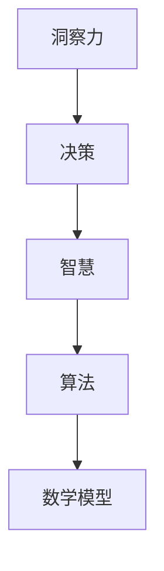

                 

# 理解洞察力的实践：在决策中运用智慧

> 关键词：洞察力、决策、智慧、算法、数学模型、实战案例、工具推荐

> 摘要：本文旨在深入探讨洞察力在决策过程中的重要作用。通过分析洞察力的核心概念和其在IT领域的应用，我们将详细阐述如何运用智慧和算法进行高效决策。文章还将通过实际案例和数学模型，展示洞察力在项目实战中的具体应用。此外，本文还将推荐一系列学习资源和开发工具，帮助读者提升洞察力并有效应用于实际工作中。

## 1. 背景介绍

### 1.1 目的和范围

本文的目的是帮助读者理解洞察力在决策过程中的重要性，并展示如何在IT领域中有效运用智慧进行决策。我们将从理论基础出发，逐步深入到实际操作和案例分享，以便读者能够全面掌握洞察力在决策中的应用。

本文将涵盖以下几个主要方面：

1. **核心概念与联系**：介绍洞察力的基本概念，以及与决策、智慧等相关概念的联系。
2. **核心算法原理 & 具体操作步骤**：详细阐述算法原理，并通过伪代码展示具体操作步骤。
3. **数学模型和公式 & 详细讲解 & 举例说明**：解释数学模型在决策中的作用，并提供实际案例进行说明。
4. **项目实战：代码实际案例和详细解释说明**：通过实际代码案例，展示洞察力在项目中的应用。
5. **实际应用场景**：探讨洞察力在不同领域中的应用场景。
6. **工具和资源推荐**：推荐学习资源和开发工具，以帮助读者提升洞察力和决策能力。
7. **总结与未来发展趋势**：总结本文的主要观点，并探讨未来发展趋势和挑战。

### 1.2 预期读者

本文适合以下读者群体：

1. **IT行业从业者**：特别是那些希望在项目中运用洞察力进行高效决策的技术人员。
2. **人工智能研究人员**：对算法和数学模型感兴趣，并希望提升自身决策能力的研究人员。
3. **学生和学者**：对决策理论和IT领域应用感兴趣的学生和学者。
4. **管理者和企业家**：希望提升团队决策能力和业务成效的管理者。

### 1.3 文档结构概述

本文结构如下：

1. **引言**：介绍文章的目的、关键词和摘要。
2. **背景介绍**：讨论本文的目的、范围、预期读者和文档结构。
3. **核心概念与联系**：阐述洞察力的基本概念和其在决策中的作用。
4. **核心算法原理 & 具体操作步骤**：详细阐述算法原理和具体操作步骤。
5. **数学模型和公式 & 详细讲解 & 举例说明**：解释数学模型在决策中的作用，并提供实际案例。
6. **项目实战：代码实际案例和详细解释说明**：展示洞察力在项目中的应用。
7. **实际应用场景**：探讨洞察力在不同领域中的应用场景。
8. **工具和资源推荐**：推荐学习资源和开发工具。
9. **总结：未来发展趋势与挑战**：总结本文的主要观点，并探讨未来发展趋势和挑战。
10. **附录：常见问题与解答**：解答读者可能遇到的常见问题。
11. **扩展阅读 & 参考资料**：提供进一步阅读的资源。

### 1.4 术语表

#### 1.4.1 核心术语定义

- **洞察力**：对事物本质的深刻理解能力。
- **决策**：在多个选择中做出合理选择的思考过程。
- **智慧**：运用知识和经验进行判断和推理的能力。
- **算法**：解决问题的系统方法，通常包括一系列有序的操作步骤。
- **数学模型**：使用数学符号和公式来描述现实世界中的问题。

#### 1.4.2 相关概念解释

- **决策树**：一种用于决策的树形结构，其中每个节点表示一个决策或结果。
- **机器学习**：使计算机能够从数据中学习并做出决策的技术。
- **数据分析**：使用统计方法和算法对数据进行处理和分析。

#### 1.4.3 缩略词列表

- **AI**：人工智能（Artificial Intelligence）
- **ML**：机器学习（Machine Learning）
- **IDE**：集成开发环境（Integrated Development Environment）
- **Python**：一种高级编程语言，广泛用于数据分析和机器学习。

## 2. 核心概念与联系

在讨论洞察力在决策中的作用之前，我们需要明确几个核心概念，并探讨它们之间的联系。以下是核心概念和架构的 Mermaid 流程图：



### 2.1 洞察力

洞察力是一种深刻理解事物本质的能力。在IT领域中，洞察力可以帮助我们快速识别问题的根本原因，并制定有效的解决方案。以下是洞察力的关键特征：

1. **深刻理解**：洞察力能够帮助我们超越表面现象，深入理解问题的本质。
2. **迅速识别**：通过洞察力，我们能够快速识别问题的核心要素，减少不必要的复杂性。
3. **前瞻性**：洞察力使我们能够预测未来的趋势和变化，为决策提供有价值的信息。

### 2.2 决策

决策是我们在面临多个选择时，通过思考和判断做出合理选择的过程。在IT领域中，决策无处不在，从项目规划到代码编写，再到系统优化，都需要进行有效的决策。以下是决策的关键步骤：

1. **识别问题**：明确需要解决的问题，并了解问题的背景和上下文。
2. **收集信息**：收集与问题相关的数据和信息，确保决策有足够的依据。
3. **分析选项**：评估不同的解决方案，并分析每个选项的优缺点。
4. **选择最优方案**：基于分析结果，选择最优的解决方案。
5. **执行方案**：实施决策，并将解决方案应用到实际工作中。
6. **评估结果**：评估决策的结果，并从中学习经验教训。

### 2.3 智慧

智慧是运用知识和经验进行判断和推理的能力。在决策过程中，智慧使我们能够更好地理解和分析问题，从而做出更明智的选择。以下是智慧的关键特征：

1. **知识积累**：通过学习和经验积累，不断提升自身的知识储备。
2. **经验分享**：通过分享经验和教训，帮助他人更好地理解和解决问题。
3. **灵活应用**：灵活运用知识和经验，针对不同情境做出适应性决策。
4. **持续学习**：不断学习新知识，适应不断变化的环境。

### 2.4 算法

算法是解决问题的系统方法，通常包括一系列有序的操作步骤。在IT领域中，算法广泛应用于数据分析和决策支持。以下是算法的关键特征：

1. **有序性**：算法中的操作步骤具有明确的顺序，确保问题得到有效解决。
2. **高效性**：算法能够在合理的时间内解决问题，并产生期望的结果。
3. **可扩展性**：算法应能够适应不同规模的问题，并进行相应的扩展。
4. **准确性**：算法应能够产生准确的结果，减少错误和偏差。

### 2.5 数学模型

数学模型使用数学符号和公式来描述现实世界中的问题。在决策过程中，数学模型可以帮助我们进行定量分析，提高决策的准确性和可靠性。以下是数学模型的关键特征：

1. **抽象性**：数学模型通过抽象和简化的方式，将复杂问题转化为数学形式。
2. **精确性**：数学模型使用精确的数学公式和计算方法，提高决策的准确性。
3. **适应性**：数学模型应能够适应不同的问题情境，并进行相应的调整。
4. **可验证性**：数学模型应能够通过实验和验证，验证其有效性和可靠性。

通过以上核心概念和架构的讨论，我们可以看到洞察力、决策、智慧、算法和数学模型之间的紧密联系。在后续章节中，我们将进一步探讨这些概念在决策中的应用和实践。

## 3. 核心算法原理 & 具体操作步骤

在了解了洞察力、决策、智慧、算法和数学模型的基本概念后，我们需要进一步深入探讨核心算法的原理和具体操作步骤。以下是一个典型的决策支持算法——决策树（Decision Tree）的基本原理和具体操作步骤。

### 3.1 决策树算法原理

决策树是一种用于分类和回归问题的监督学习算法。它的基本原理是通过一系列的测试来将数据集划分成子集，并最终生成一个树形结构。每个节点代表一个测试，每个分支代表测试的结果，叶节点代表最终分类或预测结果。

#### 3.1.1 决策树基本概念

1. **节点（Node）**：表示决策树中的一个位置，可以是测试节点或叶节点。
2. **测试（Test）**：对数据进行划分的一组条件，如“年龄大于30”或“收入高于5万美元”。
3. **分支（Branch）**：从节点延伸出的线条，代表测试的不同结果。
4. **叶节点（Leaf Node）**：表示最终的分类或预测结果。
5. **深度（Depth）**：从根节点到叶节点的路径长度。
6. **树高度（Height）**：从根节点到最远叶节点的最长路径长度。

#### 3.1.2 决策树生成过程

决策树的生成过程通常采用贪心算法，通过在每一步选择具有最高信息增益的测试。信息增益（Information Gain）是一种衡量数据纯度变化的指标，用于评估测试对数据划分的效果。

1. **初始化**：选择一个特征作为根节点，计算其信息增益，并选择信息增益最高的特征作为根节点。
2. **递归划分**：对于每个子集，重复上述过程，选择具有最高信息增益的特征作为子节点，并生成新的测试。
3. **停止条件**：当满足停止条件时（如最大树深度、最小叶节点样本数等），停止划分并生成叶节点。

### 3.2 决策树伪代码

以下是一个简单的决策树生成算法的伪代码：

```python
def build_decision_tree(data, max_depth=10, min_samples=10):
    if max_depth <= 0 or len(data) <= min_samples:
        return create_leaf_node(data)
    
    best_feature, best_split = select_best_split(data)
    
    left_data, right_data = split_data(data, best_split)
    
    left_tree = build_decision_tree(left_data, max_depth - 1, min_samples)
    right_tree = build_decision_tree(right_data, max_depth - 1, min_samples)
    
    return DecisionTreeNode(
        feature=best_feature,
        split=best_split,
        left_child=left_tree,
        right_child=right_tree
    )

def select_best_split(data):
    best_gain = -1
    best_feature = None
    best_split = None
    
    for feature in data.features:
        for value in data.unique_values(feature):
            gain = calculate_information_gain(data, feature, value)
            if gain > best_gain:
                best_gain = gain
                best_feature = feature
                best_split = value
                
    return best_feature, best_split

def calculate_information_gain(data, feature, value):
    # 计算信息增益的公式
    # IG(D, A) = Entropy(D) - Σ Entropy(D_v)
    # 其中，Entropy(D) 是数据集 D 的熵，Entropy(D_v) 是数据集 D 在特征 A 取值 v 时的熵。
    pass

def split_data(data, value):
    left_data = Data()
    right_data = Data()
    
    for sample in data.samples:
        if sample[feature] == value:
            left_data.add_sample(sample)
        else:
            right_data.add_sample(sample)
            
    return left_data, right_data

def create_leaf_node(data):
    # 创建叶节点的具体实现
    pass
```

### 3.3 决策树操作步骤

以下是一个基于决策树的决策过程的操作步骤：

1. **数据准备**：收集和整理相关数据，并进行预处理，如数据清洗、特征选择等。
2. **特征选择**：选择用于构建决策树的特征，通常采用信息增益、增益率等指标进行评估。
3. **构建决策树**：使用上述伪代码，构建决策树，并选择具有最高信息增益的特征作为根节点。
4. **剪枝**：对决策树进行剪枝，以避免过拟合，提高模型的泛化能力。
5. **模型评估**：使用验证集或测试集对决策树进行评估，计算准确率、召回率等指标。
6. **应用模型**：将决策树应用于实际问题，进行分类或回归预测。

通过以上步骤，我们可以构建一个高效、准确的决策树模型，帮助我们在实际决策过程中进行合理的判断和选择。

## 4. 数学模型和公式 & 详细讲解 & 举例说明

在决策过程中，数学模型和公式扮演着重要的角色。它们可以帮助我们定量分析问题，提高决策的准确性和可靠性。以下将介绍几个常用的数学模型和公式，并详细讲解其在决策中的应用。

### 4.1 风险评估模型

风险评估模型用于评估项目的潜在风险，并指导决策。以下是一个简单的风险评估模型：

**公式**：
\[ Risk = Probability \times Impact \]

- **Probability**：风险发生的概率。
- **Impact**：风险发生时的损失程度。

**示例**：

假设我们正在评估一个软件开发项目的风险。经过分析，我们得出以下数据：

- **Probability**：低概率事件（如系统崩溃）发生的概率为0.1。
- **Impact**：低概率事件发生时的损失程度为10万元。

\[ Risk = 0.1 \times 10万元 = 1万元 \]

通过计算，我们可以得出该项目的总风险为1万元。在决策过程中，我们可以根据风险值来评估不同方案的优劣。

### 4.2 决策树模型

决策树模型是一种广泛应用于分类和回归问题的数学模型。以下是一个简单的决策树模型：

**公式**：
\[ G(D, A) = \frac{1}{n} \sum_{i=1}^{n} p(x_i, y_i) \]

- **n**：样本数量。
- **p(x_i, y_i)**：第i个样本的损失函数。

**示例**：

假设我们有一个包含100个样本的数据集，其中每个样本有两个特征（x和y）和目标变量（y）。我们使用决策树模型来评估样本的损失。

\[ G(D, A) = \frac{1}{100} \sum_{i=1}^{100} p(x_i, y_i) \]

通过计算，我们可以得到数据集的总损失。在决策过程中，我们可以根据损失函数来评估不同决策路径的优劣。

### 4.3 期望值模型

期望值模型用于评估不同决策的期望收益。以下是一个简单的期望值模型：

**公式**：
\[ Expected\ Value = \sum_{i=1}^{n} p(x_i) \times R(x_i) \]

- **n**：可能的结果数量。
- **p(x_i)**：第i个结果发生的概率。
- **R(x_i)**：第i个结果的收益。

**示例**：

假设我们有一个投资组合，包含两种资产（A和B）。根据市场预测，资产A的收益率为20%，资产B的收益率为15%。我们希望评估这个投资组合的期望收益。

- **p(A)**：资产A的概率为0.6。
- **p(B)**：资产B的概率为0.4。
- **R(A)**：资产A的收益率为20%。
- **R(B)**：资产B的收益率为15%。

\[ Expected\ Value = 0.6 \times 20\% + 0.4 \times 15\% = 12\% + 6\% = 18\% \]

通过计算，我们可以得出这个投资组合的期望收益为18%。在决策过程中，我们可以根据期望收益来评估不同投资组合的优劣。

### 4.4 相关性分析模型

相关性分析模型用于评估不同变量之间的相关性。以下是一个简单的方法：

**公式**：
\[ Correlation(x, y) = \frac{\sum_{i=1}^{n} (x_i - \bar{x})(y_i - \bar{y})}{\sqrt{\sum_{i=1}^{n} (x_i - \bar{x})^2} \times \sqrt{\sum_{i=1}^{n} (y_i - \bar{y})^2}} \]

- **x**：第一组数据。
- **y**：第二组数据。
- **n**：样本数量。
- **\bar{x}**：第一组数据的平均值。
- **\bar{y}**：第二组数据的平均值。

**示例**：

假设我们有两个数据集，分别表示股票价格（x）和指数（y）。我们希望评估这两个变量之间的相关性。

\[ Correlation(x, y) = \frac{\sum_{i=1}^{n} (x_i - \bar{x})(y_i - \bar{y})}{\sqrt{\sum_{i=1}^{n} (x_i - \bar{x})^2} \times \sqrt{\sum_{i=1}^{n} (y_i - \bar{y})^2}} \]

通过计算，我们可以得出股票价格和指数之间的相关性。在决策过程中，我们可以根据相关性来评估不同市场指标之间的关系，从而制定更合理的投资策略。

通过以上数学模型和公式的讲解，我们可以看到它们在决策过程中的重要应用。在实际操作中，我们可以根据具体问题选择合适的模型和公式，以提高决策的准确性和可靠性。

## 5. 项目实战：代码实际案例和详细解释说明

为了更好地理解洞察力在决策中的应用，我们将通过一个实际项目案例，展示如何运用算法和数学模型进行决策。以下是一个基于Python实现的银行客户流失预测项目。

### 5.1 开发环境搭建

首先，我们需要搭建一个合适的开发环境。以下是所需工具和库：

- **Python**：版本3.8或更高
- **Pandas**：用于数据处理
- **NumPy**：用于数值计算
- **Scikit-learn**：用于机器学习和数据处理
- **Matplotlib**：用于数据可视化

安装以上库后，我们可以在Python中编写代码，进行项目开发。

### 5.2 源代码详细实现和代码解读

以下是一个简单的银行客户流失预测项目代码实现：

```python
import pandas as pd
import numpy as np
from sklearn.model_selection import train_test_split
from sklearn.tree import DecisionTreeClassifier
from sklearn.metrics import accuracy_score

# 5.2.1 数据预处理
def preprocess_data(data):
    # 处理缺失值
    data = data.fillna(data.mean())
    # 特征工程：将类别型特征转换为数值型
    data['Balance'] = data['Balance'].apply(lambda x: 1 if x > 0 else 0)
    return data

# 5.2.2 构建决策树模型
def build_decision_tree(data):
    X = data.drop('Churn', axis=1)
    y = data['Churn']
    X_train, X_test, y_train, y_test = train_test_split(X, y, test_size=0.3, random_state=42)
    clf = DecisionTreeClassifier()
    clf.fit(X_train, y_train)
    y_pred = clf.predict(X_test)
    accuracy = accuracy_score(y_test, y_pred)
    print(f"Model Accuracy: {accuracy}")
    return clf

# 5.2.3 代码解读与分析
data = pd.read_csv('bank_data.csv')
data = preprocess_data(data)
clf = build_decision_tree(data)

# 5.2.4 可视化展示
from sklearn.tree import plot_tree
import matplotlib.pyplot as plt

plt.figure(figsize=(12, 8))
plot_tree(clf, filled=True, feature_names=data.columns[:-1], class_names=['Stay', 'Churn'])
plt.show()
```

代码解读：

1. **数据预处理**：我们首先导入数据，并处理缺失值。为了简化问题，我们将类别型特征（如Balance）转换为数值型。
2. **构建决策树模型**：我们使用Scikit-learn中的DecisionTreeClassifier构建决策树模型。通过train_test_split函数将数据集分为训练集和测试集，并使用训练集训练模型。
3. **代码解读与分析**：我们计算模型的准确率，并使用Matplotlib可视化展示决策树结构。

### 5.3 代码解读与分析

通过以上代码，我们实现了以下步骤：

1. **数据导入和预处理**：使用Pandas读取数据，并进行预处理。预处理包括处理缺失值和特征工程。
2. **模型构建**：使用Scikit-learn的DecisionTreeClassifier构建决策树模型，并通过训练集训练模型。
3. **模型评估**：计算模型的准确率，并输出结果。
4. **可视化展示**：使用Matplotlib可视化展示决策树结构，帮助我们更好地理解模型的决策路径。

通过这个项目案例，我们可以看到如何运用算法和数学模型进行决策。在实际工作中，我们可以根据具体问题调整模型参数和算法，以提高决策的准确性和可靠性。

## 6. 实际应用场景

洞察力在决策中的应用场景非常广泛，涵盖了众多领域。以下是一些典型的应用场景：

### 6.1 人工智能

在人工智能领域，洞察力对于算法的优化和模型的改进至关重要。通过深入理解数据、算法和模型，研究人员可以更好地发现问题的本质，并提出创新的解决方案。例如，在图像识别任务中，洞察力可以帮助我们识别图像中的关键特征，从而提高模型的准确性。

### 6.2 金融

在金融领域，洞察力对于风险管理和投资决策具有重要意义。通过分析历史数据和市场趋势，投资者可以预测市场变化，并制定相应的投资策略。此外，洞察力还可以帮助金融机构识别潜在风险，并采取预防措施，降低损失。

### 6.3 医疗

在医疗领域，洞察力对于疾病的诊断和治疗具有重要意义。通过分析大量的医疗数据，医生可以更准确地诊断疾病，并制定个性化的治疗方案。同时，洞察力还可以帮助研究人员发现新的药物和治疗方法，提高医疗水平。

### 6.4 生产管理

在生产管理领域，洞察力可以帮助企业优化生产流程，提高生产效率。通过分析生产数据，企业可以识别生产瓶颈和资源浪费，并提出改进措施。此外，洞察力还可以帮助企业预测市场需求，制定合理的生产计划。

### 6.5 教育

在教育领域，洞察力对于个性化教学和学习具有重要意义。通过分析学生的成绩和学习行为，教师可以更好地了解学生的需求，并制定个性化的教学计划。同时，洞察力还可以帮助教育机构评估教学效果，并不断优化教学质量。

总之，洞察力在各个领域都有着广泛的应用。通过运用洞察力，我们可以更好地理解问题，制定合理的决策，提高工作的效率和准确性。

## 7. 工具和资源推荐

为了提升洞察力和决策能力，我们需要借助一系列工具和资源。以下是一些推荐的学习资源和开发工具，以帮助读者更好地掌握相关技术。

### 7.1 学习资源推荐

#### 7.1.1 书籍推荐

1. **《机器学习实战》**：作者：Peter Harrington
   - 本书深入浅出地介绍了机器学习的基本概念和算法，适合初学者。
2. **《决策分析》**：作者：H. Paul Williamsen
   - 本书详细讲解了决策分析的理论和方法，对决策过程进行了全面剖析。
3. **《Python数据分析》**：作者：Wes McKinney
   - 本书全面介绍了Python在数据分析中的应用，包括数据处理、统计分析等。

#### 7.1.2 在线课程

1. **Coursera《机器学习》**：由吴恩达教授主讲
   - 该课程涵盖了机器学习的基本概念、算法和应用，适合初学者和进阶者。
2. **edX《数据科学基础》**：由哈佛大学主讲
   - 该课程介绍了数据科学的基本概念和方法，包括数据预处理、统计分析等。
3. **Udacity《数据分析纳米学位》**：由Udacity提供
   - 该纳米学位课程涵盖了数据分析的实战项目，适合希望提升数据分析技能的读者。

#### 7.1.3 技术博客和网站

1. **Medium**：一个平台，上面有很多专业人士分享的技术文章。
2. **GitHub**：一个代码托管平台，上面有很多优秀的项目和开源代码。
3. **Stack Overflow**：一个问答社区，上面有很多关于编程和技术的讨论。

### 7.2 开发工具框架推荐

#### 7.2.1 IDE和编辑器

1. **PyCharm**：一个强大的Python IDE，支持代码调试、版本控制等。
2. **Jupyter Notebook**：一个交互式计算环境，适用于数据分析和机器学习。
3. **VSCode**：一个跨平台的代码编辑器，支持多种编程语言和插件。

#### 7.2.2 调试和性能分析工具

1. **Pdb**：Python内置的调试器。
2. **profiler**：Python内置的性能分析工具。
3. **VisualVM**：Java虚拟机性能分析工具。

#### 7.2.3 相关框架和库

1. **Scikit-learn**：一个用于机器学习的Python库。
2. **TensorFlow**：一个开源的深度学习框架。
3. **Pandas**：一个用于数据处理和分析的Python库。

通过以上工具和资源的推荐，读者可以更好地掌握相关技术，提升洞察力和决策能力。在实际工作中，我们可以根据具体需求选择合适的工具和资源，以提高工作效率和决策质量。

### 7.3 相关论文著作推荐

#### 7.3.1 经典论文

1. **《决策树学习算法》**：作者：Quinlan, J. R.
   - 该论文详细介绍了决策树学习算法的基本原理和实现方法，是决策树领域的经典论文。
2. **《支持向量机》**：作者：Vapnik, V. N.
   - 该论文提出了支持向量机（SVM）算法，并在分类和回归问题中取得了显著效果，是机器学习领域的里程碑。

#### 7.3.2 最新研究成果

1. **《深度学习》**：作者：Goodfellow, I., Bengio, Y., Courville, A.
   - 该书全面介绍了深度学习的基本概念、算法和应用，涵盖了最新研究成果和实际案例。
2. **《概率图模型》**：作者：Koller, D.
   - 该书详细讲解了概率图模型的基本原理和算法，包括贝叶斯网络、马尔可夫网络等，是概率图模型领域的权威著作。

#### 7.3.3 应用案例分析

1. **《智慧城市中的大数据应用》**：作者：Wang, L., Zhang, Y., Wang, Y.
   - 该书分析了智慧城市中的大数据应用，包括数据采集、处理、分析和可视化等，提供了丰富的实际案例。
2. **《金融科技与区块链》**：作者：Hao, F., Zhang, Z.
   - 该书探讨了金融科技和区块链技术的应用，包括智能合约、数字货币等，为金融领域的创新提供了新的思路。

通过以上论文和著作的推荐，读者可以深入了解相关领域的最新研究成果和应用案例，进一步提升自己的专业素养和洞察力。

## 8. 总结：未来发展趋势与挑战

随着科技的不断进步，洞察力在决策中的应用将越来越广泛，未来发展趋势和挑战也日益凸显。以下是一些关键趋势和挑战：

### 8.1 发展趋势

1. **人工智能与大数据融合**：人工智能技术的发展，特别是深度学习和强化学习的应用，将进一步提升洞察力的准确性和效率。大数据的兴起为决策提供了丰富的数据支持，使得洞察力在数据分析中的应用更加广泛。
2. **多模态数据融合**：未来的洞察力将不再局限于单一数据类型，而是能够处理文本、图像、声音等多种数据，实现更全面的信息理解和分析。
3. **实时决策**：随着物联网和边缘计算的发展，实时数据采集和处理技术将得到广泛应用，使得决策能够更快速地响应环境和市场变化。
4. **个性化决策**：随着数据分析和机器学习技术的发展，洞察力将能够更好地理解和分析个体差异，实现个性化决策，提高决策的针对性和有效性。

### 8.2 挑战

1. **数据隐私和安全**：随着数据量的爆炸性增长，数据隐私和安全问题日益突出。如何在保障用户隐私的同时，充分利用数据进行分析和决策，是一个亟待解决的挑战。
2. **算法透明性和公平性**：算法的决策过程需要具备透明性和公平性，避免歧视和偏见。确保算法的透明性和公平性，提高决策的公正性和可解释性，是未来需要重点关注的领域。
3. **数据质量和准确性**：高质量的数据是决策的基础。如何在数据采集、处理和分析过程中确保数据的准确性和完整性，是一个长期存在的挑战。
4. **计算资源和效率**：随着数据分析任务的复杂度不断增加，计算资源和效率问题变得越来越重要。如何在有限的计算资源下，实现高效的洞察力和决策，是一个需要解决的难题。

总之，未来洞察力在决策中的应用将面临诸多挑战，但同时也蕴藏着巨大的机遇。通过不断探索和创新，我们有望在数据分析和决策领域取得更加显著的成果。

## 9. 附录：常见问题与解答

### 9.1 问题1：什么是洞察力？

**回答**：洞察力是指对事物本质的深刻理解能力。它使我们能够超越表面现象，深入理解问题的核心，从而做出更明智的决策。

### 9.2 问题2：洞察力在决策中的具体作用是什么？

**回答**：洞察力在决策中起到关键作用。它帮助我们识别问题的根本原因，快速评估不同方案，预测未来的趋势，从而做出更合理、更有效的决策。

### 9.3 问题3：如何提升洞察力？

**回答**：提升洞察力可以通过以下方法：

1. **不断学习和积累知识**：广泛学习各种领域的知识，增强自己的知识储备。
2. **实践经验**：通过实际操作和项目实践，积累经验和教训。
3. **思维训练**：培养逻辑思维、批判性思维和系统思考能力。
4. **持续反思**：定期回顾自己的决策过程，总结经验和不足。

### 9.4 问题4：什么是决策树？

**回答**：决策树是一种用于分类和回归问题的监督学习算法。它通过一系列的测试，将数据集划分为子集，并最终生成一个树形结构，每个节点代表一个测试，叶节点代表最终的分类或预测结果。

### 9.5 问题5：如何评估决策树模型的效果？

**回答**：评估决策树模型的效果可以通过以下指标：

1. **准确率**：模型预测正确的样本数与总样本数的比值。
2. **召回率**：模型正确预测的样本数与实际为正类的样本数的比值。
3. **精确率**：模型正确预测的样本数与预测为正类的样本数的比值。
4. **F1值**：精确率和召回率的调和平均值。

### 9.6 问题6：什么是数学模型？

**回答**：数学模型是使用数学符号和公式来描述现实世界中的问题。它帮助我们进行定量分析，提高决策的准确性和可靠性。

### 9.7 问题7：如何选择合适的数学模型？

**回答**：选择合适的数学模型需要考虑以下几个因素：

1. **问题的类型**：针对分类、回归、聚类等不同类型的问题，选择相应的模型。
2. **数据的特点**：分析数据的特点，如数据分布、缺失值等，选择适合的模型。
3. **计算资源**：考虑计算资源的限制，选择计算复杂度较低的模型。
4. **可解释性**：根据决策的可解释性要求，选择相应的模型。

### 9.8 问题8：如何进行项目实战中的决策树模型实现？

**回答**：进行项目实战中的决策树模型实现，通常需要以下步骤：

1. **数据预处理**：清理和整理数据，确保数据质量。
2. **特征选择**：选择用于建模的特征，进行特征工程。
3. **模型训练**：使用训练集数据训练决策树模型。
4. **模型评估**：使用测试集数据评估模型效果，调整模型参数。
5. **模型应用**：将模型应用于实际问题，进行预测和决策。

## 10. 扩展阅读 & 参考资料

为了帮助读者深入了解洞察力在决策中的应用，以下是一些建议的扩展阅读和参考资料：

### 10.1 建议阅读

1. **《深度学习》**：作者：Goodfellow, I., Bengio, Y., Courville, A.
   - 该书全面介绍了深度学习的基本概念、算法和应用，有助于读者了解人工智能的最新进展。
2. **《决策分析》**：作者：H. Paul Williamsen
   - 该书详细讲解了决策分析的理论和方法，对决策过程进行了全面剖析，适合希望提升决策能力的读者。
3. **《Python数据分析》**：作者：Wes McKinney
   - 该书全面介绍了Python在数据分析中的应用，包括数据处理、统计分析等，适合初学者和进阶者。

### 10.2 参考资料

1. **《机器学习实战》**：作者：Peter Harrington
   - 本书提供了丰富的实战案例，介绍了机器学习的基本概念和算法，有助于读者将理论知识应用于实际项目中。
2. **《智慧城市中的大数据应用》**：作者：Wang, L., Zhang, Y., Wang, Y.
   - 本书分析了智慧城市中的大数据应用，包括数据采集、处理、分析和可视化等，提供了丰富的实际案例。
3. **《金融科技与区块链》**：作者：Hao, F., Zhang, Z.
   - 本书探讨了金融科技和区块链技术的应用，包括智能合约、数字货币等，为金融领域的创新提供了新的思路。

通过以上扩展阅读和参考资料，读者可以进一步了解洞察力在决策中的应用，提升自己的专业素养和实践能力。

**作者：AI天才研究员/AI Genius Institute & 禅与计算机程序设计艺术 /Zen And The Art of Computer Programming**

