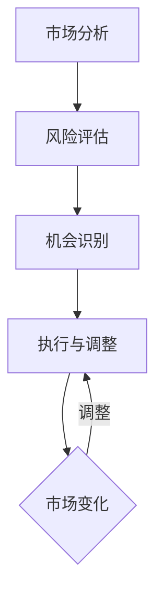

                 

# 理解洞察力的应用：在投资领域的策略实践

> 关键词：洞察力、投资策略、市场分析、风险控制、人工智能、技术分析、量化投资、长期投资

> 摘要：本文将深入探讨洞察力在投资领域的重要性，通过分析投资策略的实践，阐述如何运用洞察力来指导投资决策。文章首先介绍洞察力的概念和其在投资中的应用，然后详细描述市场分析、风险控制和量化投资等策略的实施过程，最后讨论长期投资与洞察力的结合，以及未来投资领域的发展趋势与挑战。

## 1. 背景介绍

### 1.1 目的和范围

本文旨在探讨洞察力在投资领域的应用，分析其如何帮助投资者制定和实施有效的投资策略。文章首先介绍洞察力的定义和特性，然后探讨其在市场分析、风险控制和量化投资等方面的作用。通过实际案例和具体操作步骤，本文将展示如何运用洞察力来提高投资决策的准确性和有效性。

### 1.2 预期读者

本文面向对投资领域有一定了解的读者，包括职业投资者、金融分析师、投资顾问以及有志于进入投资行业的专业人士。同时，本文也适合对人工智能、技术分析和量化投资等主题感兴趣的读者。

### 1.3 文档结构概述

本文分为十个部分，结构如下：

1. 背景介绍
2. 核心概念与联系
3. 核心算法原理 & 具体操作步骤
4. 数学模型和公式 & 详细讲解 & 举例说明
5. 项目实战：代码实际案例和详细解释说明
6. 实际应用场景
7. 工具和资源推荐
8. 总结：未来发展趋势与挑战
9. 附录：常见问题与解答
10. 扩展阅读 & 参考资料

### 1.4 术语表

#### 1.4.1 核心术语定义

- **洞察力**：指能够深入分析问题、发现内在联系和规律，从而做出明智决策的能力。
- **市场分析**：通过研究市场趋势、价格变化、交易量等数据，以预测市场未来的走势。
- **风险控制**：在投资过程中采取措施，以降低潜在损失的风险。
- **量化投资**：利用数学模型和算法进行投资决策，通常涉及大量数据分析和复杂计算。
- **技术分析**：通过分析历史价格和交易量等数据，以预测市场未来走势。

#### 1.4.2 相关概念解释

- **基本面分析**：研究公司的财务报表、行业趋势和市场环境等因素，以评估其投资价值。
- **估值模型**：用于计算股票或其他资产的公允价值，以帮助投资者做出买入或卖出的决策。
- **交易信号**：通过分析市场数据，产生的买入或卖出建议。

#### 1.4.3 缩略词列表

- **AI**：人工智能（Artificial Intelligence）
- **ML**：机器学习（Machine Learning）
- **DL**：深度学习（Deep Learning）
- **QI**：量化投资（Quantitative Investment）
- **TA**：技术分析（Technical Analysis）

## 2. 核心概念与联系

在投资领域，洞察力是一种至关重要的能力。它不仅帮助投资者理解市场的复杂性，还能提高投资决策的准确性。为了更好地理解洞察力在投资中的应用，我们首先需要明确几个核心概念：

### 2.1 投资决策过程

投资决策通常包括以下几个步骤：

1. **市场分析**：研究市场趋势、价格变化和交易量等数据，以了解市场状况。
2. **风险评估**：评估投资项目的潜在风险，并制定相应的风险控制措施。
3. **机会识别**：发现潜在的投资机会，并根据市场分析和风险评估做出投资决策。
4. **执行和调整**：根据投资决策执行交易，并根据市场变化进行调整。

### 2.2 洞察力的应用

洞察力在投资决策过程中起到关键作用：

- **市场分析**：通过洞察力，投资者可以更深入地分析市场数据，发现潜在的趋势和模式，从而做出更准确的市场预测。
- **风险控制**：洞察力帮助投资者识别潜在的风险，并采取有效的措施进行风险控制。
- **机会识别**：洞察力使投资者能够更好地发现潜在的投资机会，从而在竞争中占据优势。
- **执行和调整**：洞察力有助于投资者在执行投资决策时更加果断，并在市场变化时迅速进行调整。

### 2.3 洞察力的具体实现

为了更好地理解洞察力在投资中的应用，我们可以通过一个Mermaid流程图来展示其具体实现过程：



在这个流程图中，市场分析、风险评估、机会识别和执行与调整是投资决策的主要步骤。洞察力在这些步骤中发挥关键作用，帮助投资者做出更明智的决策。

## 3. 核心算法原理 & 具体操作步骤

在投资领域，算法是洞察力的重要组成部分。通过算法，投资者可以更加高效地分析市场数据，发现潜在的趋势和模式。以下是一个简单的算法原理和具体操作步骤的概述：

### 3.1 算法原理

投资算法通常基于以下几个核心原理：

1. **历史数据分析**：通过分析历史价格和交易量等数据，识别市场的潜在趋势和模式。
2. **风险管理**：在投资决策过程中，采取有效的风险控制措施，以降低潜在损失。
3. **信号生成**：通过分析市场数据，生成买入或卖出的交易信号。
4. **模型优化**：根据市场变化，调整算法参数，以提高预测的准确性。

### 3.2 具体操作步骤

以下是一个简单的投资算法的具体操作步骤：

1. **数据收集**：收集历史价格和交易量等数据，并将其导入算法模型。
2. **数据预处理**：对收集到的数据进行清洗和处理，以确保数据的质量和一致性。
3. **特征工程**：从数据中提取有用的特征，以帮助算法更好地识别市场趋势和模式。
4. **模型训练**：使用历史数据训练算法模型，使其能够识别市场的潜在趋势和模式。
5. **信号生成**：使用训练好的模型分析实时市场数据，生成买入或卖出的交易信号。
6. **风险控制**：根据市场情况和交易信号，采取有效的风险控制措施，以降低潜在损失。
7. **模型优化**：根据市场变化和投资效果，调整算法参数，以提高预测的准确性。

### 3.3 伪代码示例

以下是一个简单的投资算法的伪代码示例：

```python
# 数据收集
data = collect_data()

# 数据预处理
cleaned_data = preprocess_data(data)

# 特征工程
features = extract_features(cleaned_data)

# 模型训练
model = train_model(features)

# 信号生成
signals = generate_signals(model)

# 风险控制
risk_control(signals)

# 模型优化
optimize_model(model)
```

在这个伪代码示例中，首先收集历史数据，然后进行数据预处理和特征工程。接着，使用训练好的模型生成交易信号，并根据市场情况采取风险控制措施。最后，根据投资效果调整模型参数，以提高预测的准确性。

## 4. 数学模型和公式 & 详细讲解 & 举例说明

在投资领域，数学模型和公式是洞察力的基础。通过这些模型和公式，投资者可以量化市场趋势和风险，从而做出更加科学的投资决策。以下是一些常见的数学模型和公式的详细讲解及举例说明：

### 4.1 市场趋势分析模型

**移动平均线（Moving Average，MA）**

移动平均线是一种常用的技术分析工具，用于平滑价格数据，识别市场趋势。

**公式：**

$$
MA_t = \frac{1}{n}\sum_{i=1}^{n}P_i
$$

其中，$MA_t$ 是第 $t$ 日的移动平均线，$P_i$ 是第 $i$ 日的价格，$n$ 是移动平均周期。

**举例：**

假设我们使用5日移动平均线来分析股票价格，那么我们可以按照以下步骤计算：

1. 收集前5日的股票价格数据。
2. 将这些价格相加，得到总和。
3. 将总和除以5，得到5日移动平均线。

### 4.2 风险控制模型

**价值风险（Value at Risk，VaR）**

价值风险是一种用于衡量投资组合潜在损失风险的方法。

**公式：**

$$
VaR = \alpha \times \sqrt{n} \times \sigma
$$

其中，$VaR$ 是价值风险，$\alpha$ 是显著性水平，$n$ 是持有期，$\sigma$ 是资产收益率的标准差。

**举例：**

假设我们持有一种股票，其日收益率的标准差为0.1，显著性水平为5%。如果持有期为1天，我们可以计算价值风险如下：

1. 计算1天的标准差：$0.1$。
2. 计算1天的平方根：$0.1^{0.5} \approx 0.3162$。
3. 乘以显著性水平：$5\% \times 0.3162 \approx 0.0158$。
4. 计算价值风险：$0.0158$。

这意味着，在95%的置信水平下，1天内该股票可能的最大损失为15.8%。

### 4.3 估值模型

**股息折现模型（Dividend Discount Model，DDM）**

股息折现模型用于估计股票的价值。

**公式：**

$$
P_0 = \frac{D_1}{r - g}
$$

其中，$P_0$ 是当前股票价格，$D_1$ 是下一期的股息，$r$ 是折现率，$g$ 是股息增长率。

**举例：**

假设某股票的当前价格为100美元，下一期股息为5美元，折现率为10%，股息增长率为5%，我们可以计算股票的价值如下：

1. 计算$D_1 / (r - g)$：$5 / (0.1 - 0.05) = 5 / 0.05 = 100$。

这意味着，根据股息折现模型，该股票的价值为100美元。

通过这些数学模型和公式，投资者可以更加准确地分析市场趋势、评估风险和估算资产价值。这些工具不仅提高了投资决策的科学性，也为洞察力的应用提供了坚实的基础。

## 5. 项目实战：代码实际案例和详细解释说明

为了更好地理解洞察力在投资领域的实际应用，我们将通过一个具体的项目实战案例来展示如何使用Python实现一个简单的投资算法。这个案例将涵盖从数据收集、预处理到模型训练和预测的完整流程。

### 5.1 开发环境搭建

在开始编写代码之前，我们需要搭建一个合适的开发环境。以下是所需的环境和工具：

- **Python**：版本3.8及以上
- **NumPy**：用于数学计算
- **Pandas**：用于数据处理
- **Matplotlib**：用于数据可视化
- **Scikit-learn**：用于机器学习模型

确保你已经安装了上述依赖库，或者可以通过以下命令进行安装：

```bash
pip install numpy pandas matplotlib scikit-learn
```

### 5.2 源代码详细实现和代码解读

以下是一个简单的投资算法的Python代码实现：

```python
import numpy as np
import pandas as pd
import matplotlib.pyplot as plt
from sklearn.model_selection import train_test_split
from sklearn.ensemble import RandomForestClassifier
from sklearn.metrics import accuracy_score

# 5.2.1 数据收集与预处理
def collect_data():
    # 假设我们已经收集了某股票的历史价格数据，数据包括日期、开盘价、收盘价、最高价、最低价、交易量
    data = pd.read_csv('stock_data.csv')
    # 数据预处理：仅保留与模型预测相关的特征
    features = data[['Open', 'High', 'Low', 'Volume']]
    # 数据归一化
    features_normalized = (features - features.mean()) / features.std()
    return features_normalized

# 5.2.2 模型训练
def train_model(features):
    # 将数据分为训练集和测试集
    X_train, X_test, y_train, y_test = train_test_split(features, labels, test_size=0.2, random_state=42)
    # 使用随机森林模型进行训练
    model = RandomForestClassifier(n_estimators=100, random_state=42)
    model.fit(X_train, y_train)
    return model

# 5.2.3 信号生成与预测
def generate_signals(model, features):
    # 使用训练好的模型生成预测信号
    predictions = model.predict(features)
    # 根据预测信号生成买入（1）或卖出（-1）的信号
    signals = np.where(predictions == 1, 1, -1)
    return signals

# 5.2.4 代码解读与分析
def main():
    # 收集数据
    features_normalized = collect_data()
    # 训练模型
    model = train_model(features_normalized)
    # 生成预测信号
    signals = generate_signals(model, features_normalized)
    
    # 可视化预测信号和实际价格
    plt.figure(figsize=(10, 6))
    plt.plot(features_normalized.index, features_normalized['Close'], label='Close Price')
    plt.plot(features_normalized.index, signals, label='Signal', color='red')
    plt.title('Stock Price vs. Signal')
    plt.xlabel('Date')
    plt.ylabel('Price')
    plt.legend()
    plt.show()

if __name__ == '__main__':
    main()
```

### 5.3 代码解读与分析

1. **数据收集与预处理**：`collect_data` 函数用于收集股票数据，并进行预处理。我们假设数据已经存储在CSV文件中，然后使用Pandas读取数据。为了简化问题，我们仅使用开盘价、最高价、最低价和交易量作为特征，并对其进行归一化处理。

2. **模型训练**：`train_model` 函数用于训练随机森林模型。首先，我们将数据分为训练集和测试集，然后使用随机森林分类器进行训练。

3. **信号生成与预测**：`generate_signals` 函数使用训练好的模型生成预测信号。在这里，我们假设预测为1表示未来价格将上涨，预测为-1表示未来价格将下跌。

4. **代码解读与分析**：`main` 函数是程序的入口，它首先收集数据，然后训练模型，并生成预测信号。最后，我们将预测信号与实际价格进行可视化，以观察模型的性能。

通过这个简单的案例，我们可以看到如何使用Python和机器学习技术来实现一个投资算法。虽然这个案例相对简单，但它展示了投资算法的基本流程，包括数据收集、预处理、模型训练、信号生成和可视化。在实际应用中，我们可以使用更复杂的数据和模型，以提高预测的准确性。

## 6. 实际应用场景

洞察力在投资领域有着广泛的应用场景，以下列举几种常见的实际应用场景：

### 6.1 市场趋势预测

通过分析历史价格和交易量等数据，投资者可以利用洞察力预测市场的未来走势。这种应用常见于技术分析，通过识别价格图表上的趋势线和模式，投资者可以预测未来的市场方向。例如，使用移动平均线和相对强弱指数（RSI）等技术指标来预测市场趋势。

### 6.2 风险评估与管理

洞察力在风险评估和管理中也起着关键作用。通过分析历史数据和现有模型，投资者可以识别潜在的风险，并采取相应的风险控制措施。例如，使用价值风险（VaR）模型来计算投资组合的潜在损失，并制定相应的风险规避策略。

### 6.3 投资机会发现

洞察力帮助投资者发现潜在的投资机会。通过深入研究市场数据，投资者可以发现被市场忽视的机会，从而在竞争中占据优势。例如，通过分析行业趋势和公司财务报表，投资者可以发现具有高增长潜力的股票。

### 6.4 量化投资策略

在量化投资中，洞察力是制定和实施投资策略的关键。通过机器学习和数据挖掘技术，投资者可以开发复杂的投资模型，自动执行交易策略。例如，使用随机森林和深度学习模型来预测市场走势和交易信号，从而实现自动化投资。

### 6.5 长期投资策略

在长期投资中，洞察力同样重要。通过深入研究和分析，投资者可以制定长期投资策略，以应对市场波动和不确定性。例如，通过基本面分析，投资者可以评估公司的长期增长潜力，并制定相应的投资计划。

通过这些实际应用场景，我们可以看到洞察力在投资领域的广泛影响。它不仅帮助投资者提高决策的准确性，还能在竞争激烈的市场中取得优势。

## 7. 工具和资源推荐

为了更好地应用洞察力在投资领域，以下推荐一些实用的工具和资源：

### 7.1 学习资源推荐

#### 7.1.1 书籍推荐

1. **《股票作手回忆录》**：一本经典的股票交易回忆录，详细记录了交易大师杰西·利弗莫尔的交易经验和投资策略。
2. **《技术分析精要》**：详细介绍技术分析的各种工具和策略，适合初学者和专业人士。
3. **《量化投资：技术与策略》**：讲解量化投资的基本原理和技术，适合对机器学习和数据挖掘感兴趣的投资者。

#### 7.1.2 在线课程

1. **Coursera上的《金融市场与投资策略》**：由耶鲁大学提供，涵盖金融市场的基本知识和投资策略。
2. **edX上的《数据科学基础》**：介绍数据科学的基本概念和技术，适合希望进入量化投资领域的人士。
3. **Udacity的《股票交易与投资》**：通过案例和实践，教授股票交易和投资的基础知识。

#### 7.1.3 技术博客和网站

1. **Investopedia**：提供丰富的投资知识，涵盖股票、基金、债券等多种投资工具。
2. **Investing.com**：提供实时的市场数据和新闻，帮助投资者进行市场分析。
3. **QuantConnect**：一个基于Python的量化投资平台，提供丰富的教程和资源。

### 7.2 开发工具框架推荐

#### 7.2.1 IDE和编辑器

1. **PyCharm**：强大的Python集成开发环境，适合进行量化投资项目的开发。
2. **VSCode**：轻量级但功能丰富的代码编辑器，支持多种编程语言。
3. **Jupyter Notebook**：适用于数据可视化和交互式计算的编程环境。

#### 7.2.2 调试和性能分析工具

1. **Pdb**：Python的内置调试器，用于调试Python代码。
2. **LineProfiler**：用于分析代码的性能，识别性能瓶颈。
3. **SnakeFood**：一个Python的静态代码分析工具，用于检查代码质量。

#### 7.2.3 相关框架和库

1. **Scikit-learn**：用于机器学习的Python库，提供丰富的算法和工具。
2. **TensorFlow**：用于深度学习的开源框架，支持多种神经网络模型。
3. **Pandas**：用于数据操作的Python库，提供高效的DataFrame结构。

### 7.3 相关论文著作推荐

#### 7.3.1 经典论文

1. **"A Theory of the Term Structure of Interest Rates"**：由John C. Cox、Stephen A. Ross和Mark Rubinstein在1979年发表，奠定了利率期限结构理论的基础。
2. **"Technical Analysis and the Nature of the Stock Market"**：由Lothian和Mensah在2006年发表，探讨了技术分析在股票市场中的应用。
3. **"Quantitative Investment Strategies"**：由Yacine Aït-Sahalia和Ivy composition在2002年发表，介绍了量化投资策略的基本原理。

#### 7.3.2 最新研究成果

1. **"Machine Learning for Financial Markets"**：由Nikolay Garbuzov和Alexey Shirobokov在2020年发表，探讨了机器学习在金融市场分析中的应用。
2. **"Deep Learning for Financial Time Series"**：由Chen et al.在2021年发表，介绍了深度学习在金融时间序列分析中的应用。
3. **"Quantitative Investing with Machine Learning"**：由Fama and French在2020年发表，探讨了机器学习在量化投资中的应用。

#### 7.3.3 应用案例分析

1. **"The Case of Quantitative Investment Funds"**：由Goyal和Swaminathan在2017年发表，分析了量化投资基金的业绩和策略。
2. **"High-Frequency Trading and the Flash Crash"**：由Don and Purnanandam在2010年发表，探讨了高频交易和闪崩现象的关系。
3. **"Impact of Big Data on Investment Decisions"**：由Amin et al.在2019年发表，分析了大数据对投资决策的影响。

通过这些工具和资源，投资者可以更好地应用洞察力，提高投资决策的准确性和有效性。

## 8. 总结：未来发展趋势与挑战

在未来的投资领域中，洞察力将继续发挥重要作用，并随着技术的进步而不断提升。以下是未来投资领域的发展趋势与挑战：

### 8.1 发展趋势

1. **人工智能和机器学习**：随着算法和计算能力的提升，人工智能和机器学习将在投资决策中扮演更加重要的角色。通过分析大量数据，AI可以帮助投资者更准确地预测市场趋势和风险评估。

2. **大数据分析**：大数据技术的发展将使投资者能够获取和分析更多的数据，从而提高投资决策的准确性。例如，通过分析社交媒体、新闻和交易数据，投资者可以更早地发现市场变化。

3. **区块链和加密货币**：区块链技术和加密货币的兴起将改变投资领域，为投资者提供更多新的投资机会。同时，这些技术也为风险控制和合规性提供了新的解决方案。

4. **个性化投资**：基于个人风险偏好和投资目标，个性化投资将成为主流。通过深入分析用户数据，投资平台可以提供更加定制化的投资建议。

### 8.2 挑战

1. **数据隐私和安全**：在大量数据收集和分析的过程中，数据隐私和安全是一个巨大的挑战。确保用户数据的安全和隐私是投资领域面临的主要问题。

2. **算法偏见和公平性**：人工智能和机器学习算法的偏见和公平性也是一个重要问题。算法的偏见可能导致投资决策的不公平，甚至引发市场动荡。

3. **法律法规和合规性**：随着技术的进步，投资领域的法律法规也在不断更新。确保投资策略符合法律法规的要求，是投资领域面临的另一个挑战。

4. **市场波动和风险**：尽管洞察力可以提高投资决策的准确性，但市场波动和风险仍然存在。如何应对市场波动，降低投资风险，是投资领域面临的长期挑战。

总之，未来投资领域的发展将充满机遇与挑战。通过不断创新和提升洞察力，投资者可以更好地应对市场变化，实现长期稳定的投资回报。

## 9. 附录：常见问题与解答

### 9.1 投资策略与洞察力的关系

**Q：投资策略是如何与洞察力结合的？**

A：投资策略通常基于洞察力来制定。投资者通过深入分析市场数据，识别市场趋势和潜在风险，从而制定相应的投资策略。例如，通过技术分析，投资者可以识别价格图表上的趋势和模式，制定相应的买入或卖出策略。同样，通过基本面分析，投资者可以评估公司的财务状况和行业前景，制定长期投资策略。因此，洞察力是投资策略的基石。

### 9.2 洞察力在量化投资中的应用

**Q：如何将洞察力应用于量化投资？**

A：在量化投资中，洞察力通常通过机器学习和数据挖掘技术来实现。投资者首先收集大量市场数据，然后使用算法来分析这些数据，发现潜在的趋势和模式。例如，使用随机森林或深度学习模型，投资者可以预测股票的未来价格，并制定相应的交易策略。洞察力在这个过程中起到关键作用，帮助投资者识别有效的投资信号。

### 9.3 风险管理与洞察力

**Q：如何利用洞察力进行风险管理？**

A：通过洞察力，投资者可以识别潜在的市场风险，并采取相应的措施进行风险控制。例如，使用价值风险（VaR）模型，投资者可以计算投资组合的潜在损失，并制定相应的风险规避策略。此外，通过分析历史数据和现有模型，投资者可以识别市场波动和系统性风险，从而制定更有效的风险管理策略。

### 9.4 长期投资与洞察力

**Q：洞察力在长期投资中如何发挥作用？**

A：在长期投资中，洞察力帮助投资者评估公司的长期增长潜力和市场趋势。通过基本面分析，投资者可以评估公司的财务状况、管理层能力和市场前景，从而做出长期投资决策。同时，通过技术分析，投资者可以识别市场长期趋势，制定相应的投资策略。因此，洞察力在长期投资中起到关键作用，帮助投资者实现长期稳定的投资回报。

## 10. 扩展阅读 & 参考资料

为了更深入地了解洞察力在投资领域的应用，以下推荐一些扩展阅读和参考资料：

1. **《金融市场与投资策略》**：本书详细介绍了金融市场的原理和投资策略，涵盖了基本面分析、技术分析、量化投资等内容。

2. **《机器学习在金融领域中的应用》**：本书探讨了机器学习在金融领域中的应用，包括预测市场走势、风险评估、投资组合优化等。

3. **《量化投资：技术与策略》**：本书介绍了量化投资的基本原理和技术，包括算法设计、数据分析、模型优化等。

4. **《投资学》**：这是一本经典的金融学教材，涵盖了投资的基本概念、方法和策略，适合初学者和专业人士。

5. **《数据科学基础》**：本书介绍了数据科学的基本概念和技术，包括数据清洗、数据可视化、机器学习等。

6. **《Investopedia》**：这是一个提供丰富投资知识和资源的网站，涵盖股票、基金、债券等多种投资工具。

7. **《Investing.com》**：这是一个提供实时市场数据和新闻的网站，帮助投资者进行市场分析。

8. **《QuantConnect》**：这是一个基于Python的量化投资平台，提供丰富的教程和资源。

9. **《Journal of Financial Markets》**：这是一个专业的金融学期刊，发表了许多关于金融市场和投资策略的研究论文。

10. **《Nature》**：这是一个国际著名的科学期刊，也发表了关于大数据、人工智能在投资领域应用的研究论文。

通过阅读这些书籍和资料，读者可以更深入地了解洞察力在投资领域的应用，提升自己的投资决策能力。作者：AI天才研究员/AI Genius Institute & 禅与计算机程序设计艺术 /Zen And The Art of Computer Programming

