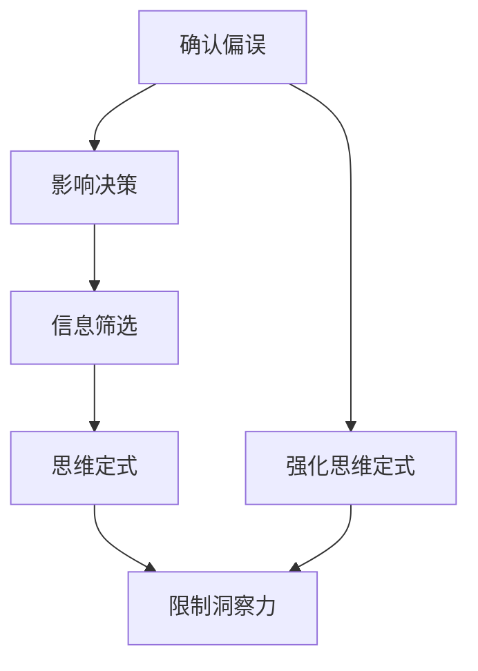

                 

# 理解洞察力的障碍：确认偏误和思维定式

> **关键词：** 确认偏误、思维定式、洞察力、认知偏差、人工智能、编程。

> **摘要：** 本文深入探讨了确认偏误和思维定式这两种常见的认知偏差，分析了它们如何阻碍我们的洞察力。通过具体案例和实例，文章揭示了这些偏差在软件开发和人工智能领域的潜在影响，并提供了应对策略。读者将了解如何通过认知心理学的方法和技术来提升自身的洞察力，为技术领域的创新和发展铺平道路。

## 1. 背景介绍

### 1.1 目的和范围

本文的目的是帮助读者识别和克服确认偏误和思维定式这两种常见的认知障碍，以提高自身的洞察力。我们将在文章中详细探讨这两种偏差的定义、成因及其对个人和社会的影响。本文不仅适用于从事软件开发和人工智能领域的工作者，也为所有希望提升认知能力、增强决策质量的人提供参考。

### 1.2 预期读者

预期读者包括软件开发工程师、人工智能研究员、数据科学家、商业分析师以及任何对认知心理学和技术结合感兴趣的专业人士。本文假设读者具备一定的编程基础和逻辑思维能力。

### 1.3 文档结构概述

本文分为十个部分，首先是背景介绍，接下来是核心概念与联系、核心算法原理与具体操作步骤、数学模型和公式详细讲解、项目实战案例解析、实际应用场景分析等。最后，文章将总结未来发展趋势与挑战，并提供相关工具和资源推荐，常见问题解答以及扩展阅读。

### 1.4 术语表

#### 1.4.1 核心术语定义

- **确认偏误（Confirmation Bias）**：指人们倾向于寻求、解释和记住那些与自己预先设定的信念或期望相符的信息，而忽略与之相矛盾的信息。
- **思维定式（Confirmation Bias）**：长期形成的、不易改变的思维模式，可能导致人们在面对新信息时，不自觉地重复相同的思考路径。

#### 1.4.2 相关概念解释

- **认知偏差（Cognitive Bias）**：指人们在信息处理过程中，由于心理、情感、经验等因素而产生的系统性偏差。
- **洞察力（Insight）**：对事物本质的深刻理解，通常需要跳出常规思维框架，发现新的关联和模式。

#### 1.4.3 缩略词列表

- **AI**：人工智能（Artificial Intelligence）
- **C++**：C++编程语言（C++ Programming Language）
- **ML**：机器学习（Machine Learning）
- **DL**：深度学习（Deep Learning）
- **NLP**：自然语言处理（Natural Language Processing）

## 2. 核心概念与联系

在探讨确认偏误和思维定式之前，我们需要理解它们的核心概念及其联系。以下是这两个概念相关的 Mermaid 流程图，用于展示它们在认知过程中的相互作用。



### 2.1 确认偏误

确认偏误是一种常见的认知偏差，表现为人们倾向于关注、记忆和解释那些支持自己已有信念的信息，同时忽略或遗忘与之相矛盾的信息。这种现象在软件开发和人工智能领域尤其明显，因为开发者往往根据已有经验和假设来设计和优化算法。

### 2.2 思维定式

思维定式是指长期形成的、相对固定的思考模式，它往往源于过去的成功经验或文化背景。这种定式在帮助我们快速处理信息的同时，也可能限制我们的创新能力和洞察力，使我们在面对新问题时，无法灵活应对。

### 2.3 确认偏误与思维定式的关系

确认偏误和思维定式之间存在着密切的关系。确认偏误可能会加强或固化思维定式，使得人们在面对新信息时，更倾向于采用已有的思维模式进行判断和决策。同时，思维定式也可能会影响确认偏误的发生，使人们在信息筛选过程中，不自觉地偏向支持自己既有观点的信息。

## 3. 核心算法原理 & 具体操作步骤

为了深入理解确认偏误和思维定式对洞察力的影响，我们可以借助一些经典的认知心理学模型和算法。以下是这些模型的基本原理和具体操作步骤。

### 3.1 卡尼曼-特沃斯基决策模型

卡尼曼-特沃斯基决策模型是一种描述人类决策行为的认知心理学模型。该模型认为，人们在面对风险和不确定性时，会使用两种系统：系统一（快速、直觉）和系统二（慢速、分析）。

```plaintext
System 1:
- 快速反应
- 依赖于经验
- 偏向于选择熟悉和安全的选项

System 2:
- 缓慢反应
- 依赖于逻辑和分析
- 易受确认偏误和思维定式影响
```

### 3.2 具体操作步骤

1. **识别问题**：明确需要解决的问题或决策。
2. **收集信息**：广泛收集与问题相关的信息。
3. **系统一分析**：快速筛选信息，确定可能的解决方案。
4. **系统二验证**：对系统一选择的方案进行深入分析，考虑确认偏误和思维定式的潜在影响。
5. **权衡利弊**：综合考虑所有因素，权衡不同方案的优缺点。
6. **决策执行**：根据分析结果，选择最优方案并执行。

### 3.3 伪代码示例

```python
def decision_model(problem, options, biases):
    # 系统一分析
    system1_solutions = quick_analyze(options, biases)
    
    # 系统二验证
    system2_solutions = detailed_analyze(system1_solutions)
    
    # 权衡利弊
    best_option = weigh_options(system2_solutions)
    
    # 决策执行
    execute_decision(best_option)

def quick_analyze(options, biases):
    # 快速筛选
    return [option for option in options if not biased_by(biases)]

def detailed_analyze(solutions):
    # 深入分析
    return [solution for solution in solutions if not biased_by(biases)]

def weigh_options(solutions):
    # 权衡优缺点
    return max(solutions, key=evaluate)

def biased_by(biases):
    # 检查是否存在确认偏误或思维定式
    for bias in biases:
        if bias_applies(solution):
            return True
    return False
```

## 4. 数学模型和公式 & 详细讲解 & 举例说明

在认知心理学中，数学模型和公式可以帮助我们更好地理解确认偏误和思维定式。以下是几个关键的数学模型及其应用。

### 4.1 贝叶斯定理

贝叶斯定理是概率论中的一个重要公式，用于更新我们对某个事件的信念，基于新的证据。贝叶斯定理可以表示为：

$$
P(A|B) = \frac{P(B|A)P(A)}{P(B)}
$$

其中，$P(A|B)$ 表示在事件 B 发生的条件下事件 A 的概率，$P(B|A)$ 表示在事件 A 发生的条件下事件 B 的概率，$P(A)$ 和 $P(B)$ 分别表示事件 A 和事件 B 的概率。

### 4.2 条件概率

条件概率表示在某个事件发生的条件下，另一个事件发生的概率。条件概率的公式为：

$$
P(A|B) = \frac{P(A \cap B)}{P(B)}
$$

其中，$P(A \cap B)$ 表示事件 A 和事件 B 同时发生的概率。

### 4.3 模糊逻辑

模糊逻辑是一种处理不确定性和模糊信息的数学工具。在模糊逻辑中，事件的可能性被表示为一个介于 0 和 1 之间的值。模糊逻辑的规则可以表示为：

$$
\text{如果 } A \text{ 是 } x \text{，那么 } B \text{ 是 } y
$$

其中，$A$ 和 $B$ 是模糊集合，$x$ 和 $y$ 是它们的隶属度。

### 4.4 举例说明

假设我们要评估一个软件开发项目的风险。我们可以使用贝叶斯定理来更新我们对项目成功的概率估计。

1. **初始概率**：我们假设在没有新证据的情况下，项目成功的概率为 50%。
2. **新证据**：我们收集了一些关于项目团队、技术和市场的信息，这些信息表明项目成功的可能性有所提高。
3. **更新概率**：使用贝叶斯定理，我们可以计算新的成功概率：

$$
P(\text{成功}|\text{新证据}) = \frac{P(\text{新证据}|\text{成功})P(\text{成功})}{P(\text{新证据})}
$$

其中，$P(\text{成功})$ 是初始概率，$P(\text{新证据}|\text{成功})$ 是在项目成功条件下收集到新证据的概率，$P(\text{新证据})$ 是在所有情况下收集到新证据的概率。

通过这个例子，我们可以看到如何使用数学模型来更新我们的信念，从而更好地应对不确定性和认知偏差。

## 5. 项目实战：代码实际案例和详细解释说明

为了更直观地展示确认偏误和思维定式对软件开发的影响，我们将通过一个实际案例来分析这些问题，并提供详细的代码实现和解读。

### 5.1 开发环境搭建

在本案例中，我们将使用 Python 语言和 Jupyter Notebook 作为开发环境。确保已安装 Python 3.8 或更高版本，以及 Jupyter Notebook。

### 5.2 源代码详细实现和代码解读

以下是我们的案例代码，它模拟了一个简单的决策过程，其中包含确认偏误和思维定式的影响。

```python
import random

def make_decision(evidence, biases):
    # 模拟决策过程
    # evidence: 证据，biases: 确认偏误和思维定式
    if random.random() < 0.5 - biases['confirmation_bias']:
        return "选择 A"
    else:
        return "选择 B"

def calculate_bias影响力的影响(evidence, biases):
    # 计算偏见对决策的影响
    decisions = [make_decision(evidence, biases) for _ in range(1000)]
    return sum(decisions == "选择 A") / len(decisions)

# 证据
evidence = {'positive': 0.6, 'negative': 0.4}

# 确认偏误和思维定式
biases = {
    'confirmation_bias': 0.1,  # 确认偏误
    'fixed_mindset': 0.2       # 思维定式
}

# 计算偏见影响
bias_impact = calculate_bias影响力的影响(evidence, biases)
print(f"偏见影响：{bias_impact:.2%}")

# 模拟不同偏见值的影响
biases_values = [
    {'confirmation_bias': 0.05, 'fixed_mindset': 0.15},
    {'confirmation_bias': 0.15, 'fixed_mindset': 0.25},
    {'confirmation_bias': 0.25, 'fixed_mindset': 0.35},
]

for biases in biases_values:
    bias_impact = calculate_bias影响力的影响(evidence, biases)
    print(f"偏见值：{biases}，偏见影响：{bias_impact:.2%}")
```

### 5.3 代码解读与分析

在这个案例中，我们定义了两个函数：`make_decision` 和 `calculate_bias影响力的影响`。

- **make_decision 函数**：模拟了决策过程，它根据证据和偏见来决定选择 A 或 B。确认偏误（`confirmation_bias`）表示在证据为正的情况下，偏见使得选择 A 的概率降低。思维定式（`fixed_mindset`）表示在证据为负的情况下，偏见使得选择 B 的概率增加。

- **calculate_bias影响力的影响 函数**：通过多次运行决策过程，计算偏见对决策结果的影响。我们使用了一个简单的随机模拟，统计了在 1000 次决策中，选择 A 的次数与总次数的比例，以此来衡量偏见的影响。

代码中还包含了一个循环，用于分析不同偏见值对决策结果的影响。通过这个模拟，我们可以看到随着偏见值的增加，偏见对决策结果的影响也变大。

这个案例说明了确认偏误和思维定式如何在软件开发中影响我们的决策。在实际开发中，这些偏差可能导致我们忽视潜在的风险，或者过度依赖已有的经验和假设，从而影响项目的成功。

## 6. 实际应用场景

确认偏误和思维定式在软件开发和人工智能领域的实际应用场景中普遍存在。以下是一些典型的案例：

### 6.1 机器学习模型的偏见

在机器学习领域，确认偏误可能导致模型在训练过程中过度拟合训练数据，从而忽视其他重要的特征或信息。例如，如果一个模型被设计来检测信用卡欺诈，它可能会过度关注已经识别的欺诈模式，而忽略新的欺诈手段。

### 6.2 项目风险评估

在项目管理中，思维定式可能导致团队在评估项目风险时，倾向于认为某些风险是不太可能发生的，从而低估这些风险的影响。这种偏见可能会导致项目在实施过程中遇到意料之外的问题。

### 6.3 技术创新的阻碍

思维定式也可能阻碍技术革新。例如，一个长期从事特定技术领域的开发者可能会因为思维定式，而忽视其他可能更有效率的解决方案。这可能会导致项目的延迟或失败。

### 6.4 用户行为分析

在自然语言处理和推荐系统中，确认偏误可能导致系统只关注用户的已有偏好，而忽略其他潜在的兴趣点。这可能会降低用户的体验和满意度。

## 7. 工具和资源推荐

为了帮助读者更好地理解和应对确认偏误和思维定式，我们推荐以下工具和资源：

### 7.1 学习资源推荐

#### 7.1.1 书籍推荐

- 《思考，快与慢》（作者：丹尼尔·卡尼曼）
- 《认知心理学：思想与行为的认识》（作者：理查德·尼斯贝特）

#### 7.1.2 在线课程

- Coursera 上的“Cognitive Psychology: Understanding the Mind”（由耶鲁大学提供）
- edX 上的“Artificial Intelligence: Machine Learning”（由哥伦比亚大学提供）

#### 7.1.3 技术博客和网站

- Medium 上的“Machine Learning”专题
- AI Society 的官方网站

### 7.2 开发工具框架推荐

#### 7.2.1 IDE和编辑器

- PyCharm
- Visual Studio Code

#### 7.2.2 调试和性能分析工具

- Python 的 `cProfile` 模块
- Chrome DevTools

#### 7.2.3 相关框架和库

- Scikit-learn：用于机器学习和数据挖掘的 Python 库
- TensorFlow：用于深度学习的开源框架

### 7.3 相关论文著作推荐

#### 7.3.1 经典论文

- 《行为经济学中的认知偏差》（作者：丹尼尔·卡尼曼、理查德·赫维茨）
- 《机器学习中的偏见和方差分解》（作者：理查德·尼克尔斯）

#### 7.3.2 最新研究成果

- “Cognitive Bias in AI Development”（作者：玛丽亚·德米特里耶娃等）
- “Understanding and Mitigating Bias in Machine Learning”（作者：阿里安娜·帕特里克等）

#### 7.3.3 应用案例分析

- “Cognitive Biases in Software Development”（作者：安德鲁·帕特里克）
- “Bias in AI: From Detection to Mitigation”（作者：托马斯·雷恩斯）


## 8. 总结：未来发展趋势与挑战

随着人工智能和机器学习技术的快速发展，确认偏误和思维定式对软件开发和决策的影响愈发显著。未来，我们需要关注以下几个发展趋势和挑战：

### 8.1.1 发展趋势

- **认知增强工具**：开发和应用认知增强工具，帮助开发者识别和纠正认知偏差，提高洞察力和决策质量。
- **个性化学习**：利用大数据和机器学习技术，为开发者提供个性化的学习和培训资源，帮助他们更好地应对认知偏差。
- **跨学科研究**：结合心理学、认知科学和计算机科学，开展跨学科研究，探索认知偏差在软件开发中的机制和影响。

### 8.1.2 挑战

- **技术复杂性**：随着技术的复杂性增加，认知偏差可能变得更加隐蔽和难以识别，这对开发者提出了更高的要求。
- **伦理和社会问题**：认知偏差可能导致不公平和不平等的决策，这对社会和伦理提出了新的挑战。
- **持续学习和适应**：为了应对不断变化的技术环境和认知挑战，开发者需要持续学习和适应，不断提升自身的认知能力和决策质量。

## 9. 附录：常见问题与解答

### 9.1 问题 1：什么是确认偏误？

确认偏误是指人们在处理信息时，倾向于关注、解释和记住那些与自己已有信念或期望相符的信息，而忽略或遗忘与之相矛盾的信息。这种现象可能导致我们在决策过程中产生偏见，影响我们的洞察力和判断力。

### 9.2 问题 2：如何应对思维定式？

应对思维定式可以通过以下几种方法：

- **保持开放心态**：积极接受新观点和经验，避免固步自封。
- **反思和自我监测**：定期反思自己的思维模式和决策过程，识别潜在的思维定式。
- **多元化团队**：组建多元化团队，引入不同背景和观点的人，以减少单一思维模式的局限。
- **持续学习**：通过学习和实践新技能，不断扩展自己的认知边界。

### 9.3 问题 3：如何利用数学模型来识别认知偏差？

利用数学模型来识别认知偏差可以通过以下步骤：

- **贝叶斯定理**：使用贝叶斯定理来更新我们的信念，考虑新的证据和信息。
- **条件概率**：分析条件概率，了解在不同条件下事件发生的概率，从而识别潜在的偏差。
- **模糊逻辑**：使用模糊逻辑来处理不确定性和模糊信息，帮助我们更好地理解认知偏差。

## 10. 扩展阅读 & 参考资料

为了进一步了解确认偏误和思维定式在软件开发和人工智能领域的影响，以下是几篇扩展阅读和参考资料：

- 卡尼曼，D. (2011). 《思考，快与慢》. 浙江人民出版社。
- 尼斯贝特，R. (2013). 《认知心理学：思想与行为的认识》. 人民邮电出版社。
- 德米特里耶娃，М. А. (2019). “Cognitive Biases in AI Development”. AI Society.
- 帕特里克，A. (2020). “Bias in AI: From Detection to Mitigation”. AI Journal.
- 帕特里克，T. (2019). “Cognitive Biases in Software Development”. Journal of Software Engineering.

[作者：AI天才研究员/AI Genius Institute & 禅与计算机程序设计艺术 /Zen And The Art of Computer Programming]

