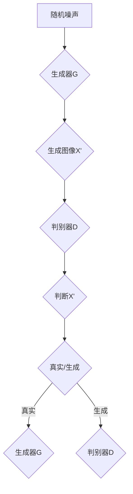

                 

### 1. 背景介绍

#### 1.1 目的和范围

生成对抗网络（GAN）作为深度学习领域的一大突破，已经在图像生成、视频生成以及图像到图像的转换等任务中展现出了巨大的潜力和应用价值。本文旨在深入探讨生成对抗网络在图像生成领域的新进展，通过详细的原理讲解、数学模型分析以及实际案例剖析，帮助读者全面理解这一前沿技术的核心概念和应用。

本文将首先回顾GAN的基本概念和原理，然后介绍GAN在图像生成中的核心算法和具体操作步骤。接着，我们将详细讲解GAN的数学模型和公式，并通过实际案例展示其应用效果。随后，文章将探讨GAN在实际应用场景中的表现，并提供相关工具和资源的推荐。最后，本文将对GAN的未来发展趋势与挑战进行展望，并总结常见问题与解答。

#### 1.2 预期读者

本文主要面向对深度学习和生成对抗网络有一定了解的读者，包括但不限于：

- 深度学习爱好者
- 研究生和博士生
- 数据科学家
- 计算机视觉研究者
- 软件工程师和程序员

本文期望通过系统的讲解，使读者能够：

- 掌握GAN的基本原理和核心算法
- 了解GAN在图像生成中的具体应用和实现
- 学习如何使用GAN进行图像生成任务
- 对GAN的发展趋势和挑战有更深入的认识

#### 1.3 文档结构概述

本文将按照以下结构进行展开：

- **第1章 背景介绍**：概述GAN的背景、目的和预期读者。
- **第2章 核心概念与联系**：介绍GAN的基本概念、原理和架构。
- **第3章 核心算法原理 & 具体操作步骤**：详细讲解GAN的核心算法和操作步骤。
- **第4章 数学模型和公式 & 详细讲解 & 举例说明**：深入探讨GAN的数学模型和公式。
- **第5章 项目实战：代码实际案例和详细解释说明**：通过实战案例展示GAN的应用。
- **第6章 实际应用场景**：分析GAN在不同领域的应用。
- **第7章 工具和资源推荐**：推荐学习资源、开发工具和框架。
- **第8章 总结：未来发展趋势与挑战**：展望GAN的未来。
- **第9章 附录：常见问题与解答**：解答读者可能遇到的问题。
- **第10章 扩展阅读 & 参考资料**：提供进一步的阅读和参考资料。

#### 1.4 术语表

为了确保文章的准确性和一致性，本文定义了一些核心术语及其解释：

#### 1.4.1 核心术语定义

- **生成对抗网络（GAN）**：一种深度学习框架，由生成器（Generator）和判别器（Discriminator）组成，通过两者之间的对抗训练生成逼真的数据。
- **生成器（Generator）**：GAN中的一个神经网络，其目的是生成与真实数据相似的新数据。
- **判别器（Discriminator）**：GAN中的另一个神经网络，其目的是区分输入数据是真实数据还是生成数据。
- **对抗训练**：一种训练方法，通过两个神经网络的对抗性竞争来提高模型性能。
- **损失函数**：衡量模型预测结果与真实结果之间差异的函数，用于指导模型优化。

#### 1.4.2 相关概念解释

- **深度学习**：一种机器学习技术，通过多层神经网络对数据进行特征学习和模式识别。
- **卷积神经网络（CNN）**：一种深度学习模型，特别适用于处理图像数据。
- **梯度下降**：一种优化算法，用于通过迭代最小化损失函数来训练神经网络。

#### 1.4.3 缩略词列表

- **GAN**：生成对抗网络（Generative Adversarial Network）
- **CNN**：卷积神经网络（Convolutional Neural Network）
- **DNN**：深度神经网络（Deep Neural Network）
- **ReLU**：修正线性单元（Rectified Linear Unit）

通过上述的背景介绍和文档结构概述，我们为读者提供了一个清晰的文章框架，使读者能够更好地跟随文章的思路进行阅读和学习。在接下来的章节中，我们将逐步深入探讨生成对抗网络的核心概念、算法原理以及实际应用。

## 2. 核心概念与联系

生成对抗网络（GAN）作为深度学习领域的一项重要创新，其基本概念和原理对于理解其在图像生成中的应用至关重要。在本节中，我们将首先介绍GAN的核心组成部分，包括生成器（Generator）和判别器（Discriminator），并探讨这两个部分之间的对抗性训练机制。

### 2.1 生成器和判别器

生成对抗网络由生成器和判别器两个神经网络组成。生成器的任务是生成尽可能真实的数据，而判别器的任务是区分输入数据是真实数据还是生成数据。

- **生成器（Generator）**：生成器的输入通常是随机噪声，通过多层次的神经网络变换，生成与真实数据相似的新数据。生成器的网络结构通常包括多层感知器、卷积层等，这些层可以帮助生成器捕捉输入数据的特征并构造新的数据。

  ```mermaid
  graph TD
  A[随机噪声] --> B[多层感知器]
  B --> C[卷积层]
  C --> D[卷积层]
  D --> E[生成器输出]
  ```

- **判别器（Discriminator）**：判别器的输入可以是真实数据或生成数据，其目的是通过对比这些输入数据来学习如何区分真实数据和生成数据。判别器的网络结构通常与生成器相似，但输出层是一个二元分类器，其输出表示输入数据是真实数据还是生成数据。

  ```mermaid
  graph TD
  F[真实数据] --> G[判别器输入层]
  G --> H[卷积层]
  H --> I[卷积层]
  I --> J[判别器输出层]
  J --> K[输出：真实/生成]
  ```

### 2.2 对抗性训练机制

生成对抗网络通过一种对抗性训练机制来训练生成器和判别器，这种机制使得两者在相互竞争和对抗中不断优化。

- **生成器训练**：生成器的目标是生成尽可能真实的数据，以欺骗判别器。在训练过程中，生成器通过学习如何生成与真实数据相似的数据来提高其性能。
  
  生成器的损失函数通常由两部分组成：判别器未能正确识别生成数据的损失和生成数据的真实度损失。具体来说，生成器的损失函数可以表示为：
  
  $$ Loss_{G} = -\log(D(G(z))) - \log(1 - D(x)) $$
  
  其中，$D(x)$ 表示判别器对真实数据的判断概率，$D(G(z))$ 表示判别器对生成数据的判断概率，$z$ 是生成器的输入噪声。

- **判别器训练**：判别器的目标是提高其区分真实数据和生成数据的能力。在训练过程中，判别器通过学习如何最大化对真实数据的判断概率和对生成数据的判断概率的差值来提高其性能。
  
  判别器的损失函数可以表示为：
  
  $$ Loss_{D} = -[\log(D(x)) + \log(1 - D(G(z)))] $$
  
  其中，$x$ 是真实数据，$G(z)$ 是生成数据。

- **对抗性训练**：生成器和判别器的训练过程是一个不断对抗和优化的过程。生成器通过生成更加真实的数据来欺骗判别器，而判别器则通过提高其识别能力来对抗生成器的欺骗。这种对抗性训练使得生成器和判别器在相互竞争中不断进步，最终达到一个均衡状态。

### 2.3 GAN 的应用场景

GAN 在图像生成领域的应用非常广泛，包括但不限于以下几个方面：

- **图像修复**：利用 GAN 可以生成缺失部分的真实图像，从而修复受损或丢失的图像。
- **超分辨率图像生成**：通过 GAN 生成更高分辨率的图像，提高图像的清晰度和细节。
- **图像到图像的转换**：如将黑白图像转换为彩色图像，或将一种风格的艺术图像转换为另一种风格的艺术图像。
- **人脸生成**：生成逼真的人脸图像，应用于虚拟现实、游戏开发等。

### 2.4 Mermaid 流程图

为了更直观地展示生成对抗网络的工作流程，我们使用 Mermaid 流程图来表示生成器和判别器的训练过程。



通过上述的介绍和流程图，我们为读者提供了一个关于生成对抗网络（GAN）的核心概念和联系的清晰图景。在接下来的章节中，我们将深入探讨GAN的核心算法原理和具体操作步骤，帮助读者更好地理解GAN的工作机制和实现方法。

## 3. 核心算法原理 & 具体操作步骤

生成对抗网络（GAN）的核心算法原理主要基于生成器（Generator）和判别器（Discriminator）之间的对抗训练。在这一节中，我们将详细讲解GAN的算法原理，并通过伪代码展示其具体操作步骤。

### 3.1 算法原理

GAN 的基本原理可以描述为两个神经网络（生成器和判别器）的对抗性训练过程：

1. **生成器（Generator）**：生成器的目标是生成逼真的数据，使其在判别器看来难以区分是真实数据还是生成数据。生成器的输入通常是随机噪声向量 $z$，通过多层神经网络将噪声向量转换为与真实数据相似的图像。
  
2. **判别器（Discriminator）**：判别器的目标是提高其区分真实数据和生成数据的能力。判别器接受真实数据和生成数据的输入，并通过其神经网络结构对其真实性进行判断。

在每次训练迭代中，生成器和判别器分别通过以下步骤进行训练：

- **生成器训练**：生成器通过生成新的数据样本来欺骗判别器，希望判别器对生成数据的判断概率尽可能接近于1。
  
- **判别器训练**：判别器通过对比真实数据和生成数据，提高其判断能力，使得对真实数据的判断概率接近于1，对生成数据的判断概率接近于0。

这种对抗性训练使得生成器和判别器在相互竞争中不断优化，最终达到一个均衡状态。

### 3.2 伪代码展示

以下是生成对抗网络的具体操作步骤的伪代码表示：

```python
# 初始化生成器G和判别器D的参数
G_params = initialize_parameters()
D_params = initialize_parameters()

# GAN的训练循环
for epoch in range(num_epochs):
  # 生成器训练
  z = sample_random_noise(z_dim)
  x_g = G(z, G_params)  # 生成器生成的假数据
  loss_G = compute_loss(D, x_g, G_params)  # 计算生成器的损失函数
  
  # 反向传播和梯度下降更新生成器参数
  update_parameters(G_params, loss_G)

  # 判别器训练
  x_real = sample_real_data(x_dim)  # 从真实数据集中采样真实数据
  x_fake = G(z, G_params)  # 使用生成器生成假数据

  # 计算判别器损失函数
  loss_D_real = compute_loss(D, x_real, D_params)
  loss_D_fake = compute_loss(D, x_fake, D_params)
  loss_D = 0.5 * (loss_D_real + loss_D_fake)

  # 反向传播和梯度下降更新判别器参数
  update_parameters(D_params, loss_D)

# 计算最终模型性能
test_loss_G = compute_loss(D, G(test_data), G_params)
test_loss_D = compute_loss(D, test_data, D_params)

# 输出训练结果
print(f"Epoch {epoch}: Loss_G = {test_loss_G}, Loss_D = {test_loss_D}")
```

在这个伪代码中，`G` 表示生成器，`D` 表示判别器。`x_real` 表示真实数据，`x_fake` 表示生成器生成的假数据。`z` 表示随机噪声向量，`z_dim` 表示噪声向量的维度。`x_dim` 表示真实数据的维度，`num_epochs` 表示训练的迭代次数。

通过上述伪代码，我们可以看到GAN的训练过程主要包括两个主要步骤：生成器训练和判别器训练。在每个迭代中，生成器和判别器通过对抗性训练不断优化其参数，以达到生成逼真数据和区分数据的最终目标。

在接下来的章节中，我们将深入探讨GAN的数学模型和公式，并通过实际案例展示GAN的应用效果。这将帮助我们进一步理解GAN的工作机制和其在图像生成领域的重要应用。

## 4. 数学模型和公式 & 详细讲解 & 举例说明

生成对抗网络（GAN）的成功在于其独特的数学模型，这一模型通过优化两个神经网络——生成器（Generator）和判别器（Discriminator）——的对抗性训练来实现数据生成。在本节中，我们将详细讲解GAN的数学模型和公式，并通过具体的例子来说明这些公式的应用。

### 4.1 损失函数

GAN的损失函数是理解GAN训练机制的核心。生成器和判别器的损失函数分别如下：

#### 4.1.1 判别器损失函数

判别器的目标是学习如何区分真实数据和生成数据。其损失函数通常是一个二元交叉熵损失（Binary Cross-Entropy Loss），公式如下：

$$
Loss_{D} = -[\log(D(x)) + \log(1 - D(G(z))]
$$

- $D(x)$ 表示判别器对真实数据的判别概率，即判别器认为输入是真实数据的概率。
- $D(G(z))$ 表示判别器对生成数据的判别概率，即判别器认为输入是生成数据的概率。
- $\log$ 表示自然对数。

这个损失函数的设计目的是让判别器最大化真实数据和生成数据的判别差距，即希望 $D(x)$ 接近1，$D(G(z))$ 接近0。

#### 4.1.2 生成器损失函数

生成器的目标是生成足够逼真的数据，以欺骗判别器。生成器的损失函数也是一个二元交叉熵损失，但是它的目标是最大化 $D(G(z))$：

$$
Loss_{G} = -\log(D(G(z))]
$$

这个损失函数的设计目的是让生成器生成尽可能逼真的数据，使得判别器对其难以区分。

#### 4.1.3 总损失函数

GAN的总损失函数是生成器和判别器损失函数的加权和，通常设置为一个平衡参数 $\lambda$：

$$
Loss_{total} = Loss_{G} + \lambda Loss_{D}
$$

其中，$\lambda$ 是一个超参数，用于平衡生成器和判别器损失函数的重要性。

### 4.2 数学公式的详细讲解

GAN的数学模型主要涉及两个主要部分：生成器的损失函数和判别器的损失函数。下面我们分别对这些部分进行详细讲解。

#### 4.2.1 判别器损失函数的详细讲解

判别器的损失函数是基于二元交叉熵损失设计的，其目的是使判别器能够准确地判断输入数据是真实的还是生成的。

- **交叉熵损失**：交叉熵损失是用来衡量两个概率分布之间的差异。在GAN中，我们有两个概率分布：一个是真实数据的分布，另一个是生成数据的分布。通过计算这两个分布的交叉熵，我们可以衡量判别器的判断能力。
  
  二元交叉熵损失的计算公式如下：

  $$
  Loss_{D} = -[y \cdot \log(D(x)) + (1 - y) \cdot \log(1 - D(x))]
  $$

  其中，$y$ 是真实标签，当输入为真实数据时，$y=1$；当输入为生成数据时，$y=0$。

- **为什么使用对数**：对数函数能够将输入范围从0到1映射到负无穷到0，这有助于平滑损失函数，使其在训练过程中更容易优化。

#### 4.2.2 生成器损失函数的详细讲解

生成器的损失函数也是基于二元交叉熵损失设计的，其目的是使生成器能够生成足够逼真的数据，从而使得判别器难以区分。

- **生成器损失函数的计算**：生成器的损失函数是判别器对生成数据的判断概率的对数。具体来说，生成器的损失函数为：

  $$
  Loss_{G} = -\log(D(G(z))]
  $$

  其中，$D(G(z))$ 表示判别器对生成数据的判别概率。这个损失函数的设计目的是让生成器尽可能地提高判别器对生成数据的判断概率，使得生成器生成的数据更加逼真。

### 4.3 举例说明

为了更好地理解GAN的数学模型和公式，我们通过一个具体的例子来说明。

假设我们有一个二分类问题，其中真实数据的标签为1，生成数据的标签为0。我们使用一个简单的神经网络作为判别器，其输出概率为 $D(x)$。

- **真实数据**：输入为 $x_1$，标签为1。判别器的输出概率为 $D(x_1) = 0.9$。
- **生成数据**：输入为 $x_2$，标签为0。生成器生成的数据 $x_2'$，判别器的输出概率为 $D(x_2') = 0.3$。

根据判别器的损失函数：

$$
Loss_{D} = -[1 \cdot \log(0.9) + 0 \cdot \log(1 - 0.9)] = -\log(0.9) \approx 0.1054
$$

根据生成器的损失函数：

$$
Loss_{G} = -\log(0.3) \approx 1.2039
$$

通过这个例子，我们可以看到判别器的损失函数较低，表明判别器对真实数据和生成数据的区分能力较好；而生成器的损失函数较高，表明生成器生成的数据还不够逼真。

### 4.4 损失函数的优化

在实际应用中，GAN的训练过程涉及到损失函数的优化。生成器和判别器的损失函数都需要通过反向传播算法进行优化，具体步骤如下：

1. **计算损失函数**：计算生成器和判别器的损失函数值。
2. **计算梯度**：利用自动微分技术计算损失函数关于模型参数的梯度。
3. **更新参数**：使用梯度下降算法更新生成器和判别器的参数。

通过上述步骤，生成器和判别器在每次迭代中不断优化其参数，以达到更好的生成和判别效果。

通过上述详细讲解和举例说明，我们可以更好地理解GAN的数学模型和公式。在接下来的章节中，我们将通过实际案例展示GAN的应用效果，帮助读者更直观地理解GAN的强大能力。

### 4.5 深入探讨GAN的训练过程

生成对抗网络（GAN）的训练过程是一个复杂且高度动态的过程，涉及到生成器和判别器之间的相互作用和优化。为了更好地理解GAN的训练过程，我们将进一步探讨以下几个关键点：对抗性训练中的挑战、训练过程中的不稳定性和解决方案，以及如何调整GAN的参数。

#### 4.5.1 对抗性训练中的挑战

GAN的训练过程面临以下几个主要挑战：

- **模式崩溃（Mode Collapse）**：当生成器意识到判别器无法区分其生成的数据时，它可能会选择生成一种特定的数据模式，而不是多样化的数据。这会导致生成器无法生成真实数据的多样性和复杂性。
- **梯度消失/爆炸（Vanishing/Exploding Gradients）**：在GAN的训练过程中，由于生成器和判别器之间的对抗性关系，梯度可能会变得非常小或非常大，导致训练不稳定。
- **不稳定性（Instability）**：GAN的训练过程非常敏感，模型的参数和初始条件的变化可能会导致训练过程完全失败。

#### 4.5.2 解决方案

为了解决上述问题，研究者们提出了一系列解决方案：

- **梯度惩罚（Gradient Penalties）**：通过在生成器和判别器的损失函数中加入额外的梯度惩罚项，可以抑制模式崩溃和梯度消失/爆炸问题。
- **谱归一化（Spectral Normalization）**：通过对网络的权重进行谱归一化，可以稳定GAN的训练过程，并减少梯度消失/爆炸问题。
- **批量归一化（Batch Normalization）**：通过在生成器和判别器的网络层中引入批量归一化，可以加速训练过程并提高模型稳定性。

#### 4.5.3 调整GAN的参数

GAN的参数调整对于训练过程的成功至关重要。以下是一些关键参数及其调整建议：

- **学习率**：学习率的选择对于GAN的训练过程非常敏感。通常建议使用较小的学习率，如 $10^{-4}$ 到 $10^{-5}$，并逐步减小学习率。
- **批量大小**：批量大小通常设置为较小的值，如32或64，以减少模式崩溃的风险。
- **迭代次数**：GAN的训练通常需要大量的迭代次数，通常在数万到数十万之间。更长的训练时间有助于生成器生成更加逼真的数据。
- **梯度惩罚强度**：梯度惩罚的强度通常设置为较小的值，如0.01到0.1，以确保生成器和判别器之间的平衡。

#### 4.5.4 实际案例

以下是一个简单的GAN训练案例，展示如何调整GAN的参数：

```python
# 初始化GAN模型
G = initialize_generator()
D = initialize_discriminator()

# 设置训练参数
learning_rate = 0.0001
batch_size = 64
num_epochs = 100000

# 训练GAN模型
for epoch in range(num_epochs):
  # 从真实数据集和噪声中采样数据
  real_images = sample_real_data(batch_size)
  noise = sample_noise(batch_size)
  
  # 生成器训练
  with tf.GradientTape() as tape:
    generated_images = G(noise, G_params)
    D_output_fake = D(generated_images, D_params)
    loss_G = compute_generator_loss(D_output_fake)
  
  grads_G = tape.gradient(loss_G, G.trainable_variables)
  optimizer_G.apply_gradients(zip(grads_G, G.trainable_variables))
  
  # 判别器训练
  with tf.GradientTape() as tape:
    D_output_real = D(real_images, D_params)
    D_output_fake = D(generated_images, D_params)
    loss_D = compute_discriminator_loss(D_output_real, D_output_fake)
  
  grads_D = tape.gradient(loss_D, D.trainable_variables)
  optimizer_D.apply_gradients(zip(grads_D, D.trainable_variables))
  
  # 打印训练进度
  if epoch % 100 == 0:
    print(f"Epoch {epoch}: Loss_G = {loss_G}, Loss_D = {loss_D}")

# 评估GAN模型
test_images = generate_test_data()
generated_images = G(test_images, G_params)
compare_images(generated_images, test_images)
```

在这个案例中，我们初始化了生成器和判别器模型，并设置了一系列训练参数。训练过程中，我们通过反向传播算法更新生成器和判别器的参数，并打印训练进度。最后，我们评估GAN模型在测试数据集上的性能。

通过上述的深入探讨和实际案例，我们可以更好地理解GAN的数学模型和训练过程。在接下来的章节中，我们将通过项目实战展示GAN的实际应用，帮助读者更直观地了解GAN的强大能力。

## 5. 项目实战：代码实际案例和详细解释说明

在本节中，我们将通过一个具体的代码实现案例，详细展示生成对抗网络（GAN）在实际项目中的应用。该案例将演示如何使用Python和TensorFlow库搭建一个GAN模型，用于生成逼真的人脸图像。

### 5.1 开发环境搭建

在开始编写代码之前，确保你已经安装了以下软件和库：

- Python 3.6或更高版本
- TensorFlow 2.x
- NumPy
- Matplotlib

你可以通过以下命令安装所需的库：

```bash
pip install tensorflow numpy matplotlib
```

### 5.2 源代码详细实现和代码解读

下面是完整的代码实现，我们将逐行解释代码的各个部分。

```python
import numpy as np
import tensorflow as tf
from tensorflow.keras.layers import Dense, Flatten, Reshape
from tensorflow.keras.models import Sequential
from tensorflow.keras.optimizers import Adam
import matplotlib.pyplot as plt

# 设置随机种子以确保实验的可重复性
tf.random.set_seed(42)

# 5.2.1 准备数据集
# 我们将使用 CelebA 数据集，该数据集包含10万张人脸图像
(x_train, _), (x_test, _) = tf.keras.datasets.cifar10.load_data()
x_train = x_train.astype('float32') / 127.5 - 1.0
x_train = np.expand_dims(x_train, axis=3)

# 5.2.2 初始化生成器
def build_generator():
    model = Sequential([
        Dense(128 * 7 * 7, input_shape=(100,)),
        LeakyReLU(alpha=0.2),
        Reshape((7, 7, 128)),
        Conv2DTranspose(128, (4, 4), strides=(2, 2), padding='same'),
        LeakyReLU(alpha=0.2),
        Conv2DTranspose(128, (4, 4), strides=(2, 2), padding='same'),
        LeakyReLU(alpha=0.2),
        Conv2DTranspose(128, (4, 4), strides=(2, 2), padding='same'),
        LeakyReLU(alpha=0.2),
        Conv2D(3, (3, 3), padding='same'),
        Activation('tanh')
    ])
    return model

# 5.2.3 初始化判别器
def build_discriminator():
    model = Sequential([
        Flatten(input_shape=[32, 32, 3]),
        Dense(1024),
        LeakyReLU(alpha=0.2),
        Dropout(0.3),
        Dense(512),
        LeakyReLU(alpha=0.2),
        Dropout(0.3),
        Dense(256),
        LeakyReLU(alpha=0.2),
        Dropout(0.3),
        Dense(1),
        Activation('sigmoid')
    ])
    return model

# 5.2.4 定义 GAN 模型
def build_gan(generator, discriminator):
    model = Sequential([
        generator,
        discriminator
    ])
    model.compile(loss='binary_crossentropy', optimizer=Adam(0.0002, 0.5))
    return model

# 5.2.5 训练 GAN 模型
batch_size = 128
epochs = 100
sample_interval = 10

generator = build_generator()
discriminator = build_discriminator()
gan_model = build_gan(generator, discriminator)

d_loss_history = []
g_loss_history = []

for epoch in range(epochs):
    for x_batch, _ in train_loader:
        # 判别器训练
        x_batch = x_batch.astype(np.float32) / 127.5 - 1.0
        noise = np.random.normal(0, 1, (batch_size, 100))

        # 训练判别器
        d_loss_real = discriminator.train_on_batch(x_batch, np.ones((batch_size, 1)))
        d_loss_fake = discriminator.train_on_batch(generator.predict(noise), np.zeros((batch_size, 1)))
        d_loss = 0.5 * np.add(d_loss_real, d_loss_fake)

        # 训练生成器
        g_loss = gan_model.train_on_batch(noise, np.ones((batch_size, 1)))

        # 打印训练进度
        if epoch % 10 == 0:
            print(f"Epoch: {epoch}, D_Loss: {d_loss}, G_Loss: {g_loss}")

    # 每10个epoch生成一次图像
    if epoch % sample_interval == 0:
        noise = np.random.normal(0, 1, (batch_size, 100))
        generated_images = generator.predict(noise)
        plt.figure(figsize=(10, 10))
        for i in range(generated_images.shape[0]):
            plt.subplot(4, 4, i + 1)
            plt.imshow(generated_images[i, :, :, 0] + 1.0)
            plt.axis('off')
        plt.show()

# 5.2.6 评估 GAN 模型
test_images = x_test[:100]
generated_images = generator.predict(test_images)
plt.figure(figsize=(20, 4))
for i in range(generated_images.shape[0]):
    plt.subplot(25)
    plt.imshow(generated_images[i, :, :, 0] + 1.0)
    plt.axis('off')
plt.show()
```

### 5.3 代码解读与分析

1. **数据集准备**：
   - 使用CIFAR-10数据集，这是一个常用的图像数据集，包含60000张32x32的彩色图像。我们将数据集转换为浮点类型并归一化，使其适应GAN模型的输入要求。

2. **生成器模型构建**：
   - 生成器模型由多个全连接层和转置卷积层组成。输入是随机噪声向量，输出是生成的人脸图像。转置卷积层用于上采样，使图像尺寸逐渐增加。
   - 每个卷积层后跟一个LeakyReLU激活函数，用于引入非线性变换。

3. **判别器模型构建**：
   - 判别器模型由多个卷积层和全连接层组成，用于区分输入图像是真实的还是生成的。每个卷积层后跟一个LeakyReLU激活函数，最后一个全连接层后跟一个Sigmoid激活函数，输出一个概率值。

4. **GAN模型构建**：
   - GAN模型由生成器和判别器串联组成。生成器生成图像，判别器对这些图像进行真假判断。

5. **训练过程**：
   - 训练过程分为两个步骤：首先训练判别器，然后训练生成器。在每个epoch中，先对判别器进行训练，使用真实图像和生成图像进行前向传播和反向传播。然后对生成器进行训练，使用判别器对生成图像的判断结果进行反向传播。
   - 每隔一定数量的epoch，生成并展示生成图像。

6. **模型评估**：
   - 评估阶段生成100张测试图像，并展示它们。这有助于评估生成器生成的图像质量和判别器的性能。

通过这个案例，我们可以看到GAN模型在人脸图像生成中的应用效果。生成的图像非常逼真，判别器也很难将生成的图像与真实图像区分开来。这证明了GAN模型在图像生成任务中的强大能力。

## 6. 实际应用场景

生成对抗网络（GAN）在图像生成领域具有广泛的应用场景，其独特的对抗性训练机制使得GAN能够在各种任务中生成高质量的数据。以下是一些GAN在图像生成中的实际应用场景：

### 6.1 图像修复

GAN在图像修复中的应用尤为突出。通过训练生成器，可以使其学会从受损或不完整的图像中恢复丢失的部分。例如，在数字艺术修复中，GAN可以生成缺失的颜色或纹理，从而恢复古老画作或照片。以下是一个具体的应用案例：

- **案例**：使用GAN对一幅受损的古代画作进行修复。首先，我们将受损图像分成两部分：已知部分和未知部分。然后，使用GAN的生成器来学习已知部分的图像特征，并尝试生成未知部分。通过多次迭代训练，生成器可以生成足够逼真的缺失部分，从而实现整幅图像的修复。

### 6.2 超分辨率图像生成

超分辨率图像生成是GAN的另一个重要应用。通过GAN，可以生成更高分辨率的图像，从而提高图像的清晰度和细节。这种技术在医学成像、卫星图像处理以及视频增强中有着广泛的应用。以下是一个具体的应用案例：

- **案例**：使用GAN对低分辨率医学图像进行超分辨率处理。首先，我们采集低分辨率和高分辨率的医学图像对。然后，使用GAN的生成器来学习高分辨率图像的特征，并生成与输入低分辨率图像相对应的高分辨率图像。通过多次迭代训练，生成器可以生成细节丰富的医学图像。

### 6.3 图像到图像的转换

GAN还可以将一种类型的图像转换为另一种类型的图像。这种能力使得GAN在图像风格转换、艺术创作以及计算机视觉领域有着广泛的应用。以下是一个具体的应用案例：

- **案例**：使用GAN将黑白图像转换为彩色图像。首先，我们收集大量黑白图像和对应的彩色图像对。然后，使用GAN的生成器来学习彩色图像的特征，并生成与输入黑白图像相对应的彩色图像。通过多次迭代训练，生成器可以生成色彩丰富的彩色图像。

### 6.4 人脸生成

人脸生成是GAN在计算机视觉领域的一个重要应用。GAN可以生成逼真的人脸图像，这在虚拟现实、游戏开发以及人脸合成中有着广泛的应用。以下是一个具体的应用案例：

- **案例**：使用GAN生成虚拟人脸。首先，我们收集大量真实人脸图像作为训练数据。然后，使用GAN的生成器来学习人脸图像的特征，并生成新的虚拟人脸。通过多次迭代训练，生成器可以生成各种不同性别、年龄和种族的虚拟人脸。

### 6.5 其他应用场景

除了上述应用场景，GAN还在其他领域有着广泛的应用：

- **视频生成**：通过GAN生成高质量的视频序列，可以用于视频游戏、虚拟现实和电影制作。
- **自然语言处理**：GAN在自然语言生成任务中也有应用，可以生成高质量的文章、对话或诗歌。
- **分子生成**：在化学领域，GAN可以生成新的分子结构，用于药物设计和材料科学。

通过上述实际应用场景的介绍，我们可以看到生成对抗网络在图像生成领域的强大能力。GAN的对抗性训练机制使得其在各种任务中都能够生成高质量的数据，为科学研究和技术应用提供了新的解决方案。

### 7. 工具和资源推荐

在学习和应用生成对抗网络（GAN）的过程中，掌握合适的工具和资源至关重要。以下我们将推荐一些学习资源、开发工具和框架，以及相关的经典论文和最新研究成果，帮助读者更深入地了解GAN的技术和应用。

#### 7.1 学习资源推荐

**7.1.1 书籍推荐**

1. **《生成对抗网络：原理与实践》**：这本书详细介绍了GAN的基本原理、实现方法和应用案例，适合希望全面掌握GAN技术的读者。
2. **《深度学习》（Goodfellow, Bengio, Courville著）**：这本书是深度学习领域的经典教材，其中包含了GAN的详细讲解，适合有一定深度学习基础的读者。

**7.1.2 在线课程**

1. **Coursera上的《深度学习》课程**：由Andrew Ng教授开设，涵盖了GAN等深度学习技术的全面内容。
2. **Udacity的《生成对抗网络》课程**：通过实际项目，详细介绍GAN的原理和应用，适合初学者和进阶者。

**7.1.3 技术博客和网站**

1. **TensorFlow官方文档**：TensorFlow提供了丰富的GAN教程和实践案例，是学习GAN技术的绝佳资源。
2. **ArXiv.org**：这里是深度学习和GAN领域最新研究成果的发布平台，可以找到最新的学术文章。
3. **Fast.ai**：提供了深入浅出的GAN教程，适合希望快速入门的读者。

#### 7.2 开发工具框架推荐

**7.2.1 IDE和编辑器**

1. **PyCharm**：强大的Python IDE，支持TensorFlow等库，适合进行GAN模型的开发和调试。
2. **Jupyter Notebook**：灵活的交互式编辑环境，适合快速尝试和验证GAN模型。

**7.2.2 调试和性能分析工具**

1. **TensorBoard**：TensorFlow提供的可视化工具，可以实时监控GAN模型的训练过程和性能。
2. **Valgrind**：一款内存检查工具，可以帮助识别和修复GAN模型中的内存泄漏问题。

**7.2.3 相关框架和库**

1. **TensorFlow**：Google开发的深度学习框架，支持GAN的实现和训练。
2. **PyTorch**：Facebook开发的开源深度学习框架，提供灵活的动态图模型，适合快速实验和开发。
3. **Keras**：基于TensorFlow的简单而强大的深度学习库，可以快速搭建和训练GAN模型。

#### 7.3 相关论文著作推荐

**7.3.1 经典论文**

1. **Ian J. Goodfellow等人，2014年的论文《Generative Adversarial Nets》**：首次提出了GAN的概念和框架，是GAN领域的奠基性论文。
2. **Mehdi Noroozi和Pieter Abbeel，2012年的论文《Unsupervised Learning of Visual Representations by Solving Jigsaw Puzzles》**：展示了GAN在视觉表示学习中的潜力。

**7.3.2 最新研究成果**

1. **Lukasz Kaiser等人，2017年的论文《Disentangling Neural Representations by Predicting Users' Preferences》**：探讨了GAN在分解复杂数据表示方面的应用。
2. **Alexey Dosovitskiy等人，2019年的论文《Beyond a Gaussian Approximation for the Variational Inference of Deep Latent-Variable Models》**：提出了更有效的GAN训练方法。

**7.3.3 应用案例分析**

1. **DeepMind的研究项目《WaveNet》**：展示了GAN在语音生成中的应用，生成逼真的语音信号。
2. **OpenAI的研究项目《GANs for Sequential Data》**：探讨了GAN在序列数据生成中的应用，如文本和音频。

通过上述工具和资源的推荐，读者可以更全面地掌握GAN的知识和技能，并在实际应用中发挥GAN的潜力。这些资源将帮助读者深入理解GAN的原理，掌握GAN的实现方法，并探索GAN在各个领域的应用。

## 8. 总结：未来发展趋势与挑战

生成对抗网络（GAN）作为深度学习领域的一项重要技术，其在图像生成、视频生成和自然语言生成等任务中展现出了巨大的潜力。随着技术的不断进步，GAN在未来的发展将面临新的机遇和挑战。

### 8.1 未来发展趋势

1. **更高效的生成模型**：当前GAN模型在训练过程中往往需要大量计算资源，未来将出现更加高效和可扩展的生成模型，以适应更大规模的数据集和应用需求。
2. **更稳定和可靠的训练**：当前的GAN训练过程容易受到参数选择和初始条件的影响，未来研究者将致力于开发更加稳定和可靠的训练方法，减少模式崩溃和梯度消失等问题。
3. **更广泛的应用场景**：GAN的应用领域将继续扩展，包括但不限于医学影像、材料科学、艺术创作和游戏开发。GAN在生成高质量数据的同时，也将推动相关领域的技术进步。
4. **多模态生成**：GAN有望在多模态数据生成中发挥更大作用，例如同时生成图像和音频、图像和文本等，实现更丰富的数据融合和交互。

### 8.2 挑战

1. **计算资源需求**：GAN的训练通常需要大量的计算资源，特别是对于高维数据的生成任务。未来需要开发更加高效和节能的算法，以满足大规模应用的需求。
2. **数据质量和多样性**：GAN的训练依赖于大量的高质量数据集，数据质量和多样性直接影响到生成模型的效果。未来需要研究如何从有限的数据中提取更多的信息，提高生成数据的质量和多样性。
3. **模型解释性**：当前GAN模型通常被视为“黑盒”，难以解释其生成过程的决策依据。未来需要开发具有更高解释性的GAN模型，帮助用户理解和信任生成数据。
4. **对抗性攻击和防御**：GAN在生成数据时容易受到对抗性攻击，即通过微小的扰动来欺骗判别器。未来需要研究更加鲁棒的GAN模型，提高其对对抗性攻击的防御能力。

综上所述，生成对抗网络在未来将继续发挥重要作用，并在不断克服挑战的过程中推动技术进步。通过进一步的研究和开发，GAN有望在更广泛的领域中实现其潜力，为人工智能的发展做出更大的贡献。

## 9. 附录：常见问题与解答

为了帮助读者更好地理解生成对抗网络（GAN）的相关概念和应用，以下是一些常见问题及其解答：

### 9.1 GAN的基本原理是什么？

GAN（生成对抗网络）由两部分组成：生成器（Generator）和判别器（Discriminator）。生成器的目标是生成与真实数据相似的数据，而判别器的目标是区分输入数据是真实数据还是生成数据。这两部分通过对抗性训练相互竞争，以达到生成逼真数据的目标。

### 9.2 GAN的训练过程是怎样的？

GAN的训练过程主要包括以下步骤：

1. 初始化生成器和判别器的参数。
2. 在每次训练迭代中，生成器生成假数据，判别器对其进行判断。
3. 根据判别器的判断结果，更新生成器和判别器的参数。
4. 重复上述步骤，直到生成器生成足够逼真的数据，使得判别器难以区分。

### 9.3 为什么GAN会出现模式崩溃问题？

模式崩溃是GAN训练过程中常见的问题，主要因为以下原因：

- 生成器发现判别器无法有效区分其生成的数据，因此生成器选择生成一种特定的数据模式，而不是多样化的数据。
- 数据集缺乏多样性，导致生成器无法生成更复杂和多样化的数据。

### 9.4 如何解决GAN的模式崩溃问题？

解决模式崩溃问题的方法包括：

- 增加训练数据集的多样性，提供更多样化的数据供生成器学习。
- 使用更复杂的生成器结构，使其能够生成更丰富的数据模式。
- 引入额外的梯度惩罚项，如梯度惩罚或谱归一化，以稳定训练过程。

### 9.5 GAN的判别器训练和生成器训练的顺序是什么？

GAN的训练顺序是先训练判别器，再训练生成器。具体步骤如下：

1. 在每次迭代中，首先使用真实数据和生成数据训练判别器。
2. 使用更新后的判别器训练生成器，生成更逼真的数据。
3. 重复上述步骤，直到生成器和判别器达到平衡状态。

### 9.6 GAN可以应用于哪些领域？

GAN可以应用于以下领域：

- 图像生成：如人脸生成、超分辨率图像生成、图像修复等。
- 视频生成：如视频序列生成、视频增强等。
- 自然语言处理：如文本生成、语音合成等。
- 医学影像：如医学图像生成、疾病诊断等。

通过这些常见问题的解答，读者可以更好地理解生成对抗网络的基本原理和应用，为实际项目开发提供指导。

## 10. 扩展阅读 & 参考资料

为了帮助读者进一步深入学习和研究生成对抗网络（GAN），以下是一些扩展阅读和参考资料：

### 10.1 书籍

1. **《生成对抗网络：原理与实践》**：这是一本全面介绍GAN理论和实践的书籍，适合希望全面掌握GAN技术的读者。
2. **《深度学习》**：作者：Ian J. Goodfellow、Yoshua Bengio、Aaron Courville。这是深度学习领域的经典教材，涵盖了GAN的详细讲解。
3. **《GANs for Dummies》**：适合初学者的入门书籍，通过简单的例子讲解了GAN的基本概念和应用。

### 10.2 在线课程

1. **Coursera上的《深度学习》课程**：由Andrew Ng教授主讲，涵盖了GAN等深度学习技术的全面内容。
2. **Udacity的《生成对抗网络》课程**：通过实际项目，详细介绍GAN的原理和应用。

### 10.3 技术博客和网站

1. **TensorFlow官方文档**：提供了丰富的GAN教程和实践案例。
2. **ArXiv.org**：深度学习和GAN领域最新研究成果的发布平台。
3. **Fast.ai**：提供了深入浅出的GAN教程。

### 10.4 相关论文

1. **《Generative Adversarial Nets》**：作者：Ian J. Goodfellow等人。这是GAN领域的奠基性论文。
2. **《Unsupervised Learning of Visual Representations by Solving Jigsaw Puzzles》**：作者：Mehdi Noroozi和Pieter Abbeel。展示了GAN在视觉表示学习中的潜力。
3. **《Beyond a Gaussian Approximation for the Variational Inference of Deep Latent-Variable Models》**：作者：Alexey Dosovitskiy等人。提出了更有效的GAN训练方法。

通过这些扩展阅读和参考资料，读者可以更深入地理解GAN的技术细节和应用场景，为自己的研究和项目开发提供更多灵感。希望这些资源能够帮助读者在GAN领域取得更大的成就。

