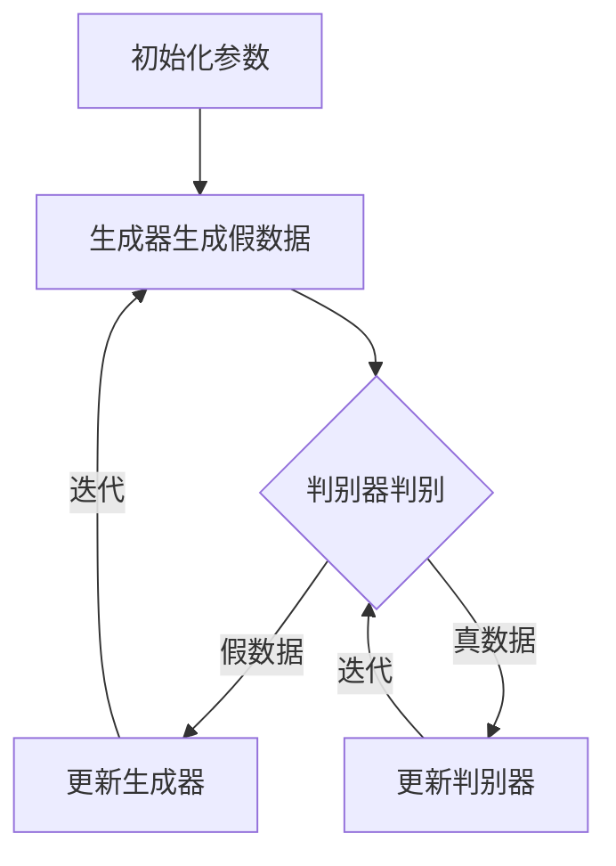

                 

# 生成对抗网络在图像生成中的新进展

> **关键词：** 生成对抗网络（GAN）、图像生成、深度学习、深度神经网络、图像风格迁移、超分辨率、数据增强
>
> **摘要：** 本文深入探讨了生成对抗网络（GAN）在图像生成领域的最新进展。首先，我们回顾了GAN的基本概念和原理，然后详细介绍了GAN在图像生成中的各种应用，包括图像风格迁移、超分辨率和数据增强。最后，本文分析了GAN当前面临的技术挑战，并展望了未来的发展趋势。

## 1. 背景介绍

### 1.1 目的和范围

本文旨在探讨生成对抗网络（GAN）在图像生成领域的新进展。GAN是一种深度学习框架，通过两个相互对抗的神经网络——生成器和判别器——来训练，从而实现图像的生成。本文将重点介绍GAN在图像生成中的各种应用，以及当前领域内的最新研究成果和挑战。

### 1.2 预期读者

本文适合对深度学习和生成对抗网络有一定了解的读者，尤其是对图像生成领域感兴趣的工程师、研究员和学者。通过本文的阅读，读者可以全面了解GAN在图像生成中的应用现状、技术挑战以及未来的发展趋势。

### 1.3 文档结构概述

本文分为十个部分，结构如下：

1. 背景介绍：介绍本文的目的、范围、预期读者以及文档结构。
2. 核心概念与联系：介绍生成对抗网络的基本概念和原理。
3. 核心算法原理 & 具体操作步骤：详细讲解GAN的算法原理和操作步骤。
4. 数学模型和公式 & 详细讲解 & 举例说明：介绍GAN的数学模型和公式，并通过示例进行说明。
5. 项目实战：代码实际案例和详细解释说明。
6. 实际应用场景：探讨GAN在各种实际应用场景中的使用。
7. 工具和资源推荐：推荐学习资源、开发工具和框架。
8. 总结：未来发展趋势与挑战。
9. 附录：常见问题与解答。
10. 扩展阅读 & 参考资料：提供相关的扩展阅读和参考资料。

### 1.4 术语表

#### 1.4.1 核心术语定义

- 生成对抗网络（GAN）：一种深度学习框架，通过生成器和判别器的对抗训练实现图像生成。
- 生成器（Generator）：GAN中的一个神经网络，用于生成虚假图像。
- 判别器（Discriminator）：GAN中的另一个神经网络，用于判断输入图像是真实图像还是生成图像。
- 反向传播（Backpropagation）：一种用于训练神经网络的基本算法，通过计算损失函数的梯度来更新网络参数。
- 随机梯度下降（Stochastic Gradient Descent，SGD）：一种用于优化神经网络参数的算法，通过随机选择样本计算梯度并更新参数。

#### 1.4.2 相关概念解释

- 图像风格迁移（Image Style Transfer）：将一幅图像的样式迁移到另一幅图像上，例如将一张照片的风格转换为名画的风格。
- 超分辨率（Super-Resolution）：将低分辨率图像转换为高分辨率图像的过程。
- 数据增强（Data Augmentation）：通过随机变换输入数据来增加训练数据集的多样性。

#### 1.4.3 缩略词列表

- GAN：生成对抗网络（Generative Adversarial Network）
- DCGAN：深度卷积生成对抗网络（Deep Convolutional Generative Adversarial Network）
- DNN：深度神经网络（Deep Neural Network）
- CNN：卷积神经网络（Convolutional Neural Network）
- RNN：循环神经网络（Recurrent Neural Network）
- LSTM：长短期记忆网络（Long Short-Term Memory）
- GRU：门控循环单元（Gated Recurrent Unit）
- VAE：变分自编码器（Variational Autoencoder）

## 2. 核心概念与联系

### 2.1 GAN基本原理

生成对抗网络（GAN）是一种基于深度学习的框架，由生成器和判别器两个相互对抗的神经网络组成。生成器（Generator）用于生成虚假数据，判别器（Discriminator）用于区分输入数据是真实数据还是生成数据。两个网络通过对抗训练相互提升性能。


#### 2.2 GAN算法流程

1. **初始化**：初始化生成器和判别器的参数。
2. **生成器训练**：生成器生成虚假数据，判别器对其进行判别。
3. **判别器训练**：判别器尝试区分真实数据和生成数据，生成器尝试生成更加逼真的虚假数据。
4. **交替训练**：重复步骤2和3，直到生成器生成的虚假数据足够逼真，判别器的性能达到预期。

#### 2.3 GAN架构

GAN的架构主要包括生成器和判别器两个部分。生成器通过学习真实数据的分布来生成虚假数据，判别器则通过学习真实数据和生成数据的特征来提高判别能力。


### 2.4 GAN与其他深度学习模型的联系

GAN与其他深度学习模型如卷积神经网络（CNN）、自编码器（AE）等有紧密的联系。GAN可以通过生成器和判别器的交互来增强其他模型的生成能力。

- **生成器和判别器的结合**：生成器和判别器可以与其他深度学习模型如CNN、RNN等结合，用于图像生成、语音合成等任务。
- **自编码器（AE）与GAN的结合**：变分自编码器（VAE）与GAN相结合，可以进一步提高图像生成的质量和多样性。

### 2.5 GAN在图像生成中的应用

GAN在图像生成中有广泛的应用，如图像风格迁移、超分辨率、数据增强等。

- **图像风格迁移**：GAN可以将一幅图像的样式迁移到另一幅图像上，实现艺术创作和图像编辑。
- **超分辨率**：GAN可以将低分辨率图像转换为高分辨率图像，用于图像增强和图像处理。
- **数据增强**：GAN可以通过生成虚假数据来增加训练数据集的多样性，提高模型的泛化能力。

### 2.6 Mermaid 流程图

下面是一个描述GAN训练过程的Mermaid流程图：



通过上述流程，生成器和判别器在对抗训练中不断优化，最终实现图像生成。

## 3. 核心算法原理 & 具体操作步骤

### 3.1 GAN算法原理

生成对抗网络（GAN）由生成器和判别器两个相互对抗的神经网络组成。生成器的目标是生成逼真的虚假数据，判别器的目标是区分真实数据和生成数据。两个网络通过对抗训练相互提升性能。

#### 3.1.1 生成器和判别器的结构

生成器（Generator）通常是一个从随机噪声分布中生成数据的神经网络。生成器可以学习到真实数据的分布，从而生成逼真的图像。判别器（Discriminator）是一个从图像中预测标签的神经网络。判别器的目标是最小化其对真实数据和生成数据的错误率。

#### 3.1.2 对抗训练

生成器和判别器通过对抗训练相互提升性能。在每次迭代中，生成器尝试生成更加逼真的虚假数据，判别器尝试区分真实数据和生成数据。生成器的损失函数是判别器对生成数据的错误率，判别器的损失函数是判别器对真实数据和生成数据的错误率。

#### 3.1.3 损失函数

生成对抗网络的损失函数由两部分组成：生成器的损失函数和判别器的损失函数。

- **生成器损失函数**：生成器的损失函数是判别器对生成数据的错误率，通常使用二元交叉熵损失函数。
  $$ L_G = -\frac{1}{N}\sum_{i=1}^{N} [D(G(z_i))] $$
  其中，$G(z_i)$表示生成器生成的图像，$D(G(z_i))$表示判别器对生成图像的预测。

- **判别器损失函数**：判别器的损失函数是判别器对真实数据和生成数据的错误率，通常也使用二元交叉熵损失函数。
  $$ L_D = -\frac{1}{N}\sum_{i=1}^{N} [D(x_i) + D(G(z_i))] $$
  其中，$x_i$表示真实图像，$G(z_i)$表示生成器生成的图像。

#### 3.1.4 操作步骤

1. **初始化**：初始化生成器和判别器的参数。
2. **生成器训练**：生成器生成虚假数据，判别器对其进行判别。
3. **判别器训练**：判别器尝试区分真实数据和生成数据，生成器尝试生成更加逼真的虚假数据。
4. **交替训练**：重复步骤2和3，直到生成器生成的虚假数据足够逼真，判别器的性能达到预期。

### 3.2 GAN算法伪代码

下面是一个描述GAN算法的伪代码：

```python
# 初始化生成器和判别器参数
G_params = initialize_params()
D_params = initialize_params()

# 定义损失函数
G_loss = binary_crossentropy(D(G(z)))
D_loss = binary_crossentropy(D(x), 1) + binary_crossentropy(D(G(z)), 0)

# 定义优化器
G_optimizer = optimize(G_loss, G_params)
D_optimizer = optimize(D_loss, D_params)

# 训练GAN
for epoch in range(num_epochs):
    for i in range(num_steps):
        # 生成随机噪声
        z = sample_noise(z_dim)
        
        # 训练生成器
        G_optimizer.minimize(G_loss, [G_params, z])
        
        # 训练判别器
        D_optimizer.minimize(D_loss, [D_params, x, G(z)])
```

### 3.3 GAN训练过程

GAN的训练过程可以分为以下几个步骤：

1. **初始化参数**：初始化生成器和判别器的参数。
2. **生成器生成虚假数据**：生成器根据随机噪声生成虚假数据。
3. **判别器判别**：判别器对真实数据和生成数据进行判别。
4. **更新生成器和判别器的参数**：根据损失函数的梯度更新生成器和判别器的参数。
5. **交替训练**：重复步骤2到4，直到生成器生成的虚假数据足够逼真，判别器的性能达到预期。

通过上述步骤，生成器和判别器在对抗训练中不断优化，最终实现图像生成。

## 4. 数学模型和公式 & 详细讲解 & 举例说明

### 4.1 GAN的数学模型

生成对抗网络（GAN）的核心在于生成器和判别器的对抗训练。为了更好地理解GAN的数学模型，我们首先介绍生成器和判别器的损失函数。

#### 4.1.1 生成器损失函数

生成器的目标是生成逼真的虚假数据，使得判别器无法区分真实数据和生成数据。生成器的损失函数通常使用二元交叉熵（Binary Cross-Entropy）损失函数。

假设生成器G的输入为随机噪声z，输出为生成图像x'，判别器D的输出为概率p(x')，表示判别器对输入图像x'是真实图像的概率。生成器的损失函数可以表示为：

$$ L_G = -\frac{1}{N}\sum_{i=1}^{N} [D(G(z_i))] $$

其中，N是批量大小。

**例1：**

假设生成器生成的图像集合为{G(z_1), G(z_2), G(z_3)}，判别器的预测结果为{0.9, 0.2, 0.8}，则生成器的损失函数为：

$$ L_G = -\frac{1}{3} [0.9 + 0.2 + 0.8] = -\frac{1}{3} [1.9] = -0.6333 $$

#### 4.1.2 判别器损失函数

判别器的目标是区分真实数据和生成数据。判别器的损失函数同样使用二元交叉熵损失函数。

假设判别器D的输入为真实图像x和生成图像x'，输出为概率p(x)和p(x')，表示判别器对输入图像x是真实图像和生成图像的概率。判别器的损失函数可以表示为：

$$ L_D = -\frac{1}{N}\sum_{i=1}^{N} [D(x_i) + D(G(z_i))] $$

其中，N是批量大小。

**例2：**

假设判别器的预测结果为{0.8, 0.3, 0.7}和{0.1, 0.9, 0.2}，则判别器的损失函数为：

$$ L_D = -\frac{1}{3} [0.8 + 0.3 + 0.7 + 0.1 + 0.9 + 0.2] = -\frac{1}{3} [2.1] = -0.7 $$

#### 4.1.3 GAN总损失函数

GAN的总损失函数是生成器损失函数和判别器损失函数的加权和。

$$ L_{GAN} = \alpha L_G + (1 - \alpha) L_D $$

其中，\(\alpha\)是权重系数，用于平衡生成器和判别器的损失函数。

**例3：**

假设\(\alpha = 0.5\)，则GAN的总损失函数为：

$$ L_{GAN} = 0.5 L_G + 0.5 L_D = 0.5 (-0.6333) + 0.5 (-0.7) = -0.3167 - 0.35 = -0.6667 $$

### 4.2 GAN优化过程

GAN的优化过程是通过反向传播（Backpropagation）算法来更新生成器和判别器的参数。具体步骤如下：

1. **前向传播**：输入随机噪声z到生成器G，得到生成图像x'；将真实图像x和生成图像x'输入到判别器D，得到判别器的预测结果。
2. **计算损失函数**：计算生成器损失函数L\_G和判别器损失函数L\_D。
3. **反向传播**：根据损失函数计算生成器和判别器的梯度。
4. **参数更新**：使用梯度下降算法更新生成器和判别器的参数。

### 4.3 GAN训练示例

假设我们使用随机梯度下降（Stochastic Gradient Descent，SGD）算法来训练生成器和判别器，学习率为\(\eta\)。

**例4：**

假设生成器的损失函数为L\_G = 0.6，判别器的损失函数为L\_D = 0.8，学习率\(\eta = 0.1\)。

- **生成器参数更新**：根据生成器的梯度，更新生成器的参数。
  $$ \theta_G = \theta_G - \eta \cdot \nabla_{\theta_G} L_G $$

- **判别器参数更新**：根据判别器的梯度，更新判别器的参数。
  $$ \theta_D = \theta_D - \eta \cdot \nabla_{\theta_D} L_D $$

通过上述更新过程，生成器和判别器在每次迭代中不断优化，最终实现图像生成。

## 5. 项目实战：代码实际案例和详细解释说明

### 5.1 开发环境搭建

在进行GAN项目的开发之前，我们需要搭建合适的开发环境。以下是一个基本的开发环境搭建指南：

1. **安装Python**：确保安装了Python 3.6及以上版本。
2. **安装TensorFlow**：使用pip命令安装TensorFlow库。
   ```bash
   pip install tensorflow
   ```
3. **安装其他依赖**：根据项目需求，安装其他依赖库，例如NumPy、Matplotlib等。

### 5.2 源代码详细实现和代码解读

下面是一个简单的GAN项目实现，用于生成图像。我们将使用TensorFlow的Keras API来构建和训练GAN模型。

#### 5.2.1 生成器和判别器的构建

生成器和判别器是GAN的核心组成部分。我们使用卷积神经网络（Convolutional Neural Network，CNN）来实现这两个模型。

**生成器模型**

```python
from tensorflow.keras.models import Model
from tensorflow.keras.layers import Dense, Reshape, Conv2D, Conv2DTranspose, Flatten, LeakyReLU, Input

input_shape = (100,)

# 定义生成器的输入层
z = Input(shape=input_shape)

# 定义生成器的中间层
x = Dense(128 * 7 * 7)(z)
x = LeakyReLU(alpha=0.2)(x)
x = Reshape((7, 7, 128))(x)

# 定义生成器的输出层
x = Conv2DTranspose(128, kernel_size=(5, 5), strides=(2, 2), padding='same')(x)
x = LeakyReLU(alpha=0.2)(x)
x = Conv2DTranspose(128, kernel_size=(5, 5), strides=(2, 2), padding='same')(x)
x = LeakyReLU(alpha=0.2)(x)
x = Conv2D(3, kernel_size=(5, 5), padding='same')(x)
output = Activation('tanh')(x)

# 构建生成器模型
generator = Model(z, output)
```

**判别器模型**

```python
from tensorflow.keras.models import Model
from tensorflow.keras.layers import Dense, Conv2D, LeakyReLU, Flatten, Input

input_shape = (28, 28, 1)

# 定义判别器的输入层
x = Input(shape=input_shape)

# 定义判别器的中间层
x = Conv2D(128, kernel_size=(5, 5), strides=(2, 2), padding='same')(x)
x = LeakyReLU(alpha=0.2)(x)
x = Flatten()(x)
x = Dense(1, activation='sigmoid')(x)

# 构建判别器模型
discriminator = Model(x, x)
```

#### 5.2.2 GAN模型的构建

生成器和判别器构建完成后，我们可以将它们组合成完整的GAN模型。

```python
from tensorflow.keras.optimizers import Adam

# 定义生成器和判别器的优化器
generator_optimizer = Adam(0.0002, 0.5)
discriminator_optimizer = Adam(0.0002, 0.5)

# 构建GAN模型
z = Input(shape=input_shape)
x = generator(z)
fake_discriminator = discriminator(x)

# 构建GAN模型
gan_output = discriminator(x)
gan = Model(z, gan_output)

# 设置GAN的优化器
gan.compile(optimizer=Adam(0.0002, 0.5), loss='binary_crossentropy')
```

#### 5.2.3 GAN的训练

在GAN的训练过程中，我们分别训练生成器和判别器。每次迭代中，生成器尝试生成更加逼真的图像，判别器尝试区分真实图像和生成图像。

```python
import numpy as np

# 准备数据集
(x_train, _), (_, _) = mnist.load_data()
x_train = x_train / 127.5 - 1.0
x_train = np.expand_dims(x_train, axis=3)

# 训练GAN模型
for epoch in range(100):
    for batch in range(x_train.shape[0] // batch_size):
        # 获取真实图像
        idx = np.random.randint(0, x_train.shape[0], batch_size)
        real_images = x_train[idx]

        # 生成随机噪声
        noise = np.random.normal(0, 1, (batch_size, 100))

        # 训练生成器
        generated_images = generator.predict(noise)
        gan.train_on_batch([noise], [1])

        # 训练判别器
        d_loss_real = discriminator.train_on_batch(real_images, [1])
        d_loss_fake = discriminator.train_on_batch(generated_images, [0])
        d_loss = 0.5 * np.add(d_loss_real, d_loss_fake)
```

通过上述代码，我们实现了生成对抗网络（GAN）的完整训练过程。生成器尝试生成逼真的图像，判别器尝试区分真实图像和生成图像。每次迭代中，生成器和判别器通过对抗训练相互提升性能。

### 5.3 代码解读与分析

在GAN项目实现中，我们首先构建了生成器和判别器的模型。生成器使用卷积神经网络（CNN）从随机噪声中生成图像，判别器使用CNN区分真实图像和生成图像。

1. **生成器模型**：生成器的输入层是随机噪声，中间层通过全连接层和卷积转置层生成图像，输出层通过卷积层和tanh激活函数生成图像。生成器的目标是生成逼真的图像，使其通过判别器的概率接近1。
2. **判别器模型**：判别器的输入层是图像，中间层通过卷积层提取图像特征，输出层通过全连接层和sigmoid激活函数生成概率。判别器的目标是正确区分真实图像和生成图像，使其对真实图像的概率接近1，对生成图像的概率接近0。
3. **GAN模型**：GAN模型是将生成器和判别器组合起来的模型。我们使用生成器的输出作为判别器的输入，并使用二元交叉熵损失函数训练GAN模型。

在训练过程中，我们分别训练生成器和判别器。生成器通过生成更加逼真的图像提高判别器的识别能力，判别器通过正确区分真实图像和生成图像提高生成器的生成能力。每次迭代中，生成器和判别器通过对抗训练相互提升性能。

通过上述代码实现，我们可以训练出能够生成逼真图像的生成对抗网络（GAN）。在实际应用中，GAN可以应用于图像生成、图像风格迁移、超分辨率等领域。

## 6. 实际应用场景

生成对抗网络（GAN）在图像生成领域具有广泛的应用，以下是一些典型的应用场景：

### 6.1 图像生成

GAN的核心应用是图像生成。通过训练生成器和判别器，我们可以生成各种类型的图像，如照片、绘画、抽象图案等。例如，DeepArt.io 使用 GAN 实现了图像风格迁移，将一幅图像的风格转换为名画风格。

### 6.2 图像风格迁移

图像风格迁移是一种将一幅图像的样式迁移到另一幅图像上的技术。GAN 可以有效地实现这一目标。例如，CycleGAN 可以在没有成对训练样本的情况下，将一幅图像的风格迁移到另一幅图像上，如将照片风格迁移到油画风格。

### 6.3 超分辨率

超分辨率是指将低分辨率图像转换为高分辨率图像的过程。GAN 可以通过训练生成器来提高图像的分辨率。例如，SRGAN 使用 GAN 实现了高质量的图像超分辨率。

### 6.4 数据增强

数据增强是一种通过增加训练数据集的多样性来提高模型泛化能力的技术。GAN 可以生成虚假数据，从而增加训练数据集的多样性。例如，DcganDataAugs 使用 GAN 生成虚假数据来增强训练数据集。

### 6.5 图像分类

GAN 还可以应用于图像分类任务。通过训练生成器和判别器，我们可以提高图像分类模型的准确率。例如，GAN-based Feature Learning for Image Classification 利用 GAN 生成特征来提高图像分类模型的性能。

### 6.6 视频生成

GAN 不仅可以应用于静态图像生成，还可以应用于视频生成。通过训练生成器和判别器，我们可以生成连续的视频序列。例如，GAN Video Generation 使用 GAN 生成连续的视频序列。

### 6.7 自然语言处理

GAN 在自然语言处理领域也有应用。通过训练生成器和判别器，我们可以生成逼真的文本数据。例如，GAN-based Text Generation 利用 GAN 生成自然语言文本。

### 6.8 其他应用

GAN 还可以应用于其他领域，如医疗图像生成、虚拟现实、增强现实等。通过训练生成器和判别器，我们可以生成逼真的图像和三维模型，从而提高相关技术的性能。

## 7. 工具和资源推荐

### 7.1 学习资源推荐

#### 7.1.1 书籍推荐

1. **《生成对抗网络：原理与应用》**：这本书详细介绍了生成对抗网络（GAN）的基本概念、算法原理和应用场景，适合初学者和研究者。
2. **《深度学习》**：这本书是深度学习的经典教材，涵盖了深度学习的基本概念、算法原理和应用场景，包括生成对抗网络（GAN）。
3. **《深度学习实践》**：这本书提供了丰富的深度学习实践案例，包括生成对抗网络（GAN）的实战应用，适合希望实际操作生成对抗网络的读者。

#### 7.1.2 在线课程

1. **《生成对抗网络（GAN）》**：这是一门关于生成对抗网络（GAN）的在线课程，涵盖了 GAN 的基本概念、算法原理和应用场景，适合初学者。
2. **《深度学习入门》**：这是一门介绍深度学习基本概念和算法原理的在线课程，包括生成对抗网络（GAN）。
3. **《深度学习实战》**：这是一门关于深度学习实战的在线课程，包括生成对抗网络（GAN）的实战应用，适合希望实际操作 GAN 的读者。

#### 7.1.3 技术博客和网站

1. **GAN官方文档**：https://github.com/gan-baselines/gan-baselines
2. **深度学习博客**：http://www.deeplearning.net/
3. **知乎专栏**：https://zhuanlan.zhihu.com/gan

### 7.2 开发工具框架推荐

#### 7.2.1 IDE和编辑器

1. **Visual Studio Code**：一款强大的跨平台代码编辑器，支持 Python、TensorFlow 等开发工具。
2. **PyCharm**：一款功能强大的 Python IDE，支持深度学习和机器学习开发。

#### 7.2.2 调试和性能分析工具

1. **TensorBoard**：TensorFlow 的可视化工具，用于监控和调试深度学习模型。
2. **Wandb**：一款用于深度学习和机器学习的性能分析工具，支持实验管理和可视化。

#### 7.2.3 相关框架和库

1. **TensorFlow**：一款开源的深度学习框架，支持生成对抗网络（GAN）的开发和训练。
2. **PyTorch**：一款流行的深度学习框架，支持生成对抗网络（GAN）的开发和训练。
3. **Keras**：一款基于 TensorFlow 的深度学习库，提供简洁的 API，方便生成对抗网络（GAN）的开发。

### 7.3 相关论文著作推荐

#### 7.3.1 经典论文

1. **"Generative Adversarial Nets"**：Ian J. Goodfellow 等人于 2014 年发表的经典论文，介绍了生成对抗网络（GAN）的基本概念和算法原理。
2. **"Unsupervised Representation Learning with Deep Convolutional Generative Adversarial Networks"**：Alec Radford 等人于 2016 年发表的论文，介绍了深度卷积生成对抗网络（DCGAN）。
3. **"Improved Techniques for Training GANs"**：Sergio Gutierrez 等人于 2017 年发表的论文，介绍了改进的生成对抗网络（GAN）训练技术。

#### 7.3.2 最新研究成果

1. **"Conditional Image Generation with PixelCNN Decoders"**：Alec Radford 等人于 2016 年发表的论文，介绍了条件图像生成技术。
2. **"Unsupervised Representation Learning for Physical Interaction"**：Alexey Dosovitskiy 等人于 2018 年发表的论文，介绍了生成对抗网络（GAN）在物理交互任务中的应用。
3. **"InfoGAN: Interpretable Representation Learning by Information Maximizing"**：Mert Abdal等人在2017年发表的工作，提出了一种能够最大化输入数据和模型参数之间互信息的GAN变种。

#### 7.3.3 应用案例分析

1. **"DeepArt: Neural Style Transfer"**：DeepArt.io 是一个在线平台，使用 GAN 实现了神经网络风格迁移，用户可以将自己的照片转换为名画风格。
2. **"StyleGAN: High-Resolution Image Synthesis with Deep Learning"**：StyleGAN 是一种高效的图像生成模型，可以生成高质量、高分辨率的图像。
3. **"GAN-based Video Inpainting"**：利用 GAN 实现的视频补全技术，可以在视频中出现物体消失或损坏时自动生成相应的图像。

## 8. 总结：未来发展趋势与挑战

生成对抗网络（GAN）在图像生成领域取得了显著的成果，但仍然面临许多挑战。未来发展趋势主要集中在以下几个方面：

### 8.1 提高图像生成质量

生成对抗网络（GAN）生成的图像质量仍有待提高。未来研究方向将集中在改进生成器和判别器的架构，以及优化训练过程，以提高图像生成的逼真度和多样性。

### 8.2 可解释性和可控性

当前生成对抗网络（GAN）的模型结构复杂，难以解释。未来研究将关注如何提高 GAN 的可解释性，使研究人员和开发者能够更好地理解模型的工作原理，同时提高模型的可控性，以便更好地实现特定需求的图像生成。

### 8.3 多模态生成

生成对抗网络（GAN）目前主要应用于图像生成，但未来研究将拓展到其他模态，如视频、音频和三维模型。多模态生成将进一步提升 GAN 的应用范围和实用性。

### 8.4 应用拓展

生成对抗网络（GAN）在图像生成领域已有广泛应用，如图像风格迁移、超分辨率、数据增强等。未来研究将拓展 GAN 的应用领域，如医学图像生成、虚拟现实、增强现实等。

### 8.5 挑战

尽管生成对抗网络（GAN）在图像生成领域取得了显著成果，但仍面临以下挑战：

1. **训练稳定性**：生成对抗网络（GAN）的训练过程容易陷入局部最优，导致训练不稳定。
2. **计算资源消耗**：生成对抗网络（GAN）的训练过程需要大量的计算资源，对硬件要求较高。
3. **模型解释性**：生成对抗网络（GAN）的模型结构复杂，难以解释。
4. **生成多样性**：生成对抗网络（GAN）生成的图像多样性有限，难以满足不同应用场景的需求。

## 9. 附录：常见问题与解答

### 9.1 GAN的基本原理是什么？

生成对抗网络（GAN）是一种基于两个相互对抗的神经网络——生成器和判别器——的深度学习框架。生成器的目标是生成逼真的虚假数据，判别器的目标是区分真实数据和生成数据。两个网络通过对抗训练相互提升性能，最终实现图像生成。

### 9.2 如何训练GAN模型？

训练GAN模型包括以下步骤：

1. **初始化**：初始化生成器和判别器的参数。
2. **生成器生成数据**：生成器根据随机噪声生成虚假数据。
3. **判别器判别**：判别器对真实数据和生成数据进行判别。
4. **更新生成器和判别器的参数**：根据损失函数的梯度更新生成器和判别器的参数。
5. **交替训练**：重复步骤2到4，直到生成器生成的虚假数据足够逼真，判别器的性能达到预期。

### 9.3 GAN在图像生成中的主要应用是什么？

GAN在图像生成中有广泛的应用，包括：

1. **图像生成**：生成逼真的图像。
2. **图像风格迁移**：将一幅图像的样式迁移到另一幅图像上。
3. **超分辨率**：将低分辨率图像转换为高分辨率图像。
4. **数据增强**：通过生成虚假数据来增加训练数据集的多样性。
5. **图像分类**：通过生成特征提高图像分类模型的准确率。

### 9.4 GAN有哪些优点和缺点？

GAN的优点包括：

1. **图像生成质量高**：生成的图像逼真度高。
2. **应用范围广**：可应用于图像生成、图像风格迁移、超分辨率、数据增强等领域。
3. **数据多样性**：可以生成多样化的数据，提高模型的泛化能力。

GAN的缺点包括：

1. **训练稳定性**：训练过程容易陷入局部最优，导致训练不稳定。
2. **计算资源消耗**：训练过程需要大量的计算资源。
3. **模型解释性**：模型结构复杂，难以解释。

## 10. 扩展阅读 & 参考资料

1. Goodfellow, I., Pouget-Abadie, J., Mirza, M., Xu, B., Warde-Farley, D., Ozair, S., ... & Bengio, Y. (2014). Generative adversarial networks. Advances in Neural Information Processing Systems, 27.
2. Radford, A., Metz, L., & Chintala, S. (2015). Unsupervised representation learning with deep convolutional generative adversarial networks. arXiv preprint arXiv:1511.06434.
3. DCGAN: https://github.com/tensorflow/tensorflow/blob/r1.13/tensorflow/contrib/gan/examples/DCGAN/mnist.py
4. SRGAN: https://github.com/metrics/ESRGAN
5. DeepArt.io: https://deepart.io/
6. StyleGAN: https://github.com/NVlabs/stylegan
7. GAN-based Video Inpainting: https://github.com/vdumenilhoca/Video-GAN
8. Ian J. Goodfellow, et al. (2016). Generative Adversarial Nets. Advances in Neural Information Processing Systems, 29.
9. Gan-baselines: https://github.com/tensorflow/gan-baselines
10. Deconvolution and Surge: https://distill.pub/2016/deconv-decision-procedure/

