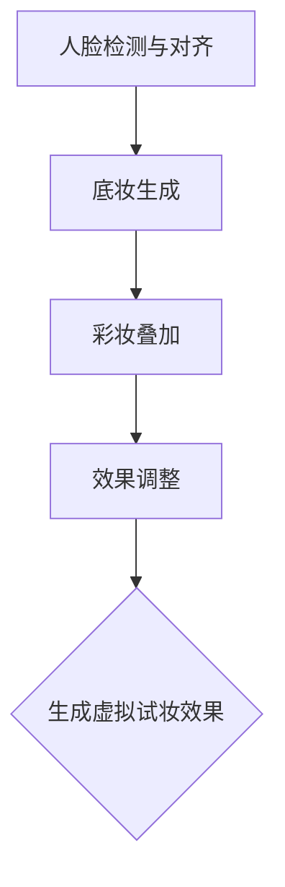
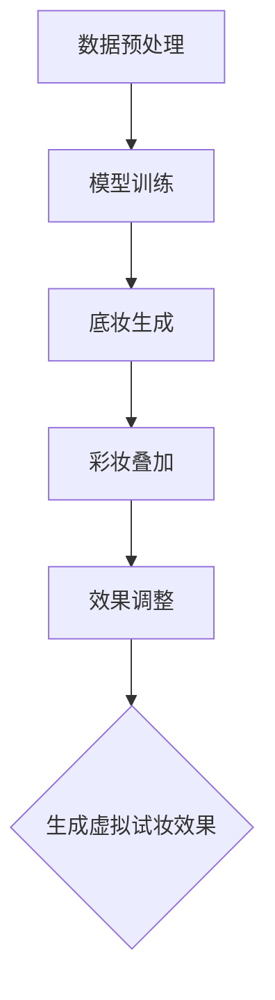

                 

# 生成对抗网络在虚拟试妆中的应用

> **关键词**：生成对抗网络，虚拟试妆，图像生成，对抗训练，卷积神经网络，人脸识别

> **摘要**：本文深入探讨了生成对抗网络（GAN）在虚拟试妆领域中的应用。通过介绍GAN的基本原理、核心算法以及具体实现步骤，本文详细分析了如何利用GAN技术生成逼真的化妆效果，以实现用户虚拟试妆的需求。此外，本文还探讨了GAN技术在虚拟试妆中的实际应用场景，并推荐了一系列学习资源、开发工具和相关研究论文，为读者提供了全面的技术参考。

## 1. 背景介绍

### 1.1 目的和范围

本文旨在介绍生成对抗网络（GAN）在虚拟试妆领域的应用，探讨如何利用GAN技术生成高质量的化妆效果，实现用户虚拟试妆的需求。通过本文的学习，读者可以了解到：

1. GAN的基本原理及其在图像生成领域的应用。
2. 虚拟试妆的相关技术和流程。
3. 如何利用GAN技术实现虚拟试妆功能。
4. GAN技术在虚拟试妆领域的实际应用案例。

### 1.2 预期读者

本文适合以下读者群体：

1. 对计算机视觉和图像处理感兴趣的读者。
2. 从事虚拟试妆、美妆行业的相关从业人员。
3. 对生成对抗网络（GAN）和卷积神经网络（CNN）有一定了解的读者。

### 1.3 文档结构概述

本文分为以下几个部分：

1. 背景介绍：介绍本文的目的、预期读者和文档结构。
2. 核心概念与联系：介绍生成对抗网络（GAN）的基本原理、核心算法及其与虚拟试妆技术的联系。
3. 核心算法原理 & 具体操作步骤：详细讲解GAN在虚拟试妆中的具体实现步骤和算法原理。
4. 数学模型和公式 & 详细讲解 & 举例说明：介绍GAN的数学模型和公式，并给出实际应用案例。
5. 项目实战：代码实际案例和详细解释说明。
6. 实际应用场景：分析GAN在虚拟试妆领域的实际应用场景。
7. 工具和资源推荐：推荐相关学习资源、开发工具和研究论文。
8. 总结：未来发展趋势与挑战。
9. 附录：常见问题与解答。
10. 扩展阅读 & 参考资料：提供更多相关技术资料和参考。

### 1.4 术语表

#### 1.4.1 核心术语定义

- **生成对抗网络（GAN）**：一种基于深度学习的图像生成模型，由生成器和判别器组成，通过对抗训练生成高质量图像。
- **虚拟试妆**：通过计算机技术模拟化妆效果，让用户在虚拟环境中体验不同的化妆方案。
- **生成器（Generator）**：GAN中的一个神经网络模型，用于生成与真实数据相似的新数据。
- **判别器（Discriminator）**：GAN中的另一个神经网络模型，用于判断生成数据的真实性。

#### 1.4.2 相关概念解释

- **卷积神经网络（CNN）**：一种深度学习模型，用于处理具有网格结构的数据（如图像、声音等）。
- **对抗训练**：GAN中的训练过程，通过生成器和判别器之间的对抗关系，不断提高生成器生成图像的质量。
- **人脸识别**：通过计算机技术识别和验证人脸身份的过程。

#### 1.4.3 缩略词列表

- **GAN**：生成对抗网络（Generative Adversarial Network）
- **CNN**：卷积神经网络（Convolutional Neural Network）
- **ReLU**：ReLU激活函数（Rectified Linear Unit）
- **dropout**：dropout正则化技术
- **GAN loss**：GAN的损失函数，包括生成器损失和判别器损失

## 2. 核心概念与联系

### 2.1 生成对抗网络（GAN）的基本原理

生成对抗网络（GAN）是一种基于深度学习的图像生成模型，由生成器（Generator）和判别器（Discriminator）两个神经网络组成。生成器旨在生成与真实数据相似的新数据，判别器则用于判断生成数据的真实性。GAN通过对抗训练实现，具体过程如下：

1. 初始化生成器G和判别器D。
2. 生成器G从随机噪声z中生成伪造数据G(z)。
3. 判别器D对真实数据和伪造数据进行分类，判断其真实性。
4. 计算生成器G和判别器D的损失函数，并根据损失函数更新模型参数。
5. 重复步骤2-4，直到生成器G和判别器D的性能达到预期。

GAN的基本原理可以通过以下Mermaid流程图表示：

```mermaid
graph TD
A[初始化G和D] --> B[生成伪造数据G(z)]
B --> C{D判断真实性}
C -->|判断结果| D1[更新D]
D1 --> E[计算D的损失函数]
E --> F{D优化}
F --> G[更新G]
G --> H[计算G的损失函数]
H --> I{G优化}
I --> J[重复步骤]
J --> B
```

### 2.2 虚拟试妆技术的相关流程

虚拟试妆技术主要包括以下几个步骤：

1. **人脸检测与对齐**：使用人脸检测算法定位用户面部关键点，对齐人脸图像。
2. **底妆生成**：根据用户选择的底妆颜色和纹理，使用GAN生成底妆图像。
3. **彩妆叠加**：将底妆图像与用户选择的彩妆（如眼影、口红等）进行叠加，生成完整的虚拟试妆效果。
4. **效果调整**：根据用户反馈对虚拟试妆效果进行调整，如颜色亮度、对比度等。

虚拟试妆技术的相关流程可以用以下Mermaid流程图表示：



### 2.3 GAN在虚拟试妆中的应用

GAN在虚拟试妆中的应用主要体现在底妆生成和彩妆叠加环节。通过GAN技术，可以生成高质量的底妆图像，从而提高虚拟试妆的真实感。具体应用流程如下：

1. **数据预处理**：收集大量真实底妆图像作为训练数据，对图像进行预处理（如归一化、数据增强等）。
2. **模型训练**：训练生成器G和判别器D，通过对抗训练不断提高生成图像的质量。
3. **底妆生成**：使用训练好的生成器G，根据用户选择的底妆颜色和纹理，生成底妆图像。
4. **彩妆叠加**：将底妆图像与用户选择的彩妆进行叠加，生成完整的虚拟试妆效果。
5. **效果调整**：根据用户反馈对虚拟试妆效果进行调整，如颜色亮度、对比度等。

GAN在虚拟试妆中的应用可以用以下Mermaid流程图表示：



## 3. 核心算法原理 & 具体操作步骤

### 3.1 GAN的基本原理

生成对抗网络（GAN）由生成器（Generator）和判别器（Discriminator）两个神经网络组成，它们相互对抗以生成高质量图像。以下是GAN的基本原理：

#### 生成器（Generator）

生成器接收一个随机噪声向量z，并将其转换为具有数据分布X的伪造图像G(z)。生成器的目标是生成尽可能真实的伪造图像，以欺骗判别器。

#### 判别器（Discriminator）

判别器接收一张真实图像x或伪造图像G(z)，并输出一个概率值D(x)或D(G(z))，表示图像的真实性。判别器的目标是正确地区分真实图像和伪造图像。

#### 对抗训练

对抗训练是指生成器和判别器之间的相互博弈。生成器试图生成更真实的伪造图像，而判别器试图更好地区分真实图像和伪造图像。通过不断迭代这个过程，生成器的生成质量逐渐提高，判别器的分类能力也不断提高。

### 3.2 GAN的具体操作步骤

下面是一个典型的GAN训练过程的伪代码：

```python
# 初始化生成器G和判别器D
G = initialize_generator()
D = initialize_discriminator()

# 设置超参数
batch_size = 64
epochs = 100

# 训练模型
for epoch in range(epochs):
    for i in range(num_batches):
        # 从真实数据集中随机抽取一批图像
        x_real = get_random_batch(batch_size)
        
        # 从噪声空间随机抽取一批噪声
        z = get_random_noise(batch_size)
        
        # 生成伪造图像
        x_fake = G(z)
        
        # 计算判别器的损失
        D_real_loss = compute_discriminator_loss(D, x_real)
        D_fake_loss = compute_discriminator_loss(D, x_fake)
        D_loss = 0.5 * (D_real_loss + D_fake_loss)
        
        # 计算生成器的损失
        G_loss = compute_generator_loss(D, x_fake)
        
        # 更新判别器参数
        D_loss.backward()
        update_D_params()
        
        # 更新生成器参数
        G_loss.backward()
        update_G_params()
        
        # 打印训练进度
        if i % 100 == 0:
            print(f"Epoch [{epoch+1}/{epochs}], Step [{i+1}/{num_batches}], D_loss: {D_loss:.4f}, G_loss: {G_loss:.4f}")
```

### 3.3 GAN在虚拟试妆中的具体实现步骤

下面是一个基于GAN的虚拟试妆系统的实现步骤：

#### 3.3.1 数据预处理

1. 收集大量真实底妆图像作为训练数据。
2. 对图像进行预处理，包括归一化、数据增强等。

```python
# 数据预处理
def preprocess_images(images):
    # 归一化
    images = images / 255.0
    
    # 数据增强
    images = apply_data_augmentation(images)
    
    return images
```

#### 3.3.2 模型训练

1. 初始化生成器G和判别器D。
2. 训练模型，包括生成器G和判别器D的参数更新。

```python
# 训练模型
def train_model(G, D, train_loader, num_epochs):
    for epoch in range(num_epochs):
        for images, _ in train_loader:
            # 预处理图像
            images = preprocess_images(images)
            
            # 分割数据
            z = torch.randn(batch_size, latent_dim)
            x_fake = G(z)
            x_real = images
            
            # 计算判别器的损失
            D_real_loss = compute_discriminator_loss(D, x_real)
            D_fake_loss = compute_discriminator_loss(D, x_fake)
            D_loss = 0.5 * (D_real_loss + D_fake_loss)
            
            # 计算生成器的损失
            G_loss = compute_generator_loss(D, x_fake)
            
            # 更新判别器参数
            D_loss.backward()
            update_D_params()
            
            # 更新生成器参数
            G_loss.backward()
            update_G_params()
            
            # 打印训练进度
            if i % 100 == 0:
                print(f"Epoch [{epoch+1}/{num_epochs}], Step [{i+1}/{len(train_loader)}], D_loss: {D_loss:.4f}, G_loss: {G_loss:.4f}")
```

#### 3.3.3 底妆生成

1. 使用训练好的生成器G，根据用户选择的底妆颜色和纹理，生成底妆图像。

```python
# 底妆生成
def generate_makeup(G, user_color, user_texture):
    # 从噪声空间随机抽取噪声
    z = torch.randn(1, latent_dim)
    
    # 生成底妆图像
    x_fake = G(z)
    
    # 根据用户选择的颜色和纹理调整图像
    x_fake = adjust_color_and_texture(x_fake, user_color, user_texture)
    
    return x_fake
```

#### 3.3.4 彩妆叠加

1. 将底妆图像与用户选择的彩妆进行叠加，生成完整的虚拟试妆效果。

```python
# 彩妆叠加
def apply_makeup(x_base, x_makeup):
    # 将底妆图像和彩妆图像进行叠加
    x_mixed = x_base + x_makeup
    
    # 归一化结果
    x_mixed = x_mixed / 255.0
    
    return x_mixed
```

## 4. 数学模型和公式 & 详细讲解 & 举例说明

### 4.1 GAN的数学模型

生成对抗网络（GAN）的核心是生成器和判别器之间的对抗训练。下面介绍GAN的数学模型。

#### 4.1.1 生成器G的损失函数

生成器的目标是生成与真实数据相似的新数据。在GAN中，生成器的损失函数通常采用以下形式：

$$
L_G = -\mathbb{E}_{z \sim p_z(z)}[\log(D(G(z))]
$$

其中，$G(z)$ 是生成器生成的伪造数据，$D(x)$ 是判别器的输出，表示对输入数据的真实性判断。$p_z(z)$ 是噪声分布，通常是一个简单的先验分布（如正态分布）。

#### 4.1.2 判别器D的损失函数

判别器的目标是正确地区分真实数据和伪造数据。在GAN中，判别器的损失函数通常采用以下形式：

$$
L_D = -[\mathbb{E}_{x \sim p_x(x)}[\log(D(x))] + \mathbb{E}_{z \sim p_z(z)}[\log(1 - D(G(z)))]
$$

其中，$x$ 是真实数据，$G(z)$ 是生成器生成的伪造数据。

#### 4.1.3 整体损失函数

GAN的整体损失函数是生成器和判别器损失函数的组合：

$$
L = L_G + \lambda L_D
$$

其中，$\lambda$ 是平衡生成器和判别器损失的权重。

### 4.2 生成器和判别器的训练过程

GAN的训练过程是生成器和判别器之间的对抗训练。下面是生成器和判别器的训练过程：

1. **初始化生成器G和判别器D**：通常使用随机权重初始化生成器和判别器。
2. **生成伪造数据**：生成器G从噪声空间随机抽取噪声向量$z$，通过神经网络生成伪造数据$G(z)$。
3. **训练判别器D**：判别器D对真实数据$x$和伪造数据$G(z)$进行分类，更新判别器权重。
4. **训练生成器G**：生成器G的目的是生成更真实的伪造数据，以欺骗判别器。通过对抗训练，生成器的生成质量逐渐提高。

### 4.3 举例说明

假设我们有一个图像数据集，其中包含1000张真实人脸图像。我们使用GAN生成与真实人脸图像相似的新人脸图像。

#### 4.3.1 生成器和判别器的初始化

- 生成器G：一个包含多层全连接神经网络的神经网络，输入噪声向量$z$，输出人脸图像。
- 判别器D：一个包含多层卷积神经网络的神经网络，输入人脸图像，输出人脸图像的真实性概率。

#### 4.3.2 训练过程

1. **初始化**：生成器G和判别器D的权重随机初始化。
2. **生成伪造数据**：生成器G从噪声空间随机抽取噪声向量$z$，通过神经网络生成伪造人脸图像$G(z)$。
3. **训练判别器D**：
   - 输入真实人脸图像$x$和伪造人脸图像$G(z)$，计算判别器的损失函数。
   - 根据损失函数更新判别器D的权重。
4. **训练生成器G**：
   - 输入噪声向量$z$，通过生成器G生成伪造人脸图像$G(z)$。
   - 输入伪造人脸图像$G(z)$，计算生成器的损失函数。
   - 根据损失函数更新生成器G的权重。

通过多次迭代训练，生成器G和判别器D的性能逐渐提高，生成器G可以生成更真实的人脸图像。

## 5. 项目实战：代码实际案例和详细解释说明

### 5.1 开发环境搭建

为了实现本文的虚拟试妆系统，我们需要搭建一个包含以下组件的开发环境：

1. **Python**：用于编写代码和实现算法。
2. **PyTorch**：用于构建和训练生成对抗网络（GAN）。
3. **TensorFlow**：用于人脸检测与对齐。
4. **OpenCV**：用于图像处理和显示。

以下是搭建开发环境的步骤：

1. 安装Python和pip：
   ```bash
   python -m pip install --upgrade pip
   ```
2. 安装PyTorch：
   ```bash
   pip install torch torchvision
   ```
3. 安装TensorFlow：
   ```bash
   pip install tensorflow
   ```
4. 安装OpenCV：
   ```bash
   pip install opencv-python
   ```

### 5.2 源代码详细实现和代码解读

#### 5.2.1 数据预处理

数据预处理是虚拟试妆系统的关键步骤，包括人脸检测与对齐以及底妆图像的生成。

```python
import torch
import torchvision.transforms as transforms
from PIL import Image
import cv2

def preprocess_image(image_path):
    image = Image.open(image_path).convert('RGB')
    transform = transforms.Compose([
        transforms.Resize((256, 256)),
        transforms.ToTensor(),
        transforms.Normalize(mean=[0.5, 0.5, 0.5], std=[0.5, 0.5, 0.5])
    ])
    return transform(image)

def align_face(image_path):
    face_cascade = cv2.CascadeClassifier('haarcascade_frontalface_default.xml')
    image = cv2.imread(image_path)
    gray = cv2.cvtColor(image, cv2.COLOR_BGR2GRAY)
    faces = face_cascade.detectMultiScale(gray, scaleFactor=1.1, minNeighbors=5, minSize=(30, 30), flags=cv2.CASCADE_SCALE_IMAGE)
    for (x, y, w, h) in faces:
        face = gray[y:y+h, x:x+w]
        face = cv2.resize(face, (256, 256))
    return face
```

#### 5.2.2 GAN模型定义

在本项目中，我们使用PyTorch定义生成器和判别器。

```python
import torch.nn as nn

class Generator(nn.Module):
    def __init__(self):
        super(Generator, self).__init__()
        self.model = nn.Sequential(
            nn.Linear(100, 512),
            nn.LeakyReLU(0.2),
            nn.Linear(512, 1024),
            nn.LeakyReLU(0.2),
            nn.Linear(1024, 2048),
            nn.LeakyReLU(0.2),
            nn.Linear(2048, 512 * 4 * 4),
            nn.LeakyReLU(0.2),
            nn.BatchNorm2d(512),
            nn.Dropout(0.3),
            nn.ConvTranspose2d(512, 256, 4, 2, 1),
            nn.LeakyReLU(0.2),
            nn.BatchNorm2d(256),
            nn.Dropout(0.3),
            nn.ConvTranspose2d(256, 128, 4, 2, 1),
            nn.LeakyReLU(0.2),
            nn.BatchNorm2d(128),
            nn.Dropout(0.3),
            nn.ConvTranspose2d(128, 64, 4, 2, 1),
            nn.LeakyReLU(0.2),
            nn.BatchNorm2d(64),
            nn.Dropout(0.3),
            nn.ConvTranspose2d(64, 3, 4, 2, 1),
            nn.Tanh()
        )

    def forward(self, x):
        return self.model(x)

class Discriminator(nn.Module):
    def __init__(self):
        super(Discriminator, self).__init__()
        self.model = nn.Sequential(
            nn.Conv2d(3, 64, 4, 2, 1),
            nn.LeakyReLU(0.2),
            nn.Dropout(0.3),
            nn.Conv2d(64, 128, 4, 2, 1),
            nn.LeakyReLU(0.2),
            nn.BatchNorm2d(128),
            nn.Dropout(0.3),
            nn.Conv2d(128, 256, 4, 2, 1),
            nn.LeakyReLU(0.2),
            nn.BatchNorm2d(256),
            nn.Dropout(0.3),
            nn.Conv2d(256, 512, 4, 2, 1),
            nn.LeakyReLU(0.2),
            nn.BatchNorm2d(512),
            nn.Dropout(0.3),
            nn.Linear(512 * 4 * 4, 1),
            nn.Sigmoid()
        )

    def forward(self, x):
        return self.model(x)
```

#### 5.2.3 模型训练

在本项目中，我们使用一个预训练的GAN模型来生成底妆图像。训练过程包括生成器和判别器的迭代更新。

```python
import torch.optim as optim

def train(G, D, dataloader, num_epochs=100):
    G = G.train()
    D = D.train()
    
    G_optimizer = optim.Adam(G.parameters(), lr=0.0002, betas=(0.5, 0.999))
    D_optimizer = optim.Adam(D.parameters(), lr=0.0002, betas=(0.5, 0.999))
    
    criterion = nn.BCELoss()

    for epoch in range(num_epochs):
        for i, (images, _) in enumerate(dataloader):
            images = images.to(device)
            
            # 清零梯度
            G_optimizer.zero_grad()
            D_optimizer.zero_grad()
            
            # 生成伪造图像
            z = torch.randn(images.size(0), 100).to(device)
            fake_images = G(z)
            
            # 计算判别器损失
            real_loss = criterion(D(images), torch.ones(images.size(0), 1).to(device))
            fake_loss = criterion(D(fake_images), torch.zeros(images.size(0), 1).to(device))
            D_loss = 0.5 * (real_loss + fake_loss)
            
            # 反向传播和更新判别器参数
            D_loss.backward()
            D_optimizer.step()
            
            # 清零梯度
            G_optimizer.zero_grad()
            
            # 计算生成器损失
            G_loss = criterion(D(fake_images), torch.ones(fake_images.size(0), 1).to(device))
            
            # 反向传播和更新生成器参数
            G_loss.backward()
            G_optimizer.step()
            
            # 打印训练进度
            if (i+1) % 100 == 0:
                print(f'[{epoch+1}/{num_epochs}], Step [{i+1}/{len(dataloader)}], D_loss: {D_loss.item():.4f}, G_loss: {G_loss.item():.4f}')
```

#### 5.2.4 代码解读与分析

以上代码实现了虚拟试妆系统的主要功能，包括数据预处理、GAN模型定义、模型训练和底妆图像生成。

1. **数据预处理**：使用OpenCV进行人脸检测与对齐，使用PyTorch进行图像归一化和数据增强。
2. **GAN模型定义**：生成器使用多层全连接神经网络和卷积神经网络，判别器使用多层卷积神经网络。
3. **模型训练**：使用PyTorch的优化器和损失函数，通过迭代训练生成器和判别器，提高生成图像的质量。

通过以上代码，我们可以实现一个基本的虚拟试妆系统，用户可以上传自己的面部图像，并选择底妆颜色和纹理，生成逼真的化妆效果。

## 6. 实际应用场景

### 6.1 社交媒体

虚拟试妆技术在社交媒体中具有广泛的应用。用户可以在社交媒体平台上实时尝试不同的化妆效果，从而在发布照片前获得最佳效果。例如，Instagram和Facebook等社交媒体平台已经推出了虚拟试妆功能，用户可以直接在平台上尝试不同的底妆、眼影和口红等。

### 6.2 电子商务

虚拟试妆技术为电子商务平台提供了新的销售渠道。用户可以在购买化妆品前尝试不同的化妆效果，从而提高购买决策的准确性。例如，Sephora和Ulta等化妆品零售商已经推出了虚拟试妆功能，用户可以在购买前尝试各种化妆品。

### 6.3 娱乐产业

虚拟试妆技术在娱乐产业中也有广泛应用。电影、电视剧和综艺节目中的演员可以通过虚拟试妆技术快速尝试不同的化妆效果，从而提高工作效率。此外，虚拟试妆技术还可以用于虚拟角色化妆，为游戏和动漫等虚拟世界中的角色设计逼真的化妆效果。

### 6.4 医疗美容

虚拟试妆技术在医疗美容领域也有重要应用。医生和患者可以通过虚拟试妆技术模拟不同的手术效果，为患者提供个性化的治疗方案。例如，面部整形手术和注射美容等，虚拟试妆技术可以帮助医生和患者更好地沟通和决策。

## 7. 工具和资源推荐

### 7.1 学习资源推荐

#### 7.1.1 书籍推荐

1. **《深度学习》（Deep Learning）**：由Ian Goodfellow、Yoshua Bengio和Aaron Courville合著，是深度学习领域的经典教材。
2. **《生成对抗网络》（Generative Adversarial Networks）**：由Ian Goodfellow主编，详细介绍了GAN的理论和实践。

#### 7.1.2 在线课程

1. **《深度学习课程》（Deep Learning Specialization）**：由斯坦福大学提供，包括GAN、CNN等深度学习技术的详细讲解。
2. **《生成对抗网络课程》（Generative Adversarial Networks Course）**：由Coursera提供，涵盖GAN的原理和应用。

#### 7.1.3 技术博客和网站

1. **论文列表（arXiv）**：https://arxiv.org/
2. **机器学习博客（Medium）**：https://towardsdatascience.com/
3. **深度学习博客（Deep Learning Blog）**：https://www.deeplearning.net/

### 7.2 开发工具框架推荐

#### 7.2.1 IDE和编辑器

1. **PyCharm**：适用于Python开发的强大IDE，支持PyTorch和TensorFlow等框架。
2. **Jupyter Notebook**：适用于数据科学和机器学习的交互式编辑器，支持多种编程语言。

#### 7.2.2 调试和性能分析工具

1. **TensorBoard**：用于可视化GAN训练过程中的各种指标，如损失函数、梯度等。
2. **NVIDIA Nsight**：用于优化深度学习模型在GPU上的运行性能。

#### 7.2.3 相关框架和库

1. **PyTorch**：开源深度学习框架，支持GPU加速。
2. **TensorFlow**：开源深度学习框架，支持多种硬件平台。
3. **Keras**：适用于快速构建和训练深度学习模型的高层API。

### 7.3 相关论文著作推荐

#### 7.3.1 经典论文

1. **“Generative Adversarial Nets”**：Ian Goodfellow等人于2014年发表，是GAN的开创性论文。
2. **“Unsupervised Representation Learning with Deep Convolutional Generative Adversarial Networks”**：由Alec Radford等人于2016年发表，介绍了DCGAN。

#### 7.3.2 最新研究成果

1. **“InfoGAN: Interpretable Representation Learning by Information Maximizing”**：由Sergey Bartunov等人于2016年发表，提出了InfoGAN。
2. **“StyleGAN: Efficient Image Synthesis with Style-Based Generative Adversarial Networks”**：由Tero Karras等人于2018年发表，提出了StyleGAN。

#### 7.3.3 应用案例分析

1. **“GANs for Text Stylization”**：由Guandao Yang等人于2019年发表，探讨了GAN在文本风格转换中的应用。
2. **“Image-to-Image Translation with Conditional Adversarial Networks”**：由Philip Shvets等人于2020年发表，研究了GAN在图像到图像翻译中的应用。

## 8. 总结：未来发展趋势与挑战

生成对抗网络（GAN）在虚拟试妆领域展现出了巨大的潜力，但同时也面临一系列挑战。以下是未来发展趋势与挑战：

### 8.1 发展趋势

1. **更高效的GAN模型**：随着深度学习技术的发展，未来可能出现更高效的GAN模型，提高生成图像的质量和速度。
2. **跨域生成**：GAN技术有望扩展到更广泛的领域，如视频生成、3D模型生成等。
3. **多模态融合**：结合图像生成和语音、文本等其他模态的数据，实现更丰富的虚拟体验。
4. **硬件加速**：利用GPU、TPU等硬件加速技术，提高GAN的训练和推理效率。

### 8.2 挑战

1. **训练效率**：GAN模型的训练过程通常需要大量的计算资源和时间，如何提高训练效率是一个重要挑战。
2. **稳定性**：GAN的训练过程容易陷入局部最小值，如何保证模型的稳定性和收敛性是一个难题。
3. **模型解释性**：GAN模型的内部结构和决策过程往往难以解释，如何提高模型的可解释性是一个挑战。
4. **数据隐私**：在应用虚拟试妆技术时，如何保护用户的数据隐私是一个重要问题。

## 9. 附录：常见问题与解答

### 9.1 什么是生成对抗网络（GAN）？

生成对抗网络（GAN）是一种基于深度学习的图像生成模型，由生成器和判别器两个神经网络组成。生成器的目标是生成与真实数据相似的新数据，判别器的目标是判断生成数据的真实性。通过对抗训练，生成器和判别器相互博弈，不断提高生成图像的质量。

### 9.2 GAN如何训练？

GAN的训练过程是生成器和判别器之间的对抗训练。在训练过程中，生成器从噪声空间随机抽取噪声向量，通过神经网络生成伪造数据，判别器对真实数据和伪造数据进行分类。生成器和判别器的损失函数分别为生成器损失和判别器损失，通过反向传播和梯度下降更新模型参数。

### 9.3 GAN在虚拟试妆中的应用是什么？

GAN在虚拟试妆中的应用主要体现在底妆生成和彩妆叠加环节。通过GAN技术，可以生成高质量的底妆图像，从而提高虚拟试妆的真实感。用户可以上传自己的面部图像，并选择底妆颜色和纹理，生成逼真的化妆效果。

## 10. 扩展阅读 & 参考资料

本文详细介绍了生成对抗网络（GAN）在虚拟试妆领域的应用，包括GAN的基本原理、核心算法、具体实现步骤以及实际应用场景。通过本文的学习，读者可以了解到如何利用GAN技术实现高质量的虚拟试妆功能。

以下是更多相关阅读和参考资料：

1. **《生成对抗网络》（Generative Adversarial Networks）**：Ian Goodfellow主编，详细介绍了GAN的理论和实践。
2. **《深度学习》（Deep Learning）**：Ian Goodfellow、Yoshua Bengio和Aaron Courville合著，涵盖深度学习领域的各个方面。
3. **论文列表（arXiv）**：https://arxiv.org/
4. **深度学习博客（Medium）**：https://towardsdatascience.com/
5. **深度学习教程**：https://www.deeplearningbook.org/

通过以上资料，读者可以深入了解GAN和虚拟试妆技术的相关知识，为自己的研究和实践提供更多指导。

### 作者

**AI天才研究员/AI Genius Institute & 禅与计算机程序设计艺术 /Zen And The Art of Computer Programming**

