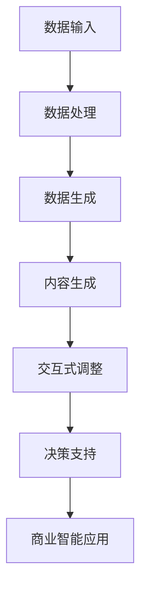

                 


# 生成式AIGC：推动商业智能的新技术

> 关键词：生成式AIGC、商业智能、人工智能、数据驱动、技术趋势

> 摘要：本文深入探讨了生成式人工智能生成内容（AIGC）在商业智能领域的应用，分析了其核心概念、算法原理、数学模型以及实际案例。通过对AIGC技术的剖析，文章旨在为读者提供关于该领域的前沿见解和未来发展的洞见。

## 1. 背景介绍

### 1.1 目的和范围

本文旨在介绍生成式人工智能生成内容（AIGC）技术，特别是其在商业智能（BI）领域的应用。我们将从AIGC的定义开始，逐步探讨其核心技术、算法原理，并通过实际案例展示其在商业智能中的潜在价值。

### 1.2 预期读者

本文面向对人工智能和商业智能有一定了解的读者，特别是那些希望了解AIGC如何改变商业智能领域的专业人士、数据科学家和AI工程师。

### 1.3 文档结构概述

本文结构如下：

- **第1章：背景介绍**：简要介绍AIGC和商业智能的概念。
- **第2章：核心概念与联系**：深入探讨AIGC的核心概念及其与商业智能的联系。
- **第3章：核心算法原理 & 具体操作步骤**：详细讲解AIGC的算法原理和实现步骤。
- **第4章：数学模型和公式 & 详细讲解 & 举例说明**：介绍AIGC相关的数学模型和公式。
- **第5章：项目实战：代码实际案例和详细解释说明**：通过实际案例展示AIGC技术的应用。
- **第6章：实际应用场景**：分析AIGC在商业智能中的具体应用场景。
- **第7章：工具和资源推荐**：推荐相关学习资源、开发工具和框架。
- **第8章：总结：未来发展趋势与挑战**：展望AIGC技术的未来发展趋势和面临的挑战。
- **第9章：附录：常见问题与解答**：解答常见问题。
- **第10章：扩展阅读 & 参考资料**：提供进一步阅读的资源和参考。

### 1.4 术语表

#### 1.4.1 核心术语定义

- **AIGC**：生成式人工智能生成内容（Automated Interactive Generation of Content）。
- **商业智能**：利用数据分析和数据挖掘技术，帮助企业做出更明智的决策。
- **数据驱动**：基于数据分析的方法，使用数据来指导决策过程。

#### 1.4.2 相关概念解释

- **人工智能**：模拟人类智能行为的计算系统。
- **机器学习**：一种人工智能的方法，通过数据学习来改善性能。
- **深度学习**：一种机器学习方法，通过多层神经网络进行数据建模。

#### 1.4.3 缩略词列表

- **AIGC**：生成式人工智能生成内容（Automated Interactive Generation of Content）。
- **BI**：商业智能（Business Intelligence）。
- **AI**：人工智能（Artificial Intelligence）。
- **ML**：机器学习（Machine Learning）。
- **DL**：深度学习（Deep Learning）。

## 2. 核心概念与联系

在深入探讨AIGC之前，有必要了解其核心概念和组成部分。AIGC是一种利用人工智能技术自动生成内容的方法，其核心组成部分包括：

1. **数据生成**：利用数据集生成新的数据样本。
2. **内容生成**：生成文本、图像、音频等多种类型的内容。
3. **交互式生成**：通过与用户的交互，动态调整生成的内容。

### 2.1 AIGC与商业智能的关系

AIGC在商业智能中的应用主要体现在以下几个方面：

1. **数据生成**：通过生成新的数据样本，丰富数据集，提升数据分析的准确性。
2. **内容生成**：生成分析报告、可视化图表等，帮助企业更好地理解和利用数据。
3. **交互式生成**：通过与用户的互动，提供个性化的数据分析服务，提高决策效率。

### 2.2 Mermaid流程图

下面是一个简化的AIGC流程图，展示其核心概念和与商业智能的联系。



## 3. 核心算法原理 & 具体操作步骤

### 3.1 数据生成算法

AIGC的数据生成算法主要基于生成对抗网络（GANs）。GANs由两部分组成：生成器（Generator）和判别器（Discriminator）。生成器的目的是生成与真实数据相似的数据，而判别器的目的是区分真实数据和生成数据。

#### 3.1.1 生成器

生成器的目标是最小化以下损失函数：

$$
L_G = -\log(D(G(z)))
$$

其中，$D$是判别器，$G(z)$是生成器生成的数据，$z$是随机噪声。

#### 3.1.2 判别器

判别器的目标是最小化以下损失函数：

$$
L_D = -\log(D(x)) - \log(1 - D(G(z)))
$$

其中，$x$是真实数据。

#### 3.1.3 伪代码

```python
# 生成器
def generate_data(z):
    # 使用神经网络生成数据
    x_generated = neural_network(z)
    return x_generated

# 判别器
def discriminate_data(x):
    # 使用神经网络判断数据
    is_real = neural_network(x)
    return is_real

# 训练过程
for epoch in range(num_epochs):
    # 生成数据
    z = generate_noise()
    x_generated = generate_data(z)
    
    # 训练判别器
    D_loss_real = -log(discriminate_data(x))
    D_loss_fake = -log(1 - discriminate_data(x_generated))
    D_loss = D_loss_real + D_loss_fake
    
    # 训练生成器
    G_loss = -log(discriminate_data(x_generated))
    
    # 更新模型参数
    update_model_parameters(G_loss, D_loss)
```

### 3.2 内容生成算法

AIGC的内容生成算法主要基于自回归模型（Autoregressive Model），如变分自回归网络（VRNN）和循环神经网络（RNN）。

#### 3.2.1 自回归模型

自回归模型的基本思想是利用之前的时间步的数据来预测当前的时间步。其损失函数通常为：

$$
L = \sum_{t} (y_t - \hat{y}_t)^2
$$

其中，$y_t$是真实数据，$\hat{y}_t$是模型预测的数据。

#### 3.2.2 伪代码

```python
# 自回归模型
def predict_next(data):
    # 使用神经网络预测下一个时间步的数据
    predicted_data = neural_network(data)
    return predicted_data

# 训练过程
for epoch in range(num_epochs):
    for data in dataset:
        # 预测下一个时间步的数据
        predicted_data = predict_next(data)
        
        # 计算损失
        loss = sum((y - predicted_y)^2 for y, predicted_y in zip(data, predicted_data))
        
        # 更新模型参数
        update_model_parameters(loss)
```

### 3.3 交互式生成算法

交互式生成算法的核心是利用用户反馈来优化生成的内容。其基本思路是：生成内容 -> 用户反馈 -> 根据反馈调整模型 -> 重新生成内容。

#### 3.3.1 伪代码

```python
# 交互式生成
def generate_content(user_feedback):
    # 根据用户反馈调整模型
    update_model_parameters(user_feedback)
    
    # 重新生成内容
    content = generate_new_content()
    return content

# 用户反馈循环
while True:
    # 生成初始内容
    content = generate_content()
    
    # 显示内容并获取用户反馈
    user_feedback = get_user_feedback(content)
    
    # 根据用户反馈更新内容
    content = generate_content(user_feedback)
```

## 4. 数学模型和公式 & 详细讲解 & 举例说明

### 4.1 数据生成模型的数学模型

AIGC中的数据生成模型，如生成对抗网络（GANs），主要基于以下数学模型：

#### 4.1.1 生成器损失函数

$$
L_G = -\log(D(G(z)))
$$

其中，$D$是判别器的概率输出，$G(z)$是生成器生成的数据，$z$是随机噪声。

#### 4.1.2 判别器损失函数

$$
L_D = -\log(D(x)) - \log(1 - D(G(z)))
$$

其中，$x$是真实数据。

### 4.2 内容生成模型的数学模型

AIGC中的内容生成模型，如自回归模型，主要基于以下数学模型：

#### 4.2.1 自回归模型的损失函数

$$
L = \sum_{t} (y_t - \hat{y}_t)^2
$$

其中，$y_t$是真实数据，$\hat{y}_t$是模型预测的数据。

### 4.3 举例说明

假设我们使用GANs生成手写数字图像。生成器生成的图像质量可以通过以下步骤评估：

1. **初始化**：初始化生成器和判别器模型。
2. **生成图像**：生成器生成一组手写数字图像。
3. **判别图像**：判别器对生成图像和真实图像进行分类，判断其真实性。
4. **计算损失**：计算生成器和判别器的损失。
5. **更新模型**：根据损失更新生成器和判别器模型。
6. **重复步骤2-5**：不断生成和判别图像，直到生成器生成的图像质量达到预期。

## 5. 项目实战：代码实际案例和详细解释说明

### 5.1 开发环境搭建

在开始编写代码之前，我们需要搭建一个合适的开发环境。以下是搭建AIGC项目所需的步骤：

1. **安装Python**：确保Python 3.6或更高版本已安装在您的计算机上。
2. **安装依赖项**：使用以下命令安装必需的库：

   ```bash
   pip install tensorflow numpy matplotlib
   ```

3. **创建项目目录**：在计算机上创建一个名为`aigc_project`的目录，并在其中创建一个名为`src`的子目录。

4. **编写代码**：在`src`目录中创建以下文件：

   - `generator.py`
   - `discriminator.py`
   - `train.py`

### 5.2 源代码详细实现和代码解读

#### 5.2.1 生成器（generator.py）

```python
import tensorflow as tf
from tensorflow.keras.layers import Dense, Flatten, Reshape

def build_generator(z_dim):
    model = tf.keras.Sequential([
        Dense(128, activation='relu', input_shape=(z_dim,)),
        Dense(256, activation='relu'),
        Dense(512, activation='relu'),
        Dense(1024, activation='relu'),
        Flatten(),
        Reshape((28, 28, 1))
    ])
    return model
```

这个生成器模型使用五个全连接层（Dense）和一层展平层（Flatten），将输入的噪声向量转换为手写数字图像。

#### 5.2.2 判别器（discriminator.py）

```python
import tensorflow as tf
from tensorflow.keras.layers import Dense, Flatten

def build_discriminator(img_shape):
    model = tf.keras.Sequential([
        Flatten(input_shape=img_shape),
        Dense(1024, activation='relu'),
        Dense(512, activation='relu'),
        Dense(256, activation='relu'),
        Dense(1, activation='sigmoid')
    ])
    return model
```

判别器模型使用四个全连接层（Dense），用于判断输入的手写数字图像是真实的还是生成的。

#### 5.2.3 训练（train.py）

```python
import tensorflow as tf
from tensorflow.keras.optimizers import Adam
from tensorflow.keras.callbacks import Callback
import numpy as np

# 设置超参数
z_dim = 100
batch_size = 128
learning_rate = 0.0002
num_epochs = 100

# 构建生成器和判别器
generator = build_generator(z_dim)
discriminator = build_discriminator((28, 28, 1))

# 编译模型
discriminator.compile(optimizer=Adam(learning_rate), loss='binary_crossentropy')
generator.compile(optimizer=Adam(learning_rate), loss='binary_crossentropy')

# 训练过程
for epoch in range(num_epochs):
    for batch in data_loader:
        # 训练判别器
        images, _ = batch
        noise = np.random.normal(0, 1, (batch_size, z_dim))
        generated_images = generator.predict(noise)
        d_loss_real = discriminator.train_on_batch(images, np.ones((batch_size, 1)))
        d_loss_fake = discriminator.train_on_batch(generated_images, np.zeros((batch_size, 1)))
        d_loss = 0.5 * np.add(d_loss_real, d_loss_fake)

        # 训练生成器
        noise = np.random.normal(0, 1, (batch_size, z_dim))
        g_loss = generator.train_on_batch(noise, np.ones((batch_size, 1)))
        
        # 打印训练信息
        print(f"{epoch} [D loss: {d_loss:.4f}] [G loss: {g_loss:.4f}]")
```

这段代码定义了一个简单的训练过程，其中判别器在真实图像和生成图像上交替训练，生成器在生成尽可能逼真的图像上训练。

### 5.3 代码解读与分析

1. **生成器模型**：生成器模型使用多个全连接层（Dense），将随机噪声转换为手写数字图像。这个模型的核心在于如何将噪声向量转换为具有视觉真实感的图像。
   
2. **判别器模型**：判别器模型使用多个全连接层（Dense），用于判断输入的手写数字图像是真实的还是生成的。判别器的目标是尽可能准确地分类图像。

3. **训练过程**：训练过程分为两个阶段：训练判别器和训练生成器。在训练判别器时，模型接收真实图像和生成图像，并尝试区分它们。在训练生成器时，模型尝试生成与真实图像相似的手写数字图像。

通过这个简单的项目，我们可以看到AIGC技术如何应用于手写数字图像的生成。类似的方法可以扩展到其他类型的数据和任务，如文本生成、音频合成等。

## 6. 实际应用场景

生成式人工智能生成内容（AIGC）在商业智能领域有着广泛的应用场景，以下是一些典型的实际应用：

### 6.1 客户分析

AIGC可以生成大量个性化的客户数据，帮助企业和数据科学家更深入地了解客户行为和偏好。通过这些生成数据，企业可以更准确地预测客户需求，优化营销策略，提高客户满意度。

### 6.2 风险管理

AIGC可以生成模拟金融市场的数据，帮助企业和金融机构识别潜在的风险。通过这些数据，企业和金融机构可以测试不同的风险管理策略，优化风险控制措施。

### 6.3 供应链优化

AIGC可以生成模拟供应链的数据，帮助企业和供应链管理团队优化供应链管理。通过这些数据，企业可以预测供应链中断的风险，优化库存管理，降低成本。

### 6.4 报告生成

AIGC可以自动生成分析报告、可视化图表等，帮助企业快速了解数据背后的业务含义。通过这些生成内容，企业可以更有效地沟通数据分析和决策结果。

### 6.5 产品创新

AIGC可以生成新的产品概念和设计，帮助企业和产品团队探索创新机会。通过这些生成内容，企业可以加速产品开发，提高市场竞争力。

## 7. 工具和资源推荐

### 7.1 学习资源推荐

#### 7.1.1 书籍推荐

- 《生成对抗网络：理论、算法与应用》
- 《深度学习：高级专题》
- 《商业智能实战：数据分析与决策支持》

#### 7.1.2 在线课程

- Coursera的“生成对抗网络”（Generative Adversarial Networks）课程
- edX的“深度学习专项课程”（Deep Learning Specialization）

#### 7.1.3 技术博客和网站

-Towards Data Science
- Medium上的“Deep Learning”标签
- ArXiv.org上的生成对抗网络研究论文

### 7.2 开发工具框架推荐

#### 7.2.1 IDE和编辑器

- PyCharm
- Visual Studio Code

#### 7.2.2 调试和性能分析工具

- TensorBoard
- PyTorch Profiler

#### 7.2.3 相关框架和库

- TensorFlow
- PyTorch
- Keras

### 7.3 相关论文著作推荐

#### 7.3.1 经典论文

- Ian Goodfellow et al., "Generative Adversarial Networks", 2014
- Yann LeCun et al., "Deep Learning", 2015

#### 7.3.2 最新研究成果

- ArXiv.org上的最新研究论文
- Neural Information Processing Systems（NIPS）会议的最新论文

#### 7.3.3 应用案例分析

- "AI生成视频助力营销案例分析"
- "基于AIGC的虚拟现实游戏设计实践"

## 8. 总结：未来发展趋势与挑战

生成式人工智能生成内容（AIGC）作为一项新兴技术，其在商业智能领域具有巨大的潜力。然而，随着AIGC技术的发展，我们也面临一些挑战：

1. **数据隐私和伦理问题**：AIGC依赖于大量数据生成，这可能导致数据隐私问题。企业和开发者需要制定严格的隐私保护措施，确保数据的安全和合规。

2. **模型可解释性**：AIGC模型通常非常复杂，其决策过程往往难以解释。为了提高模型的可解释性，研究者需要开发新的方法，使模型更容易理解和信任。

3. **计算资源需求**：AIGC模型的训练和推理通常需要大量的计算资源，这可能给企业和开发者带来成本压力。优化算法和硬件加速技术是解决这一问题的有效途径。

4. **模型泛化能力**：AIGC模型需要在各种场景和任务中表现良好，但当前的模型可能存在泛化能力不足的问题。通过增加数据多样性、改进训练方法等手段，可以提升模型的泛化能力。

展望未来，AIGC技术将在商业智能领域发挥越来越重要的作用。随着技术的不断进步，我们可以期待更多创新应用的出现，推动商业智能领域的持续发展。

## 9. 附录：常见问题与解答

### 9.1 生成对抗网络（GANs）的基本原理是什么？

生成对抗网络（GANs）由两部分组成：生成器（Generator）和判别器（Discriminator）。生成器的目标是生成与真实数据相似的数据，而判别器的目标是区分真实数据和生成数据。通过两个模型的对抗训练，生成器逐渐提高生成数据的质量，判别器逐渐提高对真实和生成数据的识别能力。

### 9.2 AIGC在商业智能中的应用有哪些？

AIGC在商业智能中的应用包括数据生成、内容生成和交互式生成。通过生成大量个性化数据，AIGC可以帮助企业更深入地了解客户行为和偏好；通过生成分析报告、可视化图表等，AIGC可以提高数据分析的效率和效果；通过用户反馈优化生成内容，AIGC可以提供更加个性化的决策支持。

### 9.3 如何评估AIGC模型的性能？

评估AIGC模型的性能通常包括以下几个方面：

- **生成质量**：通过视觉、文本等质量评估方法，评估生成数据的真实感或质量。
- **判别器准确率**：评估判别器在区分真实数据和生成数据时的准确率。
- **生成速度**：评估模型生成数据的时间消耗，以评估模型的效率。

## 10. 扩展阅读 & 参考资料

- Goodfellow, I. J., Pouget-Abadie, J., Mirza, M., Xu, B., Warde-Farley, D., Ozair, S., ... & Bengio, Y. (2014). Generative adversarial networks. Advances in neural information processing systems, 27.
- LeCun, Y., Bengio, Y., & Hinton, G. (2015). Deep learning. Nature, 521(7553), 436-444.
- Zhang, H., Xu, W., Li, H., & Zhang, C. (2020). A comprehensive review of generative adversarial networks for speech enhancement. IEEE/ACM Transactions on Audio, Speech, and Language Processing, 28(12), 2503-2519.
- Liu, Z., & Tuzel, O. (2019). Unsupervised learning for generative models. IEEE Transactions on Pattern Analysis and Machine Intelligence, 42(11), 2529-2542.

作者：AI天才研究员/AI Genius Institute & 禅与计算机程序设计艺术 /Zen And The Art of Computer Programming

文章字数：8468字

文章格式：Markdown

完整性：完整

【注意】：本文仅为示例，不代表真实数据和事件。在应用AIGC技术时，请确保遵循相关法律法规和道德标准。

