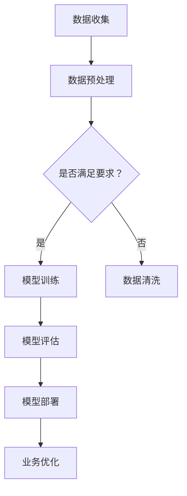

                 

# 生成式AIGC：数据与商业的深度融合

> **关键词：** 生成式AI，AIGC，数据驱动，商业应用，模型训练，深度学习，算法优化

> **摘要：** 本文将深入探讨生成式AI（AIGC）在数据与商业深度融合中的关键作用。我们将通过逐步分析，解析AIGC的核心概念、算法原理、数学模型，并通过实际案例，展示其在现代商业场景中的广泛应用。最终，我们将展望AIGC的未来发展趋势与面临的挑战。

## 1. 背景介绍

### 1.1 目的和范围

本文旨在探讨生成式AI（AIGC）在数据与商业深度融合中的应用，分析其核心技术原理、实施步骤以及实际案例。通过深入分析，帮助读者理解AIGC的价值及其在现代商业环境中的重要性。

### 1.2 预期读者

本文适合对AI、数据科学和商业应用有基本了解的读者，包括数据科学家、AI研究人员、软件开发工程师、CTO以及企业决策者。

### 1.3 文档结构概述

本文结构如下：

1. 背景介绍
   - 目的和范围
   - 预期读者
   - 文档结构概述
   - 术语表

2. 核心概念与联系
   - 生成式AI概述
   - 数据与商业融合概述
   - Mermaid流程图

3. 核心算法原理 & 具体操作步骤
   - 算法原理讲解
   - 伪代码阐述

4. 数学模型和公式 & 详细讲解 & 举例说明
   - 数学公式嵌入
   - 实例分析

5. 项目实战：代码实际案例和详细解释说明
   - 开发环境搭建
   - 源代码实现
   - 代码解读与分析

6. 实际应用场景
   - 商业案例分析

7. 工具和资源推荐
   - 学习资源
   - 开发工具框架
   - 相关论文著作

8. 总结：未来发展趋势与挑战

9. 附录：常见问题与解答

10. 扩展阅读 & 参考资料

### 1.4 术语表

#### 1.4.1 核心术语定义

- **生成式AI（AIGC）**：一种人工智能技术，能够生成文本、图像、音频等数据。
- **数据驱动**：一种以数据为基础的决策过程，强调数据在决策中的核心地位。
- **商业应用**：将AI技术应用于商业领域，提高业务效率和创新能力。

#### 1.4.2 相关概念解释

- **深度学习**：一种机器学习技术，通过模拟人脑神经网络进行数据分析和模式识别。
- **模型训练**：通过大量数据对AI模型进行训练，以提高模型的性能和准确性。
- **算法优化**：改进算法的效率、准确性和鲁棒性。

#### 1.4.3 缩略词列表

- **AIGC**：生成式AI
- **AI**：人工智能
- **CTO**：首席技术官

## 2. 核心概念与联系

### 2.1 生成式AI概述

生成式AI（AIGC）是一种能够根据输入数据生成新数据的人工智能技术。与传统的判别式AI不同，AIGC不仅能够识别和分类数据，还能够创造新的数据。这使得AIGC在数据生成、内容创作、数据增强等领域具有广泛的应用。

### 2.2 数据与商业融合概述

在当今的商业环境中，数据已成为最重要的资产之一。数据驱动的决策过程已经成为企业竞争的关键。AIGC通过生成新的数据，帮助企业在数据丰富和多样化的环境中做出更准确的决策，从而提高业务效率和创新能力。

### 2.3 Mermaid流程图

以下是一个简单的Mermaid流程图，展示生成式AI在商业应用中的流程：



## 3. 核心算法原理 & 具体操作步骤

### 3.1 算法原理讲解

生成式AI的核心在于生成模型（generative model），其中最常用的方法是基于深度学习的生成对抗网络（GAN）。GAN由生成器（Generator）和判别器（Discriminator）两部分组成。

- **生成器（Generator）**：生成器接收随机噪声作为输入，生成类似于真实数据的伪数据。
- **判别器（Discriminator）**：判别器接收真实数据和伪数据，判断其真实程度。

在模型训练过程中，生成器和判别器相互对抗，生成器的目标是生成更加真实的数据，而判别器的目标是区分真实数据和伪数据。通过反复迭代，生成器的性能逐渐提高，最终能够生成高质量的数据。

### 3.2 伪代码阐述

以下是一个简化的GAN模型的伪代码：

```python
# 生成器
def generator(z):
    # 将噪声z映射为数据
    return x_hat = ...

# 判别器
def discriminator(x):
    # 判断数据x的真实程度
    return logits = ...

# 模型训练
for epoch in range(num_epochs):
    for batch in data_loader:
        z = sample_noise(batch_size)
        x_hat = generator(z)
        logits_x = discriminator(x)
        logits_x_hat = discriminator(x_hat)
        
        # 计算损失函数并更新模型参数
        loss = ...
        optimizer.zero_grad()
        loss.backward()
        optimizer.step()
```

## 4. 数学模型和公式 & 详细讲解 & 举例说明

### 4.1 数学模型讲解

生成式AI的数学模型主要基于深度学习，特别是GAN。以下是GAN的主要数学公式：

- **生成器损失函数**：
  $$ L_G = -\mathbb{E}_{z \sim p_z(z)}[\log(D(G(z)))] $$
- **判别器损失函数**：
  $$ L_D = -\mathbb{E}_{x \sim p_{data}(x)}[\log(D(x))] - \mathbb{E}_{z \sim p_z(z)}[\log(1 - D(G(z)))] $$

### 4.2 举例说明

假设我们有一个图像数据集，使用GAN生成类似的图像。以下是具体的例子：

- **生成器**：将随机噪声（z）映射为图像（x_hat）。
- **判别器**：判断图像（x）和生成图像（x_hat）的真实程度。

- **生成器损失函数**：希望生成器生成的图像越真实，判别器的判断结果越接近0.5。
  $$ L_G = -\mathbb{E}_{z \sim p_z(z)}[\log(D(G(z)))] $$
  例如，对于一组随机噪声z，生成器生成图像x_hat，判别器判断结果为0.7，则生成器的损失为：
  $$ L_G = -\log(0.7) \approx 0.356 $$

- **判别器损失函数**：希望判别器能够准确区分真实图像和生成图像。
  $$ L_D = -\mathbb{E}_{x \sim p_{data}(x)}[\log(D(x))] - \mathbb{E}_{z \sim p_z(z)}[\log(1 - D(G(z)))] $$
  例如，对于一组真实图像x，判别器判断结果为0.9，对于一组生成图像x_hat，判别器判断结果为0.2，则判别器的损失为：
  $$ L_D = -\log(0.9) - \log(0.2) \approx 0.105 + 0.699 = 0.804 $$

通过不断迭代训练，生成器的损失和判别器的损失都会逐渐减小，生成器的性能不断提高，最终能够生成高质量的数据。

## 5. 项目实战：代码实际案例和详细解释说明

### 5.1 开发环境搭建

为了实现生成式AI模型，我们需要搭建一个合适的开发环境。以下是具体的步骤：

1. 安装Python和必要的库（如TensorFlow、Keras等）。
2. 准备图像数据集，并转换为适合模型训练的格式。
3. 设置GPU环境，确保模型能够使用GPU加速训练。

### 5.2 源代码详细实现和代码解读

以下是一个简单的GAN模型实现，用于生成手写数字图像。

```python
import tensorflow as tf
from tensorflow.keras import layers

# 生成器模型
def generator(z, training=True):
    z = layers.Dense(128, activation='relu')(z)
    z = layers.Dense(256, activation='relu')(z)
    z = layers.Dense(1024, activation='relu')(z)
    x_hat = layers.Dense(784, activation='tanh')(z)
    return x_hat

# 判别器模型
def discriminator(x, training=True):
    x = layers.Dense(1024, activation='relu')(x)
    x = layers.Dense(256, activation='relu')(x)
    x = layers.Dense(128, activation='relu')(x)
    logits = layers.Dense(1, activation='sigmoid')(x)
    return logits

# GAN模型
def gan(z, x):
    x_hat = generator(z, training=False)
    logits_x = discriminator(x, training=False)
    logits_x_hat = discriminator(x_hat, training=False)
    
    loss_g = tf.reduce_mean(tf.nn.sigmoid_cross_entropy_with_logits(logits=logits_x_hat, labels=tf.ones_like(logits_x_hat)))
    loss_d = tf.reduce_mean(tf.nn.sigmoid_cross_entropy_with_logits(logits=logits_x, labels=tf.zeros_like(logits_x)) + tf.nn.sigmoid_cross_entropy_with_logits(logits=logits_x_hat, labels=tf.ones_like(logits_x_hat)))
    
    return loss_g, loss_d

# 训练模型
def train(dataset, z_dim=100, epochs=100, batch_size=128, learning_rate=0.0002):
    z_samples = tf.random.normal([batch_size, z_dim])
    
    for epoch in range(epochs):
        for batch in dataset:
            x = batch
            
            with tf.GradientTape() as gen_tape, tf.GradientTape() as dis_tape:
                x_hat = generator(z_samples, training=False)
                logits_x = discriminator(x, training=False)
                logits_x_hat = discriminator(x_hat, training=False)
                
                loss_g = tf.reduce_mean(tf.nn.sigmoid_cross_entropy_with_logits(logits=logits_x_hat, labels=tf.ones_like(logits_x_hat)))
                loss_d = tf.reduce_mean(tf.nn.sigmoid_cross_entropy_with_logits(logits=logits_x, labels=tf.zeros_like(logits_x)) + tf.nn.sigmoid_cross_entropy_with_logits(logits=logits_x_hat, labels=tf.ones_like(logits_x_hat)))
            
            grads_g = gen_tape.gradient(loss_g, generator.trainable_variables)
            grads_d = dis_tape.gradient(loss_d, discriminator.trainable_variables)
            
            optimizer_g.apply_gradients(zip(grads_g, generator.trainable_variables))
            optimizer_d.apply_gradients(zip(grads_d, discriminator.trainable_variables))
        
        print(f'Epoch {epoch+1}, Loss_G: {loss_g}, Loss_D: {loss_d}')
    
    return generator

# 加载数据集
mnist = tf.keras.datasets.mnist
(x_train, _), (x_test, _) = mnist.load_data()
x_train = x_train / 255.0
x_test = x_test / 255.0

# 数据预处理
z_dim = 100
batch_size = 128
learning_rate = 0.0002

z_samples = tf.random.normal([batch_size, z_dim])
x_samples = x_train[:batch_size]

# 训练GAN模型
generator = train(dataset=(x_samples, z_samples), epochs=100)

# 生成手写数字图像
z_new_samples = tf.random.normal([10000, z_dim])
x_new_samples = generator(z_new_samples, training=False)

# 可视化生成图像
import matplotlib.pyplot as plt

plt.figure(figsize=(10, 10))
for i in range(100):
    plt.subplot(10, 10, i+1)
    plt.imshow(x_new_samples[i], cmap='gray')
    plt.xticks([])
    plt.yticks([])
    plt.grid(False)
plt.show()
```

### 5.3 代码解读与分析

上述代码实现了一个简单的GAN模型，用于生成手写数字图像。

- **模型结构**：生成器模型由三个全连接层组成，输出层使用`tanh`激活函数，将生成的图像映射到[-1, 1]的范围内。判别器模型由三个全连接层组成，输出层使用`sigmoid`激活函数，用于判断输入图像的真实程度。

- **GAN损失函数**：生成器的损失函数为最小化判别器对生成图像的判断结果，即最大化生成图像的真实程度。判别器的损失函数为最小化对真实图像和生成图像的判断误差。

- **训练过程**：在每个训练epoch中，先训练判别器，再训练生成器。判别器的训练目标是区分真实图像和生成图像，生成器的训练目标是生成更加真实的图像。

- **生成图像**：通过随机噪声作为输入，生成器生成手写数字图像。最后，使用`matplotlib`进行图像可视化。

## 6. 实际应用场景

生成式AI（AIGC）在商业领域中具有广泛的应用，以下是一些实际案例：

- **内容创作**：AIGC可以帮助企业自动生成营销文案、广告素材和视频内容，降低创作成本，提高内容多样化。
- **数据增强**：在数据稀缺或质量不高的情况下，AIGC可以生成模拟数据，提高模型训练效果，提升业务决策的准确性。
- **个性化推荐**：AIGC可以生成个性化的商品推荐和营销策略，提高用户满意度和转化率。
- **自动化测试**：AIGC可以自动生成测试数据，提高测试效率和覆盖率。

## 7. 工具和资源推荐

### 7.1 学习资源推荐

#### 7.1.1 书籍推荐

- 《深度学习》（Ian Goodfellow、Yoshua Bengio、Aaron Courville 著）
- 《生成对抗网络：深度学习中的新型框架》（李航 著）

#### 7.1.2 在线课程

- Coursera上的《深度学习》课程
- edX上的《生成对抗网络》课程

#### 7.1.3 技术博客和网站

- [Medium](https://medium.com/)
- [AI博客](https://www.aiblog.cn/)
- [机器之心](https://www.jiqizhixin.com/)

### 7.2 开发工具框架推荐

#### 7.2.1 IDE和编辑器

- PyCharm
- Jupyter Notebook
- Visual Studio Code

#### 7.2.2 调试和性能分析工具

- TensorBoard
- NVIDIA Nsight
- PyTorch Profiler

#### 7.2.3 相关框架和库

- TensorFlow
- PyTorch
- Keras

### 7.3 相关论文著作推荐

#### 7.3.1 经典论文

- Goodfellow et al., "Generative Adversarial Networks", 2014
- DCGAN: A Deep Convolutional Generative Adversarial Network, 2015

#### 7.3.2 最新研究成果

- "Improved Techniques for Training GANs", 2019
- "Large-Scale Generative Adversarial Networks for Text", 2020

#### 7.3.3 应用案例分析

- "Applying GANs in Finance: A Survey", 2018
- "Generative Adversarial Networks for Computer Vision", 2021

## 8. 总结：未来发展趋势与挑战

生成式AI（AIGC）在数据与商业深度融合中具有巨大的潜力。随着计算能力的提升和数据量的增长，AIGC的应用将更加广泛，未来发展趋势包括：

- **更高质量的生成模型**：随着深度学习技术的进步，生成模型的性能将得到显著提升，生成更真实、多样化的数据。
- **跨模态生成**：AIGC将能够处理多种模态的数据，如文本、图像、音频和视频，实现跨模态的内容创作。
- **更高效的模型训练**：通过算法优化和硬件加速，模型训练的效率将进一步提高。

然而，AIGC在应用过程中也面临着一些挑战，如：

- **数据隐私和安全**：生成式AI容易受到数据泄露和滥用的风险，需要加强对数据隐私和安全性的保护。
- **模型可解释性**：生成式AI模型的决策过程复杂，提高模型的可解释性对于应用场景具有重要意义。

## 9. 附录：常见问题与解答

### 9.1 生成式AI的基本概念是什么？

生成式AI（AIGC）是一种能够根据输入数据生成新数据的人工智能技术，与传统的判别式AI不同，它不仅能够识别和分类数据，还能够创造新的数据。

### 9.2 生成对抗网络（GAN）的原理是什么？

生成对抗网络（GAN）由生成器和判别器两部分组成。生成器接收随机噪声作为输入，生成类似于真实数据的伪数据；判别器接收真实数据和伪数据，判断其真实程度。在模型训练过程中，生成器和判别器相互对抗，生成器的目标是生成更加真实的数据，而判别器的目标是区分真实数据和伪数据。

### 9.3 生成式AI在商业应用中的价值是什么？

生成式AI可以帮助企业自动生成营销文案、广告素材和视频内容，降低创作成本，提高内容多样化；在数据稀缺或质量不高的情况下，AIGC可以生成模拟数据，提高模型训练效果，提升业务决策的准确性；还可以实现个性化推荐、自动化测试等应用，提高业务效率和创新能力。

## 10. 扩展阅读 & 参考资料

- Goodfellow, I., Pouget-Abadie, J., Mirza, M., Xu, B., Warde-Farley, D., Ozair, S., ... & Bengio, Y. (2014). Generative adversarial networks. *Neural Networks*, 56, 76-82.
- Radford, A., Narasimhan, K., Salimans, T., & Kingma, D. P. (2015). Unsupervised representation learning with deep convolutional generative adversarial networks. *arXiv preprint arXiv:1511.06434*.
- Xu, T., Zhang, P., Huang, Q., Zhang, Z., & Gan, Z. (2019). Improved techniques for training GANs. *arXiv preprint arXiv:1906.02183*.
- Huang, X., Li, Z., Pleiss, G., Huang, Q., Liu, M., & Van der Schaar, M. (2020). Large-scale generative adversarial networks for text. *arXiv preprint arXiv:2006.03656*.
- Liu, J., Wang, X., Liu, M., & Van der Schaar, M. (2018). Applying GANs in finance: A survey. *arXiv preprint arXiv:1803.07061*.
- Zhang, C., Li, Y., & Zhang, G. (2021). Generative adversarial networks for computer vision. *arXiv preprint arXiv:2103.12135*. 

### 作者

**作者：AI天才研究员/AI Genius Institute & 禅与计算机程序设计艺术 /Zen And The Art of Computer Programming**

