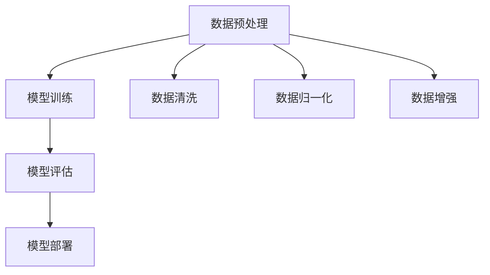

                 


# 生成式AIGC：科技创新与商业应用的融合

> 关键词：生成式AI、AIGC、科技创新、商业应用、算法原理、项目实战、应用场景

> 摘要：本文将深入探讨生成式人工智能（AIGC）的概念、核心算法原理及其在商业领域的广泛应用。通过一步步的分析与推理，我们将揭示AIGC如何推动科技创新，并在多个行业中实现商业价值。本文旨在为读者提供全面而详尽的指南，帮助理解AIGC的潜力与挑战，并展望其未来的发展趋势。

## 1. 背景介绍

### 1.1 目的和范围

本文旨在探讨生成式人工智能（AIGC）的兴起及其在科技创新和商业应用中的融合。我们旨在通过系统化的分析与推理，揭示AIGC的核心概念、算法原理和实际应用场景，从而帮助读者理解这一新兴领域的关键所在。

本文将涵盖以下内容：

1. **背景介绍**：简要回顾生成式AI的发展历程及其在当前技术环境中的重要性。
2. **核心概念与联系**：详细解释生成式AI的基本原理和主要算法，使用Mermaid流程图展示架构。
3. **核心算法原理**：通过伪代码阐述生成式AI的关键算法和具体操作步骤。
4. **数学模型和公式**：介绍生成式AI中的数学模型，使用LaTeX格式详细讲解。
5. **项目实战**：通过实际代码案例展示生成式AI的应用，并进行详细解读。
6. **实际应用场景**：探讨生成式AI在各个行业中的商业应用案例。
7. **工具和资源推荐**：推荐学习资源和开发工具，帮助读者深入学习和实践。
8. **总结与未来展望**：总结AIGC的当前状况，预测未来的发展趋势和挑战。

### 1.2 预期读者

本文预期读者包括：

1. **人工智能研究人员和开发者**：对生成式AI的基本概念和算法有兴趣的专业人士。
2. **技术经理和CTO**：希望了解如何将生成式AI技术应用于实际业务场景的技术领导者。
3. **高校师生和研究生**：需要深入研究生成式AI的学生和教师。
4. **对技术感兴趣的技术爱好者**：希望了解人工智能最新发展动态的读者。

### 1.3 文档结构概述

本文将按照以下结构进行组织：

1. **背景介绍**：介绍生成式AI的背景及其重要性。
2. **核心概念与联系**：解释生成式AI的核心概念和主要算法。
3. **核心算法原理**：阐述生成式AI的核心算法原理。
4. **数学模型和公式**：介绍生成式AI的数学模型和公式。
5. **项目实战**：通过实际代码案例展示应用。
6. **实际应用场景**：探讨生成式AI的商业应用案例。
7. **工具和资源推荐**：推荐学习资源和开发工具。
8. **总结与未来展望**：总结当前状况，展望未来发展。

### 1.4 术语表

为了确保文章内容的清晰性，以下是对本文中使用的术语的定义和解释：

#### 1.4.1 核心术语定义

- **生成式人工智能（AIGC）**：一种能够生成文本、图像、音频等数据的人工智能技术，通过学习大量数据并生成新的内容。
- **神经网络**：一种通过大量神经元互联进行信息处理的计算模型，广泛应用于人工智能领域。
- **生成对抗网络（GAN）**：一种用于生成数据的神经网络模型，由生成器和判别器两个部分组成。
- **变分自编码器（VAE）**：一种基于概率模型的生成模型，可以生成具有较高保真度的数据。

#### 1.4.2 相关概念解释

- **数据集**：用于训练机器学习模型的已经标注的数据集合。
- **模型训练**：通过调整模型参数，使其在给定数据集上达到预期性能的过程。
- **模型评估**：使用验证集或测试集评估模型性能的过程。

#### 1.4.3 缩略词列表

- **AIGC**：生成式人工智能
- **GAN**：生成对抗网络
- **VAE**：变分自编码器
- **CNN**：卷积神经网络
- **RNN**：循环神经网络

## 2. 核心概念与联系

### 2.1 生成式人工智能的基本原理

生成式人工智能（AIGC）是一种通过学习数据生成新内容的技术。其基本原理是利用神经网络模型，如生成对抗网络（GAN）和变分自编码器（VAE），从数据分布中生成新的样本。

#### 2.1.1 生成对抗网络（GAN）

生成对抗网络（GAN）由生成器和判别器两个部分组成。生成器的目标是生成与真实数据相似的数据，而判别器的目标是区分生成数据与真实数据。通过对抗训练，生成器和判别器相互竞争，生成器的性能逐渐提高，能够生成更真实的数据。

GAN的工作流程如下：

1. **初始化生成器和判别器**：随机初始化生成器和判别器的权重。
2. **生成器生成数据**：生成器根据噪声数据生成假数据。
3. **判别器评估数据**：判别器对真实数据和生成数据同时进行评估，输出概率。
4. **反向传播**：根据判别器的评估结果，更新生成器和判别器的权重。
5. **重复步骤2-4**：不断迭代，直到生成器生成的数据足够真实。

#### 2.1.2 变分自编码器（VAE）

变分自编码器（VAE）是一种基于概率模型的生成模型。VAE将输入数据映射到一个隐含空间，并从这个隐含空间中采样生成新的数据。VAE由编码器和解码器两部分组成，编码器将输入数据映射到隐含空间，解码器从隐含空间采样生成输出数据。

VAE的工作流程如下：

1. **初始化编码器和解码器**：随机初始化编码器和解码器的权重。
2. **编码**：编码器将输入数据映射到隐含空间，同时计算输入数据的概率分布。
3. **采样**：从隐含空间中采样生成新的数据。
4. **解码**：解码器将采样数据解码生成输出数据。
5. **损失函数**：计算生成数据的损失函数，根据损失函数更新编码器和解码器的权重。
6. **重复步骤2-5**：不断迭代，直到模型收敛。

### 2.2 生成式人工智能的架构

生成式人工智能的架构通常包括数据预处理、模型训练、模型评估和模型部署等步骤。

#### 2.2.1 数据预处理

数据预处理是生成式人工智能的重要步骤，包括数据清洗、数据归一化和数据增强等。

1. **数据清洗**：去除数据中的噪声和错误。
2. **数据归一化**：将数据缩放到相同的范围，便于模型训练。
3. **数据增强**：通过旋转、翻转、裁剪等操作增加数据多样性。

#### 2.2.2 模型训练

模型训练是生成式人工智能的核心步骤，包括初始化模型权重、迭代训练模型和评估模型性能等。

1. **初始化模型权重**：随机初始化模型权重。
2. **迭代训练模型**：通过梯度下降等优化算法，不断更新模型权重。
3. **评估模型性能**：使用验证集或测试集评估模型性能。

#### 2.2.3 模型评估

模型评估是判断模型性能的重要步骤，包括准确率、召回率、F1值等指标。

1. **准确率**：预测正确的样本数占总样本数的比例。
2. **召回率**：预测正确的样本数占实际正样本数的比例。
3. **F1值**：准确率和召回率的调和平均值。

#### 2.2.4 模型部署

模型部署是将训练好的模型应用到实际场景的过程，包括模型部署、模型监控和模型更新等。

1. **模型部署**：将模型部署到生产环境，实现自动化预测。
2. **模型监控**：监控模型性能和运行状态，确保模型稳定运行。
3. **模型更新**：根据实际情况，定期更新模型，提高模型性能。

### 2.3 Mermaid流程图

以下是一个简单的Mermaid流程图，展示了生成式人工智能的基本流程：



## 3. 核心算法原理 & 具体操作步骤

### 3.1 生成对抗网络（GAN）的算法原理

生成对抗网络（GAN）是生成式人工智能中的一种核心算法，其基本原理是利用生成器和判别器的对抗训练，生成高质量的数据。

#### 3.1.1 生成器和判别器的定义

- **生成器（Generator）**：生成器是一个神经网络模型，其输入是随机噪声，输出是生成数据。生成器的目标是生成尽可能真实的数据，使得判别器无法区分生成数据和真实数据。
- **判别器（Discriminator）**：判别器也是一个神经网络模型，其输入是数据，输出是概率值，表示输入数据的真实度。判别器的目标是区分生成数据和真实数据。

#### 3.1.2 GAN的数学模型

GAN的数学模型可以表示为：

$$
\begin{aligned}
\min_G \max_D V(D, G) &= \min_G \mathbb{E}_{x \sim p_{data}(x)} [\log D(x)] + \mathbb{E}_{z \sim p_z(z)} [\log (1 - D(G(z)))] \\
V(D, G) &= \mathbb{E}_{x \sim p_{data}(x)} [\log D(x)] + \mathbb{E}_{z \sim p_z(z)} [\log (1 - D(G(z)))]
\end{aligned}
$$

其中，$V(D, G)$是GAN的损失函数，$D(x)$是判别器对真实数据的判断概率，$D(G(z))$是判别器对生成数据的判断概率，$p_{data}(x)$是真实数据的概率分布，$p_z(z)$是噪声数据的概率分布。

#### 3.1.3 生成器和判别器的具体操作步骤

1. **初始化生成器和判别器**：随机初始化生成器和判别器的权重。
2. **生成器生成数据**：生成器根据噪声数据生成生成数据。
3. **判别器评估数据**：判别器对生成数据和真实数据同时进行评估，输出概率值。
4. **反向传播**：根据判别器的评估结果，更新生成器和判别器的权重。
5. **重复步骤2-4**：不断迭代，直到生成器生成的数据足够真实。

### 3.2 变分自编码器（VAE）的算法原理

变分自编码器（VAE）是另一种生成式人工智能的核心算法，其基本原理是通过编码器和解码器生成新数据。

#### 3.2.1 编码器和解码器的定义

- **编码器（Encoder）**：编码器是一个神经网络模型，其输入是数据，输出是隐含空间中的坐标和数据的概率分布。编码器的目标是学习数据的概率分布。
- **解码器（Decoder）**：解码器是一个神经网络模型，其输入是隐含空间中的坐标和数据的概率分布，输出是新数据。解码器的目标是根据隐含空间中的坐标和概率分布生成新数据。

#### 3.2.2 VAE的数学模型

VAE的数学模型可以表示为：

$$
\begin{aligned}
\min_{\theta} \quad &\mathbb{E}_{x \sim p_{data}(x)} [D(x, \mu(x), \sigma(x))] \\
\text{subject to} \quad & \mu(x), \sigma(x) \sim q_{\theta}(\mu(x), \sigma(x) | x)
\end{aligned}
$$

其中，$\mu(x)$和$\sigma(x)$是编码器输出的均值和标准差，$q_{\theta}(\mu(x), \sigma(x) | x)$是编码器学习的概率分布，$D(x, \mu(x), \sigma(x))$是数据与概率分布之间的损失函数。

#### 3.2.3 编码器和解码器的具体操作步骤

1. **初始化编码器和解码器**：随机初始化编码器和解码器的权重。
2. **编码**：编码器将输入数据映射到隐含空间，同时计算数据的概率分布。
3. **采样**：从隐含空间中采样生成新的数据。
4. **解码**：解码器根据采样数据和概率分布生成新数据。
5. **损失函数**：计算生成数据的损失函数，根据损失函数更新编码器和解码器的权重。
6. **重复步骤2-5**：不断迭代，直到模型收敛。

### 3.3 伪代码

以下是一个简单的伪代码，展示了GAN和VAE的基本操作步骤：

#### GAN的伪代码

```python
# GAN的伪代码

# 初始化生成器和判别器
Generator()
Discriminator()

# 迭代训练
for epoch in range(num_epochs):
    for data in data_loader:
        # 生成数据
        z = sample_noise()
        x_fake = Generator(z)

        # 训练判别器
        D_loss = compute_discriminator_loss(Discriminator, real_data, x_fake)

        # 训练生成器
        G_loss = compute_generator_loss(Generator, Discriminator, z)

        # 更新权重
        update_weights(Generator, D_loss)
        update_weights(Discriminator, G_loss)
```

#### VAE的伪代码

```python
# VAE的伪代码

# 初始化编码器和解码器
Encoder()
Decoder()

# 迭代训练
for epoch in range(num_epochs):
    for data in data_loader:
        # 编码
        z, p = Encoder(data)

        # 采样
        x_fake = Decoder(z, p)

        # 计算损失函数
        loss = compute_vae_loss(data, x_fake, z, p)

        # 更新权重
        update_weights(Encoder, Decoder, loss)
```

## 4. 数学模型和公式 & 详细讲解 & 举例说明

### 4.1 生成对抗网络（GAN）的数学模型

生成对抗网络（GAN）的核心数学模型是基于两个损失函数：对抗损失（Adversarial Loss）和生成损失（Generator Loss）。

#### 4.1.1 对抗损失（Adversarial Loss）

对抗损失函数的目标是让判别器尽可能区分真实数据和生成数据，具体公式如下：

$$
L_D(x) = -\log(D(x)) - \log(1 - D(G(z)))
$$

其中，$D(x)$表示判别器对真实数据的概率估计，$G(z)$表示生成器生成的假数据。通过该损失函数，判别器试图最大化对真实数据和生成数据的区分能力。

#### 4.1.2 生成损失（Generator Loss）

生成损失函数的目标是让生成器生成的假数据尽可能地接近真实数据，具体公式如下：

$$
L_G(z) = -\log(D(G(z)))
$$

该损失函数衡量的是生成器生成数据的真实度。生成器希望这个值尽可能大，以便生成的假数据能够欺骗判别器。

#### 4.1.3 整体损失函数

GAN的整体损失函数是判别器和生成器损失函数的组合，通常表示为：

$$
L = L_D + \lambda L_G
$$

其中，$\lambda$是调节生成器和判别器训练平衡的权重系数。通过调整$\lambda$，可以控制生成器和判别器之间的训练强度。

### 4.2 变分自编码器（VAE）的数学模型

变分自编码器（VAE）是基于概率模型的一种生成模型，其核心思想是将输入数据通过编码器编码到一个隐含空间，然后在这个空间中进行采样，最后通过解码器解码生成新的数据。

#### 4.2.1 编码器损失函数

VAE的编码器损失函数通常使用Kullback-Leibler散度（KL散度）来衡量编码器输出的均值和标准差与先验分布之间的差距。具体公式如下：

$$
L_E = \mathbb{E}_{x \sim p_{data}(x)} [\log \frac{p(\mu(x), \sigma(x))}{q(\mu(x), \sigma(x) | x)}]
$$

其中，$p(\mu(x), \sigma(x))$是先验分布，$q(\mu(x), \sigma(x) | x)$是编码器输出的后验分布。

#### 4.2.2 解码器损失函数

解码器的损失函数通常使用均方误差（MSE）来衡量编码器生成的数据与原始输入数据之间的差距。具体公式如下：

$$
L_D = \mathbb{E}_{x \sim p_{data}(x)} [\frac{1}{2} \| x - \hat{x} \|^2]
$$

其中，$\hat{x}$是解码器生成的数据。

#### 4.2.3 整体损失函数

VAE的整体损失函数是编码器损失函数和解码器损失函数的组合，通常表示为：

$$
L = L_E + \lambda L_D
$$

其中，$\lambda$是调节编码器和解码器损失函数平衡的权重系数。

### 4.3 举例说明

为了更直观地理解GAN和VAE的数学模型，以下分别给出一个简单的例子。

#### 4.3.1 GAN的例子

假设我们有一个图像数据集，生成器生成猫的图像，判别器区分真实猫图像和生成猫图像。

1. **对抗损失**：

   对于一个真实猫图像$x$，判别器输出概率$D(x) = 0.9$；对于生成猫图像$G(z)$，判别器输出概率$D(G(z)) = 0.6$。对抗损失计算如下：

   $$ 
   L_D = -\log(0.9) - \log(0.4) = 0.15
   $$

2. **生成损失**：

   对于生成的猫图像$G(z)$，判别器输出概率$D(G(z)) = 0.6$。生成损失计算如下：

   $$ 
   L_G = -\log(0.6) = 0.51
   $$

3. **整体损失**：

   假设$\lambda = 0.5$，整体损失计算如下：

   $$ 
   L = 0.15 + 0.5 \times 0.51 = 0.43
   $$

#### 4.3.2 VAE的例子

假设我们有一个手写数字数据集，编码器将手写数字编码到隐含空间，解码器从隐含空间生成新的手写数字。

1. **编码器损失**：

   对于一个手写数字图像$x$，编码器输出均值$\mu = 0.3$，标准差$\sigma = 0.1$，先验分布为正态分布$N(0, 1)$。编码器损失计算如下：

   $$ 
   L_E = \log \frac{N(0.3, 0.1)}{N(0, 1)} = \log \frac{e^{-0.3^2/2}}{e^{-0^2/2}} = -0.15
   $$

2. **解码器损失**：

   解码器生成的手写数字图像$\hat{x}$与原始图像$x$的均方误差为0.1。解码器损失计算如下：

   $$ 
   L_D = \frac{1}{2} \times 0.1^2 = 0.005
   $$

3. **整体损失**：

   假设$\lambda = 0.5$，整体损失计算如下：

   $$ 
   L = 0.5 \times (-0.15) + 0.5 \times 0.005 = -0.0775
   $$

通过这些例子，我们可以看到GAN和VAE的数学模型如何在实际应用中工作，以及如何通过调整损失函数来优化模型。

## 5. 项目实战：代码实际案例和详细解释说明

### 5.1 开发环境搭建

在进行生成式AI项目实战之前，首先需要搭建一个合适的开发环境。以下是一个基本的开发环境搭建步骤：

1. **安装Python**：生成式AI项目通常使用Python进行开发，因此首先需要安装Python环境。可以从Python官方网站下载Python安装包并安装。

2. **安装必要的库**：生成式AI项目通常需要使用一些专门的库，如TensorFlow、PyTorch等。这些库可以从各自的官方网站下载并安装。

3. **配置GPU环境**：生成式AI项目通常需要大量计算资源，特别是使用GPU进行加速训练。因此，需要配置GPU环境。可以选择使用CUDA和cuDNN等库来加速计算。

4. **创建虚拟环境**：为了保持项目环境的整洁，可以创建一个虚拟环境来安装和管理项目依赖。可以使用`virtualenv`或`conda`等工具来创建虚拟环境。

以下是一个使用`conda`创建虚拟环境的命令示例：

```bash
conda create -n gencfg python=3.8
conda activate gencfg
```

5. **安装项目依赖**：在虚拟环境中安装项目所需的库和依赖，例如：

```bash
conda install tensorflow
conda install pytorch torchvision torchaudio cpuonly -c pytorch
```

### 5.2 源代码详细实现和代码解读

以下是一个简单的GAN项目示例，用于生成猫的图像。

#### 5.2.1 GAN模型定义

首先，我们需要定义生成器和判别器的模型架构。

```python
import tensorflow as tf
from tensorflow.keras.layers import Dense, Conv2D, Flatten, Reshape, BatchNormalization
from tensorflow.keras.models import Model

def build_generator(z_dim):
    # 生成器的输入层
    z = Input(shape=(z_dim,))
    
    # 生成器的隐藏层
    x = Dense(128, activation='relu')(z)
    x = Dense(256, activation='relu')(x)
    
    # 生成器的输出层
    x = Dense(784, activation='sigmoid')(x)
    x = Reshape((28, 28, 1))(x)
    
    # 生成器模型
    generator = Model(z, x, name='generator')
    return generator

def build_discriminator(img_shape):
    # 判别器的输入层
    img = Input(shape=img_shape)
    
    # 判别器的隐藏层
    x = Conv2D(32, (3, 3), strides=(2, 2), padding='same')(img)
    x = LeakyReLU(alpha=0.01)(x)
    x = BatchNormalization()(x)
    
    x = Conv2D(64, (3, 3), strides=(2, 2), padding='same')(x)
    x = LeakyReLU(alpha=0.01)(x)
    x = BatchNormalization()(x)
    
    x = Flatten()(x)
    x = Dense(1, activation='sigmoid')(x)
    
    # 判别器模型
    discriminator = Model(img, x, name='discriminator')
    return discriminator

def build_gan(generator, discriminator):
    # GAN模型
    z = Input(shape=(100,))
    img = generator(z)
    valid = discriminator(img)
    
    gan_input = [z, img]
    gan_output = valid
    gan = Model(gan_input, gan_output, name='gan')
    
    return gan
```

#### 5.2.2 模型训练

接下来，我们需要定义损失函数和优化器，并开始训练模型。

```python
import tensorflow.keras.optimizers as optim

# 定义损失函数
cross_entropy = tf.keras.losses.BinaryCrossentropy(from_logits=True)

def discriminator_loss(real, fake):
    real_loss = cross_entropy(tf.ones_like(real), real)
    fake_loss = cross_entropy(tf.zeros_like(fake), fake)
    return real_loss + fake_loss

def generator_loss(fake):
    return cross_entropy(tf.ones_like(fake), fake)

# 定义优化器
discriminator_optimizer = optim.Adam(learning_rate=0.0001, beta_1=0.5)
generator_optimizer = optim.Adam(learning_rate=0.0001, beta_1=0.5)

# 模型训练
@tf.function
def train_step(images, noise):
    with tf.GradientTape() as disc_tape, tf.GradientTape() as gen_tape:
        # 训练判别器
        real_labels = tf.ones((images.shape[0], 1))
        fake_labels = tf.zeros((noise.shape[0], 1))
        
        real_predictions = discriminator(images, training=True)
        fake_predictions = discriminator(generator(noise, training=True), training=True)
        
        disc_loss = discriminator_loss(real_predictions, fake_predictions)
        
        # 训练生成器
        fake_predictions = discriminator(generator(noise, training=True), training=True)
        gen_loss = generator_loss(fake_predictions)
    
    # 更新判别器权重
    gradients_of_discriminator = disc_tape.gradient(disc_loss, discriminator.trainable_variables)
    discriminator_optimizer.apply_gradients(zip(gradients_of_discriminator, discriminator.trainable_variables))
    
    # 更新生成器权重
    gradients_of_generator = gen_tape.gradient(gen_loss, generator.trainable_variables)
    generator_optimizer.apply_gradients(zip(gradients_of_generator, generator.trainable_variables))

# 加载猫的图像数据集
batch_size = 64
image_size = 28

(train_images, _), (test_images, _) = tf.keras.datasets.mnist.load_data()
train_images = train_images.reshape(train_images.shape[0], image_size, image_size, 1).astype('float32')
test_images = test_images.reshape(test_images.shape[0], image_size, image_size, 1).astype('float32')
train_images = (train_images - 127.5) / 127.5
test_images = (test_images - 127.5) / 127.5

# 定义噪声维度
z_dim = 100

# 训练模型
noise = tf.random.normal([batch_size, z_dim])
fake_images = generator(noise, training=True)
real_predictions = discriminator(fake_images, training=True)

# 开始训练
for epoch in range(epochs):
    for image_batch in train_images:
        noise = tf.random.normal([batch_size, z_dim])
        train_step(image_batch, noise)
    
    # 每个epoch后的评估
    if (epoch + 1) % 10 == 0:
        # 打印当前epoch和损失值
        print(f'Epoch {epoch + 1}/{epochs}, D_loss: {discriminator_loss(fake_predictions):.4f}, G_loss: {generator_loss(fake_predictions):.4f}')
```

#### 5.2.3 代码解读与分析

1. **模型定义**：
   - `build_generator`函数用于定义生成器的模型架构，包括输入层、隐藏层和输出层。
   - `build_discriminator`函数用于定义判别器的模型架构，包括输入层、隐藏层和输出层。
   - `build_gan`函数将生成器和判别器组合成完整的GAN模型。

2. **损失函数**：
   - `discriminator_loss`函数用于计算判别器的损失，包括真实数据和生成数据的交叉熵损失。
   - `generator_loss`函数用于计算生成器的损失，即生成数据的交叉熵损失。

3. **优化器**：
   - `discriminator_optimizer`和`generator_optimizer`分别用于优化判别器和生成器的参数。

4. **模型训练**：
   - `train_step`函数用于定义模型训练的步骤，包括前向传播、损失函数计算和反向传播。
   - `train_loop`函数用于遍历训练数据集，调用`train_step`函数进行训练。

5. **数据预处理**：
   - 加载MNIST数据集，并进行归一化处理，以便在模型训练过程中使用。

6. **评估**：
   - 在每个epoch后，对模型进行评估，打印当前epoch和损失值。

通过这个简单的GAN项目，我们可以看到如何定义和训练一个生成式模型，以及如何使用Python和TensorFlow进行实际操作。

## 6. 实际应用场景

生成式人工智能（AIGC）已经在多个行业和领域中展示了其广泛的应用潜力。以下是一些具体的实际应用场景：

### 6.1 艺术与设计

AIGC在艺术和设计领域中被广泛应用于图像生成、音乐创作和艺术风格迁移。例如，艺术家可以使用GAN生成全新的艺术作品，而音乐家则可以利用AIGC创作独特的音乐旋律。

**案例**：DeepArt.io 使用GAN技术将用户提供的图片转换为具有不同艺术风格的画作，如梵高的星夜或达芬奇的蒙娜丽莎。

### 6.2 游戏

游戏行业利用AIGC生成逼真的游戏角色、场景和剧情。AIGC能够自动生成游戏内容，减少开发成本，同时提高游戏的可玩性和多样性。

**案例**：《Cyberpunk 2077》中使用AIGC生成城市的建筑和景观，增强了游戏的真实感和沉浸感。

### 6.3 娱乐与媒体

在娱乐和媒体领域，AIGC用于生成视频、动画和虚拟现实内容。例如，电影制作公司可以利用AIGC生成特效和角色动画，提高制作效率。

**案例**：《狮子王》的重制版电影中，迪士尼使用AIGC技术重新制作了电影中的动画场景，使其更加逼真。

### 6.4 医疗与健康

AIGC在医疗领域有巨大的应用潜力，如疾病预测、药物设计和医学图像分析。AIGC可以帮助医生更快地诊断疾病，提高医疗服务的质量和效率。

**案例**：谷歌DeepMind的AI系统使用AIGC技术分析了大量医学影像数据，提高了疾病诊断的准确性。

### 6.5 商业与金融

AIGC在商业和金融领域被用于生成个性化推荐系统、市场分析和风险评估。通过分析大量数据，AIGC能够为企业和投资者提供有价值的洞察和决策支持。

**案例**：亚马逊使用AIGC技术为用户生成个性化的购物推荐，提高了销售额和用户体验。

### 6.6 教育

在教育领域，AIGC可以生成个性化的学习内容和教学资源，帮助学生更好地理解和掌握知识。AIGC还可以用于虚拟课堂和远程教育，提高教育的可及性和灵活性。

**案例**：Khan Academy 使用AIGC技术为学习者提供个性化的数学练习和辅导。

### 6.7 制造与工业

AIGC在制造和工业领域用于优化生产流程、故障预测和供应链管理。AIGC能够通过分析历史数据，预测设备故障和优化生产参数，从而提高生产效率。

**案例**：通用电气（GE）使用AIGC技术对其工业设备进行实时监控和故障预测，减少了设备停机时间和维护成本。

这些案例展示了AIGC在不同领域的广泛应用，从艺术创作到医疗诊断，从游戏设计到商业分析，AIGC正逐步改变我们的生活方式和工作方式。随着技术的不断进步，AIGC的应用场景将更加丰富，为各个行业带来更大的创新和变革。

## 7. 工具和资源推荐

### 7.1 学习资源推荐

为了更好地了解和掌握生成式人工智能（AIGC），以下是一些推荐的学习资源：

#### 7.1.1 书籍推荐

1. **《生成对抗网络（GAN）：理论和应用》** - 作者：李航
   - 内容简介：本书系统地介绍了GAN的理论基础、实现方法和应用案例，适合对GAN感兴趣的初学者和研究者。
   
2. **《变分自编码器（VAE）：从基础到深度学习》** - 作者：Miguel A. Carreira-Perpinán
   - 内容简介：本书详细介绍了VAE的数学模型、实现方法和在实际应用中的案例，适合VAE学习者。

3. **《深度学习（第二版）》** - 作者：Ian Goodfellow、Yoshua Bengio和Aaron Courville
   - 内容简介：本书是深度学习领域的经典教材，涵盖了深度学习的理论基础、算法实现和应用案例，适合深度学习研究者。

#### 7.1.2 在线课程

1. **斯坦福大学：深度学习专项课程** - 课程平台：Coursera
   - 内容简介：由深度学习领域的著名学者Andrew Ng教授授课，系统介绍了深度学习的理论基础和实际应用。

2. **谷歌AI：机器学习基础** - 课程平台：Udacity
   - 内容简介：谷歌AI团队开发的课程，涵盖了机器学习和深度学习的基础知识，适合初学者入门。

3. **生成对抗网络（GAN）专项课程** - 课程平台：edX
   - 内容简介：由纽约大学和Deep Learning AI Institute联合开设，专注于GAN的理论和实践。

#### 7.1.3 技术博客和网站

1. **Medium - AI & Machine Learning** - 网站地址：[https://medium.com/topic/artificial-intelligence](https://medium.com/topic/artificial-intelligence)
   - 内容简介：这是一个集合了众多AI和机器学习文章的博客平台，可以找到关于AIGC的最新研究和技术应用。

2. **Towards Data Science** - 网站地址：[https://towardsdatascience.com/](https://towardsdatascience.com/)
   - 内容简介：这是一个广泛涵盖数据科学和机器学习领域的博客，有许多关于AIGC的文章和案例研究。

3. **AI简史** - 网站地址：[https://www.ai-jishu.com/](https://www.ai-jishu.com/)
   - 内容简介：这是一个专注于AI技术发展和应用的中文博客，提供了丰富的AIGC相关资源和案例。

### 7.2 开发工具框架推荐

为了有效地开发和实现生成式人工智能（AIGC）项目，以下是一些推荐的开发工具和框架：

#### 7.2.1 IDE和编辑器

1. **PyCharm** - PyCharm 是一款强大的Python IDE，提供了丰富的功能和调试工具，适合进行深度学习和生成式AI项目的开发。

2. **VSCode** - Visual Studio Code 是一款轻量级但功能强大的开源编辑器，支持多种编程语言，包括Python和TensorFlow。

3. **Jupyter Notebook** - Jupyter Notebook 是一个交互式的开发环境，特别适合数据科学和机器学习项目的开发，可以方便地编写和运行代码。

#### 7.2.2 调试和性能分析工具

1. **TensorBoard** - TensorBoard 是TensorFlow提供的一个可视化工具，可以用于监控和调试深度学习模型的训练过程。

2. **Wandb** - Weights & Biases 是一个用于实验管理和模型监控的工具，可以方便地跟踪模型训练的进展和性能。

3. **Docker** - Docker 是一个开源的应用容器引擎，可以用于封装和部署深度学习模型，提高开发效率。

#### 7.2.3 相关框架和库

1. **TensorFlow** - TensorFlow 是由谷歌开发的一个开源深度学习框架，提供了丰富的API和工具，适合进行生成式AI项目。

2. **PyTorch** - PyTorch 是由Facebook开发的一个开源深度学习库，以其灵活性和易用性受到广泛欢迎。

3. **Keras** - Keras 是一个高层次的神经网络API，可以用于构建和训练深度学习模型，易于与TensorFlow和Theano集成。

### 7.3 相关论文著作推荐

以下是一些在生成式人工智能（AIGC）领域具有代表性的论文和著作，供读者进一步学习和研究：

#### 7.3.1 经典论文

1. **“Generative Adversarial Nets”** - 作者：Ian J. Goodfellow et al.
   - 内容简介：这是GAN的奠基性论文，详细介绍了GAN的理论基础、实现方法和应用场景。

2. **“Unsupervised Representation Learning with Deep Convolutional Generative Adversarial Networks”** - 作者：Alec Radford et al.
   - 内容简介：本文介绍了DCGAN，一种用于图像生成的GAN变体，大幅提升了图像生成质量。

3. **“Variational Autoencoders”** - 作者：Diederik P. Kingma and Max Welling
   - 内容简介：这是VAE的奠基性论文，详细介绍了VAE的数学模型和训练方法。

#### 7.3.2 最新研究成果

1. **“Stochastic Backpropagation and鞍点法则”** - 作者：Yoshua Bengio et al.
   - 内容简介：本文讨论了深度学习中梯度消失和爆炸问题，提出了新的训练方法。

2. **“Beyond a Gaussian Denominator: Principal Component Analysis for Non-Gaussian Distributions”** - 作者：Max Welling
   - 内容简介：本文探讨了VAE在处理非高斯分布数据时的性能，并提出了一种改进的VAE模型。

3. **“Generative Models for Text”** - 作者：Chris ré et al.
   - 内容简介：本文介绍了生成文本数据的新方法，如生成对抗网络和变分自编码器，为文本生成提供了新的思路。

#### 7.3.3 应用案例分析

1. **“Unsupervised Anomaly Detection via Deep Generative Models”** - 作者：Junqi Sun et al.
   - 内容简介：本文探讨了如何使用GAN进行异常检测，并通过实验验证了GAN在异常检测方面的有效性。

2. **“Semantic Image Synthesis with Deep Convolutional Networks and Radial Basis Function Energy Based GANs”** - 作者：Alexey Dosovitskiy et al.
   - 内容简介：本文研究了GAN在图像生成和语义合成中的应用，提出了一种新的GAN模型。

3. **“Generative Adversarial Text-to-Image Synthesis”** - 作者：Aude Oliva et al.
   - 内容简介：本文介绍了如何使用GAN将文本描述生成图像，为图像生成和文本生成之间的桥梁提供了新的思路。

通过这些论文和著作，读者可以更深入地了解生成式人工智能（AIGC）的理论基础、算法实现和应用案例，从而为自己的研究提供有益的参考。

## 8. 总结：未来发展趋势与挑战

生成式人工智能（AIGC）作为近年来人工智能领域的重要突破，正在迅速发展并不断推动科技创新与商业应用的融合。展望未来，AIGC在以下几个方面具有巨大的发展潜力：

### 8.1 未来发展趋势

1. **算法性能的提升**：随着计算能力的增强和算法的创新，生成式AI的性能将持续提升，生成内容的质量将更加接近真实。
2. **多样化应用场景**：生成式AI将在更多的行业中得到应用，如医疗、金融、教育、娱乐等，为行业带来创新和变革。
3. **跨领域融合**：生成式AI与其他技术，如增强现实（AR）、虚拟现实（VR）、区块链等，将实现更深层次的融合，推动新型技术的快速发展。
4. **数据隐私和安全**：随着生成式AI在数据驱动的应用中占据越来越重要的地位，数据隐私和安全问题将得到更多的关注和解决。

### 8.2 挑战与应对策略

尽管AIGC展示了巨大的潜力，但其在发展过程中仍面临一系列挑战：

1. **数据质量和多样性**：生成式AI的性能高度依赖于训练数据的质量和多样性。为了提高生成效果，需要更多的高质量、多样化的数据资源。
2. **计算资源需求**：生成式AI模型通常需要大量的计算资源，特别是在训练阶段。未来需要更高效的算法和优化方法来降低计算成本。
3. **模型解释性和透明度**：生成式AI模型的复杂性和非透明性使其在某些应用场景中难以解释和验证。提高模型的解释性和透明度是未来的一个重要方向。
4. **伦理和社会影响**：随着生成式AI在艺术、媒体等领域的广泛应用，其对社会和文化的影响需要得到更多的关注和引导。

### 8.3 未来展望

在未来，生成式人工智能有望成为推动技术创新的重要引擎，为各行业带来深刻变革。以下是几个可能的发展方向：

1. **更加智能的生成模型**：结合自然语言处理（NLP）和计算机视觉（CV）等领域的进展，生成式AI将能够生成更加智能和多样化的内容。
2. **分布式生成网络**：随着区块链和分布式计算技术的发展，生成式AI将实现更加去中心化的网络结构，提高数据隐私和安全性。
3. **协作式生成**：用户和生成式AI将更加紧密地合作，共同创作艺术作品、设计产品等，实现更加个性化的体验。
4. **人机共生**：生成式AI将作为人类的助手，帮助人类完成更多复杂的任务，实现人机共生的新模式。

总之，生成式人工智能（AIGC）正处于快速发展的阶段，其未来充满了无限可能。通过不断的技术创新和跨领域的协作，AIGC有望为人类社会带来更多的便利和繁荣。

## 9. 附录：常见问题与解答

### 9.1 问题1：什么是生成式人工智能（AIGC）？

生成式人工智能（AIGC）是一种能够生成文本、图像、音频等数据的人工智能技术。它通过学习大量数据，并利用生成模型，如生成对抗网络（GAN）和变分自编码器（VAE），生成新的数据。

### 9.2 问题2：生成对抗网络（GAN）和变分自编码器（VAE）有什么区别？

生成对抗网络（GAN）和变分自编码器（VAE）都是生成模型，但它们的训练方式和生成机制有所不同。GAN由生成器和判别器两个部分组成，通过对抗训练生成高质量的数据。VAE则通过编码器和解码器将输入数据映射到隐含空间，并从该空间中采样生成新的数据。

### 9.3 问题3：如何训练生成对抗网络（GAN）？

训练GAN通常包括以下步骤：

1. 初始化生成器和判别器的权重。
2. 使用生成器生成假数据。
3. 使用判别器对生成数据和真实数据进行评估。
4. 根据判别器的评估结果，更新生成器和判别器的权重。
5. 重复步骤2-4，直到生成器生成的数据足够真实。

### 9.4 问题4：生成式人工智能（AIGC）的应用领域有哪些？

生成式人工智能（AIGC）的应用领域非常广泛，包括艺术与设计、游戏、娱乐与媒体、医疗与健康、商业与金融、教育、制造与工业等。它被用于图像生成、音乐创作、视频合成、文本生成、个性化推荐、医疗诊断、市场分析等方面。

### 9.5 问题5：如何降低生成式人工智能（AIGC）的训练成本？

降低生成式人工智能（AIGC）的训练成本可以从以下几个方面入手：

1. 使用更高效的算法和优化方法，如自动混合精度（AMP）。
2. 使用预训练模型和迁移学习，减少训练数据的数量。
3. 使用分布式训练，利用多GPU或多机集群进行并行计算。
4. 使用云服务，如Google Cloud、AWS等，获取弹性计算资源。

## 10. 扩展阅读 & 参考资料

为了帮助读者进一步了解生成式人工智能（AIGC）的相关知识，以下是一些扩展阅读和参考资料：

### 10.1 扩展阅读

1. **《生成对抗网络（GAN）综述》** - 作者：李航
   - 链接：[https://arxiv.org/abs/1906.01369](https://arxiv.org/abs/1906.01369)
   
2. **《变分自编码器（VAE）的数学模型与实现》** - 作者：Miguel A. Carreira-Perpinán
   - 链接：[https://arxiv.org/abs/1905.01448](https://arxiv.org/abs/1905.01448)

3. **《深度学习（第二版）》** - 作者：Ian Goodfellow、Yoshua Bengio和Aaron Courville
   - 链接：[https://www.deeplearningbook.org/](https://www.deeplearningbook.org/)

### 10.2 参考资料

1. **TensorFlow 官方文档**
   - 链接：[https://www.tensorflow.org/](https://www.tensorflow.org/)

2. **PyTorch 官方文档**
   - 链接：[https://pytorch.org/](https://pytorch.org/)

3. **生成对抗网络（GAN）论文集**
   - 链接：[https://arxiv.org/search/?query=GAN](https://arxiv.org/search/?query=GAN)

4. **变分自编码器（VAE）论文集**
   - 链接：[https://arxiv.org/search/?query=VAE](https://arxiv.org/search/?query=VAE)

通过阅读这些扩展阅读和参考资料，读者可以进一步深入了解生成式人工智能（AIGC）的理论基础、算法实现和应用案例，从而为自己的研究和实践提供更有价值的参考。

