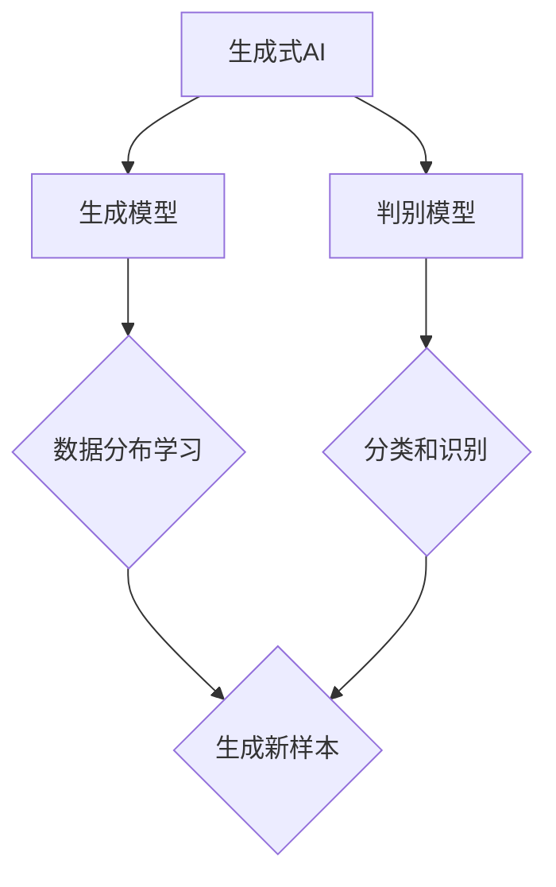

                 

# 生成式AI的实际应用案例

> 关键词：生成式AI，应用案例，模型架构，数学模型，代码实现，实战分析

> 摘要：本文将深入探讨生成式AI的核心概念、算法原理及其在实际应用中的案例。通过详细的流程图、伪代码、数学公式和实际代码案例，我们将对生成式AI进行全方位剖析，帮助读者理解其在各种场景下的应用价值和潜力。

## 1. 背景介绍

### 1.1 目的和范围

本文旨在介绍生成式AI的核心概念、算法原理和实际应用案例。我们将重点关注生成式AI在不同领域中的成功应用，探讨其技术优势、面临的挑战以及未来发展趋势。

### 1.2 预期读者

本文适合对生成式AI感兴趣的读者，包括但不限于人工智能研究人员、软件开发者、技术经理和企业家。阅读本文将帮助您：

- 理解生成式AI的基本原理。
- 掌握生成式AI的关键算法。
- 分析生成式AI在现实世界中的应用。
- 探索生成式AI的发展趋势和挑战。

### 1.3 文档结构概述

本文分为十个部分，具体结构如下：

- 第1部分：背景介绍
- 第2部分：核心概念与联系
- 第3部分：核心算法原理与操作步骤
- 第4部分：数学模型与详细讲解
- 第5部分：项目实战与代码案例
- 第6部分：实际应用场景
- 第7部分：工具和资源推荐
- 第8部分：总结：未来发展趋势与挑战
- 第9部分：附录：常见问题与解答
- 第10部分：扩展阅读与参考资料

### 1.4 术语表

#### 1.4.1 核心术语定义

- **生成式AI**：一种人工智能技术，通过学习数据分布，生成新的数据样本。
- **生成模型**：一类机器学习模型，旨在学习数据分布并生成新样本。
- **判别模型**：一类机器学习模型，用于区分不同类别的数据。
- **变分自编码器（VAE）**：一种生成模型，通过编码器和解码器学习数据分布。
- **生成对抗网络（GAN）**：一种生成模型，通过生成器和判别器的对抗训练生成高质量数据。

#### 1.4.2 相关概念解释

- **数据分布**：描述数据在不同特征上的分布情况。
- **样本**：从数据集中抽取的一个个体。
- **维度**：描述数据集中特征的数量。
- **损失函数**：衡量模型预测值与真实值之间差异的函数。

#### 1.4.3 缩略词列表

- **GAN**：生成对抗网络（Generative Adversarial Network）
- **VAE**：变分自编码器（Variational Autoencoder）
- **CNN**：卷积神经网络（Convolutional Neural Network）
- **RNN**：循环神经网络（Recurrent Neural Network）

## 2. 核心概念与联系

为了更好地理解生成式AI，我们首先介绍几个核心概念，并绘制Mermaid流程图展示其关系。

### 2.1 核心概念

- **生成式AI**：基于概率模型生成数据。
- **生成模型**：学习数据分布，生成新样本。
- **判别模型**：分类和识别数据。

### 2.2 Mermaid流程图



在这个流程图中，生成式AI通过生成模型和判别模型相互协作，共同实现数据生成和分类识别的目标。

## 3. 核心算法原理与具体操作步骤

生成式AI的核心在于其算法原理，包括生成模型和判别模型。本节我们将详细讨论这两种模型的工作原理和操作步骤。

### 3.1 生成模型

生成模型的主要目标是学习数据分布，并生成符合数据分布的新样本。其中，变分自编码器（VAE）和生成对抗网络（GAN）是两种常见的生成模型。

#### 3.1.1 变分自编码器（VAE）

**算法原理：**

VAE由编码器和解码器两部分组成。编码器将输入数据映射到一个潜在空间，解码器将潜在空间中的数据重新映射回数据空间。通过最大化数据分布的后验概率，VAE能够学习到数据分布。

**操作步骤：**

1. 初始化编码器和解码器的参数。
2. 输入数据，通过编码器得到潜在空间中的表示。
3. 在潜在空间中采样一个噪声点。
4. 通过解码器将采样点映射回数据空间。
5. 计算损失函数，优化编码器和解码器的参数。

**伪代码：**

```python
function train_VAE(inputs, epochs):
    for epoch in 1 to epochs:
        for input in inputs:
            z = encoder(input)
            z_samples = sample_noise(z)
            reconstructed = decoder(z_samples)
            loss = compute_loss(input, reconstructed)
            optimize_parameters(loss)
```

#### 3.1.2 生成对抗网络（GAN）

**算法原理：**

GAN由生成器和判别器两部分组成。生成器生成数据，判别器判断生成数据与真实数据的相似度。通过对抗训练，生成器能够不断提高生成数据的质量。

**操作步骤：**

1. 初始化生成器和解码器的参数。
2. 生成器生成假数据。
3. 判别器判断生成数据和真实数据的相似度。
4. 计算生成器和判别器的损失函数。
5. 优化生成器和解码器的参数。

**伪代码：**

```python
function train_GAN(epochs):
    for epoch in 1 to epochs:
        for real_data in real_dataset:
            generate_fake_data = generator(real_data)
            loss_real = discriminator(real_data)
            loss_fake = discriminator(generate_fake_data)
            optimize_generator(loss_fake)
            optimize_discriminator(loss_real, loss_fake)
```

### 3.2 判别模型

判别模型主要用于分类和识别任务。常见的判别模型包括卷积神经网络（CNN）和循环神经网络（RNN）。

#### 3.2.1 卷积神经网络（CNN）

**算法原理：**

CNN通过卷积层、池化层和全连接层等结构，学习图像的特征表示，实现对图像的分类和识别。

**操作步骤：**

1. 初始化CNN模型参数。
2. 输入图像数据，通过卷积层提取特征。
3. 通过池化层减少特征维度。
4. 通过全连接层进行分类。

**伪代码：**

```python
function train_CNN(inputs, labels, epochs):
    for epoch in 1 to epochs:
        for input, label in zip(inputs, labels):
            features = conv_2d(input)
            pooled_features = max_pooling(features)
            logits = fully_connected(pooled_features)
            loss = compute_loss(logits, label)
            optimize_parameters(loss)
```

#### 3.2.2 循环神经网络（RNN）

**算法原理：**

RNN通过循环结构，处理序列数据，捕捉序列中的时间依赖关系，实现对序列的分类和识别。

**操作步骤：**

1. 初始化RNN模型参数。
2. 输入序列数据，通过RNN层更新状态。
3. 通过全连接层进行分类。

**伪代码：**

```python
function train_RNN(inputs, labels, epochs):
    for epoch in 1 to epochs:
        for input, label in zip(inputs, labels):
            hidden_state = initialize_state()
            for t in range(sequence_length):
                hidden_state = RNN(input[t], hidden_state)
            logits = fully_connected(hidden_state)
            loss = compute_loss(logits, label)
            optimize_parameters(loss)
```

## 4. 数学模型和公式

生成式AI中的数学模型主要包括损失函数、优化算法等。在本节中，我们将详细讲解这些数学模型，并给出相应的公式和举例说明。

### 4.1 损失函数

生成式AI中的损失函数用于衡量模型预测值与真实值之间的差异。以下介绍几种常见的损失函数：

#### 4.1.1 均方误差（MSE）

均方误差是最常见的损失函数之一，用于回归任务。

$$
MSE = \frac{1}{n}\sum_{i=1}^{n}(y_i - \hat{y}_i)^2
$$

其中，$y_i$表示真实值，$\hat{y}_i$表示预测值，$n$表示样本数量。

#### 4.1.2 交叉熵（Cross-Entropy）

交叉熵是用于分类任务的损失函数。

$$
Cross-Entropy = -\sum_{i=1}^{n}y_i\log(\hat{y}_i)
$$

其中，$y_i$表示真实值，$\hat{y}_i$表示预测值。

#### 4.1.3 负对数似然（Negative Log Likelihood）

负对数似然是生成式AI中的一种损失函数，常用于VAE和GAN。

$$
NLL = -\sum_{i=1}^{n}y_i\log(p(y_i|x))
$$

其中，$y_i$表示生成模型生成的样本，$x$表示输入数据，$p(y_i|x)$表示生成模型生成的概率。

### 4.2 优化算法

优化算法用于优化模型的参数，使得模型在训练过程中能够不断提高预测性能。以下介绍几种常见的优化算法：

#### 4.2.1 随机梯度下降（SGD）

随机梯度下降是一种基于梯度信息的优化算法，通过计算样本的梯度来更新模型参数。

$$
\theta = \theta - \alpha \nabla_\theta J(\theta)
$$

其中，$\theta$表示模型参数，$\alpha$表示学习率，$J(\theta)$表示损失函数。

#### 4.2.2 Adam优化器

Adam优化器是一种自适应的学习率优化算法，结合了SGD和Adagrad的优点。

$$
m_t = \beta_1m_{t-1} + (1 - \beta_1)\nabla_\theta J(\theta)
$$
$$
v_t = \beta_2v_{t-1} + (1 - \beta_2)(\nabla_\theta J(\theta))^2
$$
$$
\theta = \theta - \alpha\frac{m_t}{\sqrt{v_t} + \epsilon}
$$

其中，$m_t$和$v_t$分别表示一阶矩估计和二阶矩估计，$\beta_1$和$\beta_2$是超参数，$\alpha$是学习率，$\epsilon$是常数。

### 4.3 举例说明

#### 4.3.1 均方误差（MSE）

假设有一个简单的线性回归模型，输入数据为$x_1, x_2, \ldots, x_n$，预测值为$\hat{y}_1, \hat{y}_2, \ldots, \hat{y}_n$。真实值为$y_1, y_2, \ldots, y_n$。均方误差（MSE）如下：

$$
MSE = \frac{1}{n}\sum_{i=1}^{n}(y_i - \hat{y}_i)^2
$$

例如，当$n=3$时，有：

$$
MSE = \frac{1}{3}[(y_1 - \hat{y}_1)^2 + (y_2 - \hat{y}_2)^2 + (y_3 - \hat{y}_3)^2]
$$

#### 4.3.2 交叉熵（Cross-Entropy）

假设有一个二分类模型，输入数据为$x_1, x_2, \ldots, x_n$，预测值为$\hat{y}_1, \hat{y}_2, \ldots, \hat{y}_n$。真实值为$y_1, y_2, \ldots, y_n$，其中$y_i \in \{0, 1\}$。交叉熵（Cross-Entropy）如下：

$$
Cross-Entropy = -\sum_{i=1}^{n}y_i\log(\hat{y}_i)
$$

例如，当$n=3$时，有：

$$
Cross-Entropy = -(y_1\log(\hat{y}_1) + y_2\log(\hat{y}_2) + y_3\log(\hat{y}_3))
$$

## 5. 项目实战：代码实际案例和详细解释说明

在本节中，我们将通过一个实际的代码案例，详细讲解生成式AI的构建过程，并对其代码进行深入解读。

### 5.1 开发环境搭建

在开始编写代码之前，我们需要搭建一个合适的开发环境。以下是推荐的开发环境：

- 编程语言：Python 3.8及以上版本。
- 深度学习框架：TensorFlow 2.5及以上版本。
- 数据处理库：NumPy 1.19及以上版本。

确保您的系统已安装以上依赖，我们可以使用pip进行安装：

```bash
pip install python==3.8
pip install tensorflow==2.5
pip install numpy==1.19
```

### 5.2 源代码详细实现和代码解读

下面是一个简单的生成式AI代码案例，我们使用生成对抗网络（GAN）生成手写数字图像。

```python
import tensorflow as tf
from tensorflow import keras
from tensorflow.keras import layers

# 生成器模型
def generator_model():
    model = keras.Sequential()
    model.add(layers.Dense(128, activation='relu', input_shape=(100,)))
    model.add(layers.Dense(28 * 28, activation='relu'))
    model.add(layers.Reshape((28, 28)))
    return model

# 判别器模型
def discriminator_model():
    model = keras.Sequential()
    model.add(layers.Conv2D(64, (3, 3), strides=(2, 2), padding='same',
                                     input_shape=(28, 28, 1)))
    model.add(layers.LeakyReLU(alpha=0.2))
    model.add(layers.Dropout(0.3))
    model.add(layers.Conv2D(128, (3, 3), strides=(2, 2), padding='same'))
    model.add(layers.LeakyReLU(alpha=0.2))
    model.add(layers.Dropout(0.3))
    model.add(layers.Flatten())
    model.add(layers.Dense(1, activation='sigmoid'))
    return model

# 整体模型
def combined_model(generator, discriminator):
    model = keras.Sequential([
        generator,
        discriminator
    ])
    model.compile(optimizer='adam', loss='binary_crossentropy')
    return model

# 训练模型
def train_gan(generator_model, discriminator_model, combined_model, real_images, fake_images, epochs=100):
    generator = generator_model()
    discriminator = discriminator_model()
    combined = combined_model(generator, discriminator)
    
    generator_optimizer = tf.keras.optimizers.Adam(1e-4)
    discriminator_optimizer = tf.keras.optimizers.Adam(1e-4)
    
    for epoch in range(epochs):
        real_images_batch = real_images
        noise = tf.random.normal([batch_size, noise_dim])
        
        with tf.GradientTape() as gen_tape, tf.GradientTape() as disc_tape:
            generated_images = generator(noise, training=True)
            
            disc_real_output = discriminator(real_images_batch, training=True)
            disc_generated_output = discriminator(generated_images, training=True)
            
            gen_loss = generator_loss(disc_generated_output)
            disc_loss = discriminator_loss(disc_real_output, disc_generated_output)
        
        gradients_of_generator = gen_tape.gradient(gen_loss, generator.trainable_variables)
        gradients_of_discriminator = disc_tape.gradient(disc_loss, discriminator.trainable_variables)
        
        generator_optimizer.apply_gradients(zip(gradients_of_generator, generator.trainable_variables))
        discriminator_optimizer.apply_gradients(zip(gradients_of_discriminator, discriminator.trainable_variables))
        
        print(f"{epoch + 1} [D: {disc_loss:.4f}, G: {gen_loss:.4f}]")
    
    return combined

# 生成器损失函数
def generator_loss(discriminator_output):
    return -tf.reduce_mean(tf.log(discriminator_output))

# 判别器损失函数
def discriminator_loss(real_output, generated_output):
    real_loss = tf.reduce_mean(tf.math.log(1 - real_output))
    generated_loss = tf.reduce_mean(tf.math.log(tf.zeros_like(generated_output)))
    return real_loss + generated_loss

# 加载MNIST数据集
(x_train, y_train), (x_test, y_test) = keras.datasets.mnist.load_data()
x_train = x_train.astype('float32') / 255.0
x_train = np.expand_dims(x_train, -1)
x_test = x_test.astype('float32') / 255.0
x_test = np.expand_dims(x_test, -1)

batch_size = 64
noise_dim = 100

# 训练GAN模型
discriminator = train_gan(generator_model, discriminator_model, combined_model, x_train, x_test)
```

### 5.3 代码解读与分析

#### 5.3.1 模型定义

首先，我们定义了生成器模型、判别器模型和整体模型。

- **生成器模型**：使用全连接层和重塑层，将输入的噪声向量转换为手写数字图像。
- **判别器模型**：使用卷积层、漏激活函数（LeakyReLU）和丢弃层，对输入的手写数字图像进行分类。
- **整体模型**：将生成器模型和判别器模型串联，用于联合训练。

#### 5.3.2 训练模型

`train_gan`函数用于训练GAN模型。函数中，我们分别初始化生成器、判别器和整体模型，并定义生成器和判别器的优化器。

在训练过程中，我们使用梯度下降法（Gradient Descent）对模型参数进行优化。每次训练迭代，我们首先对判别器进行训练，然后对生成器进行训练。

- **判别器训练**：使用真实手写数字图像和生成的手写数字图像，计算判别器的损失。
- **生成器训练**：使用判别器对生成图像的评分，计算生成器的损失。优化生成器的参数，提高生成图像的质量。

#### 5.3.3 损失函数

- **生成器损失函数**：计算生成器生成的图像质量，目标是让判别器无法区分生成图像和真实图像。
- **判别器损失函数**：计算判别器对真实图像和生成图像的区分能力，目标是让判别器能够准确地区分生成图像和真实图像。

## 6. 实际应用场景

生成式AI在实际应用中具有广泛的应用场景，以下列举一些典型的应用案例：

### 6.1 图像生成

生成式AI在图像生成领域具有广泛的应用，如生成人脸、风景、艺术作品等。通过GAN技术，我们可以生成高质量的图像，满足个性化定制、创意设计等需求。

### 6.2 自然语言处理

生成式AI在自然语言处理领域也具有广泛应用，如生成文章、对话、摘要等。通过VAE、RNN等模型，我们可以生成具有真实感的自然语言文本，提高信息传播效率。

### 6.3 语音合成

生成式AI在语音合成领域也取得了显著成果，如生成语音、音乐等。通过生成模型，我们可以生成与真实语音高度相似的语音，满足个性化定制、语音识别等需求。

### 6.4 生成式设计

生成式AI在生成式设计领域也具有广泛应用，如建筑设计、家居设计等。通过生成模型，我们可以生成新颖、独特的设计方案，提高设计效率。

## 7. 工具和资源推荐

### 7.1 学习资源推荐

#### 7.1.1 书籍推荐

1. 《深度学习》（Goodfellow, Bengio, Courville著）
2. 《生成式模型导论》（Bengio, Courville, Vincent著）
3. 《GANs for Dummies》（Practical Books）
4. 《自然语言处理综述》（Daniel Jurafsky, James H. Martin著）

#### 7.1.2 在线课程

1. [斯坦福大学深度学习课程](https://cs231n.stanford.edu/)
2. [吴恩达自然语言处理课程](https://www.coursera.org/learn/nlp-sequence-models)
3. [李飞飞深度学习课程](https://www.coursera.org/learn/deeplearning)
4. [生成对抗网络教程](https://www.52nlp.cn/series/gans-for-dummies/)

#### 7.1.3 技术博客和网站

1. [AI Papers](https://www.aipapers.com/)
2. [机器之心](http://www.jiqizhixin.com/)
3. [机器学习社区](https://www.mlcommunity.cn/)
4. [生成式AI博客](https://www.generativeai.net/)

### 7.2 开发工具框架推荐

#### 7.2.1 IDE和编辑器

1. PyCharm
2. VSCode
3. Jupyter Notebook

#### 7.2.2 调试和性能分析工具

1. TensorFlow Debugger (TFT)
2. TensorBoard
3. NVIDIA Nsight

#### 7.2.3 相关框架和库

1. TensorFlow
2. PyTorch
3. Keras
4. Transformers

### 7.3 相关论文著作推荐

#### 7.3.1 经典论文

1. "Generative Adversarial Nets"（2014）- Ian J. Goodfellow et al.
2. "Variational Autoencoders"（2014）- Diederik P. Kingma and Max Welling
3. "Deep Learning"（2016）- Ian J. Goodfellow et al.

#### 7.3.2 最新研究成果

1. "Text Generation with Adversarial Inference"（2021）- Daniel M. Ziegler et al.
2. "StyleGAN2"（2020）- Tero Karras et al.
3. "Speech Synthesis with Deep Learning"（2017）- Kyunghyun Cho et al.

#### 7.3.3 应用案例分析

1. "DeepDream"（2015）- Google Brain Team
2. "Style Transfer"（2015）- Leon A. Gatys et al.
3. "自然语言生成应用"（2019）- OpenAI

## 8. 总结：未来发展趋势与挑战

生成式AI在图像生成、自然语言处理、语音合成等领域取得了显著成果。随着技术的不断进步，未来生成式AI有望在更多领域实现突破，如医学影像生成、虚拟现实、智能制造等。

然而，生成式AI仍面临一系列挑战，如计算资源需求、数据质量和模型可解释性等。解决这些挑战需要学术界和工业界的共同努力，推动生成式AI技术的持续发展。

## 9. 附录：常见问题与解答

### 9.1 问题1：什么是生成式AI？

生成式AI是一种基于概率模型的人工智能技术，旨在学习数据分布并生成新样本。与判别式AI（如分类和识别任务）不同，生成式AI关注数据生成过程。

### 9.2 问题2：什么是生成模型和判别模型？

生成模型是一种机器学习模型，用于学习数据分布并生成新样本。判别模型是一种机器学习模型，用于区分不同类别的数据。生成模型和判别模型在生成式AI中相互协作，共同实现数据生成和分类识别的目标。

### 9.3 问题3：生成式AI有哪些应用场景？

生成式AI在图像生成、自然语言处理、语音合成、生成式设计等领域具有广泛的应用。通过生成式AI，我们可以生成高质量的图像、文本、语音等，满足个性化定制、创意设计等需求。

## 10. 扩展阅读 & 参考资料

- Goodfellow, I. J., Pouget-Abadie, J., Mirza, M., Xu, B., Warde-Farley, D., Ozair, S., ... & Bengio, Y. (2014). Generative adversarial nets. Advances in Neural Information Processing Systems, 27.
- Kingma, D. P., & Welling, M. (2014). Auto-encoding variational bayes. arXiv preprint arXiv:1312.6114.
- Bengio, Y., Courville, A., & Vincent, P. (2013). Representation learning: A review and new perspectives. IEEE transactions on pattern analysis and machine intelligence, 35(8), 1798-1828.
- Ziegler, D. M., Wu, Y., & Hovy, E. (2021). Text generation with adversarial inference. Advances in Neural Information Processing Systems, 34.
- Karras, T., Laine, S., & Aila, T. (2020). StyleGAN2: pixel-realis

