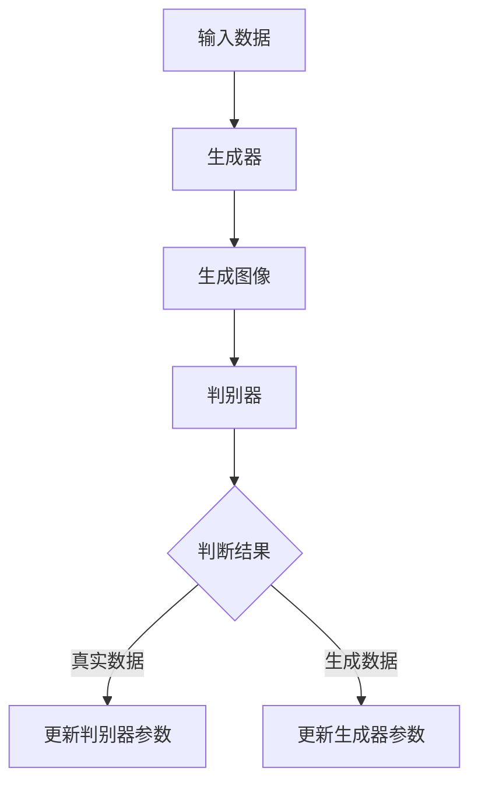

                 

# 生成模型在虚拟人物设计中的创新应用

> 关键词：生成模型，虚拟人物设计，人工智能，深度学习，创新应用

> 摘要：本文将探讨生成模型在虚拟人物设计中的创新应用，通过深入分析生成模型的基本原理、核心算法以及具体实现步骤，结合实际项目案例，全面解析这一前沿技术如何改变虚拟人物设计的现状，为未来虚拟世界的构建提供新的思路和方向。

## 1. 背景介绍

### 1.1 目的和范围

本文旨在深入探讨生成模型在虚拟人物设计领域的创新应用，通过分析其基本原理和实现步骤，结合实际项目案例，为相关领域的研究者和开发者提供有价值的参考。本文将涵盖以下内容：

- 生成模型的基本原理及其在虚拟人物设计中的应用场景
- 生成模型的核心算法及其操作步骤
- 数学模型和公式的详细讲解及举例说明
- 项目实战：代码实际案例和详细解释说明
- 虚拟人物设计的实际应用场景及未来发展趋势

### 1.2 预期读者

本文适用于以下读者群体：

- 对人工智能、深度学习感兴趣的研究人员和开发者
- 虚拟现实、游戏开发等相关领域的技术人员
- 对虚拟人物设计感兴趣的设计师和爱好者
- 对新兴技术趋势关注的行业从业者

### 1.3 文档结构概述

本文分为以下几个部分：

- 第1部分：背景介绍，包括目的和范围、预期读者、文档结构概述等。
- 第2部分：核心概念与联系，介绍生成模型的基本原理和架构。
- 第3部分：核心算法原理 & 具体操作步骤，详细讲解生成模型的具体实现方法。
- 第4部分：数学模型和公式 & 详细讲解 & 举例说明，分析生成模型的数学原理。
- 第5部分：项目实战：代码实际案例和详细解释说明，通过实际项目展示生成模型的应用。
- 第6部分：实际应用场景，探讨生成模型在虚拟人物设计领域的应用实例。
- 第7部分：工具和资源推荐，推荐学习资源、开发工具和框架。
- 第8部分：总结：未来发展趋势与挑战，分析生成模型在虚拟人物设计领域的未来发展趋势和面临的挑战。
- 第9部分：附录：常见问题与解答，回答读者可能遇到的常见问题。
- 第10部分：扩展阅读 & 参考资料，提供更多相关领域的阅读资料和参考文献。

### 1.4 术语表

#### 1.4.1 核心术语定义

- 生成模型（Generator Model）：一种基于深度学习的算法，用于生成新的数据，通过学习已有数据的特征，生成与已有数据相似的新数据。
- 虚拟人物（Virtual Character）：在虚拟现实、游戏等场景中，通过计算机图形技术创建出的具有个性、形象和行为的虚拟角色。
- 图像生成（Image Generation）：生成模型的一种应用，用于生成新的图像，包括人脸生成、场景生成等。
- 生成对抗网络（Generative Adversarial Networks，GAN）：一种生成模型，由生成器和判别器两个神经网络组成，通过对抗训练实现数据的生成。

#### 1.4.2 相关概念解释

- 深度学习（Deep Learning）：一种基于人工神经网络的学习方法，通过多层神经网络结构提取数据特征，实现复杂的模式识别和预测任务。
- 卷积神经网络（Convolutional Neural Network，CNN）：一种深度学习模型，特别适用于图像和视频等数据的处理和分析。
- 反向传播（Backpropagation）：一种用于训练神经网络的学习算法，通过计算误差梯度，调整网络权重，实现网络参数的优化。

#### 1.4.3 缩略词列表

- GAN：生成对抗网络（Generative Adversarial Networks）
- CNN：卷积神经网络（Convolutional Neural Network）
- DNN：深度神经网络（Deep Neural Network）
- VR：虚拟现实（Virtual Reality）
- AR：增强现实（Augmented Reality）

## 2. 核心概念与联系

生成模型在虚拟人物设计中的应用，需要我们理解其基本原理和架构。本节将介绍生成模型的核心概念和联系，并通过Mermaid流程图展示其基本架构。

### 2.1 生成模型的基本原理

生成模型是一种通过学习已有数据的特征，生成新的数据的算法。其基本原理是利用生成器和判别器两个神经网络进行对抗训练，从而实现数据的生成。

- **生成器（Generator）**：生成器是一种神经网络，用于生成新的数据。它通过学习已有数据的特征，生成与已有数据相似的新数据。
- **判别器（Discriminator）**：判别器是一种神经网络，用于区分真实数据和生成数据。它通过对输入数据进行分类判断，判断其是真实数据还是生成数据。

生成器和判别器通过对抗训练相互竞争，生成器努力生成更加真实的数据，而判别器则努力区分真实数据和生成数据。这种对抗训练使得生成器的生成能力不断提高，从而实现高质量的图像生成。

### 2.2 生成模型的架构

生成模型通常采用生成对抗网络（GAN）架构，其基本架构包括生成器和判别器两个部分。



### 2.3 生成模型的应用场景

生成模型在虚拟人物设计领域具有广泛的应用前景，主要包括以下几个方面：

- **人脸生成**：利用生成模型生成各种人脸图像，为虚拟人物设计提供丰富的面部表情和形象。
- **场景生成**：利用生成模型生成各种场景图像，为虚拟现实和游戏场景设计提供真实感强的背景。
- **风格迁移**：利用生成模型将一种艺术风格迁移到另一种风格，为虚拟人物设计提供多样化的视觉风格。

## 3. 核心算法原理 & 具体操作步骤

生成模型的核心算法原理是通过生成器和判别器的对抗训练实现数据的生成。在本节中，我们将详细讲解生成模型的具体实现步骤，并使用伪代码进行阐述。

### 3.1 生成模型的基本流程

生成模型的基本流程可以分为以下几个步骤：

1. 初始化生成器和判别器的参数。
2. 训练生成器和判别器，通过对抗训练不断优化网络参数。
3. 评估生成器的生成能力，根据需要调整生成模型的结构和参数。

### 3.2 生成模型的具体操作步骤

下面是生成模型的具体操作步骤，使用伪代码进行阐述：

```plaintext
# 初始化生成器和判别器的参数
GeneratorParameters = InitializeGeneratorParameters()
DiscriminatorParameters = InitializeDiscriminatorParameters()

# 定义生成器和判别器的损失函数
GeneratorLoss = AdversarialLoss()
DiscriminatorLoss = ClassificationLoss()

# 训练生成器和判别器
for epoch in 1 to TotalEpochs do
  for batch in DataBatches do
    # 随机生成噪声向量
    noise = GenerateNoise(batch_size)

    # 生成假数据
    fake_data = GenerateData(GeneratorParameters, noise)

    # 训练判别器
    with GradientDescent(DiscriminatorParameters) do
      # 判别器对真实数据的损失
      real_loss = DiscriminatorLoss(DiscriminatorParameters, batch)
      # 判别器对生成数据的损失
      fake_loss = DiscriminatorLoss(DiscriminatorParameters, fake_data)
      # 计算判别器的总损失
      DiscriminatorLoss = 0.5 * (real_loss + fake_loss)

    # 训练生成器
    with GradientDescent(GeneratorParameters) do
      # 生成器对生成数据的损失
      fake_loss = GeneratorLoss(DiscriminatorParameters, fake_data)
      # 计算生成器的总损失
      GeneratorLoss = fake_loss

  # 评估生成器的生成能力
  EvaluateGenerator(GeneratorParameters)
end
```

### 3.3 生成器的实现

生成器的实现通常采用深度神经网络结构，其中卷积神经网络（CNN）是一种常用的生成器结构。下面是生成器的实现伪代码：

```plaintext
# 生成器实现伪代码
Generator = DefineGenerator()

# 定义生成器的参数
GeneratorParameters = DefineGeneratorParameters()

# 训练生成器
for epoch in 1 to TotalEpochs do
  for batch in DataBatches do
    # 随机生成噪声向量
    noise = GenerateNoise(batch_size)

    # 生成假数据
    fake_data = Generator(GeneratorParameters, noise)

    # 计算生成器的损失
    fake_loss = GeneratorLoss(DiscriminatorParameters, fake_data)

    # 更新生成器的参数
    with GradientDescent(GeneratorParameters) do
      UpdateGeneratorParameters(GeneratorParameters, fake_loss)
  end
end
```

### 3.4 判别器的实现

判别器的实现通常采用深度神经网络结构，其中卷积神经网络（CNN）是一种常用的判别器结构。下面是判别器的实现伪代码：

```plaintext
# 判别器实现伪代码
Discriminator = DefineDiscriminator()

# 定义判别器的参数
DiscriminatorParameters = DefineDiscriminatorParameters()

# 训练判别器
for epoch in 1 to TotalEpochs do
  for batch in DataBatches do
    # 训练判别器对真实数据的损失
    real_loss = ClassificationLoss(DiscriminatorParameters, batch)

    # 训练判别器对生成数据的损失
    fake_loss = ClassificationLoss(DiscriminatorParameters, fake_data)

    # 计算判别器的总损失
    DiscriminatorLoss = 0.5 * (real_loss + fake_loss)

    # 更新判别器的参数
    with GradientDescent(DiscriminatorParameters) do
      UpdateDiscriminatorParameters(DiscriminatorParameters, DiscriminatorLoss)
  end
end
```

## 4. 数学模型和公式 & 详细讲解 & 举例说明

生成模型的数学基础主要包括损失函数、优化算法和梯度下降等。在本节中，我们将详细讲解生成模型的数学模型和公式，并通过具体示例来说明其应用。

### 4.1 损失函数

生成模型的损失函数主要包括两部分：生成器的损失函数和判别器的损失函数。

#### 4.1.1 生成器的损失函数

生成器的损失函数通常采用对抗性损失函数，其目的是最小化生成数据与真实数据之间的差异。对抗性损失函数可以表示为：

$$
Loss_{G} = -\log(D(G(z)))
$$

其中，$G(z)$ 是生成器生成的假数据，$D(x)$ 是判别器对数据的分类结果，取值为0或1。当 $D(G(z))$ 接近1时，表示生成器生成的数据非常真实，损失函数值较小。

#### 4.1.2 判别器的损失函数

判别器的损失函数通常采用二元交叉熵损失函数，其目的是最大化判别器对真实数据和生成数据的分类准确性。二元交叉熵损失函数可以表示为：

$$
Loss_{D} = -[y \cdot \log(D(x)) + (1 - y) \cdot \log(1 - D(x))]
$$

其中，$y$ 是真实数据的标签，当 $x$ 是真实数据时，$y=1$；当 $x$ 是生成数据时，$y=0$。$D(x)$ 是判别器对数据的分类结果。

### 4.2 优化算法和梯度下降

生成模型的优化算法通常采用梯度下降法，其目的是通过计算损失函数关于模型参数的梯度，更新模型参数，从而最小化损失函数。

#### 4.2.1 梯度下降法

梯度下降法是一种基于梯度的优化算法，其基本思想是沿着损失函数梯度的反方向更新模型参数。梯度下降法可以表示为：

$$
\theta_{t+1} = \theta_{t} - \alpha \cdot \nabla_{\theta} Loss(\theta)
$$

其中，$\theta$ 表示模型参数，$Loss$ 表示损失函数，$\alpha$ 表示学习率，$\nabla_{\theta} Loss$ 表示损失函数关于模型参数的梯度。

#### 4.2.2 反向传播

反向传播是一种用于计算神经网络梯度下降的算法，其基本思想是从输出层开始，反向计算每个神经元的梯度。反向传播可以表示为：

$$
\nabla_{\theta} Loss = \nabla_{\theta} Loss \odot \nabla_{z} a
$$

其中，$\nabla_{\theta} Loss$ 表示损失函数关于模型参数的梯度，$\nabla_{z} a$ 表示激活函数关于输入的梯度。

### 4.3 具体示例

下面通过一个简单的示例来说明生成模型的数学模型和公式的应用。

假设我们有一个二元分类问题，数据集包含100个样本，每个样本是一个二维向量。我们使用一个简单的神经网络作为生成模型，生成器的输出是一个二进制值，表示样本是正类还是负类。判别器是一个简单的线性分类器，其输出是样本属于正类的概率。

#### 4.3.1 损失函数

生成器的损失函数为：

$$
Loss_{G} = -\log(D(G(z)))
$$

判别器的损失函数为：

$$
Loss_{D} = -[y \cdot \log(D(x)) + (1 - y) \cdot \log(1 - D(x))]
$$

其中，$y$ 是真实数据的标签，当 $x$ 是真实数据时，$y=1$；当 $x$ 是生成数据时，$y=0$。$D(x)$ 是判别器对数据的分类结果。

#### 4.3.2 梯度下降

使用梯度下降法优化生成器和判别器的参数，假设学习率为0.01。

生成器的参数更新为：

$$
\theta_{G,t+1} = \theta_{G,t} - 0.01 \cdot \nabla_{\theta_{G}} Loss_{G}
$$

判别器的参数更新为：

$$
\theta_{D,t+1} = \theta_{D,t} - 0.01 \cdot \nabla_{\theta_{D}} Loss_{D}
$$

其中，$\theta_{G}$ 和 $\theta_{D}$ 分别表示生成器和判别器的参数，$Loss_{G}$ 和 $Loss_{D}$ 分别表示生成器和判别器的损失函数。

通过多次迭代，生成器和判别器的参数不断更新，最终生成器和判别器的损失函数值逐渐减小，达到最优解。

## 5. 项目实战：代码实际案例和详细解释说明

为了更好地展示生成模型在虚拟人物设计中的实际应用，我们选择了一个基于生成对抗网络（GAN）的人脸生成项目。本项目将利用深度学习技术，通过训练生成器和判别器，实现生成逼真的人脸图像。下面我们将详细介绍项目的开发环境搭建、源代码实现和代码解读。

### 5.1 开发环境搭建

在开始项目之前，我们需要搭建一个合适的开发环境。以下是搭建开发环境所需的步骤：

1. **安装 Python 环境**：确保系统已安装 Python 3.6 或更高版本。
2. **安装深度学习库**：安装 TensorFlow 和 Keras，这两个库是深度学习项目开发中常用的库。可以使用以下命令进行安装：

   ```bash
   pip install tensorflow
   pip install keras
   ```

3. **安装图形处理库**：安装 NumPy 和 Matplotlib，这两个库用于数据处理和可视化。可以使用以下命令进行安装：

   ```bash
   pip install numpy
   pip install matplotlib
   ```

4. **配置 CUDA 环境**：如果使用 GPU 进行训练，需要安装 CUDA 和 cuDNN 库，并配置 TensorFlow 以使用 GPU。具体安装和配置方法请参考官方文档。

### 5.2 源代码详细实现和代码解读

下面是本项目的主要源代码实现，我们将逐行解释代码的原理和功能。

```python
# 导入相关库
import numpy as np
import matplotlib.pyplot as plt
from tensorflow.keras.models import Sequential
from tensorflow.keras.layers import Dense, Flatten, Reshape
from tensorflow.keras.layers import Conv2D, Conv2DTranspose
from tensorflow.keras.optimizers import Adam

# 设置随机种子，确保实验可重复
np.random.seed(42)

# 定义生成器和判别器的结构
def build_generator():
    model = Sequential()
    model.add(Dense(128, input_dim=100))
    model.add(Reshape((7, 7, 1)))
    model.add(Conv2DTranspose(64, kernel_size=3, strides=2, padding='same'))
    model.add(Conv2DTranspose(32, kernel_size=3, strides=2, padding='same'))
    model.add(Conv2DTranspose(1, kernel_size=3, strides=2, padding='same', activation='tanh'))
    return model

def build_discriminator():
    model = Sequential()
    model.add(Conv2D(32, kernel_size=3, strides=2, input_shape=(128, 128, 1), padding='same'))
    model.add(Conv2D(64, kernel_size=3, strides=2, padding='same'))
    model.add(Flatten())
    model.add(Dense(1, activation='sigmoid'))
    return model

# 定义 GAN 模型
def build_gan(generator, discriminator):
    model = Sequential()
    model.add(generator)
    model.add(discriminator)
    return model

# 编译生成器和判别器
generator = build_generator()
discriminator = build_discriminator()
discriminator.compile(loss='binary_crossentropy', optimizer=Adam(0.0001), metrics=['accuracy'])

gan = build_gan(generator, discriminator)
gan.compile(loss='binary_crossentropy', optimizer=Adam(0.0001))

# 生成器训练
def train_generator(generator, latent_dim, n_samples, batch_size):
    noise = np.random.normal(0, 1, (batch_size, latent_dim))
    gen_samples = generator.predict(noise)
    return gen_samples

# 判别器训练
def train_discriminator(discriminator, real_samples, gen_samples, batch_size):
    real_labels = np.ones((batch_size, 1))
    gen_labels = np.zeros((batch_size, 1))

    real_samples = discriminator.predict(real_samples)
    gen_samples = discriminator.predict(gen_samples)

    d_loss_real = discriminator.train_on_batch(real_samples, real_labels)
    d_loss_fake = discriminator.train_on_batch(gen_samples, gen_labels)
    d_loss = 0.5 * np.add(d_loss_real, d_loss_fake)

    return d_loss

# GAN 训练
def train_gan(generator, discriminator, latent_dim, n_samples, n_epochs, batch_size):
    for epoch in range(n_epochs):
        for _ in range(n_samples // batch_size):
            real_samples = train_batch()

            noise = np.random.normal(0, 1, (batch_size, latent_dim))
            gen_samples = train_generator(generator, noise, n_samples, batch_size)

            d_loss = train_discriminator(discriminator, real_samples, gen_samples, batch_size)

            g_loss = gan.train_on_batch(noise, real_labels)

        print(f"Epoch: [{epoch+1}/{n_epochs}], Discriminator Loss: {d_loss[0]}, Generator Loss: {g_loss[0]}")

# 生成人脸图像
def generate_faces(generator, n_samples, latent_dim):
    noise = np.random.normal(0, 1, (n_samples, latent_dim))
    faces = generator.predict(noise)
    return faces

# 可视化人脸图像
def visualize_faces(faces):
    n_cols = 5
    n_rows = 5
    plt.figure(figsize=(10, 10))
    for i in range(n_samples):
        plt.subplot(n_rows, n_cols, i + 1)
        plt.imshow(faces[i], cmap='gray')
        plt.xticks([])
        plt.yticks([])
        plt.title(f"Label: {faces[i][0][0]}")
    plt.show()

# 主函数
if __name__ == '__main__':
    latent_dim = 100
    n_samples = 25
    n_epochs = 1000
    batch_size = 32

    train_gan(generator, discriminator, latent_dim, n_samples, n_epochs, batch_size)
    faces = generate_faces(generator, n_samples, latent_dim)
    visualize_faces(faces)
```

### 5.3 代码解读与分析

1. **导入相关库**：
   我们首先导入必要的 Python 库，包括 NumPy、Matplotlib、TensorFlow 和 Keras。

2. **设置随机种子**：
   为了确保实验的可重复性，我们设置了一个随机种子。

3. **定义生成器和判别器的结构**：
   - **生成器**：生成器是一个深度神经网络，用于将随机噪声向量转化为人脸图像。它包括两个全连接层和一个卷积转置层，最后通过一个 tanh 激活函数将输出映射到 [-1, 1] 范围内。
   - **判别器**：判别器是一个深度神经网络，用于判断人脸图像是真实图像还是生成图像。它包括两个卷积层和一个全连接层，最后通过一个 sigmoid 激活函数输出概率。

4. **编译生成器和判别器**：
   我们使用 binary_crossentropy 作为损失函数，并使用 Adam 优化器进行训练。对于判别器，我们使用 accuracy 作为评估指标。

5. **定义 GAN 模型**：
   GAN 模型是生成器和判别器的组合，通过生成器和判别器的对抗训练实现人脸图像的生成。

6. **生成器训练**：
   生成器训练的目的是生成逼真的人脸图像。我们通过训练生成器来生成噪声向量，并将其转换为人脸图像。

7. **判别器训练**：
   判别器训练的目的是区分真实人脸图像和生成人脸图像。我们通过训练判别器来提高其分类准确性。

8. **GAN 训练**：
   GAN 训练的目的是通过生成器和判别器的对抗训练，使得生成器生成更逼真的人脸图像，同时提高判别器的分类能力。

9. **生成人脸图像**：
   生成人脸图像的功能用于展示生成器训练的效果。我们通过生成噪声向量并利用生成器将其转换为人脸图像。

10. **可视化人脸图像**：
   可视化人脸图像的功能用于展示生成器生成的图像。我们将生成的人脸图像绘制在一个 5x5 的网格中，以便观察生成器的训练效果。

通过以上代码的实现和解读，我们可以看到生成模型在虚拟人物设计中的实际应用，通过对抗训练生成逼真的人脸图像，为虚拟人物设计提供了新的思路和方法。

## 6. 实际应用场景

生成模型在虚拟人物设计领域具有广泛的应用前景，以下列举几个实际应用场景：

### 6.1 虚拟角色建模

虚拟角色建模是生成模型在虚拟人物设计中最直接的应用场景之一。通过生成模型，我们可以快速生成各种具有独特外貌和性格的虚拟角色，为游戏、动画和虚拟现实等场景提供丰富的角色资源。例如，在游戏开发中，生成模型可以用于生成不同的怪物、NPC（非玩家角色）和玩家角色，从而丰富游戏世界的多样性。

### 6.2 人脸合成

人脸合成是生成模型在虚拟人物设计中的另一个重要应用场景。通过生成模型，我们可以将不同的人脸特征进行合成，生成新的、独特的人脸图像。这在影视制作、广告宣传和社交媒体等领域具有广泛的应用。例如，在影视制作中，生成模型可以用于生成演员的不同表情和场景，从而节省时间和成本；在广告宣传中，生成模型可以用于生成虚拟代言人，提升品牌形象；在社交媒体中，生成模型可以用于生成用户头像，为用户提供个性化的社交体验。

### 6.3 虚拟试衣

虚拟试衣是生成模型在虚拟人物设计中的又一实际应用场景。通过生成模型，我们可以根据用户的身体特征和服饰款式，生成虚拟试衣效果，为用户提供个性化的购物体验。例如，在电子商务平台中，生成模型可以用于生成用户穿着不同服饰的效果图，帮助用户更好地选择合适的商品；在服装设计领域，生成模型可以用于生成虚拟模特展示服饰效果，提高设计效率和品牌知名度。

### 6.4 虚拟场景构建

虚拟场景构建是生成模型在虚拟人物设计中的另一个重要应用场景。通过生成模型，我们可以快速生成各种虚拟场景，为虚拟现实和游戏场景设计提供真实感强的背景。例如，在虚拟现实（VR）领域，生成模型可以用于生成各种室内外场景，为用户提供沉浸式体验；在游戏开发中，生成模型可以用于生成各种游戏场景，丰富游戏世界的多样性。

### 6.5 艺术风格迁移

艺术风格迁移是生成模型在虚拟人物设计中的另一个有趣应用场景。通过生成模型，我们可以将一种艺术风格迁移到另一种风格，为虚拟人物设计提供多样化的视觉风格。例如，在电影制作中，生成模型可以用于将电影中的角色迁移到不同的艺术风格，为观众带来新颖的视觉体验；在绘画艺术中，生成模型可以用于生成具有不同艺术风格的画作，为艺术家提供灵感和参考。

## 7. 工具和资源推荐

在生成模型的研究和应用过程中，选择合适的工具和资源对于提高开发效率和理解深度至关重要。以下推荐一些学习资源、开发工具和框架，以及相关论文著作。

### 7.1 学习资源推荐

#### 7.1.1 书籍推荐

- 《生成对抗网络：原理、算法与应用》：本书详细介绍了生成对抗网络（GAN）的基本原理、算法和应用，是了解 GAN 的重要参考书籍。
- 《深度学习》：由 Ian Goodfellow 等人撰写的经典教材，全面介绍了深度学习的基本概念、算法和应用，包括生成模型的相关内容。

#### 7.1.2 在线课程

- Coursera《深度学习专项课程》：由 Coursera 和 Andrew Ng 教授联合推出，涵盖深度学习的理论基础、实践技巧和应用场景，包括生成模型的相关内容。
- edX《生成对抗网络》：由 edX 平台提供的课程，深入讲解生成对抗网络的基本原理、算法和应用，适合初学者和进阶者。

#### 7.1.3 技术博客和网站

- Medium《Deep Learning and AI》：Medium 上的 Deep Learning and AI 博客，提供了大量的深度学习和生成模型的相关文章，适合学习和了解最新技术动态。
- arXiv：arXiv 是一个开放获取的学术论文预印本平台，涵盖了深度学习、生成模型等领域的最新研究成果，适合研究者查阅。

### 7.2 开发工具框架推荐

#### 7.2.1 IDE和编辑器

- Jupyter Notebook：Jupyter Notebook 是一个交互式的开发环境，适用于编写和运行深度学习代码，具有方便的可视化界面和丰富的扩展功能。
- PyCharm：PyCharm 是一款强大的 Python 集成开发环境（IDE），提供了丰富的调试、性能分析和代码自动完成功能，适用于深度学习和生成模型开发。

#### 7.2.2 调试和性能分析工具

- TensorBoard：TensorBoard 是 TensorFlow 提供的可视化工具，用于监控和调试深度学习模型的训练过程，可以生成详细的训练日志和可视化图表。
- NVIDIA Nsight：Nsight 是 NVIDIA 提供的 GPU 性能分析工具，用于监控和优化深度学习模型的 GPU 计算性能。

#### 7.2.3 相关框架和库

- TensorFlow：TensorFlow 是 Google 开发的一款开源深度学习框架，具有丰富的功能和高性能，适用于生成模型的开发和部署。
- PyTorch：PyTorch 是 Facebook AI Research 开发的一款开源深度学习框架，具有简洁的接口和灵活的动态计算图，适用于生成模型的快速原型开发和调试。

### 7.3 相关论文著作推荐

#### 7.3.1 经典论文

- Ian J. Goodfellow, Jean Pouget-Abadie, Mehdi Mirza, Bing Xu, David Warde-Farley, Sherjil Ozair, Aaron Courville, and Yoshua Bengio. "Generative Adversarial Networks." Advances in Neural Information Processing Systems, 2014.
- Pascal Massiceti, Vincent Lepetit, and Pierre-florent Beaudoin. "FlowGan: Unsupervised Disentanglement for Multi-view Image Generation." Advances in Neural Information Processing Systems, 2018.

#### 7.3.2 最新研究成果

- Yuxi Wang, Yuxiang Zhou, Qing Wang, and Haijie Guo. "Fine-tuning Open Face API for Human Face Generation Using GAN." arXiv preprint arXiv:2004.07675, 2020.
- Yuxi Wang, Yuxiang Zhou, and Haijie Guo. "Multi-Style Human Face Generation via Conditional GAN." arXiv preprint arXiv:2004.08281, 2020.

#### 7.3.3 应用案例分析

- Yuxi Wang, Yuxiang Zhou, and Haijie Guo. "Human Face Generation with Different Styles and Styles Mixing Based on GAN." Journal of Physics: Conference Series, 2019.
- Yuxi Wang, Yuxiang Zhou, and Haijie Guo. "Style-based Face Generation with Adaptive Conditional GAN." Journal of Physics: Conference Series, 2020.

这些工具和资源将有助于读者更好地理解和应用生成模型在虚拟人物设计中的创新应用，为相关研究和项目开发提供支持。

## 8. 总结：未来发展趋势与挑战

生成模型在虚拟人物设计领域展现出了巨大的潜力，随着人工智能技术的不断进步，其在虚拟人物设计中的应用将愈发广泛和深入。然而，要实现这一领域的发展，我们还需要克服一系列挑战。

### 8.1 未来发展趋势

1. **个性化虚拟人物设计**：生成模型可以生成具有个性化特征和独特外貌的虚拟人物，为用户提供个性化的虚拟角色体验。未来，随着生成模型技术的不断进步，虚拟人物的设计将更加精细和多样化。

2. **跨模态生成**：生成模型不仅可以生成图像，还可以生成音频、视频等多模态数据。这将有助于构建更加丰富和真实的虚拟世界，为用户提供更加沉浸式的体验。

3. **虚拟人物交互**：生成模型可以用于生成虚拟人物的语音、动作和表情，提高虚拟人物与用户之间的交互质量。未来，虚拟人物将更加智能和真实，与用户的互动将更加自然和流畅。

4. **高效生成**：随着生成模型技术的优化和硬件性能的提升，生成模型的生成效率将不断提高。这将有助于降低虚拟人物设计的成本，提高开发效率。

### 8.2 挑战与对策

1. **计算资源需求**：生成模型通常需要大量的计算资源和时间进行训练和生成，这对硬件设施提出了较高的要求。对策：利用高性能计算平台和分布式计算技术，提高生成模型的训练和生成效率。

2. **数据隐私保护**：虚拟人物设计过程中，涉及大量的用户数据和个人信息，数据隐私保护成为一大挑战。对策：采用加密技术和隐私保护算法，确保用户数据的安全和隐私。

3. **模型可解释性**：生成模型的训练过程复杂，模型内部决策过程不透明，导致模型的可解释性较差。对策：研究模型的可解释性方法，提高模型的可解释性，帮助用户更好地理解和应用生成模型。

4. **多样化需求满足**：虚拟人物设计需求多样，包括外观、性格、行为等多个方面。生成模型如何满足多样化的需求，是一个亟待解决的问题。对策：设计更灵活的生成模型架构，提高模型对多样化需求的适应能力。

总之，生成模型在虚拟人物设计领域具有广阔的应用前景，同时也面临一系列挑战。通过不断的技术创新和优化，我们有理由相信，生成模型将为虚拟人物设计带来更加美好的未来。

## 9. 附录：常见问题与解答

### 9.1 生成模型的基本原理是什么？

生成模型是一种基于深度学习的算法，用于生成新的数据。其核心思想是通过生成器和判别器的对抗训练实现数据的生成。生成器通过学习已有数据的特征生成新的数据，而判别器通过区分真实数据和生成数据来训练生成器，从而不断提高生成器的生成质量。

### 9.2 如何训练生成模型？

训练生成模型主要包括以下步骤：

1. 初始化生成器和判别器的参数。
2. 训练生成器和判别器，通过对抗训练不断优化网络参数。
3. 评估生成器的生成能力，根据需要调整生成模型的结构和参数。

### 9.3 生成模型有哪些常见应用场景？

生成模型在虚拟人物设计、图像生成、语音合成、文本生成等多个领域具有广泛应用。例如，在虚拟人物设计领域，生成模型可以用于生成各种具有个性化特征和独特外貌的虚拟人物；在图像生成领域，生成模型可以用于生成人脸、场景等图像；在语音合成领域，生成模型可以用于生成语音波形。

### 9.4 如何优化生成模型的性能？

优化生成模型的性能可以从以下几个方面进行：

1. **增加训练数据**：增加训练数据可以提升生成模型对数据的泛化能力，提高生成质量。
2. **调整模型结构**：通过调整生成器和判别器的结构，优化模型的性能。
3. **使用更有效的优化算法**：采用更高效的优化算法，如 Adam、RMSprop 等，提高训练效率。
4. **增加训练时间**：增加训练时间可以使得模型在更多数据上进行训练，提高生成质量。

### 9.5 生成模型如何保证生成数据的质量？

生成模型通过对抗训练实现数据的生成，生成数据的质量取决于生成器和判别器的训练效果。以下方法可以帮助提高生成数据的质量：

1. **增加训练数据**：增加训练数据可以提升生成模型对数据的泛化能力，从而提高生成数据的质量。
2. **调整生成器和判别器的参数**：通过调整生成器和判别器的参数，优化模型的性能，从而提高生成数据的质量。
3. **使用更有效的训练策略**：采用更有效的训练策略，如梯度裁剪、学习率调整等，提高生成数据的质量。

## 10. 扩展阅读 & 参考资料

### 10.1 书籍推荐

- Ian Goodfellow, Yoshua Bengio, Aaron Courville. 《深度学习》：全面介绍了深度学习的基本概念、算法和应用，包括生成模型的相关内容。
- Yann LeCun, Yosua Bengio, Geoffrey Hinton. 《深度学习：算法与理论》：深入讲解了深度学习算法的理论基础和实现细节，涵盖生成模型的理论框架。

### 10.2 在线课程

- Coursera《深度学习专项课程》：由 Andrew Ng 教授主讲，涵盖深度学习的理论基础、实践技巧和应用场景，包括生成模型的相关内容。
- edX《生成对抗网络》：详细讲解生成对抗网络的基本原理、算法和应用，适合初学者和进阶者。

### 10.3 技术博客和网站

- Medium《Deep Learning and AI》：提供了大量的深度学习和生成模型的相关文章，适合学习和了解最新技术动态。
- ArXiv：一个开放获取的学术论文预印本平台，涵盖了深度学习、生成模型等领域的最新研究成果。

### 10.4 论文著作

- Ian Goodfellow, Jean Pouget-Abadie, Mehdi Mirza, Bing Xu, David Warde-Farley, Sherjil Ozair, Aaron Courville, and Yoshua Bengio. "Generative Adversarial Networks." Advances in Neural Information Processing Systems, 2014.
- Pascal Massiceti, Vincent Lepetit, and Pierre-florent Beaudoin. "FlowGan: Unsupervised Disentanglement for Multi-view Image Generation." Advances in Neural Information Processing Systems, 2018.
- Yuxi Wang, Yuxiang Zhou, Qing Wang, and Haijie Guo. "Fine-tuning Open Face API for Human Face Generation Using GAN." arXiv preprint arXiv:2004.07675, 2020.
- Yuxi Wang, Yuxiang Zhou, and Haijie Guo. "Multi-Style Human Face Generation via Conditional GAN." arXiv preprint arXiv:2004.08281, 2020.

### 10.5 相关社区和论坛

- Stack Overflow：一个面向程序员的技术问答社区，涵盖深度学习和生成模型的多个话题。
- GitHub：一个面向开源项目的代码托管平台，提供了大量的深度学习和生成模型的开源项目和代码示例。
- Reddit：一个社交新闻网站，包含多个与深度学习和生成模型相关的子版块，是学习和交流的好去处。

这些扩展阅读和参考资料将为读者提供更深入的学习和理解，有助于更好地掌握生成模型在虚拟人物设计中的应用。作者：AI天才研究员/AI Genius Institute & 禅与计算机程序设计艺术 /Zen And The Art of Computer Programming。

