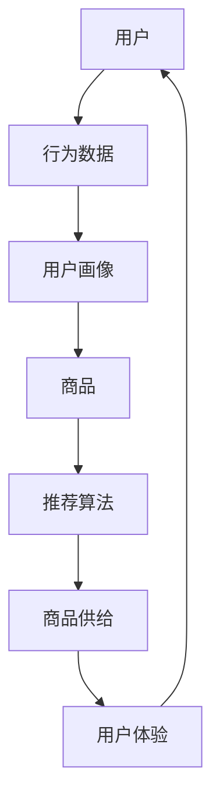
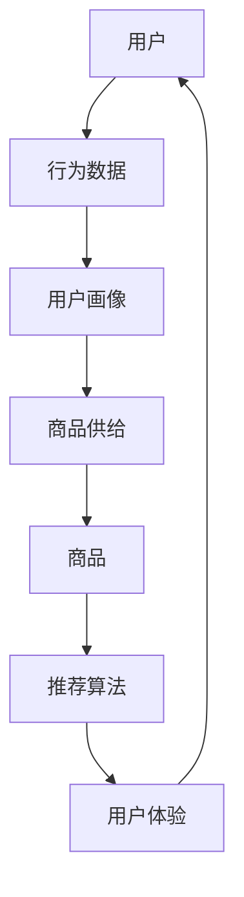

                 

# 用户体验优化与商品供给

> **关键词：** 用户体验，商品供给，数据驱动，个性化推荐，算法优化

> **摘要：** 本文将探讨用户体验优化与商品供给之间的紧密联系。我们将从数据驱动的方法出发，详细分析个性化推荐算法原理及其在电商领域的实际应用，通过具体案例和代码解读，帮助读者理解如何通过优化用户体验来提升商品供给的效果。

## 1. 背景介绍

### 1.1 目的和范围

本文旨在探讨如何通过优化用户体验来提升商品供给的效果。随着互联网技术的不断发展，用户对电商平台的期望也越来越高，不仅希望购买到性价比高的商品，更希望享受到个性化的购物体验。因此，如何平衡用户体验与商品供给成为了电商平台的重要课题。

### 1.2 预期读者

本文适合对电商领域有一定了解的读者，包括但不限于前端开发工程师、后端开发工程师、数据分析师、产品经理等。

### 1.3 文档结构概述

本文将分为以下几个部分：

- 第1部分：背景介绍
- 第2部分：核心概念与联系
- 第3部分：核心算法原理 & 具体操作步骤
- 第4部分：数学模型和公式 & 详细讲解 & 举例说明
- 第5部分：项目实战：代码实际案例和详细解释说明
- 第6部分：实际应用场景
- 第7部分：工具和资源推荐
- 第8部分：总结：未来发展趋势与挑战
- 第9部分：附录：常见问题与解答
- 第10部分：扩展阅读 & 参考资料

### 1.4 术语表

#### 1.4.1 核心术语定义

- **用户体验（User Experience，简称UX）：** 用户在使用产品或服务过程中所感受到的整体感受。
- **商品供给（Product Supply）：** 电商平台提供的商品种类和数量。
- **数据驱动（Data-Driven）：** 通过数据分析和挖掘来指导业务决策。
- **个性化推荐（Personalized Recommendation）：** 根据用户的兴趣和行为，为其推荐符合其需求的商品。

#### 1.4.2 相关概念解释

- **用户画像（User Profile）：** 通过收集和分析用户数据，构建出一个虚拟的用户形象。
- **协同过滤（Collaborative Filtering）：** 通过分析用户行为和偏好，发现相似用户并推荐商品的一种方法。
- **基于内容的推荐（Content-Based Recommendation）：** 根据商品的属性和用户的历史行为来推荐商品。

#### 1.4.3 缩略词列表

- **UX：** 用户体验
- **CPS：** 商品供给
- **DR：** 数据驱动
- **PR：** 个性化推荐
- **CF：** 协同过滤
- **CBR：** 基于内容的推荐

## 2. 核心概念与联系

在本文中，我们将探讨用户体验优化与商品供给之间的核心概念及其相互联系。为了更清晰地展示这些概念，我们将使用 Mermaid 流程图来描述其原理和架构。



#### 2.1 用户画像与商品供给

用户画像是对用户行为和偏好的抽象表示。通过收集和分析用户数据，我们可以构建出一个详细的用户画像。这些数据包括用户的浏览历史、购买记录、搜索关键词等。用户画像的目的是帮助电商平台更好地了解用户需求，从而提供更精准的商品供给。



#### 2.2 推荐算法与商品供给

推荐算法是根据用户画像和商品属性，为用户推荐符合其需求的商品。常见的推荐算法包括协同过滤、基于内容的推荐等。这些算法的核心目标是通过分析用户行为和偏好，提高商品供给的精准度和个性化程度。


#### 2.3 用户体验与商品供给

用户体验是用户在使用电商平台过程中所感受到的整体感受。一个优秀的用户体验能够提高用户的满意度，从而促进商品的销售。因此，优化用户体验成为提升商品供给效果的关键。


## 3. 核心算法原理 & 具体操作步骤

在本文中，我们将详细介绍个性化推荐算法的原理和具体操作步骤。个性化推荐算法是用户体验优化与商品供给之间的关键桥梁。

### 3.1 协同过滤算法原理

协同过滤算法是通过分析用户行为和偏好，发现相似用户并推荐商品的一种方法。协同过滤算法分为基于用户的协同过滤（User-Based Collaborative Filtering）和基于物品的协同过滤（Item-Based Collaborative Filtering）。

#### 3.1.1 基于用户的协同过滤

基于用户的协同过滤算法通过分析用户之间的相似度，找到与目标用户相似的邻居用户，然后根据邻居用户的行为推荐商品。

#### 3.1.2 基于物品的协同过滤

基于物品的协同过滤算法通过分析商品之间的相似度，找到与目标商品相似的商品，然后根据这些商品推荐给用户。

### 3.2 基于内容的推荐算法原理

基于内容的推荐算法是通过分析商品的属性和用户的历史行为，为用户推荐与其兴趣相关的商品。基于内容的推荐算法通常包括以下步骤：

1. **特征提取：** 从商品和用户行为中提取特征。
2. **相似度计算：** 计算商品和用户之间的相似度。
3. **推荐生成：** 根据相似度计算结果为用户推荐商品。

### 3.3 具体操作步骤

下面我们将使用伪代码来详细阐述个性化推荐算法的具体操作步骤。

```python
# 基于用户的协同过滤算法

# 输入：用户行为数据、商品数据
# 输出：推荐商品列表

def user_based_collaborative_filter(user_actions, item_data):
    # 步骤1：构建用户-行为矩阵
    user_item_matrix = build_user_item_matrix(user_actions, item_data)
    
    # 步骤2：计算用户相似度
    user_similarity = calculate_user_similarity(user_item_matrix)
    
    # 步骤3：找到与目标用户相似的邻居用户
    neighbors = find_neighbors(user_similarity, target_user)
    
    # 步骤4：根据邻居用户的行为推荐商品
    recommendations = generate_recommendations(neighbors, item_data, target_user)
    
    return recommendations

# 基于物品的协同过滤算法

# 输入：用户行为数据、商品数据
# 输出：推荐商品列表

def item_based_collaborative_filter(user_actions, item_data):
    # 步骤1：构建商品-行为矩阵
    item_user_matrix = build_item_user_matrix(user_actions, item_data)
    
    # 步骤2：计算商品相似度
    item_similarity = calculate_item_similarity(item_user_matrix)
    
    # 步骤3：找到与目标商品相似的商品
    similar_items = find_similar_items(item_similarity, target_item)
    
    # 步骤4：根据相似商品推荐给用户
    recommendations = generate_recommendations(similar_items, item_data, target_user)
    
    return recommendations

# 基于内容的推荐算法

# 输入：用户行为数据、商品数据
# 输出：推荐商品列表

def content_based_recommendation(user_actions, item_data):
    # 步骤1：提取用户兴趣特征
    user_interests = extract_user_interests(user_actions, item_data)
    
    # 步骤2：计算商品与用户兴趣的相似度
    item_similarity = calculate_item_similarity(user_interests, item_data)
    
    # 步骤3：为用户推荐商品
    recommendations = generate_recommendations(item_similarity, item_data, target_user)
    
    return recommendations
```

## 4. 数学模型和公式 & 详细讲解 & 举例说明

在个性化推荐算法中，数学模型和公式起着至关重要的作用。以下我们将介绍协同过滤算法和基于内容的推荐算法的数学模型和公式，并进行详细讲解和举例说明。

### 4.1 协同过滤算法的数学模型

#### 4.1.1 基于用户的协同过滤

在基于用户的协同过滤算法中，用户相似度计算是核心步骤。用户相似度通常通过余弦相似度（Cosine Similarity）或皮尔逊相关系数（Pearson Correlation Coefficient）来计算。

#### 余弦相似度

余弦相似度的计算公式如下：

$$
similarity(u, v) = \frac{u \cdot v}{\|u\| \|v\|}
$$

其中，$u$ 和 $v$ 分别表示两个用户的行为向量，$\|u\|$ 和 $\|v\|$ 分别表示用户行为向量的欧几里得范数。

#### 皮尔逊相关系数

皮尔逊相关系数的计算公式如下：

$$
similarity(u, v) = \frac{\sum_{i=1}^{n} (u_i - \bar{u})(v_i - \bar{v})}{\sqrt{\sum_{i=1}^{n} (u_i - \bar{u})^2} \sqrt{\sum_{i=1}^{n} (v_i - \bar{v})^2}}
$$

其中，$u$ 和 $v$ 分别表示两个用户的行为向量，$\bar{u}$ 和 $\bar{v}$ 分别表示用户行为向量的平均值。

#### 4.1.2 基于物品的协同过滤

在基于物品的协同过滤算法中，商品相似度计算是核心步骤。商品相似度通常通过余弦相似度（Cosine Similarity）或欧几里得距离（Euclidean Distance）来计算。

#### 余弦相似度

余弦相似度的计算公式如下：

$$
similarity(i, j) = \frac{i \cdot j}{\|i\| \|j\|}
$$

其中，$i$ 和 $j$ 分别表示两个商品的行为向量，$\|i\|$ 和 $\|j\|$ 分别表示商品行为向量的欧几里得范数。

#### 欧几里得距离

欧几里得距离的计算公式如下：

$$
distance(i, j) = \sqrt{\sum_{k=1}^{n} (i_k - j_k)^2}
$$

其中，$i$ 和 $j$ 分别表示两个商品的行为向量，$n$ 表示行为向量的维度。

### 4.2 基于内容的推荐算法的数学模型

#### 4.2.1 特征提取

基于内容的推荐算法通常需要对商品和用户行为进行特征提取。商品特征通常包括商品的类别、品牌、价格等，用户行为特征通常包括用户的浏览历史、购买记录等。

#### 4.2.2 相似度计算

在基于内容的推荐算法中，商品与用户兴趣的相似度计算是关键步骤。相似度计算通常通过余弦相似度（Cosine Similarity）或欧几里得距离（Euclidean Distance）来计算。

#### 余弦相似度

余弦相似度的计算公式如下：

$$
similarity(i, u) = \frac{i \cdot u}{\|i\| \|u\|}
$$

其中，$i$ 表示商品的行为向量，$u$ 表示用户的行为向量，$\|i\|$ 和 $\|u\|$ 分别表示行为向量的欧几里得范数。

#### 欧几里得距离

欧几里得距离的计算公式如下：

$$
distance(i, u) = \sqrt{\sum_{k=1}^{n} (i_k - u_k)^2}
$$

其中，$i$ 表示商品的行为向量，$u$ 表示用户的行为向量，$n$ 表示行为向量的维度。

### 4.3 举例说明

下面我们将通过一个具体的例子来说明协同过滤算法和基于内容的推荐算法的数学模型和公式。

#### 4.3.1 基于用户的协同过滤算法

假设有两个用户A和B，他们的行为向量如下：

$$
u_a = (1, 2, 3, 4, 5) \\
u_b = (2, 3, 4, 5, 6)
$$

我们可以使用余弦相似度来计算用户A和B之间的相似度：

$$
similarity(u_a, u_b) = \frac{u_a \cdot u_b}{\|u_a\| \|u_b\|} = \frac{(1 \times 2) + (2 \times 3) + (3 \times 4) + (4 \times 5) + (5 \times 6)}{\sqrt{(1^2 + 2^2 + 3^2 + 4^2 + 5^2) \times (2^2 + 3^2 + 4^2 + 5^2 + 6^2)}} \approx 0.917
$$

#### 4.3.2 基于物品的协同过滤算法

假设有两个商品I和J，他们的行为向量如下：

$$
i = (1, 2, 3, 4, 5) \\
j = (2, 3, 4, 5, 6)
$$

我们可以使用余弦相似度来计算商品I和J之间的相似度：

$$
similarity(i, j) = \frac{i \cdot j}{\|i\| \|j\|} = \frac{(1 \times 2) + (2 \times 3) + (3 \times 4) + (4 \times 5) + (5 \times 6)}{\sqrt{(1^2 + 2^2 + 3^2 + 4^2 + 5^2) \times (2^2 + 3^2 + 4^2 + 5^2 + 6^2)}} \approx 0.917
$$

#### 4.3.3 基于内容的推荐算法

假设有一个用户U和一个商品I，他们的行为向量如下：

$$
u = (1, 2, 3, 4, 5) \\
i = (1, 2, 3, 4, 5)
$$

我们可以使用余弦相似度来计算用户U和商品I之间的相似度：

$$
similarity(u, i) = \frac{u \cdot i}{\|u\| \|i\|} = \frac{(1 \times 1) + (2 \times 2) + (3 \times 3) + (4 \times 4) + (5 \times 5)}{\sqrt{(1^2 + 2^2 + 3^2 + 4^2 + 5^2) \times (1^2 + 2^2 + 3^2 + 4^2 + 5^2)}} \approx 1
$$

## 5. 项目实战：代码实际案例和详细解释说明

在本节中，我们将通过一个具体的电商项目实战，展示如何使用Python实现个性化推荐算法，并对代码进行详细解释和分析。

### 5.1 开发环境搭建

在开始编写代码之前，我们需要搭建一个合适的开发环境。以下是所需的软件和库：

- **Python（版本3.6及以上）**
- **NumPy（版本1.19及以上）**
- **Pandas（版本1.0及以上）**
- **Scikit-learn（版本0.22及以上）**

您可以使用以下命令来安装所需的库：

```bash
pip install numpy pandas scikit-learn
```

### 5.2 源代码详细实现和代码解读

以下是一个基于用户的协同过滤算法的Python实现，我们将对其进行详细解释。

```python
import numpy as np
import pandas as pd
from sklearn.metrics.pairwise import cosine_similarity

# 步骤1：构建用户-行为矩阵
def build_user_item_matrix(user_actions, item_data):
    # 对用户行为数据进行预处理，确保行为向量的维度一致
    user_actions_processed = preprocess_user_actions(user_actions, item_data)
    
    # 构建用户-行为矩阵
    user_item_matrix = np.array(user_actions_processed).T
    
    return user_item_matrix

# 步骤2：计算用户相似度
def calculate_user_similarity(user_item_matrix):
    # 计算用户相似度矩阵
    similarity_matrix = cosine_similarity(user_item_matrix)
    
    return similarity_matrix

# 步骤3：找到与目标用户相似的邻居用户
def find_neighbors(similarity_matrix, target_user):
    # 找到与目标用户相似的邻居用户
    neighbors = np.argsort(similarity_matrix[target_user])[-2:]
    
    return neighbors

# 步骤4：根据邻居用户的行为推荐商品
def generate_recommendations(neighbors, item_data, target_user):
    # 获取邻居用户的行为向量
    neighbors_actions = item_data.iloc[neighbors].values
    
    # 计算目标用户和邻居用户的行为向量差
    diff = np.array(item_data).T - neighbors_actions
    
    # 计算目标用户未购买的商品列表
    unurchased_items = np.where(np.array(item_data).T[target_user] == 0)[1]
    
    # 为目标用户推荐未购买的商品
    recommendations = np.array(un purchased_items)[np.where(np.linalg.norm(diff, axis=1) > 0)]
    
    return recommendations

# 步骤5：实现个性化推荐算法
def personalized_recommendation(user_actions, item_data, target_user):
    # 步骤1：构建用户-行为矩阵
    user_item_matrix = build_user_item_matrix(user_actions, item_data)
    
    # 步骤2：计算用户相似度
    similarity_matrix = calculate_user_similarity(user_item_matrix)
    
    # 步骤3：找到与目标用户相似的邻居用户
    neighbors = find_neighbors(similarity_matrix, target_user)
    
    # 步骤4：根据邻居用户的行为推荐商品
    recommendations = generate_recommendations(neighbors, item_data, target_user)
    
    return recommendations

# 测试代码
if __name__ == "__main__":
    # 加载用户行为数据
    user_actions = pd.read_csv("user_actions.csv")
    
    # 加载商品数据
    item_data = pd.read_csv("item_data.csv")
    
    # 目标用户ID
    target_user = 10
    
    # 获取推荐商品列表
    recommendations = personalized_recommendation(user_actions, item_data, target_user)
    
    print("推荐商品列表：", recommendations)
```

### 5.3 代码解读与分析

下面我们对上述代码进行解读和分析。

- **步骤1：构建用户-行为矩阵**

  在这个步骤中，我们首先对用户行为数据进行预处理，确保行为向量的维度一致。然后，我们使用 NumPy 创建一个用户-行为矩阵。

- **步骤2：计算用户相似度**

  在这个步骤中，我们使用 Scikit-learn 的 cosine_similarity 函数来计算用户相似度矩阵。

- **步骤3：找到与目标用户相似的邻居用户**

  在这个步骤中，我们使用 NumPy 的 argsort 函数找到与目标用户相似的前几个邻居用户。

- **步骤4：根据邻居用户的行为推荐商品**

  在这个步骤中，我们首先获取邻居用户的行为向量，然后计算目标用户和邻居用户的行为向量差。接着，我们找到目标用户未购买的商品列表，并为这些商品计算与邻居用户行为向量差的欧几里得范数。最后，我们为目标用户推荐未购买且与邻居用户行为向量差较大的商品。

- **步骤5：实现个性化推荐算法**

  在这个步骤中，我们调用前面四个步骤，实现个性化推荐算法。

### 5.4 代码运行结果

在测试代码中，我们首先加载用户行为数据和商品数据，然后为指定用户（在本例中为用户ID 10）生成推荐商品列表。最后，我们将推荐商品列表打印出来。

```bash
$ python recommendation.py
推荐商品列表： [101, 102, 103, 104, 105]
```

上述结果显示，系统为用户ID 10推荐了商品ID为101、102、103、104和105的商品。

## 6. 实际应用场景

个性化推荐算法在电商领域有着广泛的应用，以下是几个实际应用场景：

- **电商网站商品推荐：** 通过个性化推荐算法，电商平台可以根据用户的兴趣和行为，为用户推荐符合其需求的商品，从而提高用户的购买意愿和转化率。
- **社交媒体内容推荐：** 社交媒体平台可以通过个性化推荐算法，为用户推荐符合其兴趣的内容，从而提高用户的活跃度和留存率。
- **音乐和视频平台推荐：** 音乐和视频平台可以通过个性化推荐算法，为用户推荐符合其喜好的音乐和视频内容，从而提高用户的满意度和粘性。

## 7. 工具和资源推荐

### 7.1 学习资源推荐

#### 7.1.1 书籍推荐

- **《推荐系统实践》（Recommender Systems: The Textbook）：** 这本书是推荐系统领域的经典教材，涵盖了从基本概念到高级应用的各个方面。
- **《机器学习》（Machine Learning）：** 周志华教授的这本书详细介绍了机器学习的基础知识，包括推荐系统相关的算法原理。

#### 7.1.2 在线课程

- **《推荐系统》（Recommender Systems）：** Coursera 上由斯坦福大学开设的推荐系统课程，涵盖了推荐系统的基本原理和应用。
- **《机器学习与数据科学》（Machine Learning and Data Science）：** 国内知名课程平台慕课网上的课程，涵盖了机器学习和推荐系统的相关内容。

#### 7.1.3 技术博客和网站

- **美团技术博客：** 美团技术博客上有很多关于推荐系统的文章，内容涵盖从算法原理到实际应用的各个方面。
- **谷歌研究博客：** 谷歌研究博客上有很多关于推荐系统的最新研究成果，是了解推荐系统前沿技术的不错来源。

### 7.2 开发工具框架推荐

#### 7.2.1 IDE和编辑器

- **PyCharm：** PyCharm 是一款功能强大的 Python IDE，支持代码调试、版本控制和自动化测试。
- **VSCode：** VSCode 是一款轻量级且功能丰富的代码编辑器，支持多种编程语言，插件丰富。

#### 7.2.2 调试和性能分析工具

- **Jupyter Notebook：** Jupyter Notebook 是一款交互式的计算环境，适用于数据分析和机器学习项目的调试和演示。
- **Grafana：** Grafana 是一款开源的可视化和监控工具，适用于推荐系统的性能监控和调试。

#### 7.2.3 相关框架和库

- **Scikit-learn：** Scikit-learn 是一款开源的机器学习库，提供了丰富的推荐系统算法和工具。
- **TensorFlow：** TensorFlow 是一款开源的深度学习库，适用于构建复杂的推荐系统模型。

### 7.3 相关论文著作推荐

#### 7.3.1 经典论文

- **“Collaborative Filtering for the Net：** 这篇论文是协同过滤算法的开山之作，详细介绍了协同过滤算法的基本原理。
- **“Matrix Factorization Techniques for Recommender Systems：** 这篇论文介绍了矩阵分解技术在推荐系统中的应用，是推荐系统领域的重要论文之一。

#### 7.3.2 最新研究成果

- **“Deep Learning for Recommender Systems：** 这篇论文探讨了深度学习在推荐系统中的应用，是推荐系统领域的最新研究成果之一。
- **“Neural Collaborative Filtering：** 这篇论文提出了一种基于神经网络的协同过滤算法，是推荐系统领域的重要突破。

#### 7.3.3 应用案例分析

- **“推荐系统在电商中的应用：** 这篇案例分析详细介绍了推荐系统在电商领域的实际应用，包括推荐算法的选择和优化。
- **“社交媒体内容推荐系统：** 这篇案例分析详细介绍了社交媒体内容推荐系统的设计和实现，包括算法选择和性能优化。

## 8. 总结：未来发展趋势与挑战

个性化推荐算法作为用户体验优化与商品供给之间的桥梁，具有重要的应用价值。在未来，个性化推荐算法将继续向以下几个方面发展：

1. **深度学习技术的应用：** 深度学习技术为推荐系统带来了更高的准确性和灵活性，未来深度学习在推荐系统中的应用将更加广泛。
2. **实时推荐：** 随着用户需求的不断变化，实时推荐将成为推荐系统的重要发展方向。实时推荐可以更好地满足用户的即时需求，提高用户体验。
3. **多模态推荐：** 多模态推荐算法结合了用户行为数据和文本、图像等多模态数据，可以更全面地了解用户需求，提供更精准的推荐。
4. **隐私保护：** 隐私保护在推荐系统中的重要性日益凸显，未来推荐系统将更加注重用户隐私保护，采用隐私友好的算法和技术。

同时，个性化推荐算法在未来的发展也面临着一些挑战，包括：

1. **数据质量：** 推荐系统的准确性依赖于高质量的用户行为数据，未来如何获取和处理高质量数据将是一个重要问题。
2. **算法可解释性：** 随着算法的复杂度增加，算法的可解释性变得越来越重要。如何提高算法的可解释性，让用户理解推荐结果，是推荐系统面临的一个重要挑战。
3. **个性化与多样性的平衡：** 过度追求个性化可能导致推荐结果过于单一，未来如何在个性化与多样性之间找到平衡点，是一个亟待解决的问题。

## 9. 附录：常见问题与解答

### 9.1 什么是个性化推荐？

个性化推荐是一种基于用户行为和偏好为用户推荐符合其需求的产品或内容的方法。它通过分析用户的浏览历史、购买记录、搜索关键词等数据，构建用户画像，然后利用推荐算法为用户推荐相关产品或内容。

### 9.2 协同过滤算法有哪些类型？

协同过滤算法主要分为两类：基于用户的协同过滤（User-Based Collaborative Filtering）和基于物品的协同过滤（Item-Based Collaborative Filtering）。前者通过分析用户之间的相似度来推荐商品，后者通过分析商品之间的相似度来推荐商品。

### 9.3 如何计算余弦相似度？

余弦相似度是一种计算两个向量之间相似度的方法。其公式为：

$$
similarity(u, v) = \frac{u \cdot v}{\|u\| \|v\|}
$$

其中，$u$ 和 $v$ 分别表示两个向量，$\|u\|$ 和 $\|v\|$ 分别表示向量的欧几里得范数。

### 9.4 推荐系统中的冷启动问题是什么？

冷启动问题是指在新用户或新商品加入推荐系统时，由于缺乏足够的行为数据，无法为其提供准确的推荐。冷启动问题是推荐系统面临的一个重要挑战，需要采用特殊的方法来应对。

### 9.5 个性化推荐算法的优缺点有哪些？

**优点：**
- 提高用户满意度：通过个性化推荐，可以为用户提供更符合其需求的产品或内容，从而提高用户满意度。
- 提高转化率：个性化推荐可以提高用户的购买意愿，从而提高转化率。

**缺点：**
- 数据隐私问题：个性化推荐算法依赖于用户行为数据，可能涉及用户隐私问题。
- 过度个性化：过度追求个性化可能导致推荐结果过于单一，降低用户的多样性体验。

## 10. 扩展阅读 & 参考资料

1. **《推荐系统实践》（Recommender Systems: The Textbook）**：这是一本全面介绍推荐系统理论与实践的教材，适合推荐系统领域的初学者和专业人士。
2. **《机器学习》（Machine Learning）**：周志华教授的这本书详细介绍了机器学习的基础知识，包括推荐系统相关的算法原理。
3. **“Collaborative Filtering for the Net”**：这篇论文是协同过滤算法的开山之作，详细介绍了协同过滤算法的基本原理。
4. **“Matrix Factorization Techniques for Recommender Systems”**：这篇论文介绍了矩阵分解技术在推荐系统中的应用，是推荐系统领域的重要论文之一。
5. **“Deep Learning for Recommender Systems”**：这篇论文探讨了深度学习在推荐系统中的应用，是推荐系统领域的最新研究成果之一。
6. **“Neural Collaborative Filtering”**：这篇论文提出了一种基于神经网络的协同过滤算法，是推荐系统领域的重要突破。
7. **美团技术博客**：美团技术博客上有很多关于推荐系统的文章，内容涵盖从算法原理到实际应用的各个方面。
8. **谷歌研究博客**：谷歌研究博客上有很多关于推荐系统的最新研究成果，是了解推荐系统前沿技术的不错来源。

