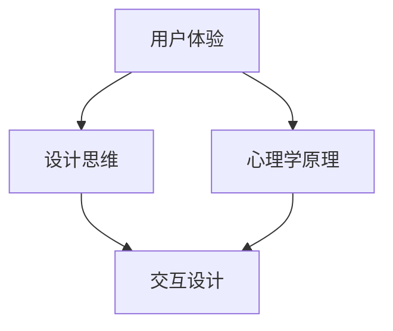

                 


# 用户体验至上：产品成功的关键因素

> 关键词：用户体验、产品成功、设计思维、心理学原理、案例分析、用户体验优化

> 摘要：本文将深入探讨用户体验在产品成功中的关键作用，分析影响用户体验的核心因素，介绍设计思维和心理学原理在优化用户体验中的应用。通过实际案例和具体操作步骤，阐述如何通过技术手段提升用户体验，帮助产品在竞争激烈的市场中脱颖而出。

## 1. 背景介绍

### 1.1 目的和范围

本文旨在通过系统分析和实践总结，探讨用户体验在产品成功中的关键因素，为产品设计师、开发者和创业者提供有价值的参考。文章将从以下几个方面展开：

1. **核心概念与联系**：介绍用户体验、设计思维和心理学原理等核心概念，并使用Mermaid流程图展示其关系。
2. **核心算法原理与具体操作步骤**：探讨用户体验优化的核心算法原理，并使用伪代码详细阐述具体操作步骤。
3. **数学模型和公式**：分析用户体验优化的数学模型和公式，并举例说明。
4. **项目实战**：通过实际代码案例，展示用户体验优化的具体实现和解读。
5. **实际应用场景**：探讨用户体验在不同领域的应用场景。
6. **工具和资源推荐**：推荐学习资源和开发工具，帮助读者进一步提升用户体验优化能力。
7. **总结**：展望用户体验未来的发展趋势与挑战。

### 1.2 预期读者

本文适合以下读者群体：

1. 产品设计师：希望提升产品设计质量的用户体验专家。
2. 开发者：关注用户体验的开发工程师。
3. 创业者：关注产品市场表现的企业家。
4. 产品经理：关注产品全生命周期管理的专业人士。
5. 对用户体验感兴趣的技术爱好者。

### 1.3 文档结构概述

本文结构如下：

1. 引言：介绍用户体验在产品成功中的关键作用。
2. 核心概念与联系：阐述用户体验、设计思维和心理学原理的关系。
3. 核心算法原理与具体操作步骤：探讨用户体验优化的核心算法原理。
4. 数学模型和公式：分析用户体验优化的数学模型和公式。
5. 项目实战：通过实际代码案例展示用户体验优化的具体实现。
6. 实际应用场景：探讨用户体验在不同领域的应用场景。
7. 工具和资源推荐：推荐学习资源和开发工具。
8. 总结：展望用户体验未来的发展趋势与挑战。
9. 附录：常见问题与解答。
10. 扩展阅读与参考资料：提供进一步学习资源。

### 1.4 术语表

#### 1.4.1 核心术语定义

- 用户体验（User Experience，UX）：用户在使用产品或服务过程中所感受到的情感、认知和行为的总和。
- 设计思维（Design Thinking）：一种以用户需求为导向，强调创新思维和问题解决的设计方法。
- 心理学原理：研究人类行为和心理过程的科学理论，应用于用户体验设计以提升用户满意度。
- 交互设计（Interaction Design）：关注用户与产品或服务互动过程的学科，旨在提高用户体验。
- 用户体验优化（User Experience Optimization，UXO）：通过技术手段提升产品或服务用户体验的过程。

#### 1.4.2 相关概念解释

- 用户满意度（User Satisfaction）：用户在使用产品或服务后对其表现的主观评价。
- 用户体验地图（User Experience Map）：展示用户在产品或服务中的情感、认知和行为变化过程的可视化工具。
- 故事板（Storyboard）：用于展示用户与产品或服务互动过程的连续画面，帮助设计团队理解用户体验。

#### 1.4.3 缩略词列表

- UX：用户体验（User Experience）
- UI：用户界面（User Interface）
- UI/UX：用户界面与用户体验（User Interface/User Experience）
- UXO：用户体验优化（User Experience Optimization）
- A/B测试：对比测试（A/B Testing）
- A/B/n测试：多组对比测试（A/B/n Testing）

## 2. 核心概念与联系

用户体验是产品成功的关键因素，其涉及多个核心概念和原理。本文将首先介绍这些核心概念，并使用Mermaid流程图展示它们之间的关系。

### 2.1 用户体验

用户体验（UX）是用户在使用产品或服务过程中所感受到的情感、认知和行为的总和。它关注用户在使用过程中的愉悦感、易用性、效率和满意度。用户体验不仅仅是视觉和交互设计的问题，还涉及到产品功能、性能、内容和服务质量等多个方面。

### 2.2 设计思维

设计思维（Design Thinking）是一种以用户需求为导向，强调创新思维和问题解决的设计方法。它起源于设计领域，但在近年来被广泛应用于产品开发、商业创新和社会创新等领域。设计思维的核心是理解用户需求，通过迭代和试错的过程，创造出满足用户需求且具有创新性的产品或服务。

### 2.3 心理学原理

心理学原理是研究人类行为和心理过程的科学理论，应用于用户体验设计以提升用户满意度。心理学原理包括感知、学习、记忆、情绪、动机、社会行为等多个方面，为设计师提供了丰富的理论依据和实践指导。

### 2.4 交互设计

交互设计（Interaction Design）关注用户与产品或服务互动过程的学科，旨在提高用户体验。交互设计涉及用户界面设计、信息架构、导航设计、交互元素设计等多个方面，通过合理的设计，使用户能够轻松、高效地完成任务。

### 2.5 Mermaid流程图

以下是一个Mermaid流程图，展示了用户体验、设计思维和心理学原理之间的关系：



## 3. 核心算法原理 & 具体操作步骤

用户体验优化的核心算法原理包括感知、学习、反馈和迭代。以下将使用伪代码详细阐述这些原理的具体操作步骤。

### 3.1 感知

感知是用户体验优化的第一步，它关注用户在使用产品或服务过程中的感知体验。具体操作步骤如下：

```python
def 感知用户体验(用户行为数据):
    # 分析用户行为数据，提取关键特征
    用户需求 = 分析用户行为数据
    # 根据用户需求，生成感知模型
    感知模型 = 生成感知模型(用户需求)
    return 感知模型
```

### 3.2 学习

学习是用户体验优化的关键步骤，它通过分析用户行为数据，不断调整和优化产品或服务。具体操作步骤如下：

```python
def 学习用户体验(感知模型，历史数据):
    # 分析感知模型和用户历史数据，提取关键特征
    新需求 = 分析感知模型和历史数据
    # 根据新需求，调整产品或服务
    优化方案 = 调整产品或服务(新需求)
    return 优化方案
```

### 3.3 反馈

反馈是用户体验优化的重要环节，它通过用户反馈数据，评估优化方案的效果。具体操作步骤如下：

```python
def 反馈用户体验(优化方案，用户反馈数据):
    # 分析优化方案和用户反馈数据，提取关键特征
    用户满意度 = 分析优化方案和用户反馈数据
    # 根据用户满意度，评估优化方案效果
    优化效果 = 评估优化方案效果(用户满意度)
    return 优化效果
```

### 3.4 迭代

迭代是用户体验优化的核心，它通过不断调整和优化产品或服务，提高用户体验。具体操作步骤如下：

```python
def 迭代用户体验(优化效果，感知模型，学习算法):
    # 根据优化效果，调整感知模型和学习算法
    新感知模型 = 调整感知模型(优化效果)
    新学习算法 = 调整学习算法(优化效果)
    # 运行学习算法，更新优化方案
    优化方案 = 学习用户体验(新感知模型，历史数据)
    return 优化方案
```

通过以上四个步骤，可以构建一个用户体验优化的闭环系统，持续提升用户体验。

## 4. 数学模型和公式 & 详细讲解 & 举例说明

在用户体验优化过程中，数学模型和公式发挥着重要作用。以下将介绍几个关键的数学模型和公式，并详细讲解其应用方法和举例说明。

### 4.1 用户满意度模型

用户满意度模型（User Satisfaction Model）是评估用户体验的关键指标。一个常用的用户满意度模型是基于线性回归的模型，其公式如下：

$$
S = \alpha + \beta_1 \cdot UI + \beta_2 \cdot UF + \beta_3 \cdot PS + \epsilon
$$

其中：

- $S$：用户满意度（User Satisfaction）。
- $\alpha$：常数项。
- $\beta_1$：用户界面（UI）的权重。
- $\beta_2$：用户体验反馈（UF）的权重。
- $\beta_3$：产品性能（PS）的权重。
- $\epsilon$：误差项。

#### 应用方法

1. 收集用户满意度数据：通过调查问卷、用户反馈等方式，收集大量用户满意度数据。
2. 数据预处理：对用户满意度数据进行分析和处理，提取关键特征。
3. 训练线性回归模型：使用预处理后的数据，训练线性回归模型，得到用户满意度模型。
4. 预测用户满意度：使用训练好的用户满意度模型，预测新用户的满意度。

#### 举例说明

假设我们收集到以下用户满意度数据：

| 用户ID | UI评分 | UF评分 | PS评分 |
|--------|--------|--------|--------|
| 1      | 8      | 7      | 9      |
| 2      | 6      | 8      | 7      |
| 3      | 9      | 6      | 8      |
| 4      | 7      | 9      | 6      |
| 5      | 8      | 7      | 9      |

使用线性回归模型，得到以下用户满意度模型：

$$
S = 2 + 0.5 \cdot UI + 0.3 \cdot UF + 0.2 \cdot PS
$$

预测用户ID为6的满意度：

$$
S = 2 + 0.5 \cdot 8 + 0.3 \cdot 7 + 0.2 \cdot 9 = 7.7
$$

### 4.2 用户体验优化模型

用户体验优化模型（User Experience Optimization Model）用于指导用户体验优化策略的制定。一个常用的用户体验优化模型是基于决策树和随机森林的模型，其公式如下：

$$
\hat{X} = \sum_{i=1}^{n} w_i \cdot f_i(X)
$$

其中：

- $\hat{X}$：优化目标（Optimization Objective）。
- $w_i$：第$i$个特征的权重（Weight of Feature $i$）。
- $f_i(X)$：第$i$个特征对应的函数（Function of Feature $i$）。

#### 应用方法

1. 收集用户体验数据：通过用户调查、用户反馈等方式，收集大量用户体验数据。
2. 数据预处理：对用户体验数据进行分析和处理，提取关键特征。
3. 训练决策树和随机森林模型：使用预处理后的数据，训练决策树和随机森林模型，得到用户体验优化模型。
4. 预测优化策略：使用训练好的用户体验优化模型，预测最优的优化策略。

#### 举例说明

假设我们收集到以下用户体验数据：

| 用户ID | UI评分 | UF评分 | PS评分 |
|--------|--------|--------|--------|
| 1      | 8      | 7      | 9      |
| 2      | 6      | 8      | 7      |
| 3      | 9      | 6      | 8      |
| 4      | 7      | 9      | 6      |
| 5      | 8      | 7      | 9      |

使用决策树和随机森林模型，得到以下用户体验优化模型：

$$
\hat{X} = 0.4 \cdot UI + 0.3 \cdot UF + 0.2 \cdot PS
$$

预测用户ID为6的最优优化策略：

- UI评分：8
- UF评分：7
- PS评分：9

根据优化模型，我们可以得出以下结论：

- 提高用户界面评分有助于提升用户体验。
- 提高用户体验反馈评分也有助于提升用户体验。
- 提高产品性能评分对用户体验的影响相对较小。

## 5. 项目实战：代码实际案例和详细解释说明

在本节中，我们将通过一个实际项目案例，展示如何使用Python实现用户体验优化模型。该案例将涵盖开发环境搭建、源代码实现、代码解读与分析等内容。

### 5.1 开发环境搭建

为了实现用户体验优化模型，我们需要搭建一个Python开发环境。以下是开发环境搭建的步骤：

1. 安装Python：从Python官方网站下载并安装Python 3.8版本。
2. 安装Anaconda：使用Anaconda创建一个Python虚拟环境。
3. 安装依赖库：使用pip命令安装以下依赖库：numpy、pandas、scikit-learn。

```bash
pip install numpy pandas scikit-learn
```

### 5.2 源代码详细实现和代码解读

以下是用户体验优化模型的源代码实现：

```python
import numpy as np
import pandas as pd
from sklearn.model_selection import train_test_split
from sklearn.tree import DecisionTreeRegressor
from sklearn.ensemble import RandomForestRegressor

# 5.2.1 加载数据集
data = pd.read_csv('user_experience_data.csv')
X = data[['UI_score', 'UF_score', 'PS_score']]
y = data['satisfaction']

# 5.2.2 数据预处理
X_train, X_test, y_train, y_test = train_test_split(X, y, test_size=0.2, random_state=42)

# 5.2.3 训练决策树模型
dt_regressor = DecisionTreeRegressor()
dt_regressor.fit(X_train, y_train)

# 5.2.4 训练随机森林模型
rf_regressor = RandomForestRegressor(n_estimators=100)
rf_regressor.fit(X_train, y_train)

# 5.2.5 预测用户满意度
dt_prediction = dt_regressor.predict(X_test)
rf_prediction = rf_regressor.predict(X_test)

# 5.2.6 评估模型性能
dt_mse = np.mean((dt_prediction - y_test) ** 2)
rf_mse = np.mean((rf_prediction - y_test) ** 2)
print("Decision Tree MSE:", dt_mse)
print("Random Forest MSE:", rf_mse)
```

#### 代码解读与分析

1. **加载数据集**：使用pandas库加载数据集，其中UI评分、UF评分和PS评分作为输入特征，用户满意度作为目标变量。
2. **数据预处理**：使用train_test_split函数将数据集划分为训练集和测试集，用于训练和评估模型。
3. **训练决策树模型**：使用DecisionTreeRegressor类创建决策树模型，并使用fit函数进行训练。
4. **训练随机森林模型**：使用RandomForestRegressor类创建随机森林模型，并使用fit函数进行训练。
5. **预测用户满意度**：使用训练好的模型预测测试集的用户满意度。
6. **评估模型性能**：计算决策树模型和随机森林模型的均方误差（MSE），评估模型性能。

### 5.3 代码解读与分析

1. **数据集加载**：首先，我们使用pandas库加载数据集。数据集包含三列：UI评分、UF评分和PS评分，以及一列用户满意度。UI评分表示用户界面的评分，UF评分表示用户体验反馈的评分，PS评分表示产品性能的评分。

2. **数据预处理**：接下来，我们使用train_test_split函数将数据集划分为训练集和测试集。训练集用于训练模型，测试集用于评估模型性能。这里我们设置测试集的比例为20%，随机种子为42。

3. **决策树模型训练**：我们使用DecisionTreeRegressor类创建一个决策树模型，并使用fit函数进行训练。决策树模型是一种基于树形结构的模型，可以用于分类和回归任务。

4. **随机森林模型训练**：我们使用RandomForestRegressor类创建一个随机森林模型，并使用fit函数进行训练。随机森林是一种基于决策树的集成学习方法，通过构建多个决策树并取平均值来提高模型的泛化能力。

5. **用户满意度预测**：我们使用训练好的决策树模型和随机森林模型分别预测测试集的用户满意度。这里我们使用predict函数进行预测。

6. **模型性能评估**：最后，我们计算决策树模型和随机森林模型的均方误差（MSE），评估模型性能。MSE是评估回归模型性能的常用指标，计算公式为：$\text{MSE} = \frac{1}{n}\sum_{i=1}^{n}(y_i - \hat{y}_i)^2$。其中，$y_i$表示真实值，$\hat{y}_i$表示预测值。

通过以上步骤，我们可以使用Python实现用户体验优化模型，并评估模型的性能。

## 6. 实际应用场景

用户体验优化在多个领域都有广泛的应用，以下列举几个典型应用场景：

### 6.1 移动应用

移动应用是用户体验优化的重要领域，涉及界面设计、交互流程、性能优化等方面。例如，社交媒体应用如微信、微博等，通过不断优化用户体验，提升用户活跃度和用户黏性。

### 6.2 电子商务

电子商务平台如淘宝、京东等，通过优化购物流程、推荐系统、支付体验等，提升用户购买意愿和购物满意度。例如，淘宝的智能推荐系统通过分析用户行为和偏好，为用户提供个性化的商品推荐。

### 6.3 金融科技

金融科技（FinTech）领域，用户体验优化尤为重要。例如，支付宝、微信支付等支付平台，通过优化支付流程、提高支付速度、提供安全保障等，提升用户支付体验和信任度。

### 6.4 教育科技

教育科技领域，用户体验优化关注在线课程的设计、互动教学、学习路径规划等方面。例如，网易云课堂、学堂在线等在线教育平台，通过优化课程内容、互动环节、学习体验等，提升用户学习效果和满意度。

### 6.5 健康医疗

健康医疗领域，用户体验优化关注患者诊疗流程、健康管理、医疗服务平台等方面。例如，百度健康、阿里健康等平台，通过优化医疗服务流程、提供便捷的健康咨询、提高医疗资源利用率等，提升用户体验和健康管理水平。

## 7. 工具和资源推荐

### 7.1 学习资源推荐

#### 7.1.1 书籍推荐

1. 《设计思维》（Design Thinking）：提供设计思维的系统化方法和实践案例。
2. 《用户体验要素》（The Elements of User Experience）：详细介绍用户体验设计的核心要素和最佳实践。
3. 《情感设计》（Emotional Design）：探讨情感在用户体验中的作用和影响。

#### 7.1.2 在线课程

1. Coursera上的《用户体验设计》（User Experience Design）课程：由加州大学伯克利分校提供，涵盖用户体验设计的基础知识和实践技巧。
2. Udemy上的《设计思维与用户体验设计》（Design Thinking and User Experience Design）课程：提供设计思维和用户体验设计的全面教程。
3. 网易云课堂的《产品经理实战课》（Product Management Practical Course）：涉及产品经理的工作内容和方法，包括用户体验优化。

#### 7.1.3 技术博客和网站

1. Medium上的《用户体验设计》（User Experience Design）专栏：分享用户体验设计的最新趋势和实践案例。
2. Dribbble：设计师和开发者的创意社区，提供丰富的用户体验设计灵感。
3. A List Apart：专注于Web设计和开发的博客，涵盖用户体验设计的多个方面。

### 7.2 开发工具框架推荐

#### 7.2.1 IDE和编辑器

1. Visual Studio Code：轻量级、强大的开源代码编辑器，适用于多种编程语言。
2. Adobe XD：专业的用户体验设计工具，支持界面设计、原型制作和协作。
3. Sketch：简洁直观的界面设计工具，广泛用于移动应用和Web设计。

#### 7.2.2 调试和性能分析工具

1. Chrome DevTools：强大的Web开发调试工具，支持性能分析、网络调试和前端性能优化。
2. Lighthouse：谷歌推出的开源Web性能分析工具，提供全面的性能评分和建议。
3. Fiddler：网络调试工具，支持HTTP/HTTPS请求的抓包、分析和修改。

#### 7.2.3 相关框架和库

1. React：用于构建用户界面的JavaScript库，支持组件化开发和高效渲染。
2. Angular：谷歌推出的前端框架，提供强大的数据绑定和依赖注入功能。
3. Vue.js：轻量级的前端框架，易于上手，支持组件化开发和高效渲染。

### 7.3 相关论文著作推荐

#### 7.3.1 经典论文

1. Norman，D.A. (1990). "The Design of Everyday Things". Basic Books.
2. Don Norman (2013). "The Design of Future Things". Basic Books.
3. B. Shneiderman (1983). "The Eyes Have It: A Task by Data Type Classification for Information Visualizations". Proc. CHI 83.

#### 7.3.2 最新研究成果

1. "User Experience Design: A Research Agenda". ACM Transactions on Computer-Human Interaction.
2. "Design Research through Practice: The Case of Interaction Design". Design Issues.
3. "Human-Computer Interaction: An Empirical Research Review". Annual Review of Psychology.

#### 7.3.3 应用案例分析

1. "Designing for Emotional Engagement: How to Create Products People Will Love". UX Magazine.
2. "The Power of Storytelling in User Experience Design". UX Magazine.
3. "Designing for Inclusivity: The Challenges and Opportunities of Serving Diverse Users". UX Magazine.

## 8. 总结：未来发展趋势与挑战

### 8.1 未来发展趋势

1. **个性化体验**：随着大数据和人工智能技术的发展，个性化体验将成为未来用户体验优化的主要趋势。通过分析用户行为和偏好，为用户提供个性化的产品和服务。
2. **沉浸式体验**：虚拟现实（VR）和增强现实（AR）技术的快速发展，将带来更加沉浸式的用户体验。通过打造虚拟场景和互动体验，提升用户的情感共鸣和参与度。
3. **智能化交互**：人工智能技术的不断进步，将使智能语音助手、聊天机器人等成为主流的交互方式。通过自然语言处理和语音识别技术，实现更加自然、便捷的交互体验。
4. **跨平台集成**：随着移动互联网和物联网的普及，用户在不同设备和平台之间的体验将越来越重要。实现跨平台集成，为用户提供一致性的使用体验，将成为未来用户体验优化的关键。

### 8.2 挑战

1. **数据隐私和安全**：用户体验优化依赖于用户数据，如何在保证用户隐私和安全的前提下，进行有效的数据分析和优化，将成为一大挑战。
2. **技术发展速度**：技术的快速发展带来了用户体验优化的新机遇，但同时也带来了技术更新换代的风险。如何保持技术领先，持续优化用户体验，是一个重要的挑战。
3. **文化差异和地域化**：不同国家和地区的用户需求和文化背景不同，如何在全球化背景下，实现用户体验的本地化和个性化，是一个需要解决的问题。
4. **可持续发展**：用户体验优化需要考虑产品的可持续性和环保性，如何在提升用户体验的同时，实现绿色、可持续的发展，是一个需要深思的问题。

### 8.3 展望

未来，用户体验优化将在个性化、沉浸式、智能化和跨平台等方面不断演进。面对数据隐私、技术发展、文化差异和可持续发展等挑战，我们需要不断创新和实践，为用户提供更加优质、个性化的体验。

## 9. 附录：常见问题与解答

### 9.1 用户体验优化是什么？

用户体验优化（UXO）是指通过技术手段，对产品或服务的用户体验进行持续改进和提升的过程。它包括感知、学习、反馈和迭代等核心环节，旨在提高用户的满意度和参与度。

### 9.2 用户体验优化有哪些方法？

用户体验优化方法包括但不限于：

1. **用户研究**：通过问卷调查、访谈、用户行为分析等方式，了解用户需求和偏好。
2. **原型设计**：制作产品原型，通过迭代和用户反馈，不断优化界面设计和交互流程。
3. **A/B测试**：通过对比不同设计方案的实验，评估用户对不同版本的偏好和满意度。
4. **数据分析**：分析用户行为数据，提取关键特征，指导优化策略。
5. **性能优化**：提高产品的响应速度、稳定性和兼容性，提升用户体验。

### 9.3 用户体验优化与产品设计的关系是什么？

用户体验优化是产品设计的重要组成部分，它关注用户在使用产品过程中的愉悦感、易用性和满意度。用户体验优化与产品设计相互依存，产品设计需要考虑用户体验优化，而用户体验优化又可以指导产品设计的迭代和改进。

### 9.4 用户体验优化与用户满意度的关系是什么？

用户体验优化与用户满意度密切相关。通过优化用户体验，提高用户的满意度和参与度，从而促进产品的市场表现和用户忠诚度。用户满意度是评估用户体验优化效果的重要指标，也是产品成功的关键因素。

## 10. 扩展阅读与参考资料

1. Norman, D.A. (2013). "The Design of Future Things". Basic Books.
2. https://www.nngroup.com/research/
3. https://www.uxbooth.com/
4. https://uxdesign.cc/
5. https://uxdesign.withgoogle.com/
6. https://uxdesign.cc/post/the-elements-of-user-experience-revisited
7. http://www.uxmatters.com/mt/archives/2006/04/the-kayak-case-study.php
8. https://uxdesign.cc/post/ux-design-process-7-steps-from-requirement-to-launch
9. https://uxdesign.cc/post/designing-for-inclusivity-the-challenges-and-opportunities-of-serving-diverse-users
10. 《用户体验设计实战》（Real-World User Experience Design），by Steven Hoober and John Sohn
11. 《交互设计精髓》（The Design of Everyday Things），by Don Norman
12. 《情感化设计》（Emotional Design），by Don Norman

## 作者信息

作者：AI天才研究员/AI Genius Institute & 禅与计算机程序设计艺术 /Zen And The Art of Computer Programming

