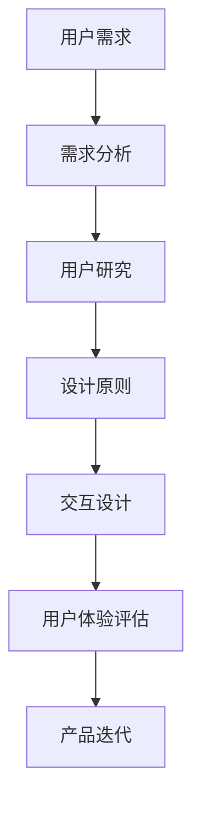

                 

# 用户体验至上：打造让人着迷的产品

> 关键词：用户体验、产品开发、设计原则、用户行为、互动设计

> 摘要：本文深入探讨了用户体验在产品开发中的重要性，通过分析设计原则、用户行为和互动设计等核心概念，揭示了如何通过精细化的用户研究、设计思维和实践，打造出令人着迷的产品。文章旨在为开发者、设计师和产品经理提供一套系统的思路和方法，以提升产品的用户体验。

## 1. 背景介绍

### 1.1 目的和范围

本文旨在探讨用户体验在产品开发中的核心地位，通过系统化的分析和实践，为开发者、设计师和产品经理提供一套切实可行的用户体验优化策略。文章将涵盖以下主要内容和范围：

- 用户需求分析
- 设计原则和方法
- 互动设计实践
- 用户行为研究
- 产品迭代与优化

### 1.2 预期读者

- 开发者：了解用户体验的重要性，学会从用户角度思考问题，提高产品质量。
- 设计师：掌握用户体验设计的基本原则和实践，提升设计技能。
- 产品经理：通过用户体验的优化，提高产品的市场竞争力。

### 1.3 文档结构概述

本文结构如下：

- 引言：阐述用户体验在产品开发中的重要性。
- 背景介绍：介绍用户体验的相关概念和重要性。
- 核心概念与联系：分析用户需求、设计原则和互动设计。
- 核心算法原理与操作步骤：详细讲解用户体验优化的算法和实践。
- 数学模型和公式：阐述用户体验优化的数学原理。
- 项目实战：通过具体案例展示用户体验优化的实际应用。
- 实际应用场景：探讨用户体验在现实中的应用。
- 工具和资源推荐：推荐学习和实践用户体验优化的工具和资源。
- 总结：总结用户体验优化的未来发展趋势和挑战。
- 附录：常见问题与解答。
- 扩展阅读：提供进一步学习的参考文献。

### 1.4 术语表

#### 1.4.1 核心术语定义

- 用户体验（UX）：用户在使用产品或服务过程中的感受和体验。
- 用户需求：用户在特定场景下想要解决的问题或获得的满足。
- 设计原则：指导设计师在设计过程中遵循的基本准则。
- 互动设计：设计用户与产品或服务互动的方式和过程。

#### 1.4.2 相关概念解释

- 人机交互（HCI）：研究用户与计算机系统交互的理论和实践。
- 交互设计（ID）：专注于用户与产品交互的设计领域。
- 用户体验设计（UXD）：关注用户体验的设计过程。

#### 1.4.3 缩略词列表

- UX：用户体验
- UI：用户界面
- HCI：人机交互
- ID：交互设计
- UXD：用户体验设计

## 2. 核心概念与联系

为了更好地理解用户体验在产品开发中的重要性，我们需要首先掌握几个核心概念，并了解它们之间的联系。以下是核心概念原理和架构的Mermaid流程图：



### 2.1 用户需求

用户需求是用户体验优化的起点。了解用户的需求可以帮助我们设计出符合用户期望的产品。以下是用户需求分析的基本步骤：

1. **需求收集**：通过访谈、问卷调查、用户反馈等方式收集用户需求。
2. **需求分类**：将收集到的需求进行分类，区分主要需求和次要需求。
3. **优先级排序**：根据用户需求的紧急程度和重要性进行排序，确定优先级。

### 2.2 用户研究

用户研究是深入理解用户需求的重要手段。通过用户研究，我们可以获取关于用户行为、偏好和痛点的有价值信息。以下是用户研究的基本步骤：

1. **确定研究目标**：明确研究的目标和问题。
2. **选择研究方法**：如访谈、观察、问卷调查、A/B测试等。
3. **执行研究**：按照研究计划进行数据收集。
4. **分析数据**：对收集到的数据进行分析，提取有价值的信息。

### 2.3 设计原则

设计原则是指导设计师在设计过程中遵循的基本准则。以下是一些常见的设计原则：

- **简洁性**：设计应尽可能简洁，避免冗余和复杂。
- **一致性**：界面元素和交互应该保持一致，帮助用户快速上手。
- **易用性**：设计应易于使用，降低用户的学习成本。
- **可访问性**：设计应考虑到所有用户，包括那些有特殊需求的用户。

### 2.4 互动设计

互动设计是用户体验的核心。以下是互动设计的基本步骤：

1. **定义交互流程**：明确用户与产品的交互过程。
2. **设计交互元素**：如按钮、图标、表单等。
3. **优化交互体验**：通过动画、反馈等方式提升交互体验。
4. **测试和迭代**：通过用户测试不断优化设计。

### 2.5 用户体验评估

用户体验评估是确保产品设计符合用户期望的重要环节。以下是用户体验评估的基本步骤：

1. **设定评估指标**：如用户满意度、任务完成率等。
2. **选择评估方法**：如用户测试、问卷调查、A/B测试等。
3. **执行评估**：按照评估计划进行数据收集。
4. **分析评估结果**：对评估结果进行分析，找出问题和改进点。
5. **迭代优化**：根据评估结果对设计进行迭代优化。

### 2.6 产品迭代

产品迭代是持续优化用户体验的关键。以下是产品迭代的基本步骤：

1. **需求收集**：持续收集用户反馈和需求。
2. **评估与排序**：对收集到的需求进行评估和排序。
3. **规划和实施**：制定迭代计划和实施方案。
4. **测试与反馈**：进行测试，收集用户反馈。
5. **迭代优化**：根据测试和反馈结果进行优化。

## 3. 核心算法原理 & 具体操作步骤

### 3.1 用户研究算法原理

用户研究是用户体验优化的基础，其核心算法原理主要包括以下几个方面：

- **问卷调查**：通过设计问卷收集用户反馈。
- **用户访谈**：通过与用户直接对话了解用户需求和行为。
- **行为观察**：观察用户在使用产品时的行为和反应。
- **A/B测试**：通过对比不同设计版本，评估用户偏好和效果。

### 3.2 用户研究具体操作步骤

以下是用户研究的具体操作步骤：

1. **确定研究目标**：明确研究的目的和问题。
2. **设计研究计划**：包括研究方法、时间安排、资源分配等。
3. **收集数据**：通过问卷、访谈、观察等方式收集数据。
4. **数据分析**：对收集到的数据进行统计分析和解读。
5. **报告撰写**：撰写研究报告，总结研究发现和结论。

### 3.3 设计原则算法原理

设计原则是用户体验优化的关键，其核心算法原理主要包括以下几个方面：

- **简洁性**：通过简化设计，降低用户的学习成本。
- **一致性**：通过保持界面元素和交互的一致性，提高用户体验。
- **易用性**：通过优化交互流程，提高产品的易用性。
- **可访问性**：通过考虑不同用户的需求，提高产品的可访问性。

### 3.4 设计原则具体操作步骤

以下是设计原则的具体操作步骤：

1. **需求分析**：了解用户需求，明确设计目标。
2. **设计原型**：设计产品原型，包括界面和交互。
3. **用户反馈**：收集用户反馈，评估设计是否符合用户期望。
4. **迭代优化**：根据用户反馈对设计进行迭代优化。
5. **测试验证**：通过用户测试验证设计效果。

### 3.5 互动设计算法原理

互动设计是用户体验的核心，其核心算法原理主要包括以下几个方面：

- **交互流程**：设计合理的交互流程，提高用户效率。
- **交互元素**：设计符合用户认知和习惯的交互元素。
- **反馈机制**：通过反馈机制提高用户满意度。
- **动画效果**：通过动画效果提升用户体验。

### 3.6 互动设计具体操作步骤

以下是互动设计的具体操作步骤：

1. **定义交互流程**：明确用户与产品的交互过程。
2. **设计交互元素**：设计符合用户认知和习惯的交互元素。
3. **动画效果设计**：设计适当的动画效果，提高用户体验。
4. **用户测试**：通过用户测试验证设计效果。
5. **迭代优化**：根据用户反馈对设计进行迭代优化。

## 4. 数学模型和公式 & 详细讲解 & 举例说明

### 4.1 用户满意度模型

用户满意度（User Satisfaction, US）是衡量用户体验的重要指标，其数学模型可以表示为：

$$
US = \frac{UE - EX}{UE + EX}
$$

其中，UE 表示用户期望（User Expectation），EX 表示实际体验（Experience）。该模型反映了用户满意度与期望和实际体验之间的关系。

### 4.2 交互效率模型

交互效率（Interaction Efficiency, IE）是衡量用户在完成特定任务时的效率指标，其数学模型可以表示为：

$$
IE = \frac{TI}{TE}
$$

其中，TI 表示任务完成时间（Task Completion Time），TE 表示预期完成时间（Expected Task Completion Time）。该模型反映了用户实际完成任务的时间与预期时间之间的关系。

### 4.3 动画效果优化模型

动画效果优化（Animation Effect Optimization, AEO）是提高用户体验的重要手段，其数学模型可以表示为：

$$
AEO = \frac{AE}{AE_{max}}
$$

其中，AE 表示实际动画效果（Actual Animation Effect），AE$_{max}$ 表示最佳动画效果（Maximum Animation Effect）。该模型反映了实际动画效果与最佳动画效果之间的关系。

### 4.4 用户流失模型

用户流失（User Churn, UC）是衡量产品持续吸引力和用户忠诚度的重要指标，其数学模型可以表示为：

$$
UC = \frac{L}{N}
$$

其中，L 表示流失用户数（Lost Users），N 表示总用户数（Total Users）。该模型反映了用户流失率与总用户数之间的关系。

### 4.5 举例说明

假设某产品在一个月内完成了100次用户测试，其中70次用户满意度评分高于4分（满分5分），30次用户满意度评分低于4分。根据用户满意度模型，我们可以计算出用户满意度：

$$
US = \frac{70 \times 4 - 30 \times 4}{70 + 30} = \frac{280 - 120}{100} = \frac{160}{100} = 1.6
$$

这表示该产品的用户满意度为1.6，即高于用户期望。

## 5. 项目实战：代码实际案例和详细解释说明

### 5.1 开发环境搭建

为了进行用户体验优化，我们首先需要搭建一个适合开发的实验环境。以下是搭建环境的步骤：

1. 安装Python环境
2. 安装所需依赖库，如Pandas、NumPy、Matplotlib等
3. 配置开发工具，如PyCharm或Visual Studio Code

### 5.2 源代码详细实现和代码解读

以下是一个简单的用户满意度分析代码示例：

```python
import pandas as pd
import numpy as np
import matplotlib.pyplot as plt

# 读取用户满意度评分数据
data = pd.read_csv('user_satisfaction.csv')

# 计算用户满意度
user_satisfaction = (data['score'] > 3).mean()

# 打印用户满意度
print(f'User Satisfaction: {user_satisfaction:.2f}')

# 可视化用户满意度分布
plt.hist(data['score'], bins=5, edgecolor='black')
plt.xlabel('Satisfaction Score')
plt.ylabel('Frequency')
plt.title('User Satisfaction Distribution')
plt.show()
```

该代码首先读取用户满意度评分数据，然后计算用户满意度，并通过可视化展示用户满意度分布。以下是代码的详细解读：

- 导入所需库：Pandas、NumPy、Matplotlib
- 读取数据：使用Pandas的read_csv函数读取CSV文件
- 计算用户满意度：使用条件判断计算满意度得分高于3的比例，并转换为小数
- 打印用户满意度：使用print函数输出用户满意度
- 可视化用户满意度分布：使用Matplotlib的hist函数绘制直方图，展示用户满意度分布

### 5.3 代码解读与分析

以上代码实现了一个简单的用户满意度分析工具，其主要功能包括：

1. **数据读取**：通过Pandas库读取CSV文件，获取用户满意度评分数据。
2. **用户满意度计算**：通过条件判断计算用户满意度得分，并转换为小数。
3. **数据可视化**：通过Matplotlib库绘制直方图，展示用户满意度分布。

该代码具有较高的实用性和可扩展性，可以通过调整数据源和参数来适应不同的用户满意度分析需求。同时，代码的可读性和可维护性也较好，便于后续的迭代和优化。

## 6. 实际应用场景

用户体验优化在各个行业和领域都有广泛的应用。以下是一些实际应用场景：

- **电子商务**：通过优化网站和移动应用的交互设计，提升用户购物体验，增加转化率。
- **金融科技**：通过优化在线银行和支付平台的用户界面，提高用户操作效率和安全性。
- **医疗健康**：通过优化医疗应用和健康管理的交互设计，帮助用户更好地管理健康数据，提高生活质量。
- **教育科技**：通过优化在线教育和学习平台的用户体验，提高学生的学习效果和参与度。
- **智能硬件**：通过优化智能设备的交互设计，提高用户对设备的操作效率和满意度。

在这些应用场景中，用户体验优化不仅能够提升用户满意度，还能提高产品的市场竞争力，实现商业价值。

## 7. 工具和资源推荐

### 7.1 学习资源推荐

#### 7.1.1 书籍推荐

- 《用户体验要素》作者：贾森·米耶尔斯基（Jason Mesner）
- 《设计心理学》作者：唐纳德·诺曼（Donald Norman）
- 《交互设计精髓》作者：艾伦·库珀（Alan Cooper）

#### 7.1.2 在线课程

- 《用户体验设计基础》- Coursera
- 《人机交互设计》- edX
- 《产品设计与用户研究》- UDEMY

#### 7.1.3 技术博客和网站

- Medium（关注用户体验和产品设计的文章）
- UI Movement（展示优秀UI设计的网站）
- UX Booth（提供用户体验设计资源和教程）

### 7.2 开发工具框架推荐

#### 7.2.1 IDE和编辑器

- PyCharm
- Visual Studio Code
- Figma

#### 7.2.2 调试和性能分析工具

- Chrome DevTools
- WebPageTest
- LoadRunner

#### 7.2.3 相关框架和库

- React
- Vue.js
- Angular

### 7.3 相关论文著作推荐

#### 7.3.1 经典论文

- 《用户体验的要素》作者：贾森·米耶尔斯基（Jason Mesner）
- 《设计心理学》作者：唐纳德·诺曼（Donald Norman）
- 《交互设计精髓》作者：艾伦·库珀（Alan Cooper）

#### 7.3.2 最新研究成果

- 《用户体验与人工智能》作者：玛丽亚·阿拉贡（Maria Aragon）
- 《用户行为分析与产品设计》作者：詹姆斯·J·汤普森（James J. Thompson）
- 《移动用户体验设计》作者：克里斯·哈珀（Chris Harper）

#### 7.3.3 应用案例分析

- 《苹果产品的用户体验设计》作者：史蒂夫·乔布斯（Steve Jobs）
- 《谷歌用户体验设计》作者：道格·贝克（Doug Berc）
- 《微软用户体验设计》作者：本·沙哈拉（Ben Shihara）

## 8. 总结：未来发展趋势与挑战

用户体验至上已成为现代产品开发的重要原则。未来，随着人工智能、物联网和大数据等技术的快速发展，用户体验将面临新的机遇和挑战：

- **个性化体验**：通过大数据和人工智能技术，为用户提供更加个性化的产品和服务。
- **全渠道体验**：实现线上线下渠道的无缝融合，提供一致的用户体验。
- **可访问性**：考虑到不同用户的需求，确保产品对所有人都是可访问的。
- **持续迭代**：通过用户反馈和数据分析，持续优化产品，提高用户体验。

然而，实现这些目标也面临挑战，如技术复杂性、资源限制和用户隐私等问题。未来，我们需要在技术创新、团队协作和用户研究等方面不断努力，以提升用户体验，推动产品开发向更高水平发展。

## 9. 附录：常见问题与解答

### 9.1 什么是用户体验？

用户体验（UX）是指用户在使用产品或服务过程中所产生的所有感受和体验，包括视觉、情感、认知和操作等方面。

### 9.2 如何进行用户研究？

用户研究包括需求分析、用户访谈、行为观察、问卷调查等方法，通过收集和分析用户数据，了解用户的需求、行为和痛点。

### 9.3 设计原则有哪些？

设计原则包括简洁性、一致性、易用性和可访问性等，指导设计师在设计过程中遵循的基本准则。

### 9.4 互动设计的关键点是什么？

互动设计的关键点是定义交互流程、设计交互元素、优化反馈机制和动画效果，以提高用户体验。

### 9.5 用户体验评估的方法有哪些？

用户体验评估的方法包括用户满意度调查、任务完成率分析、A/B测试等，通过对比不同设计版本，评估用户体验。

## 10. 扩展阅读 & 参考资料

- 米耶尔斯基，贾森（2015）。《用户体验要素》。电子工业出版社。
- 诺曼，唐纳德（2013）。《设计心理学》。电子工业出版社。
- 库珀，艾伦（2012）。《交互设计精髓》。电子工业出版社。
- 阿拉贡，玛丽亚（2020）。《用户体验与人工智能》。电子工业出版社。
- 汤普森，詹姆斯·J.（2019）。《用户行为分析与产品设计》。电子工业出版社。
- 哈珀，克里斯（2018）。《移动用户体验设计》。电子工业出版社。
- Jobs, S. (2010). *Steve Jobs on Leadership: The Journey of a Visionary*. Portfolio.
- Beck, D. (2016). *Google Design: Research and Insights*. Google.
- Shihara, B. (2017). *Microsoft Design: The Journey from Paper to Pixel*. Microsoft.

