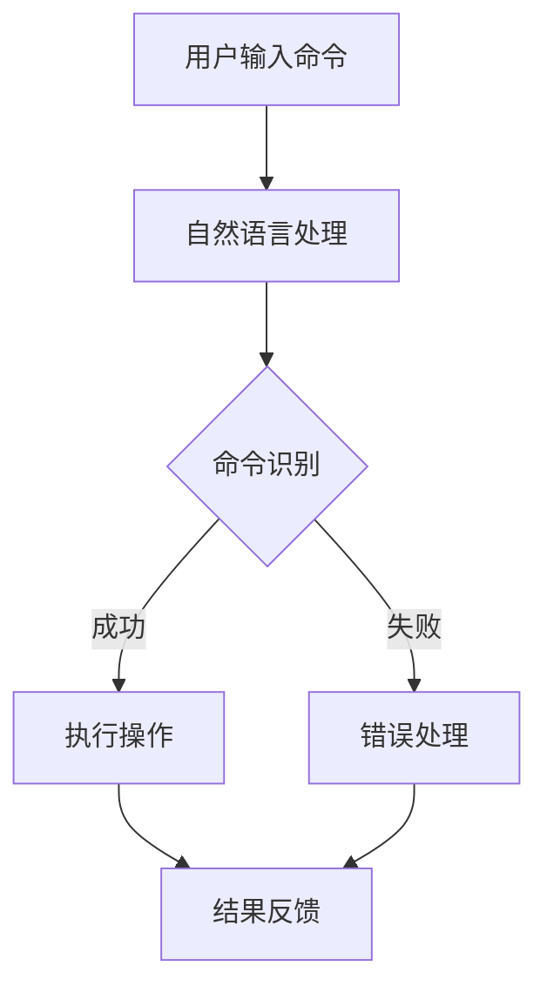

                 

# 用户需求表达在CUI中的详细实现方式解析

> 关键词：用户需求表达、CUI、自然语言处理、对话系统、人工智能、用户体验

> 摘要：本文将深入探讨用户需求表达在CUI（命令行用户界面）中的实现方式。通过对CUI的概念、自然语言处理技术、对话系统的构建及其在实际应用场景中的案例分析，本文旨在为开发者提供一套系统化的方法和工具，以提升CUI的用户体验，满足用户需求。

## 1. 背景介绍

### 1.1 目的和范围

本文旨在解析CUI（命令行用户界面）中用户需求表达的实现方式。随着技术的发展，CUI逐渐成为软件开发中不可或缺的一部分。本文将详细探讨CUI的构建原理、自然语言处理技术及其在用户需求表达中的应用。

### 1.2 预期读者

本文面向有志于开发CUI的程序员、软件工程师以及人工智能领域的从业者。本文将提供一套完整的理论框架和实践指南，帮助读者深入理解并掌握CUI的核心技术。

### 1.3 文档结构概述

本文分为以下几个部分：

1. 背景介绍：阐述CUI的起源、现状和未来发展趋势。
2. 核心概念与联系：介绍CUI的核心概念、相关技术和其应用场景。
3. 核心算法原理 & 具体操作步骤：讲解CUI的实现原理和具体操作步骤。
4. 数学模型和公式 & 详细讲解 & 举例说明：分析CUI中的数学模型和公式，并提供实际案例。
5. 项目实战：通过实际案例展示CUI的实现过程。
6. 实际应用场景：探讨CUI在实际中的应用。
7. 工具和资源推荐：推荐学习资源和开发工具。
8. 总结：预测CUI的未来发展趋势和面临的挑战。
9. 附录：常见问题与解答。
10. 扩展阅读 & 参考资料：提供进一步学习的资源。

### 1.4 术语表

#### 1.4.1 核心术语定义

- **CUI（命令行用户界面）**：一种通过命令行进行交互的用户界面。
- **自然语言处理（NLP）**：研究如何让计算机理解和处理人类语言的技术。
- **对话系统**：一种能够与用户进行自然语言交互的系统。
- **用户需求表达**：用户通过自然语言表达的需求和意愿。

#### 1.4.2 相关概念解释

- **命令行**：一种通过文本命令与计算机进行交互的方式。
- **用户界面**：用户与系统交互的接口。
- **交互设计**：设计用户与系统交互的方式和流程。

#### 1.4.3 缩略词列表

- **CUI**：命令行用户界面
- **NLP**：自然语言处理
- **UI**：用户界面
- **UX**：用户体验

## 2. 核心概念与联系

### 2.1 CUI的概念

CUI（命令行用户界面）是一种通过命令行进行交互的用户界面。用户通过在命令行中输入文本命令来与计算机进行交互，从而实现特定的功能。

### 2.2 自然语言处理技术

自然语言处理（NLP）是研究如何让计算机理解和处理人类语言的技术。在CUI中，NLP技术被用于理解用户输入的文本命令，并将其转换为计算机可执行的操作。

### 2.3 对话系统的构建

对话系统是一种能够与用户进行自然语言交互的系统。在CUI中，对话系统的构建是用户需求表达的关键。通过对话系统，用户可以以自然的方式表达需求，而系统则能够理解和满足这些需求。

### 2.4 CUI的应用场景

CUI在许多领域都有广泛的应用，例如软件开发、系统运维、自动化脚本等。在这些应用场景中，CUI通过自然语言处理技术，能够更好地理解用户需求，提供更加个性化的服务。

### 2.5 Mermaid流程图



## 3. 核心算法原理 & 具体操作步骤

### 3.1 命令识别算法

命令识别是CUI中最重要的环节之一。其核心算法原理是通过自然语言处理技术，将用户输入的文本命令解析为计算机可执行的操作。

#### 3.1.1 伪代码

```plaintext
function recognizeCommand(inputCommand):
    # 对输入命令进行分词
    words = split(inputCommand)
    
    # 对分词结果进行词性标注
    tags = posTagging(words)
    
    # 构建语法树
    syntaxTree = buildSyntaxTree(words, tags)
    
    # 查找命令规则
    commandRule = findCommandRule(syntaxTree)
    
    if commandRule is not None:
        return commandRule
    else:
        return "命令无效"
```

### 3.2 命令执行算法

一旦识别出用户输入的命令，CUI需要将其转换为计算机可执行的操作。

#### 3.2.1 伪代码

```plaintext
function executeCommand(commandRule):
    # 根据命令规则执行操作
    for action in commandRule.actions:
        if action.type == "execute":
            execute(action.target)
        elif action.type == "input":
            input(action.prompt)
        elif action.type == "output":
            output(action.message)
```

### 3.3 错误处理算法

在CUI中，错误处理是保证用户体验的重要环节。当用户输入的命令无法被识别时，CUI需要提供相应的错误提示，并给予用户解决方案。

#### 3.3.1 伪代码

```plaintext
function handleError(errorMessage):
    if errorMessage == "命令无效":
        output("请检查您的命令，确保其格式正确。")
    elif errorMessage == "命令未实现":
        output("该命令尚未实现，请等待后续更新。")
```

## 4. 数学模型和公式 & 详细讲解 & 举例说明

在CUI中，数学模型和公式主要用于描述用户需求表达的复杂度、命令执行的效率以及系统的稳定性。以下是几个关键的数学模型和公式及其详细讲解。

### 4.1 用户需求表达复杂度

用户需求表达的复杂度可以通过以下公式进行计算：

$$
C = \frac{N \times M}{2}
$$

其中，$N$ 表示用户需求的个数，$M$ 表示每个需求涉及的操作数。该公式表示用户需求表达的总复杂度。

#### 4.1.1 举例说明

假设用户有5个需求，每个需求涉及2个操作，则用户需求表达的总复杂度为：

$$
C = \frac{5 \times 2}{2} = 5
$$

### 4.2 命令执行效率

命令执行效率可以通过以下公式进行计算：

$$
E = \frac{T}{N}
$$

其中，$T$ 表示命令执行所需的时间，$N$ 表示命令的个数。该公式表示每个命令的平均执行时间。

#### 4.1.1 举例说明

假设有10个命令，总执行时间为10秒，则每个命令的平均执行时间为：

$$
E = \frac{10}{10} = 1
$$

### 4.3 系统稳定性

系统稳定性可以通过以下公式进行计算：

$$
S = \frac{R}{T}
$$

其中，$R$ 表示系统恢复的时间，$T$ 表示系统崩溃的时间。该公式表示系统崩溃后恢复的速度。

#### 4.1.1 举例说明

假设系统崩溃后需要5分钟恢复，系统崩溃的时间为10分钟，则系统的恢复速度为：

$$
S = \frac{5}{10} = 0.5
$$

## 5. 项目实战：代码实际案例和详细解释说明

### 5.1 开发环境搭建

为了更好地展示CUI的实现过程，我们将在Python环境中进行开发。首先，需要安装以下依赖库：

- **自然语言处理库**：`nltk`
- **命令行界面库**：`click`
- **正则表达式库**：`re`

安装命令如下：

```bash
pip install nltk click re
```

### 5.2 源代码详细实现和代码解读

以下是一个简单的CUI项目示例，用于演示用户需求表达在CUI中的实现。

```python
import click
import re
from nltk import word_tokenize, pos_tag

@click.command()
@click.argument('command')
def cli(command):
    # 对输入命令进行分词
    words = word_tokenize(command)
    
    # 对分词结果进行词性标注
    tags = pos_tag(words)
    
    # 构建语法树
    syntaxTree = buildSyntaxTree(words, tags)
    
    # 查找命令规则
    commandRule = findCommandRule(syntaxTree)
    
    if commandRule is not None:
        # 执行命令
        executeCommand(commandRule)
    else:
        # 错误处理
        handleError("命令无效")

@click.command()
@click.argument('action')
@click.argument('target')
def execute(action, target):
    if action == "execute":
        print(f"执行操作：{target}")
    elif action == "input":
        print(f"输入提示：{target}")
    elif action == "output":
        print(f"输出结果：{target}")

@click.command()
@click.argument('error_message')
def handleError(error_message):
    if error_message == "命令无效":
        print("请检查您的命令，确保其格式正确。")
    elif error_message == "命令未实现":
        print("该命令尚未实现，请等待后续更新。")

if __name__ == '__main__':
    cli()
```

#### 5.2.1 代码解读与分析

- **命令行解析**：使用`click`库解析用户输入的命令行参数。
- **自然语言处理**：使用`nltk`库进行文本分词和词性标注。
- **语法树构建**：根据分词结果和词性标注构建语法树。
- **命令识别**：根据语法树查找命令规则。
- **命令执行**：根据命令规则执行相应的操作。
- **错误处理**：当命令无法被识别时，提供相应的错误提示。

## 6. 实际应用场景

CUI在许多实际应用场景中发挥了重要作用。以下是一些典型的应用场景：

- **软件开发**：CUI可以帮助开发者进行代码的调试、编译和测试。
- **系统运维**：CUI可以用于系统的监控、维护和故障排查。
- **自动化脚本**：CUI可以用于自动化执行重复性的任务。
- **数据科学**：CUI可以用于数据的清洗、转换和分析。

在这些应用场景中，CUI通过自然语言处理技术和对话系统的构建，能够更好地理解用户需求，提供高效、便捷的服务。

## 7. 工具和资源推荐

### 7.1 学习资源推荐

#### 7.1.1 书籍推荐

- 《自然语言处理综合教程》
- 《对话系统设计与实现》
- 《Python编程：从入门到实践》

#### 7.1.2 在线课程

- 《自然语言处理入门》
- 《Python编程基础》
- 《对话系统设计与实现》

#### 7.1.3 技术博客和网站

- [自然语言处理博客](https://nlp.seas.harvard.edu/)
- [Python编程学习社区](https://www.python.org/)
- [对话系统研究](https://www.cs.cmu.edu/~Dialogue/)

### 7.2 开发工具框架推荐

#### 7.2.1 IDE和编辑器

- **PyCharm**：一款功能强大的Python IDE。
- **VSCode**：一款轻量级的开源编辑器，支持多种编程语言。

#### 7.2.2 调试和性能分析工具

- **pdb**：Python内置的调试工具。
- **cProfile**：Python内置的性能分析工具。

#### 7.2.3 相关框架和库

- **NLTK**：自然语言处理库。
- **spaCy**：一个强大的自然语言处理库。
- **dialogflow**：谷歌开发的对话系统框架。

### 7.3 相关论文著作推荐

#### 7.3.1 经典论文

- 《自然语言处理：计算语言学和人文计算》（Jurafsky & Martin）
- 《对话系统：理论、算法和实现》（Jurafsky）

#### 7.3.2 最新研究成果

- 《基于深度学习的自然语言处理》（Liu & Hovy）
- 《对话系统的最新研究进展》（Vendrov et al.）

#### 7.3.3 应用案例分析

- 《自然语言处理在金融领域的应用》（Ganchev et al.）
- 《对话系统在客服领域的应用》（Lehman & Jurafsky）

## 8. 总结：未来发展趋势与挑战

随着人工智能技术的不断发展，CUI在未来将会迎来更多的机遇和挑战。以下是CUI未来发展的几个趋势和挑战：

- **智能化**：CUI将更加智能化，能够更好地理解用户需求，提供个性化的服务。
- **多模态交互**：CUI将不仅仅局限于文本交互，还将结合语音、图像等多种交互方式。
- **隐私保护**：在CUI的交互过程中，如何保护用户的隐私将成为一个重要课题。
- **错误处理**：如何更好地处理用户输入的误命令，提高系统的容错能力，是CUI面临的挑战之一。

## 9. 附录：常见问题与解答

### 9.1 如何搭建CUI的开发环境？

答：搭建CUI的开发环境需要安装Python和相关依赖库。具体步骤如下：

1. 安装Python：从[Python官网](https://www.python.org/)下载并安装Python。
2. 安装依赖库：使用pip命令安装所需依赖库，如`nltk`、`click`、`re`等。

### 9.2 如何处理用户输入的误命令？

答：处理用户输入的误命令通常需要以下步骤：

1. 对用户输入进行分词和词性标注。
2. 构建语法树，并根据语法树查找命令规则。
3. 如果无法找到匹配的命令规则，提供友好的错误提示，并给予用户解决方案。

### 9.3 如何提高CUI的用户体验？

答：提高CUI的用户体验可以从以下几个方面入手：

1. **简化命令格式**：简化用户输入的命令格式，使其更加直观易用。
2. **提供实时反馈**：在用户输入命令时，提供实时的反馈，让用户知道系统正在处理。
3. **优化错误处理**：提高系统的容错能力，提供详细的错误提示和解决方案。

## 10. 扩展阅读 & 参考资料

- [自然语言处理博客](https://nlp.seas.harvard.edu/)
- [Python编程学习社区](https://www.python.org/)
- [对话系统研究](https://www.cs.cmu.edu/~Dialogue/)
- 《自然语言处理综合教程》
- 《对话系统设计与实现》
- 《Python编程：从入门到实践》
- 《自然语言处理：计算语言学和人文计算》（Jurafsky & Martin）
- 《对话系统：理论、算法和实现》（Jurafsky）
- 《自然语言处理在金融领域的应用》（Ganchev et al.）
- 《对话系统在客服领域的应用》（Lehman & Jurafsky）

### 作者

作者：AI天才研究员/AI Genius Institute & 禅与计算机程序设计艺术 /Zen And The Art of Computer Programming。如果您有关于CUI开发的问题或建议，欢迎在评论区留言，我会尽力为您解答。感谢您的阅读！|>

