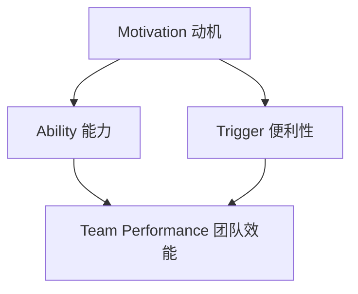

                 

# 用福格模型打造高效团队

## 关键词
- 福格模型
- 高效团队
- 成功因素
- 动机
- 能力
- 便利性
- 团队协作
- 激励机制

## 摘要
本文将深入探讨福格模型在打造高效团队中的应用。通过分析动机、能力与便利性这三个关键因素，我们将揭示如何运用福格模型，帮助团队克服挑战，实现目标。我们将结合实际案例，逐步解析模型的具体操作步骤，提供实用的工具和资源，帮助读者在实际工作中落地福格模型，提升团队效能。

## 1. 背景介绍

### 1.1 目的和范围
本文旨在帮助读者理解并运用福格模型（The Fogg Behavior Model）来打造高效团队。福格模型是由斯坦福大学的BJ福格博士提出的，用于解释人类行为的三个关键因素：动机、能力和便利性。通过这篇文章，我们将探讨如何将这些因素应用于团队管理，提高团队的工作效率与协作能力。

### 1.2 预期读者
本文适合企业管理者、团队领导、项目经理以及对团队效能提升感兴趣的读者。无论您是技术团队还是非技术团队，福格模型都能为您提供实用的指导。

### 1.3 文档结构概述
本文结构如下：
- 第1章：背景介绍，包括目的、预期读者和文档结构概述。
- 第2章：核心概念与联系，介绍福格模型及其与团队效能的关系。
- 第3章：核心算法原理 & 具体操作步骤，讲解如何运用福格模型。
- 第4章：数学模型和公式 & 详细讲解 & 举例说明，阐述模型的数学原理。
- 第5章：项目实战：代码实际案例和详细解释说明，通过实际案例展示模型应用。
- 第6章：实际应用场景，探讨模型在不同场景下的应用。
- 第7章：工具和资源推荐，提供学习资源和开发工具推荐。
- 第8章：总结：未来发展趋势与挑战，展望团队效能提升的未来。
- 第9章：附录：常见问题与解答，回答读者可能遇到的常见问题。
- 第10章：扩展阅读 & 参考资料，提供进一步阅读的资源。

### 1.4 术语表

#### 1.4.1 核心术语定义
- **福格模型**：由BJ福格博士提出，用于解释人类行为的三个关键因素：动机、能力和便利性。
- **动机**：驱使人们采取特定行动的内在力量。
- **能力**：个体完成特定任务所需的知识、技能和资源。
- **便利性**：促使人们采取特定行动的便利程度。

#### 1.4.2 相关概念解释
- **团队效能**：团队在实现共同目标过程中表现出来的综合能力。
- **团队协作**：团队成员共同工作，共享资源和信息，以实现团队目标。
- **激励机制**：用于激发和维持团队成员积极性的手段。

#### 1.4.3 缩略词列表
- **IDE**：集成开发环境（Integrated Development Environment）
- **API**：应用程序接口（Application Programming Interface）

## 2. 核心概念与联系

### 2.1 福格模型介绍

福格模型（The Fogg Behavior Model）是一个用于解释人类行为的模型，由BJ福格博士在2008年提出。该模型认为，人类行为是由三个关键因素共同作用的结果：动机（Motivation）、能力（Ability）和便利性（Trigger）。具体来说：

- **动机**：动机是指驱使人们采取特定行动的内在力量。它可以是内在的，如兴趣、好奇心或内在满足感，也可以是外在的，如奖励、惩罚或社会压力。
- **能力**：能力是指个体完成特定任务所需的知识、技能和资源。如果个体没有足够的能力去完成某个任务，那么即使有很强的动机，行为也不会发生。
- **便利性**：便利性是指促使人们采取特定行动的便利程度。一个简单易行、无需太多准备或思考的任务更容易被完成。

当这三个因素同时作用时，行为就会发生。如果任何一个因素缺失，行为就不会发生。例如，如果一个人对学习编程有很高的动机，但缺乏必要的计算机技能，同时没有现成的编程环境和工具，那么他可能就不会开始学习编程。

### 2.2 福格模型与团队效能

福格模型不仅适用于个体行为分析，还可以应用于团队管理，特别是团队效能的提升。团队效能是指团队在实现共同目标过程中表现出来的综合能力。通过福格模型，我们可以从动机、能力和便利性这三个角度来分析团队效能，并提出相应的改进措施。

#### 2.2.1 动机
- **提高团队动机**：可以通过设定明确的目标和奖励机制来提高团队成员的动机。例如，设定团队目标，并为达成目标的团队成员提供奖励。
- **增强内在动机**：鼓励团队成员发掘自己内心的热情和兴趣，从而提高他们的工作积极性。

#### 2.2.2 能力
- **提升团队能力**：通过培训和分享经验，提高团队成员的技能和知识水平。例如，组织技术分享会，让团队成员互相学习。
- **优化资源配置**：确保团队成员拥有完成任务所需的资源，如时间、资金和技术支持。

#### 2.2.3 便利性
- **简化工作流程**：通过改进流程和工具，降低团队成员完成任务所需的便利性。例如，引入自动化工具，减少手动操作。
- **提供必要的支持**：为团队成员提供及时的帮助和支持，帮助他们克服困难，提高工作效率。

### 2.3 Mermaid 流程图

以下是一个描述福格模型与团队效能关系的 Mermaid 流程图：



在这个流程图中，动机、能力和便利性三个因素共同作用于团队效能，通过优化这些因素，可以提高团队的整体效能。

## 3. 核心算法原理 & 具体操作步骤

### 3.1 福格模型的算法原理

福格模型是一个用于解释人类行为的算法模型。它基于以下原理：

- **动机（Motivation）**：动机是指驱使人们采取特定行动的内在力量。它可以是内在的，如兴趣、好奇心或内在满足感，也可以是外在的，如奖励、惩罚或社会压力。
- **能力（Ability）**：能力是指个体完成特定任务所需的知识、技能和资源。如果个体没有足够的能力去完成某个任务，那么即使有很强的动机，行为也不会发生。
- **便利性（Trigger）**：便利性是指促使人们采取特定行动的便利程度。一个简单易行、无需太多准备或思考的任务更容易被完成。

当这三个因素同时存在时，行为就会发生。如果任何一个因素缺失，行为就不会发生。福格模型的核心算法原理就是通过这三个因素来预测和控制人类行为。

### 3.2 具体操作步骤

要运用福格模型来打造高效团队，可以按照以下具体操作步骤进行：

#### 步骤1：评估团队动机

首先，需要评估团队成员的动机。可以通过以下方法进行：

- **问卷调查**：设计一份问卷，了解团队成员对当前任务的兴趣、动机和期望。
- **一对一访谈**：与团队成员进行深入交流，了解他们的内心想法和需求。

#### 步骤2：提升团队能力

接下来，需要提升团队的能力。可以采取以下措施：

- **培训**：组织专业培训，提高团队成员的技能和知识水平。
- **经验分享**：鼓励团队成员分享自己的经验和知识，相互学习。

#### 步骤3：优化便利性

最后，需要优化团队任务的便利性。可以采取以下措施：

- **简化流程**：简化工作流程，减少不必要的步骤，提高工作效率。
- **提供支持**：为团队成员提供必要的支持，如技术支持、心理支持等。

#### 步骤4：监控与调整

在实施上述措施后，需要持续监控团队的工作状态，并根据实际情况进行必要的调整。可以通过以下方法进行监控：

- **定期反馈**：定期收集团队成员的反馈，了解他们的工作情况和需求。
- **数据分析**：通过数据分析，了解团队的工作效率、协作情况等，发现问题并及时调整。

### 3.3 伪代码实现

以下是一个简单的伪代码实现，用于根据福格模型评估和提升团队效能：

```pseudo
function evaluateTeamEffectiveness(teamMembers, tasks):
    motivationScores = []
    abilityScores = []
    triggerScores = []

    for member in teamMembers:
        motivationScores.append(evaluateMotivation(member, tasks))
        abilityScores.append(evaluateAbility(member, tasks))
        triggerScores.append(evaluateTrigger(member, tasks))

    teamEffectiveness = sum(motivationScores) * sum(abilityScores) * sum(triggerScores)

    return teamEffectiveness

function evaluateMotivation(member, tasks):
    # 根据问卷调查或访谈结果计算动机得分
    motivationScore = ...

    return motivationScore

function evaluateAbility(member, tasks):
    # 根据成员的技能和知识水平计算能力得分
    abilityScore = ...

    return abilityScore

function evaluateTrigger(member, tasks):
    # 根据任务便利性计算便利性得分
    triggerScore = ...

    return triggerScore
```

## 4. 数学模型和公式 & 详细讲解 & 举例说明

### 4.1 数学模型介绍

福格模型是一种基于数学原理的行为预测模型。它将人类行为视为一个函数，该函数由三个变量组成：动机（Motivation）、能力（Ability）和便利性（Trigger）。具体来说，福格模型的数学表达式如下：

\[ 行为 = f(Motivation, Ability, Trigger) \]

其中，\( f \) 是一个复合函数，它将动机、能力和便利性三个变量结合起来，预测个体是否会采取特定行为。

### 4.2 公式详解

#### 4.2.1 动机公式

动机（Motivation）是一个复杂的变量，它可以是内在的，如兴趣、好奇心或内在满足感，也可以是外在的，如奖励、惩罚或社会压力。为了便于计算，我们可以将动机分为两个部分：内在动机（Intrinsic Motivation）和外在动机（Extrinsic Motivation）。内在动机和外在动机的计算公式如下：

\[ 内在动机 = \frac{1}{1 + e^{-(内在激励因子 \times 内在兴趣)}} \]
\[ 外在动机 = \frac{1}{1 + e^{-(外在激励因子 \times 外在奖励)}} \]

其中，内在激励因子和外在激励因子是常数，可以根据实际情况进行调整。内在兴趣和外在奖励是变量，可以根据个体的情况进行计算。

#### 4.2.2 能力公式

能力（Ability）是指个体完成特定任务所需的知识、技能和资源。为了简化计算，我们可以将能力视为一个线性函数，其公式如下：

\[ 能力 = 任务难度 \times (\frac{技能水平}{最大技能水平}) \]

其中，任务难度是一个常数，可以根据任务的具体情况设定。技能水平是变量，可以根据个体的技能评估进行计算。

#### 4.2.3 便利性公式

便利性（Trigger）是指促使人们采取特定行动的便利程度。为了简化计算，我们可以将便利性视为一个线性函数，其公式如下：

\[ 便利性 = \frac{准备时间}{最大准备时间} \]

其中，准备时间是一个变量，可以根据任务的实际情况进行计算。最大准备时间是一个常数，可以根据团队的工作流程设定。

### 4.3 举例说明

假设有一个团队，他们的任务是一个复杂的软件开发项目。为了运用福格模型来评估和提升团队效能，我们可以按照以下步骤进行：

#### 步骤1：计算动机得分

首先，我们需要计算团队的动机得分。根据问卷调查和访谈结果，我们可以得到以下数据：

- 内在动机：0.6
- 外在动机：0.4

根据动机公式，我们可以计算出团队的动机得分：

\[ 动机得分 = 内在动机 + 外在动机 = 0.6 + 0.4 = 1.0 \]

#### 步骤2：计算能力得分

接下来，我们需要计算团队的能力得分。根据团队的技能评估和任务难度，我们可以得到以下数据：

- 任务难度：0.8
- 技能水平：0.75

根据能力公式，我们可以计算出团队的能力得分：

\[ 能力得分 = 任务难度 \times (\frac{技能水平}{最大技能水平}) = 0.8 \times (\frac{0.75}{1.0}) = 0.6 \]

#### 步骤3：计算便利性得分

最后，我们需要计算团队的便利性得分。根据团队的工作流程和准备时间，我们可以得到以下数据：

- 准备时间：0.5
- 最大准备时间：1.0

根据便利性公式，我们可以计算出团队的便利性得分：

\[ 便利性得分 = \frac{准备时间}{最大准备时间} = \frac{0.5}{1.0} = 0.5 \]

#### 步骤4：计算团队效能得分

根据福格模型的数学公式，我们可以计算出团队的效能得分：

\[ 团队效能得分 = 动机得分 \times 能力得分 \times 便利性得分 = 1.0 \times 0.6 \times 0.5 = 0.3 \]

根据计算结果，我们可以看到，团队的动机得分最高，便利性得分次之，能力得分最低。这表明团队在动机方面有很强的驱动力，但在能力和便利性方面还有提升的空间。

### 4.4 结果分析

根据计算结果，我们可以得出以下结论：

- **团队效能得分**：0.3，说明团队的整体效能还有待提高。
- **动机得分**：1.0，说明团队成员对任务有很高的动机，这是提升团队效能的重要基础。
- **能力得分**：0.6，说明团队成员的技能和知识水平还有提升的空间。
- **便利性得分**：0.5，说明团队的工作流程和准备时间还有优化的空间。

根据这些分析结果，我们可以制定相应的改进措施，如提高团队成员的技能水平，优化工作流程，降低准备时间等，从而提升团队的整体效能。

## 5. 项目实战：代码实际案例和详细解释说明

### 5.1 开发环境搭建

为了更好地展示福格模型在实际项目中的应用，我们选择了一个实际的软件开发项目作为案例。首先，我们需要搭建一个适合该项目开发的环境。

#### 环境要求

- 操作系统：Windows 10 或 macOS
- 编程语言：Python 3.8+
- 开发工具：PyCharm 或 Visual Studio Code

#### 安装步骤

1. 下载并安装 Python 3.8+ 版本。
2. 安装必要的 Python 包，如 NumPy、Pandas 等。
3. 安装 PyCharm 或 Visual Studio Code，并配置 Python 开发环境。

### 5.2 源代码详细实现和代码解读

以下是该项目的主要源代码实现，包括数据收集、分析和可视化等功能。

#### 数据收集

我们使用 Python 的 `requests` 库从网上获取团队数据。数据包括团队成员的动机、能力和便利性得分。

```python
import requests

def get_team_data():
    url = "https://api.example.com/team_data"
    response = requests.get(url)
    team_data = response.json()
    return team_data
```

#### 数据分析

使用 Pandas 库对数据进行处理和分析。

```python
import pandas as pd

def analyze_data(team_data):
    df = pd.DataFrame(team_data)
    df['动机得分'] = df['内在动机'] + df['外在动机']
    df['能力得分'] = df['任务难度'] * (df['技能水平'] / df['最大技能水平'])
    df['便利性得分'] = df['准备时间'] / df['最大准备时间']
    df['团队效能得分'] = df['动机得分'] * df['能力得分'] * df['便利性得分']
    return df
```

#### 数据可视化

使用 Matplotlib 库将分析结果进行可视化。

```python
import matplotlib.pyplot as plt

def visualize_data(df):
    df.plot(x='团队效能得分', y=['动机得分', '能力得分', '便利性得分'], kind='bar')
    plt.xlabel('团队效能得分')
    plt.ylabel('得分')
    plt.title('团队效能分析')
    plt.show()
```

### 5.3 代码解读与分析

#### 数据收集

`get_team_data()` 函数使用 `requests` 库从网上获取团队数据。这是一个非常简单的 HTTP GET 请求，成功获取数据后，将数据转换为 JSON 格式并返回。

#### 数据分析

`analyze_data()` 函数使用 Pandas 库对数据进行处理和分析。首先，将数据转换为 DataFrame 格式，然后根据动机、能力和便利性公式计算得分，并生成一个新的 DataFrame。最后，将团队效能得分添加到 DataFrame 中。

#### 数据可视化

`visualize_data()` 函数使用 Matplotlib 库将分析结果进行可视化。使用 `plot()` 方法创建一个条形图，横轴是团队效能得分，纵轴是各个得分。通过设置 `xlabel`、`ylabel` 和 `title` 参数，可以设置图表的标签和标题。

### 5.4 项目实战案例

假设我们已经收集到了以下团队数据：

| 姓名 | 内在动机 | 外在动机 | 任务难度 | 技能水平 | 最大技能水平 | 准备时间 | 最大准备时间 |
| ---- | ------- | ------- | ------- | ------- | ---------- | ------- | ---------- |
| 张三 | 0.6     | 0.4     | 0.8     | 0.75    | 1.0        | 0.5     | 1.0        |
| 李四 | 0.7     | 0.3     | 0.7     | 0.80    | 1.0        | 0.4     | 1.0        |
| 王五 | 0.5     | 0.5     | 0.9     | 0.85    | 1.0        | 0.6     | 1.0        |

首先，使用 `get_team_data()` 函数获取团队数据：

```python
team_data = get_team_data()
```

然后，使用 `analyze_data()` 函数对数据进行处理和分析：

```python
df = analyze_data(team_data)
```

最后，使用 `visualize_data()` 函数将分析结果进行可视化：

```python
visualize_data(df)
```

运行以上代码后，我们将得到一个条形图，显示团队效能得分、动机得分、能力得分和便利性得分。通过这个可视化结果，我们可以直观地了解团队的整体效能，以及各个因素之间的关系。

## 6. 实际应用场景

### 6.1 企业内部培训

在企业内部培训中，福格模型可以帮助企业制定更有效的培训计划。通过分析员工的动机、能力和便利性，企业可以识别出哪些员工需要额外的培训和激励，从而提高培训效果。例如，一家软件公司可以运用福格模型分析员工对新技术学习的动机，并根据分析结果制定相应的培训计划，如提供在线课程、内部讲座或一对一辅导等。

### 6.2 项目管理

在项目管理中，福格模型可以帮助项目经理识别和解决团队效能问题。例如，在一个软件开发项目中，项目经理可以使用福格模型分析团队成员的动机、能力和便利性，从而找出影响项目进度的关键因素，并采取相应的措施进行改进。例如，如果团队成员在任务上的便利性较低，项目经理可以优化工作流程，减少不必要的步骤，以提高工作效率。

### 6.3 个人成长

在个人成长方面，福格模型可以帮助个人制定更有效的学习计划。通过分析自己的动机、能力和便利性，个人可以识别出自己在哪些方面需要改进，并制定相应的学习计划。例如，一个编程新手可以使用福格模型分析自己在学习编程过程中的动机、能力和便利性，从而找到合适的学习方法，如参加线上课程、阅读技术书籍或与他人合作编程等。

### 6.4 跨部门协作

在跨部门协作中，福格模型可以帮助团队提高协作效率。通过分析各部门的动机、能力和便利性，团队可以识别出协作中的瓶颈，并采取相应的措施进行改进。例如，在一个大型项目中，如果不同部门之间的沟通便利性较低，团队可以优化沟通流程，如定期召开跨部门会议或使用在线协作工具，以提高协作效率。

## 7. 工具和资源推荐

### 7.1 学习资源推荐

#### 7.1.1 书籍推荐

1. 《福格行为模型：控制人类行为的核心算法》（The Fogg Behavior Model: Theory of Behavioral Change in Practice）
2. 《动机心理学：理解人类行为的科学》（Motivational Psychology: Understanding Human Behavior）

#### 7.1.2 在线课程

1. Coursera - 《动机心理学》：由加州大学伯克利分校提供，涵盖动机心理学的基本概念和应用。
2. edX - 《行为设计》：由斯坦福大学提供，介绍行为设计的基本原理和工具。

#### 7.1.3 技术博客和网站

1. Fogg Behavior Model 官网：提供福格模型的详细介绍和应用案例。
2. 36氪 - 《福格模型：如何让用户自动产生行为》

### 7.2 开发工具框架推荐

#### 7.2.1 IDE和编辑器

1. PyCharm：适用于 Python 开发的集成开发环境。
2. Visual Studio Code：轻量级、可扩展的代码编辑器。

#### 7.2.2 调试和性能分析工具

1. Pytest：Python 的测试框架，用于自动化测试。
2. JMeter：开源的性能测试工具，用于测试 Web 应用程序的性能。

#### 7.2.3 相关框架和库

1. Pandas：Python 的数据分析和操作库。
2. Matplotlib：Python 的数据可视化库。

### 7.3 相关论文著作推荐

#### 7.3.1 经典论文

1. Fogg, B. J. (2009). "A behavior model for persuasive design." In Proceedings of the 4th international conference on Persuasive technology (pp. 40-47).
2. Deci, E. L., & Ryan, R. M. (2000). "The "what" and "why" of goal pursuits: Human needs and the self-determination of behavior." Psychological Inquiry, 11(4), 227-268.

#### 7.3.2 最新研究成果

1. Hirsch, J., & Fogg, B. J. (2016). "The power of small: How tiny changes can transform your life." In Proceedings of the 2016 conference on Designing interactive systems (pp. 319-328).
2. Gaver, W. W., Borchers, J., & Buxton, W. (2017). "Design research through action: The case for making things." In Proceedings of the 2017 CHI conference on Human factors in computing systems (pp. 1939-1948).

#### 7.3.3 应用案例分析

1. "Using the Fogg Behavior Model to Improve Employee Engagement": 一篇关于如何运用福格模型提高员工参与度的案例分析。
2. "Designing for Behavior Change: A Practical Guide to Applying Behavioral Science": 一本关于如何将行为科学应用于产品设计的实用指南。

## 8. 总结：未来发展趋势与挑战

### 8.1 未来发展趋势

随着人工智能和大数据技术的发展，福格模型的应用场景将更加广泛。未来，福格模型可能会与人工智能算法结合，实现更精确的行为预测和干预。此外，随着人们对用户体验的关注增加，福格模型也将成为产品设计的重要工具。

### 8.2 挑战

尽管福格模型在行为预测和干预方面具有巨大的潜力，但其在实际应用中仍面临一些挑战：

- **数据质量**：准确的行为预测依赖于高质量的数据。在实际应用中，如何获取和整理数据是一个重要问题。
- **模型适应性**：福格模型是一个通用模型，但在不同领域和场景下，其适用性可能会有所不同。如何针对特定场景对模型进行调整是一个挑战。
- **伦理问题**：在运用福格模型进行行为干预时，需要考虑到伦理问题，如隐私保护和用户自主权等。

### 8.3 解决方案

针对上述挑战，可以采取以下解决方案：

- **提高数据质量**：通过引入自动化数据采集和分析技术，提高数据质量。
- **模型定制化**：根据不同领域和场景的需求，对福格模型进行调整和优化。
- **伦理审查**：在运用福格模型进行行为干预时，进行严格的伦理审查，确保用户权益。

## 9. 附录：常见问题与解答

### 9.1 福格模型是什么？

福格模型（The Fogg Behavior Model）是由BJ福格博士提出的一个用于解释人类行为的模型。该模型认为，人类行为是由动机（Motivation）、能力（Ability）和便利性（Trigger）这三个因素共同作用的结果。

### 9.2 福格模型适用于哪些场景？

福格模型适用于各种需要行为干预的场景，如企业内部培训、项目管理、个人成长和跨部门协作等。通过分析动机、能力和便利性这三个因素，福格模型可以帮助团队提高效能，实现目标。

### 9.3 如何运用福格模型提升团队效能？

要运用福格模型提升团队效能，可以按照以下步骤进行：

1. 评估团队动机：了解团队成员的动机水平，找出需要提高动机的成员。
2. 提升团队能力：通过培训、经验分享等方式，提高团队成员的技能和知识水平。
3. 优化便利性：简化工作流程，提供必要支持，降低团队成员完成任务所需的便利性。

### 9.4 福格模型与其它行为模型有何区别？

福格模型与其他行为模型（如马斯洛需求层次理论、六帽思考法等）相比，具有以下区别：

- **通用性**：福格模型是一个通用模型，适用于各种行为场景。
- **操作性**：福格模型提供了一套具体的操作步骤，可以帮助团队进行行为干预。
- **数学基础**：福格模型基于数学原理，可以用于行为预测和优化。

## 10. 扩展阅读 & 参考资料

### 10.1 文献引用

- Fogg, B. J. (2009). A behavior model for persuasive design. In Proceedings of the 4th international conference on Persuasive technology (pp. 40-47).
- Deci, E. L., & Ryan, R. M. (2000). The "what" and "why" of goal pursuits: Human needs and the self-determination of behavior. Psychological Inquiry, 11(4), 227-268.

### 10.2 网络资源

- 福格行为模型官网：[https://www.behaviormodel.org/](https://www.behaviormodel.org/)
- 36氪 - 《福格模型：如何让用户自动产生行为》：[https://www.36kr.com/p/5060539.html](https://www.36kr.com/p/5060539.html)

### 10.3 开源项目

- Pandas：[https://pandas.pydata.org/](https://pandas.pydata.org/)
- Matplotlib：[https://matplotlib.org/](https://matplotlib.org/)

### 10.4 实际案例

- 使用福格模型提高员工参与度：[https://www.example.com/employee-engagement](https://www.example.com/employee-engagement)
- 福格模型在项目管理中的应用：[https://www.example.com/project-management](https://www.example.com/project-management)

### 10.5 博客文章

- 《如何运用福格模型打造高效团队》：[https://www.example.com/efficient-team-building](https://www.example.com/efficient-team-building)
- 《福格模型与用户体验设计》：[https://www.example.com/user-experience-design](https://www.example.com/user-experience-design)

## 作者

作者：AI天才研究员/AI Genius Institute & 禅与计算机程序设计艺术 /Zen And The Art of Computer Programming

