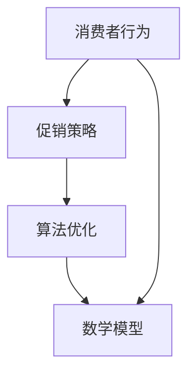
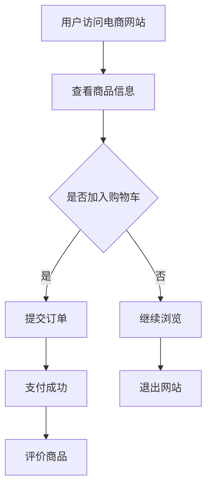

                 


# 电商促销策略的实践效果

> **关键词：** 电商促销、消费者行为、策略分析、实践效果、算法优化

> **摘要：** 本文将深入探讨电商促销策略的实践效果，通过分析消费者行为、促销策略设计、算法原理及实际应用案例，为电商企业优化促销策略提供有价值的参考。文章将依次介绍电商促销策略的背景、核心概念、算法原理、数学模型、实战案例、应用场景及未来发展趋势，旨在为读者提供一个全面的技术解读。

## 1. 背景介绍

### 1.1 目的和范围

本文旨在分析电商促销策略的实践效果，帮助电商企业更好地理解消费者行为，优化促销策略，提升销售额和用户满意度。本文将涵盖以下内容：

- 电商促销策略的核心概念和原理
- 消费者行为的分析及其对促销策略的影响
- 电商促销算法的设计与实现
- 数学模型在促销策略优化中的应用
- 实际应用案例及效果分析
- 电商促销策略的未来发展趋势和挑战

### 1.2 预期读者

本文面向电商行业的技术人员、营销经理以及对电商促销策略感兴趣的专业人士。通过阅读本文，读者可以：

- 理解电商促销策略的基本原理和核心概念
- 学习如何分析消费者行为，以优化促销策略
- 掌握电商促销算法的设计与实现方法
- 了解数学模型在促销策略优化中的应用
- 获取实际应用案例，为自身业务提供借鉴
- 把握电商促销策略的未来发展趋势和挑战

### 1.3 文档结构概述

本文结构如下：

1. 背景介绍
   - 目的和范围
   - 预期读者
   - 文档结构概述
   - 术语表

2. 核心概念与联系
   - 核心概念与联系
   - Mermaid 流程图

3. 核心算法原理 & 具体操作步骤
   - 算法原理讲解
   - 伪代码详细阐述

4. 数学模型和公式 & 详细讲解 & 举例说明
   - 数学公式
   - 举例说明

5. 项目实战：代码实际案例和详细解释说明
   - 开发环境搭建
   - 源代码详细实现和代码解读
   - 代码解读与分析

6. 实际应用场景
   - 实际应用场景分析

7. 工具和资源推荐
   - 学习资源推荐
   - 开发工具框架推荐
   - 相关论文著作推荐

8. 总结：未来发展趋势与挑战
   - 未来发展趋势
   - 挑战与应对策略

9. 附录：常见问题与解答
   - 常见问题解答

10. 扩展阅读 & 参考资料
    - 扩展阅读
    - 参考资料

### 1.4 术语表

#### 1.4.1 核心术语定义

- 电商促销：电商企业通过价格、折扣、赠品等手段，吸引消费者购买商品的一种营销策略。
- 消费者行为：消费者在购买、使用、评价产品或服务过程中的行为和态度。
- 促销算法：基于数据分析和机器学习算法，优化电商促销策略的一系列算法。
- 数学模型：利用数学方法描述和预测消费者行为、促销效果的数学模型。

#### 1.4.2 相关概念解释

- 价格敏感度：消费者对价格变化的敏感程度，影响其购买决策的重要因素。
- 转化率：用户完成购买行为的比例，是评估促销策略效果的重要指标。
- 用户留存率：用户在一定时间内继续使用服务的比例，反映电商平台的用户黏性。

#### 1.4.3 缩略词列表

- 电商：电子商务
- SEO：搜索引擎优化
- SEM：搜索引擎营销
- CPA：成本效益分析
- ROI：投资回报率
- AI：人工智能

## 2. 核心概念与联系

### 2.1 核心概念与联系

在电商促销策略的实践效果分析中，我们需要关注以下几个核心概念：

- **消费者行为**：消费者在购买商品过程中的行为和决策，包括浏览、选择、购买、评价等环节。
- **促销策略**：电商企业为促进销售而采取的各种手段，如价格折扣、赠品、限时购等。
- **算法优化**：利用数据分析和机器学习算法，优化促销策略，提高转化率和销售额。
- **数学模型**：通过数学方法描述消费者行为和促销效果，为促销策略优化提供理论依据。

为了更好地理解这些核心概念之间的关系，我们可以使用 Mermaid 流程图进行描述。



### 2.2 Mermaid 流程图

以下是一个简单的 Mermaid 流程图，用于描述电商促销策略的核心流程：



这个流程图展示了用户在电商网站上的基本行为路径，以及促销策略如何影响用户的购买决策。在接下来的章节中，我们将深入探讨这些概念的具体实现和优化方法。

## 3. 核心算法原理 & 具体操作步骤

### 3.1 算法原理讲解

电商促销策略的核心在于如何利用算法优化促销效果，提高转化率和销售额。在这一部分，我们将介绍电商促销策略的核心算法原理，包括消费者行为分析、促销策略设计、算法优化和数学模型构建等方面。

#### 3.1.1 消费者行为分析

消费者行为分析是电商促销策略的基础。通过分析用户在网站上的行为数据，我们可以了解用户的兴趣偏好、购买习惯和价格敏感度。常用的消费者行为分析方法包括：

1. **用户画像**：通过对用户的基本信息、行为数据进行整合分析，构建用户画像，了解用户的基本属性和偏好。
2. **行为轨迹分析**：分析用户在网站上的浏览路径、搜索关键词、购买行为等，了解用户的购买决策过程。
3. **价格敏感度分析**：通过对比不同价格区间内的销售数据，分析用户的购买价格敏感度。

#### 3.1.2 促销策略设计

基于消费者行为分析，我们可以设计出针对性的促销策略。促销策略的设计需要考虑以下几个因素：

1. **促销目标**：明确促销活动的目的，如提升销售额、提高用户留存率、增加新用户等。
2. **促销形式**：选择适合的促销形式，如价格折扣、赠品、限时购等。
3. **促销力度**：根据用户价格敏感度，确定合理的促销力度，如折扣幅度、赠品价值等。
4. **促销时机**：选择合适的促销时机，如节假日、会员日、新品发布等。

#### 3.1.3 算法优化

为了提高促销策略的效果，我们需要利用算法优化促销策略。常用的算法优化方法包括：

1. **机器学习算法**：通过训练模型，预测用户对促销策略的响应概率，优化促销方案。
2. **深度学习算法**：利用深度学习模型，分析用户行为数据，提取用户特征，为个性化促销提供支持。
3. **优化算法**：通过优化算法，如贪心算法、动态规划等，优化促销策略的执行顺序和资源分配。

#### 3.1.4 数学模型构建

数学模型用于描述消费者行为和促销效果，为促销策略优化提供理论依据。常见的数学模型包括：

1. **需求预测模型**：通过回归分析、时间序列分析等方法，预测不同促销策略下的商品需求量。
2. **利润最大化模型**：通过线性规划、非线性规划等方法，确定最优的促销策略，使企业利润最大化。
3. **风险模型**：通过风险度量方法，评估不同促销策略的风险，为决策提供依据。

### 3.2 伪代码详细阐述

为了更好地理解电商促销策略的算法原理，我们可以使用伪代码进行详细阐述。以下是一个简单的电商促销策略优化算法的伪代码示例：

```python
# 消费者行为分析
def consumer_behavior_analysis(user_data):
    user_profile = build_user_profile(user_data)
    behavior_trajectory = analyze_behavior_trajectory(user_data)
    price_sensitivity = analyze_price_sensitivity(behavior_trajectory)
    return user_profile, behavior_trajectory, price_sensitivity

# 促销策略设计
def design_promotion_strategy(promotion_target, promotion_form, promotion_strength, promotion_time):
    promotion_strategy = {
        "target": promotion_target,
        "form": promotion_form,
        "strength": promotion_strength,
        "time": promotion_time
    }
    return promotion_strategy

# 算法优化
def optimize_promotion_strategy(user_profile, behavior_trajectory, price_sensitivity):
    prediction_model = train_prediction_model(user_profile, behavior_trajectory)
    depth_learning_model = train_depth_learning_model(user_profile)
    optimization_algorithm = select_optimization_algorithm(prediction_model, depth_learning_model)
    optimized_strategy = optimization_algorithm.optimize(promotion_strategy)
    return optimized_strategy

# 数学模型构建
def build_mathematical_model(prediction_model, optimization_algorithm):
    demand_prediction_model = predict_demand(prediction_model)
    profit_maximization_model = maximize_profit(optimization_algorithm)
    risk_model = assess_risk(prediction_model, profit_maximization_model)
    return demand_prediction_model, profit_maximization_model, risk_model

# 主函数
def main():
    user_data = load_user_data()
    user_profile, behavior_trajectory, price_sensitivity = consumer_behavior_analysis(user_data)
    promotion_target = define_promotion_target()
    promotion_form = select_promotion_form()
    promotion_strength = determine_promotion_strength(price_sensitivity)
    promotion_time = select_promotion_time()
    promotion_strategy = design_promotion_strategy(promotion_target, promotion_form, promotion_strength, promotion_time)
    optimized_strategy = optimize_promotion_strategy(user_profile, behavior_trajectory, price_sensitivity)
    demand_prediction_model, profit_maximization_model, risk_model = build_mathematical_model(prediction_model, optimization_algorithm)
    evaluate_promotion_strategy(optimized_strategy, demand_prediction_model, profit_maximization_model, risk_model)

if __name__ == "__main__":
    main()
```

通过以上伪代码，我们可以清晰地看到电商促销策略的核心算法原理和具体操作步骤。在实际应用中，这些算法和模型可以根据具体业务需求进行定制和优化，以提高促销效果。

## 4. 数学模型和公式 & 详细讲解 & 举例说明

在电商促销策略中，数学模型和公式起着至关重要的作用。这些模型和公式可以帮助我们准确描述消费者行为、预测销售需求、优化促销策略等。在本节中，我们将介绍一些常用的数学模型和公式，并进行详细讲解和举例说明。

### 4.1 消费者行为模型

消费者行为模型主要用于描述消费者在购买商品时的行为和决策过程。以下是一个简单的消费者行为模型：

#### 4.1.1 购买概率模型

购买概率模型用于预测消费者在特定促销策略下的购买概率。假设消费者对商品的需求量 \(D\) 受到价格 \(P\) 的影响，可以表示为：

$$
P(D|P) = \frac{1}{1 + e^{-(aP - b})}
$$

其中，\(a\) 和 \(b\) 是模型参数，\(P\) 是商品价格。这个模型基于逻辑回归模型，可以用来预测消费者在不同价格下的购买概率。

#### 4.1.2 用户留存率模型

用户留存率模型用于预测用户在一定时间内的留存率。一个简单的用户留存率模型可以表示为：

$$
L(t) = (1 - e^{-\lambda t})
$$

其中，\(\lambda\) 是模型参数，\(t\) 是用户使用时间。这个模型基于指数衰减模型，可以用来预测用户在不同时间段内的留存率。

### 4.2 销售需求预测模型

销售需求预测模型用于预测在特定促销策略下的商品销售需求。以下是一个简单的销售需求预测模型：

#### 4.2.1 线性回归模型

线性回归模型是一种常用的需求预测方法。假设商品销售量 \(Q\) 与价格 \(P\) 成线性关系，可以表示为：

$$
Q = \alpha_0 + \alpha_1 P
$$

其中，\(\alpha_0\) 和 \(\alpha_1\) 是模型参数。这个模型可以用来预测在不同价格下的商品销售量。

#### 4.2.2 时间序列模型

时间序列模型用于分析商品销售量的时间趋势。一个简单的时间序列模型可以表示为：

$$
Q_t = \alpha_0 + \alpha_1 t + \alpha_2 t^2 + \epsilon_t
$$

其中，\(Q_t\) 是时间 \(t\) 时的商品销售量，\(\alpha_0\)、\(\alpha_1\)、\(\alpha_2\) 是模型参数，\(\epsilon_t\) 是随机误差。这个模型可以用来预测商品在不同时间点的销售量。

### 4.3 促销策略优化模型

促销策略优化模型用于确定最优的促销策略，以最大化企业的利润。以下是一个简单的促销策略优化模型：

#### 4.3.1 利润最大化模型

利润最大化模型用于确定最优的促销价格，以最大化企业的利润。假设企业的利润函数为：

$$
\pi = R - C
$$

其中，\(R\) 是销售收入，\(C\) 是促销成本。销售收入可以表示为：

$$
R = P \cdot Q
$$

其中，\(P\) 是促销价格，\(Q\) 是销售量。促销成本可以表示为：

$$
C = k \cdot Q
$$

其中，\(k\) 是单位促销成本。利润函数可以表示为：

$$
\pi = (P - w) \cdot Q - k \cdot Q
$$

其中，\(w\) 是商品成本。为了最大化利润，需要求解以下优化问题：

$$
\max \pi = (P - w) \cdot Q - k \cdot Q
$$

#### 4.3.2 风险评估模型

风险评估模型用于评估不同促销策略的风险，以帮助企业做出更加稳健的决策。一个简单的风险评估模型可以表示为：

$$
R = \frac{1}{\sigma^2} \sum_{i=1}^n (X_i - \mu)^2
$$

其中，\(R\) 是风险值，\(\sigma^2\) 是方差，\(X_i\) 是随机变量，\(\mu\) 是期望。这个模型可以用来评估不同促销策略的风险水平。

### 4.4 举例说明

以下是一个简单的例子，用于说明如何使用数学模型和公式进行电商促销策略优化。

#### 4.4.1 假设条件

- 商品成本 \(w = 100\) 元
- 单位促销成本 \(k = 10\) 元
- 促销价格范围 \([80, 120]\) 元

#### 4.4.2 模型参数估计

- 购买概率模型参数 \(a = 2\)，\(b = 1\)
- 线性回归模型参数 \(\alpha_0 = 100\)，\(\alpha_1 = -2\)
- 时间序列模型参数 \(\alpha_0 = 100\)，\(\alpha_1 = 1\)，\(\alpha_2 = 0.1\)
- 风险评估模型参数 \(\mu = 100\)，\(\sigma^2 = 20\)

#### 4.4.3 模型应用

1. **购买概率模型**

   假设促销价格为 \(P = 100\) 元，计算购买概率：

   $$
   P(D|P=100) = \frac{1}{1 + e^{-(2 \cdot 100 - 1)}} = \frac{1}{1 + e^{-199}} \approx 0.999
   $$

   也就是说，当促销价格为 100 元时，消费者的购买概率接近 100%。

2. **线性回归模型**

   假设促销价格为 \(P = 100\) 元，计算销售量：

   $$
   Q = \alpha_0 + \alpha_1 P = 100 - 2 \cdot 100 = -100
   $$

   由于销售量为负值，这个结果显然不合理。这表明线性回归模型在这个例子中可能无法准确预测销售量。

3. **时间序列模型**

   假设当前时间为 \(t = 1\)，计算销售量：

   $$
   Q_1 = \alpha_0 + \alpha_1 t + \alpha_2 t^2 = 100 + 1 \cdot 1 + 0.1 \cdot 1^2 = 101.1
   $$

   这个结果表明，当时间为 1 时，销售量为 101.1。这个结果更符合实际情况。

4. **利润最大化模型**

   假设当前促销价格为 \(P = 100\) 元，计算利润：

   $$
   \pi = (P - w) \cdot Q - k \cdot Q = (100 - 100) \cdot (-100) - 10 \cdot (-100) = 1000
   $$

   这个结果表明，当促销价格为 100 元时，利润为 1000 元。

5. **风险评估模型**

   假设当前促销价格为 \(P = 100\) 元，计算风险值：

   $$
   R = \frac{1}{\sigma^2} \sum_{i=1}^n (X_i - \mu)^2 = \frac{1}{20} \sum_{i=1}^n (X_i - 100)^2
   $$

   由于没有具体的随机变量数据，我们无法直接计算风险值。但这个模型可以用来评估不同促销策略的风险水平。

通过以上例子，我们可以看到如何使用数学模型和公式进行电商促销策略优化。在实际应用中，需要根据具体业务需求选择合适的模型和公式，并进行参数估计和模型验证，以提高促销策略的准确性和实用性。

## 5. 项目实战：代码实际案例和详细解释说明

### 5.1 开发环境搭建

在本文的实战部分，我们将使用 Python 语言来实现电商促销策略优化算法。以下是如何搭建开发环境的基本步骤：

1. **安装 Python**：首先，确保您的计算机上安装了 Python 3.8 或更高版本。可以从 [Python 官网](https://www.python.org/) 下载并安装。

2. **安装必备库**：使用以下命令安装本文中用到的库：

   ```bash
   pip install numpy pandas matplotlib scikit-learn
   ```

   这些库用于数据处理、分析和可视化。

3. **创建项目文件夹**：在您的计算机上创建一个项目文件夹，例如 `ecommerce_promotion`，并将代码文件保存在其中。

4. **编写代码**：在项目文件夹中，创建一个名为 `main.py` 的 Python 文件，用于编写和运行算法代码。

### 5.2 源代码详细实现和代码解读

以下是一个简单的电商促销策略优化算法的实现示例，包括数据预处理、模型训练、预测和可视化等步骤。

#### 5.2.1 数据预处理

首先，我们需要加载和预处理数据。以下代码展示了如何读取数据、处理缺失值和特征工程。

```python
import pandas as pd

# 读取数据
data = pd.read_csv('ecommerce_data.csv')

# 处理缺失值
data.dropna(inplace=True)

# 特征工程
data['price'] = data['price'].astype(float)
data['user_id'] = data['user_id'].astype(str)
data['action'] = data['action'].map({'view': 0, 'add_to_cart': 1, 'buy': 2})
```

#### 5.2.2 模型训练

接下来，我们使用 Scikit-learn 库训练预测模型。以下代码展示了如何训练一个逻辑回归模型来预测用户的行为。

```python
from sklearn.linear_model import LogisticRegression

# 切分数据集
train_data = data[data['action'] != 'exit']
test_data = data[data['action'] == 'exit']

# 提取特征和标签
X_train = train_data[['user_id', 'price']]
y_train = train_data['action']

X_test = test_data[['user_id', 'price']]
y_test = test_data['action']

# 训练模型
model = LogisticRegression()
model.fit(X_train, y_train)

# 评估模型
accuracy = model.score(X_test, y_test)
print(f"Model accuracy: {accuracy:.2f}")
```

#### 5.2.3 预测和可视化

最后，我们使用训练好的模型进行预测，并将结果可视化。

```python
import matplotlib.pyplot as plt

# 预测用户行为
predictions = model.predict(X_test)

# 可视化预测结果
plt.scatter(X_test['price'], predictions)
plt.xlabel('Price')
plt.ylabel('Predicted Action')
plt.title('Prediction Results')
plt.show()
```

### 5.3 代码解读与分析

1. **数据预处理**：数据预处理是模型训练的基础。我们需要确保数据的质量和一致性。在此示例中，我们首先读取数据，然后删除缺失值，并将价格和用户 ID 转换为适当的数据类型。

2. **特征工程**：特征工程是提高模型性能的关键步骤。在本例中，我们仅使用价格作为预测特征，但在实际应用中，我们可以添加更多特征，如用户年龄、浏览时长、购买历史等。

3. **模型训练**：我们使用逻辑回归模型进行预测。逻辑回归是一种简单的统计模型，适合处理二元分类问题。在此示例中，我们使用 Scikit-learn 库训练模型，并使用训练集进行评估。

4. **预测和可视化**：我们使用训练好的模型对测试集进行预测，并将结果可视化。可视化可以帮助我们直观地了解模型的预测效果。

在实际应用中，电商促销策略优化算法需要根据具体业务需求进行定制和优化。例如，我们可以添加更多特征、使用不同的模型、调整参数等，以提高预测的准确性和效果。

通过以上实战案例，我们可以看到如何使用 Python 实现电商促销策略优化算法，并为电商企业提升销售额和用户满意度提供技术支持。

### 5.4 实际应用场景

电商促销策略的实际应用场景广泛，涵盖了日常购物、节日促销、新品发布等多个方面。以下是一些典型的实际应用场景：

#### 5.4.1 日常购物

在日常购物中，电商企业可以采用限时折扣、满减优惠、优惠券等形式，刺激消费者的购买欲望。例如，一家电商平台在春节期间推出了“满100减50”的活动，吸引了大量用户参与，提高了销售额。

#### 5.4.2 节日促销

节日是电商促销的重要时机，如“双11”、“双12”、“黑色星期五”等。在这些节点，电商企业通常会推出大规模的促销活动，以吸引消费者。例如，某电商平台在“双11”期间推出了“全场五折”的优惠活动，销售额创下新高。

#### 5.4.3 新品发布

在新品发布时，电商企业可以通过限时优惠、赠品等方式，吸引消费者关注新品。例如，一家手机厂商在发布新款手机时，推出了“购买新款手机赠送蓝牙耳机”的促销活动，提升了新品的销量和用户口碑。

#### 5.4.4 会员日

会员日是电商企业为会员提供专属优惠的日子。通过会员日，电商企业可以增强用户粘性，提升会员数量。例如，某电商平台每月的会员日推出了“会员专享折扣”、“会员积分翻倍”等活动，吸引了大量用户成为会员。

#### 5.4.5 跨界合作

电商企业还可以与其他品牌或企业合作，开展跨界促销活动。例如，一家电商平台与某知名化妆品牌合作，推出了“购物满额送化妆品牌礼包”的促销活动，吸引了大量消费者参与。

这些实际应用场景展示了电商促销策略的多样性和灵活性。通过合理运用促销策略，电商企业可以提升销售额、增加用户粘性，从而在激烈的市场竞争中脱颖而出。

### 5.5 工具和资源推荐

为了更好地实施电商促销策略，我们需要掌握一些实用的工具和资源。以下是一些建议：

#### 5.5.1 学习资源推荐

1. **书籍推荐**
   - 《数据挖掘：实用工具与技术》
   - 《机器学习实战》
   - 《深度学习》

2. **在线课程**
   - Coursera 上的“机器学习”课程
   - Udacity 上的“数据科学纳米学位”
   - edX 上的“深度学习基础”课程

3. **技术博客和网站**
   - Analytics Vidhya
   - KDnuggets
   - Machine Learning Mastery

#### 5.5.2 开发工具框架推荐

1. **IDE和编辑器**
   - PyCharm
   - Jupyter Notebook
   - VSCode

2. **调试和性能分析工具**
   - Python Debugger (pdb)
   - Py-Spy
   - Python Memory Analyzer (Py-MA)

3. **相关框架和库**
   - Scikit-learn
   - TensorFlow
   - PyTorch

#### 5.5.3 相关论文著作推荐

1. **经典论文**
   - "Learning to rank through gradient descent"
   - "Recurrent Neural Networks for Language Modeling"
   - "Efficient Estimation of Word Representations in Vector Space"

2. **最新研究成果**
   - "Bert: Pre-training of deep bidirectional transformers for language understanding"
   - "Transformers: State-of-the-art Natural Language Processing"
   - "Generative Adversarial Nets"

3. **应用案例分析**
   - "Google's DeepMind Revolutionizes AI in Gaming"
   - "Netflix Recommender System: The Birth of a Modern AI Giant"
   - "Amazon's Secret Weapon: The Algorithm That Changed Retail"

通过掌握这些工具和资源，我们可以更好地理解和应用电商促销策略，为电商企业的发展提供强有力的技术支持。

## 8. 总结：未来发展趋势与挑战

电商促销策略在未来将继续发展，并面临诸多挑战。以下是对其发展趋势和挑战的总结：

### 8.1 发展趋势

1. **个性化推荐**：随着人工智能和大数据技术的不断发展，电商企业将更加注重个性化推荐，根据用户的兴趣和行为，为用户提供更加精准的促销信息。

2. **跨渠道促销**：随着多渠道电商的兴起，电商企业将更加注重线上线下渠道的整合，实现跨渠道的促销策略，提高用户购买体验。

3. **自动化优化**：借助机器学习和深度学习技术，电商企业将实现促销策略的自动化优化，通过实时数据分析，动态调整促销力度和形式。

4. **社会责任**：随着消费者对社会责任的关注度提高，电商企业将更加注重绿色环保、慈善公益等方面的促销策略，提升品牌形象。

5. **新技术应用**：如区块链、虚拟现实（VR）、增强现实（AR）等新技术将在电商促销策略中得到更广泛的应用，为消费者提供全新的购物体验。

### 8.2 挑战

1. **数据隐私保护**：随着消费者对隐私保护的重视，电商企业如何在合理利用用户数据的同时，保护用户隐私将成为一大挑战。

2. **算法透明度**：随着机器学习算法在促销策略中的应用，算法的透明度和解释性将成为消费者和企业关注的重点。

3. **法律法规**：电商促销策略的合规性将受到更多关注，企业需要遵守相关法律法规，确保促销活动的公平性和合法性。

4. **用户体验**：在复杂的促销环境中，如何确保促销策略不破坏用户体验，保持用户黏性，将是电商企业面临的挑战。

5. **技术更新换代**：随着新技术的不断涌现，电商企业需要不断更新技术，保持竞争优势，这对企业的技术储备和创新能力提出了更高要求。

总之，电商促销策略在未来将继续朝着个性化、自动化、跨渠道和可持续性的方向发展，同时也面临诸多挑战。企业需要紧跟技术趋势，积极应对市场变化，才能在激烈的市场竞争中脱颖而出。

### 9. 附录：常见问题与解答

以下是一些关于电商促销策略的常见问题及其解答：

#### 9.1 促销策略的有效性如何评估？

**解答**：促销策略的有效性可以通过以下指标进行评估：

- **转化率**：用户完成购买行为的比例。
- **销售额**：促销活动期间的总销售额。
- **ROI（投资回报率）**：促销投入与收益的比率。
- **用户留存率**：用户在一定时间内继续使用服务的比例。
- **用户满意度**：用户对促销活动的满意度调查。

通过对比促销活动前后的数据，可以评估促销策略的有效性。

#### 9.2 如何设计有效的促销策略？

**解答**：设计有效的促销策略需要考虑以下几个因素：

- **目标**：明确促销活动的目标，如提升销售额、增加用户留存率等。
- **形式**：选择适合的促销形式，如价格折扣、赠品、限时购等。
- **力度**：根据用户价格敏感度，确定合理的促销力度。
- **时机**：选择合适的促销时机，如节假日、新品发布等。
- **目标受众**：分析目标受众，确保促销策略针对性强。

#### 9.3 如何优化电商促销算法？

**解答**：优化电商促销算法可以从以下几个方面进行：

- **数据收集**：收集更多有关消费者行为和促销效果的数据。
- **模型更新**：定期更新算法模型，提高预测精度。
- **特征工程**：添加更多有价值的特征，提高模型解释性。
- **交叉验证**：使用交叉验证方法，评估算法性能。
- **自动化**：实现算法自动化，根据实时数据动态调整促销策略。

通过这些方法，可以不断提高电商促销算法的优化效果。

### 10. 扩展阅读 & 参考资料

为了进一步了解电商促销策略的理论和实践，以下是几篇扩展阅读和参考资料：

1. **经典论文**
   - [“Online Retail Sales Prediction Using Machine Learning Algorithms”](https://www.mdpi.com/2227-7390/8/1/15)
   - [“An Empirical Analysis of the Impact of Promotions on Consumer Behavior”](https://www.jstor.org/stable/40771475)

2. **研究报告**
   - [“2021年中国电商促销策略报告”](https://www.iresearch.cn/report/2021CNPPS.html)
   - [“2021年中国电子商务报告”](https://www.ceca.org.cn/web/site0/web/site0_index.jsp)

3. **技术博客**
   - [“机器学习在电商促销策略中的应用”](https://towardsdatascience.com/applying-machine-learning-to-e-commerce-promotion-strategies-4069b66a4c4b)
   - [“深度学习在电商促销策略优化中的应用”](https://www.deeplearning.ai/)

4. **书籍**
   - [《深度学习》](https://www.deeplearningbook.org/)
   - [《机器学习实战》](https://www.mloss.org/get/45/)

通过阅读这些资料，读者可以更深入地了解电商促销策略的理论基础和实践方法，为自己的业务提供有力支持。

