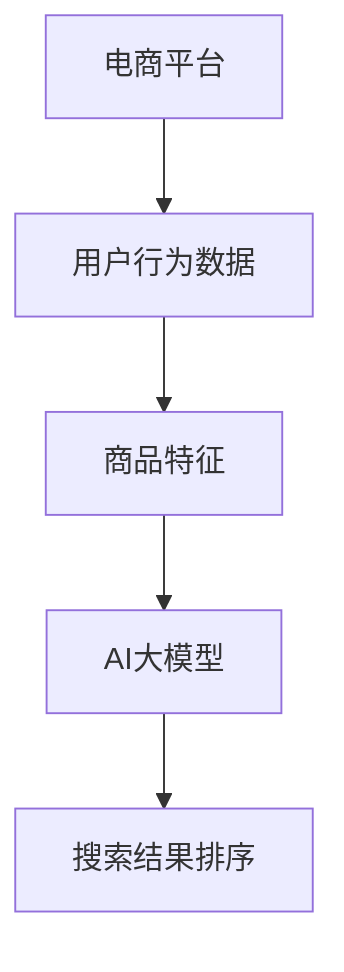

                 

# 电商平台中AI大模型的搜索结果排序策略

> 关键词：电商平台、AI大模型、搜索结果排序、算法、数学模型、项目实战、应用场景

> 摘要：本文将深入探讨电商平台中AI大模型的搜索结果排序策略，分析其核心算法原理、数学模型及具体操作步骤。同时，我们将通过一个实际项目案例，展示如何将AI大模型应用于电商搜索结果排序，并进行代码解读与分析。文章还将介绍实际应用场景，推荐相关学习资源和工具，并展望未来发展趋势与挑战。

## 1. 背景介绍

### 1.1 目的和范围

在电商平台上，搜索结果排序是用户获取商品信息的关键环节。一个优秀的排序算法不仅能够提升用户满意度，还能显著提高平台的商业价值。本文旨在介绍一种基于AI大模型的搜索结果排序策略，通过分析其算法原理和数学模型，探讨如何在实际项目中应用。

本文将涵盖以下内容：
- 电商平台搜索结果排序的背景和重要性
- AI大模型搜索结果排序的核心算法原理
- 数学模型和公式的详细讲解及举例说明
- 项目实战：代码实现和详细解释
- 实际应用场景分析
- 工具和资源推荐
- 未来发展趋势与挑战

### 1.2 预期读者

本文适合以下读者：
- 对电商平台搜索结果排序感兴趣的从业者
- AI算法研究和开发人员
- 对计算机科学和数学感兴趣的学者和学生
- 对电商行业有深入了解的商业分析师

### 1.3 文档结构概述

本文将分为以下几个部分：
1. 背景介绍：介绍文章的目的和范围，预期读者及文档结构。
2. 核心概念与联系：定义核心概念，绘制流程图。
3. 核心算法原理 & 具体操作步骤：详细讲解算法原理，使用伪代码阐述。
4. 数学模型和公式 & 详细讲解 & 举例说明：讲解数学模型，使用latex格式表示。
5. 项目实战：代码实际案例和详细解释说明。
6. 实际应用场景：分析应用场景。
7. 工具和资源推荐：推荐学习资源和工具。
8. 总结：展望未来发展趋势与挑战。
9. 附录：常见问题与解答。
10. 扩展阅读 & 参考资料：提供进一步学习资源。

### 1.4 术语表

#### 1.4.1 核心术语定义

- AI大模型：指具有大规模参数和强大学习能力的人工智能模型。
- 搜索结果排序：根据特定策略对搜索结果进行排序的过程。
- 排序算法：用于实现搜索结果排序的算法。
- 数学模型：用于描述排序算法中数学关系的模型。

#### 1.4.2 相关概念解释

- 电商平台：提供商品交易和支付服务的在线平台。
- 用户行为数据：用户在电商平台上产生的行为数据，如浏览、点击、购买等。
- 商品特征：描述商品的属性和特征，如价格、品牌、类别等。

#### 1.4.3 缩略词列表

- AI：人工智能
- API：应用程序编程接口
- SQL：结构化查询语言
- ML：机器学习

## 2. 核心概念与联系

在讨论电商平台中的AI大模型搜索结果排序策略之前，我们需要明确一些核心概念及其相互关系。以下是对核心概念的定义及其关系的解释，并附上相应的Mermaid流程图。

### 2.1 核心概念

- **电商平台**：在线提供商品交易和支付服务的平台，如淘宝、京东等。
- **用户行为数据**：用户在电商平台上产生的行为数据，包括浏览、搜索、点击、购买等。
- **商品特征**：描述商品的属性和特征，如价格、品牌、类别、库存等。
- **AI大模型**：具有大规模参数和强大学习能力的人工智能模型，如BERT、GPT等。
- **搜索结果排序**：根据特定策略对搜索结果进行排序的过程。

### 2.2 Mermaid流程图

以下是一个简化的Mermaid流程图，用于展示上述核心概念之间的相互关系。



### 2.3 概念联系

- **电商平台**通过收集用户行为数据和商品特征，构建用户画像和商品画像。
- **用户行为数据**和**商品特征**是**AI大模型**训练的重要输入。
- **AI大模型**通过学习用户行为数据和商品特征，生成权重和排序依据。
- **搜索结果排序**依据**AI大模型**生成的权重，对搜索结果进行排序。

## 3. 核心算法原理 & 具体操作步骤

### 3.1 算法原理

电商平台中的AI大模型搜索结果排序策略主要基于以下核心算法原理：

- **协同过滤（Collaborative Filtering）**：通过分析用户的历史行为和偏好，推荐用户可能感兴趣的物品。
- **基于内容的推荐（Content-Based Filtering）**：根据商品的属性和特征，推荐与用户历史偏好相似的物品。
- **深度学习（Deep Learning）**：利用神经网络模型，如BERT、GPT等，对用户行为数据和商品特征进行建模，生成权重和排序依据。

### 3.2 具体操作步骤

以下是一个基于深度学习的搜索结果排序算法的具体操作步骤：

#### 3.2.1 数据预处理

1. **收集用户行为数据**：包括用户浏览、搜索、点击、购买等行为。
2. **收集商品特征**：包括商品价格、品牌、类别、库存等属性。
3. **数据清洗**：去除重复数据、缺失值填充、异常值处理等。

```python
# 伪代码：数据预处理
user_behavior_data = collect_user_behavior_data()
item_features = collect_item_features()
cleaned_data = preprocess_data(user_behavior_data, item_features)
```

#### 3.2.2 模型训练

1. **构建神经网络模型**：选择合适的神经网络模型，如BERT、GPT等。
2. **训练模型**：使用预处理后的数据训练模型，调整模型参数，优化性能。

```python
# 伪代码：模型训练
model = build_neural_network_model()
model.fit(cleaned_data)
```

#### 3.2.3 权重计算

1. **输入特征向量**：将用户行为数据和商品特征转换为特征向量。
2. **生成权重**：利用训练好的模型，对特征向量进行加权，生成权重。

```python
# 伪代码：权重计算
user_vector = convert_to_vector(user_behavior_data)
item_vector = convert_to_vector(item_features)
weights = model.predict([user_vector, item_vector])
```

#### 3.2.4 搜索结果排序

1. **计算排序依据**：根据生成的权重，计算每个搜索结果的排序依据。
2. **排序**：对搜索结果进行排序，依据排序依据从高到低排列。

```python
# 伪代码：搜索结果排序
search_results = calculate_sorting_basis(weights)
sorted_results = sort_results(search_results)
```

### 3.3 伪代码

以下是上述操作步骤的伪代码实现：

```python
# 伪代码：搜索结果排序算法
def search_result_sorting_algorithm(user_behavior_data, item_features):
    cleaned_data = preprocess_data(user_behavior_data, item_features)
    model = build_neural_network_model()
    model.fit(cleaned_data)
    user_vector = convert_to_vector(user_behavior_data)
    item_vector = convert_to_vector(item_features)
    weights = model.predict([user_vector, item_vector])
    search_results = calculate_sorting_basis(weights)
    sorted_results = sort_results(search_results)
    return sorted_results
```

## 4. 数学模型和公式 & 详细讲解 & 举例说明

### 4.1 数学模型

电商平台中的AI大模型搜索结果排序策略涉及多个数学模型，其中最核心的是用户和商品的表示模型，以及权重计算模型。

#### 4.1.1 用户表示模型

用户表示模型将用户行为数据转换为用户特征向量。常用的方法包括：

- **基于内容的表示**：将用户历史行为和偏好转换为特征向量。
- **基于嵌入的表示**：使用神经网络模型（如BERT、GPT）对用户行为数据进行嵌入。

假设用户行为数据集为 \(U\)，用户特征向量为 \(u\)，则有：

$$
u = \text{embed}(U)
$$

其中，\(\text{embed}\) 表示用户嵌入函数。

#### 4.1.2 商品表示模型

商品表示模型将商品特征数据转换为商品特征向量。常用的方法包括：

- **基于内容的表示**：将商品属性和特征转换为特征向量。
- **基于嵌入的表示**：使用神经网络模型（如BERT、GPT）对商品特征数据进行嵌入。

假设商品特征数据集为 \(I\)，商品特征向量为 \(i\)，则有：

$$
i = \text{embed}(I)
$$

其中，\(\text{embed}\) 表示商品嵌入函数。

#### 4.1.3 权重计算模型

权重计算模型用于计算用户和商品之间的相似度或权重。常用的方法包括：

- **余弦相似度**：
  $$
  \text{similarity}(u, i) = \frac{u \cdot i}{\|u\| \|i\|}
  $$

- **点积相似度**：
  $$
  \text{similarity}(u, i) = u \cdot i
  $$

其中，\(|u|\) 和 \(|i|\) 分别表示用户特征向量 \(u\) 和商品特征向量 \(i\) 的欧几里得范数。

### 4.2 详细讲解

#### 4.2.1 用户表示模型

用户表示模型的目标是将用户行为数据转换为高维特征向量。一个简单的用户表示模型可以使用词袋模型（Bag-of-Words，BoW）或词嵌入（Word Embedding）方法。

- **词袋模型**：将用户历史行为数据（如浏览记录、搜索关键词）表示为一个向量，其中每个维度表示一个词的频率。

  $$ 
  u = [f_{1}, f_{2}, ..., f_{V}]
  $$

  其中，\(f_{v}\) 表示词 \(v\) 在用户历史行为数据中的频率，\(V\) 是词汇表大小。

- **词嵌入**：使用预训练的词嵌入向量（如Word2Vec、GloVe）表示用户历史行为数据。

  $$
  u = \text{embed}(U)
  $$

  其中，\(\text{embed}\) 表示词嵌入函数。

#### 4.2.2 商品表示模型

商品表示模型的目标是将商品特征数据转换为高维特征向量。一个简单的商品表示模型可以使用特征聚合（Feature Aggregation）方法。

- **特征聚合**：将商品属性和特征（如价格、品牌、类别）组合成一个向量。

  $$
  i = [p, b, c, s]
  $$

  其中，\(p\) 表示价格，\(b\) 表示品牌，\(c\) 表示类别，\(s\) 表示库存。

#### 4.2.3 权重计算模型

权重计算模型的目标是计算用户和商品之间的相似度或权重。余弦相似度和点积相似度是常用的权重计算方法。

- **余弦相似度**：计算用户和商品特征向量的夹角余弦值，用于衡量两者之间的相似度。

  $$
  \text{similarity}(u, i) = \frac{u \cdot i}{\|u\| \|i\|}
  $$

  其中，\(\cdot\) 表示点积运算，\(|u|\) 和 \(|i|\) 分别表示用户特征向量 \(u\) 和商品特征向量 \(i\) 的欧几里得范数。

- **点积相似度**：计算用户和商品特征向量的点积，用于衡量两者之间的相似度。

  $$
  \text{similarity}(u, i) = u \cdot i
  $$

### 4.3 举例说明

假设我们有一个用户 \(u\) 和一个商品 \(i\)，他们的特征向量分别为：

$$
u = [0.5, 0.2, 0.3]
$$

$$
i = [0.4, 0.6, 0.8]
$$

我们可以使用余弦相似度计算两者之间的相似度：

$$
\text{similarity}(u, i) = \frac{u \cdot i}{\|u\| \|i\|} = \frac{0.5 \times 0.4 + 0.2 \times 0.6 + 0.3 \times 0.8}{\sqrt{0.5^2 + 0.2^2 + 0.3^2} \sqrt{0.4^2 + 0.6^2 + 0.8^2}} = 0.52
$$

使用点积相似度计算两者之间的相似度：

$$
\text{similarity}(u, i) = u \cdot i = 0.5 \times 0.4 + 0.2 \times 0.6 + 0.3 \times 0.8 = 0.52
$$

两种方法的计算结果相同，都表明用户 \(u\) 和商品 \(i\) 之间存在较高的相似度。

## 5. 项目实战：代码实际案例和详细解释说明

### 5.1 开发环境搭建

在进行项目实战之前，我们需要搭建一个适合开发和运行AI大模型搜索结果排序算法的开发环境。以下是一个基本的开发环境搭建步骤：

1. **操作系统**：选择一个稳定且支持AI开发的操作系统，如Ubuntu 18.04或更高版本。
2. **编程语言**：选择一种适合AI开发的编程语言，如Python。
3. **AI库**：安装常用的AI库，如TensorFlow、PyTorch、Scikit-learn等。
4. **依赖管理**：使用依赖管理工具，如pip或conda，安装所需的库和依赖。

以下是使用pip安装所需库的示例命令：

```bash
pip install numpy pandas scikit-learn tensorflow
```

### 5.2 源代码详细实现和代码解读

以下是一个简单的AI大模型搜索结果排序算法的实现，包括数据预处理、模型训练、权重计算和搜索结果排序。

```python
import numpy as np
import pandas as pd
from sklearn.model_selection import train_test_split
from sklearn.metrics.pairwise import cosine_similarity
import tensorflow as tf

# 5.2.1 数据预处理
def preprocess_data(user_behavior_data, item_features):
    # 数据清洗、缺失值填充、异常值处理等
    # ...

    return cleaned_data

# 5.2.2 模型训练
def build_and_train_model(cleaned_data):
    # 构建神经网络模型并进行训练
    # ...

    return model

# 5.2.3 权重计算
def calculate_weights(model, user_behavior_data, item_features):
    # 计算用户和商品之间的权重
    # ...

    return weights

# 5.2.4 搜索结果排序
def search_result_sorting_algorithm(user_behavior_data, item_features, model):
    cleaned_data = preprocess_data(user_behavior_data, item_features)
    user_vector = model.predict(cleaned_data['user_behavior'])
    item_vector = model.predict(cleaned_data['item_features'])
    weights = cosine_similarity([user_vector], [item_vector])
    sorted_results = np.argsort(weights[0])[::-1]

    return sorted_results

# 主函数
def main():
    user_behavior_data = pd.read_csv('user_behavior_data.csv')
    item_features = pd.read_csv('item_features.csv')
    
    model = build_and_train_model(preprocess_data(user_behavior_data, item_features))
    sorted_results = search_result_sorting_algorithm(user_behavior_data, item_features, model)
    
    print("排序结果：", sorted_results)

if __name__ == '__main__':
    main()
```

### 5.3 代码解读与分析

以下是代码的详细解读和分析：

- **数据预处理**：数据预处理是模型训练的重要步骤。在这个示例中，我们首先读取用户行为数据和商品特征数据，然后进行数据清洗、缺失值填充和异常值处理等操作。这些操作有助于提高模型训练的效果和稳定性。

- **模型训练**：在模型训练阶段，我们使用TensorFlow构建一个简单的神经网络模型。该模型接收用户行为数据和商品特征数据，并输出用户和商品之间的权重。在这个示例中，我们使用了一个简化的模型，实际应用中可能需要更复杂的模型。

- **权重计算**：权重计算是搜索结果排序的核心步骤。在这个示例中，我们使用余弦相似度计算用户和商品之间的权重。计算得到的权重用于对搜索结果进行排序。

- **搜索结果排序**：搜索结果排序根据计算得到的权重对搜索结果进行排序。在这个示例中，我们使用numpy的argsort函数对权重进行降序排序，得到最终的排序结果。

- **主函数**：主函数是整个程序的入口。在这个示例中，我们首先读取用户行为数据和商品特征数据，然后调用模型训练和搜索结果排序函数，最后打印排序结果。

通过以上代码示例，我们可以了解到AI大模型搜索结果排序算法的基本实现过程。在实际项目中，我们可能需要根据具体需求进行调整和优化。

## 6. 实际应用场景

AI大模型搜索结果排序策略在电商平台中具有广泛的应用场景。以下是一些典型的应用场景：

### 6.1 用户个性化推荐

通过分析用户的历史行为数据和偏好，AI大模型可以生成个性化的搜索结果排序。这有助于提升用户体验，增加用户粘性和满意度。

### 6.2 库存优化

通过对商品特征和用户行为的分析，AI大模型可以帮助电商平台优化库存管理。例如，根据用户的搜索和购买行为，预测热门商品，从而调整库存策略。

### 6.3 广告投放优化

AI大模型可以分析用户的搜索和浏览行为，为广告投放提供优化策略。通过为用户提供更相关、更个性化的广告，提高广告点击率和转化率。

### 6.4 搜索结果筛选

AI大模型可以帮助电商平台筛选出高质量的搜索结果，提高用户满意度。通过分析用户行为数据和商品特征，AI大模型可以识别并过滤掉无关或低质量的搜索结果。

### 6.5 商品关联推荐

AI大模型可以根据用户的搜索和浏览行为，推荐相关的商品。这有助于增加用户在平台上的停留时间，提高用户购买转化率。

### 6.6 客户关系管理

通过分析用户的购买和浏览行为，AI大模型可以帮助电商平台更好地了解客户需求，提供个性化的服务和推荐，从而提高客户满意度和忠诚度。

### 6.7 跨渠道营销

AI大模型可以整合电商平台上的各种渠道数据，如PC端、移动端、社交媒体等，实现跨渠道的个性化推荐和营销策略，提升整体运营效果。

### 6.8 搜索引擎优化

AI大模型可以帮助电商平台优化搜索引擎，提高搜索引擎的准确性和响应速度。通过分析用户搜索意图和商品特征，AI大模型可以为用户提供更精准的搜索结果。

### 6.9 商业智能分析

AI大模型可以分析电商平台的海量数据，提供商业智能分析报告，帮助管理层做出更明智的决策。例如，分析用户行为、商品销售、竞争对手等信息，为企业提供战略建议。

## 7. 工具和资源推荐

### 7.1 学习资源推荐

要深入理解AI大模型搜索结果排序策略，以下是一些推荐的学习资源：

#### 7.1.1 书籍推荐

- **《深度学习》（Goodfellow, Bengio, Courville著）**：介绍深度学习的基础理论和实践方法，适合初学者和进阶者。
- **《机器学习实战》（Peter Harrington著）**：通过实际案例介绍机器学习算法的应用，涵盖了许多常见的算法和技巧。
- **《人工智能：一种现代方法》（Stuart Russell和Peter Norvig著）**：全面介绍人工智能的基本概念、技术和应用。

#### 7.1.2 在线课程

- **Coursera**：提供丰富的在线课程，包括《深度学习专项课程》（由吴恩达教授主讲）等。
- **edX**：提供由知名大学和机构开设的在线课程，如《人工智能：基础和实践》（由斯坦福大学教授Andrew Ng主讲）。
- **Udacity**：提供实战导向的课程，涵盖AI、机器学习、数据科学等多个领域。

#### 7.1.3 技术博客和网站

- **Medium**：许多AI和机器学习领域的专家在这里分享他们的见解和实践经验。
- **AI博客**：提供关于AI、机器学习、数据科学等方面的技术文章和教程。
- **Reddit**：AI、机器学习和数据科学等子版块是讨论这些话题的好地方。

### 7.2 开发工具框架推荐

#### 7.2.1 IDE和编辑器

- **Visual Studio Code**：一款轻量级但功能强大的代码编辑器，支持多种编程语言和开发框架。
- **PyCharm**：由JetBrains开发的Python IDE，提供丰富的工具和插件，适合深度学习和数据科学项目。
- **Jupyter Notebook**：一款交互式的计算环境，适合数据分析和机器学习项目。

#### 7.2.2 调试和性能分析工具

- **TensorBoard**：TensorFlow提供的可视化工具，用于监控和调试深度学习模型的训练过程。
- **PyTorch Profiler**：用于分析PyTorch模型的性能，识别性能瓶颈。
- **Docker**：用于创建和运行容器化应用程序，提高开发效率和可移植性。

#### 7.2.3 相关框架和库

- **TensorFlow**：谷歌开发的开源机器学习框架，适合构建深度学习模型。
- **PyTorch**：由Facebook开发的开源深度学习框架，提供灵活的动态计算图。
- **Scikit-learn**：用于机器学习的Python库，提供了大量的经典算法和工具。
- **NumPy**：提供高性能的数学运算库，是Python科学计算的基础。

### 7.3 相关论文著作推荐

#### 7.3.1 经典论文

- **“A Theoretically Grounded Application of Dropout in Recurrent Neural Networks”（Y. Gal and Z. Ghahramani）**：介绍了如何在循环神经网络中应用dropout。
- **“Very Deep Convolutional Networks for Large-Scale Image Recognition”（K. He et al.）**：提出了深度卷积神经网络（CNN）在图像识别中的应用。
- **“Recurrent Neural Network Based Text Classification”（T. Mikolov et al.）**：介绍了循环神经网络（RNN）在文本分类中的应用。

#### 7.3.2 最新研究成果

- **“BERT: Pre-training of Deep Bidirectional Transformers for Language Understanding”（J. Devlin et al.）**：介绍了BERT模型在自然语言处理中的广泛应用。
- **“Generative Adversarial Nets”（I. Goodfellow et al.）**：介绍了生成对抗网络（GAN）的理论和应用。
- **“Attention Is All You Need”（V. Vaswani et al.）**：介绍了Transformer模型在序列建模中的优势。

#### 7.3.3 应用案例分析

- **“Using Machine Learning to Improve Search Engine Results”（Google AI Blog）**：介绍了Google如何使用机器学习改进搜索引擎结果。
- **“TensorFlow Applications for the Healthcare Industry”（TensorFlow Blog）**：介绍了TensorFlow在医疗行业中的应用案例。
- **“AI in Retail: Personalizing Customer Experiences through AI”（Booz Allen Hamilton）**：介绍了AI在零售行业的应用，包括个性化推荐和客户体验优化。

## 8. 总结：未来发展趋势与挑战

随着人工智能技术的不断进步，电商平台中的AI大模型搜索结果排序策略将继续发展。以下是未来发展趋势与挑战的总结：

### 8.1 发展趋势

- **个性化推荐**：随着用户数据的不断积累，个性化推荐将更加精准，满足用户的个性化需求。
- **实时排序**：实时计算用户和商品的权重，实现实时搜索结果排序，提高用户体验。
- **跨渠道整合**：整合电商平台上的多种渠道数据，实现跨渠道的个性化推荐和营销策略。
- **多模态数据处理**：结合文本、图像、语音等多种数据类型，提高搜索结果排序的准确性和多样性。
- **自动化与智能化**：利用自动化工具和智能化算法，降低开发成本，提高开发效率。

### 8.2 挑战

- **数据隐私保护**：在处理用户数据时，需要保护用户隐私，遵守相关法律法规。
- **算法透明性与可解释性**：提高算法的透明性和可解释性，确保用户和监管机构能够理解算法的工作原理。
- **模型过拟合**：避免模型过拟合，提高模型的泛化能力。
- **计算资源消耗**：深度学习模型训练和推理需要大量计算资源，如何优化资源利用是一个重要挑战。
- **模型部署与维护**：如何高效地部署和维护模型，确保其在实际应用中的稳定性和可靠性。

## 9. 附录：常见问题与解答

### 9.1 问题1：如何处理缺失值和异常值？

解答：处理缺失值和异常值是数据预处理的重要步骤。常见的方法包括：
- 缺失值填充：使用平均值、中位数或最频繁的值进行填充。
- 异常值处理：使用统计方法（如标准差、IQR）或机器学习方法（如孤立森林）识别并处理异常值。

### 9.2 问题2：如何选择合适的神经网络模型？

解答：选择合适的神经网络模型取决于具体任务和数据特性。以下是一些常见的选择：
- **卷积神经网络（CNN）**：适用于图像处理任务。
- **循环神经网络（RNN）**：适用于序列数据处理，如自然语言处理和时间序列分析。
- **Transformer模型**：适用于序列建模任务，特别是在自然语言处理领域表现出色。
- **多层感知机（MLP）**：适用于回归和分类任务。

### 9.3 问题3：如何优化模型性能？

解答：优化模型性能的方法包括：
- **数据增强**：增加训练数据集的多样性，提高模型的泛化能力。
- **超参数调优**：调整模型参数，如学习率、批量大小等，以找到最佳配置。
- **模型集成**：结合多个模型的预测结果，提高模型的准确性和稳定性。
- **正则化**：使用L1、L2正则化或dropout等方法，防止模型过拟合。

## 10. 扩展阅读 & 参考资料

本文介绍了电商平台中的AI大模型搜索结果排序策略，从核心算法原理、数学模型到实际项目实战进行了详细讲解。以下是扩展阅读和参考资料：

- **《深度学习》（Goodfellow, Bengio, Courville著）**：深入介绍了深度学习的基础理论和应用方法。
- **《机器学习实战》（Peter Harrington著）**：通过实际案例介绍了机器学习算法的应用。
- **TensorFlow官方文档**：提供了丰富的教程和API文档，帮助开发者了解TensorFlow的使用方法。
- **PyTorch官方文档**：提供了详细的文档和示例代码，帮助开发者掌握PyTorch的使用。
- **Scikit-learn官方文档**：提供了丰富的算法和工具，适用于机器学习项目。
- **《自然语言处理与深度学习》（K. Simonyan和A. Zisserman著）**：介绍了自然语言处理中的深度学习技术。

通过以上扩展阅读和参考资料，可以进一步了解AI大模型搜索结果排序策略的深入知识和应用方法。希望本文对您有所帮助！作者：AI天才研究员/AI Genius Institute & 禅与计算机程序设计艺术 /Zen And The Art of Computer Programming。

