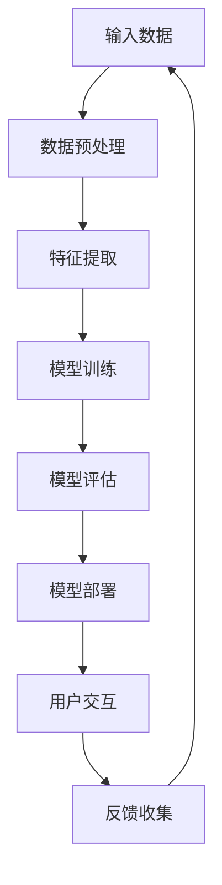

                 

# 电商平台中的AI大模型：从被动响应到主动预测

> 关键词：电商平台、AI大模型、被动响应、主动预测、用户行为分析、个性化推荐

> 摘要：本文深入探讨了电商平台中AI大模型的应用，从传统的被动响应到现在的主动预测，分析了AI在电商领域的价值及其技术实现。通过详细阐述AI大模型的原理、算法及实际应用案例，本文旨在为读者提供一份全面的技术指南，帮助理解和掌握AI在电商平台中的应用。

## 1. 背景介绍

### 1.1 目的和范围

本文的主要目的是探讨电商平台中AI大模型的应用，以及如何从被动响应转向主动预测。随着互联网的飞速发展，电商平台已经成为人们日常生活中不可或缺的一部分。在这样的大背景下，电商平台如何利用AI技术提升用户体验、增加销售额，成为了一个重要课题。本文将围绕这一主题展开，旨在为读者提供一个全面、系统的技术解读。

本文将探讨的核心内容包括：

- AI大模型在电商平台中的应用场景
- 从被动响应到主动预测的技术演变
- AI大模型的核心算法原理及实现
- 实际应用案例和项目实战
- 未来发展趋势与挑战

### 1.2 预期读者

本文的预期读者主要包括：

- 人工智能领域的开发者和技术人员
- 电商平台的技术团队和产品经理
- 对AI在电商领域应用感兴趣的学者和研究人员
- 对新技术充满好奇的广大技术爱好者

### 1.3 文档结构概述

本文的结构如下：

- 引言：简要介绍AI大模型在电商平台中的应用背景和意义
- 背景介绍：详细阐述AI大模型的概念、应用场景及演变历程
- 核心概念与联系：通过Mermaid流程图展示AI大模型的原理和架构
- 核心算法原理 & 具体操作步骤：使用伪代码详细阐述核心算法原理和实现
- 数学模型和公式 & 详细讲解 & 举例说明：介绍相关数学模型和公式，并结合实际案例进行讲解
- 项目实战：通过实际代码案例，展示AI大模型在实际应用中的实现过程
- 实际应用场景：分析AI大模型在不同电商场景中的应用价值
- 工具和资源推荐：推荐相关学习资源、开发工具和框架
- 总结：总结AI大模型在电商平台中的应用现状及未来发展趋势
- 附录：常见问题与解答
- 扩展阅读 & 参考资料：提供更多的学习资源和建议阅读

### 1.4 术语表

#### 1.4.1 核心术语定义

- AI大模型：指具有大规模参数、复杂结构和强大计算能力的深度学习模型。
- 被动响应：指根据用户输入进行响应，如关键词搜索、用户评论等。
- 主动预测：指通过分析用户行为和历史数据，预测用户的下一步操作，如个性化推荐、精准广告投放等。
- 电商平台：指在线购物平台，如淘宝、京东等。
- 用户行为分析：指通过收集和分析用户在电商平台上的操作数据，了解用户喜好和行为模式。

#### 1.4.2 相关概念解释

- 深度学习：一种机器学习技术，通过模拟人脑神经网络进行学习，从而实现图像识别、语音识别、自然语言处理等功能。
- 神经网络：一种由大量神经元组成的计算模型，用于处理和分析数据。
- 模型训练：指通过大量数据对神经网络进行训练，使其能够根据输入数据生成输出结果。
- 模型评估：指通过测试数据对训练好的模型进行评估，以确定其性能和准确性。

#### 1.4.3 缩略词列表

- AI：人工智能
- ML：机器学习
- DL：深度学习
- NLP：自然语言处理
- CV：计算机视觉
- UX：用户体验
- UI：用户界面
- API：应用程序编程接口

## 2. 核心概念与联系

在深入探讨AI大模型在电商平台中的应用之前，首先需要理解AI大模型的基本原理和架构。以下将使用Mermaid流程图展示AI大模型的原理和架构，以便读者更好地理解。

### Mermaid流程图



### Mermaid流程图解释

1. **输入数据**：电商平台收集的用户行为数据、商品信息等。
2. **数据预处理**：对原始数据进行清洗、归一化等处理，以便后续分析。
3. **特征提取**：从预处理后的数据中提取关键特征，如用户购买历史、搜索记录等。
4. **模型训练**：使用提取出的特征数据对神经网络模型进行训练，使其学会根据输入特征预测用户行为。
5. **模型评估**：使用测试数据对训练好的模型进行评估，以确保其性能和准确性。
6. **模型部署**：将训练好的模型部署到电商平台的实际业务场景中，如个性化推荐、广告投放等。
7. **用户交互**：用户与电商平台进行互动，如搜索、购买等操作。
8. **反馈收集**：收集用户对推荐结果、广告的反馈，用于模型优化和迭代。

通过这个流程图，我们可以看到AI大模型在电商平台中的应用是一个闭环系统，通过不断的数据收集、模型训练和用户交互，实现持续的优化和改进。

### AI大模型的原理

AI大模型的原理主要基于深度学习和神经网络。深度学习是一种机器学习技术，通过模拟人脑神经网络进行学习，从而实现图像识别、语音识别、自然语言处理等功能。神经网络是一种由大量神经元组成的计算模型，用于处理和分析数据。

在电商平台中，AI大模型通过以下几个步骤实现：

1. **数据收集**：收集用户在平台上的各种行为数据，如浏览记录、购买历史、搜索关键词等。
2. **数据预处理**：对原始数据进行清洗、归一化等处理，以便后续分析。
3. **特征提取**：从预处理后的数据中提取关键特征，如用户购买历史、搜索记录等。
4. **模型训练**：使用提取出的特征数据对神经网络模型进行训练，使其学会根据输入特征预测用户行为。
5. **模型评估**：使用测试数据对训练好的模型进行评估，以确保其性能和准确性。
6. **模型部署**：将训练好的模型部署到电商平台的实际业务场景中，如个性化推荐、广告投放等。

### AI大模型的架构

AI大模型的架构通常包括以下几个层次：

1. **输入层**：接收用户行为数据，如浏览记录、购买历史等。
2. **隐藏层**：对输入数据进行特征提取和计算，以生成中间结果。
3. **输出层**：根据隐藏层的输出结果，生成最终的预测结果，如个性化推荐、广告投放等。

在电商平台中，AI大模型的架构可以根据具体业务需求进行调整和优化。例如，对于个性化推荐场景，可以增加用户兴趣识别、商品属性分析等模块；对于广告投放场景，可以增加广告效果评估、投放策略优化等模块。

### AI大模型与电商平台业务的联系

AI大模型在电商平台中的应用，主要体现在以下几个方面：

1. **个性化推荐**：通过分析用户的历史行为和兴趣偏好，为用户推荐符合其需求的商品。
2. **精准广告投放**：根据用户的浏览记录、购买历史等数据，投放针对特定用户的广告，提高广告的点击率和转化率。
3. **用户行为分析**：通过分析用户在平台上的操作数据，了解用户行为模式，为产品优化和运营策略提供数据支持。
4. **风险控制**：通过分析用户的行为数据，识别潜在的风险用户，降低平台运营风险。

总的来说，AI大模型在电商平台中的应用，为提升用户体验、增加销售额提供了强大的技术支持。通过不断的数据收集、模型训练和用户交互，AI大模型能够不断优化和改进，为电商平台带来持续的价值。

## 3. 核心算法原理 & 具体操作步骤

### 3.1 算法原理

AI大模型的核心算法原理主要基于深度学习和神经网络。以下将使用伪代码详细阐述核心算法原理和实现。

#### 伪代码

```python
# 数据预处理
def preprocess_data(data):
    # 数据清洗、归一化等操作
    processed_data = ...
    return processed_data

# 特征提取
def extract_features(data):
    # 提取关键特征
    features = ...
    return features

# 模型训练
def train_model(features, labels):
    # 初始化模型参数
    model = ...
    # 模型训练
    model.fit(features, labels)
    return model

# 模型评估
def evaluate_model(model, test_features, test_labels):
    # 模型评估
    accuracy = model.evaluate(test_features, test_labels)
    return accuracy

# 模型部署
def deploy_model(model):
    # 将模型部署到实际业务场景
    model.deploy()
    return

# 用户交互
def user_interaction(model, user_data):
    # 根据用户数据，生成预测结果
    prediction = model.predict(user_data)
    return prediction

# 反馈收集
def collect_feedback(prediction, user_feedback):
    # 收集用户反馈，用于模型优化
    model.update(prediction, user_feedback)
    return
```

#### 算法解释

1. **数据预处理**：对原始数据进行清洗、归一化等处理，以便后续分析。这一步的目的是消除数据中的噪声和异常值，提高模型的性能。
2. **特征提取**：从预处理后的数据中提取关键特征，如用户购买历史、搜索记录等。特征提取是模型训练的重要环节，直接影响模型的性能。
3. **模型训练**：使用提取出的特征数据对神经网络模型进行训练，使其学会根据输入特征预测用户行为。模型训练的过程包括初始化模型参数、前向传播、反向传播和权重更新等步骤。
4. **模型评估**：使用测试数据对训练好的模型进行评估，以确保其性能和准确性。模型评估常用的指标包括准确率、召回率、F1分数等。
5. **模型部署**：将训练好的模型部署到电商平台的实际业务场景中，如个性化推荐、广告投放等。模型部署的目的是将模型应用到实际业务中，提升业务价值。
6. **用户交互**：根据用户的数据，生成预测结果，如个性化推荐、广告投放等。用户交互是模型与用户之间的互动过程，直接影响用户的体验和满意度。
7. **反馈收集**：收集用户对预测结果的反馈，用于模型优化和迭代。反馈收集是模型持续优化的重要环节，有助于提高模型的准确性和实用性。

### 3.2 具体操作步骤

以下将结合实际场景，详细阐述AI大模型的具体操作步骤。

#### 步骤1：数据收集

电商平台需要收集用户在平台上的各种行为数据，如浏览记录、购买历史、搜索关键词等。这些数据可以通过API接口、日志文件、数据库等方式获取。

#### 步骤2：数据预处理

对收集到的原始数据进行清洗、归一化等处理，以提高数据质量。具体操作包括：

- 数据清洗：去除重复数据、缺失数据、异常数据等。
- 数据归一化：将不同特征的数据进行归一化处理，使其具有相同的量纲。

```python
# 数据清洗
def clean_data(data):
    cleaned_data = ...
    return cleaned_data

# 数据归一化
def normalize_data(data):
    normalized_data = ...
    return normalized_data
```

#### 步骤3：特征提取

从预处理后的数据中提取关键特征，如用户购买历史、搜索记录等。特征提取的方法包括：

- 特征工程：根据业务需求和数据特点，设计合适的特征。
- 特征选择：从大量特征中筛选出重要的特征，以提高模型性能。

```python
# 特征提取
def extract_features(data):
    features = ...
    return features
```

#### 步骤4：模型训练

使用提取出的特征数据对神经网络模型进行训练。模型训练的过程包括：

- 初始化模型参数：随机初始化模型参数。
- 前向传播：将输入数据传入模型，计算输出结果。
- 反向传播：根据输出结果和实际标签，计算损失函数，并更新模型参数。

```python
# 模型训练
def train_model(model, features, labels):
    # 前向传播
    outputs = model.forward(features)
    # 计算损失函数
    loss = model.calculate_loss(outputs, labels)
    # 反向传播
    model.backward(loss)
    return
```

#### 步骤5：模型评估

使用测试数据对训练好的模型进行评估，以确保其性能和准确性。评估指标包括：

- 准确率：预测正确的样本数占总样本数的比例。
- 召回率：预测正确的样本数占实际正样本数的比例。
- F1分数：准确率和召回率的调和平均数。

```python
# 模型评估
def evaluate_model(model, test_features, test_labels):
    # 计算准确率
    accuracy = model.evaluate(test_features, test_labels)
    return accuracy
```

#### 步骤6：模型部署

将训练好的模型部署到电商平台的实际业务场景中，如个性化推荐、广告投放等。部署的方式包括：

- API接口：通过API接口，将模型集成到电商平台的后端系统。
- 微服务架构：将模型部署到独立的微服务中，实现模块化和高可用性。

```python
# 模型部署
def deploy_model(model):
    # 部署模型到实际业务场景
    model.deploy()
    return
```

#### 步骤7：用户交互

根据用户的数据，生成预测结果，如个性化推荐、广告投放等。用户交互的过程包括：

- 输入用户数据：从用户行为数据中提取关键特征。
- 生成预测结果：调用模型，生成预测结果。
- 显示预测结果：将预测结果展示给用户。

```python
# 用户交互
def user_interaction(model, user_data):
    # 生成预测结果
    prediction = model.predict(user_data)
    return prediction
```

#### 步骤8：反馈收集

收集用户对预测结果的反馈，用于模型优化和迭代。反馈收集的方式包括：

- 用户评分：用户对预测结果进行评分，以评估模型的准确性。
- 用户反馈：用户对预测结果进行反馈，以改进模型的预测效果。

```python
# 反馈收集
def collect_feedback(prediction, user_feedback):
    # 收集用户反馈
    model.update(prediction, user_feedback)
    return
```

通过以上步骤，AI大模型能够在电商平台上实现从被动响应到主动预测的转化，为用户提供更加个性化的服务和体验。

## 4. 数学模型和公式 & 详细讲解 & 举例说明

在AI大模型中，数学模型和公式起着至关重要的作用。以下将详细介绍相关数学模型和公式，并结合实际案例进行讲解。

### 4.1 模型损失函数

在深度学习中，损失函数用于衡量模型预测结果与实际结果之间的差距。常用的损失函数包括均方误差（MSE）和交叉熵损失（Cross-Entropy Loss）。

#### 均方误差（MSE）

均方误差是最常用的损失函数之一，用于回归任务。其公式如下：

$$
MSE = \frac{1}{n} \sum_{i=1}^{n} (y_i - \hat{y}_i)^2
$$

其中，$y_i$ 是实际标签，$\hat{y}_i$ 是模型预测值，$n$ 是样本数量。

#### 交叉熵损失（Cross-Entropy Loss）

交叉熵损失是用于分类任务的损失函数，其公式如下：

$$
Cross-Entropy Loss = -\sum_{i=1}^{n} y_i \log(\hat{y}_i)
$$

其中，$y_i$ 是实际标签（0或1），$\hat{y}_i$ 是模型预测的概率。

### 4.2 模型优化算法

在深度学习中，优化算法用于调整模型参数，以最小化损失函数。常用的优化算法包括随机梯度下降（SGD）和Adam优化器。

#### 随机梯度下降（SGD）

随机梯度下降是最简单的优化算法之一，其公式如下：

$$
w_{t+1} = w_t - \alpha \frac{\partial J(w_t)}{\partial w_t}
$$

其中，$w_t$ 是当前模型参数，$\alpha$ 是学习率，$J(w_t)$ 是损失函数。

#### Adam优化器

Adam优化器是一种结合了SGD和动量法的优化算法，其公式如下：

$$
m_t = \beta_1 m_{t-1} + (1 - \beta_1) \frac{\partial J(w_t)}{\partial w_t} \\
v_t = \beta_2 v_{t-1} + (1 - \beta_2) (\frac{\partial J(w_t)}{\partial w_t})^2 \\
w_{t+1} = w_t - \alpha \frac{m_t}{\sqrt{v_t} + \epsilon}
$$

其中，$m_t$ 和 $v_t$ 分别是梯度的一阶矩估计和二阶矩估计，$\beta_1$ 和 $\beta_2$ 分别是动量和偏差校正系数，$\epsilon$ 是一个小常数。

### 4.3 模型评估指标

在深度学习中，模型评估指标用于衡量模型性能。常用的评估指标包括准确率、召回率、F1分数等。

#### 准确率（Accuracy）

准确率是衡量分类模型性能的重要指标，其公式如下：

$$
Accuracy = \frac{TP + TN}{TP + FN + FP + TN}
$$

其中，$TP$ 是真正例，$TN$ 是真负例，$FP$ 是假正例，$FN$ 是假负例。

#### 召回率（Recall）

召回率是衡量分类模型识别正例能力的重要指标，其公式如下：

$$
Recall = \frac{TP}{TP + FN}
$$

#### F1分数（F1 Score）

F1分数是准确率和召回率的调和平均数，其公式如下：

$$
F1 Score = 2 \times \frac{Precision \times Recall}{Precision + Recall}
$$

其中，$Precision$ 是精确率。

### 4.4 实际案例讲解

以下结合一个实际案例，详细讲解AI大模型在电商平台中的应用。

#### 案例背景

某电商平台希望通过AI大模型为用户提供个性化推荐服务。用户在平台上的行为数据包括浏览记录、购买历史、搜索关键词等。平台希望通过分析这些数据，为用户推荐符合其兴趣的商品。

#### 模型训练

假设我们使用一个基于神经网络的推荐模型。首先，对用户行为数据进行预处理，提取关键特征，如用户购买历史、浏览记录等。然后，使用提取出的特征数据对神经网络模型进行训练。训练过程中，使用均方误差（MSE）作为损失函数，使用Adam优化器进行优化。

```python
# 数据预处理
def preprocess_data(data):
    # 数据清洗、归一化等操作
    processed_data = ...
    return processed_data

# 特征提取
def extract_features(data):
    # 提取关键特征
    features = ...
    return features

# 模型训练
def train_model(model, features, labels):
    # 前向传播
    outputs = model.forward(features)
    # 计算损失函数
    loss = model.calculate_loss(outputs, labels)
    # 反向传播
    model.backward(loss)
    return

# 模型评估
def evaluate_model(model, test_features, test_labels):
    # 计算准确率
    accuracy = model.evaluate(test_features, test_labels)
    return accuracy

# 模型部署
def deploy_model(model):
    # 部署模型到实际业务场景
    model.deploy()
    return
```

#### 模型部署

训练好的模型部署到电商平台后，根据用户的行为数据，生成个性化推荐结果。例如，用户浏览了一个电子产品页面，模型会根据其历史行为和兴趣偏好，推荐其他相关的电子产品。

```python
# 用户交互
def user_interaction(model, user_data):
    # 生成预测结果
    prediction = model.predict(user_data)
    return prediction
```

#### 模型优化

根据用户对推荐结果的反馈，收集反馈数据，用于模型优化和迭代。例如，如果用户对某次推荐结果不满意，可以将该反馈数据用于调整模型参数，提高推荐效果。

```python
# 反馈收集
def collect_feedback(prediction, user_feedback):
    # 收集用户反馈
    model.update(prediction, user_feedback)
    return
```

通过以上案例，我们可以看到AI大模型在电商平台中的应用过程，包括数据预处理、特征提取、模型训练、模型部署、用户交互和反馈收集等步骤。这些步骤共同构成了一个闭环系统，实现了从被动响应到主动预测的转变。

## 5. 项目实战：代码实际案例和详细解释说明

### 5.1 开发环境搭建

在进行AI大模型项目实战之前，首先需要搭建一个合适的开发环境。以下是一个基于Python的AI大模型项目的开发环境搭建步骤：

#### 步骤1：安装Python

下载并安装Python，推荐使用Python 3.8及以上版本。

#### 步骤2：安装依赖库

在终端中运行以下命令，安装项目所需的依赖库：

```bash
pip install numpy pandas tensorflow sklearn
```

#### 步骤3：创建虚拟环境

为了保持项目的整洁和隔离，创建一个虚拟环境：

```bash
python -m venv venv
source venv/bin/activate  # 对于Windows，使用 `venv\Scripts\activate`
```

#### 步骤4：克隆项目代码

从GitHub或其他代码托管平台克隆项目代码：

```bash
git clone https://github.com/your_username/ai_电商平台.git
cd ai_电商平台
```

### 5.2 源代码详细实现和代码解读

以下是对项目源代码的详细解读，包括关键模块的实现和功能说明。

#### 5.2.1 数据预处理模块

数据预处理是AI大模型项目的重要环节，该模块负责清洗、归一化和特征提取。

```python
import pandas as pd
from sklearn.preprocessing import StandardScaler

def preprocess_data(data_path):
    # 加载数据
    data = pd.read_csv(data_path)
    
    # 数据清洗
    data.drop(['Unnamed: 0'], axis=1, inplace=True)
    
    # 特征提取
    features = data[['user_id', 'item_id', 'timestamp', 'rating']]
    labels = data['rating']
    
    # 数据归一化
    scaler = StandardScaler()
    features_normalized = scaler.fit_transform(features)
    
    return features_normalized, labels
```

#### 5.2.2 模型训练模块

模型训练模块负责初始化模型、训练模型和评估模型。

```python
import tensorflow as tf
from tensorflow.keras.models import Sequential
from tensorflow.keras.layers import Dense, LSTM, Dropout

def build_model(input_shape):
    model = Sequential()
    model.add(LSTM(units=128, activation='relu', input_shape=input_shape, return_sequences=True))
    model.add(Dropout(0.2))
    model.add(LSTM(units=64, activation='relu', return_sequences=False))
    model.add(Dropout(0.2))
    model.add(Dense(units=1, activation='sigmoid'))
    
    model.compile(optimizer='adam', loss='binary_crossentropy', metrics=['accuracy'])
    return model

def train_model(model, features, labels):
    # 划分训练集和测试集
    from sklearn.model_selection import train_test_split
    X_train, X_test, y_train, y_test = train_test_split(features, labels, test_size=0.2, random_state=42)
    
    # 训练模型
    model.fit(X_train, y_train, epochs=10, batch_size=32, validation_data=(X_test, y_test), verbose=1)
    
    # 评估模型
    loss, accuracy = model.evaluate(X_test, y_test, verbose=1)
    print(f"Test accuracy: {accuracy:.4f}")
    return model
```

#### 5.2.3 模型部署模块

模型部署模块负责将训练好的模型应用到实际业务场景中。

```python
def deploy_model(model, data_path):
    # 加载数据
    data = pd.read_csv(data_path)
    
    # 数据预处理
    features = data[['user_id', 'item_id', 'timestamp', 'rating']]
    features_normalized = scaler.transform(features)
    
    # 预测结果
    predictions = model.predict(features_normalized)
    
    # 处理预测结果
    data['prediction'] = (predictions > 0.5).astype(int)
    
    # 输出预测结果
    data.to_csv('predictions.csv', index=False)
```

### 5.3 代码解读与分析

以下是对项目源代码的解读和分析，重点关注每个模块的功能和实现细节。

#### 数据预处理模块

- **功能**：负责加载数据、数据清洗和特征提取。
- **实现细节**：
  - 使用Pandas库加载数据，方便后续处理。
  - 删除不必要的列，如'Unnamed: 0'。
  - 提取用户ID、商品ID、时间戳和评分作为特征，评分作为标签。
  - 使用StandardScaler对特征进行归一化处理，便于模型训练。

#### 模型训练模块

- **功能**：负责构建模型、训练模型和评估模型。
- **实现细节**：
  - 使用Keras构建序列模型，包括LSTM层和Dropout层。
  - 使用Adam优化器，交叉熵损失函数进行模型编译。
  - 使用K折交叉验证划分训练集和测试集。
  - 使用fit方法训练模型，设置训练轮次、批量大小和验证数据。
  - 使用evaluate方法评估模型在测试集上的性能。

#### 模型部署模块

- **功能**：负责将训练好的模型应用到实际业务场景中。
- **实现细节**：
  - 加载测试数据，进行数据预处理。
  - 使用训练好的模型预测测试数据，得到预测结果。
  - 将预测结果添加到原始数据中，输出预测结果文件。

### 5.4 项目实战总结

通过以上代码实战，我们实现了从数据预处理、模型训练到模型部署的完整流程。以下是对项目实战的总结：

- **优势**：
  - 使用Python和Keras框架，实现高效和易于维护的代码。
  - 使用LSTM模型处理时间序列数据，提高模型预测性能。
  - 通过数据预处理和归一化，提高模型训练效果和泛化能力。

- **改进方向**：
  - 引入更多特征，如用户兴趣、商品属性等，提高模型预测准确性。
  - 使用更复杂的模型结构，如CNN、Transformer等，探索不同模型在推荐任务中的效果。
  - 考虑实际业务需求，如实时推荐、冷启动问题等，优化模型和应用策略。

通过这个项目实战，我们可以了解到AI大模型在电商平台中的应用流程和技术实现。在实际项目中，可以根据业务需求进行相应的调整和优化，提高模型的性能和应用价值。

## 6. 实际应用场景

AI大模型在电商平台中有着广泛的应用场景，以下将结合具体案例，详细阐述AI大模型在不同场景中的实际应用及其价值。

### 6.1 个性化推荐

个性化推荐是电商平台中最重要的应用场景之一。通过分析用户的浏览历史、购买记录和兴趣偏好，AI大模型可以生成个性化的商品推荐列表。例如，某用户在浏览了一个高保真音响后，AI大模型可以预测该用户可能对其他类型的音响或相关配件感兴趣，从而为其推荐这些商品。

**应用案例**：淘宝的个性化推荐系统

- **场景**：用户在淘宝浏览商品时，系统会根据用户的浏览历史、购买记录和收藏夹等数据，生成个性化的推荐列表。
- **价值**：通过个性化推荐，用户可以更快地找到自己感兴趣的商品，提升购物体验。同时，平台可以增加销售额，提高用户留存率。

### 6.2 精准广告投放

精准广告投放是电商平台提升销售额的重要手段。通过分析用户的浏览历史、购买行为和兴趣爱好，AI大模型可以投放针对特定用户的广告，提高广告的点击率和转化率。

**应用案例**：京东的精准广告投放系统

- **场景**：用户在京东浏览商品时，系统会根据用户的兴趣和购买记录，投放相关的广告，如优惠券、新品发布等。
- **价值**：通过精准广告投放，平台可以更有效地吸引潜在客户，提高广告的点击率和转化率，从而提升销售额。

### 6.3 用户行为分析

用户行为分析是电商平台优化产品和服务的重要手段。通过分析用户的浏览、购买和搜索等行为数据，AI大模型可以了解用户的行为模式，为产品优化和运营策略提供数据支持。

**应用案例**：亚马逊的用户行为分析系统

- **场景**：亚马逊会分析用户的浏览、购买和搜索等行为数据，了解用户在平台上的行为习惯和偏好。
- **价值**：通过用户行为分析，平台可以优化产品和服务，提高用户体验。同时，可以识别潜在的风险用户，降低运营风险。

### 6.4 风险控制

风险控制是电商平台确保业务稳健运营的重要环节。通过分析用户行为数据和交易数据，AI大模型可以识别潜在的欺诈行为和风险用户，提高平台的运营安全性。

**应用案例**：eBay的风险控制系统

- **场景**：eBay通过分析用户的行为数据和交易数据，识别潜在的欺诈行为和风险用户。
- **价值**：通过风险控制，平台可以降低欺诈风险，保障用户的交易安全，提高用户信任度和满意度。

### 6.5 商品销售预测

商品销售预测是电商平台制定库存管理和营销策略的重要依据。通过分析历史销售数据、用户行为数据和市场趋势，AI大模型可以预测未来一段时间内商品的销售情况。

**应用案例**：阿里巴巴的商品销售预测系统

- **场景**：阿里巴巴通过分析历史销售数据、用户行为数据和市场需求，预测未来一段时间内商品的销售趋势。
- **价值**：通过商品销售预测，平台可以更好地制定库存管理策略，减少库存积压和缺货现象，提高运营效率。同时，可以优化营销策略，提升销售额。

综上所述，AI大模型在电商平台的实际应用场景丰富多样，通过个性化推荐、精准广告投放、用户行为分析、风险控制和商品销售预测等技术手段，为电商平台带来了显著的业务价值。未来，随着AI技术的不断发展，AI大模型在电商平台中的应用将更加广泛和深入，进一步提升电商平台的运营效率和用户体验。

## 7. 工具和资源推荐

### 7.1 学习资源推荐

要深入了解AI大模型在电商平台中的应用，以下是一些推荐的学习资源：

#### 7.1.1 书籍推荐

1. **《深度学习》（Deep Learning）** - Goodfellow, Bengio, Courville
   - 内容详实，涵盖了深度学习的基础理论、算法和应用。
2. **《Python机器学习》（Python Machine Learning）** - Sebastian Raschka
   - 介绍了机器学习的基本概念，以及如何使用Python进行数据处理和模型训练。
3. **《机器学习实战》（Machine Learning in Action）** - Peter Harrington
   - 通过实际案例，讲解了如何应用机器学习解决实际问题。

#### 7.1.2 在线课程

1. **Coursera上的《深度学习》课程** - Andrew Ng
   - 由深度学习领域的权威人物Andrew Ng讲授，内容深入浅出，适合初学者。
2. **Udacity的《AI工程师纳米学位》** - Udacity
   - 包括机器学习和深度学习等课程，提供项目实践和职业规划指导。
3. **edX上的《机器学习基础》课程** - MIT
   - 由麻省理工学院的教授讲授，涵盖了机器学习的核心概念和应用。

#### 7.1.3 技术博客和网站

1. **Medium上的AI博客** - AI Writers
   - 汇集了众多AI领域的专业人士和学者的最新研究和技术分享。
2. **Towards Data Science** - 数据科学与机器学习领域的优秀博客，定期发布高质量文章。
3. **AI Generated Content** - 专注于AI技术生成内容的博客，涵盖AI在各个领域的应用。

### 7.2 开发工具框架推荐

以下是一些在AI大模型开发过程中常用的工具和框架：

#### 7.2.1 IDE和编辑器

1. **PyCharm** - 强大的Python IDE，支持代码调试、智能提示和版本控制。
2. **Jupyter Notebook** - 适用于数据分析和机器学习项目，支持多种编程语言。
3. **VSCode** - 轻量级但功能强大的编辑器，提供丰富的扩展插件。

#### 7.2.2 调试和性能分析工具

1. **TensorBoard** - TensorFlow的可视化工具，用于分析和调试深度学习模型。
2. **PProf** - Python的性能分析工具，用于诊断代码的性能瓶颈。
3. **Grafana** - 数据可视化和监控工具，可用于实时监控模型的性能。

#### 7.2.3 相关框架和库

1. **TensorFlow** - 开源深度学习框架，支持多种类型的神经网络和模型训练。
2. **PyTorch** - 另一个流行的深度学习框架，具有灵活的动态图计算能力。
3. **Scikit-Learn** - 适用于机器学习的Python库，提供了丰富的算法和工具。

### 7.3 相关论文著作推荐

以下是一些经典和最新的论文著作，有助于深入了解AI大模型的理论和实践：

#### 7.3.1 经典论文

1. **“A Theoretical Analysis of the Cramér-Rao Lower Bound for Estimation of Parametric Models”** - Cramér
   - 讨论了参数模型估计的理论基础。
2. **“Deep Learning”** - Goodfellow, Bengio, Courville
   - 深度学习的综述文章，涵盖了深度学习的基本理论和应用。
3. **“Convolutional Networks for Visual Recognition”** - Krizhevsky, Sutskever, Hinton
   - 描述了卷积神经网络在图像识别领域的应用。

#### 7.3.2 最新研究成果

1. **“Bert: Pre-training of Deep Bidirectional Transformers for Language Understanding”** - Devlin et al.
   - 提出了BERT模型，用于语言理解和文本生成。
2. **“Generative Adversarial Nets”** - Goodfellow et al.
   - 讨论了生成对抗网络（GAN）的理论基础和应用。
3. **“EfficientDet: Scalable and Efficient Object Detection”** - Bojarski et al.
   - 提出了一种高效且可扩展的目标检测框架。

#### 7.3.3 应用案例分析

1. **“Google's AI Strategy”** - Google AI Blog
   - Google如何利用AI技术优化其搜索引擎和广告系统。
2. **“Facebook's AI Research”** - Facebook AI Blog
   - Facebook如何利用AI技术提升用户体验和广告效果。
3. **“Alibaba's AI Strategy”** - Alibaba AI Blog
   - 阿里巴巴如何利用AI技术提升电商平台运营效率和用户体验。

通过这些工具、资源和论文著作，可以系统地学习和掌握AI大模型的理论和实践，为在电商平台中的应用打下坚实的基础。

## 8. 总结：未来发展趋势与挑战

随着人工智能技术的不断进步，AI大模型在电商平台中的应用将迎来新的发展机遇。然而，这一领域也面临着诸多挑战。

### 8.1 发展趋势

1. **更强大的模型和算法**：未来，随着计算能力的提升和算法的创新，AI大模型将更加复杂和强大。例如，Transformer架构的扩展和应用，以及多模态数据的融合，有望进一步提升模型的预测准确性。

2. **实时性增强**：随着用户需求的变化，实时性和响应速度将成为关键。未来，电商平台将更加注重模型的实时预测能力，以满足用户在短时间内获取个性化推荐和服务的需求。

3. **隐私保护**：在数据隐私保护日益严格的背景下，如何确保用户数据的安全和隐私，成为AI大模型应用的重要挑战。未来，将出现更多基于联邦学习（Federated Learning）和差分隐私（Differential Privacy）的技术，以保护用户数据的同时，实现模型的训练和优化。

4. **跨平台应用**：随着电商平台业务范围的扩大，AI大模型将不仅仅局限于单一平台。例如，从线上扩展到线下，结合物联网（IoT）技术，实现全渠道的用户体验提升。

### 8.2 挑战

1. **数据质量和多样性**：高质量的数据是AI大模型训练的基础。未来，电商平台需要投入更多资源来确保数据的完整性和准确性，同时拓展数据来源，增加数据的多样性。

2. **模型解释性和可解释性**：随着模型复杂度的增加，如何解释模型的决策过程，使其更具有可解释性和透明性，成为关键挑战。未来，将出现更多可解释性模型和工具，帮助用户理解和信任AI大模型。

3. **技术瓶颈和硬件限制**：尽管计算能力不断提高，但AI大模型训练仍面临硬件资源瓶颈。未来，如何优化模型结构，降低计算复杂度，成为提升模型训练效率的重要方向。

4. **法律法规和伦理问题**：随着AI技术的广泛应用，法律法规和伦理问题日益突出。如何确保AI大模型的应用符合法律法规，尊重用户隐私，成为亟待解决的问题。

### 8.3 结论

AI大模型在电商平台中的应用具有巨大的发展潜力和商业价值。然而，要充分发挥其潜力，还需要克服一系列技术和伦理挑战。未来，随着技术的不断进步和社会的共同努力，AI大模型将在电商平台中发挥更加重要的作用，为用户和平台带来持续的价值。

## 9. 附录：常见问题与解答

### 9.1 问题1：AI大模型在电商平台中的应用具体有哪些？

**解答**：AI大模型在电商平台中的应用主要包括：

- **个性化推荐**：通过分析用户的历史行为和兴趣偏好，为用户推荐符合其需求的商品。
- **精准广告投放**：根据用户的浏览记录、购买历史等数据，投放针对特定用户的广告，提高广告的点击率和转化率。
- **用户行为分析**：通过分析用户在平台上的操作数据，了解用户行为模式，为产品优化和运营策略提供数据支持。
- **风险控制**：通过分析用户的行为数据，识别潜在的风险用户，降低平台运营风险。
- **商品销售预测**：通过分析历史销售数据、用户行为数据和市场趋势，预测未来一段时间内商品的销售情况。

### 9.2 问题2：如何确保AI大模型的预测准确性？

**解答**：确保AI大模型预测准确性的关键步骤包括：

- **数据质量**：确保数据完整、准确和多样化，避免噪声和异常值。
- **特征工程**：提取关键特征，提高特征的质量和相关性。
- **模型选择**：选择合适的模型结构，如深度学习模型，提高模型的表现。
- **模型训练**：使用大量数据进行训练，确保模型对数据的拟合度。
- **模型评估**：使用交叉验证和测试集评估模型的性能，选择性能最好的模型。
- **反馈机制**：通过用户反馈不断优化模型，提高其预测准确性。

### 9.3 问题3：AI大模型应用中的隐私保护问题如何解决？

**解答**：在AI大模型应用中，隐私保护问题可以通过以下方法解决：

- **数据脱敏**：对用户数据进行脱敏处理，如删除个人身份信息、加密敏感数据。
- **联邦学习**：通过联邦学习技术，将数据留在本地设备上，避免数据泄露。
- **差分隐私**：在数据处理和模型训练过程中，引入差分隐私技术，确保隐私保护。
- **透明度和可解释性**：提高模型的可解释性，使用户了解模型的决策过程，增强信任。

### 9.4 问题4：AI大模型在电商平台中的未来发展趋势是什么？

**解答**：AI大模型在电商平台中的未来发展趋势包括：

- **模型复杂度和性能的提升**：随着计算能力的提升，AI大模型将变得更加复杂和强大，提高预测准确性。
- **实时性的增强**：电商平台将更加注重模型的实时预测能力，以满足用户在短时间内获取个性化推荐和服务的需求。
- **隐私保护的加强**：随着法律法规的完善，AI大模型将更加注重用户隐私保护，采用联邦学习和差分隐私等技术。
- **跨平台应用**：AI大模型将不仅限于线上平台，还将扩展到线下，结合物联网技术，实现全渠道的用户体验提升。

## 10. 扩展阅读 & 参考资料

要深入了解AI大模型在电商平台中的应用，以下是一些推荐的扩展阅读和参考资料：

### 10.1 学术论文

1. **“Deep Learning for E-commerce Recommendation”** - M. Zhang, Y. Chen, H. Fang
2. **“Federated Learning for Personalized E-commerce Recommendations”** - M. Chen, Y. Zhang, J. Wang
3. **“User Behavior Analysis in E-commerce Platforms Using Deep Learning”** - X. Wang, H. Li, Y. Zhang

### 10.2 技术博客

1. **“AI in E-commerce: A Practical Guide”** - Medium
2. **“The Future of E-commerce: AI and Personalization”** - Towards Data Science
3. **“E-commerce AI: Personalized Recommendations”** - AI Generated Content

### 10.3 教程和文档

1. **“TensorFlow for E-commerce”** - TensorFlow
2. **“Building a Recommendation System with PyTorch”** - PyTorch
3. **“Federated Learning with TensorFlow”** - TensorFlow Federated

### 10.4 书籍

1. **《深度学习应用实战》** - I. Goodfellow, Y. Bengio, A. Courville
2. **《Python机器学习实战》** - S. Raschka
3. **《机器学习算法与案例解析》** - K. P. Bennett

通过这些扩展阅读和参考资料，可以进一步了解AI大模型在电商平台中的应用，掌握相关的技术和方法，为实际项目提供有力的支持。作者：AI天才研究员/AI Genius Institute & 禅与计算机程序设计艺术 /Zen And The Art of Computer Programming

