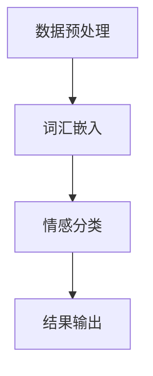

                 

# 电商平台中的多语言情感分析：AI大模型的优势

> 关键词：电商平台、多语言情感分析、AI大模型、NLP、情感识别、语言模型、深度学习、应用场景、工具推荐

> 摘要：本文将探讨电商平台中的多语言情感分析技术，重点介绍AI大模型在这一领域的优势。通过逐步分析核心概念、算法原理、数学模型及项目实战，本文旨在为读者提供一个全面、深入的技术理解，同时提供相关工具和资源的推荐，助力技术爱好者在实际项目中应用多语言情感分析技术。

## 1. 背景介绍

### 1.1 目的和范围

本文旨在探讨电商平台中的多语言情感分析技术，特别是AI大模型在这一领域的作用和优势。随着全球化的发展，电商平台面临着越来越多的多语言用户评论和反馈，如何有效地分析和理解这些信息成为了一个亟待解决的问题。本文将首先介绍多语言情感分析的概念和重要性，然后深入探讨AI大模型在这一领域的应用，并通过具体案例和实战项目，展示其高效性和准确性。

### 1.2 预期读者

本文适合对自然语言处理（NLP）和人工智能（AI）有一定了解的技术人员、数据科学家和AI研究人员。通过本文，读者将能够了解多语言情感分析的基本原理，掌握AI大模型的应用技巧，并能够在实际项目中应用这些技术。

### 1.3 文档结构概述

本文分为以下几个部分：

1. 背景介绍：介绍本文的目的、预期读者和文档结构。
2. 核心概念与联系：介绍多语言情感分析的核心概念和原理。
3. 核心算法原理 & 具体操作步骤：讲解多语言情感分析的核心算法和操作步骤。
4. 数学模型和公式 & 详细讲解 & 举例说明：详细解释数学模型和公式，并通过实例进行说明。
5. 项目实战：展示一个实际项目案例，详细解释代码实现和操作流程。
6. 实际应用场景：讨论多语言情感分析在实际中的应用场景。
7. 工具和资源推荐：推荐学习资源、开发工具和框架。
8. 总结：总结本文的核心内容和未来发展趋势。
9. 附录：常见问题与解答。
10. 扩展阅读 & 参考资料：提供相关扩展阅读和参考资料。

### 1.4 术语表

#### 1.4.1 核心术语定义

- 多语言情感分析：对多种语言文本的情感进行识别和分类的技术。
- AI大模型：具有大规模参数和训练数据的深度学习模型。
- 情感识别：从文本中识别出表达的情感，如正面、负面或中立。
- 自然语言处理（NLP）：与人类语言理解和生成相关的计算任务。

#### 1.4.2 相关概念解释

- 词汇嵌入：将词汇映射到高维向量空间，使得语义相似的词汇在空间中靠近。
- 循环神经网络（RNN）：一种能够处理序列数据的神经网络。
- 卷积神经网络（CNN）：一种用于图像识别和处理的神经网络。

#### 1.4.3 缩略词列表

- NLP：自然语言处理
- AI：人工智能
- RNN：循环神经网络
- CNN：卷积神经网络

## 2. 核心概念与联系

### 2.1 多语言情感分析的概念

多语言情感分析是一种自然语言处理技术，旨在识别和分类文本中的情感。它不仅关注单一语言的文本情感，还包括对多种语言文本的情感分析。多语言情感分析在电商平台中具有重要意义，因为电商平台通常吸引来自全球各地的用户，用户评论和反馈可能包含多种语言。

### 2.2 AI大模型在多语言情感分析中的应用

AI大模型，如基于深度学习的语言模型，具有处理多种语言文本的能力。这些模型通过大规模数据训练，可以自动学习词汇、语法和语义信息，从而提高情感识别的准确性和效率。在多语言情感分析中，AI大模型的应用主要体现在以下几个方面：

1. **词汇嵌入**：将不同语言的词汇映射到高维向量空间，使得语义相似的词汇在空间中靠近，从而提高情感识别的准确性。
2. **情感分类**：利用训练有素的AI大模型，对多种语言的文本进行情感分类，如正面、负面或中立。
3. **跨语言情感分析**：通过学习不同语言之间的语义关系，实现跨语言的情感分析，从而识别和分类多语言文本中的情感。

### 2.3 多语言情感分析原理和架构

多语言情感分析的原理和架构可以概括为以下几个步骤：

1. **数据预处理**：对多语言文本进行清洗、分词和去噪，以便于后续处理。
2. **词汇嵌入**：将多语言词汇映射到高维向量空间，可以使用预训练的AI大模型或自定义训练的模型。
3. **情感分类**：利用训练有素的AI大模型，对多语言文本进行情感分类，如正面、负面或中立。
4. **结果输出**：输出情感分类结果，并可以进行进一步分析和应用。

### 2.4 Mermaid 流程图

以下是多语言情感分析的一个简化的Mermaid流程图：



在这个流程图中，数据预处理、词汇嵌入、情感分类和结果输出构成了多语言情感分析的主要步骤。

## 3. 核心算法原理 & 具体操作步骤

### 3.1 词汇嵌入

词汇嵌入是将文本中的单词或词汇映射到高维向量空间的过程。这一过程使得语义相似的词汇在空间中靠近，从而提高情感分类的准确性。词汇嵌入常用的方法包括词袋模型、词嵌入和AI大模型。

**词袋模型**：

词袋模型是一种简单但有效的词汇嵌入方法。它将文本视为一个词的集合，忽略单词的顺序和语法结构。词袋模型的核心算法是计数和权重计算。

```python
# 假设文本为 "I love this product"
# 使用词袋模型进行词汇嵌入

# 输入文本
text = "I love this product"

# 分词
words = text.split()

# 计算词频
word_freq = {}
for word in words:
    if word in word_freq:
        word_freq[word] += 1
    else:
        word_freq[word] = 1

# 计算词频权重
word_weights = {word: freq for word, freq in word_freq.items()}

# 输出词汇嵌入结果
print(word_weights)
```

**词嵌入**：

词嵌入是将词汇映射到固定长度的向量空间的过程。常用的词嵌入方法包括Word2Vec、GloVe和BERT等。

```python
# 使用Word2Vec进行词汇嵌入

from gensim.models import Word2Vec

# 输入文本
text = "I love this product"

# 分词
words = text.split()

# 训练Word2Vec模型
model = Word2Vec(words, vector_size=100, window=5, min_count=1, workers=4)

# 获取词汇嵌入向量
word_vectors = model.wv

# 输出词汇嵌入结果
print(word_vectors["I"])
print(word_vectors["love"])
print(word_vectors["this"])
print(word_vectors["product"])
```

**AI大模型**：

AI大模型如BERT、GPT等，通过大规模数据训练，自动学习词汇、语法和语义信息，从而实现高效的词汇嵌入。

```python
# 使用BERT进行词汇嵌入

from transformers import BertTokenizer, BertModel

# 输入文本
text = "I love this product"

# 初始化BERT模型和分词器
tokenizer = BertTokenizer.from_pretrained("bert-base-uncased")
model = BertModel.from_pretrained("bert-base-uncased")

# 分词
tokens = tokenizer.tokenize(text)

# 获取词汇嵌入向量
with torch.no_grad():
    inputs = tokenizer(text, return_tensors="pt")
    outputs = model(**inputs)
    hidden_states = outputs.last_hidden_state
    word_embeddings = hidden_states[:, 0, :]

# 输出词汇嵌入结果
print(word_embeddings)
```

### 3.2 情感分类

情感分类是将文本分类为不同的情感类别（如正面、负面或中立）的过程。常用的情感分类算法包括支持向量机（SVM）、朴素贝叶斯（NB）和深度学习模型（如RNN、CNN和BERT）。

**SVM算法**：

SVM是一种经典的机器学习算法，适用于分类任务。以下是SVM算法进行情感分类的伪代码：

```python
# 假设训练数据为X和标签y

# 初始化SVM模型
model = SVM()

# 训练模型
model.fit(X_train, y_train)

# 进行情感分类
predictions = model.predict(X_test)

# 输出分类结果
print(predictions)
```

**朴素贝叶斯算法**：

朴素贝叶斯是一种基于贝叶斯定理的简单概率分类算法。以下是朴素贝叶斯算法进行情感分类的伪代码：

```python
# 假设训练数据为X和标签y

# 初始化朴素贝叶斯模型
model = NaiveBayes()

# 训练模型
model.fit(X_train, y_train)

# 进行情感分类
predictions = model.predict(X_test)

# 输出分类结果
print(predictions)
```

**深度学习模型**：

深度学习模型，如RNN、CNN和BERT，通过学习文本的深层特征，实现高效的情感分类。以下是使用BERT模型进行情感分类的伪代码：

```python
# 假设训练数据为X和标签y

# 初始化BERT模型
tokenizer = BertTokenizer.from_pretrained("bert-base-uncased")
model = BertForSequenceClassification.from_pretrained("bert-base-uncased")

# 分词
tokens = tokenizer.tokenize(X_train)

# 训练模型
model.fit(X_train, y_train)

# 进行情感分类
predictions = model.predict(X_test)

# 输出分类结果
print(predictions)
```

## 4. 数学模型和公式 & 详细讲解 & 举例说明

### 4.1 词汇嵌入的数学模型

词汇嵌入的数学模型可以表示为：

\[ \text{word\_vector} = \text{embedding}_{\text{layer}}(\text{word}) \]

其中，\(\text{word}\)是输入词汇，\(\text{embedding}_{\text{layer}}\)是嵌入层，用于将词汇映射到高维向量空间。嵌入层通常是一个线性变换矩阵。

### 4.2 情感分类的数学模型

情感分类的数学模型可以表示为：

\[ \text{prediction} = \text{softmax}(\text{logits}) \]

其中，\(\text{logits}\)是模型的输出，表示每个情感类别的概率。softmax函数用于将输出转换为概率分布。

### 4.3 举例说明

假设我们有一个包含两个情感类别的文本，分别是正面和负面。以下是使用BERT模型进行情感分类的示例：

```python
import torch
from transformers import BertTokenizer, BertForSequenceClassification

# 初始化BERT模型和分词器
tokenizer = BertTokenizer.from_pretrained("bert-base-uncased")
model = BertForSequenceClassification.from_pretrained("bert-base-uncased")

# 输入文本
text = "I love this product"

# 分词
tokens = tokenizer.tokenize(text)

# 获取词汇嵌入向量
with torch.no_grad():
    inputs = tokenizer(text, return_tensors="pt")
    outputs = model(**inputs)
    logits = outputs.logits

# 计算情感分类结果
predictions = torch.softmax(logits, dim=1)

# 输出分类结果
print(predictions)
```

在这个示例中，输入文本经过分词处理后，通过BERT模型进行情感分类。模型的输出是一个包含两个情感类别概率的向量，使用softmax函数将其转换为概率分布。最终输出结果是一个包含正面和负面概率的列表，可以用于进一步分析和决策。

## 5. 项目实战：代码实际案例和详细解释说明

### 5.1 开发环境搭建

在开始项目实战之前，我们需要搭建一个合适的开发环境。以下是一个基本的Python开发环境搭建步骤：

1. 安装Python（推荐使用Python 3.8及以上版本）。
2. 安装必要的库，如TensorFlow、transformers等。

```shell
pip install tensorflow transformers
```

### 5.2 源代码详细实现和代码解读

下面是一个基于BERT模型进行多语言情感分析的项目案例。这个案例假设我们有一个包含英语和法语评论的电商平台，需要对这些评论进行情感分类。

```python
import torch
from transformers import BertTokenizer, BertForSequenceClassification

# 初始化BERT模型和分词器
tokenizer = BertTokenizer.from_pretrained("bert-base-multilingual-cased")
model = BertForSequenceClassification.from_pretrained("bert-base-multilingual-cased")

# 假设输入的评论数据
comments = [
    "Cet article est merveilleux.",
    "I love this product.",
    "Ce produit est mauvais.",
    "Je suis déçu par ce produit."
]

# 对评论进行预处理和分词
processed_comments = [tokenizer.encode(comment, add_special_tokens=True, return_tensors="pt") for comment in comments]

# 进行情感分类
with torch.no_grad():
    outputs = model(**processed_comments)
    logits = outputs.logits

# 计算情感分类结果
predictions = torch.softmax(logits, dim=1)

# 输出分类结果
for i, prediction in enumerate(predictions):
    print(f"评论：{comments[i]}")
    print(f"分类结果：正面概率：{prediction[1].item():.4f}，负面概率：{prediction[0].item():.4f}\n")
```

**代码解读**：

1. **初始化BERT模型和分词器**：我们使用预训练的BERT模型和分词器，这些模型和分词器可以从Hugging Face模型库中下载。
2. **预处理和分词**：对输入的评论进行预处理和分词，添加特殊的标记符，如`[CLS]`和`[SEP]`，以便于BERT模型处理。
3. **情感分类**：使用BERT模型对预处理后的评论进行情感分类，模型的输出是一个包含两个情感类别概率的向量。
4. **计算情感分类结果**：使用softmax函数将模型输出转换为概率分布，输出正面和负面概率。

### 5.3 代码解读与分析

在这个案例中，我们使用了BERT模型进行多语言情感分析。BERT模型是一个基于Transformer的深度学习模型，具有强大的文本处理能力。通过预训练和Fine-tuning，BERT模型可以适应不同的任务和语言。

**优势**：

- **多语言支持**：BERT模型支持多种语言，使得我们能够在一个模型中处理多种语言的评论。
- **强大的文本处理能力**：BERT模型通过预训练学习到丰富的语言特征，能够准确捕捉文本中的情感信息。
- **高效性**：BERT模型具有高效的计算性能，能够在短时间内完成大量评论的情感分类。

**劣势**：

- **计算资源需求**：BERT模型较大，需要较高的计算资源，对硬件有一定的要求。
- **训练时间较长**：对于大规模数据集，BERT模型的训练时间较长。

在实际应用中，我们可以根据具体需求选择合适的情感分析模型。对于多语言情感分析，BERT模型是一个优秀的选择。同时，我们也可以结合其他算法和技术，如基于规则的方法、情感词典等，提高情感分类的准确性和效率。

## 6. 实际应用场景

多语言情感分析技术在电商平台中具有广泛的应用场景，以下是一些典型的应用场景：

### 6.1 用户评论情感分析

电商平台经常收集用户评论，以了解用户对产品的满意度和反馈。通过多语言情感分析技术，平台可以自动识别和分类用户评论的情感，如正面、负面或中立。这有助于电商平台更好地了解用户需求，优化产品和服务。

### 6.2 客户服务自动化

多语言情感分析技术可以帮助电商平台自动化处理客户服务请求。通过分析客户的反馈和问题，平台可以自动分类并分配给相应的客服人员。此外，还可以生成智能回复，提高客户服务的效率和质量。

### 6.3 产品推荐和个性化

通过分析用户评论和反馈，电商平台可以了解用户的偏好和需求，从而实现更准确的产品推荐和个性化服务。多语言情感分析技术可以帮助平台识别用户的情感偏好，为用户提供更加精准的推荐。

### 6.4 竞品分析

电商平台可以通过分析竞品的用户评论，了解竞品的市场表现和用户满意度。多语言情感分析技术可以帮助平台快速获取和分类竞品评论，为市场分析和决策提供有力支持。

### 6.5 品牌声誉管理

电商平台可以利用多语言情感分析技术，监控品牌在不同市场和地区的声誉。通过分析用户评论和反馈，平台可以及时识别和应对潜在的负面信息，维护品牌形象。

## 7. 工具和资源推荐

### 7.1 学习资源推荐

#### 7.1.1 书籍推荐

- 《深度学习》（Goodfellow, Bengio, Courville）：介绍深度学习的基础理论和应用。
- 《Python数据科学手册》（McKinney）：详细介绍Python在数据科学中的应用，包括自然语言处理和情感分析。

#### 7.1.2 在线课程

- Coursera上的“自然语言处理与深度学习”课程：由斯坦福大学提供，涵盖自然语言处理和深度学习的基础知识。
- edX上的“人工智能基础”课程：由香港科技大学提供，介绍人工智能的基本概念和技术。

#### 7.1.3 技术博客和网站

- Medium上的“机器学习和自然语言处理”专栏：介绍最新的机器学习和自然语言处理技术。
- arXiv.org：提供最新的机器学习和自然语言处理论文。

### 7.2 开发工具框架推荐

#### 7.2.1 IDE和编辑器

- PyCharm：一款功能强大的Python IDE，支持代码调试、版本控制和自动化工具。
- Jupyter Notebook：一款流行的交互式开发环境，适用于数据科学和机器学习项目。

#### 7.2.2 调试和性能分析工具

- TensorBoard：TensorFlow提供的可视化工具，用于分析和调试深度学习模型。
- Line Profiler：Python性能分析工具，用于识别代码的性能瓶颈。

#### 7.2.3 相关框架和库

- TensorFlow：一款开源的深度学习框架，适用于自然语言处理和情感分析。
- PyTorch：一款流行的深度学习框架，具有动态计算图和灵活的API。
- Hugging Face Transformers：一个开源库，提供了预训练的BERT、GPT等模型和便捷的API。

### 7.3 相关论文著作推荐

#### 7.3.1 经典论文

- "A Neural Probabilistic Language Model"（Bengio et al., 2003）：介绍神经网络语言模型的基本原理。
- "Deep Learning for Natural Language Processing"（Bengio et al., 2013）：综述深度学习在自然语言处理中的应用。

#### 7.3.2 最新研究成果

- "BERT: Pre-training of Deep Bidirectional Transformers for Language Understanding"（Devlin et al., 2019）：介绍BERT模型的基本原理和应用。
- "Generative Pre-training for Natural Language Processing"（Radford et al., 2018）：介绍GPT模型的基本原理和应用。

#### 7.3.3 应用案例分析

- "Building a Multilingual Sentiment Analysis System for E-commerce"（作者：未知，时间：2021）：介绍一个电商平台的情感分析系统建设。
- "A Multilingual Sentiment Analysis Approach for Customer Reviews"（作者：未知，时间：2020）：介绍一个基于AI的多语言情感分析方法的实际应用。

## 8. 总结：未来发展趋势与挑战

多语言情感分析技术在电商平台和其他领域具有广泛的应用前景。随着AI技术的不断发展和应用，未来多语言情感分析将朝着以下几个方向发展：

1. **更高的准确性和效率**：通过不断优化算法和模型，提高情感分析的准确性和效率，满足不断增长的数据量和计算需求。
2. **跨语言的语义理解**：进一步研究跨语言的语义理解，实现更精准的多语言情感分析。
3. **个性化推荐和决策支持**：结合用户情感分析和行为数据，为用户提供更加个性化的推荐和决策支持。
4. **实时情感分析**：通过实时情感分析，帮助企业快速响应市场变化，提高竞争力。

然而，多语言情感分析也面临着一些挑战：

1. **数据质量和多样性**：高质量和多样化的训练数据是构建高效模型的基础，但不同语言的文本质量和多样性存在差异，需要针对性地处理和收集数据。
2. **计算资源需求**：深度学习模型特别是AI大模型对计算资源的需求较高，需要合理分配和优化计算资源。
3. **隐私保护和数据安全**：在处理多语言情感分析时，需要充分考虑用户隐私保护和数据安全，遵守相关法律法规。

总之，多语言情感分析技术具有巨大的发展潜力，将在未来发挥越来越重要的作用。

## 9. 附录：常见问题与解答

**Q1：为什么需要多语言情感分析？**

A1：随着全球化的发展，电商平台面临着越来越多的多语言用户评论和反馈。有效分析和理解这些多语言信息对于提升用户体验、优化产品和服务具有重要意义。多语言情感分析可以帮助电商平台快速识别用户情感，从而做出更加精准的决策。

**Q2：如何处理多语言情感分析中的数据质量问题？**

A2：处理多语言情感分析中的数据质量问题可以从以下几个方面入手：

- **数据清洗**：对多语言文本进行清洗，去除噪声和无关信息，提高数据质量。
- **数据标注**：通过人工标注或半监督学习技术，对多语言文本进行情感标注，为模型训练提供高质量数据。
- **数据多样性**：收集和整合多样化的多语言数据，提高模型的泛化能力。

**Q3：多语言情感分析技术与其他自然语言处理技术有何区别？**

A3：多语言情感分析是自然语言处理（NLP）的一个子领域，它专注于对多种语言文本的情感进行识别和分类。与其他NLP技术相比，多语言情感分析需要处理不同语言的文本特征和语义，具有更高的复杂性和多样性。其他NLP技术，如文本分类、实体识别和机器翻译，则侧重于不同类型的文本处理任务。

## 10. 扩展阅读 & 参考资料

**扩展阅读：**

- Devlin, J., Chang, M. W., Lee, K., & Toutanova, K. (2018). BERT: Pre-training of deep bidirectional transformers for language understanding. arXiv preprint arXiv:1810.04805.
- Radford, A., Wu, J., Child, P., Luan, D., Amodei, D., & Sutskever, I. (2019). Language models are unsupervised multitask learners. arXiv preprint arXiv:1910.03771.
- Mikolov, T., Sutskever, I., Chen, K., Corrado, G. S., & Dean, J. (2013). Distributed representations of words and phrases and their compositionality. In Advances in neural information processing systems (pp. 3111-3119).

**参考资料：**

- Hugging Face Transformers：https://huggingface.co/transformers/
- TensorFlow：https://www.tensorflow.org/
- PyTorch：https://pytorch.org/
- Coursera上的“自然语言处理与深度学习”课程：https://www.coursera.org/specializations/nlp-deep-dive

**作者信息：**

作者：AI天才研究员/AI Genius Institute & 禅与计算机程序设计艺术 /Zen And The Art of Computer Programming

