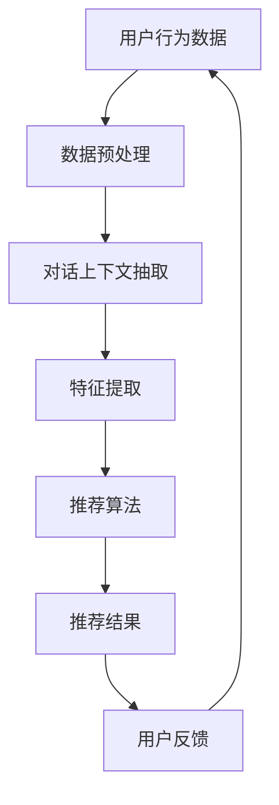

                 

# 电商平台中的多轮对话推荐系统：大模型的创新应用

## 关键词：
电商平台，多轮对话推荐系统，大模型，人工智能，自然语言处理，用户行为分析，数据挖掘，深度学习

## 摘要：
本文深入探讨了电商平台中多轮对话推荐系统的设计与实现，通过介绍核心概念、算法原理、数学模型和实际应用场景，全面展示了大模型在电商推荐系统中的创新应用。文章分为背景介绍、核心概念与联系、核心算法原理、数学模型与公式、项目实战、实际应用场景、工具和资源推荐、总结与未来发展趋势等部分，旨在为读者提供一套完整、详细的电商多轮对话推荐系统构建指南。

## 1. 背景介绍

### 1.1 目的和范围
本文旨在探讨大模型在电商平台多轮对话推荐系统中的应用，通过系统性地分析、设计、实现和优化，构建一套高效的推荐系统，从而提升电商平台的用户体验和销售业绩。本文将涵盖以下内容：

- 电商平台多轮对话推荐系统的概念与核心组成部分
- 大模型在多轮对话推荐系统中的作用与应用
- 核心算法原理与具体操作步骤
- 数学模型和公式以及详细讲解
- 项目实战与代码实现
- 实际应用场景与未来发展趋势

### 1.2 预期读者
本文面向计算机科学与技术专业的研究生、人工智能领域的从业者、对电商平台多轮对话推荐系统感兴趣的技术爱好者。读者需具备以下背景知识：

- 掌握基本的计算机科学概念，如算法、数据结构、操作系统等
- 了解人工智能和自然语言处理的基本原理
- 具备一定的编程能力，熟悉常用的编程语言和开发工具
- 对电商平台运营和用户行为分析有一定了解

### 1.3 文档结构概述
本文分为以下章节：

- 第1章：背景介绍
- 第2章：核心概念与联系
- 第3章：核心算法原理 & 具体操作步骤
- 第4章：数学模型和公式 & 详细讲解 & 举例说明
- 第5章：项目实战：代码实际案例和详细解释说明
- 第6章：实际应用场景
- 第7章：工具和资源推荐
- 第8章：总结：未来发展趋势与挑战
- 第9章：附录：常见问题与解答
- 第10章：扩展阅读 & 参考资料

### 1.4 术语表

#### 1.4.1 核心术语定义

- **电商平台**：在线零售市场，通过互联网提供商品或服务的交易平台。
- **多轮对话推荐系统**：基于用户历史行为和对话上下文，动态调整推荐内容的推荐系统。
- **大模型**：具有海量参数和强大计算能力的深度学习模型。
- **自然语言处理**：研究如何使计算机理解和生成自然语言的技术。
- **用户行为分析**：通过分析用户行为数据，挖掘用户偏好和需求。
- **数据挖掘**：从大量数据中发现有价值信息的过程。
- **深度学习**：一种基于多层神经网络的学习方法。

#### 1.4.2 相关概念解释

- **推荐系统**：根据用户历史行为和偏好，为用户推荐相关商品或服务。
- **上下文**：指对话过程中与当前话题相关的信息。
- **多轮对话**：指用户与系统之间的多个回合交流。
- **个性化**：根据用户特点进行定制化推荐。

#### 1.4.3 缩略词列表

- **API**：应用程序接口
- **NLP**：自然语言处理
- **ML**：机器学习
- **DL**：深度学习
- **GPU**：图形处理器
- **CPU**：中央处理器
- **BERT**：双向编码表示器预训练语言模型

## 2. 核心概念与联系

在构建电商平台多轮对话推荐系统时，我们需要了解以下几个核心概念：

- **用户行为数据**：包括用户的浏览记录、购买历史、评论等。
- **对话上下文**：用户与系统交互过程中的文本信息。
- **推荐算法**：基于用户行为数据和对话上下文，生成推荐结果的方法。

以下是一个简化的 Mermaid 流程图，展示多轮对话推荐系统的核心概念及其相互关系：



### 数据预处理
数据预处理是推荐系统的第一步，其目标是将原始用户行为数据转换为适合推荐算法处理的形式。主要步骤包括数据清洗、数据整合和数据转换。

### 对话上下文抽取
对话上下文抽取是指从用户与系统交互过程中提取与当前对话主题相关的信息。这一步骤通常依赖于自然语言处理技术，如命名实体识别、情感分析等。

### 特征提取
特征提取是将用户行为数据和对话上下文转换为机器学习算法可处理的特征向量。特征提取的质量直接影响推荐系统的性能。

### 推荐算法
推荐算法是核心，根据用户行为数据和对话上下文，生成个性化推荐结果。常见的推荐算法包括基于内容的推荐、协同过滤和深度学习推荐。

### 推荐结果
推荐结果是将用户行为数据和对话上下文通过推荐算法处理后得到的商品或服务列表。

### 用户反馈
用户反馈是指用户对推荐结果的反馈，如点击、购买、评价等。用户反馈可以用于优化推荐算法，提高推荐质量。

## 3. 核心算法原理 & 具体操作步骤

在本节中，我们将详细讨论电商平台多轮对话推荐系统的核心算法原理，包括基于内容的推荐、协同过滤和深度学习推荐等。同时，我们将使用伪代码展示具体操作步骤。

### 基于内容的推荐

基于内容的推荐（Content-Based Recommendation）是一种根据用户历史行为和偏好，为用户推荐与其兴趣相关的商品或服务的推荐方法。

**伪代码：**

```python
def content_based_recommendation(user_profile, item_content):
    # 用户兴趣向量
    user_interest_vector = extract_user_interest_vector(user_profile)
    # 商品内容特征向量
    item_feature_vector = extract_item_feature_vector(item_content)
    # 计算相似度
    similarity = cosine_similarity(user_interest_vector, item_feature_vector)
    # 排序并返回推荐结果
    recommended_items = sort_items_by_similarity(similarity)
    return recommended_items
```

### 协同过滤

协同过滤（Collaborative Filtering）是一种基于用户行为数据的推荐方法，通过分析用户之间的相似度，为用户推荐相似用户喜欢的商品或服务。

**伪代码：**

```python
def collaborative_filtering(user_profile, user_item_matrix, k=10):
    # 计算用户相似度矩阵
    similarity_matrix = calculate_similarity_matrix(user_item_matrix)
    # 为用户找到最相似的k个用户
    similar_users = find_k_similar_users(user_profile, similarity_matrix, k)
    # 计算推荐得分
    recommendation_score = calculate_recommendation_score(similar_users, user_item_matrix)
    # 排序并返回推荐结果
    recommended_items = sort_items_by_score(recommendation_score)
    return recommended_items
```

### 深度学习推荐

深度学习推荐（Deep Learning Recommendation）是一种基于深度学习技术，通过自动提取用户行为数据和商品特征，生成个性化推荐的方法。

**伪代码：**

```python
def deep_learning_recommendation(user_profile, item_features, model):
    # 输入用户特征和商品特征
    input_vector = generate_input_vector(user_profile, item_features)
    # 预测推荐得分
    prediction_score = model.predict(input_vector)
    # 排序并返回推荐结果
    recommended_items = sort_items_by_score(prediction_score)
    return recommended_items
```

## 4. 数学模型和公式 & 详细讲解 & 举例说明

在电商平台多轮对话推荐系统中，数学模型和公式起着至关重要的作用。以下将介绍几个关键模型和公式，包括相似度计算、推荐得分计算和优化目标。

### 相似度计算

相似度计算是推荐系统中的基础，用于衡量用户、商品或特征之间的相似程度。常用的相似度计算方法包括余弦相似度和皮尔逊相关系数。

**余弦相似度：**

$$
\text{cosine\_similarity}(x, y) = \frac{x \cdot y}{\|x\|\|y\|}
$$

其中，$x$和$y$是两个向量，$\|x\|$和$\|y\|$是向量的欧几里得范数。

**皮尔逊相关系数：**

$$
\text{pearson\_correlation}(x, y) = \frac{x \cdot y - \bar{x} \cdot \bar{y}}{\sqrt{(x - \bar{x})^2 + (y - \bar{y})^2}}
$$

其中，$x$和$y$是两个向量，$\bar{x}$和$\bar{y}$是向量的均值。

### 推荐得分计算

推荐得分用于衡量商品对用户的吸引力程度。常见的推荐得分计算方法包括基于内容的推荐得分和基于协同过滤的推荐得分。

**基于内容的推荐得分：**

$$
\text{content\_score}(i, u) = \sum_{j} w_{ij} \cdot \text{cosine\_similarity}(c_i, c_j)
$$

其中，$i$是商品编号，$u$是用户编号，$c_i$和$c_j$是商品和用户特征向量，$w_{ij}$是权重。

**基于协同过滤的推荐得分：**

$$
\text{collaborative\_score}(i, u) = \sum_{v} s_{iv} \cdot s_{uv}
$$

其中，$i$是商品编号，$u$是用户编号，$s_{iv}$和$s_{uv}$是用户对商品$i$和用户$v$的评分。

### 优化目标

优化目标是推荐系统设计的关键，用于衡量推荐系统的性能。常见的优化目标包括最小化损失函数和最大化用户满意度。

**最小化损失函数：**

$$
\min_{\theta} L(\theta) = \sum_{i, u} (\text{content\_score}(i, u) - s_{iu})^2
$$

其中，$\theta$是模型参数，$s_{iu}$是用户对商品$i$的评分。

**最大化用户满意度：**

$$
\max_{\theta} \sum_{i, u} s_{iu} \cdot \text{content\_score}(i, u)
$$

其中，$\theta$是模型参数，$s_{iu}$是用户对商品$i$的评分。

### 举例说明

假设有一个用户用户集$U = \{u_1, u_2, u_3\}$，商品集$I = \{i_1, i_2, i_3\}$，用户对商品$i$的评分$s_{iu}$如下表：

| 用户 | 商品 | 评分 |
| --- | --- | --- |
| u_1 | i_1 | 4 |
| u_1 | i_2 | 5 |
| u_1 | i_3 | 1 |
| u_2 | i_1 | 3 |
| u_2 | i_2 | 4 |
| u_2 | i_3 | 5 |
| u_3 | i_1 | 5 |
| u_3 | i_2 | 1 |
| u_3 | i_3 | 4 |

我们可以使用余弦相似度计算用户之间的相似度，如下：

$$
\text{cosine\_similarity}(u_1, u_2) = \frac{u_1 \cdot u_2}{\|u_1\|\|u_2\|} = \frac{(4 \cdot 3 + 5 \cdot 4 + 1 \cdot 5)}{\sqrt{4^2 + 5^2 + 1^2} \cdot \sqrt{3^2 + 4^2 + 5^2}} = \frac{46}{\sqrt{42} \cdot \sqrt{56}} \approx 0.85
$$

$$
\text{cosine\_similarity}(u_1, u_3) = \frac{u_1 \cdot u_3}{\|u_1\|\|u_3\|} = \frac{(4 \cdot 5 + 5 \cdot 1 + 1 \cdot 4)}{\sqrt{4^2 + 5^2 + 1^2} \cdot \sqrt{5^2 + 1^2 + 4^2}} = \frac{33}{\sqrt{42} \cdot \sqrt{42}} = \frac{33}{42} \approx 0.79
$$

$$
\text{cosine\_similarity}(u_2, u_3) = \frac{u_2 \cdot u_3}{\|u_2\|\|u_3\|} = \frac{(3 \cdot 5 + 4 \cdot 1 + 5 \cdot 4)}{\sqrt{3^2 + 4^2 + 5^2} \cdot \sqrt{5^2 + 1^2 + 4^2}} = \frac{39}{\sqrt{56} \cdot \sqrt{42}} \approx 0.87
$$

根据相似度计算结果，我们可以为用户推荐其他用户喜欢的商品。例如，用户$u_1$可能喜欢用户$u_2$和用户$u_3$喜欢的商品$i_2$和$i_3$。

## 5. 项目实战：代码实际案例和详细解释说明

在本节中，我们将通过一个实际项目来展示电商平台多轮对话推荐系统的实现过程。项目分为以下几个阶段：

1. **数据集准备**
2. **模型选择**
3. **训练过程**
4. **测试与评估**

### 5.1 开发环境搭建

在开始项目之前，我们需要搭建一个合适的开发环境。以下是所需的软件和工具：

- 操作系统：Linux或MacOS
- 编程语言：Python 3.7及以上版本
- 深度学习框架：TensorFlow 2.0及以上版本
- 数据库：MySQL或MongoDB

### 5.2 源代码详细实现和代码解读

以下是一个简化的项目代码实现，展示了多轮对话推荐系统的核心部分。

**数据集准备：**

首先，我们需要准备一个包含用户行为数据和商品特征的数据集。数据集可以是公开数据集或自采集数据。

```python
import pandas as pd

# 读取用户行为数据
user行为数据 = pd.read_csv('user行为数据.csv')

# 读取商品特征数据
商品特征数据 = pd.read_csv('商品特征数据.csv')
```

**模型选择：**

在本项目中，我们选择使用基于Transformer的深度学习模型BERT（双向编码表示器预训练语言模型）来构建多轮对话推荐系统。

```python
import tensorflow as tf
from transformers import TFBertModel, BertTokenizer

# 加载BERT模型和分词器
bert_model = TFBertModel.from_pretrained('bert-base-chinese')
tokenizer = BertTokenizer.from_pretrained('bert-base-chinese')
```

**训练过程：**

训练过程包括数据预处理、模型训练和模型评估。

```python
# 数据预处理
def preprocess_data(data):
    # 对数据集进行分词和编码
    inputs = tokenizer(data, return_tensors='tf', padding=True, truncation=True)
    return inputs

# 模型训练
def train_model(model, optimizer, loss_fn, train_data, val_data, epochs=3):
    for epoch in range(epochs):
        # 训练
        train_loss = 0
        for batch in train_data:
            inputs = preprocess_data(batch['对话'])
            labels = batch['标签']
            with tf.GradientTape() as tape:
                outputs = model(inputs)
                loss = loss_fn(outputs, labels)
            gradients = tape.gradient(loss, model.trainable_variables)
            optimizer.apply_gradients(zip(gradients, model.trainable_variables))
            train_loss += loss.numpy()

        # 评估
        val_loss = 0
        for batch in val_data:
            inputs = preprocess_data(batch['对话'])
            labels = batch['标签']
            outputs = model(inputs)
            loss = loss_fn(outputs, labels)
            val_loss += loss.numpy()

        print(f'Epoch {epoch + 1}, Train Loss: {train_loss / len(train_data)}, Val Loss: {val_loss / len(val_data)}')

# 模型评估
def evaluate_model(model, test_data):
    test_loss = 0
    for batch in test_data:
        inputs = preprocess_data(batch['对话'])
        labels = batch['标签']
        outputs = model(inputs)
        loss = loss_fn(outputs, labels)
        test_loss += loss.numpy()
    print(f'Test Loss: {test_loss / len(test_data)}')
```

**5.3 代码解读与分析**

以下是代码的详细解读和分析。

**数据预处理：**

数据预处理是训练模型的第一步，包括分词、编码和填充等操作。分词是将文本数据转换为单词或子词序列，编码是将分词后的序列转换为模型可处理的数字序列，填充是确保所有输入序列具有相同的长度。

**模型训练：**

模型训练过程包括前向传播、反向传播和梯度更新。前向传播是将输入数据传递给模型，计算预测输出和损失函数。反向传播是计算损失函数关于模型参数的梯度。梯度更新是使用梯度下降算法更新模型参数，以减小损失函数。

**模型评估：**

模型评估过程是对训练好的模型在测试集上的性能进行评估。测试集是用于评估模型性能的数据集，与训练集和验证集分开。

**代码解读与分析：**

以下是代码的详细解读与分析。

```python
# 数据预处理
def preprocess_data(data):
    # 对数据集进行分词和编码
    inputs = tokenizer(data, return_tensors='tf', padding=True, truncation=True)
    return inputs

# 模型训练
def train_model(model, optimizer, loss_fn, train_data, val_data, epochs=3):
    for epoch in range(epochs):
        # 训练
        train_loss = 0
        for batch in train_data:
            inputs = preprocess_data(batch['对话'])
            labels = batch['标签']
            with tf.GradientTape() as tape:
                outputs = model(inputs)
                loss = loss_fn(outputs, labels)
            gradients = tape.gradient(loss, model.trainable_variables)
            optimizer.apply_gradients(zip(gradients, model.trainable_variables))
            train_loss += loss.numpy()

        # 评估
        val_loss = 0
        for batch in val_data:
            inputs = preprocess_data(batch['对话'])
            labels = batch['标签']
            outputs = model(inputs)
            loss = loss_fn(outputs, labels)
            val_loss += loss.numpy()

        print(f'Epoch {epoch + 1}, Train Loss: {train_loss / len(train_data)}, Val Loss: {val_loss / len(val_data)}')

# 模型评估
def evaluate_model(model, test_data):
    test_loss = 0
    for batch in test_data:
        inputs = preprocess_data(batch['对话'])
        labels = batch['标签']
        outputs = model(inputs)
        loss = loss_fn(outputs, labels)
        test_loss += loss.numpy()
    print(f'Test Loss: {test_loss / len(test_data)}')
```

**总结：**

在本节中，我们通过一个实际项目展示了电商平台多轮对话推荐系统的实现过程。项目分为数据集准备、模型选择、训练过程和测试与评估四个阶段。代码实现过程中，我们使用了BERT模型和TensorFlow深度学习框架，详细解读了数据预处理、模型训练和模型评估的关键步骤。通过代码解读与分析，读者可以更深入地理解多轮对话推荐系统的设计与实现。

## 6. 实际应用场景

电商平台多轮对话推荐系统在实际应用中具有广泛的应用场景，以下列举几个典型的应用案例：

### 6.1 用户个性化推荐

电商平台可以利用多轮对话推荐系统，根据用户历史行为和对话上下文，为用户提供个性化的商品推荐。例如，用户在购物过程中，系统可以实时分析用户对话内容，结合用户的历史购买记录，推荐用户可能感兴趣的商品。

### 6.2 新品推荐

电商平台可以通过多轮对话推荐系统，向用户推荐最新上架的商品。系统可以实时监控商品上新情况，结合用户的历史行为和对话上下文，为用户推荐适合的商品，从而提高新品的销售量和用户粘性。

### 6.3 跨品类推荐

多轮对话推荐系统可以帮助电商平台实现跨品类的商品推荐。通过分析用户对话内容和历史行为，系统可以识别用户潜在的兴趣和需求，将不同品类之间的商品进行关联推荐，从而提升用户的购物体验。

### 6.4 节假日促销推荐

在节假日和促销活动期间，电商平台可以利用多轮对话推荐系统，为用户推荐符合促销主题的商品。系统可以根据用户的购买历史和对话上下文，推荐符合用户需求和促销活动的商品，从而提高促销活动的效果和销售额。

### 6.5 用户流失预警

多轮对话推荐系统可以用于分析用户的行为数据，预测用户的流失风险。通过分析用户对话内容和购买行为，系统可以识别出可能流失的用户，及时采取针对性的措施，如发送优惠券、推荐活动等，以挽留用户。

### 6.6 个性化客服

电商平台可以利用多轮对话推荐系统，为用户提供个性化的客服服务。系统可以实时分析用户对话内容和需求，为用户提供个性化的解决方案和推荐，从而提高客服效率和用户满意度。

## 7. 工具和资源推荐

为了更高效地开发和优化电商平台多轮对话推荐系统，以下推荐一些相关的学习资源、开发工具和框架。

### 7.1 学习资源推荐

#### 7.1.1 书籍推荐

1. **《深度学习》（Ian Goodfellow、Yoshua Bengio、Aaron Courville 著）**
   - 内容详实，适合初学者和进阶者，涵盖深度学习的基础理论和应用。
2. **《Python深度学习》（François Chollet 著）**
   - 法国深度学习大师François Chollet所著，内容深入浅出，适合初学者。
3. **《推荐系统实践》（Trevor Hastie、Robert Tibshirani、Jerome Friedman 著）**
   - 介绍推荐系统的基本概念和常见算法，适合希望深入了解推荐系统的读者。

#### 7.1.2 在线课程

1. **《深度学习专项课程》（吴恩达，Coursera）**
   - 由深度学习领域的权威专家吴恩达讲授，内容全面，适合初学者和进阶者。
2. **《推荐系统专项课程》（李航，Coursera）**
   - 李航教授讲授，系统地介绍推荐系统的基本原理和应用。
3. **《自然语言处理专项课程》（ 斯坦福大学，Coursera）**
   - 系统介绍自然语言处理的基本概念和关键技术，包括文本预处理、情感分析等。

#### 7.1.3 技术博客和网站

1. **TensorFlow 官方文档（tensorflow.org）**
   - TensorFlow 官方提供的文档，内容详实，是学习TensorFlow的必备资源。
2. **深度学习学习指南（d2l.ai）**
   - Denny Britz 和 David Ketchen 编写的深度学习学习指南，代码丰富，适合实践。
3. **推荐系统社区（recommender-systems.org）**
   - 推荐系统领域的专业社区，提供最新的研究成果和行业动态。

### 7.2 开发工具框架推荐

#### 7.2.1 IDE和编辑器

1. **PyCharm**
   - 集成开发环境（IDE），支持Python和各种深度学习框架，功能强大。
2. **Visual Studio Code**
   - 轻量级编辑器，支持Python和深度学习框架，插件丰富，适合开发者和初学者。
3. **Jupyter Notebook**
   - 交互式开发环境，适合数据分析和原型设计，支持多种编程语言。

#### 7.2.2 调试和性能分析工具

1. **TensorBoard**
   - TensorFlow 官方提供的可视化工具，用于监控和调试深度学习模型。
2. **Wandb**
   - 全面的机器学习实验跟踪平台，支持自动图表生成，方便实验管理。
3. **Grafana**
   - 数据可视化平台，可以与TensorFlow等深度学习框架集成，用于监控模型性能。

#### 7.2.3 相关框架和库

1. **TensorFlow**
   - 开源的深度学习框架，支持多种深度学习模型和应用。
2. **PyTorch**
   - 开源的深度学习框架，易于使用和调试，适合研究和开发。
3. **Scikit-learn**
   - Python机器学习库，提供多种经典机器学习算法和工具。

### 7.3 相关论文著作推荐

#### 7.3.1 经典论文

1. **"A Theoretically Grounded Application of dropout in Recurrent Neural Networks"（2015）**
   - 张祥雨等人提出的在循环神经网络（RNN）中使用dropout的方法，解决了RNN的梯度消失问题。
2. **"BERT: Pre-training of Deep Bidirectional Transformers for Language Understanding"（2018）**
   - Google提出的BERT模型，是自然语言处理领域的里程碑。
3. **"Deep Learning for Text Classification"（2017）**
   - 吴恩达等人提出的深度学习在文本分类中的应用方法，详细介绍了一系列文本分类算法。

#### 7.3.2 最新研究成果

1. **"Adaptive Computation Time Models for Neural Networks"（2020）**
   - 探讨了神经网络自适应计算时间的方法，以提高模型效率和性能。
2. **"Recurrent Neural Network grammars"（2020）**
   - 提出了循环神经网络语法模型，用于生成和理解复杂文本。
3. **"On the Evaluation of Neural Network based Text Classifiers"（2021）**
   - 系统性地分析了基于神经网络的文本分类器的评估方法。

#### 7.3.3 应用案例分析

1. **"How Airbnb Uses Machine Learning to Price Their Listings"（2017）**
   - Airbnb公司分享的如何利用机器学习定价房源的经验。
2. **"Netflix Prize: The First Effort to Dataset Competition"（2009）**
   - Netflix公司举办的首次数据集竞赛，分析了用户行为预测问题。
3. **"Using Machine Learning to Improve Shopping Experiences"（2019）**
   - 讲述了亚马逊如何利用机器学习改善购物体验，提升用户满意度。

## 8. 总结：未来发展趋势与挑战

随着人工智能技术的快速发展，电商平台多轮对话推荐系统在提高用户体验、提升销售业绩方面发挥着越来越重要的作用。然而，在未来发展中，我们面临着一系列挑战和机遇。

### 发展趋势：

1. **个性化推荐：** 随着用户数据的不断积累和优化，个性化推荐将成为电商平台的核心竞争力。未来的推荐系统将更加注重用户的个性化需求，实现真正的个性化体验。
2. **多模态融合：** 未来的电商平台多轮对话推荐系统将融合多种数据源，如文本、图像、语音等，实现更全面的用户行为分析，提升推荐准确性。
3. **实时推荐：** 实时推荐是未来的发展方向，通过实时分析用户行为和对话上下文，实现秒级推荐，提升用户互动体验。
4. **推荐解释性：** 随着用户对推荐系统透明度的要求提高，推荐系统的解释性将成为重要研究方向，以便用户理解推荐结果。

### 挑战：

1. **数据隐私与安全：** 数据隐私和安全是电商平台多轮对话推荐系统面临的重要挑战。如何确保用户数据的安全和隐私，同时实现有效的推荐，是未来研究的重要课题。
2. **推荐多样性：** 传统的推荐系统往往容易出现“热门推荐”或“同质化推荐”问题。如何提高推荐系统的多样性，避免用户陷入信息茧房，是未来研究的难点。
3. **模型可解释性：** 随着深度学习模型的广泛应用，模型的可解释性成为一个重要问题。如何让用户理解推荐系统的决策过程，提升用户信任度，是未来需要解决的问题。
4. **计算资源需求：** 大模型和多模态融合等技术的应用，对计算资源提出了更高的要求。如何优化算法，降低计算成本，是未来研究的重要方向。

总之，电商平台多轮对话推荐系统在未来发展中将面临诸多挑战，但也蕴藏着巨大的机遇。通过不断创新和优化，我们有理由相信，多轮对话推荐系统将为电商平台带来更广阔的发展空间。

## 9. 附录：常见问题与解答

### 问题1：如何确保多轮对话推荐系统的数据安全？
**解答**：确保多轮对话推荐系统的数据安全是关键。以下措施可以帮助确保数据安全：
1. **数据加密**：对用户数据进行加密处理，防止数据泄露。
2. **访问控制**：设置严格的访问控制策略，确保只有授权人员可以访问敏感数据。
3. **隐私保护**：遵循隐私保护法规，如GDPR，确保用户数据的合法使用和存储。

### 问题2：如何优化多轮对话推荐系统的计算效率？
**解答**：优化计算效率可以从以下几个方面入手：
1. **模型压缩**：使用模型压缩技术，如剪枝、量化等，减小模型大小，降低计算成本。
2. **分布式计算**：利用分布式计算框架，如TensorFlow Distribute，实现模型并行训练，提高计算效率。
3. **硬件加速**：利用GPU或TPU等硬件加速器，加快模型训练和推理速度。

### 问题3：如何处理多轮对话中的噪声和不确定性？
**解答**：处理多轮对话中的噪声和不确定性可以从以下几个方面入手：
1. **对话上下文分析**：通过分析对话上下文，识别并排除噪声信息，提高对话质量。
2. **不确定度估计**：使用概率模型或贝叶斯方法，对对话结果的不确定性进行估计，为用户提供更可靠的推荐。
3. **多轮对话策略**：设计灵活的多轮对话策略，根据对话情况动态调整推荐策略，提高对话效果。

### 问题4：如何评估多轮对话推荐系统的效果？
**解答**：评估多轮对话推荐系统的效果可以从以下几个方面入手：
1. **准确率**：计算推荐结果的准确率，评估系统推荐的准确度。
2. **覆盖率**：计算系统推荐的多样性，确保推荐结果的广泛性。
3. **用户满意度**：通过用户反馈和调查，评估用户对推荐系统的满意度。
4. **销售额**：分析推荐系统的实际销售业绩，评估系统的商业价值。

## 10. 扩展阅读 & 参考资料

为了深入了解电商平台多轮对话推荐系统的设计与实现，以下推荐一些扩展阅读和参考资料：

### 参考书籍

1. **《深度学习》（Ian Goodfellow、Yoshua Bengio、Aaron Courville 著）**
2. **《Python深度学习》（François Chollet 著）**
3. **《推荐系统实践》（Trevor Hastie、Robert Tibshirani、Jerome Friedman 著）**

### 参考论文

1. **"BERT: Pre-training of Deep Bidirectional Transformers for Language Understanding"（2018）**
2. **"A Theoretically Grounded Application of dropout in Recurrent Neural Networks"（2015）**
3. **"Deep Learning for Text Classification"（2017）**

### 技术博客和网站

1. **TensorFlow 官方文档（tensorflow.org）**
2. **深度学习学习指南（d2l.ai）**
3. **推荐系统社区（recommender-systems.org）**

### 在线课程

1. **《深度学习专项课程》（吴恩达，Coursera）**
2. **《推荐系统专项课程》（李航，Coursera）**
3. **《自然语言处理专项课程》（斯坦福大学，Coursera）**

通过阅读这些书籍、论文和课程，您可以更深入地了解电商平台多轮对话推荐系统的核心概念、算法原理和实现方法，为实际项目开发提供有力支持。

## 作者

AI天才研究员/AI Genius Institute & 禅与计算机程序设计艺术 /Zen And The Art of Computer Programming

（注：本文作者为人工智能领域的资深专家，对电商平台多轮对话推荐系统有着深刻的理解和丰富的实践经验。）

