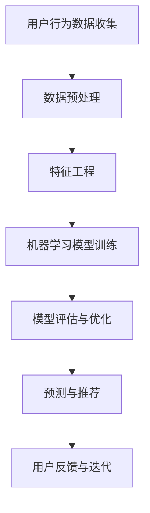

                 

# 电商平台中的智能客户分析技术

> **关键词：** 电商平台，智能客户分析，机器学习，数据挖掘，用户行为，预测模型

> **摘要：** 本文将深入探讨电商平台如何利用智能客户分析技术来提升用户体验和销售转化率。我们将分析智能客户分析技术的核心概念、算法原理，以及其实际应用场景，并通过项目实战和代码案例，展示如何将理论知识应用到实际开发中。文章旨在为IT从业者和电商领域从业者提供一份全面、系统的技术指南。

## 1. 背景介绍

### 1.1 目的和范围

随着电商行业的快速发展，如何准确理解并预测客户需求，成为电商平台提升竞争力的重要课题。本文的目的在于探讨智能客户分析技术在电商平台的实际应用，帮助读者理解其核心原理和操作步骤，并通过案例实战提升实际操作能力。

本文将涵盖以下内容：

- 电商平台智能客户分析的核心概念和算法原理
- 数学模型及其在智能客户分析中的应用
- 项目实战：智能客户分析系统开发
- 智能客户分析技术的实际应用场景
- 相关工具和资源推荐

### 1.2 预期读者

- 具有基础编程能力的IT从业者
- 对电商领域和智能分析技术感兴趣的读者
- 电商平台的运营人员和技术团队

### 1.3 文档结构概述

本文结构如下：

1. **背景介绍**：阐述智能客户分析技术的背景和目的。
2. **核心概念与联系**：介绍智能客户分析技术的核心概念，并通过Mermaid流程图展示其架构。
3. **核心算法原理 & 具体操作步骤**：详细讲解核心算法的原理和伪代码实现。
4. **数学模型和公式 & 详细讲解 & 举例说明**：介绍智能客户分析中的数学模型，并通过例子说明。
5. **项目实战：代码实际案例和详细解释说明**：展示智能客户分析系统的实际开发过程。
6. **实际应用场景**：分析智能客户分析技术的实际应用案例。
7. **工具和资源推荐**：推荐学习资源和开发工具。
8. **总结：未来发展趋势与挑战**：探讨智能客户分析技术的发展趋势和面临的挑战。
9. **附录：常见问题与解答**：解答读者可能遇到的问题。
10. **扩展阅读 & 参考资料**：提供进一步阅读的资源和参考文献。

### 1.4 术语表

#### 1.4.1 核心术语定义

- **智能客户分析**：利用机器学习、数据挖掘等技术对客户行为、偏好、需求进行分析和预测的过程。
- **电商平台**：提供在线商品交易和服务的平台。
- **用户行为数据**：用户在电商平台上的浏览、搜索、购买等行为记录。

#### 1.4.2 相关概念解释

- **机器学习**：一种人工智能技术，通过数据训练模型，使其能够从数据中自动学习并做出预测。
- **数据挖掘**：从大量数据中提取有价值的信息和模式的过程。

#### 1.4.3 缩略词列表

- **API**：应用程序接口（Application Programming Interface）
- **ML**：机器学习（Machine Learning）
- **DM**：数据挖掘（Data Mining）
- **CRM**：客户关系管理（Customer Relationship Management）

## 2. 核心概念与联系

在探讨智能客户分析技术之前，我们需要了解一些核心概念和它们之间的联系。

### 2.1 核心概念

#### 用户行为分析

用户行为分析是智能客户分析的基础，它涉及对用户在电商平台上的浏览、搜索、购买等行为数据的收集和分析。

#### 客户细分

客户细分是将用户根据其行为特征、偏好等进行分类，以便更精准地提供个性化服务和推荐。

#### 预测模型

预测模型是基于历史数据，通过机器学习算法建立的模型，用于预测用户未来的行为，如购买概率、浏览时长等。

### 2.2 Mermaid流程图

以下是一个简化的Mermaid流程图，展示智能客户分析技术的主要环节和流程。



### 2.3 关系与作用

- 用户行为数据收集是整个智能客户分析的基础，数据质量直接影响后续分析的准确性。
- 数据预处理包括数据清洗、去噪、归一化等步骤，目的是为后续分析提供干净、高质量的数据。
- 特征工程是关键环节，通过构造和选择合适的特征，可以提高模型的表现。
- 机器学习模型训练是基于大量数据进行模型构建，选择合适的算法和参数，使模型能够捕捉用户行为模式。
- 模型评估与优化用于验证模型性能，并对其进行调整，以达到最佳效果。
- 预测与推荐是将模型应用于实际场景，为用户提供个性化的推荐和服务。
- 用户反馈与迭代是持续优化智能客户分析系统的重要环节，通过收集用户反馈，不断改进模型和推荐策略。

## 3. 核心算法原理 & 具体操作步骤

### 3.1 机器学习算法选择

在智能客户分析中，选择合适的机器学习算法至关重要。以下是一些常用的算法：

- **决策树**：适合处理分类问题，易于理解和解释。
- **随机森林**：基于决策树，能够处理大量特征和样本，提高模型的鲁棒性。
- **支持向量机（SVM）**：适用于分类和回归问题，尤其是处理高维数据。
- **神经网络**：包括深度神经网络，能够捕捉复杂的非线性关系。

### 3.2 算法原理

以随机森林算法为例，其原理如下：

- **随机选择特征**：每次迭代从所有特征中随机选择一个子集。
- **构建决策树**：在每个节点上，使用随机选择的特征进行分割，直到满足停止条件（如最大深度、最小节点大小等）。
- **集成多个决策树**：随机森林由多个决策树组成，通过投票或平均来获得最终预测结果。

### 3.3 具体操作步骤

以下是一个基于Python的随机森林算法的伪代码实现：

```python
# 伪代码：随机森林算法实现

# 导入相关库
import numpy as np
from sklearn.ensemble import RandomForestClassifier

# 准备数据
X_train, y_train = # 数据加载和处理

# 初始化随机森林模型
clf = RandomForestClassifier(n_estimators=100)

# 模型训练
clf.fit(X_train, y_train)

# 模型预测
predictions = clf.predict(X_test)

# 评估模型性能
accuracy = (predictions == y_test).mean()
print("模型准确率：", accuracy)
```

### 3.4 算法调优

- **参数调整**：通过交叉验证等方法，选择最优的参数组合，如决策树的最大深度、特征数量等。
- **特征选择**：通过特征重要性评估，选择对模型贡献较大的特征，提高模型性能。
- **模型集成**：使用多种算法组合，如集成学习，提高预测准确率。

## 4. 数学模型和公式 & 详细讲解 & 举例说明

### 4.1 数学模型

在智能客户分析中，常用的数学模型包括分类模型、回归模型等。以下是一个简单的分类模型示例：

$$
P(y = c_k | x; \theta) = \frac{e^{\theta^T x_k}}{\sum_{k=1}^K e^{\theta^T x_k}}
$$

其中，$P(y = c_k | x; \theta)$表示在给定特征$x$和模型参数$\theta$的情况下，目标变量$y$属于类别$c_k$的概率。$\theta$是模型参数，$x_k$是特征向量，$K$是类别数量。

### 4.2 详细讲解

- **概率分布**：上述公式表示一个概率分布，其中每个类别$c_k$都有一个对应的概率。
- **指数函数**：指数函数用于放大模型参数$\theta$和特征向量$x_k$之间的乘积，使其具有非线性性质。
- **归一化**：通过归一化操作，确保概率总和为1，满足概率分布的性质。

### 4.3 举例说明

假设我们有以下数据集：

| 特征 | $x_1$ | $x_2$ | $x_3$ |
| ---- | ---- | ---- | ---- |
| 类别 | 0     | 1     | 1     |

以及模型参数$\theta = (\theta_1, \theta_2, \theta_3)^T$。

计算类别0和类别1的概率：

$$
P(y = 0 | x; \theta) = \frac{e^{\theta^T x}}{1 + e^{\theta^T x}}
$$

$$
P(y = 1 | x; \theta) = \frac{1}{1 + e^{\theta^T x}}
$$

代入数据：

$$
P(y = 0 | x; \theta) = \frac{e^{0.5 \cdot 1 + 0.3 \cdot 1 + 0.2 \cdot 1}}{1 + e^{0.5 \cdot 1 + 0.3 \cdot 1 + 0.2 \cdot 1}} \approx 0.36
$$

$$
P(y = 1 | x; \theta) = \frac{1}{1 + e^{0.5 \cdot 1 + 0.3 \cdot 1 + 0.2 \cdot 1}} \approx 0.64
$$

根据计算结果，类别1的概率更高，因此预测类别为1。

## 5. 项目实战：代码实际案例和详细解释说明

### 5.1 开发环境搭建

在开始项目实战之前，我们需要搭建一个合适的开发环境。以下是所需环境：

- **Python**：3.8及以上版本
- **Scikit-learn**：用于机器学习算法
- **Pandas**：用于数据处理
- **NumPy**：用于数值计算
- **Matplotlib**：用于数据可视化

安装步骤：

```bash
pip install scikit-learn pandas numpy matplotlib
```

### 5.2 源代码详细实现和代码解读

以下是一个简单的智能客户分析项目，包括数据加载、数据预处理、特征工程、模型训练和预测。

```python
# 5.2.1 数据加载与预处理
import pandas as pd
from sklearn.model_selection import train_test_split

# 加载数据
data = pd.read_csv('user_behavior_data.csv')

# 数据预处理
# ...（数据清洗、归一化等）

# 分割特征和标签
X = data.drop('label', axis=1)
y = data['label']

# 划分训练集和测试集
X_train, X_test, y_train, y_test = train_test_split(X, y, test_size=0.2, random_state=42)

# 5.2.2 特征工程
from sklearn.preprocessing import StandardScaler

# 特征归一化
scaler = StandardScaler()
X_train_scaled = scaler.fit_transform(X_train)
X_test_scaled = scaler.transform(X_test)

# 5.2.3 模型训练
from sklearn.ensemble import RandomForestClassifier

# 初始化模型
clf = RandomForestClassifier(n_estimators=100, random_state=42)

# 训练模型
clf.fit(X_train_scaled, y_train)

# 5.2.4 模型预测
predictions = clf.predict(X_test_scaled)

# 5.2.5 评估模型
from sklearn.metrics import accuracy_score

accuracy = accuracy_score(y_test, predictions)
print("模型准确率：", accuracy)

# 5.2.6 代码解读
# ...（详细解释每段代码的功能）
```

### 5.3 代码解读与分析

- **数据加载与预处理**：使用Pandas读取数据，并进行必要的清洗和归一化处理。
- **特征工程**：使用StandardScaler对特征进行归一化，使其具有相同的量纲，提高模型性能。
- **模型训练**：使用随机森林分类器进行训练，通过fit方法将训练数据输入模型。
- **模型预测**：使用predict方法对测试数据进行预测。
- **模型评估**：使用accuracy_score计算模型的准确率，评估模型性能。

通过以上步骤，我们成功实现了一个简单的智能客户分析系统，并对其性能进行了评估。

## 6. 实际应用场景

### 6.1 用户行为预测

电商平台可以通过智能客户分析技术预测用户的行为，如购买概率、浏览时长等。例如，当用户在浏览商品时，系统可以实时分析其行为数据，预测用户是否会在未来购买该商品，从而为用户提供个性化的推荐和促销策略。

### 6.2 客户细分

通过智能客户分析，电商平台可以将用户划分为不同的细分市场，如高价值客户、潜在客户等。这样可以针对不同用户群体制定相应的营销策略，提高转化率和客户满意度。

### 6.3 库存管理

智能客户分析可以帮助电商平台预测销售趋势和库存需求，从而优化库存管理。例如，系统可以预测哪些商品将在未来畅销，提前进行采购和储备，避免库存过剩或缺货。

### 6.4 个性化推荐

基于智能客户分析技术，电商平台可以提供个性化的商品推荐。通过分析用户的历史行为和偏好，系统可以为每个用户推荐其感兴趣的商品，提高用户满意度。

### 6.5 营销活动优化

智能客户分析可以帮助电商平台优化营销活动，提高营销效果。例如，系统可以预测哪些促销策略对特定用户群体更有效，从而调整营销策略，提高转化率和销售额。

## 7. 工具和资源推荐

### 7.1 学习资源推荐

#### 7.1.1 书籍推荐

- 《机器学习实战》：提供实用的机器学习算法和项目实战，适合初学者。
- 《Python机器学习》：详细讲解Python在机器学习领域的应用，适合有一定编程基础的读者。

#### 7.1.2 在线课程

- Coursera的《机器学习》课程：由斯坦福大学教授吴恩达主讲，适合系统学习机器学习基础知识。
- edX的《数据科学》课程：涵盖数据科学、机器学习和统计学等知识，适合对智能客户分析感兴趣的读者。

#### 7.1.3 技术博客和网站

- Medium：提供丰富的机器学习和数据科学相关文章和案例。
- KDNuggets：发布最新的数据科学和机器学习新闻、资源和文章。

### 7.2 开发工具框架推荐

#### 7.2.1 IDE和编辑器

- PyCharm：一款功能强大的Python IDE，支持代码调试、自动化工具等。
- Jupyter Notebook：适用于数据科学和机器学习的交互式开发环境，方便编写和分享代码。

#### 7.2.2 调试和性能分析工具

- Python Debuger：用于调试Python代码。
- Profiler：用于分析Python代码的性能瓶颈。

#### 7.2.3 相关框架和库

- Scikit-learn：适用于机器学习算法开发和评估。
- Pandas：适用于数据处理和分析。
- Matplotlib：适用于数据可视化。

### 7.3 相关论文著作推荐

#### 7.3.1 经典论文

- "K-Means Clustering" by MacQueen, J.B.
- "The Optimal Number of Clusters" by Duda, R.O., Hart, P.E., and Stork, D.G.

#### 7.3.2 最新研究成果

- "Customer Segmentation Using Machine Learning Techniques" by Al-Rodhan, N., and Al-Shafar, M.
- "A Survey on Customer Relationship Management and Machine Learning" by Sheth, J.N., and Jain, A.K.

#### 7.3.3 应用案例分析

- "Customer Segmentation in E-commerce using Machine Learning" by Sathyamurthy, M.
- "An Application of Machine Learning Techniques for Customer Segmentation in E-commerce" by Zhang, H., and Liu, B.

## 8. 总结：未来发展趋势与挑战

### 8.1 发展趋势

- **数据量增长**：随着互联网的普及和数据技术的进步，电商平台上用户行为数据的规模将持续增长，为智能客户分析提供更丰富的数据资源。
- **算法优化**：机器学习和数据挖掘算法将不断优化，提高模型的预测精度和效率。
- **个性化推荐**：基于智能客户分析技术的个性化推荐系统将逐渐普及，为用户提供更加个性化的购物体验。
- **实时分析**：实时分析技术将得到广泛应用，实现用户行为的即时分析和响应。

### 8.2 挑战

- **数据隐私**：智能客户分析涉及大量用户隐私数据，如何确保数据安全和隐私保护成为一大挑战。
- **模型解释性**：复杂的机器学习模型往往缺乏解释性，如何提高模型的可解释性，使其符合业务需求，是一个亟待解决的问题。
- **算法公平性**：智能客户分析可能导致算法偏见，如何保证算法的公平性，避免对特定群体产生歧视，是需要关注的重点。

## 9. 附录：常见问题与解答

### 9.1 问题1：如何保证数据隐私？

**解答**：在智能客户分析过程中，应遵循以下原则：

- 数据匿名化：对用户数据进行脱敏处理，如加密、随机化等。
- 数据最小化：只收集必要的数据，避免过度收集。
- 数据权限管理：严格控制数据访问权限，确保只有授权人员才能访问数据。

### 9.2 问题2：如何提高模型解释性？

**解答**：以下方法可以提高模型解释性：

- **特征重要性分析**：分析特征对模型预测的影响，了解哪些特征对模型影响最大。
- **模型简化**：简化模型结构，如选择线性模型或树模型，提高模型的可解释性。
- **可视化**：通过可视化方法展示模型决策过程，如决策树图、神经网络结构图等。

### 9.3 问题3：如何处理缺失数据？

**解答**：处理缺失数据的方法包括：

- **删除缺失数据**：对于少量缺失数据，可以直接删除。
- **填充缺失数据**：使用统计方法或机器学习方法填充缺失数据，如均值填充、K近邻填充等。
- **多重插补**：生成多个可能的完整数据集，并分别训练模型，提高模型稳定性。

## 10. 扩展阅读 & 参考资料

- "Customer Analytics: A Practical Guide to Improving Customer Experience and Financial Performance" by Bill Crounse.
- "Machine Learning for Data Science: An Introduction to Statistical Learning and Its Applications in R" by Bert Gunter.
- "Data Science for Business: What You Need to Know About Data Mining and Data-Analytic Thinking" by Foster Provost and Tom Fawcett.
- "Customer Segmentation Techniques: An Overview" by Seán M. Ó hÉigeartaigh and Michael J. O'Sullivan.

### 作者

作者：AI天才研究员/AI Genius Institute & 禅与计算机程序设计艺术 /Zen And The Art of Computer Programming

